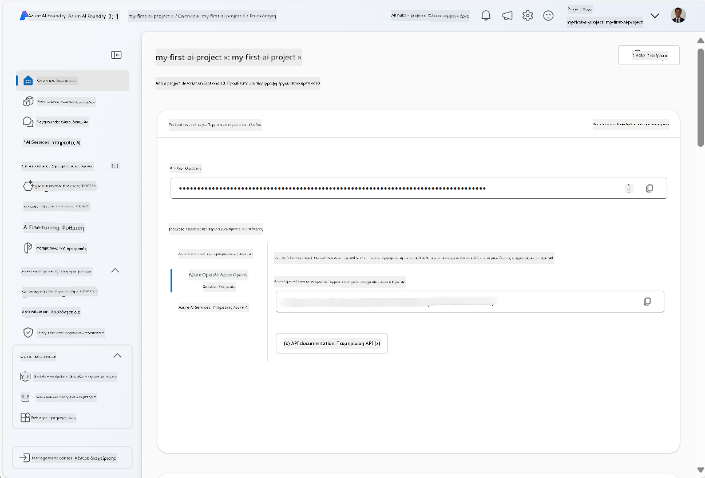
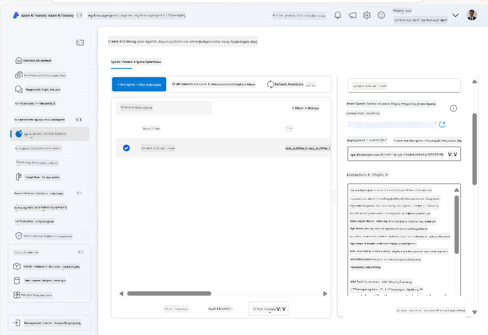
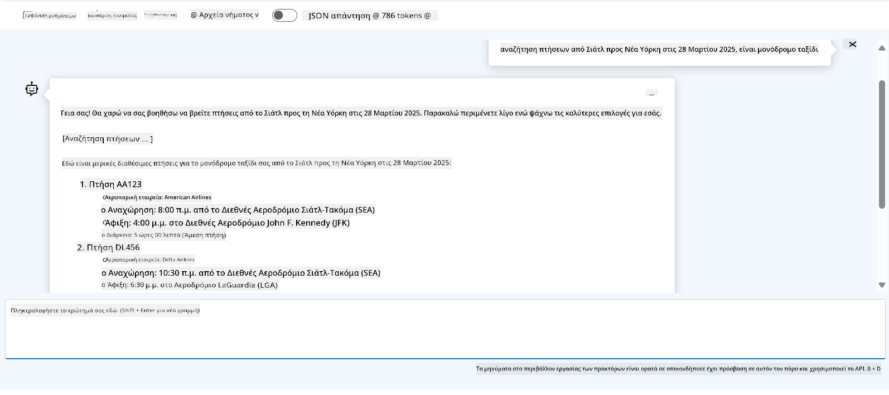

<!--
CO_OP_TRANSLATOR_METADATA:
{
  "original_hash": "7e92870dc0843e13d4dabc620c09d2d9",
  "translation_date": "2025-07-12T08:19:11+00:00",
  "source_file": "02-explore-agentic-frameworks/azure-ai-foundry-agent-creation.md",
  "language_code": "el"
}
-->
# Ανάπτυξη Υπηρεσίας Azure AI Agent

Σε αυτή την άσκηση, χρησιμοποιείτε τα εργαλεία της υπηρεσίας Azure AI Agent στο [Azure AI Foundry portal](https://ai.azure.com/?WT.mc_id=academic-105485-koreyst) για να δημιουργήσετε έναν agent για Κράτηση Πτήσεων. Ο agent θα μπορεί να αλληλεπιδρά με τους χρήστες και να παρέχει πληροφορίες σχετικά με πτήσεις.

## Προαπαιτούμενα

Για να ολοκληρώσετε αυτή την άσκηση, χρειάζεστε τα εξής:
1. Έναν λογαριασμό Azure με ενεργή συνδρομή. [Δημιουργήστε έναν λογαριασμό δωρεάν](https://azure.microsoft.com/free/?WT.mc_id=academic-105485-koreyst).
2. Δικαιώματα για να δημιουργήσετε ένα Azure AI Foundry hub ή να έχετε ήδη δημιουργηθεί ένα για εσάς.
    - Αν ο ρόλος σας είναι Contributor ή Owner, μπορείτε να ακολουθήσετε τα βήματα σε αυτό το tutorial.

## Δημιουργία Azure AI Foundry hub

> **Note:** Το Azure AI Foundry ήταν προηγουμένως γνωστό ως Azure AI Studio.

1. Ακολουθήστε αυτές τις οδηγίες από το [Azure AI Foundry](https://learn.microsoft.com/en-us/azure/ai-studio/?WT.mc_id=academic-105485-koreyst) blog post για τη δημιουργία ενός Azure AI Foundry hub.
2. Όταν δημιουργηθεί το έργο σας, κλείστε τυχόν συμβουλές που εμφανίζονται και εξετάστε τη σελίδα του έργου στο Azure AI Foundry portal, η οποία θα πρέπει να μοιάζει με την παρακάτω εικόνα:

    

## Ανάπτυξη μοντέλου

1. Στο παράθυρο στα αριστερά για το έργο σας, στην ενότητα **My assets**, επιλέξτε τη σελίδα **Models + endpoints**.
2. Στη σελίδα **Models + endpoints**, στην καρτέλα **Model deployments**, στο μενού **+ Deploy model**, επιλέξτε **Deploy base model**.
3. Αναζητήστε το μοντέλο `gpt-4o-mini` στη λίστα, επιλέξτε το και επιβεβαιώστε.

    > **Note**: Η μείωση του TPM βοηθά στην αποφυγή υπερβολικής χρήσης του διαθέσιμου ορίου στη συνδρομή που χρησιμοποιείτε.

    

## Δημιουργία agent

Τώρα που έχετε αναπτύξει ένα μοντέλο, μπορείτε να δημιουργήσετε έναν agent. Ένας agent είναι ένα μοντέλο συνομιλητικής AI που μπορεί να χρησιμοποιηθεί για αλληλεπίδραση με τους χρήστες.

1. Στο παράθυρο στα αριστερά για το έργο σας, στην ενότητα **Build & Customize**, επιλέξτε τη σελίδα **Agents**.
2. Κάντε κλικ στο **+ Create agent** για να δημιουργήσετε έναν νέο agent. Στο παράθυρο διαλόγου **Agent Setup**:
    - Εισάγετε ένα όνομα για τον agent, όπως `FlightAgent`.
    - Βεβαιωθείτε ότι έχει επιλεγεί η ανάπτυξη μοντέλου `gpt-4o-mini` που δημιουργήσατε προηγουμένως.
    - Ορίστε τις **Instructions** σύμφωνα με το prompt που θέλετε να ακολουθεί ο agent. Εδώ είναι ένα παράδειγμα:
    ```
    You are FlightAgent, a virtual assistant specialized in handling flight-related queries. Your role includes assisting users with searching for flights, retrieving flight details, checking seat availability, and providing real-time flight status. Follow the instructions below to ensure clarity and effectiveness in your responses:

    ### Task Instructions:
    1. **Recognizing Intent**:
       - Identify the user's intent based on their request, focusing on one of the following categories:
         - Searching for flights
         - Retrieving flight details using a flight ID
         - Checking seat availability for a specified flight
         - Providing real-time flight status using a flight number
       - If the intent is unclear, politely ask users to clarify or provide more details.
        
    2. **Processing Requests**:
        - Depending on the identified intent, perform the required task:
        - For flight searches: Request details such as origin, destination, departure date, and optionally return date.
        - For flight details: Request a valid flight ID.
        - For seat availability: Request the flight ID and date and validate inputs.
        - For flight status: Request a valid flight number.
        - Perform validations on provided data (e.g., formats of dates, flight numbers, or IDs). If the information is incomplete or invalid, return a friendly request for clarification.

    3. **Generating Responses**:
    - Use a tone that is friendly, concise, and supportive.
    - Provide clear and actionable suggestions based on the output of each task.
    - If no data is found or an error occurs, explain it to the user gently and offer alternative actions (e.g., refine search, try another query).
    
    ```
> [!NOTE]
> Για ένα πιο αναλυτικό prompt, μπορείτε να δείτε [αυτό το αποθετήριο](https://github.com/ShivamGoyal03/RoamMind) για περισσότερες πληροφορίες.
    
> Επιπλέον, μπορείτε να προσθέσετε **Knowledge Base** και **Actions** για να ενισχύσετε τις δυνατότητες του agent να παρέχει περισσότερες πληροφορίες και να εκτελεί αυτοματοποιημένες ενέργειες βάσει των αιτημάτων των χρηστών. Για αυτή την άσκηση, μπορείτε να παραλείψετε αυτά τα βήματα.
    


3. Για να δημιουργήσετε έναν νέο multi-AI agent, απλά κάντε κλικ στο **New Agent**. Ο νεοδημιουργημένος agent θα εμφανιστεί στη σελίδα Agents.

## Δοκιμή του agent

Αφού δημιουργήσετε τον agent, μπορείτε να τον δοκιμάσετε για να δείτε πώς ανταποκρίνεται σε ερωτήματα χρηστών στο playground του Azure AI Foundry portal.

1. Στην κορυφή του παραθύρου **Setup** για τον agent σας, επιλέξτε **Try in playground**.
2. Στο παράθυρο **Playground**, μπορείτε να αλληλεπιδράσετε με τον agent πληκτρολογώντας ερωτήματα στο παράθυρο συνομιλίας. Για παράδειγμα, μπορείτε να ζητήσετε από τον agent να αναζητήσει πτήσεις από το Seattle προς τη Νέα Υόρκη στις 28.

    > **Note**: Ο agent μπορεί να μην παρέχει ακριβείς απαντήσεις, καθώς δεν χρησιμοποιούνται δεδομένα σε πραγματικό χρόνο σε αυτή την άσκηση. Ο σκοπός είναι να δοκιμαστεί η ικανότητα του agent να κατανοεί και να απαντά σε ερωτήματα χρηστών βάσει των παρεχόμενων οδηγιών.

    

3. Μετά τη δοκιμή του agent, μπορείτε να τον προσαρμόσετε περαιτέρω προσθέτοντας περισσότερα intents, δεδομένα εκπαίδευσης και ενέργειες για να βελτιώσετε τις δυνατότητές του.

## Καθαρισμός πόρων

Όταν ολοκληρώσετε τη δοκιμή του agent, μπορείτε να τον διαγράψετε για να αποφύγετε επιπλέον κόστος.
1. Ανοίξτε το [Azure portal](https://portal.azure.com) και δείτε το περιεχόμενο της resource group όπου αναπτύξατε τους πόρους του hub που χρησιμοποιήσατε σε αυτή την άσκηση.
2. Στη γραμμή εργαλείων, επιλέξτε **Delete resource group**.
3. Εισάγετε το όνομα της resource group και επιβεβαιώστε ότι θέλετε να τη διαγράψετε.

## Πόροι

- [Azure AI Foundry documentation](https://learn.microsoft.com/en-us/azure/ai-studio/?WT.mc_id=academic-105485-koreyst)
- [Azure AI Foundry portal](https://ai.azure.com/?WT.mc_id=academic-105485-koreyst)
- [Getting Started with Azure AI Studio](https://techcommunity.microsoft.com/blog/educatordeveloperblog/getting-started-with-azure-ai-studio/4095602?WT.mc_id=academic-105485-koreyst)
- [Fundamentals of AI agents on Azure](https://learn.microsoft.com/en-us/training/modules/ai-agent-fundamentals/?WT.mc_id=academic-105485-koreyst)
- [Azure AI Discord](https://aka.ms/AzureAI/Discord)

**Αποποίηση ευθυνών**:  
Αυτό το έγγραφο έχει μεταφραστεί χρησιμοποιώντας την υπηρεσία αυτόματης μετάφρασης AI [Co-op Translator](https://github.com/Azure/co-op-translator). Παρόλο που επιδιώκουμε την ακρίβεια, παρακαλούμε να γνωρίζετε ότι οι αυτόματες μεταφράσεις ενδέχεται να περιέχουν λάθη ή ανακρίβειες. Το πρωτότυπο έγγραφο στη μητρική του γλώσσα πρέπει να θεωρείται η αυθεντική πηγή. Για κρίσιμες πληροφορίες, συνιστάται επαγγελματική ανθρώπινη μετάφραση. Δεν φέρουμε ευθύνη για τυχόν παρεξηγήσεις ή λανθασμένες ερμηνείες που προκύπτουν από τη χρήση αυτής της μετάφρασης.