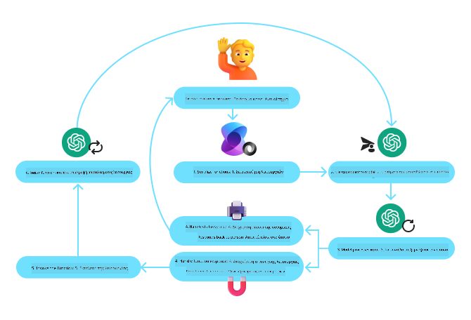

<!--
CO_OP_TRANSLATOR_METADATA:
{
  "original_hash": "88258b03f2893aa2e69eb8fb24baabbc",
  "translation_date": "2025-07-12T09:34:46+00:00",
  "source_file": "04-tool-use/README.md",
  "language_code": "el"
}
-->
[](https://youtu.be/vieRiPRx-gI?si=cEZ8ApnT6Sus9rhn)

> _(Κάντε κλικ στην εικόνα παραπάνω για να δείτε το βίντεο αυτού του μαθήματος)_

# Σχεδιαστικό Πρότυπο Χρήσης Εργαλείων

Τα εργαλεία είναι ενδιαφέροντα γιατί επιτρέπουν στους πράκτορες ΤΝ να έχουν ευρύτερο φάσμα δυνατοτήτων. Αντί ο πράκτορας να έχει ένα περιορισμένο σύνολο ενεργειών που μπορεί να εκτελέσει, με την προσθήκη ενός εργαλείου, ο πράκτορας μπορεί πλέον να εκτελέσει μια μεγάλη γκάμα ενεργειών. Σε αυτό το κεφάλαιο, θα εξετάσουμε το Σχεδιαστικό Πρότυπο Χρήσης Εργαλείων, που περιγράφει πώς οι πράκτορες ΤΝ μπορούν να χρησιμοποιούν συγκεκριμένα εργαλεία για να πετύχουν τους στόχους τους.

## Εισαγωγή

Σε αυτό το μάθημα, θα προσπαθήσουμε να απαντήσουμε στις εξής ερωτήσεις:

- Τι είναι το σχεδιαστικό πρότυπο χρήσης εργαλείων;
- Σε ποιες περιπτώσεις χρήσης μπορεί να εφαρμοστεί;
- Ποια είναι τα στοιχεία/δομικά κομμάτια που χρειάζονται για την υλοποίηση του προτύπου;
- Ποιες είναι οι ειδικές παράμετροι που πρέπει να ληφθούν υπόψη για τη χρήση του Σχεδιαστικού Προτύπου Χρήσης Εργαλείων ώστε να δημιουργηθούν αξιόπιστοι πράκτορες ΤΝ;

## Στόχοι Μάθησης

Μετά την ολοκλήρωση αυτού του μαθήματος, θα μπορείτε να:

- Ορίσετε το Σχεδιαστικό Πρότυπο Χρήσης Εργαλείων και τον σκοπό του.
- Αναγνωρίζετε περιπτώσεις χρήσης όπου το πρότυπο είναι εφαρμόσιμο.
- Κατανοείτε τα βασικά στοιχεία που απαιτούνται για την υλοποίηση του προτύπου.
- Αναγνωρίζετε παράγοντες που διασφαλίζουν την αξιοπιστία των πρακτόρων ΤΝ που χρησιμοποιούν αυτό το πρότυπο.

## Τι είναι το Σχεδιαστικό Πρότυπο Χρήσης Εργαλείων;

Το **Σχεδιαστικό Πρότυπο Χρήσης Εργαλείων** εστιάζει στο να δώσει στα LLMs τη δυνατότητα να αλληλεπιδρούν με εξωτερικά εργαλεία για να πετύχουν συγκεκριμένους στόχους. Τα εργαλεία είναι κώδικας που μπορεί να εκτελεστεί από έναν πράκτορα για να εκτελέσει ενέργειες. Ένα εργαλείο μπορεί να είναι μια απλή συνάρτηση όπως ένας υπολογιστής, ή μια κλήση API σε μια υπηρεσία τρίτου μέρους όπως αναζήτηση τιμών μετοχών ή πρόβλεψη καιρού. Στο πλαίσιο των πρακτόρων ΤΝ, τα εργαλεία σχεδιάζονται ώστε να εκτελούνται από τους πράκτορες ως απάντηση σε **κλήσεις συναρτήσεων που παράγονται από το μοντέλο**.

## Σε ποιες περιπτώσεις χρήσης μπορεί να εφαρμοστεί;

Οι πράκτορες ΤΝ μπορούν να αξιοποιήσουν εργαλεία για να ολοκληρώσουν σύνθετες εργασίες, να ανακτήσουν πληροφορίες ή να λάβουν αποφάσεις. Το σχεδιαστικό πρότυπο χρήσης εργαλείων χρησιμοποιείται συχνά σε σενάρια που απαιτούν δυναμική αλληλεπίδραση με εξωτερικά συστήματα, όπως βάσεις δεδομένων, διαδικτυακές υπηρεσίες ή διερμηνείς κώδικα. Αυτή η δυνατότητα είναι χρήσιμη για διάφορες περιπτώσεις χρήσης, όπως:

- **Δυναμική Ανάκτηση Πληροφοριών:** Οι πράκτορες μπορούν να κάνουν ερωτήματα σε εξωτερικά APIs ή βάσεις δεδομένων για να φέρουν ενημερωμένα δεδομένα (π.χ. ερώτημα σε βάση SQLite για ανάλυση δεδομένων, ανάκτηση τιμών μετοχών ή πληροφοριών καιρού).
- **Εκτέλεση και Ερμηνεία Κώδικα:** Οι πράκτορες μπορούν να εκτελέσουν κώδικα ή σενάρια για να λύσουν μαθηματικά προβλήματα, να δημιουργήσουν αναφορές ή να πραγματοποιήσουν προσομοιώσεις.
- **Αυτοματοποίηση Ροών Εργασίας:** Αυτοματοποίηση επαναλαμβανόμενων ή πολυβηματικών ροών εργασίας μέσω ενσωμάτωσης εργαλείων όπως προγραμματιστές εργασιών, υπηρεσίες email ή pipelines δεδομένων.
- **Υποστήριξη Πελατών:** Οι πράκτορες μπορούν να αλληλεπιδρούν με συστήματα CRM, πλατφόρμες διαχείρισης αιτημάτων ή βάσεις γνώσης για να επιλύουν ερωτήματα χρηστών.
- **Δημιουργία και Επεξεργασία Περιεχομένου:** Οι πράκτορες μπορούν να χρησιμοποιήσουν εργαλεία όπως διορθωτές γραμματικής, συνοψιστές κειμένου ή αξιολογητές ασφάλειας περιεχομένου για να βοηθήσουν σε εργασίες δημιουργίας περιεχομένου.

## Ποια είναι τα στοιχεία/δομικά κομμάτια που χρειάζονται για την υλοποίηση του σχεδιαστικού προτύπου χρήσης εργαλείων;

Αυτά τα δομικά κομμάτια επιτρέπουν στον πράκτορα ΤΝ να εκτελεί ένα ευρύ φάσμα εργασιών. Ας δούμε τα βασικά στοιχεία που απαιτούνται για την υλοποίηση του Σχεδιαστικού Προτύπου Χρήσης Εργαλείων:

- **Σχήματα Συναρτήσεων/Εργαλείων**: Αναλυτικοί ορισμοί των διαθέσιμων εργαλείων, συμπεριλαμβανομένου του ονόματος της συνάρτησης, του σκοπού, των απαιτούμενων παραμέτρων και των αναμενόμενων αποτελεσμάτων. Αυτά τα σχήματα επιτρέπουν στο LLM να κατανοήσει ποια εργαλεία είναι διαθέσιμα και πώς να κατασκευάσει έγκυρα αιτήματα.

- **Λογική Εκτέλεσης Συναρτήσεων**: Καθορίζει πώς και πότε καλούνται τα εργαλεία με βάση την πρόθεση του χρήστη και το πλαίσιο της συνομιλίας. Αυτό μπορεί να περιλαμβάνει μονάδες σχεδιασμού, μηχανισμούς δρομολόγησης ή ροές με συνθήκες που καθορίζουν δυναμικά τη χρήση εργαλείων.

- **Σύστημα Διαχείρισης Μηνυμάτων**: Συστατικά που διαχειρίζονται τη ροή της συνομιλίας μεταξύ εισόδων χρήστη, απαντήσεων LLM, κλήσεων εργαλείων και αποτελεσμάτων εργαλείων.

- **Πλαίσιο Ενσωμάτωσης Εργαλείων**: Υποδομή που συνδέει τον πράκτορα με διάφορα εργαλεία, είτε πρόκειται για απλές συναρτήσεις είτε για σύνθετες εξωτερικές υπηρεσίες.

- **Διαχείριση Σφαλμάτων & Επικύρωση**: Μηχανισμοί για την αντιμετώπιση αποτυχιών στην εκτέλεση εργαλείων, την επικύρωση παραμέτρων και τη διαχείριση απρόβλεπτων απαντήσεων.

- **Διαχείριση Κατάστασης**: Παρακολουθεί το πλαίσιο της συνομιλίας, προηγούμενες αλληλεπιδράσεις με εργαλεία και επίμονα δεδομένα για να διασφαλίσει συνέπεια σε πολυβηματικές αλληλεπιδράσεις.

Στη συνέχεια, ας δούμε πιο αναλυτικά την Κλήση Συναρτήσεων/Εργαλείων.

### Κλήση Συναρτήσεων/Εργαλείων

Η κλήση συναρτήσεων είναι ο βασικός τρόπος με τον οποίο δίνουμε στα Μεγάλα Γλωσσικά Μοντέλα (LLMs) τη δυνατότητα να αλληλεπιδρούν με εργαλεία. Συχνά θα δείτε τους όρους 'Function' και 'Tool' να χρησιμοποιούνται εναλλακτικά, γιατί οι 'συναρτήσεις' (μπλοκ επαναχρησιμοποιήσιμου κώδικα) είναι τα 'εργαλεία' που χρησιμοποιούν οι πράκτορες για να εκτελέσουν εργασίες. Για να εκτελεστεί ο κώδικας μιας συνάρτησης, το LLM πρέπει να συγκρίνει το αίτημα του χρήστη με την περιγραφή της συνάρτησης. Για αυτό, ένα σχήμα που περιέχει τις περιγραφές όλων των διαθέσιμων συναρτήσεων αποστέλλεται στο LLM. Το LLM επιλέγει την πιο κατάλληλη συνάρτηση για την εργασία και επιστρέφει το όνομά της και τα επιχειρήματά της. Η επιλεγμένη συνάρτηση καλείται, η απάντησή της αποστέλλεται πίσω στο LLM, το οποίο χρησιμοποιεί τις πληροφορίες για να απαντήσει στο αίτημα του χρήστη.

Για να υλοποιήσουν οι προγραμματιστές την κλήση συναρτήσεων για πράκτορες, θα χρειαστούν:

1. Ένα μοντέλο LLM που υποστηρίζει κλήση συναρτήσεων
2. Ένα σχήμα που περιέχει τις περιγραφές των συναρτήσεων
3. Τον κώδικα για κάθε περιγραφόμενη συνάρτηση

Ας χρησιμοποιήσουμε το παράδειγμα της λήψης της τρέχουσας ώρας σε μια πόλη για να το εξηγήσουμε:

1. **Αρχικοποίηση ενός LLM που υποστηρίζει κλήση συναρτήσεων:**

    Δεν υποστηρίζουν όλα τα μοντέλα κλήση συναρτήσεων, οπότε είναι σημαντικό να ελέγξετε αν το LLM που χρησιμοποιείτε το υποστηρίζει. Το <a href="https://learn.microsoft.com/azure/ai-services/openai/how-to/function-calling" target="_blank">Azure OpenAI</a> υποστηρίζει κλήση συναρτήσεων. Μπορούμε να ξεκινήσουμε δημιουργώντας τον πελάτη Azure OpenAI.

    ```python
    # Initialize the Azure OpenAI client
    client = AzureOpenAI(
        azure_endpoint = os.getenv("AZURE_OPENAI_ENDPOINT"), 
        api_key=os.getenv("AZURE_OPENAI_API_KEY"),  
        api_version="2024-05-01-preview"
    )
    ```

1. **Δημιουργία Σχήματος Συνάρτησης:**

    Στη συνέχεια, θα ορίσουμε ένα JSON σχήμα που περιέχει το όνομα της συνάρτησης, την περιγραφή του τι κάνει η συνάρτηση, και τα ονόματα και τις περιγραφές των παραμέτρων της. Έπειτα, θα περάσουμε αυτό το σχήμα στον πελάτη που δημιουργήσαμε προηγουμένως, μαζί με το αίτημα του χρήστη να βρει την ώρα στο San Francisco. Σημαντικό να σημειωθεί είναι ότι αυτό που επιστρέφεται είναι μια **κλήση εργαλείου**, **όχι** η τελική απάντηση στην ερώτηση. Όπως αναφέρθηκε νωρίτερα, το LLM επιστρέφει το όνομα της συνάρτησης που επέλεξε για την εργασία και τα επιχειρήματα που θα περαστούν σε αυτή.

    ```python
    # Function description for the model to read
    tools = [
        {
            "type": "function",
            "function": {
                "name": "get_current_time",
                "description": "Get the current time in a given location",
                "parameters": {
                    "type": "object",
                    "properties": {
                        "location": {
                            "type": "string",
                            "description": "The city name, e.g. San Francisco",
                        },
                    },
                    "required": ["location"],
                },
            }
        }
    ]
    ```
   
    ```python
  
    # Initial user message
    messages = [{"role": "user", "content": "What's the current time in San Francisco"}] 
  
    # First API call: Ask the model to use the function
      response = client.chat.completions.create(
          model=deployment_name,
          messages=messages,
          tools=tools,
          tool_choice="auto",
      )
  
      # Process the model's response
      response_message = response.choices[0].message
      messages.append(response_message)
  
      print("Model's response:")  

      print(response_message)
  
    ```

    ```bash
    Model's response:
    ChatCompletionMessage(content=None, role='assistant', function_call=None, tool_calls=[ChatCompletionMessageToolCall(id='call_pOsKdUlqvdyttYB67MOj434b', function=Function(arguments='{"location":"San Francisco"}', name='get_current_time'), type='function')])
    ```
  
1. **Ο κώδικας της συνάρτησης που απαιτείται για την εκτέλεση της εργασίας:**

    Τώρα που το LLM έχει επιλέξει ποια συνάρτηση πρέπει να εκτελεστεί, ο κώδικας που εκτελεί την εργασία πρέπει να υλοποιηθεί και να εκτελεστεί. Μπορούμε να υλοποιήσουμε τον κώδικα για να πάρουμε την τρέχουσα ώρα σε Python. Θα χρειαστεί επίσης να γράψουμε τον κώδικα για να εξάγουμε το όνομα και τα επιχειρήματα από το response_message για να πάρουμε το τελικό αποτέλεσμα.

    ```python
      def get_current_time(location):
        """Get the current time for a given location"""
        print(f"get_current_time called with location: {location}")  
        location_lower = location.lower()
        
        for key, timezone in TIMEZONE_DATA.items():
            if key in location_lower:
                print(f"Timezone found for {key}")  
                current_time = datetime.now(ZoneInfo(timezone)).strftime("%I:%M %p")
                return json.dumps({
                    "location": location,
                    "current_time": current_time
                })
      
        print(f"No timezone data found for {location_lower}")  
        return json.dumps({"location": location, "current_time": "unknown"})
    ```

    ```python
     # Handle function calls
      if response_message.tool_calls:
          for tool_call in response_message.tool_calls:
              if tool_call.function.name == "get_current_time":
     
                  function_args = json.loads(tool_call.function.arguments)
     
                  time_response = get_current_time(
                      location=function_args.get("location")
                  )
     
                  messages.append({
                      "tool_call_id": tool_call.id,
                      "role": "tool",
                      "name": "get_current_time",
                      "content": time_response,
                  })
      else:
          print("No tool calls were made by the model.")  
  
      # Second API call: Get the final response from the model
      final_response = client.chat.completions.create(
          model=deployment_name,
          messages=messages,
      )
  
      return final_response.choices[0].message.content
     ```

    ```bash
      get_current_time called with location: San Francisco
      Timezone found for san francisco
      The current time in San Francisco is 09:24 AM.
     ```

Η Κλήση Συναρτήσεων είναι στο επίκεντρο των περισσότερων, αν όχι όλων, σχεδιαστικών προτύπων χρήσης εργαλείων για πράκτορες, ωστόσο η υλοποίησή της από το μηδέν μπορεί μερικές φορές να είναι απαιτητική. Όπως μάθαμε στο [Μάθημα 2](../../../02-explore-agentic-frameworks), τα agentic frameworks μας παρέχουν προ-κατασκευασμένα δομικά κομμάτια για την υλοποίηση χρήσης εργαλείων.

## Παραδείγματα Χρήσης Εργαλείων με Agentic Frameworks

Ακολουθούν μερικά παραδείγματα για το πώς μπορείτε να υλοποιήσετε το Σχεδιαστικό Πρότυπο Χρήσης Εργαλείων χρησιμοποιώντας διάφορα agentic frameworks:

### Semantic Kernel

Το <a href="https://learn.microsoft.com/azure/ai-services/agents/overview" target="_blank">Semantic Kernel</a> είναι ένα ανοιχτού κώδικα πλαίσιο ΤΝ για προγραμματιστές .NET, Python και Java που δουλεύουν με Μεγάλα Γλωσσικά Μοντέλα (LLMs). Απλοποιεί τη διαδικασία χρήσης κλήσης συναρτήσεων περιγράφοντας αυτόματα τις συναρτήσεις σας και τις παραμέτρους τους στο μοντέλο μέσω μιας διαδικασίας που ονομάζεται <a href="https://learn.microsoft.com/semantic-kernel/concepts/ai-services/chat-completion/function-calling/?pivots=programming-language-python#1-serializing-the-functions" target="_blank">σειριοποίηση</a>. Επίσης, διαχειρίζεται την αμφίδρομη επικοινωνία μεταξύ του μοντέλου και του κώδικά σας. Ένα ακόμα πλεονέκτημα της χρήσης ενός agentic framework όπως το Semantic Kernel, είναι ότι σας επιτρέπει να έχετε πρόσβαση σε προ-κατασκευασμένα εργαλεία όπως το <a href="https://github.com/microsoft/semantic-kernel/blob/main/python/samples/getting_started_with_agents/openai_assistant/step4_assistant_tool_file_search.py" target="_blank">File Search</a> και το <a href="https://github.com/microsoft/semantic-kernel/blob/main/python/samples/getting_started_with_agents/openai_assistant/step3_assistant_tool_code_interpreter.py" target="_blank">Code Interpreter</a>.

Το παρακάτω διάγραμμα απεικονίζει τη διαδικασία κλήσης συναρτήσεων με το Semantic Kernel:



Στο Semantic Kernel, οι συναρτήσεις/εργαλεία ονομάζονται <a href="https://learn.microsoft.com/semantic-kernel/concepts/plugins/?pivots=programming-language-python" target="_blank">Plugins</a>. Μπορούμε να μετατρέψουμε τη συνάρτηση `get_current_time` που είδαμε νωρίτερα σε plugin, μετατρέποντάς την σε κλάση που περιέχει τη συνάρτηση. Μπορούμε επίσης να εισάγουμε το διακοσμητή `kernel_function`, ο οποίος δέχεται την περιγραφή της συνάρτησης. Όταν δημιουργήσετε έναν kernel με το GetCurrentTimePlugin, ο kernel θα σειριοποιήσει αυτόματα τη συνάρτηση και τις παραμέτρους της, δημιουργώντας το σχήμα που θα σταλεί στο LLM στη διαδικασία.

```python
from semantic_kernel.functions import kernel_function

class GetCurrentTimePlugin:
    async def __init__(self, location):
        self.location = location

    @kernel_function(
        description="Get the current time for a given location"
    )
    def get_current_time(location: str = ""):
        ...

```

```python 
from semantic_kernel import Kernel

# Create the kernel
kernel = Kernel()

# Create the plugin
get_current_time_plugin = GetCurrentTimePlugin(location)

# Add the plugin to the kernel
kernel.add_plugin(get_current_time_plugin)
```
  
### Azure AI Agent Service

Το <a href="https://learn.microsoft.com/azure/ai-services/agents/overview" target="_blank">Azure AI Agent Service</a> είναι ένα νεότερο agentic framework σχεδιασμένο να δίνει τη δυνατότητα στους προγραμματιστές να δημιουργούν, να αναπτύσσουν και να κλιμακώνουν με ασφάλεια υψηλής ποιότητας και επεκτάσιμους πράκτορες ΤΝ χωρίς να χρειάζεται να διαχειρίζονται τους υποκείμενους πόρους υπολογισμού και αποθήκευσης. Είναι ιδιαίτερα χρήσιμο για επιχειρησιακές εφαρμογές, καθώς είναι μια πλήρως διαχειριζόμενη υπηρεσία με ασφάλεια επιπέδου επιχείρησης.

Σε σύγκριση με την ανάπτυξη απευθείας με το API του LLM, το Azure AI Agent Service προσφέρει κάποια πλεονεκτήματα, όπως:

- Αυτόματη κλήση εργαλείων – δεν χρειάζεται να αναλύσετε μια κλήση εργαλείου, να καλέσετε το εργαλείο και να διαχειριστείτε την απάντηση· όλα αυτά γίνονται πλέον στην πλευρά του διακομιστή
- Ασφαλής διαχείριση δεδομένων – αντί να διαχειρίζεστε την κατάσταση της συνομιλίας μόνοι σας, μπορείτε να βασιστείτε σε threads που αποθηκεύουν όλες τις απαραίτητες πληροφορίες
- Έτοιμα προς χρήση εργαλεία – εργαλεία που μπορείτε να χρησιμοποιήσετε για να αλληλεπιδράσετε με τις πηγές δεδομένων σας, όπως Bing, Azure AI Search και Azure Functions.

Τα εργαλεία που είναι διαθέσιμα στο Azure AI Agent Service χωρίζονται σε δύο κατηγορίες:

1. Εργαλεία Γνώσης:
    - <a href="https://learn.microsoft.com/azure/ai-services/agents/how-to/tools/bing-grounding?tabs=python&pivots=overview" target="_blank">Grounding με Bing Search</a>
    - <a href="https://learn.microsoft.com/azure/ai-services/agents/how-to/tools
<a href="https://microsoft.github.io/build-your-first-agent-with-azure-ai-agent-service-workshop/" target="_blank">
Azure AI Agents Service Workshop</a>
- <a href="https://github.com/Azure-Samples/contoso-creative-writer/tree/main/docs/workshop" target="_blank">Εργαστήριο Πολλαπλών Πρακτόρων Contoso Creative Writer</a>
- <a href="https://learn.microsoft.com/semantic-kernel/concepts/ai-services/chat-completion/function-calling/?pivots=programming-language-python#1-serializing-the-functions" target="_blank">Οδηγός Κλήσης Συναρτήσεων Semantic Kernel</a>
- <a href="https://github.com/microsoft/semantic-kernel/blob/main/python/samples/getting_started_with_agents/openai_assistant/step3_assistant_tool_code_interpreter.py" target="_blank">Semantic Kernel Code Interpreter</a>
- <a href="https://microsoft.github.io/autogen/dev/user-guide/core-user-guide/components/tools.html" target="_blank">Εργαλεία Autogen</a>

## Προηγούμενο Μάθημα

[Κατανόηση των Agentic Design Patterns](../03-agentic-design-patterns/README.md)

## Επόμενο Μάθημα

[Agentic RAG](../05-agentic-rag/README.md)

**Αποποίηση ευθυνών**:  
Αυτό το έγγραφο έχει μεταφραστεί χρησιμοποιώντας την υπηρεσία αυτόματης μετάφρασης AI [Co-op Translator](https://github.com/Azure/co-op-translator). Παρόλο που επιδιώκουμε την ακρίβεια, παρακαλούμε να γνωρίζετε ότι οι αυτόματες μεταφράσεις ενδέχεται να περιέχουν λάθη ή ανακρίβειες. Το πρωτότυπο έγγραφο στη μητρική του γλώσσα πρέπει να θεωρείται η αυθεντική πηγή. Για κρίσιμες πληροφορίες, συνιστάται επαγγελματική ανθρώπινη μετάφραση. Δεν φέρουμε ευθύνη για τυχόν παρεξηγήσεις ή λανθασμένες ερμηνείες που προκύπτουν από τη χρήση αυτής της μετάφρασης.