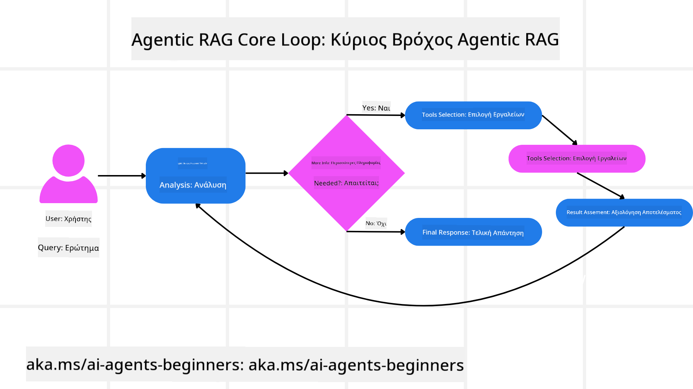
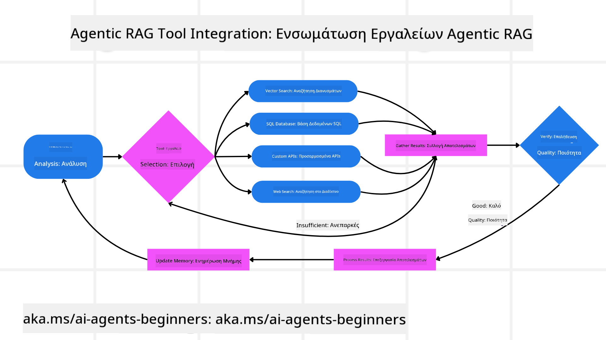
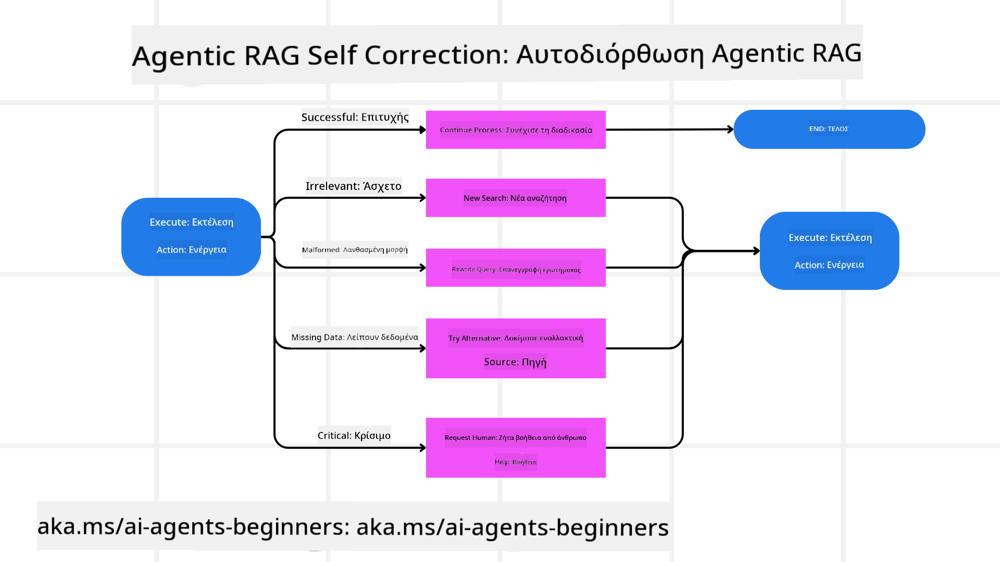

<!--
CO_OP_TRANSLATOR_METADATA:
{
  "original_hash": "7622aa72f9e676e593339f5f694ecd7d",
  "translation_date": "2025-07-12T10:03:03+00:00",
  "source_file": "05-agentic-rag/README.md",
  "language_code": "el"
}
-->

> _(Κάντε κλικ στην εικόνα παραπάνω για να δείτε το βίντεο αυτού του μαθήματος)_

# Agentic RAG

Αυτό το μάθημα προσφέρει μια ολοκληρωμένη επισκόπηση του Agentic Retrieval-Augmented Generation (Agentic RAG), ενός αναδυόμενου παραδείγματος τεχνητής νοημοσύνης όπου μεγάλα γλωσσικά μοντέλα (LLMs) σχεδιάζουν αυτόνομα τα επόμενα βήματά τους ενώ αντλούν πληροφορίες από εξωτερικές πηγές. Σε αντίθεση με τα στατικά μοτίβα ανάκτησης-και-ανάγνωσης, το Agentic RAG περιλαμβάνει επαναλαμβανόμενες κλήσεις προς το LLM, διακοπτόμενες από κλήσεις εργαλείων ή συναρτήσεων και δομημένες εξόδους. Το σύστημα αξιολογεί τα αποτελέσματα, βελτιώνει τα ερωτήματα, καλεί επιπλέον εργαλεία αν χρειαστεί και συνεχίζει αυτόν τον κύκλο μέχρι να επιτευχθεί μια ικανοποιητική λύση.

## Εισαγωγή

Αυτό το μάθημα θα καλύψει

- **Κατανόηση του Agentic RAG:** Μάθετε για το αναδυόμενο παράδειγμα στην τεχνητή νοημοσύνη όπου μεγάλα γλωσσικά μοντέλα (LLMs) σχεδιάζουν αυτόνομα τα επόμενα βήματά τους ενώ αντλούν πληροφορίες από εξωτερικές πηγές δεδομένων.
- **Κατανόηση του Επαναληπτικού Στυλ Maker-Checker:** Κατανοήστε τον κύκλο επαναλαμβανόμενων κλήσεων προς το LLM, διακοπτόμενων από κλήσεις εργαλείων ή συναρτήσεων και δομημένες εξόδους, σχεδιασμένο να βελτιώνει την ορθότητα και να χειρίζεται κακοσχηματισμένα ερωτήματα.
- **Εξερεύνηση Πρακτικών Εφαρμογών:** Αναγνωρίστε σενάρια όπου το Agentic RAG ξεχωρίζει, όπως περιβάλλοντα που δίνουν προτεραιότητα στην ορθότητα, πολύπλοκες αλληλεπιδράσεις με βάσεις δεδομένων και εκτεταμένες ροές εργασίας.

## Στόχοι Μάθησης

Μετά την ολοκλήρωση αυτού του μαθήματος, θα γνωρίζετε/κατανοείτε:

- **Κατανόηση του Agentic RAG:** Μάθετε για το αναδυόμενο παράδειγμα στην τεχνητή νοημοσύνη όπου μεγάλα γλωσσικά μοντέλα (LLMs) σχεδιάζουν αυτόνομα τα επόμενα βήματά τους ενώ αντλούν πληροφορίες από εξωτερικές πηγές δεδομένων.
- **Επαναληπτικό Στυλ Maker-Checker:** Κατανοήστε την έννοια ενός κύκλου επαναλαμβανόμενων κλήσεων προς το LLM, διακοπτόμενων από κλήσεις εργαλείων ή συναρτήσεων και δομημένες εξόδους, σχεδιασμένο να βελτιώνει την ορθότητα και να χειρίζεται κακοσχηματισμένα ερωτήματα.
- **Έλεγχος της Διαδικασίας Λογισμού:** Κατανοήστε την ικανότητα του συστήματος να ελέγχει τη διαδικασία λογισμού του, λαμβάνοντας αποφάσεις για το πώς να προσεγγίσει τα προβλήματα χωρίς να βασίζεται σε προκαθορισμένες διαδρομές.
- **Ροή Εργασίας:** Κατανοήστε πώς ένα agentic μοντέλο αποφασίζει ανεξάρτητα να ανακτήσει αναφορές τάσεων αγοράς, να εντοπίσει δεδομένα ανταγωνιστών, να συσχετίσει εσωτερικά μετρικά πωλήσεων, να συνθέσει τα ευρήματα και να αξιολογήσει τη στρατηγική.
- **Επαναληπτικοί Κύκλοι, Ενσωμάτωση Εργαλείων και Μνήμη:** Μάθετε για την εξάρτηση του συστήματος από ένα επαναληπτικό μοτίβο αλληλεπίδρασης, διατηρώντας κατάσταση και μνήμη σε κάθε βήμα για να αποφύγει επαναλαμβανόμενους κύκλους και να λαμβάνει ενημερωμένες αποφάσεις.
- **Διαχείριση Αποτυχιών και Αυτοδιόρθωση:** Εξερευνήστε τους ισχυρούς μηχανισμούς αυτοδιόρθωσης του συστήματος, συμπεριλαμβανομένης της επανάληψης και επανερωτήσεων, της χρήσης διαγνωστικών εργαλείων και της προσφυγής σε ανθρώπινη επίβλεψη.
- **Όρια της Αυτονομίας:** Κατανοήστε τους περιορισμούς του Agentic RAG, εστιάζοντας στην αυτονομία συγκεκριμένου τομέα, την εξάρτηση από την υποδομή και τον σεβασμό στους κανόνες ασφαλείας.
- **Πρακτικές Χρήσεις και Αξία:** Αναγνωρίστε σενάρια όπου το Agentic RAG ξεχωρίζει, όπως περιβάλλοντα που δίνουν προτεραιότητα στην ορθότητα, πολύπλοκες αλληλεπιδράσεις με βάσεις δεδομένων και εκτεταμένες ροές εργασίας.
- **Διακυβέρνηση, Διαφάνεια και Εμπιστοσύνη:** Μάθετε για τη σημασία της διακυβέρνησης και της διαφάνειας, συμπεριλαμβανομένης της εξηγήσιμης λογικής, του ελέγχου προκαταλήψεων και της ανθρώπινης επίβλεψης.

## Τι είναι το Agentic RAG;

Το Agentic Retrieval-Augmented Generation (Agentic RAG) είναι ένα αναδυόμενο παράδειγμα τεχνητής νοημοσύνης όπου μεγάλα γλωσσικά μοντέλα (LLMs) σχεδιάζουν αυτόνομα τα επόμενα βήματά τους ενώ αντλούν πληροφορίες από εξωτερικές πηγές. Σε αντίθεση με τα στατικά μοτίβα ανάκτησης-και-ανάγνωσης, το Agentic RAG περιλαμβάνει επαναλαμβανόμενες κλήσεις προς το LLM, διακοπτόμενες από κλήσεις εργαλείων ή συναρτήσεων και δομημένες εξόδους. Το σύστημα αξιολογεί τα αποτελέσματα, βελτιώνει τα ερωτήματα, καλεί επιπλέον εργαλεία αν χρειαστεί και συνεχίζει αυτόν τον κύκλο μέχρι να επιτευχθεί μια ικανοποιητική λύση. Αυτό το επαναληπτικό στυλ “maker-checker” βελτιώνει την ορθότητα, χειρίζεται κακοσχηματισμένα ερωτήματα και εξασφαλίζει αποτελέσματα υψηλής ποιότητας.

Το σύστημα ελέγχει ενεργά τη διαδικασία λογισμού του, ξαναγράφοντας αποτυχημένα ερωτήματα, επιλέγοντας διαφορετικές μεθόδους ανάκτησης και ενσωματώνοντας πολλαπλά εργαλεία — όπως αναζήτηση διανυσμάτων στο Azure AI Search, βάσεις δεδομένων SQL ή προσαρμοσμένα APIs — πριν οριστικοποιήσει την απάντησή του. Το χαρακτηριστικό που ξεχωρίζει ένα agentic σύστημα είναι η ικανότητά του να ελέγχει τη διαδικασία λογισμού του. Οι παραδοσιακές υλοποιήσεις RAG βασίζονται σε προκαθορισμένες διαδρομές, ενώ ένα agentic σύστημα καθορίζει αυτόνομα τη σειρά των βημάτων με βάση την ποιότητα των πληροφοριών που βρίσκει.

## Ορισμός του Agentic Retrieval-Augmented Generation (Agentic RAG)

Το Agentic Retrieval-Augmented Generation (Agentic RAG) είναι ένα αναδυόμενο παράδειγμα στην ανάπτυξη τεχνητής νοημοσύνης όπου τα LLMs όχι μόνο αντλούν πληροφορίες από εξωτερικές πηγές δεδομένων, αλλά και σχεδιάζουν αυτόνομα τα επόμενα βήματά τους. Σε αντίθεση με τα στατικά μοτίβα ανάκτησης-και-ανάγνωσης ή τις προσεκτικά γραμμένες αλληλουχίες προτροπών, το Agentic RAG περιλαμβάνει έναν κύκλο επαναλαμβανόμενων κλήσεων προς το LLM, διακοπτόμενων από κλήσεις εργαλείων ή συναρτήσεων και δομημένες εξόδους. Σε κάθε βήμα, το σύστημα αξιολογεί τα αποτελέσματα που έχει λάβει, αποφασίζει αν θα βελτιώσει τα ερωτήματά του, καλεί επιπλέον εργαλεία αν χρειαστεί και συνεχίζει αυτόν τον κύκλο μέχρι να επιτύχει μια ικανοποιητική λύση.

Αυτό το επαναληπτικό στυλ λειτουργίας “maker-checker” έχει σχεδιαστεί για να βελτιώνει την ορθότητα, να χειρίζεται κακοσχηματισμένα ερωτήματα σε δομημένες βάσεις δεδομένων (π.χ. NL2SQL) και να εξασφαλίζει ισορροπημένα, ποιοτικά αποτελέσματα. Αντί να βασίζεται αποκλειστικά σε προσεκτικά σχεδιασμένες αλυσίδες προτροπών, το σύστημα ελέγχει ενεργά τη διαδικασία λογισμού του. Μπορεί να ξαναγράψει αποτυχημένα ερωτήματα, να επιλέξει διαφορετικές μεθόδους ανάκτησης και να ενσωματώσει πολλαπλά εργαλεία — όπως αναζήτηση διανυσμάτων στο Azure AI Search, βάσεις δεδομένων SQL ή προσαρμοσμένα APIs — πριν οριστικοποιήσει την απάντησή του. Αυτό αφαιρεί την ανάγκη για υπερβολικά πολύπλοκα πλαίσια ορχήστρωσης. Αντίθετα, ένας σχετικά απλός κύκλος “κλήση LLM → χρήση εργαλείου → κλήση LLM → …” μπορεί να παράγει εξελιγμένες και καλά τεκμηριωμένες εξόδους.

## Έλεγχος της Διαδικασίας Λογισμού

Το χαρακτηριστικό που καθιστά ένα σύστημα “agentic” είναι η ικανότητά του να ελέγχει τη διαδικασία λογισμού του. Οι παραδοσιακές υλοποιήσεις RAG συχνά εξαρτώνται από ανθρώπους που ορίζουν εκ των προτέρων μια διαδρομή για το μοντέλο: μια αλυσίδα σκέψης που καθορίζει τι να ανακτηθεί και πότε.  
Όταν όμως ένα σύστημα είναι πραγματικά agentic, αποφασίζει εσωτερικά πώς να προσεγγίσει το πρόβλημα. Δεν εκτελεί απλώς ένα σενάριο· καθορίζει αυτόνομα τη σειρά των βημάτων με βάση την ποιότητα των πληροφοριών που βρίσκει.  
Για παράδειγμα, αν του ζητηθεί να δημιουργήσει μια στρατηγική λανσαρίσματος προϊόντος, δεν βασίζεται μόνο σε μια προτροπή που περιγράφει ολόκληρη τη ροή έρευνας και λήψης αποφάσεων. Αντίθετα, το agentic μοντέλο αποφασίζει ανεξάρτητα να:

1. Ανακτήσει τρέχουσες αναφορές τάσεων αγοράς χρησιμοποιώντας Bing Web Grounding  
2. Εντοπίσει σχετικά δεδομένα ανταγωνιστών μέσω Azure AI Search  
3. Συσχετίσει ιστορικά εσωτερικά μετρικά πωλήσεων μέσω Azure SQL Database  
4. Συνθέσει τα ευρήματα σε μια συνεκτική στρατηγική, οργανωμένη μέσω Azure OpenAI Service  
5. Αξιολογήσει τη στρατηγική για κενά ή ασυνέπειες, προτρέποντας έναν ακόμη γύρο ανάκτησης αν χρειαστεί  
Όλα αυτά τα βήματα — βελτίωση ερωτημάτων, επιλογή πηγών, επανάληψη μέχρι να είναι “ικανοποιημένο” με την απάντηση — αποφασίζονται από το μοντέλο, όχι από προκαθορισμένο σενάριο ανθρώπου.

## Επαναληπτικοί Κύκλοι, Ενσωμάτωση Εργαλείων και Μνήμη

Ένα agentic σύστημα βασίζεται σε ένα επαναληπτικό μοτίβο αλληλεπίδρασης:

- **Αρχική Κλήση:** Ο στόχος του χρήστη (δηλαδή η προτροπή χρήστη) παρουσιάζεται στο LLM.  
- **Κλήση Εργαλείου:** Αν το μοντέλο εντοπίσει ελλιπείς πληροφορίες ή ασαφείς οδηγίες, επιλέγει ένα εργαλείο ή μέθοδο ανάκτησης — όπως ένα ερώτημα σε βάση δεδομένων διανυσμάτων (π.χ. Azure AI Search Hybrid search σε ιδιωτικά δεδομένα) ή μια δομημένη κλήση SQL — για να συγκεντρώσει περισσότερα συμφραζόμενα.  
- **Αξιολόγηση & Βελτίωση:** Μετά την ανασκόπηση των επιστρεφόμενων δεδομένων, το μοντέλο αποφασίζει αν οι πληροφορίες είναι επαρκείς. Αν όχι, βελτιώνει το ερώτημα, δοκιμάζει διαφορετικό εργαλείο ή προσαρμόζει την προσέγγισή του.  
- **Επανάληψη Μέχρι Ικανοποίησης:** Αυτός ο κύκλος συνεχίζεται μέχρι το μοντέλο να κρίνει ότι έχει αρκετή σαφήνεια και αποδείξεις για να δώσει μια τελική, καλά τεκμηριωμένη απάντηση.  
- **Μνήμη & Κατάσταση:** Επειδή το σύστημα διατηρεί κατάσταση και μνήμη σε κάθε βήμα, μπορεί να θυμάται προηγούμενες προσπάθειες και τα αποτελέσματά τους, αποφεύγοντας επαναλαμβανόμενους κύκλους και λαμβάνοντας πιο ενημερωμένες αποφάσεις καθώς προχωρά.

Με την πάροδο του χρόνου, αυτό δημιουργεί μια αίσθηση εξελισσόμενης κατανόησης, επιτρέποντας στο μοντέλο να διαχειρίζεται πολύπλοκες, πολυβηματικές εργασίες χωρίς να απαιτείται συνεχής ανθρώπινη παρέμβαση ή αναδιαμόρφωση της προτροπής.

## Διαχείριση Αποτυχιών και Αυτοδιόρθωση

Η αυτονομία του Agentic RAG περιλαμβάνει επίσης ισχυρούς μηχανισμούς αυτοδιόρθωσης. Όταν το σύστημα συναντά αδιέξοδα — όπως ανάκτηση άσχετων εγγράφων ή κακοσχηματισμένα ερωτήματα — μπορεί να:

- **Επαναλάβει και Επανερωτήσει:** Αντί να επιστρέφει απαντήσεις χαμηλής αξίας, το μοντέλο δοκιμάζει νέες στρατηγικές αναζήτησης, ξαναγράφει ερωτήματα βάσης δεδομένων ή εξετάζει εναλλακτικά σύνολα δεδομένων.  
- **Χρησιμοποιήσει Διαγνωστικά Εργαλεία:** Το σύστημα μπορεί να καλέσει επιπλέον λειτουργίες σχεδιασμένες να βοηθούν στον εντοπισμό σφαλμάτων στα βήματα λογισμού ή στην επιβεβαίωση της ορθότητας των ανακτηθέντων δεδομένων. Εργαλεία όπως το Azure AI Tracing είναι σημαντικά για την ενίσχυση της παρατηρησιμότητας και της παρακολούθησης.  
- **Προσφυγή σε Ανθρώπινη Επίβλεψη:** Σε περιπτώσεις υψηλού ρίσκου ή επαναλαμβανόμενων αποτυχιών, το μοντέλο μπορεί να επισημάνει αβεβαιότητα και να ζητήσει ανθρώπινη καθοδήγηση. Μόλις ο άνθρωπος παράσχει διορθωτική ανατροφοδότηση, το μοντέλο μπορεί να ενσωματώσει το μάθημα αυτό για το μέλλον.

Αυτή η επαναληπτική και δυναμική προσέγγιση επιτρέπει στο μοντέλο να βελτιώνεται συνεχώς, εξασφαλίζοντας ότι δεν είναι απλώς ένα σύστημα μιας χρήσης, αλλά ένα που μαθαίνει από τα λάθη του κατά τη διάρκεια μιας συνεδρίας.

## Όρια της Αυτονομίας

Παρά την αυτονομία του μέσα σε μια εργασία, το Agentic RAG δεν είναι ανάλογο της Τεχνητής Γενικής Νοημοσύνης. Οι “agentic” ικανότητές του περιορίζονται στα εργαλεία, τις πηγές δεδομένων και τις πολιτικές που παρέχουν οι ανθρώπινοι προγραμματιστές. Δεν μπορεί να εφεύρει τα δικά του εργαλεία ή να υπερβεί τα όρια του τομέα που έχουν τεθεί. Αντίθετα, διαπρέπει στο να οργανώνει δυναμικά τους διαθέσιμους πόρους.  
Βασικές διαφορές από πιο προηγμένες μορφές AI περιλαμβάνουν:

1. **Αυτονομία Ειδικού Τομέα:** Τα συστήματα Agentic RAG εστιάζουν στην επίτευξη στόχων που ορίζονται από τον χρήστη εντός γνωστού τομέα, χρησιμοποιώντας στρατηγικές όπως η επανεγγραφή ερωτημάτων ή η επιλογή εργαλείων για τη βελτίωση των αποτελεσμάτων.  
2. **Εξάρτηση από Υποδομή:** Οι δυνατότητες του

- <a href="https://learn.microsoft.com/azure/ai-studio/concepts/evaluation-approach-gen-ai" target="_blank">Αξιολόγηση εφαρμογών γεννητικής AI με το Azure AI Foundry: Αυτό το άρθρο καλύπτει την αξιολόγηση και σύγκριση μοντέλων σε δημόσια διαθέσιμα σύνολα δεδομένων, συμπεριλαμβανομένων εφαρμογών Agentic AI και αρχιτεκτονικών RAG</a>
- <a href="https://weaviate.io/blog/what-is-agentic-rag" target="_blank">Τι είναι το Agentic RAG | Weaviate</a>
- <a href="https://ragaboutit.com/agentic-rag-a-complete-guide-to-agent-based-retrieval-augmented-generation/" target="_blank">Agentic RAG: Οδηγός πλήρους κάλυψης για την ανάκτηση με ενίσχυση μέσω πρακτόρων – Νέα από το generation RAG</a>
- <a href="https://huggingface.co/learn/cookbook/agent_rag" target="_blank">Agentic RAG: επιτάχυνε το RAG σου με αναδιατύπωση ερωτήσεων και αυτο-ερώτηση! Hugging Face Open-Source AI Cookbook</a>
- <a href="https://youtu.be/aQ4yQXeB1Ss?si=2HUqBzHoeB5tR04U" target="_blank">Προσθήκη Agentic Layers στο RAG</a>
- <a href="https://www.youtube.com/watch?v=zeAyuLc_f3Q&t=244s" target="_blank">Το μέλλον των βοηθών γνώσης: Jerry Liu</a>
- <a href="https://www.youtube.com/watch?v=AOSjiXP1jmQ" target="_blank">Πώς να δημιουργήσετε συστήματα Agentic RAG</a>
- <a href="https://ignite.microsoft.com/sessions/BRK102?source=sessions" target="_blank">Χρήση της υπηρεσίας Azure AI Foundry Agent για κλιμάκωση των AI πρακτόρων σας</a>

### Ακαδημαϊκά Άρθρα

- <a href="https://arxiv.org/abs/2303.17651" target="_blank">2303.17651 Self-Refine: Επαναληπτική βελτίωση με αυτο-ανατροφοδότηση</a>
- <a href="https://arxiv.org/abs/2303.11366" target="_blank">2303.11366 Reflexion: Πρακτορικές γλωσσικές μονάδες με λεκτική ενισχυτική μάθηση</a>
- <a href="https://arxiv.org/abs/2305.11738" target="_blank">2305.11738 CRITIC: Μεγάλα γλωσσικά μοντέλα μπορούν να αυτοδιορθώνονται με διαδραστική κριτική εργαλείων</a>
- <a href="https://arxiv.org/abs/2501.09136" target="_blank">2501.09136 Agentic Retrieval-Augmented Generation: Μια επισκόπηση του Agentic RAG</a>

## Προηγούμενο Μάθημα

[Tool Use Design Pattern](../04-tool-use/README.md)

## Επόμενο Μάθημα

[Building Trustworthy AI Agents](../06-building-trustworthy-agents/README.md)

**Αποποίηση ευθυνών**:  
Αυτό το έγγραφο έχει μεταφραστεί χρησιμοποιώντας την υπηρεσία αυτόματης μετάφρασης AI [Co-op Translator](https://github.com/Azure/co-op-translator). Παρόλο που επιδιώκουμε την ακρίβεια, παρακαλούμε να έχετε υπόψη ότι οι αυτόματες μεταφράσεις ενδέχεται να περιέχουν λάθη ή ανακρίβειες. Το πρωτότυπο έγγραφο στη γλώσσα του θεωρείται η αυθεντική πηγή. Για κρίσιμες πληροφορίες, συνιστάται επαγγελματική ανθρώπινη μετάφραση. Δεν φέρουμε ευθύνη για τυχόν παρεξηγήσεις ή λανθασμένες ερμηνείες που προκύπτουν από τη χρήση αυτής της μετάφρασης.