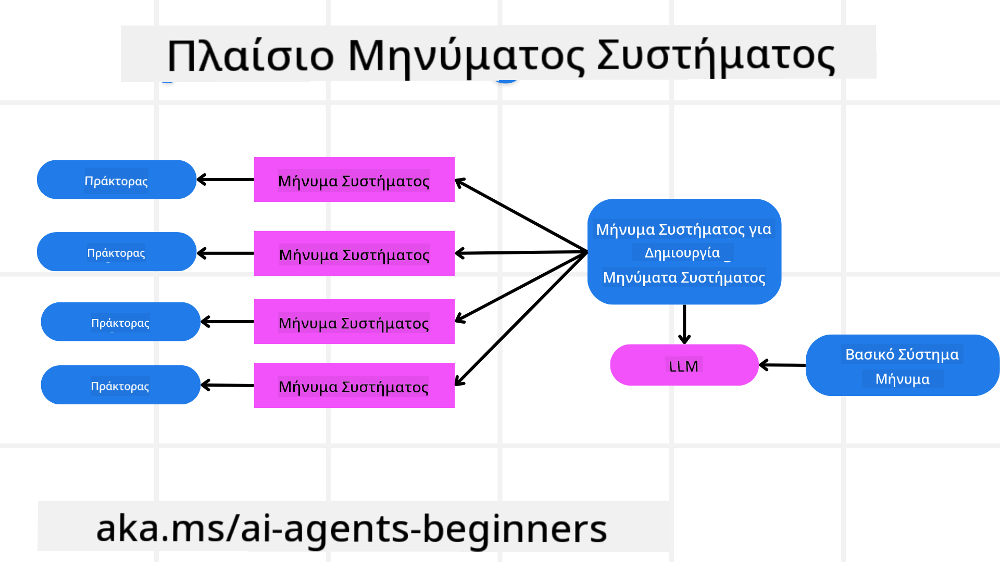
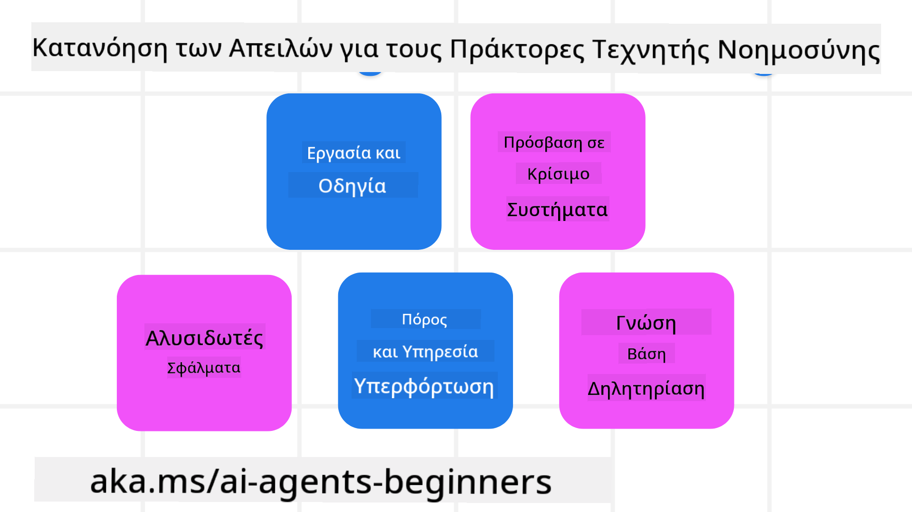

<!--
CO_OP_TRANSLATOR_METADATA:
{
  "original_hash": "f57852cac3a86c4a5ef47f793cc12178",
  "translation_date": "2025-07-12T10:27:19+00:00",
  "source_file": "06-building-trustworthy-agents/README.md",
  "language_code": "el"
}
-->
[](https://youtu.be/iZKkMEGBCUQ?si=Q-kEbcyHUMPoHp8L)

> _(Κάντε κλικ στην εικόνα παραπάνω για να δείτε το βίντεο αυτού του μαθήματος)_

# Δημιουργία Αξιόπιστων AI Agents

## Εισαγωγή

Σε αυτό το μάθημα θα καλύψουμε:

- Πώς να δημιουργήσετε και να αναπτύξετε ασφαλείς και αποτελεσματικούς AI Agents
- Σημαντικές παραμέτρους ασφάλειας κατά την ανάπτυξη AI Agents
- Πώς να διατηρήσετε την προστασία των δεδομένων και την ιδιωτικότητα των χρηστών κατά την ανάπτυξη AI Agents

## Στόχοι Μάθησης

Μετά την ολοκλήρωση αυτού του μαθήματος, θα γνωρίζετε πώς να:

- Αναγνωρίζετε και να μειώνετε τους κινδύνους κατά τη δημιουργία AI Agents
- Εφαρμόζετε μέτρα ασφαλείας για να διασφαλίσετε ότι τα δεδομένα και η πρόσβαση διαχειρίζονται σωστά
- Δημιουργείτε AI Agents που διατηρούν την ιδιωτικότητα των δεδομένων και προσφέρουν ποιοτική εμπειρία χρήστη

## Ασφάλεια

Ας ξεκινήσουμε με τη δημιουργία ασφαλών εφαρμογών με AI agents. Ασφάλεια σημαίνει ότι ο AI agent λειτουργεί όπως έχει σχεδιαστεί. Ως δημιουργοί εφαρμογών με agents, έχουμε μεθόδους και εργαλεία για να μεγιστοποιήσουμε την ασφάλεια:

### Δημιουργία Πλαισίου Μηνυμάτων Συστήματος

Αν έχετε ποτέ δημιουργήσει μια εφαρμογή AI χρησιμοποιώντας Large Language Models (LLMs), γνωρίζετε τη σημασία του σχεδιασμού ενός στιβαρού system prompt ή system message. Αυτά τα prompts καθορίζουν τους μετακανόνες, τις οδηγίες και τις κατευθυντήριες γραμμές για το πώς το LLM θα αλληλεπιδρά με τον χρήστη και τα δεδομένα.

Για τους AI Agents, το system prompt είναι ακόμα πιο σημαντικό, καθώς οι AI Agents χρειάζονται πολύ συγκεκριμένες οδηγίες για να ολοκληρώσουν τις εργασίες που έχουμε σχεδιάσει για αυτούς.

Για να δημιουργήσουμε επεκτάσιμα system prompts, μπορούμε να χρησιμοποιήσουμε ένα πλαίσιο μηνυμάτων συστήματος για τη δημιουργία ενός ή περισσότερων agents στην εφαρμογή μας:



#### Βήμα 1: Δημιουργία Meta System Message

Το meta prompt θα χρησιμοποιηθεί από ένα LLM για να δημιουργήσει τα system prompts για τους agents που δημιουργούμε. Το σχεδιάζουμε ως πρότυπο ώστε να μπορούμε να δημιουργήσουμε αποτελεσματικά πολλούς agents αν χρειαστεί.

Εδώ είναι ένα παράδειγμα meta system message που θα δώσουμε στο LLM:

```plaintext
You are an expert at creating AI agent assistants. 
You will be provided a company name, role, responsibilities and other
information that you will use to provide a system prompt for.
To create the system prompt, be descriptive as possible and provide a structure that a system using an LLM can better understand the role and responsibilities of the AI assistant. 
```

#### Βήμα 2: Δημιουργία βασικού prompt

Το επόμενο βήμα είναι να δημιουργήσουμε ένα βασικό prompt που να περιγράφει τον AI Agent. Πρέπει να συμπεριλάβετε το ρόλο του agent, τις εργασίες που θα ολοκληρώσει και οποιεσδήποτε άλλες ευθύνες έχει ο agent.

Εδώ είναι ένα παράδειγμα:

```plaintext
You are a travel agent for Contoso Travel that is great at booking flights for customers. To help customers you can perform the following tasks: lookup available flights, book flights, ask for preferences in seating and times for flights, cancel any previously booked flights and alert customers on any delays or cancellations of flights.  
```

#### Βήμα 3: Παροχή Βασικού System Message στο LLM

Τώρα μπορούμε να βελτιστοποιήσουμε αυτό το system message παρέχοντας το meta system message ως system message μαζί με το βασικό μας system message.

Αυτό θα παράγει ένα system message που είναι καλύτερα σχεδιασμένο για να καθοδηγεί τους AI agents μας:

```markdown
**Company Name:** Contoso Travel  
**Role:** Travel Agent Assistant

**Objective:**  
You are an AI-powered travel agent assistant for Contoso Travel, specializing in booking flights and providing exceptional customer service. Your main goal is to assist customers in finding, booking, and managing their flights, all while ensuring that their preferences and needs are met efficiently.

**Key Responsibilities:**

1. **Flight Lookup:**
    
    - Assist customers in searching for available flights based on their specified destination, dates, and any other relevant preferences.
    - Provide a list of options, including flight times, airlines, layovers, and pricing.
2. **Flight Booking:**
    
    - Facilitate the booking of flights for customers, ensuring that all details are correctly entered into the system.
    - Confirm bookings and provide customers with their itinerary, including confirmation numbers and any other pertinent information.
3. **Customer Preference Inquiry:**
    
    - Actively ask customers for their preferences regarding seating (e.g., aisle, window, extra legroom) and preferred times for flights (e.g., morning, afternoon, evening).
    - Record these preferences for future reference and tailor suggestions accordingly.
4. **Flight Cancellation:**
    
    - Assist customers in canceling previously booked flights if needed, following company policies and procedures.
    - Notify customers of any necessary refunds or additional steps that may be required for cancellations.
5. **Flight Monitoring:**
    
    - Monitor the status of booked flights and alert customers in real-time about any delays, cancellations, or changes to their flight schedule.
    - Provide updates through preferred communication channels (e.g., email, SMS) as needed.

**Tone and Style:**

- Maintain a friendly, professional, and approachable demeanor in all interactions with customers.
- Ensure that all communication is clear, informative, and tailored to the customer's specific needs and inquiries.

**User Interaction Instructions:**

- Respond to customer queries promptly and accurately.
- Use a conversational style while ensuring professionalism.
- Prioritize customer satisfaction by being attentive, empathetic, and proactive in all assistance provided.

**Additional Notes:**

- Stay updated on any changes to airline policies, travel restrictions, and other relevant information that could impact flight bookings and customer experience.
- Use clear and concise language to explain options and processes, avoiding jargon where possible for better customer understanding.

This AI assistant is designed to streamline the flight booking process for customers of Contoso Travel, ensuring that all their travel needs are met efficiently and effectively.

```

#### Βήμα 4: Επανάληψη και Βελτίωση

Η αξία αυτού του πλαισίου μηνυμάτων συστήματος είναι ότι μπορούμε να κλιμακώσουμε τη δημιουργία system messages από πολλούς agents πιο εύκολα, καθώς και να βελτιώνουμε τα system messages μας με την πάροδο του χρόνου. Είναι σπάνιο να έχετε ένα system message που να λειτουργεί τέλεια από την πρώτη φορά για ολόκληρη την περίπτωση χρήσης σας. Η δυνατότητα να κάνετε μικρές αλλαγές και βελτιώσεις αλλάζοντας το βασικό system message και τρέχοντάς το μέσα από το σύστημα θα σας επιτρέψει να συγκρίνετε και να αξιολογήσετε τα αποτελέσματα.

## Κατανόηση Απειλών

Για να δημιουργήσετε αξιόπιστους AI agents, είναι σημαντικό να κατανοήσετε και να μειώσετε τους κινδύνους και τις απειλές προς τον AI agent σας. Ας δούμε μερικές από τις διαφορετικές απειλές προς τους AI agents και πώς μπορείτε να προγραμματίσετε και να προετοιμαστείτε καλύτερα για αυτές.



### Εργασία και Οδηγίες

**Περιγραφή:** Οι επιτιθέμενοι προσπαθούν να αλλάξουν τις οδηγίες ή τους στόχους του AI agent μέσω prompts ή χειραγώγησης των εισόδων.

**Μείωση:** Εκτελέστε ελέγχους επικύρωσης και φίλτρα εισόδου για να εντοπίσετε πιθανά επικίνδυνα prompts πριν αυτά επεξεργαστούν από τον AI Agent. Επειδή αυτές οι επιθέσεις συνήθως απαιτούν συχνή αλληλεπίδραση με τον Agent, ο περιορισμός του αριθμού των γύρων σε μια συνομιλία είναι ένας ακόμα τρόπος για να αποτραπούν τέτοιου είδους επιθέσεις.

### Πρόσβαση σε Κρίσιμα Συστήματα

**Περιγραφή:** Αν ένας AI agent έχει πρόσβαση σε συστήματα και υπηρεσίες που αποθηκεύουν ευαίσθητα δεδομένα, οι επιτιθέμενοι μπορούν να παραβιάσουν την επικοινωνία μεταξύ του agent και αυτών των υπηρεσιών. Αυτές μπορεί να είναι άμεσες επιθέσεις ή έμμεσες προσπάθειες να αποκτήσουν πληροφορίες για αυτά τα συστήματα μέσω του agent.

**Μείωση:** Οι AI agents θα πρέπει να έχουν πρόσβαση σε συστήματα μόνο όταν είναι απαραίτητο για να αποτραπούν τέτοιου είδους επιθέσεις. Η επικοινωνία μεταξύ του agent και του συστήματος πρέπει επίσης να είναι ασφαλής. Η εφαρμογή μηχανισμών αυθεντικοποίησης και ελέγχου πρόσβασης είναι ένας ακόμα τρόπος προστασίας αυτών των πληροφοριών.

### Υπερφόρτωση Πόρων και Υπηρεσιών

**Περιγραφή:** Οι AI agents μπορούν να έχουν πρόσβαση σε διάφορα εργαλεία και υπηρεσίες για να ολοκληρώσουν εργασίες. Οι επιτιθέμενοι μπορούν να εκμεταλλευτούν αυτή τη δυνατότητα για να επιτεθούν σε αυτές τις υπηρεσίες στέλνοντας μεγάλο όγκο αιτημάτων μέσω του AI Agent, κάτι που μπορεί να οδηγήσει σε αποτυχίες συστήματος ή υψηλά κόστη.

**Μείωση:** Εφαρμόστε πολιτικές για να περιορίσετε τον αριθμό των αιτημάτων που μπορεί να κάνει ένας AI agent σε μια υπηρεσία. Ο περιορισμός του αριθμού των γύρων συνομιλίας και των αιτημάτων προς τον AI agent είναι ένας ακόμα τρόπος για να αποτραπούν τέτοιου είδους επιθέσεις.

### Δηλητηρίαση Βάσης Γνώσης

**Περιγραφή:** Αυτός ο τύπος επίθεσης δεν στοχεύει άμεσα τον AI agent, αλλά τη βάση γνώσης και άλλες υπηρεσίες που θα χρησιμοποιήσει ο AI agent. Μπορεί να περιλαμβάνει τη διαφθορά των δεδομένων ή των πληροφοριών που θα χρησιμοποιήσει ο AI agent για να ολοκληρώσει μια εργασία, οδηγώντας σε μεροληπτικές ή ανεπιθύμητες απαντήσεις προς τον χρήστη.

**Μείωση:** Πραγματοποιείτε τακτικούς ελέγχους επαλήθευσης των δεδομένων που θα χρησιμοποιεί ο AI agent στις ροές εργασίας του. Διασφαλίστε ότι η πρόσβαση σε αυτά τα δεδομένα είναι ασφαλής και ότι μπορούν να τροποποιηθούν μόνο από αξιόπιστα άτομα για να αποφύγετε αυτού του είδους την επίθεση.

### Αλυσιδωτά Σφάλματα

**Περιγραφή:** Οι AI agents έχουν πρόσβαση σε διάφορα εργαλεία και υπηρεσίες για να ολοκληρώσουν εργασίες. Σφάλματα που προκαλούνται από επιτιθέμενους μπορούν να οδηγήσουν σε αποτυχίες άλλων συστημάτων στα οποία είναι συνδεδεμένος ο AI agent, κάνοντας την επίθεση πιο εκτεταμένη και δυσκολότερη στην αντιμετώπιση.

**Μείωση:** Μια μέθοδος για να αποφύγετε αυτό είναι να λειτουργεί ο AI Agent σε περιορισμένο περιβάλλον, όπως η εκτέλεση εργασιών μέσα σε Docker container, για να αποτραπούν άμεσες επιθέσεις στο σύστημα. Η δημιουργία μηχανισμών εφεδρείας και λογικής επανάληψης όταν κάποια συστήματα απαντούν με σφάλμα είναι ένας ακόμα τρόπος για να αποτραπούν μεγαλύτερες αποτυχίες συστήματος.

## Ανθρώπινη Παρέμβαση (Human-in-the-Loop)

Ένας ακόμα αποτελεσματικός τρόπος για να δημιουργήσετε αξιόπιστα συστήματα AI Agents είναι η χρήση του Human-in-the-loop. Αυτό δημιουργεί μια ροή όπου οι χρήστες μπορούν να παρέχουν ανατροφοδότηση στους Agents κατά τη διάρκεια της λειτουργίας. Οι χρήστες ουσιαστικά λειτουργούν ως agents σε ένα πολυ-agent σύστημα, παρέχοντας έγκριση ή τερματισμό της τρέχουσας διαδικασίας.


Εδώ είναι ένα απόσπασμα κώδικα που χρησιμοποιεί το AutoGen για να δείξει πώς υλοποιείται αυτή η ιδέα:

```python

# Create the agents.
model_client = OpenAIChatCompletionClient(model="gpt-4o-mini")
assistant = AssistantAgent("assistant", model_client=model_client)
user_proxy = UserProxyAgent("user_proxy", input_func=input)  # Use input() to get user input from console.

# Create the termination condition which will end the conversation when the user says "APPROVE".
termination = TextMentionTermination("APPROVE")

# Create the team.
team = RoundRobinGroupChat([assistant, user_proxy], termination_condition=termination)

# Run the conversation and stream to the console.
stream = team.run_stream(task="Write a 4-line poem about the ocean.")
# Use asyncio.run(...) when running in a script.
await Console(stream)

```

## Συμπέρασμα

Η δημιουργία αξιόπιστων AI agents απαιτεί προσεκτικό σχεδιασμό, ισχυρά μέτρα ασφαλείας και συνεχή επανάληψη. Με την εφαρμογή δομημένων συστημάτων μετα-προτροπών, την κατανόηση πιθανών απειλών και την υλοποίηση στρατηγικών μείωσης, οι προγραμματιστές μπορούν να δημιουργήσουν AI agents που είναι τόσο ασφαλείς όσο και αποτελεσματικοί. Επιπλέον, η ενσωμάτωση της προσέγγισης human-in-the-loop διασφαλίζει ότι οι AI agents παραμένουν ευθυγραμμισμένοι με τις ανάγκες των χρηστών, μειώνοντας παράλληλα τους κινδύνους. Καθώς η AI εξελίσσεται, η διατήρηση μιας προληπτικής στάσης σε θέματα ασφάλειας, ιδιωτικότητας και ηθικής θα είναι το κλειδί για την ενίσχυση της εμπιστοσύνης και της αξιοπιστίας στα συστήματα που βασίζονται στην AI.

## Επιπλέον Πόροι

- <a href="https://learn.microsoft.com/azure/ai-studio/responsible-use-of-ai-overview" target="_blank">Επισκόπηση Υπεύθυνης Χρήσης AI</a>
- <a href="https://learn.microsoft.com/azure/ai-studio/concepts/evaluation-approach-gen-ai" target="_blank">Αξιολόγηση μοντέλων γεννητικής AI και εφαρμογών AI</a>
- <a href="https://learn.microsoft.com/azure/ai-services/openai/concepts/system-message?context=%2Fazure%2Fai-studio%2Fcontext%2Fcontext&tabs=top-techniques" target="_blank">Μηνύματα συστήματος ασφάλειας</a>
- <a href="https://blogs.microsoft.com/wp-content/uploads/prod/sites/5/2022/06/Microsoft-RAI-Impact-Assessment-Template.pdf?culture=en-us&country=us" target="_blank">Πρότυπο Αξιολόγησης Κινδύνου</a>

## Προηγούμενο Μάθημα

[Agentic RAG](../05-agentic-rag/README.md)

## Επόμενο Μάθημα

[Planning Design Pattern](../07-planning-design/README.md)

**Αποποίηση ευθυνών**:  
Αυτό το έγγραφο έχει μεταφραστεί χρησιμοποιώντας την υπηρεσία αυτόματης μετάφρασης AI [Co-op Translator](https://github.com/Azure/co-op-translator). Παρόλο που επιδιώκουμε την ακρίβεια, παρακαλούμε να γνωρίζετε ότι οι αυτόματες μεταφράσεις ενδέχεται να περιέχουν λάθη ή ανακρίβειες. Το πρωτότυπο έγγραφο στη γλώσσα του θεωρείται η αυθεντική πηγή. Για κρίσιμες πληροφορίες, συνιστάται επαγγελματική ανθρώπινη μετάφραση. Δεν φέρουμε ευθύνη για τυχόν παρεξηγήσεις ή λανθασμένες ερμηνείες που προκύπτουν από τη χρήση αυτής της μετάφρασης.