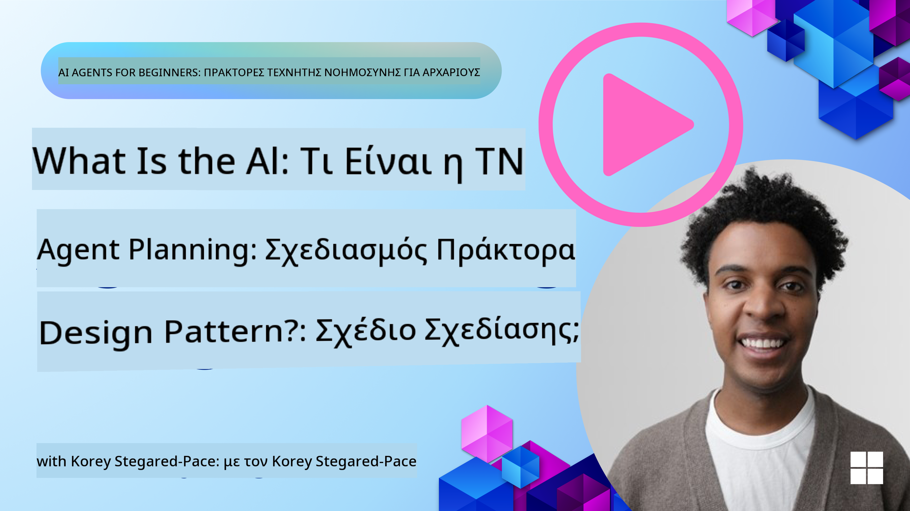
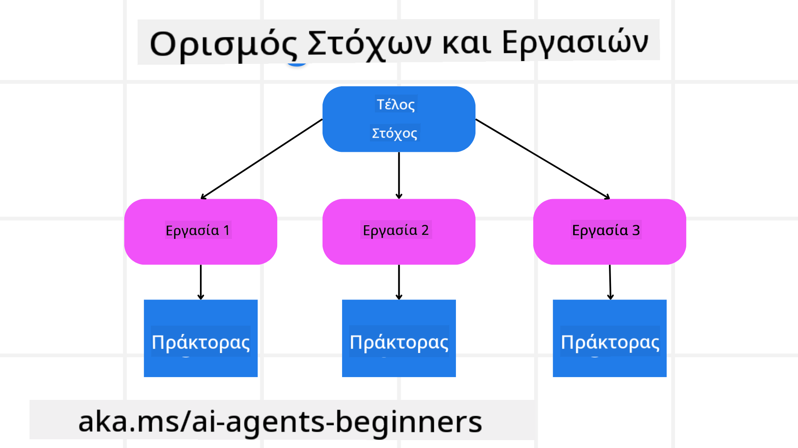

<!--
CO_OP_TRANSLATOR_METADATA:
{
  "original_hash": "a28d30590704ea13b6a08d4793cf9c2b",
  "translation_date": "2025-08-29T15:01:06+00:00",
  "source_file": "07-planning-design/README.md",
  "language_code": "el"
}
-->
[](https://youtu.be/kPfJ2BrBCMY?si=9pYpPXp0sSbK91Dr)

> _(Κάντε κλικ στην εικόνα παραπάνω για να δείτε το βίντεο αυτού του μαθήματος)_

# Σχεδιασμός Σχεδίου

## Εισαγωγή

Αυτό το μάθημα θα καλύψει:

* Τον καθορισμό ενός σαφούς συνολικού στόχου και τη διάσπαση μιας σύνθετης εργασίας σε διαχειρίσιμες υπο-εργασίες.
* Την αξιοποίηση δομημένης εξόδου για πιο αξιόπιστες και αναγνώσιμες από μηχανές απαντήσεις.
* Την εφαρμογή μιας προσέγγισης βασισμένης σε γεγονότα για τη διαχείριση δυναμικών εργασιών και απρόβλεπτων εισόδων.

## Στόχοι Μάθησης

Μετά την ολοκλήρωση αυτού του μαθήματος, θα έχετε κατανοήσει:

* Πώς να προσδιορίσετε και να θέσετε έναν συνολικό στόχο για έναν AI agent, διασφαλίζοντας ότι γνωρίζει ξεκάθαρα τι πρέπει να επιτευχθεί.
* Πώς να διασπάσετε μια σύνθετη εργασία σε διαχειρίσιμες υπο-εργασίες και να τις οργανώσετε σε μια λογική ακολουθία.
* Πώς να εξοπλίσετε τους agents με τα κατάλληλα εργαλεία (π.χ., εργαλεία αναζήτησης ή ανάλυσης δεδομένων), να αποφασίσετε πότε και πώς θα χρησιμοποιηθούν και να διαχειριστείτε απρόβλεπτες καταστάσεις που προκύπτουν.
* Πώς να αξιολογήσετε τα αποτελέσματα των υπο-εργασιών, να μετρήσετε την απόδοση και να επαναλάβετε τις ενέργειες για τη βελτίωση του τελικού αποτελέσματος.

## Καθορισμός του Συνολικού Στόχου και Διάσπαση μιας Εργασίας



Οι περισσότερες εργασίες στον πραγματικό κόσμο είναι πολύ σύνθετες για να αντιμετωπιστούν σε ένα μόνο βήμα. Ένας AI agent χρειάζεται έναν συνοπτικό στόχο για να καθοδηγήσει τον σχεδιασμό και τις ενέργειές του. Για παράδειγμα, σκεφτείτε τον στόχο:

    "Δημιουργήστε ένα ταξιδιωτικό πρόγραμμα για 3 ημέρες."

Παρόλο που είναι απλό να διατυπωθεί, χρειάζεται περαιτέρω διευκρίνιση. Όσο πιο σαφής είναι ο στόχος, τόσο καλύτερα μπορεί ο agent (και οι ανθρώπινοι συνεργάτες) να επικεντρωθούν στην επίτευξη του σωστού αποτελέσματος, όπως η δημιουργία ενός ολοκληρωμένου προγράμματος με επιλογές πτήσεων, προτάσεις ξενοδοχείων και δραστηριότητες.

### Διάσπαση Εργασιών

Οι μεγάλες ή περίπλοκες εργασίες γίνονται πιο διαχειρίσιμες όταν διασπώνται σε μικρότερες, προσανατολισμένες σε στόχους υπο-εργασίες. 
Για το παράδειγμα του ταξιδιωτικού προγράμματος, μπορείτε να διασπάσετε τον στόχο σε:

* Κράτηση Πτήσεων
* Κράτηση Ξενοδοχείων
* Ενοικίαση Αυτοκινήτου
* Εξατομίκευση

Κάθε υπο-εργασία μπορεί στη συνέχεια να αντιμετωπιστεί από εξειδικευμένους agents ή διαδικασίες. Ένας agent μπορεί να ειδικεύεται στην αναζήτηση των καλύτερων προσφορών πτήσεων, ένας άλλος να επικεντρώνεται στις κρατήσεις ξενοδοχείων, κ.ο.κ. Ένας συντονιστικός ή “downstream” agent μπορεί στη συνέχεια να συνθέσει αυτά τα αποτελέσματα σε ένα συνεκτικό πρόγραμμα για τον τελικό χρήστη.

Αυτή η αρθρωτή προσέγγιση επιτρέπει επίσης σταδιακές βελτιώσεις. Για παράδειγμα, μπορείτε να προσθέσετε εξειδικευμένους agents για προτάσεις φαγητού ή τοπικές δραστηριότητες και να βελτιώσετε το πρόγραμμα με την πάροδο του χρόνου.

### Δομημένη Έξοδος

Τα Large Language Models (LLMs) μπορούν να δημιουργήσουν δομημένη έξοδο (π.χ., JSON) που είναι ευκολότερη για downstream agents ή υπηρεσίες να αναλύσουν και να επεξεργαστούν. Αυτό είναι ιδιαίτερα χρήσιμο σε ένα περιβάλλον πολλαπλών agents, όπου μπορούμε να ενεργοποιήσουμε αυτές τις εργασίες αφού ληφθεί η έξοδος του σχεδιασμού. Δείτε μια γρήγορη επισκόπηση.

Το παρακάτω απόσπασμα Python δείχνει έναν απλό agent σχεδιασμού που διασπά έναν στόχο σε υπο-εργασίες και δημιουργεί ένα δομημένο σχέδιο:

```python
from pydantic import BaseModel
from enum import Enum
from typing import List, Optional, Union
import json
import os
from typing import Optional
from pprint import pprint
from autogen_core.models import UserMessage, SystemMessage, AssistantMessage
from autogen_ext.models.azure import AzureAIChatCompletionClient
from azure.core.credentials import AzureKeyCredential

class AgentEnum(str, Enum):
    FlightBooking = "flight_booking"
    HotelBooking = "hotel_booking"
    CarRental = "car_rental"
    ActivitiesBooking = "activities_booking"
    DestinationInfo = "destination_info"
    DefaultAgent = "default_agent"
    GroupChatManager = "group_chat_manager"

# Travel SubTask Model
class TravelSubTask(BaseModel):
    task_details: str
    assigned_agent: AgentEnum  # we want to assign the task to the agent

class TravelPlan(BaseModel):
    main_task: str
    subtasks: List[TravelSubTask]
    is_greeting: bool

client = AzureAIChatCompletionClient(
    model="gpt-4o-mini",
    endpoint="https://models.inference.ai.azure.com",
    # To authenticate with the model you will need to generate a personal access token (PAT) in your GitHub settings.
    # Create your PAT token by following instructions here: https://docs.github.com/en/authentication/keeping-your-account-and-data-secure/managing-your-personal-access-tokens
    credential=AzureKeyCredential(os.environ["GITHUB_TOKEN"]),
    model_info={
        "json_output": False,
        "function_calling": True,
        "vision": True,
        "family": "unknown",
    },
)

# Define the user message
messages = [
    SystemMessage(content="""You are an planner agent.
    Your job is to decide which agents to run based on the user's request.
                      Provide your response in JSON format with the following structure:
{'main_task': 'Plan a family trip from Singapore to Melbourne.',
 'subtasks': [{'assigned_agent': 'flight_booking',
               'task_details': 'Book round-trip flights from Singapore to '
                               'Melbourne.'}
    Below are the available agents specialised in different tasks:
    - FlightBooking: For booking flights and providing flight information
    - HotelBooking: For booking hotels and providing hotel information
    - CarRental: For booking cars and providing car rental information
    - ActivitiesBooking: For booking activities and providing activity information
    - DestinationInfo: For providing information about destinations
    - DefaultAgent: For handling general requests""", source="system"),
    UserMessage(
        content="Create a travel plan for a family of 2 kids from Singapore to Melboune", source="user"),
]

response = await client.create(messages=messages, extra_create_args={"response_format": 'json_object'})

response_content: Optional[str] = response.content if isinstance(
    response.content, str) else None
if response_content is None:
    raise ValueError("Response content is not a valid JSON string" )

pprint(json.loads(response_content))

# # Ensure the response content is a valid JSON string before loading it
# response_content: Optional[str] = response.content if isinstance(
#     response.content, str) else None
# if response_content is None:
#     raise ValueError("Response content is not a valid JSON string")

# # Print the response content after loading it as JSON
# pprint(json.loads(response_content))

# Validate the response content with the MathReasoning model
# TravelPlan.model_validate(json.loads(response_content))
```

### Agent Σχεδιασμού με Ορχήστρωση Πολλαπλών Agents

Σε αυτό το παράδειγμα, ένας Semantic Router Agent λαμβάνει ένα αίτημα χρήστη (π.χ., "Χρειάζομαι ένα σχέδιο ξενοδοχείου για το ταξίδι μου.").

Ο σχεδιαστής στη συνέχεια:

* Λαμβάνει το Σχέδιο Ξενοδοχείου: Ο σχεδιαστής παίρνει το μήνυμα του χρήστη και, βάσει ενός συστημικού prompt (συμπεριλαμβανομένων λεπτομερειών διαθέσιμων agents), δημιουργεί ένα δομημένο ταξιδιωτικό σχέδιο.
* Καταγράφει Agents και τα Εργαλεία τους: Το μητρώο agents περιέχει μια λίστα με agents (π.χ., για πτήσεις, ξενοδοχεία, ενοικίαση αυτοκινήτων και δραστηριότητες) μαζί με τις λειτουργίες ή τα εργαλεία που προσφέρουν.
* Κατευθύνει το Σχέδιο στους Αντίστοιχους Agents: Ανάλογα με τον αριθμό των υπο-εργασιών, ο σχεδιαστής είτε στέλνει το μήνυμα απευθείας σε έναν εξειδικευμένο agent (για σενάρια μίας εργασίας) είτε συντονίζει μέσω ενός διαχειριστή ομαδικής συνομιλίας για συνεργασία πολλαπλών agents.
* Συνοψίζει το Αποτέλεσμα: Τέλος, ο σχεδιαστής συνοψίζει το παραγόμενο σχέδιο για σαφήνεια.

Το παρακάτω δείγμα κώδικα Python απεικονίζει αυτά τα βήματα:

```python

from pydantic import BaseModel

from enum import Enum
from typing import List, Optional, Union

class AgentEnum(str, Enum):
    FlightBooking = "flight_booking"
    HotelBooking = "hotel_booking"
    CarRental = "car_rental"
    ActivitiesBooking = "activities_booking"
    DestinationInfo = "destination_info"
    DefaultAgent = "default_agent"
    GroupChatManager = "group_chat_manager"

# Travel SubTask Model

class TravelSubTask(BaseModel):
    task_details: str
    assigned_agent: AgentEnum # we want to assign the task to the agent

class TravelPlan(BaseModel):
    main_task: str
    subtasks: List[TravelSubTask]
    is_greeting: bool
import json
import os
from typing import Optional

from autogen_core.models import UserMessage, SystemMessage, AssistantMessage
from autogen_ext.models.openai import AzureOpenAIChatCompletionClient

# Create the client with type-checked environment variables

client = AzureOpenAIChatCompletionClient(
    azure_deployment=os.getenv("AZURE_OPENAI_DEPLOYMENT_NAME"),
    model=os.getenv("AZURE_OPENAI_DEPLOYMENT_NAME"),
    api_version=os.getenv("AZURE_OPENAI_API_VERSION"),
    azure_endpoint=os.getenv("AZURE_OPENAI_ENDPOINT"),
    api_key=os.getenv("AZURE_OPENAI_API_KEY"),
)

from pprint import pprint

# Define the user message

messages = [
    SystemMessage(content="""You are an planner agent.
    Your job is to decide which agents to run based on the user's request.
    Below are the available agents specialized in different tasks:
    - FlightBooking: For booking flights and providing flight information
    - HotelBooking: For booking hotels and providing hotel information
    - CarRental: For booking cars and providing car rental information
    - ActivitiesBooking: For booking activities and providing activity information
    - DestinationInfo: For providing information about destinations
    - DefaultAgent: For handling general requests""", source="system"),
    UserMessage(content="Create a travel plan for a family of 2 kids from Singapore to Melbourne", source="user"),
]

response = await client.create(messages=messages, extra_create_args={"response_format": TravelPlan})

# Ensure the response content is a valid JSON string before loading it

response_content: Optional[str] = response.content if isinstance(response.content, str) else None
if response_content is None:
    raise ValueError("Response content is not a valid JSON string")

# Print the response content after loading it as JSON

pprint(json.loads(response_content))
```

Ακολουθεί η έξοδος από τον προηγούμενο κώδικα και μπορείτε στη συνέχεια να χρησιμοποιήσετε αυτή τη δομημένη έξοδο για να κατευθύνετε στον `assigned_agent` και να συνοψίσετε το ταξιδιωτικό σχέδιο για τον τελικό χρήστη.

```json
{
    "is_greeting": "False",
    "main_task": "Plan a family trip from Singapore to Melbourne.",
    "subtasks": [
        {
            "assigned_agent": "flight_booking",
            "task_details": "Book round-trip flights from Singapore to Melbourne."
        },
        {
            "assigned_agent": "hotel_booking",
            "task_details": "Find family-friendly hotels in Melbourne."
        },
        {
            "assigned_agent": "car_rental",
            "task_details": "Arrange a car rental suitable for a family of four in Melbourne."
        },
        {
            "assigned_agent": "activities_booking",
            "task_details": "List family-friendly activities in Melbourne."
        },
        {
            "assigned_agent": "destination_info",
            "task_details": "Provide information about Melbourne as a travel destination."
        }
    ]
}
```

Ένα παράδειγμα notebook με τον προηγούμενο κώδικα είναι διαθέσιμο [εδώ](07-autogen.ipynb).

### Επαναληπτικός Σχεδιασμός

Ορισμένες εργασίες απαιτούν μια διαδικασία δοκιμής και επανασχεδιασμού, όπου το αποτέλεσμα μιας υπο-εργασίας επηρεάζει την επόμενη. Για παράδειγμα, αν ο agent ανακαλύψει ένα απρόσμενο μορφότυπο δεδομένων κατά την κράτηση πτήσεων, μπορεί να χρειαστεί να προσαρμόσει τη στρατηγική του πριν προχωρήσει στις κρατήσεις ξενοδοχείων.

Επιπλέον, η ανατροφοδότηση από τον χρήστη (π.χ., ένας άνθρωπος που αποφασίζει ότι προτιμά μια νωρίτερη πτήση) μπορεί να προκαλέσει έναν μερικό επανασχεδιασμό. Αυτή η δυναμική, επαναληπτική προσέγγιση διασφαλίζει ότι η τελική λύση ευθυγραμμίζεται με τους πραγματικούς περιορισμούς και τις εξελισσόμενες προτιμήσεις του χρήστη.

π.χ. δείγμα κώδικα

```python
from autogen_core.models import UserMessage, SystemMessage, AssistantMessage
#.. same as previous code and pass on the user history, current plan
messages = [
    SystemMessage(content="""You are a planner agent to optimize the
    Your job is to decide which agents to run based on the user's request.
    Below are the available agents specialized in different tasks:
    - FlightBooking: For booking flights and providing flight information
    - HotelBooking: For booking hotels and providing hotel information
    - CarRental: For booking cars and providing car rental information
    - ActivitiesBooking: For booking activities and providing activity information
    - DestinationInfo: For providing information about destinations
    - DefaultAgent: For handling general requests""", source="system"),
    UserMessage(content="Create a travel plan for a family of 2 kids from Singapore to Melbourne", source="user"),
    AssistantMessage(content=f"Previous travel plan - {TravelPlan}", source="assistant")
]
# .. re-plan and send the tasks to respective agents
```

Για πιο ολοκληρωμένο σχεδιασμό, δείτε το Magnetic One για την επίλυση σύνθετων εργασιών.

## Περίληψη

Σε αυτό το άρθρο εξετάσαμε ένα παράδειγμα για το πώς μπορούμε να δημιουργήσουμε έναν σχεδιαστή που μπορεί να επιλέξει δυναμικά τους διαθέσιμους agents που έχουν οριστεί. Η έξοδος του Σχεδιαστή διασπά τις εργασίες και αναθέτει τους agents ώστε να μπορούν να εκτελεστούν. Υποτίθεται ότι οι agents έχουν πρόσβαση στις λειτουργίες/εργαλεία που απαιτούνται για την εκτέλεση της εργασίας. Εκτός από τους agents, μπορείτε να συμπεριλάβετε άλλα μοτίβα όπως αναστοχασμό, συνοψιστή και κυκλική συνομιλία για περαιτέρω προσαρμογή.

## Πρόσθετοι Πόροι

* AutoGen Magnetic One - Ένα γενικό σύστημα πολλαπλών agents για την επίλυση σύνθετων εργασιών που έχει επιτύχει εντυπωσιακά αποτελέσματα σε πολλαπλά απαιτητικά benchmarks. Αναφορά:

. Σε αυτή την υλοποίηση, ο ορχηστρωτής δημιουργεί σχέδιο ειδικό για την εργασία και αναθέτει αυτές τις εργασίες στους διαθέσιμους agents. Εκτός από τον σχεδιασμό, ο ορχηστρωτής χρησιμοποιεί επίσης έναν μηχανισμό παρακολούθησης για την παρακολούθηση της προόδου της εργασίας και τον επανασχεδιασμό όταν απαιτείται.

### Έχετε Περισσότερες Ερωτήσεις σχετικά με το Σχεδιαστικό Μοτίβο;

Εγγραφείτε στο [Azure AI Foundry Discord](https://aka.ms/ai-agents/discord) για να συναντήσετε άλλους μαθητές, να παρακολουθήσετε ώρες γραφείου και να λάβετε απαντήσεις στις ερωτήσεις σας σχετικά με τους AI Agents.

## Προηγούμενο Μάθημα

[Δημιουργία Αξιόπιστων AI Agents](../06-building-trustworthy-agents/README.md)

## Επόμενο Μάθημα

[Μοτίβο Σχεδιασμού Πολλαπλών Agents](../08-multi-agent/README.md)

---

**Αποποίηση ευθύνης**:  
Αυτό το έγγραφο έχει μεταφραστεί χρησιμοποιώντας την υπηρεσία αυτόματης μετάφρασης AI [Co-op Translator](https://github.com/Azure/co-op-translator). Παρόλο που καταβάλλουμε κάθε προσπάθεια για ακρίβεια, παρακαλούμε να έχετε υπόψη ότι οι αυτόματες μεταφράσεις ενδέχεται να περιέχουν σφάλματα ή ανακρίβειες. Το πρωτότυπο έγγραφο στη μητρική του γλώσσα θα πρέπει να θεωρείται η αυθεντική πηγή. Για κρίσιμες πληροφορίες, συνιστάται επαγγελματική ανθρώπινη μετάφραση. Δεν φέρουμε ευθύνη για τυχόν παρεξηγήσεις ή εσφαλμένες ερμηνείες που προκύπτουν από τη χρήση αυτής της μετάφρασης.