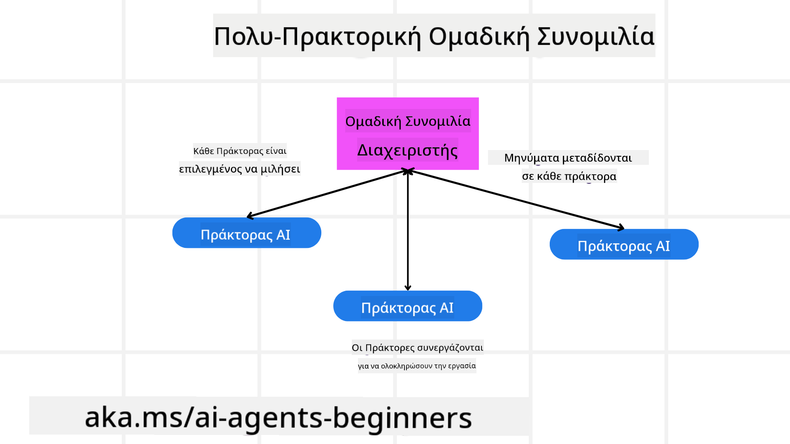
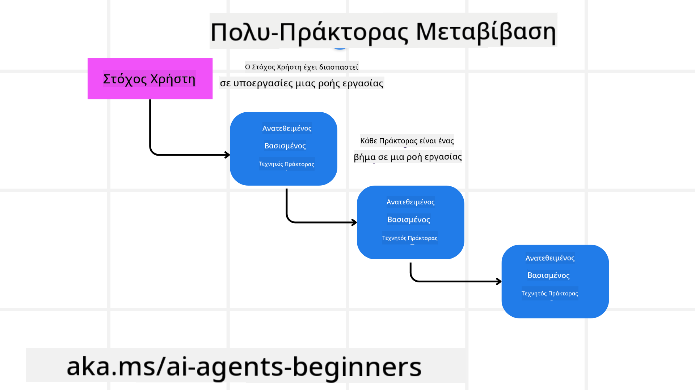

<!--
CO_OP_TRANSLATOR_METADATA:
{
  "original_hash": "c692a8975d7d5b99575a553de1c5e8a7",
  "translation_date": "2025-07-12T11:10:41+00:00",
  "source_file": "08-multi-agent/README.md",
  "language_code": "el"
}
-->

> _(Κάντε κλικ στην εικόνα παραπάνω για να δείτε το βίντεο αυτού του μαθήματος)_

# Σχεδιαστικά πρότυπα πολλαπλών πρακτόρων

Μόλις ξεκινήσετε να εργάζεστε σε ένα έργο που περιλαμβάνει πολλούς πράκτορες, θα χρειαστεί να λάβετε υπόψη το σχεδιαστικό πρότυπο πολλαπλών πρακτόρων. Ωστόσο, μπορεί να μην είναι αμέσως σαφές πότε πρέπει να μεταβείτε σε πολλούς πράκτορες και ποια είναι τα πλεονεκτήματα.

## Εισαγωγή

Σε αυτό το μάθημα, προσπαθούμε να απαντήσουμε στις εξής ερωτήσεις:

- Ποια είναι τα σενάρια όπου εφαρμόζονται οι πολλοί πράκτορες;
- Ποια είναι τα πλεονεκτήματα της χρήσης πολλών πρακτόρων αντί για έναν μόνο πράκτορα που εκτελεί πολλαπλές εργασίες;
- Ποια είναι τα βασικά στοιχεία για την υλοποίηση του σχεδιαστικού προτύπου πολλαπλών πρακτόρων;
- Πώς μπορούμε να έχουμε ορατότητα στον τρόπο που οι πολλοί πράκτορες αλληλεπιδρούν μεταξύ τους;

## Στόχοι Μάθησης

Μετά από αυτό το μάθημα, θα πρέπει να μπορείτε να:

- Αναγνωρίζετε σενάρια όπου εφαρμόζονται πολλοί πράκτορες
- Αναγνωρίζετε τα πλεονεκτήματα της χρήσης πολλών πρακτόρων έναντι ενός μόνο πράκτορα.
- Κατανοείτε τα βασικά στοιχεία για την υλοποίηση του σχεδιαστικού προτύπου πολλαπλών πρακτόρων.

Ποια είναι η ευρύτερη εικόνα;

*Οι πολλοί πράκτορες είναι ένα σχεδιαστικό πρότυπο που επιτρέπει σε πολλούς πράκτορες να συνεργάζονται για να πετύχουν έναν κοινό στόχο*.

Αυτό το πρότυπο χρησιμοποιείται ευρέως σε διάφορους τομείς, όπως η ρομποτική, τα αυτόνομα συστήματα και η κατανεμημένη υπολογιστική.

## Σενάρια όπου εφαρμόζονται πολλοί πράκτορες

Ποια σενάρια είναι κατάλληλα για τη χρήση πολλών πρακτόρων; Η απάντηση είναι ότι υπάρχουν πολλά σενάρια όπου η χρήση πολλών πρακτόρων είναι ωφέλιμη, ειδικά στις παρακάτω περιπτώσεις:

- **Μεγάλο φόρτο εργασίας**: Μεγάλοι φόρτοι εργασίας μπορούν να χωριστούν σε μικρότερες εργασίες και να ανατεθούν σε διαφορετικούς πράκτορες, επιτρέποντας παράλληλη επεξεργασία και ταχύτερη ολοκλήρωση. Ένα παράδειγμα είναι η επεξεργασία μεγάλου όγκου δεδομένων.
- **Σύνθετες εργασίες**: Όπως και στους μεγάλους φόρτους εργασίας, οι σύνθετες εργασίες μπορούν να διασπαστούν σε μικρότερα υπο-εργασίες και να ανατεθούν σε διαφορετικούς πράκτορες, ο καθένας εξειδικευμένος σε μια συγκεκριμένη πτυχή της εργασίας. Ένα καλό παράδειγμα είναι τα αυτόνομα οχήματα, όπου διαφορετικοί πράκτορες διαχειρίζονται την πλοήγηση, την ανίχνευση εμποδίων και την επικοινωνία με άλλα οχήματα.
- **Διαφορετική εξειδίκευση**: Διάφοροι πράκτορες μπορούν να έχουν διαφορετική εξειδίκευση, επιτρέποντάς τους να χειρίζονται διαφορετικές πτυχές μιας εργασίας πιο αποτελεσματικά από έναν μόνο πράκτορα. Για παράδειγμα, στον τομέα της υγειονομικής περίθαλψης, πράκτορες μπορούν να διαχειρίζονται τη διάγνωση, τα σχέδια θεραπείας και την παρακολούθηση ασθενών.

## Πλεονεκτήματα της χρήσης πολλών πρακτόρων έναντι ενός μόνο πράκτορα

Ένα σύστημα με έναν μόνο πράκτορα μπορεί να λειτουργήσει καλά για απλές εργασίες, αλλά για πιο σύνθετες εργασίες, η χρήση πολλών πρακτόρων προσφέρει αρκετά πλεονεκτήματα:

- **Εξειδίκευση**: Κάθε πράκτορας μπορεί να είναι εξειδικευμένος σε μια συγκεκριμένη εργασία. Η έλλειψη εξειδίκευσης σε έναν μόνο πράκτορα σημαίνει ότι έχει τη δυνατότητα να κάνει τα πάντα, αλλά μπορεί να μπερδευτεί όταν αντιμετωπίζει μια σύνθετη εργασία. Για παράδειγμα, μπορεί να καταλήξει να εκτελεί μια εργασία για την οποία δεν είναι ο καλύτερος.
- **Κλιμάκωση**: Είναι πιο εύκολο να κλιμακώσετε τα συστήματα προσθέτοντας περισσότερους πράκτορες παρά υπερφορτώνοντας έναν μόνο πράκτορα.
- **Ανθεκτικότητα σε σφάλματα**: Αν ένας πράκτορας αποτύχει, οι υπόλοιποι μπορούν να συνεχίσουν να λειτουργούν, εξασφαλίζοντας την αξιοπιστία του συστήματος.

Ας πάρουμε ένα παράδειγμα, ας κλείσουμε ένα ταξίδι για έναν χρήστη. Ένα σύστημα με έναν μόνο πράκτορα θα έπρεπε να διαχειριστεί όλες τις πτυχές της διαδικασίας κράτησης ταξιδιού, από την εύρεση πτήσεων μέχρι την κράτηση ξενοδοχείων και ενοικίαση αυτοκινήτων. Για να το πετύχει αυτό, ο πράκτορας θα χρειαζόταν εργαλεία για να χειρίζεται όλες αυτές τις εργασίες. Αυτό θα μπορούσε να οδηγήσει σε ένα πολύπλοκο και μονολιθικό σύστημα που είναι δύσκολο να συντηρηθεί και να κλιμακωθεί. Αντίθετα, ένα σύστημα πολλών πρακτόρων θα μπορούσε να έχει διαφορετικούς πράκτορες εξειδικευμένους στην εύρεση πτήσεων, την κράτηση ξενοδοχείων και την ενοικίαση αυτοκινήτων. Αυτό θα έκανε το σύστημα πιο αρθρωτό, ευκολότερο στη συντήρηση και κλιμακούμενο.

Συγκρίνετε αυτό με ένα ταξιδιωτικό γραφείο που λειτουργεί ως οικογενειακή επιχείρηση έναντι ενός ταξιδιωτικού γραφείου που λειτουργεί ως franchise. Το οικογενειακό γραφείο θα είχε έναν μόνο πράκτορα που διαχειρίζεται όλες τις πτυχές της κράτησης ταξιδιού, ενώ το franchise θα είχε διαφορετικούς πράκτορες που διαχειρίζονται διαφορετικές πτυχές της διαδικασίας.

## Βασικά στοιχεία για την υλοποίηση του σχεδιαστικού προτύπου πολλαπλών πρακτόρων

Πριν μπορέσετε να υλοποιήσετε το σχεδιαστικό πρότυπο πολλαπλών πρακτόρων, πρέπει να κατανοήσετε τα βασικά στοιχεία που το απαρτίζουν.

Ας το κάνουμε πιο συγκεκριμένο ξανά με το παράδειγμα της κράτησης ταξιδιού για έναν χρήστη. Σε αυτή την περίπτωση, τα βασικά στοιχεία θα περιλαμβάνουν:

- **Επικοινωνία πρακτόρων**: Οι πράκτορες για την εύρεση πτήσεων, την κράτηση ξενοδοχείων και την ενοικίαση αυτοκινήτων πρέπει να επικοινωνούν και να μοιράζονται πληροφορίες σχετικά με τις προτιμήσεις και τους περιορισμούς του χρήστη. Πρέπει να αποφασίσετε τα πρωτόκολλα και τις μεθόδους για αυτή την επικοινωνία. Συγκεκριμένα, ο πράκτορας που βρίσκει πτήσεις πρέπει να επικοινωνεί με τον πράκτορα που κλείνει ξενοδοχεία για να διασφαλιστεί ότι το ξενοδοχείο είναι κρατημένο για τις ίδιες ημερομηνίες με την πτήση. Αυτό σημαίνει ότι οι πράκτορες πρέπει να μοιράζονται πληροφορίες για τις ημερομηνίες ταξιδιού του χρήστη, δηλαδή πρέπει να αποφασίσετε *ποιοι πράκτορες μοιράζονται πληροφορίες και πώς τις μοιράζονται*.
- **Μηχανισμοί συντονισμού**: Οι πράκτορες πρέπει να συντονίζουν τις ενέργειές τους για να διασφαλίσουν ότι οι προτιμήσεις και οι περιορισμοί του χρήστη ικανοποιούνται. Μια προτίμηση χρήστη μπορεί να είναι να θέλει ξενοδοχείο κοντά στο αεροδρόμιο, ενώ ένας περιορισμός μπορεί να είναι ότι τα ενοικιαζόμενα αυτοκίνητα είναι διαθέσιμα μόνο στο αεροδρόμιο. Αυτό σημαίνει ότι ο πράκτορας που κλείνει ξενοδοχεία πρέπει να συντονίζεται με τον πράκτορα που κλείνει ενοικιαζόμενα αυτοκίνητα για να διασφαλιστεί ότι οι προτιμήσεις και οι περιορισμοί του χρήστη ικανοποιούνται. Αυτό σημαίνει ότι πρέπει να αποφασίσετε *πώς οι πράκτορες συντονίζουν τις ενέργειές τους*.
- **Αρχιτεκτονική πρακτόρων**: Οι πράκτορες πρέπει να έχουν εσωτερική δομή για να λαμβάνουν αποφάσεις και να μαθαίνουν από τις αλληλεπιδράσεις τους με τον χρήστη. Αυτό σημαίνει ότι ο πράκτορας που βρίσκει πτήσεις πρέπει να έχει την εσωτερική δομή για να αποφασίζει ποιες πτήσεις να προτείνει στον χρήστη. Αυτό σημαίνει ότι πρέπει να αποφασίσετε *πώς οι πράκτορες λαμβάνουν αποφάσεις και μαθαίνουν από τις αλληλεπιδράσεις τους με τον χρήστη*. Παραδείγματα για το πώς ένας πράκτορας μαθαίνει και βελτιώνεται μπορεί να είναι ότι ο πράκτορας που βρίσκει πτήσεις χρησιμοποιεί ένα μοντέλο μηχανικής μάθησης για να προτείνει πτήσεις στον χρήστη βάσει των προηγούμενων προτιμήσεών του.
- **Ορατότητα στις αλληλεπιδράσεις πολλαπλών πρακτόρων**: Πρέπει να έχετε ορατότητα στον τρόπο που οι πολλοί πράκτορες αλληλεπιδρούν μεταξύ τους. Αυτό σημαίνει ότι χρειάζεστε εργαλεία και τεχνικές για την παρακολούθηση των δραστηριοτήτων και των αλληλεπιδράσεων των πρακτόρων. Αυτό μπορεί να είναι με τη μορφή εργαλείων καταγραφής και παρακολούθησης, εργαλείων οπτικοποίησης και μετρικών απόδοσης.
- **Πρότυπα πολλαπλών πρακτόρων**: Υπάρχουν διάφορα πρότυπα για την υλοποίηση συστημάτων πολλαπλών πρακτόρων, όπως κεντρικοποιημένες, αποκεντρωμένες και υβριδικές αρχιτεκτονικές. Πρέπει να αποφασίσετε ποιο πρότυπο ταιριάζει καλύτερα στη χρήση σας.
- **Άνθρωπος στη διαδικασία**: Στις περισσότερες περιπτώσεις, θα υπάρχει ένας άνθρωπος στη διαδικασία και πρέπει να καθορίσετε πότε οι πράκτορες θα ζητούν ανθρώπινη παρέμβαση. Αυτό μπορεί να είναι με τη μορφή ενός χρήστη που ζητά συγκεκριμένο ξενοδοχείο ή πτήση που οι πράκτορες δεν έχουν προτείνει ή ζητά επιβεβαίωση πριν την κράτηση πτήσης ή ξενοδοχείου.

## Ορατότητα στις αλληλεπιδράσεις πολλαπλών πρακτόρων

Είναι σημαντικό να έχετε ορατότητα στον τρόπο που οι πολλοί πράκτορες αλληλεπιδρούν μεταξύ τους. Αυτή η ορατότητα είναι απαραίτητη για τον εντοπισμό σφαλμάτων, τη βελτιστοποίηση και τη διασφάλιση της συνολικής αποτελεσματικότητας του συστήματος. Για να το πετύχετε αυτό, χρειάζεστε εργαλεία και τεχνικές για την παρακολούθηση των δραστηριοτήτων και των αλληλεπιδράσεων των πρακτόρων. Αυτό μπορεί να είναι με τη μορφή εργαλείων καταγραφής και παρακολούθησης, εργαλείων οπτικοποίησης και μετρικών απόδοσης.

Για παράδειγμα, στην περίπτωση κράτησης ταξιδιού για έναν χρήστη, θα μπορούσατε να έχετε έναν πίνακα ελέγχου που δείχνει την κατάσταση κάθε πράκτορα, τις προτιμήσεις και τους περιορισμούς του χρήστη, καθώς και τις αλληλεπιδράσεις μεταξύ των πρακτόρων. Αυτός ο πίνακας θα μπορούσε να δείχνει τις ημερομηνίες ταξιδιού του χρήστη, τις πτήσεις που προτείνει ο πράκτορας πτήσεων, τα ξενοδοχεία που προτείνει ο πράκτορας ξενοδοχείων και τα ενοικιαζόμενα αυτοκίνητα που προτείνει ο πράκτορας ενοικίασης αυτοκινήτων. Αυτό θα σας έδινε μια σαφή εικόνα του πώς οι πράκτορες αλληλεπιδρούν μεταξύ τους και αν οι προτιμήσεις και οι περιορισμοί του χρήστη ικανοποιούνται.

Ας δούμε κάθε μία από αυτές τις πτυχές πιο αναλυτικά.

- **Εργαλεία καταγραφής και παρακολούθησης**: Θέλετε να γίνεται καταγραφή για κάθε ενέργεια που εκτελεί ένας πράκτορας. Μια καταχώρηση καταγραφής μπορεί να αποθηκεύει πληροφορίες για τον πράκτορα που εκτέλεσε την ενέργεια, την ενέργεια που εκτελέστηκε, τον χρόνο εκτέλεσης και το αποτέλεσμα της ενέργειας. Αυτές οι πληροφορίες μπορούν να χρησιμοποιηθούν για εντοπισμό σφαλμάτων, βελτιστοποίηση και άλλα.
- **Εργαλεία οπτικοποίησης**: Τα εργαλεία οπτικοποίησης μπορούν να σας βοηθήσουν να δείτε τις αλληλεπιδράσεις μεταξύ των πρακτόρων με πιο διαισθητικό τρόπο. Για παράδειγμα, θα μπορούσατε να έχετε ένα γράφημα που δείχνει τη ροή πληροφοριών μεταξύ των πρακτόρων. Αυτό μπορεί να σας βοηθήσει να εντοπίσετε σημεία συμφόρησης, αναποτελεσματικότητες και άλλα προβλήματα στο σύστημα.
- **Μετρικές απόδοσης**: Οι μετρικές απόδοσης μπορούν να σας βοηθήσουν να παρακολουθείτε την αποτελεσματικότητα του συστήματος πολλαπλών πρακτόρων. Για παράδειγμα, μπορείτε να παρακολουθείτε τον χρόνο που απαιτείται για την ολοκλήρωση μιας εργασίας, τον αριθμό των εργασιών που ολοκληρώνονται ανά μονάδα χρόνου και την ακρίβεια των προτάσεων που κάνουν οι πράκτορες. Αυτές οι πληροφορίες μπορούν να σας βοηθήσουν να εντοπίσετε περιοχές προς βελτίωση και να βελτιστοποιήσετε το σύστημα.

## Πρότυπα πολλαπλών πρακτόρων

Ας εξετάσουμε μερικά συγκεκριμένα πρότυπα που μπορούμε να χρησιμοποιήσουμε για να δημιουργήσουμε εφαρμογές πολλαπλών πρακτόρων. Εδώ είναι μερικά ενδιαφέροντα πρότυπα που αξίζει να εξεταστούν:

### Ομαδική συνομιλία

Αυτό το πρότυπο είναι χρήσιμο όταν θέλετε να δημιουργήσετε μια εφαρμογή ομαδικής συνομιλίας όπου πολλοί πράκτορες μπορούν να επικοινωνούν μεταξύ τους. Τυπικές χρήσεις αυτού του προτύπου περιλαμβάνουν συνεργασία ομάδας, υποστήριξη πελατών και κοινωνική δικτύωση.

Σε αυτό το πρότυπο, κάθε πράκτορας αντιπροσωπεύει έναν χρήστη στην ομαδική συνομιλία και τα μηνύματα ανταλλάσσονται μεταξύ των πρακτόρων χρησιμοποιώντας ένα πρωτόκολλο μηνυμάτων. Οι πράκτορες μπορούν να στέλνουν μηνύματα στην ομαδική συνομιλία, να λαμβάνουν μηνύματα από αυτήν και να απαντούν σε μηνύματα άλλων πρακτόρων.

Αυτό το πρότυπο μπορεί να υλοποιηθεί χρησιμοποιώντας μια κεντρικοποιημένη αρχιτεκτονική όπου όλα τα μηνύματα δρομολογούνται μέσω ενός κεντρικού διακομιστή, ή μια αποκεντρωμένη αρχιτεκτονική όπου τα μηνύματα ανταλλάσσονται απευθείας.

### Μεταβίβαση εργασιών

Αυτό το πρότυπο είναι χρήσιμο όταν θέλετε να δημιουργήσετε μια εφαρμογή όπου πολλοί πράκτορες μπορούν να μεταβιβάζουν εργασίες ο ένας στον άλλον.

Τυπικές χρήσεις αυτού του προτύπου περιλαμβάνουν υποστήριξη πελατών, διαχείριση εργασιών και αυτοματοποίηση ροής εργασίας.

Σε αυτό το πρότυπο, κάθε πράκτορας αντιπροσωπεύει μια εργασία ή ένα βήμα σε μια ροή εργασίας, και οι πράκτορες μπορούν να μεταβιβάζουν εργασίες σε άλλους πράκτορες βάσει προκαθορισμένων κανόνων.

### Συνεργατική φιλτράρισμα

Αυτό το πρότυπο είναι χρήσιμο όταν θέλετε να δημιουργήσετε μια εφαρμογή όπου πολλοί πράκτορες συνεργάζονται για να κάνουν προτάσεις
## Προηγούμενο Μάθημα

[Σχεδιασμός Προγραμματισμού](../07-planning-design/README.md)

## Επόμενο Μάθημα

[Μεταγνώση σε Πράκτορες Τεχνητής Νοημοσύνης](../09-metacognition/README.md)

**Αποποίηση ευθυνών**:  
Αυτό το έγγραφο έχει μεταφραστεί χρησιμοποιώντας την υπηρεσία αυτόματης μετάφρασης AI [Co-op Translator](https://github.com/Azure/co-op-translator). Παρόλο που επιδιώκουμε την ακρίβεια, παρακαλούμε να γνωρίζετε ότι οι αυτόματες μεταφράσεις ενδέχεται να περιέχουν λάθη ή ανακρίβειες. Το πρωτότυπο έγγραφο στη γλώσσα του θεωρείται η αυθεντική πηγή. Για κρίσιμες πληροφορίες, συνιστάται επαγγελματική ανθρώπινη μετάφραση. Δεν φέρουμε ευθύνη για τυχόν παρεξηγήσεις ή λανθασμένες ερμηνείες που προκύπτουν από τη χρήση αυτής της μετάφρασης.