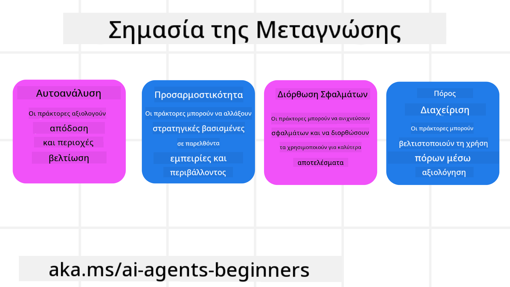

<!--
CO_OP_TRANSLATOR_METADATA:
{
  "original_hash": "8cbf460468c802c7994aa62e0e0779c9",
  "translation_date": "2025-07-12T12:37:25+00:00",
  "source_file": "09-metacognition/README.md",
  "language_code": "el"
}
-->
[](https://youtu.be/His9R6gw6Ec?si=3_RMb8VprNvdLRhX)

> _(Κάντε κλικ στην εικόνα παραπάνω για να δείτε το βίντεο αυτού του μαθήματος)_
# Μεταγνώση σε Πράκτορες Τεχνητής Νοημοσύνης

## Εισαγωγή

Καλώς ήρθατε στο μάθημα για τη μεταγνώση σε πράκτορες Τεχνητής Νοημοσύνης! Αυτό το κεφάλαιο απευθύνεται σε αρχάριους που ενδιαφέρονται να μάθουν πώς οι πράκτορες ΤΝ μπορούν να σκέφτονται για τις δικές τους διαδικασίες σκέψης. Στο τέλος αυτού του μαθήματος, θα κατανοήσετε βασικές έννοιες και θα έχετε πρακτικά παραδείγματα για να εφαρμόσετε τη μεταγνώση στο σχεδιασμό πρακτόρων ΤΝ.

## Στόχοι Μάθησης

Μετά την ολοκλήρωση αυτού του μαθήματος, θα μπορείτε να:

1. Κατανοήσετε τις επιπτώσεις των βρόχων συλλογισμού στον ορισμό των πρακτόρων.
2. Χρησιμοποιήσετε τεχνικές σχεδιασμού και αξιολόγησης για να βοηθήσετε πράκτορες που αυτοδιορθώνονται.
3. Δημιουργήσετε τους δικούς σας πράκτορες ικανούς να χειρίζονται κώδικα για την εκτέλεση εργασιών.

## Εισαγωγή στη Μεταγνώση

Η μεταγνώση αναφέρεται στις ανώτερες γνωστικές διαδικασίες που περιλαμβάνουν τη σκέψη για τη δική μας σκέψη. Για τους πράκτορες ΤΝ, αυτό σημαίνει την ικανότητα να αξιολογούν και να προσαρμόζουν τις ενέργειές τους με βάση την αυτογνωσία και τις προηγούμενες εμπειρίες. Η μεταγνώση, ή «σκέψη για τη σκέψη», είναι μια σημαντική έννοια στην ανάπτυξη συστημάτων πρακτόρων ΤΝ. Περιλαμβάνει τα συστήματα ΤΝ να είναι ενήμερα για τις εσωτερικές τους διαδικασίες και να μπορούν να παρακολουθούν, να ρυθμίζουν και να προσαρμόζουν τη συμπεριφορά τους ανάλογα. Όπως κάνουμε κι εμείς όταν «διαβάζουμε το περιβάλλον» ή εξετάζουμε ένα πρόβλημα. Αυτή η αυτογνωσία μπορεί να βοηθήσει τα συστήματα ΤΝ να παίρνουν καλύτερες αποφάσεις, να εντοπίζουν λάθη και να βελτιώνουν την απόδοσή τους με την πάροδο του χρόνου — συνδέοντας ξανά με το τεστ Turing και τη συζήτηση για το αν η ΤΝ θα κυριαρχήσει.

Στο πλαίσιο των πρακτόρων ΤΝ, η μεταγνώση μπορεί να βοηθήσει στην αντιμετώπιση διαφόρων προκλήσεων, όπως:
- Διαφάνεια: Εξασφάλιση ότι τα συστήματα ΤΝ μπορούν να εξηγήσουν τον συλλογισμό και τις αποφάσεις τους.
- Συλλογισμός: Ενίσχυση της ικανότητας των συστημάτων ΤΝ να συνθέτουν πληροφορίες και να παίρνουν ορθές αποφάσεις.
- Προσαρμογή: Δυνατότητα των συστημάτων ΤΝ να προσαρμόζονται σε νέα περιβάλλοντα και μεταβαλλόμενες συνθήκες.
- Αντίληψη: Βελτίωση της ακρίβειας των συστημάτων ΤΝ στην αναγνώριση και ερμηνεία δεδομένων από το περιβάλλον τους.

### Τι είναι η Μεταγνώση;

Η μεταγνώση, ή «σκέψη για τη σκέψη», είναι μια ανώτερη γνωστική διαδικασία που περιλαμβάνει αυτογνωσία και αυτορύθμιση των γνωστικών διαδικασιών. Στον χώρο της ΤΝ, η μεταγνώση δίνει τη δυνατότητα στους πράκτορες να αξιολογούν και να προσαρμόζουν τις στρατηγικές και τις ενέργειές τους, οδηγώντας σε βελτιωμένες ικανότητες επίλυσης προβλημάτων και λήψης αποφάσεων. Κατανοώντας τη μεταγνώση, μπορείτε να σχεδιάσετε πράκτορες ΤΝ που είναι όχι μόνο πιο έξυπνοι αλλά και πιο ευέλικτοι και αποδοτικοί. Στην πραγματική μεταγνώση, θα βλέπατε την ΤΝ να συλλογίζεται ρητά για τον δικό της συλλογισμό.

Παράδειγμα: «Προτίμησα φθηνότερες πτήσεις γιατί… μπορεί να χάνω απευθείας πτήσεις, οπότε ας ελέγξω ξανά.»
Παρακολουθεί πώς ή γιατί επέλεξε μια συγκεκριμένη διαδρομή.
- Σημειώνει ότι έκανε λάθη επειδή βασίστηκε υπερβολικά στις προτιμήσεις του χρήστη από την προηγούμενη φορά, οπότε τροποποιεί τη στρατηγική λήψης αποφάσεων και όχι μόνο την τελική πρόταση.
- Διαγιγνώσκει μοτίβα όπως: «Όποτε βλέπω τον χρήστη να αναφέρει ‘πολύς κόσμος’, δεν πρέπει μόνο να αφαιρώ ορισμένα αξιοθέατα αλλά και να αναλογίζομαι ότι η μέθοδος επιλογής ‘κορυφαίων αξιοθέατων’ είναι εσφαλμένη αν πάντα τα κατατάσσω με βάση τη δημοφιλία.»

### Σημασία της Μεταγνώσης στους Πράκτορες ΤΝ

Η μεταγνώση παίζει κρίσιμο ρόλο στο σχεδιασμό πρακτόρων ΤΝ για διάφορους λόγους:



- Αυτοαντανάκλαση: Οι πράκτορες μπορούν να αξιολογούν την απόδοσή τους και να εντοπίζουν σημεία προς βελτίωση.
- Ευελιξία: Οι πράκτορες μπορούν να τροποποιούν τις στρατηγικές τους με βάση προηγούμενες εμπειρίες και μεταβαλλόμενα περιβάλλοντα.
- Διόρθωση Λαθών: Οι πράκτορες μπορούν να εντοπίζουν και να διορθώνουν λάθη αυτόνομα, οδηγώντας σε πιο ακριβή αποτελέσματα.
- Διαχείριση Πόρων: Οι πράκτορες μπορούν να βελτιστοποιούν τη χρήση πόρων, όπως χρόνος και υπολογιστική ισχύς, μέσω σχεδιασμού και αξιολόγησης των ενεργειών τους.

## Συστατικά ενός Πράκτορα ΤΝ

Πριν εμβαθύνετε στις μεταγνωστικές διαδικασίες, είναι σημαντικό να κατανοήσετε τα βασικά συστατικά ενός πράκτορα ΤΝ. Ένας πράκτορας ΤΝ συνήθως αποτελείται από:

- Persona: Η προσωπικότητα και τα χαρακτηριστικά του πράκτορα, που καθορίζουν πώς αλληλεπιδρά με τους χρήστες.
- Εργαλεία: Οι δυνατότητες και οι λειτουργίες που μπορεί να εκτελέσει ο πράκτορας.
- Δεξιότητες: Η γνώση και η εμπειρογνωμοσύνη που διαθέτει ο πράκτορας.

Αυτά τα συστατικά συνεργάζονται για να δημιουργήσουν μια «μονάδα εξειδίκευσης» που μπορεί να εκτελεί συγκεκριμένες εργασίες.

**Παράδειγμα**:  
Σκεφτείτε έναν ταξιδιωτικό πράκτορα, μια υπηρεσία που όχι μόνο σχεδιάζει τις διακοπές σας αλλά και προσαρμόζει τη διαδρομή της με βάση δεδομένα σε πραγματικό χρόνο και προηγούμενες εμπειρίες πελατών.

### Παράδειγμα: Μεταγνώση σε Υπηρεσία Ταξιδιωτικού Πράκτορα

Φανταστείτε ότι σχεδιάζετε μια υπηρεσία ταξιδιωτικού πράκτορα με ΤΝ. Αυτός ο πράκτορας, «Travel Agent», βοηθά τους χρήστες να σχεδιάσουν τις διακοπές τους. Για να ενσωματώσετε τη μεταγνώση, ο Travel Agent πρέπει να αξιολογεί και να προσαρμόζει τις ενέργειές του με βάση την αυτογνωσία και τις προηγούμενες εμπειρίες. Δείτε πώς η μεταγνώση μπορεί να παίξει ρόλο:

#### Τρέχουσα Εργασία

Η τρέχουσα εργασία είναι να βοηθήσει έναν χρήστη να σχεδιάσει ένα ταξίδι στο Παρίσι.

#### Βήματα για την Ολοκλήρωση της Εργασίας

1. **Συλλογή Προτιμήσεων Χρήστη**: Ρωτήστε τον χρήστη για τις ημερομηνίες ταξιδιού, τον προϋπολογισμό, τα ενδιαφέροντα (π.χ. μουσεία, κουζίνα, ψώνια) και τυχόν ειδικές απαιτήσεις.
2. **Ανάκτηση Πληροφοριών**: Αναζητήστε επιλογές πτήσεων, καταλυμάτων, αξιοθέατων και εστιατορίων που ταιριάζουν με τις προτιμήσεις του χρήστη.
3. **Δημιουργία Προτάσεων**: Παρέχετε ένα εξατομικευμένο πρόγραμμα με λεπτομέρειες πτήσεων, κρατήσεις ξενοδοχείων και προτεινόμενες δραστηριότητες.
4. **Προσαρμογή με Βάση τα Σχόλια**: Ζητήστε σχόλια από τον χρήστη για τις προτάσεις και κάντε τις απαραίτητες προσαρμογές.

#### Απαιτούμενοι Πόροι

- Πρόσβαση σε βάσεις δεδομένων πτήσεων και κρατήσεων ξενοδοχείων.
- Πληροφορίες για αξιοθέατα και εστιατόρια του Παρισιού.
- Δεδομένα ανατροφοδότησης από προηγούμενες αλληλεπιδράσεις με χρήστες.

#### Εμπειρία και Αυτοαντανάκλαση

Ο Travel Agent χρησιμοποιεί τη μεταγνώση για να αξιολογεί την απόδοσή του και να μαθαίνει από προηγούμενες εμπειρίες. Για παράδειγμα:

1. **Ανάλυση Ανατροφοδότησης Χρήστη**: Ο Travel Agent εξετάζει τα σχόλια των χρηστών για να διαπιστώσει ποιες προτάσεις έγιναν αποδεκτές και ποιες όχι. Προσαρμόζει τις μελλοντικές προτάσεις ανάλογα.
2. **Ευελιξία**: Αν ένας χρήστης έχει αναφέρει προηγουμένως ότι δεν του αρέσουν τα πολυσύχναστα μέρη, ο Travel Agent θα αποφεύγει να προτείνει δημοφιλή τουριστικά σημεία κατά τις ώρες αιχμής.
3. **Διόρθωση Λαθών**: Αν ο Travel Agent έκανε λάθος σε μια προηγούμενη κράτηση, π.χ. πρότεινε ξενοδοχείο που ήταν πλήρες, μαθαίνει να ελέγχει καλύτερα τη διαθεσιμότητα πριν προτείνει.

#### Πρακτικό Παράδειγμα για Προγραμματιστές

Ακολουθεί ένα απλοποιημένο παράδειγμα κώδικα για το πώς μπορεί να ενσωματωθεί η μεταγνώση στον κώδικα του Travel Agent:

```python
class Travel_Agent:
    def __init__(self):
        self.user_preferences = {}
        self.experience_data = []

    def gather_preferences(self, preferences):
        self.user_preferences = preferences

    def retrieve_information(self):
        # Search for flights, hotels, and attractions based on preferences
        flights = search_flights(self.user_preferences)
        hotels = search_hotels(self.user_preferences)
        attractions = search_attractions(self.user_preferences)
        return flights, hotels, attractions

    def generate_recommendations(self):
        flights, hotels, attractions = self.retrieve_information()
        itinerary = create_itinerary(flights, hotels, attractions)
        return itinerary

    def adjust_based_on_feedback(self, feedback):
        self.experience_data.append(feedback)
        # Analyze feedback and adjust future recommendations
        self.user_preferences = adjust_preferences(self.user_preferences, feedback)

# Example usage
travel_agent = Travel_Agent()
preferences = {
    "destination": "Paris",
    "dates": "2025-04-01 to 2025-04-10",
    "budget": "moderate",
    "interests": ["museums", "cuisine"]
}
travel_agent.gather_preferences(preferences)
itinerary = travel_agent.generate_recommendations()
print("Suggested Itinerary:", itinerary)
feedback = {"liked": ["Louvre Museum"], "disliked": ["Eiffel Tower (too crowded)"]}
travel_agent.adjust_based_on_feedback(feedback)
```

#### Γιατί η Μεταγνώση Είναι Σημαντική

- **Αυτοαντανάκλαση**: Οι πράκτορες μπορούν να αναλύουν την απόδοσή τους και να εντοπίζουν σημεία βελτίωσης.
- **Ευελιξία**: Οι πράκτορες μπορούν να τροποποιούν τις στρατηγικές τους με βάση την ανατροφοδότηση και τις μεταβαλλόμενες συνθήκες.
- **Διόρθωση Λαθών**: Οι πράκτορες μπορούν να εντοπίζουν και να διορθώνουν λάθη αυτόνομα.
- **Διαχείριση Πόρων**: Οι πράκτορες μπορούν να βελτιστοποιούν τη χρήση πόρων, όπως χρόνος και υπολογιστική ισχύς.

Ενσωματώνοντας τη μεταγνώση, ο Travel Agent μπορεί να παρέχει πιο εξατομικευμένες και ακριβείς ταξιδιωτικές προτάσεις, βελτιώνοντας συνολικά την εμπειρία του χρήστη.

---

## 2. Σχεδιασμός σε Πράκτορες

Ο σχεδιασμός είναι ένα κρίσιμο στοιχείο της συμπεριφοράς ενός πράκτορα ΤΝ. Περιλαμβάνει τον καθορισμό των βημάτων που απαιτούνται για την επίτευξη ενός στόχου, λαμβάνοντας υπόψη την τρέχουσα κατάσταση, τους πόρους και πιθανά εμπόδια.

### Στοιχεία του Σχεδιασμού

- **Τρέχουσα Εργασία**: Ορισμός της εργασίας με σαφήνεια.
- **Βήματα για την Ολοκλήρωση της Εργασίας**: Διαχωρισμός της εργασίας σε διαχειρίσιμα βήματα.
- **Απαιτούμενοι Πόροι**: Αναγνώριση των απαραίτητων πόρων.
- **Εμπειρία**: Χρήση προηγούμενων εμπειριών για την ενημέρωση του σχεδιασμού.

**Παράδειγμα**:  
Ακολουθούν τα βήματα που πρέπει να ακολουθήσει ο Travel Agent για να βοηθήσει αποτελεσματικά έναν χρήστη να σχεδιάσει το ταξίδι του:

### Βήματα για τον Travel Agent

1. **Συλλογή Προτιμήσεων Χρήστη**
   - Ρωτήστε τον χρήστη για λεπτομέρειες σχετικά με τις ημερομηνίες ταξιδιού, τον προϋπολογισμό, τα ενδιαφέροντα και τυχόν ειδικές απαιτήσεις.
   - Παραδείγματα: «Πότε σκοπεύετε να ταξιδέψετε;» «Ποιο είναι το εύρος του προϋπολογισμού σας;» «Τι δραστηριότητες απολαμβάνετε στις διακοπές;»

2. **Ανάκτηση Πληροφοριών**
   - Αναζητήστε σχετικές επιλογές ταξιδιού βάσει των προτιμήσεων του χρήστη.
   - **Πτήσεις**: Βρείτε διαθέσιμες πτήσεις εντός του προϋπολογισμού και των προτιμώμενων ημερομηνιών.
   - **Καταλύματα**: Εντοπίστε ξενοδοχεία ή ενοικιαζόμενα που ταιριάζουν στις προτιμήσεις για τοποθεσία, τιμή και παροχές.
   - **Αξιοθέατα και Εστιατόρια**: Προσδιορίστε δημοφιλή αξιοθέατα, δραστηριότητες και επιλογές φαγητού που ταιριάζουν στα ενδιαφέροντα του χρήστη.

3. **Δημιουργία Προτάσεων**
   - Συγκεντρώστε τις πληροφορίες σε ένα εξατομικευμένο πρόγραμμα.
   - Παρέχετε λεπτομέρειες όπως επιλογές πτήσεων, κρατήσεις ξενοδοχείων και προτεινόμενες δραστηριότητες, προσαρμόζοντας τις προτάσεις στις προτιμήσεις του χρήστη.

4. **Παρουσίαση Προγράμματος στον Χρήστη**
   - Μοιραστείτε το προτεινόμενο πρόγραμμα με τον χρήστη για να το εξετάσει.
   - Παράδειγμα: «Ακολουθεί ένα προτεινόμενο πρόγραμμα για το ταξίδι σας στο Παρίσι. Περιλαμβάνει λεπτομέρειες πτήσεων, κρατήσεις ξενοδοχείων και λίστα με προτεινόμενες δραστηριότητες και εστιατόρια. Πείτε μου τη γνώμη σας!»

5. **Συλλογή Ανατροφοδότησης**
   - Ζητήστε σχόλια από τον χρήστη για το προτεινόμενο πρόγραμμα.
   - Παραδείγματα: «Σας αρέσουν οι επιλογές πτήσεων;» «Είναι το ξενοδοχείο κατάλληλο για τις ανάγκες σας;» «Υπάρχουν δραστηριότητες που θέλετε να προσθέσετε ή να αφαιρέσετε;»

6. **Προσαρμογή με Βάση την Ανατροφοδότηση**
   - Τροποποιήστε το πρόγραμμα με βάση τα σχόλια του χρήστη.
   - Κάντε τις απαραίτητες αλλαγές στις προτάσεις πτήσεων, καταλυμάτων και δραστηριοτήτων ώστε να ταιριάζουν καλύτερα στις προτιμήσεις του χρήστη.

7. **Τελική Επιβεβαίωση**
   - Παρουσιάστε το ενημερωμένο πρόγραμμα στον χρήστη για τελική επιβεβαίωση.
   - Παράδειγμα: «Έκανα τις αλλαγές με βάση τα σχόλιά σας. Ακολουθεί το ενημερωμένο πρόγραμμα. Είναι όλα εντάξει;»

8. **Κράτηση και Επιβεβαίωση Κρατήσεων**
   - Μόλις ο χρήστης εγκρίνει το πρόγραμμα, προχωρήστε στην κράτηση πτήσεων, καταλυμάτων και τυχόν προγραμματισμένων δραστηριοτήτων.
   - Στείλτε τα στοιχεία επιβεβαίωσης στον χρήστη.

9. **Παροχή Συνεχούς Υποστήριξης**
   - Παραμείνετε διαθέσιμοι για να βοηθήσετε τον χρήστη με τυχόν αλλαγές ή επιπλέον αιτήματα πριν και κατά τη διάρκεια του ταξιδιού.
   - Παράδειγμα: «Αν χρειαστείτε περαιτέρω βοήθεια κατά τη διάρκεια του ταξιδιού σας, μη διστάσετε να επικοινωνήσετε μαζί μου οποιαδήποτε στιγμή!»

### Παρά
### Προληπτική Φόρτωση Πλαισίου

Η Προληπτική Φόρτωση Πλαισίου περιλαμβάνει τη φόρτωση σχετικού πλαισίου ή πληροφοριών υπόβαθρου στο μοντέλο πριν από την επεξεργασία ενός ερωτήματος. Αυτό σημαίνει ότι το μοντέλο έχει πρόσβαση σε αυτές τις πληροφορίες από την αρχή, κάτι που μπορεί να το βοηθήσει να παράγει πιο ενημερωμένες απαντήσεις χωρίς να χρειάζεται να αναζητήσει επιπλέον δεδομένα κατά τη διάρκεια της διαδικασίας.

Ακολουθεί ένα απλοποιημένο παράδειγμα για το πώς μπορεί να μοιάζει η προληπτική φόρτωση πλαισίου σε μια εφαρμογή ταξιδιωτικού πράκτορα σε Python:

#### Επεξήγηση

1. **Αρχικοποίηση (`__init__` μέθοδος)**: Η κλάση `TravelAgent` φορτώνει εκ των προτέρων ένα λεξικό που περιέχει πληροφορίες για δημοφιλείς προορισμούς όπως το Παρίσι, το Τόκιο, η Νέα Υόρκη και το Σίδνεϊ. Το λεξικό αυτό περιλαμβάνει λεπτομέρειες όπως η χώρα, το νόμισμα, η γλώσσα και τα κύρια αξιοθέατα για κάθε προορισμό.

2. **Ανάκτηση Πληροφοριών (`get_destination_info` μέθοδος)**: Όταν ένας χρήστης ρωτά για έναν συγκεκριμένο προορισμό, η μέθοδος `get_destination_info` ανακτά τις σχετικές πληροφορίες από το προφορτωμένο λεξικό πλαισίου.

Με την προφορτωμένη πληροφορία, η εφαρμογή ταξιδιωτικού πράκτορα μπορεί να απαντά γρήγορα στα ερωτήματα των χρηστών χωρίς να χρειάζεται να αναζητήσει αυτές τις πληροφορίες σε εξωτερική πηγή σε πραγματικό χρόνο. Αυτό καθιστά την εφαρμογή πιο αποδοτική και ανταποκρινόμενη.

### Εκκίνηση Σχεδίου με Στόχο Πριν την Επανάληψη

Η εκκίνηση ενός σχεδίου με έναν στόχο σημαίνει να ξεκινάμε με έναν σαφή σκοπό ή επιθυμητό αποτέλεσμα στο μυαλό. Ορίζοντας αυτόν τον στόχο εξαρχής, το μοντέλο μπορεί να τον χρησιμοποιήσει ως καθοδηγητική αρχή καθ’ όλη τη διάρκεια της επαναληπτικής διαδικασίας. Αυτό βοηθά να διασφαλιστεί ότι κάθε επανάληψη φέρνει το αποτέλεσμα πιο κοντά στην επίτευξη του επιθυμητού αποτελέσματος, καθιστώντας τη διαδικασία πιο αποδοτική και εστιασμένη.

Ακολουθεί ένα παράδειγμα για το πώς μπορεί να ξεκινήσει ένα ταξιδιωτικό σχέδιο με έναν στόχο πριν την επανάληψη για έναν ταξιδιωτικό πράκτορα σε Python:

### Σενάριο

Ένας ταξιδιωτικός πράκτορας θέλει να σχεδιάσει μια εξατομικευμένη διακοπή για έναν πελάτη. Ο στόχος είναι να δημιουργηθεί ένα ταξιδιωτικό πρόγραμμα που μεγιστοποιεί την ικανοποίηση του πελάτη βάσει των προτιμήσεων και του προϋπολογισμού του.

### Βήματα

1. Ορισμός των προτιμήσεων και του προϋπολογισμού του πελάτη.
2. Εκκίνηση του αρχικού σχεδίου βάσει αυτών των προτιμήσεων.
3. Επανάληψη για βελτίωση του σχεδίου, βελτιστοποιώντας την ικανοποίηση του πελάτη.

#### Κώδικας Python

#### Επεξήγηση Κώδικα

1. **Αρχικοποίηση (`__init__` μέθοδος)**: Η κλάση `TravelAgent` αρχικοποιείται με μια λίστα πιθανών προορισμών, καθένας με χαρακτηριστικά όπως όνομα, κόστος και τύπο δραστηριότητας.

2. **Εκκίνηση Σχεδίου (`bootstrap_plan` μέθοδος)**: Αυτή η μέθοδος δημιουργεί ένα αρχικό ταξιδιωτικό σχέδιο βάσει των προτιμήσεων και του προϋπολογισμού του πελάτη. Διατρέχει τη λίστα προορισμών και προσθέτει αυτούς που ταιριάζουν στις προτιμήσεις και εμπίπτουν στον προϋπολογισμό.

3. **Ταύτιση Προτιμήσεων (`match_preferences` μέθοδος)**: Ελέγχει αν ένας προορισμός ταιριάζει με τις προτιμήσεις του πελάτη.

4. **Επανάληψη Σχεδίου (`iterate_plan` μέθοδος)**: Βελτιώνει το αρχικό σχέδιο προσπαθώντας να αντικαταστήσει κάθε προορισμό με έναν καλύτερο που λαμβάνει υπόψη τις προτιμήσεις και τους περιορισμούς του προϋπολογισμού.

5. **Υπολογισμός Κόστους (`calculate_cost` μέθοδος)**: Υπολογίζει το συνολικό κόστος του τρέχοντος σχεδίου, συμπεριλαμβανομένου ενός πιθανού νέου προορισμού.

#### Παράδειγμα Χρήσης

- **Αρχικό Σχέδιο**: Ο ταξιδιωτικός πράκτορας δημιουργεί ένα αρχικό σχέδιο βάσει των προτιμήσεων του πελάτη για αξιοθέατα και προϋπολογισμό $2000.
- **Βελτιωμένο Σχέδιο**: Ο ταξιδιωτικός πράκτορας επαναλαμβάνει το σχέδιο, βελτιστοποιώντας το για τις προτιμήσεις και τον προϋπολογισμό του πελάτη.

Με το να ξεκινά το σχέδιο με έναν σαφή στόχο (π.χ. μεγιστοποίηση της ικανοποίησης του πελάτη) και να το βελτιώνει με επαναλήψεις, ο ταξιδιωτικός πράκτορας μπορεί να δημιουργήσει ένα εξατομικευμένο και βελτιστοποιημένο ταξιδιωτικό πρόγραμμα για τον πελάτη. Αυτή η προσέγγιση διασφαλίζει ότι το σχέδιο ευθυγραμμίζεται με τις προτιμήσεις και τον προϋπολογισμό από την αρχή και βελτιώνεται σε κάθε επανάληψη.

### Αξιοποίηση των LLM για Επανακατάταξη και Βαθμολόγηση

Τα Μεγάλα Γλωσσικά Μοντέλα (LLMs) μπορούν να χρησιμοποιηθούν για επανακατάταξη και βαθμολόγηση αξιολογώντας τη συνάφεια και την ποιότητα των ανακτηθέντων εγγράφων ή των παραγόμενων απαντήσεων. Δείτε πώς λειτουργεί:

**Ανάκτηση:** Το αρχικό βήμα ανάκτησης φέρνει ένα σύνολο υποψήφιων εγγράφων ή απαντήσεων βάσει του ερωτήματος.

**Επανακατάταξη:** Το LLM αξιολογεί αυτούς τους υποψήφιους και τους επαναταξινομεί βάσει της συνάφειας και της ποιότητας. Αυτό το βήμα διασφαλίζει ότι οι πιο σχετικές και ποιοτικές πληροφορίες εμφανίζονται πρώτες.

**Βαθμολόγηση:** Το LLM αναθέτει βαθμολογίες σε κάθε υποψήφιο, αντανακλώντας τη συνάφεια και την ποιότητά τους. Αυτό βοηθά στην επιλογή της καλύτερης απάντησης ή εγγράφου για τον χρήστη.

Με την αξιοποίηση των LLM για επανακατάταξη και βαθμολόγηση, το σύστημα μπορεί να παρέχει πιο ακριβείς και συμφραζόμενα σχετικές πληροφορίες, βελτιώνοντας τη συνολική εμπειρία του χρήστη.

Ακολουθεί ένα παράδειγμα για το πώς ένας ταξιδιωτικός πράκτορας μπορεί να χρησιμοποιήσει ένα Μεγάλο Γλωσσικό Μοντέλο (LLM) για επανακατάταξη και βαθμολόγηση προορισμών ταξιδιού βάσει των προτιμήσεων του χρήστη σε Python:

#### Σενάριο - Ταξίδι βάσει Προτιμήσεων

Ένας ταξιδιωτικός πράκτορας θέλει να προτείνει τους καλύτερους προορισμούς σε έναν πελάτη βάσει των προτιμήσεών του. Το LLM θα βοηθήσει στην επανακατάταξη και βαθμολόγηση των προορισμών ώστε να παρουσιαστούν οι πιο σχετικές επιλογές.

#### Βήματα:

1. Συλλογή προτιμήσεων χρήστη.
2. Ανάκτηση λίστας πιθανών προορισμών.
3. Χρήση του LLM για επανακατάταξη και βαθμολόγηση των προορισμών βάσει των προτιμήσεων.

Ακολουθεί πώς μπορείτε να ενημερώσετε το προηγούμενο παράδειγμα για να χρησιμοποιήσετε τις Υπηρεσίες Azure OpenAI:

#### Απαιτήσεις

1. Να έχετε συνδρομή Azure.
2. Δημιουργήστε έναν πόρο Azure OpenAI και αποκτήστε το API key σας.

#### Παράδειγμα Κώδικα Python

#### Επεξήγηση Κώδικα - Preference Booker

1. **Αρχικοποίηση**: Η κλάση `TravelAgent` αρχικοποιείται με μια λίστα πιθανών προορισμών, καθένας με χαρακτηριστικά όπως όνομα και περιγραφή.

2. **Λήψη Προτάσεων (`get_recommendations` μέθοδος)**: Αυτή η μέθοδος δημιουργεί ένα prompt για την υπηρεσία Azure OpenAI βάσει των προτιμήσεων του χρήστη και κάνει ένα HTTP POST αίτημα στο API της Azure OpenAI για να λάβει επαναταξινομημένες και βαθμολογημένες προτάσεις.

3. **Δημιουργία Prompt (`generate_prompt` μέθοδος)**: Κατασκευάζει ένα prompt για το Azure OpenAI, που περιλαμβάνει τις προτιμήσεις του χρήστη και τη λίστα προορισμών. Το prompt καθοδηγεί το μοντέλο να επαναταξινομήσει και να βαθμολογήσει τους προορισμούς βάσει των παρεχόμενων προτιμήσεων.

4. **Κλήση API**: Η βιβλιοθήκη `requests` χρησιμοποιείται για να κάνει ένα HTTP POST αίτημα στο endpoint του Azure OpenAI API. Η απάντηση περιέχει τους επαναταξινομημένους και βαθμολογημένους προορισμούς.

5. **Παράδειγμα Χρήσης**: Ο ταξιδιωτικός πράκτορας συλλέγει τις προτιμήσεις του χρήστη (π.χ. ενδιαφέρον για αξιοθέατα και ποικιλία πολιτισμών) και χρησιμοποιεί την υπηρεσία Azure OpenAI για να λάβει επαναταξινομημένες και βαθμολογημένες προτάσεις προορισμών.

Φροντίστε να αντικαταστήσετε το `your_azure_openai_api_key` με το πραγματικό σας κλειδί API και το `https://your-endpoint.com/...` με το πραγματικό URL του endpoint της Azure OpenAI υπηρεσίας σας.

Με την αξιοποίηση του LLM για επανακατάταξη και βαθμολόγηση, ο ταξιδιωτικός πράκτορας μπορεί να παρέχει πιο εξατομικευμένες και σχετικές ταξιδιωτικές προτάσεις στους πελάτες, βελτιώνοντας τη συνολική τους εμπειρία.

### RAG: Τεχνική Prompting vs Εργαλείο

Η Retrieval-Augmented Generation (RAG) μπορεί να είναι τόσο μια τεχνική prompting όσο και ένα εργαλείο στην ανάπτυξη AI πρακτόρων. Η κατανόηση της διαφοράς μεταξύ των δύο μπορεί να σας βοηθήσει να αξιοποιήσετε καλύτερα το RAG στα έργα σας.

#### RAG ως Τεχνική Prompting

**Τι είναι;**

- Ως τεχνική prompting, το RAG περιλαμβάνει τη διατύπωση συγκεκριμένων ερωτημάτων ή prompts για να καθοδηγήσει την ανάκτηση σχετικών πληροφοριών από ένα μεγάλο σώμα ή βάση δεδομένων. Αυτές οι πληροφορίες χρησιμοποιούνται στη συνέχεια για τη δημιουργία απαντήσεων ή ενεργειών.

**Πώς λειτουργεί:**

1. **Διατύπωση Prompts**: Δημιουργία καλά δομημένων prompts ή ερωτημάτων βάσει της εργασίας ή της εισόδου του χρήστη.
2. **Ανάκτηση Πληροφοριών**: Χρήση των prompts για αναζήτηση σχετικών δεδομένων από υπάρχουσα βάση γνώσης ή σύνολο δεδομένων.
3. **Παραγωγή Απάντησης**: Συνδυασμός των ανακτηθέντων πληροφοριών με γενετικά μοντέλα AI για την παραγωγή μιας ολοκληρωμένης και συνεκτικής απάντησης.

**Παράδειγμα σε Ταξιδιωτικό Πράκτορα**:

- Είσοδος Χρήστη: "Θέλω να επισκεφθώ μουσεία στο Παρίσι."
- Prompt: "Βρες τα κορυφαία μουσεία στο Παρίσι."
- Ανακτηθείσες Πληροφορίες: Λεπτομέρειες για το Μουσείο του Λούβρου, το Musée d'Orsay κ.ά.
- Παραγόμενη Απάντηση: "Εδώ είναι μερικά κορυφαία μουσεία στο Παρίσι: Μουσείο του Λούβρου, Musée d'Orsay και Centre Pompidou."

#### RAG ως Εργαλείο

**Τι είναι;**

- Ως εργαλείο, το RAG είναι ένα ολοκληρωμένο σύστημα που αυτοματοποιεί τη διαδικασία ανάκτησης και παραγωγής, διευκολύνοντας τους προγραμματιστές να υλοποιήσουν σύνθετες λειτουργίες AI χωρίς να χρειάζεται να δημιουργούν χειροκίνητα prompts για κάθε ερώτημα.

**Πώς λειτουργεί:**

1. **Ενσωμάτωση**: Ενσωμάτωση του RAG στην αρχιτεκτονική του AI πράκτορα, επιτρέποντάς του να χειρίζεται αυτόματα τις εργασίες ανάκτησης και παραγωγής.
2. **Αυτοματοποίηση**: Το εργαλείο διαχειρίζεται ολόκληρη τη διαδικασία, από τη λήψη της εισόδου του χρήστη μέχρι την παραγωγή της τελικής απάντησης, χωρίς να απαιτούνται ρητά prompts για κάθε βήμα.
3. **Αποδοτικότητα**: Βελτιώνει την απόδοση του πράκτορα απλοποιώντας τη διαδικασία ανάκτησης και παραγωγής, επιτρέποντας ταχύτερες και πιο ακριβείς απαντήσεις.

**Παράδειγμα σε Ταξιδιωτικό Πράκτορα**:

- Είσοδος Χρήστη: "Θέλω να επισκεφθώ μουσεία στο Παρίσι."
- Εργαλείο RAG: Αυτόματα ανακτά πληροφορίες για μουσεία και παράγει απάντηση.
- Παραγόμενη Απάντηση: "Εδώ είναι μερικά κορυφαία μουσεία στο Παρίσι: Μουσείο του Λούβρου, Musée d'Orsay και Centre Pompidou."

### Σύγκριση

| Χαρακτηριστικό          | Τεχνική Prompting                                         | Εργαλείο                                               |
|-------------------------|-----------------------------------------------------------|--------------------------------------------------------|
| **Χειροκίνητο vs Αυτόματο** | Χειροκίνητη διατύπωση prompts για κάθε ερώτημα.          | Αυτοματοποιημένη διαδικασία ανάκτησης και παραγωγής.    |
| **Έλεγχος**             | Παρέχει μεγαλύτερο έλεγχο στη διαδικασία ανάκτησης.       | Απλοποιεί και αυτοματοποιεί την ανάκτηση και παραγωγή. |
| **Ευελιξία**            | Επιτρέπει προσαρμοσμένα prompts βάσει συγκεκριμένων αναγκών.| Πιο αποδοτικό για υλοποιήσεις μεγάλης κλίμακας.        |
| **Πολυπλοκότητα**       | Απαιτεί δημιουργία και ρύθμιση των prompts.               | Εύκολο στην ενσωμάτωση στην αρχιτεκτονική AI πράκτορα.|

### Πρακτικά Παραδείγματα

**Παράδειγμα Τεχνικής Prompting:**

**Παράδειγμα Εργαλείου:**

### Αξιολόγηση Συνάφειας

Η αξιολόγηση της συνάφειας είναι κρίσιμο στοιχείο της απόδοσης ενός AI πράκτορα. Διασφαλίζει ότι οι πληροφορίες που ανακτώνται και παράγονται από τον πράκτορα είναι κατάλληλες, ακριβείς και χρήσιμες για τον χρήστη. Ας δούμε πώς να αξιολογούμε τη συνάφεια σε AI πράκτορες, με πρακτικά παραδείγματα και τεχνικές.

#### Κύριες Έννοιες στην Αξιολόγηση Συνάφειας

1. **Επίγνωση Πλαισίου**:
   - Ο πράκτορας πρέπει να κατανοεί το πλαίσιο του ερωτήματος του χρήστη για να ανακτήσει και να παράγει σχετικές πληροφορίες.
   - Παράδειγμα: Αν ο χρήστης ζητά "τα καλύτερα εστιατόρια στο Παρίσι", ο πράκτορας πρέπει να λάβει υπόψη τις προτιμήσεις του χρήστη, όπως τύπο κουζίνας και προϋπολογισμό.

2. **Ακρίβεια**:
   - Οι πληροφορίες που παρέχει ο πράκτορας πρέπει να είναι αληθείς και ενημερωμένες.
   - Παράδειγμα: Να προτείνει εστιατόρια που είναι ανοιχτά και έχουν καλές κριτικές, όχι παλιά ή κλειστά.

3. **Σκοπός Χρήστη**:
   - Ο πράκτορας πρέπει να ε
#### Πρακτικό Παράδειγμα: Αναζήτηση με Πρόθεση στον Travel Agent

Ας πάρουμε τον Travel Agent ως παράδειγμα για να δούμε πώς μπορεί να υλοποιηθεί η αναζήτηση με πρόθεση.

1. **Συλλογή Προτιμήσεων Χρήστη**

   ```python
   class Travel_Agent:
       def __init__(self):
           self.user_preferences = {}

       def gather_preferences(self, preferences):
           self.user_preferences = preferences
   ```

2. **Κατανόηση της Πρόθεσης του Χρήστη**

   ```python
   def identify_intent(query):
       if "book" in query or "purchase" in query:
           return "transactional"
       elif "website" in query or "official" in query:
           return "navigational"
       else:
           return "informational"
   ```

3. **Επίγνωση του Πλαισίου**

   ```python
   def analyze_context(query, user_history):
       # Combine current query with user history to understand context
       context = {
           "current_query": query,
           "user_history": user_history
       }
       return context
   ```

4. **Αναζήτηση και Εξατομίκευση Αποτελεσμάτων**

   ```python
   def search_with_intent(query, preferences, user_history):
       intent = identify_intent(query)
       context = analyze_context(query, user_history)
       if intent == "informational":
           search_results = search_information(query, preferences)
       elif intent == "navigational":
           search_results = search_navigation(query)
       elif intent == "transactional":
           search_results = search_transaction(query, preferences)
       personalized_results = personalize_results(search_results, user_history)
       return personalized_results

   def search_information(query, preferences):
       # Example search logic for informational intent
       results = search_web(f"best {preferences['interests']} in {preferences['destination']}")
       return results

   def search_navigation(query):
       # Example search logic for navigational intent
       results = search_web(query)
       return results

   def search_transaction(query, preferences):
       # Example search logic for transactional intent
       results = search_web(f"book {query} to {preferences['destination']}")
       return results

   def personalize_results(results, user_history):
       # Example personalization logic
       personalized = [result for result in results if result not in user_history]
       return personalized[:10]  # Return top 10 personalized results
   ```

5. **Παράδειγμα Χρήσης**

   ```python
   travel_agent = Travel_Agent()
   preferences = {
       "destination": "Paris",
       "interests": ["museums", "cuisine"]
   }
   travel_agent.gather_preferences(preferences)
   user_history = ["Louvre Museum website", "Book flight to Paris"]
   query = "best museums in Paris"
   results = search_with_intent(query, preferences, user_history)
   print("Search Results:", results)
   ```

---

## 4. Δημιουργία Κώδικα ως Εργαλείο

Οι πράκτορες δημιουργίας κώδικα χρησιμοποιούν μοντέλα AI για να γράφουν και να εκτελούν κώδικα, επιλύοντας σύνθετα προβλήματα και αυτοματοποιώντας εργασίες.

### Πράκτορες Δημιουργίας Κώδικα

Οι πράκτορες δημιουργίας κώδικα αξιοποιούν γενετικά μοντέλα AI για να γράφουν και να εκτελούν κώδικα. Αυτοί οι πράκτορες μπορούν να επιλύουν πολύπλοκα προβλήματα, να αυτοματοποιούν εργασίες και να παρέχουν πολύτιμες πληροφορίες δημιουργώντας και εκτελώντας κώδικα σε διάφορες γλώσσες προγραμματισμού.

#### Πρακτικές Εφαρμογές

1. **Αυτοματοποιημένη Δημιουργία Κώδικα**: Δημιουργία αποσπασμάτων κώδικα για συγκεκριμένες εργασίες, όπως ανάλυση δεδομένων, web scraping ή μηχανική μάθηση.
2. **SQL ως RAG**: Χρήση ερωτημάτων SQL για ανάκτηση και διαχείριση δεδομένων από βάσεις.
3. **Επίλυση Προβλημάτων**: Δημιουργία και εκτέλεση κώδικα για την επίλυση συγκεκριμένων προβλημάτων, όπως βελτιστοποίηση αλγορίθμων ή ανάλυση δεδομένων.

#### Παράδειγμα: Πράκτορας Δημιουργίας Κώδικα για Ανάλυση Δεδομένων

Φανταστείτε ότι σχεδιάζετε έναν πράκτορα δημιουργίας κώδικα. Δείτε πώς θα λειτουργούσε:

1. **Εργασία**: Ανάλυση ενός συνόλου δεδομένων για την αναγνώριση τάσεων και προτύπων.
2. **Βήματα**:
   - Φόρτωση του συνόλου δεδομένων σε εργαλείο ανάλυσης.
   - Δημιουργία ερωτημάτων SQL για φιλτράρισμα και συγκέντρωση δεδομένων.
   - Εκτέλεση των ερωτημάτων και ανάκτηση αποτελεσμάτων.
   - Χρήση των αποτελεσμάτων για δημιουργία οπτικοποιήσεων και συμπερασμάτων.
3. **Απαιτούμενοι Πόροι**: Πρόσβαση στο σύνολο δεδομένων, εργαλεία ανάλυσης και δυνατότητες SQL.
4. **Εμπειρία**: Χρήση προηγούμενων αναλύσεων για βελτίωση της ακρίβειας και της συνάφειας μελλοντικών αναλύσεων.

### Παράδειγμα: Πράκτορας Δημιουργίας Κώδικα για Travel Agent

Σε αυτό το παράδειγμα, θα σχεδιάσουμε έναν πράκτορα δημιουργίας κώδικα, τον Travel Agent, για να βοηθά τους χρήστες στον προγραμματισμό ταξιδιών δημιουργώντας και εκτελώντας κώδικα. Αυτός ο πράκτορας μπορεί να αναλαμβάνει εργασίες όπως η ανάκτηση επιλογών ταξιδιού, το φιλτράρισμα αποτελεσμάτων και η σύνταξη προγράμματος ταξιδιού χρησιμοποιώντας γενετική AI.

#### Επισκόπηση του Πράκτορα Δημιουργίας Κώδικα

1. **Συλλογή Προτιμήσεων Χρήστη**: Συλλέγει πληροφορίες όπως προορισμός, ημερομηνίες ταξιδιού, προϋπολογισμός και ενδιαφέροντα.
2. **Δημιουργία Κώδικα για Ανάκτηση Δεδομένων**: Δημιουργεί αποσπάσματα κώδικα για την ανάκτηση πληροφοριών σχετικά με πτήσεις, ξενοδοχεία και αξιοθέατα.
3. **Εκτέλεση Δημιουργημένου Κώδικα**: Εκτελεί τον κώδικα για να αντλήσει πληροφορίες σε πραγματικό χρόνο.
4. **Δημιουργία Προγράμματος Ταξιδιού**: Συντάσσει τα ανακτηθέντα δεδομένα σε ένα εξατομικευμένο σχέδιο ταξιδιού.
5. **Προσαρμογή με Βάση τα Σχόλια**: Λαμβάνει ανατροφοδότηση από τον χρήστη και αναδημιουργεί κώδικα αν χρειαστεί για να βελτιώσει τα αποτελέσματα.

#### Βήμα-βήμα Υλοποίηση

1. **Συλλογή Προτιμήσεων Χρήστη**

   ```python
   class Travel_Agent:
       def __init__(self):
           self.user_preferences = {}

       def gather_preferences(self, preferences):
           self.user_preferences = preferences
   ```

2. **Δημιουργία Κώδικα για Ανάκτηση Δεδομένων**

   ```python
   def generate_code_to_fetch_data(preferences):
       # Example: Generate code to search for flights based on user preferences
       code = f"""
       def search_flights():
           import requests
           response = requests.get('https://api.example.com/flights', params={preferences})
           return response.json()
       """
       return code

   def generate_code_to_fetch_hotels(preferences):
       # Example: Generate code to search for hotels
       code = f"""
       def search_hotels():
           import requests
           response = requests.get('https://api.example.com/hotels', params={preferences})
           return response.json()
       """
       return code
   ```

3. **Εκτέλεση Δημιουργημένου Κώδικα**

   ```python
   def execute_code(code):
       # Execute the generated code using exec
       exec(code)
       result = locals()
       return result

   travel_agent = Travel_Agent()
   preferences = {
       "destination": "Paris",
       "dates": "2025-04-01 to 2025-04-10",
       "budget": "moderate",
       "interests": ["museums", "cuisine"]
   }
   travel_agent.gather_preferences(preferences)
   
   flight_code = generate_code_to_fetch_data(preferences)
   hotel_code = generate_code_to_fetch_hotels(preferences)
   
   flights = execute_code(flight_code)
   hotels = execute_code(hotel_code)

   print("Flight Options:", flights)
   print("Hotel Options:", hotels)
   ```

4. **Δημιουργία Προγράμματος Ταξιδιού**

   ```python
   def generate_itinerary(flights, hotels, attractions):
       itinerary = {
           "flights": flights,
           "hotels": hotels,
           "attractions": attractions
       }
       return itinerary

   attractions = search_attractions(preferences)
   itinerary = generate_itinerary(flights, hotels, attractions)
   print("Suggested Itinerary:", itinerary)
   ```

5. **Προσαρμογή με Βάση τα Σχόλια**

   ```python
   def adjust_based_on_feedback(feedback, preferences):
       # Adjust preferences based on user feedback
       if "liked" in feedback:
           preferences["favorites"] = feedback["liked"]
       if "disliked" in feedback:
           preferences["avoid"] = feedback["disliked"]
       return preferences

   feedback = {"liked": ["Louvre Museum"], "disliked": ["Eiffel Tower (too crowded)"]}
   updated_preferences = adjust_based_on_feedback(feedback, preferences)
   
   # Regenerate and execute code with updated preferences
   updated_flight_code = generate_code_to_fetch_data(updated_preferences)
   updated_hotel_code = generate_code_to_fetch_hotels(updated_preferences)
   
   updated_flights = execute_code(updated_flight_code)
   updated_hotels = execute_code(updated_hotel_code)
   
   updated_itinerary = generate_itinerary(updated_flights, updated_hotels, attractions)
   print("Updated Itinerary:", updated_itinerary)
   ```

### Αξιοποίηση της Περιβαλλοντικής Επίγνωσης και της Λογικής

Η κατανόηση του σχήματος του πίνακα μπορεί να βελτιώσει τη διαδικασία δημιουργίας ερωτημάτων αξιοποιώντας την περιβαλλοντική επίγνωση και τη λογική.

Ακολουθεί ένα παράδειγμα για το πώς μπορεί να γίνει αυτό:

1. **Κατανόηση του Σχήματος**: Το σύστημα κατανοεί το σχήμα του πίνακα και χρησιμοποιεί αυτές τις πληροφορίες για να βασίσει τη δημιουργία των ερωτημάτων.
2. **Προσαρμογή με Βάση τα Σχόλια**: Το σύστημα προσαρμόζει τις προτιμήσεις του χρήστη με βάση τα σχόλια και αποφασίζει ποια πεδία του σχήματος πρέπει να ενημερωθούν.
3. **Δημιουργία και Εκτέλεση Ερωτημάτων**: Το σύστημα δημιουργεί και εκτελεί ερωτήματα για να ανακτήσει ενημερωμένα δεδομένα πτήσεων και ξενοδοχείων με βάση τις νέες προτιμήσεις.

Ακολουθεί ένα ενημερωμένο παράδειγμα κώδικα Python που ενσωματώνει αυτές τις έννοιες:

```python
def adjust_based_on_feedback(feedback, preferences, schema):
    # Adjust preferences based on user feedback
    if "liked" in feedback:
        preferences["favorites"] = feedback["liked"]
    if "disliked" in feedback:
        preferences["avoid"] = feedback["disliked"]
    # Reasoning based on schema to adjust other related preferences
    for field in schema:
        if field in preferences:
            preferences[field] = adjust_based_on_environment(feedback, field, schema)
    return preferences

def adjust_based_on_environment(feedback, field, schema):
    # Custom logic to adjust preferences based on schema and feedback
    if field in feedback["liked"]:
        return schema[field]["positive_adjustment"]
    elif field in feedback["disliked"]:
        return schema[field]["negative_adjustment"]
    return schema[field]["default"]

def generate_code_to_fetch_data(preferences):
    # Generate code to fetch flight data based on updated preferences
    return f"fetch_flights(preferences={preferences})"

def generate_code_to_fetch_hotels(preferences):
    # Generate code to fetch hotel data based on updated preferences
    return f"fetch_hotels(preferences={preferences})"

def execute_code(code):
    # Simulate execution of code and return mock data
    return {"data": f"Executed: {code}"}

def generate_itinerary(flights, hotels, attractions):
    # Generate itinerary based on flights, hotels, and attractions
    return {"flights": flights, "hotels": hotels, "attractions": attractions}

# Example schema
schema = {
    "favorites": {"positive_adjustment": "increase", "negative_adjustment": "decrease", "default": "neutral"},
    "avoid": {"positive_adjustment": "decrease", "negative_adjustment": "increase", "default": "neutral"}
}

# Example usage
preferences = {"favorites": "sightseeing", "avoid": "crowded places"}
feedback = {"liked": ["Louvre Museum"], "disliked": ["Eiffel Tower (too crowded)"]}
updated_preferences = adjust_based_on_feedback(feedback, preferences, schema)

# Regenerate and execute code with updated preferences
updated_flight_code = generate_code_to_fetch_data(updated_preferences)
updated_hotel_code = generate_code_to_fetch_hotels(updated_preferences)

updated_flights = execute_code(updated_flight_code)
updated_hotels = execute_code(updated_hotel_code)

updated_itinerary = generate_itinerary(updated_flights, updated_hotels, feedback["liked"])
print("Updated Itinerary:", updated_itinerary)
```

#### Επεξήγηση - Κράτηση με Βάση τα Σχόλια

1. **Επίγνωση Σχήματος**: Το λεξικό `schema` ορίζει πώς πρέπει να προσαρμόζονται οι προτιμήσεις με βάση τα σχόλια. Περιλαμβάνει πεδία όπως `favorites` και `avoid` με αντίστοιχες προσαρμογές.
2. **Προσαρμογή Προτιμήσεων (μέθοδος `adjust_based_on_feedback`)**: Αυτή η μέθοδος προσαρμόζει τις προτιμήσεις με βάση τα σχόλια του χρήστη και το σχήμα.
3. **Προσαρμογές με Βάση το Περιβάλλον (μέθοδος `adjust_based_on_environment`)**: Αυτή η μέθοδος εξατομικεύει τις προσαρμογές με βάση το σχήμα και τα σχόλια.
4. **Δημιουργία και Εκτέλεση Ερωτημάτων**: Το σύστημα δημιουργεί κώδικα για την ανάκτηση ενημερωμένων δεδομένων πτήσεων και ξενοδοχείων με βάση τις προσαρμοσμένες προτιμήσεις και προσομοιώνει την εκτέλεση αυτών των ερωτημάτων.
5. **Δημιουργία Προγράμματος Ταξιδιού**: Το σύστημα δημιουργεί ένα ενημερωμένο πρόγραμμα ταξιδιού με βάση τα νέα δεδομένα πτήσεων, ξενοδοχείων και αξιοθέατων.

Με το να κάνει το σύστημα περιβαλλοντικά επίγνωστο και να βασίζεται σε λογική με βάση το σχήμα, μπορεί να δημιουργεί πιο ακριβή και συναφή ερωτήματα, οδηγώντας σε καλύτερες ταξιδιωτικές προτάσεις και μια πιο εξατομικευμένη εμπειρία χρήστη.

### Χρήση του SQL ως Τεχνική Retrieval-Augmented Generation (RAG)

Το SQL (Structured Query Language) είναι ένα ισχυρό εργαλείο για την αλληλεπίδραση με βάσεις δεδομένων. Όταν χρησιμοποιείται ως μέρος μιας προσέγγισης Retrieval-Augmented Generation (RAG), το SQL μπορεί να ανακτήσει σχετικά δεδομένα από βάσεις για να ενημερώσει και να δημιουργήσει απαντήσεις ή ενέργειες σε πράκτορες AI. Ας δούμε πώς μπορεί να χρησιμοποιηθεί το SQL ως τεχνική RAG στο πλαίσιο του Travel Agent.

#### Βασικές Έννοιες

1. **Αλληλεπίδραση με Βάση Δεδομένων**:
   - Το SQL χρησιμοποιείται για την εκτέλεση ερωτημάτων σε βάσεις, την ανάκτηση σχετικών πληροφοριών και τη διαχείριση δεδομένων.
   - Παράδειγμα: Ανάκτηση στοιχείων πτήσεων, πληροφοριών ξενοδοχείων και αξιοθέατων από μια ταξιδιωτική βάση.

2. **Ενσωμάτωση με RAG**:
   - Τα ερωτήματα SQL δημιουργούνται με βάση τις εισροές και τις προτιμήσεις του χρήστη.
   - Τα ανακτηθέντα δεδομένα χρησιμοποιούνται για τη δημιουργία εξατομικευμένων προτάσεων ή ενεργειών.

3. **Δυναμική Δημιουργία Ερωτημάτων**:
   - Ο πράκτορας AI δημιουργεί δυναμικά ερωτήματα SQL με βάση το πλαίσιο και τις ανάγκες του χρήστη.
   - Παράδειγμα: Προσαρμογή ερωτημάτων SQL για φιλτράρισμα αποτελεσμάτων με βάση τον προϋπολογισμό, τις ημερομηνίες και τα ενδιαφέροντα.

#### Εφαρμογές

- **Αυτοματοποιημένη Δημιουργία Κώδικα**: Δημιουργία αποσπασμάτων κώδικα για συγκεκριμένες εργασίες.
- **SQL ως RAG**: Χρήση ερωτημάτων SQL για διαχείριση δεδομένων.
- **Επίλυση Προβλημάτων**: Δημιουργία και εκτέλεση κώδικα για επίλυση προβλημάτων.

**Παράδειγμα**: Πράκτορας ανάλυσης δεδομένων:

1. **Εργασία**: Ανάλυση συνόλου δεδομένων για εύρεση τάσεων.
2. **Βήματα**:
   - Φόρτωση συνόλου δεδομένων.
   - Δημιουργία ερωτημάτων SQL για φιλτράρισμα.
   - Εκτέλεση ερωτημάτων και ανάκτηση αποτελεσμάτων.
   - Δημιουργία οπτικοποιήσεων και συμπερασμάτων.
3. **Πόροι**: Πρόσβαση σε σύνολο δεδομένων, δυνατότητες SQL.
4. **Εμπειρία**: Χρήση προηγούμενων αποτελεσμάτων για βελτίωση μελλοντικών αναλύσεων.

#### Πρακτικό Παράδειγμα: Χρήση SQL στον Travel Agent

1. **Συλλογή Προτιμήσεων Χρήστη**

   ```python
   class Travel_Agent:
       def __init__(self):
           self.user_preferences = {}

       def gather_preferences(self, preferences):
           self.user_preferences = preferences
   ```

2. **Δημιουργία Ερωτημάτων SQL**

   ```python
   def generate_sql_query(table, preferences):
       query = f"SELECT * FROM {table} WHERE "
       conditions = []
       for key, value in preferences.items():
           conditions.append(f"{key}='{value}'")
       query += " AND ".join(conditions)
       return query
   ```

3. **Εκτέλεση Ερωτημάτων SQL**

   ```python
   import sqlite3

   def execute_sql_query(query, database="travel.db"):
       connection = sqlite3.connect(database)
       cursor = connection.cursor()
       cursor.execute(query)
       results = cursor.fetchall()
       connection.close()
       return results
   ```

4. **Δημιουργία Προτάσεων**

   ```python
   def generate_recommendations(preferences):
       flight_query = generate_sql_query("flights", preferences)
       hotel_query = generate_sql_query("hotels", preferences)
       attraction_query = generate_sql_query("attractions", preferences)
       
       flights = execute_sql_query(flight_query)
       hotels = execute_sql_query(hotel_query)
       attractions = execute_sql_query(attraction_query)
       
       itinerary = {
           "flights": flights,
           "hotels": hotels,
           "attractions": attractions
       }
       return itinerary

   travel_agent = Travel_Agent()
   preferences = {
       "destination": "Paris",
       "dates": "2025-04-01 to 2025-04-10",
       "budget": "moderate",
       "interests": ["museums", "cuisine"]
   }
   travel_agent.gather_preferences(preferences)
   itinerary = generate_recommendations(preferences)
   print("Suggested Itinerary:", itinerary)
   ```

#### Παραδείγματα Ερωτημάτων SQL

1. **Ερώτημα Πτήσης**

   ```sql
   SELECT * FROM flights WHERE destination='Paris' AND dates='2025-04-01 to 2025-04-10' AND budget='moderate';
   ```

2. **Ερώτημα Ξενοδοχείου**

   ```sql
   SELECT * FROM hotels WHERE destination='Paris' AND budget='moderate';
   ```

3. **Ερώτημα Αξιοθέατου**

   ```sql
   SELECT * FROM attractions WHERE destination='Paris' AND interests='museums, cuisine';
   ```

Με την αξιοποίηση του SQL ως μέρος της τεχνικής Retrieval-Augmented Generation (RAG), πράκτορες AI όπως ο Travel Agent μπορούν να ανακτούν δυναμικά και να χρησιμοποιούν σχετικά δεδομένα για να παρέχουν ακριβείς και εξατομικευμένες προτάσεις.

### Παράδειγμα Μεταγνωστικής

Για να δείξουμε μια υλοποίηση μεταγνωστικής, ας δημιουργήσουμε έναν απλό πράκτορα που *αναστοχάζεται τη διαδικασία λήψης αποφάσεών του* ενώ επιλύει ένα πρόβλημα. Σε αυτό το παράδειγμα, θα φτιάξουμε ένα σύστημα όπου ένας πράκτορας προσπαθεί να βελτιστοποιήσει την επιλογή ξενοδοχείου, αλλά στη συνέχεια αξιολογεί τη λογική του και προσαρμόζει τη στρατηγική του όταν κάνει λάθη ή υποβέλτιστες επιλογές.

Θα το προσομοιώσουμε με ένα απλό παράδειγμα όπου ο πράκτορας επιλέγει ξενοδοχεία με βάση έναν συνδυασμό τιμής και ποιότητας, αλλά «αναστοχάζεται» τις αποφάσεις του και προσαρμόζεται ανάλογα.

#### Πώς αυτό δείχνει τη μεταγνωστική:

1. **Αρχική Απόφαση**: Ο πράκτορας θα επιλέξει το φθηνότερο ξενοδοχείο, χωρίς να κατανοεί την επίδραση της ποιότητας.
2. **Αναστοχασμός και Αξιολόγηση**: Μετά την αρχική επιλογή, ο πράκτορας ελέγχει αν το ξενοδοχείο ήταν «κακή» επιλογή βάσει ανατροφοδότησης χρήστη. Αν διαπιστώσει ότι η ποιότητα ήταν πολύ χαμηλή, αναστοχάζεται τη λογική του.
3. **Προσαρμογή Στρατηγικής**: Ο πράκτορας προσαρμόζει τη στρατηγική του βασιζόμενος στον αναστοχασμό, αλλάζοντας από «φθηνότερο» σε «υψηλότερη ποιότητα», βελτιώνοντας έτσι τη διαδικασία λήψης αποφάσεων σε μελλοντικές επαναλήψεις.

Ακολουθεί ένα παράδειγμα:

```python
class HotelRecommendationAgent:
    def __init__(self):
        self.previous_choices = []  # Stores the hotels chosen previously
        self.corrected_choices = []  # Stores the corrected choices
        self.recommendation_strategies = ['cheapest', 'highest_quality']  # Available strategies

    def recommend_hotel(self, hotels, strategy):
        """
        Recommend a hotel based on the chosen strategy.
        The strategy can either be 'cheapest' or 'highest_quality'.
        """
        if strategy == 'cheapest':
            recommended = min(hotels, key=lambda x: x['price'])
        elif strategy == 'highest_quality':
            recommended = max(hotels, key=lambda x: x['quality'])
        else:
            recommended = None
        self.previous_choices.append((strategy, recommended))
        return recommended

    def reflect_on_choice(self):
        """
        Reflect on the last choice made and decide if the agent should adjust its strategy.
        The agent considers if the previous choice led to a poor outcome.
        """
        if not self.previous_choices:
            return "No choices made yet."

        last_choice_strategy, last_choice = self.previous_choices[-1]
        # Let's assume we have some user feedback that tells us whether the last choice was good or not
        user_feedback = self.get_user_feedback(last_choice)

        if user_feedback == "bad":
            # Adjust strategy if the previous choice was unsatisfactory
            new_strategy = 'highest_quality' if last_choice_strategy == 'cheapest' else 'cheapest'
            self.corrected_choices.append((new_strategy, last_choice))
            return f"Reflecting on choice. Adjusting strategy to {new_strategy}."
        else:
            return "The choice was good. No need to adjust."

    def get_user_feedback(self, hotel):
        """
        Simulate user feedback based on hotel attributes.
        For simplicity, assume if the hotel is too cheap, the feedback is "bad".
        If the hotel has quality less than 7, feedback is "bad".
        """
        if hotel['price'] < 100 or hotel['quality'] < 7:
            return "bad"
        return "good"

# Simulate a list of hotels (price and quality)
hotels = [
    {'name': 'Budget Inn', 'price': 80, 'quality': 6},
    {'name': 'Comfort Suites', 'price': 120, 'quality': 8},
    {'name': 'Luxury Stay', 'price': 200, 'quality': 9}
]

# Create an agent
agent = HotelRecommendationAgent()

# Step 1: The agent recommends a hotel using the "cheapest" strategy
recommended_hotel = agent.recommend_hotel(hotels, 'cheapest')
print(f"Recommended hotel (cheapest): {recommended_hotel['name']}")

# Step 2: The agent reflects on the choice and adjusts strategy if necessary
reflection_result = agent.reflect_on_choice()
print(reflection_result)

# Step 3: The agent recommends again, this time using the adjusted strategy
adjusted_recommendation = agent.recommend_hotel(hotels, 'highest_quality')
print(f"Adjusted hotel recommendation (highest_quality): {adjusted_recommendation['name']}")
```

#### Ικανότητες Μεταγνωστικής των Πρακτόρων

Το κλειδί εδώ είναι η ικανότητα του πράκτορα να:
- Αξιολογεί τις προηγούμενες επιλογές και τη διαδικασία λήψης αποφάσεων.
- Προσαρμόζει τη στρατηγική του βάσει αυτού του αναστοχασμού, δηλαδή μεταγνωστική σε δράση.

Πρόκειται για μια απλή μορφή μεταγνωστικής όπου το σύστημα μπορεί να προσαρμόζει τη λογική του με βάση εσωτερική ανατροφοδότηση.

### Συμπέρασμα

Η μεταγνωστική είναι ένα ισχυρό εργαλείο που μπορεί να ενισχύσει σημαντικά τις δυνατότητες των πρακτόρων AI. Ενσωματώνοντας μεταγνωστικές διαδικασίες, μπορείτε να σχεδιάσετε πράκτορες που είναι πιο έξυπνοι, προσαρμοστικοί και αποδοτικοί. Χρησιμοποιήστε τους επιπλέον πόρους για να εξερευνήσετε περαιτέρω τον συναρπαστικό κόσμο της μεταγνωστικής στους πράκτορες AI.

## Προηγούμενο Μάθημα

[Multi-Agent Design Pattern](../08-multi-agent/README.md)

## Επόμενο Μάθημα

[AI Agents in Production](../10-ai-agents-production/README.md)

**Αποποίηση ευθυνών**:  
Αυτό το έγγραφο έχει μεταφραστεί χρησιμοποιώντας την υπηρεσία αυτόματης μετάφρασης AI [Co-op Translator](https://github.com/Azure/co-op-translator). Παρόλο που επιδιώκουμε την ακρίβεια, παρακαλούμε να γνωρίζετε ότι οι αυτόματες μεταφράσεις ενδέχεται να περιέχουν λάθη ή ανακρίβειες. Το πρωτότυπο έγγραφο στη γλώσσα του θεωρείται η αυθεντική πηγή. Για κρίσιμες πληροφορίες, συνιστάται επαγγελματική ανθρώπινη μετάφραση. Δεν φέρουμε ευθύνη για τυχόν παρεξηγήσεις ή λανθασμένες ερμηνείες που προκύπτουν από τη χρήση αυτής της μετάφρασης.