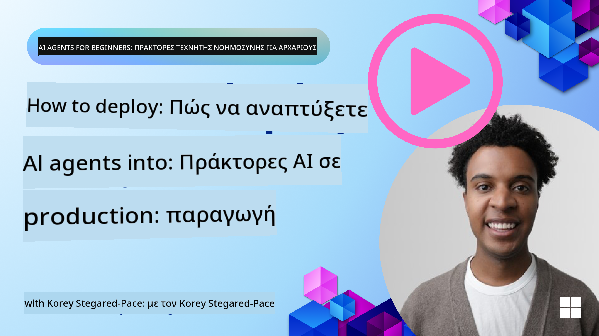

<!--
CO_OP_TRANSLATOR_METADATA:
{
  "original_hash": "cdfd0acc8592c1af14f8637833450375",
  "translation_date": "2025-08-29T14:49:21+00:00",
  "source_file": "10-ai-agents-production/README.md",
  "language_code": "el"
}
-->
# AI Agents in Production: Παρατηρησιμότητα & Αξιολόγηση

[](https://youtu.be/l4TP6IyJxmQ?si=reGOyeqjxFevyDq9)

Καθώς οι AI agents μεταβαίνουν από πειραματικά πρωτότυπα σε εφαρμογές πραγματικού κόσμου, η δυνατότητα κατανόησης της συμπεριφοράς τους, παρακολούθησης της απόδοσής τους και συστηματικής αξιολόγησης των αποτελεσμάτων τους γίνεται σημαντική.

## Στόχοι Μάθησης

Μετά την ολοκλήρωση αυτού του μαθήματος, θα γνωρίζετε πώς να/κατανοείτε:
- Βασικές έννοιες παρατηρησιμότητας και αξιολόγησης των agents
- Τεχνικές για τη βελτίωση της απόδοσης, του κόστους και της αποτελεσματικότητας των agents
- Τι και πώς να αξιολογείτε συστηματικά τους AI agents σας
- Πώς να ελέγχετε το κόστος κατά την ανάπτυξη AI agents σε παραγωγή
- Πώς να εξοπλίζετε agents που έχουν δημιουργηθεί με το AutoGen

Ο στόχος είναι να σας εξοπλίσουμε με τη γνώση για να μετατρέψετε τους "μαύρους κουτιά" agents σας σε διαφανή, διαχειρίσιμα και αξιόπιστα συστήματα.

_**Σημείωση:** Είναι σημαντικό να αναπτύσσετε AI Agents που είναι ασφαλείς και αξιόπιστοι. Δείτε το μάθημα [Building Trustworthy AI Agents](./06-building-trustworthy-agents/README.md) για περισσότερες πληροφορίες._

## Traces και Spans

Εργαλεία παρατηρησιμότητας όπως το [Langfuse](https://langfuse.com/) ή το [Azure AI Foundry](https://learn.microsoft.com/en-us/azure/ai-foundry/what-is-azure-ai-foundry) συνήθως αναπαριστούν τις εκτελέσεις των agents ως traces και spans.

- **Trace** αντιπροσωπεύει μια πλήρη εργασία του agent από την αρχή μέχρι το τέλος (όπως η διαχείριση ενός ερωτήματος χρήστη).
- **Spans** είναι μεμονωμένα βήματα μέσα στο trace (όπως η κλήση ενός γλωσσικού μοντέλου ή η ανάκτηση δεδομένων).


Χωρίς παρατηρησιμότητα, ένας AI agent μπορεί να μοιάζει με "μαύρο κουτί" - η εσωτερική του κατάσταση και η λογική του είναι αδιαφανείς, καθιστώντας δύσκολη τη διάγνωση προβλημάτων ή τη βελτιστοποίηση της απόδοσης. Με την παρατηρησιμότητα, οι agents γίνονται "γυάλινα κουτιά," προσφέροντας διαφάνεια που είναι ζωτικής σημασίας για την οικοδόμηση εμπιστοσύνης και την εξασφάλιση ότι λειτουργούν όπως προβλέπεται.

## Γιατί η Παρατηρησιμότητα Είναι Σημαντική σε Περιβάλλοντα Παραγωγής

Η μετάβαση των AI agents σε περιβάλλοντα παραγωγής εισάγει ένα νέο σύνολο προκλήσεων και απαιτήσεων. Η παρατηρησιμότητα δεν είναι πλέον "καλό να υπάρχει" αλλά μια κρίσιμη δυνατότητα:

*   **Εντοπισμός Σφαλμάτων και Ανάλυση Αιτίων**: Όταν ένας agent αποτυγχάνει ή παράγει ένα απροσδόκητο αποτέλεσμα, τα εργαλεία παρατηρησιμότητας παρέχουν τα traces που χρειάζονται για να εντοπιστεί η πηγή του σφάλματος. Αυτό είναι ιδιαίτερα σημαντικό σε σύνθετους agents που μπορεί να περιλαμβάνουν πολλαπλές κλήσεις LLM, αλληλεπιδράσεις εργαλείων και συνθήκες λογικής.
*   **Διαχείριση Καθυστέρησης και Κόστους**: Οι AI agents συχνά βασίζονται σε LLMs και άλλες εξωτερικές APIs που χρεώνονται ανά token ή ανά κλήση. Η παρατηρησιμότητα επιτρέπει την ακριβή παρακολούθηση αυτών των κλήσεων, βοηθώντας στον εντοπισμό λειτουργιών που είναι υπερβολικά αργές ή ακριβές. Αυτό επιτρέπει στις ομάδες να βελτιστοποιήσουν τα prompts, να επιλέξουν πιο αποδοτικά μοντέλα ή να επανασχεδιάσουν workflows για τη διαχείριση του λειτουργικού κόστους και την εξασφάλιση καλής εμπειρίας χρήστη.
*   **Εμπιστοσύνη, Ασφάλεια και Συμμόρφωση**: Σε πολλές εφαρμογές, είναι σημαντικό να εξασφαλιστεί ότι οι agents λειτουργούν με ασφάλεια και ηθική. Η παρατηρησιμότητα παρέχει ένα ίχνος ελέγχου των ενεργειών και αποφάσεων του agent. Αυτό μπορεί να χρησιμοποιηθεί για την ανίχνευση και την αντιμετώπιση προβλημάτων όπως η εισαγωγή prompts, η δημιουργία επιβλαβούς περιεχομένου ή η κακή διαχείριση προσωπικών δεδομένων (PII). Για παράδειγμα, μπορείτε να αναθεωρήσετε τα traces για να κατανοήσετε γιατί ένας agent παρείχε μια συγκεκριμένη απάντηση ή χρησιμοποίησε ένα συγκεκριμένο εργαλείο.
*   **Συνεχείς Βελτιώσεις**: Τα δεδομένα παρατηρησιμότητας αποτελούν τη βάση μιας διαδικασίας επαναληπτικής ανάπτυξης. Παρακολουθώντας πώς οι agents αποδίδουν στον πραγματικό κόσμο, οι ομάδες μπορούν να εντοπίσουν περιοχές για βελτίωση, να συλλέξουν δεδομένα για fine-tuning μοντέλων και να επικυρώσουν τον αντίκτυπο των αλλαγών. Αυτό δημιουργεί έναν κύκλο ανατροφοδότησης όπου οι πληροφορίες παραγωγής από την online αξιολόγηση ενημερώνουν την offline πειραματική διαδικασία και τη βελτίωση, οδηγώντας σε προοδευτικά καλύτερη απόδοση των agents.

## Βασικοί Δείκτες Παρακολούθησης

Για να παρακολουθήσετε και να κατανοήσετε τη συμπεριφορά των agents, πρέπει να παρακολουθείτε μια σειρά από δείκτες και σήματα. Ενώ οι συγκεκριμένοι δείκτες μπορεί να διαφέρουν ανάλογα με τον σκοπό του agent, κάποιοι είναι καθολικά σημαντικοί.

Ακολουθούν μερικοί από τους πιο κοινούς δείκτες που παρακολουθούν τα εργαλεία παρατηρησιμότητας:

**Καθυστέρηση:** Πόσο γρήγορα ανταποκρίνεται ο agent; Οι μεγάλες αναμονές επηρεάζουν αρνητικά την εμπειρία χρήστη. Πρέπει να μετράτε την καθυστέρηση για εργασίες και μεμονωμένα βήματα παρακολουθώντας τις εκτελέσεις του agent. Για παράδειγμα, ένας agent που χρειάζεται 20 δευτερόλεπτα για όλες τις κλήσεις μοντέλου θα μπορούσε να επιταχυνθεί χρησιμοποιώντας ένα ταχύτερο μοντέλο ή εκτελώντας τις κλήσεις μοντέλου παράλληλα.

**Κόστος:** Ποιο είναι το κόστος ανά εκτέλεση agent; Οι AI agents βασίζονται σε κλήσεις LLM που χρεώνονται ανά token ή εξωτερικές APIs. Η συχνή χρήση εργαλείων ή πολλαπλά prompts μπορεί να αυξήσει γρήγορα το κόστος. Για παράδειγμα, αν ένας agent καλεί ένα LLM πέντε φορές για οριακή βελτίωση ποιότητας, πρέπει να αξιολογήσετε αν το κόστος δικαιολογείται ή αν μπορείτε να μειώσετε τον αριθμό των κλήσεων ή να χρησιμοποιήσετε ένα φθηνότερο μοντέλο. Η παρακολούθηση σε πραγματικό χρόνο μπορεί επίσης να βοηθήσει στον εντοπισμό απροσδόκητων αυξήσεων (π.χ. σφάλματα που προκαλούν υπερβολικούς βρόχους API).

**Σφάλματα Αιτήσεων:** Πόσες αιτήσεις απέτυχε ο agent; Αυτό μπορεί να περιλαμβάνει σφάλματα API ή αποτυχημένες κλήσεις εργαλείων. Για να κάνετε τον agent σας πιο ανθεκτικό σε αυτά στην παραγωγή, μπορείτε να ρυθμίσετε εναλλακτικές λύσεις ή επαναλήψεις. Π.χ. αν ο πάροχος LLM A είναι εκτός λειτουργίας, να μεταβείτε στον πάροχο LLM B ως εφεδρικό.

**Ανατροφοδότηση Χρηστών:** Η εφαρμογή άμεσων αξιολογήσεων από χρήστες παρέχει πολύτιμες πληροφορίες. Αυτό μπορεί να περιλαμβάνει ρητές αξιολογήσεις (👍thumbs-up/👎down, ⭐1-5 αστέρια) ή γραπτά σχόλια. Συνεχής αρνητική ανατροφοδότηση πρέπει να σας ειδοποιεί, καθώς αυτό είναι ένδειξη ότι ο agent δεν λειτουργεί όπως αναμένεται.

**Έμμεση Ανατροφοδότηση Χρηστών:** Οι συμπεριφορές των χρηστών παρέχουν έμμεση ανατροφοδότηση ακόμα και χωρίς ρητές αξιολογήσεις. Αυτό μπορεί να περιλαμβάνει άμεση επαναδιατύπωση ερωτήσεων, επαναλαμβανόμενα ερωτήματα ή κλικ σε κουμπί επαναπροσπάθειας. Π.χ. αν βλέπετε ότι οι χρήστες επαναλαμβάνουν συνεχώς την ίδια ερώτηση, αυτό είναι ένδειξη ότι ο agent δεν λειτουργεί όπως αναμένεται.

**Ακρίβεια:** Πόσο συχνά ο agent παράγει σωστά ή επιθυμητά αποτελέσματα; Οι ορισμοί της ακρίβειας ποικίλλουν (π.χ., ορθότητα επίλυσης προβλημάτων, ακρίβεια ανάκτησης πληροφοριών, ικανοποίηση χρήστη). Το πρώτο βήμα είναι να ορίσετε τι σημαίνει επιτυχία για τον agent σας. Μπορείτε να παρακολουθείτε την ακρίβεια μέσω αυτοματοποιημένων ελέγχων, βαθμολογιών αξιολόγησης ή ετικετών ολοκλήρωσης εργασιών. Για παράδειγμα, να σημειώνετε τα traces ως "επιτυχημένα" ή "αποτυχημένα".

**Αυτοματοποιημένοι Δείκτες Αξιολόγησης:** Μπορείτε επίσης να ρυθμίσετε αυτοματοποιημένες αξιολογήσεις. Για παράδειγμα, μπορείτε να χρησιμοποιήσετε ένα LLM για να βαθμολογήσετε την έξοδο του agent π.χ. αν είναι χρήσιμη, ακριβής ή όχι. Υπάρχουν επίσης αρκετές βιβλιοθήκες ανοιχτού κώδικα που σας βοηθούν να βαθμολογήσετε διαφορετικές πτυχές του agent. Π.χ. [RAGAS](https://docs.ragas.io/) για RAG agents ή [LLM Guard](https://llm-guard.com/) για την ανίχνευση επιβλαβούς γλώσσας ή εισαγωγής prompts.

Στην πράξη, ένας συνδυασμός αυτών των δεικτών παρέχει την καλύτερη κάλυψη της υγείας ενός AI agent. Στο [παράδειγμα notebook](./code_samples/10_autogen_evaluation.ipynb) αυτού του κεφαλαίου, θα σας δείξουμε πώς φαίνονται αυτοί οι δείκτες σε πραγματικά παραδείγματα, αλλά πρώτα θα μάθουμε πώς μοιάζει μια τυπική ροή εργασίας αξιολόγησης.

## Εξοπλίστε τον Agent σας

Για να συλλέξετε δεδομένα tracing, θα χρειαστεί να εξοπλίσετε τον κώδικα σας. Ο στόχος είναι να εξοπλίσετε τον κώδικα του agent ώστε να εκπέμπει traces και δείκτες που μπορούν να συλλεχθούν, να επεξεργαστούν και να οπτικοποιηθούν από μια πλατφόρμα παρατηρησιμότητας.

**OpenTelemetry (OTel):** Το [OpenTelemetry](https://opentelemetry.io/) έχει αναδειχθεί ως βιομηχανικό πρότυπο για την παρατηρησιμότητα LLM. Παρέχει ένα σύνολο APIs, SDKs και εργαλείων για τη δημιουργία, συλλογή και εξαγωγή δεδομένων τηλεμετρίας.

Υπάρχουν πολλές βιβλιοθήκες εξοπλισμού που τυλίγουν υπάρχοντα frameworks agents και καθιστούν εύκολη την εξαγωγή spans OpenTelemetry σε ένα εργαλείο παρατηρησιμότητας. Παρακάτω είναι ένα παράδειγμα εξοπλισμού ενός agent AutoGen με τη βιβλιοθήκη εξοπλισμού [OpenLit](https://github.com/openlit/openlit):

```python
import openlit

openlit.init(tracer = langfuse._otel_tracer, disable_batch = True)
```

Το [παράδειγμα notebook](./code_samples/10_autogen_evaluation.ipynb) αυτού του κεφαλαίου θα δείξει πώς να εξοπλίσετε τον agent AutoGen σας.

**Χειροκίνητη Δημιουργία Spans:** Ενώ οι βιβλιοθήκες εξοπλισμού παρέχουν μια καλή βάση, υπάρχουν συχνά περιπτώσεις όπου χρειάζονται πιο λεπτομερείς ή προσαρμοσμένες πληροφορίες. Μπορείτε να δημιουργήσετε spans χειροκίνητα για να προσθέσετε προσαρμοσμένη λογική εφαρμογής. Πιο σημαντικό, μπορούν να εμπλουτίσουν αυτόματα ή χειροκίνητα δημιουργημένα spans με προσαρμοσμένα attributes (επίσης γνωστά ως tags ή metadata). Αυτά τα attributes μπορούν να περιλαμβάνουν δεδομένα ειδικά για την επιχείρηση, ενδιάμεσους υπολογισμούς ή οποιοδήποτε πλαίσιο που μπορεί να είναι χρήσιμο για την ανάλυση ή την ανίχνευση σφαλμάτων, όπως `user_id`, `session_id` ή `model_version`.

Παράδειγμα δημιουργίας traces και spans χειροκίνητα με το [Langfuse Python SDK](https://langfuse.com/docs/sdk/python/sdk-v3):

```python
from langfuse import get_client
 
langfuse = get_client()
 
span = langfuse.start_span(name="my-span")
 
span.end()
```

## Αξιολόγηση Agent

Η παρατηρησιμότητα μας δίνει δείκτες, αλλά η αξιολόγηση είναι η διαδικασία ανάλυσης αυτών των δεδομένων (και η εκτέλεση δοκιμών) για να καθοριστεί πόσο καλά αποδίδει ένας AI agent και πώς μπορεί να βελτιωθεί. Με άλλα λόγια, μόλις έχετε αυτά τα traces και δείκτες, πώς τα χρησιμοποιείτε για να κρίνετε τον agent και να λάβετε αποφάσεις;

Η τακτική αξιολόγηση είναι σημαντική επειδή οι AI agents είναι συχνά μη-ντετερμινιστικοί και μπορούν να εξελιχθούν (μέσω ενημερώσεων ή αλλαγής συμπεριφοράς μοντέλου) – χωρίς αξιολόγηση, δεν θα γνωρίζατε αν ο "έξυπνος agent" σας κάνει πραγματικά καλά τη δουλειά του ή αν έχει υποβαθμιστεί.

Υπάρχουν δύο κατηγορίες αξιολογήσεων για AI agents: **online αξιολόγηση** και **offline αξιολόγηση**. Και οι δύο είναι πολύτιμες και συμπληρώνουν η μία την άλλη. Συνήθως ξεκινάμε με offline αξιολόγηση, καθώς αυτό είναι το ελάχιστο απαραίτητο βήμα πριν από την ανάπτυξη οποιουδήποτε agent.

### Offline Αξιολόγηση


Αυτή περιλαμβάνει την αξιολόγηση του agent σε ελεγχόμενο περιβάλλον, συνήθως χρησιμοποιώντας σύνολα δεδομένων δοκιμής, όχι ζωντανά ερωτήματα χρηστών. Χρησιμοποιείτε επιμελημένα σύνολα δεδομένων όπου γνωρίζετε ποια είναι η αναμενόμενη έξοδος ή η σωστή συμπεριφορά και στη συνέχεια εκτελείτε τον agent σε αυτά.

Για παράδειγμα, αν έχετε δημιουργήσει έναν agent για προβλήματα μαθηματικών, μπορεί να έχετε ένα [σύνολο δεδομένων δοκιμής](https://huggingface.co/datasets/gsm8k) με 100 προβλήματα με γνωστές απαντήσεις. Η offline αξιολόγηση γίνεται συχνά κατά τη διάρκεια της ανάπτυξης (και μπορεί να είναι μέρος των pipelines CI/CD) για να ελέγξετε βελτιώσεις ή να προστατευτείτε από υποβαθμίσεις. Το πλεονέκτημα είναι ότι είναι **επαναλήψιμη και μπορείτε να έχετε σαφείς δείκτες ακρίβειας, καθώς έχετε ground truth**. Μπορεί επίσης να προσομοιώσετε ερωτήματα χρηστών και να μετρήσετε τις απαντήσεις του agent σε ιδανικές απαντήσεις ή να χρησιμοποιήσετε αυτοματοποιημένους δείκτες όπως περιγράφηκε παραπάνω.

Η βασική πρόκληση με την offline αξιολόγηση είναι να εξασφαλίσετε ότι το σύνολο δεδομένων δοκιμής σας είναι ολοκληρωμένο και παραμένει σχετικό – ο agent μπορεί να αποδίδει καλά σε ένα σταθερό σύνολο δοκιμής αλλά να αντιμετωπίζει πολύ διαφορετικά ερωτήματα στην παραγωγή. Επομένως, πρέπει να διατηρείτε τα σύνολα δοκιμής ενημερωμένα με νέες περιπτώσεις και παραδείγματα που αντικατοπτρίζουν σενάρια πραγματικού κόσμου​. Ένας συνδυασμός μικρών "smoke test" περιπτώσεων και μεγαλύτερων συνόλων αξιολόγησης είναι χρήσιμος: μικρά σύνολα για γρήγορους ελέγχους και μεγαλύτερα για ευρύτερους δείκτες απόδοσης

## Αντιμετώπιση Συνηθισμένων Προβλημάτων

Παρακάτω παρατίθενται ορισμένα κοινά προβλήματα που μπορεί να προκύψουν κατά την ανάπτυξη AI agents, καθώς και προτάσεις για την επίλυσή τους:

| **Πρόβλημα** | **Προτεινόμενη Λύση** |
|--------------|-----------------------|
| Ο agent δεν αποδίδει σωστά σε σύνθετες εργασίες | - Χρησιμοποιήστε μεγαλύτερα μοντέλα που είναι εξειδικευμένα για εργασίες που απαιτούν λογική και σχεδιασμό. |
| Οι κλήσεις εργαλείων από τον AI Agent δεν αποδίδουν καλά | - Δοκιμάστε και επικυρώστε την έξοδο του εργαλείου εκτός του συστήματος του agent.<br>- Βελτιώστε τις καθορισμένες παραμέτρους, τα prompts και την ονομασία των εργαλείων. |
| Το σύστημα πολλαπλών agents δεν αποδίδει με συνέπεια | - Βελτιώστε τα prompts που δίνονται σε κάθε agent ώστε να είναι συγκεκριμένα και διακριτά μεταξύ τους.<br>- Δημιουργήστε ένα ιεραρχικό σύστημα χρησιμοποιώντας έναν "routing" ή controller agent για να καθορίσετε ποιος agent είναι ο κατάλληλος. |

Πολλά από αυτά τα προβλήματα μπορούν να εντοπιστούν πιο αποτελεσματικά με την ύπαρξη εργαλείων παρατηρησιμότητας. Τα traces και τα metrics που συζητήσαμε νωρίτερα βοηθούν στον εντοπισμό του ακριβούς σημείου στο workflow του agent όπου προκύπτουν προβλήματα, καθιστώντας τη διαδικασία εντοπισμού σφαλμάτων και βελτιστοποίησης πολύ πιο αποδοτική.

## Διαχείριση Κόστους

Ακολουθούν ορισμένες στρατηγικές για τη διαχείριση του κόστους κατά την ανάπτυξη AI agents σε παραγωγή:

**Χρήση Μικρότερων Μοντέλων:** Τα Small Language Models (SLMs) μπορούν να αποδώσουν καλά σε ορισμένες περιπτώσεις χρήσης και να μειώσουν σημαντικά το κόστος. Όπως αναφέρθηκε νωρίτερα, η δημιουργία ενός συστήματος αξιολόγησης για τον καθορισμό και τη σύγκριση της απόδοσης σε σχέση με μεγαλύτερα μοντέλα είναι ο καλύτερος τρόπος για να κατανοήσετε πώς ένα SLM θα αποδώσει στη δική σας περίπτωση χρήσης. Εξετάστε τη χρήση SLMs για απλούστερες εργασίες, όπως η ταξινόμηση προθέσεων ή η εξαγωγή παραμέτρων, ενώ κρατήστε τα μεγαλύτερα μοντέλα για πιο σύνθετες εργασίες λογικής.

**Χρήση Μοντέλου Δρομολόγησης:** Μια παρόμοια στρατηγική είναι η χρήση διαφορετικών μοντέλων και μεγεθών. Μπορείτε να χρησιμοποιήσετε ένα LLM/SLM ή μια serverless λειτουργία για να δρομολογήσετε αιτήματα ανάλογα με την πολυπλοκότητα στα κατάλληλα μοντέλα. Αυτό θα βοηθήσει στη μείωση του κόστους, διασφαλίζοντας παράλληλα την απόδοση στις κατάλληλες εργασίες. Για παράδειγμα, δρομολογήστε απλά ερωτήματα σε μικρότερα, ταχύτερα μοντέλα και χρησιμοποιήστε μόνο τα ακριβά μεγάλα μοντέλα για σύνθετες εργασίες λογικής.

**Caching Απαντήσεων:** Ο εντοπισμός κοινών αιτημάτων και εργασιών και η παροχή απαντήσεων πριν περάσουν από το σύστημα του agent είναι ένας καλός τρόπος για να μειωθεί ο όγκος παρόμοιων αιτημάτων. Μπορείτε ακόμη και να υλοποιήσετε μια ροή για να εντοπίσετε πόσο παρόμοιο είναι ένα αίτημα με τα αποθηκευμένα αιτήματα χρησιμοποιώντας πιο βασικά AI μοντέλα. Αυτή η στρατηγική μπορεί να μειώσει σημαντικά το κόστος για συχνές ερωτήσεις ή κοινές ροές εργασίας.

## Ας δούμε πώς λειτουργεί αυτό στην πράξη

Στο [παράδειγμα notebook αυτής της ενότητας](./code_samples/10_autogen_evaluation.ipynb), θα δούμε παραδείγματα για το πώς μπορούμε να χρησιμοποιήσουμε εργαλεία παρατηρησιμότητας για την παρακολούθηση και αξιολόγηση του agent.

### Έχετε περισσότερες ερωτήσεις για AI Agents σε παραγωγή;

Γίνετε μέλος στο [Azure AI Foundry Discord](https://aka.ms/ai-agents/discord) για να συναντήσετε άλλους μαθητές, να παρακολουθήσετε ώρες γραφείου και να λάβετε απαντήσεις στις ερωτήσεις σας για AI Agents.

## Προηγούμενο Μάθημα

[Σχεδιαστικό Πρότυπο Μεταγνώσης](../09-metacognition/README.md)

## Επόμενο Μάθημα

[Πρωτόκολλα Agentic](../11-agentic-protocols/README.md)

---

**Αποποίηση ευθύνης**:  
Αυτό το έγγραφο έχει μεταφραστεί χρησιμοποιώντας την υπηρεσία αυτόματης μετάφρασης AI [Co-op Translator](https://github.com/Azure/co-op-translator). Παρόλο που καταβάλλουμε κάθε προσπάθεια για ακρίβεια, παρακαλούμε να έχετε υπόψη ότι οι αυτόματες μεταφράσεις ενδέχεται να περιέχουν σφάλματα ή ανακρίβειες. Το πρωτότυπο έγγραφο στη μητρική του γλώσσα θα πρέπει να θεωρείται η αυθεντική πηγή. Για κρίσιμες πληροφορίες, συνιστάται επαγγελματική ανθρώπινη μετάφραση. Δεν φέρουμε ευθύνη για τυχόν παρεξηγήσεις ή εσφαλμένες ερμηνείες που προκύπτουν από τη χρήση αυτής της μετάφρασης.