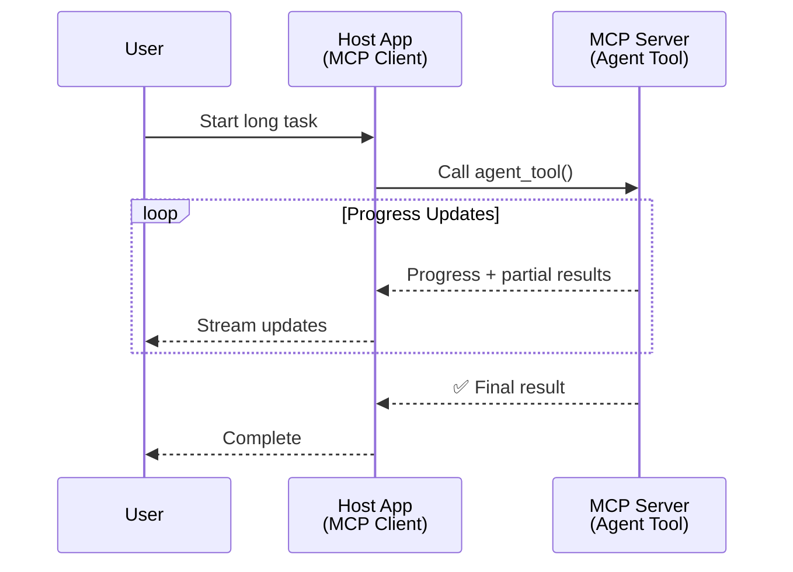
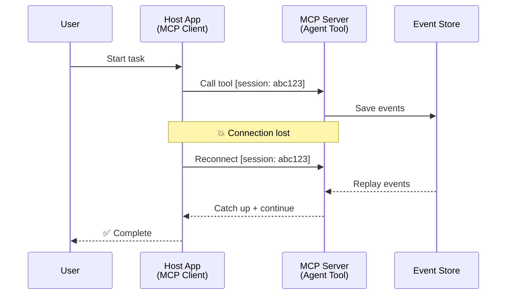
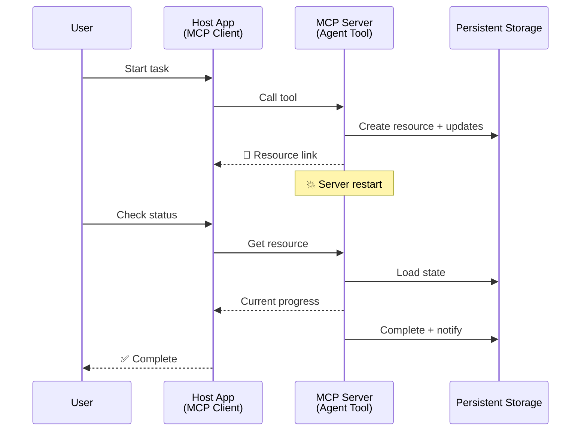
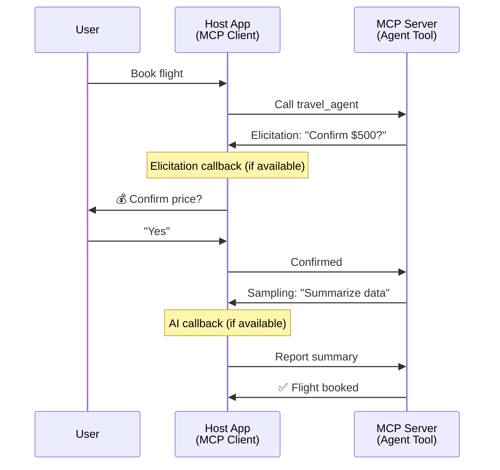

<!--
CO_OP_TRANSLATOR_METADATA:
{
  "original_hash": "5cc6836626047aa055e8960c8484a7d0",
  "translation_date": "2025-08-29T16:04:05+00:00",
  "source_file": "11-agentic-protocols/code_samples/mcp-agents/README.md",
  "language_code": "el"
}
-->
# Δημιουργία Συστημάτων Επικοινωνίας Μεταξύ Πρακτόρων με MCP

> TL;DR - Μπορείτε να δημιουργήσετε Επικοινωνία Πράκτορα-Πράκτορα με MCP; Ναι!

Το MCP έχει εξελιχθεί σημαντικά πέρα από τον αρχικό του στόχο "παροχής πλαισίου στα LLMs". Με πρόσφατες βελτιώσεις όπως [streams με δυνατότητα επανεκκίνησης](https://modelcontextprotocol.io/docs/concepts/transports#resumability-and-redelivery), [elicitation](https://modelcontextprotocol.io/specification/2025-06-18/client/elicitation), [sampling](https://modelcontextprotocol.io/specification/2025-06-18/client/sampling), και ειδοποιήσεις ([πρόοδος](https://modelcontextprotocol.io/specification/2025-06-18/basic/utilities/progress) και [πόροι](https://modelcontextprotocol.io/specification/2025-06-18/schema#resourceupdatednotification)), το MCP παρέχει πλέον μια ισχυρή βάση για τη δημιουργία σύνθετων συστημάτων επικοινωνίας μεταξύ πρακτόρων.

## Η Παρανόηση Πράκτορα/Εργαλείου

Καθώς περισσότεροι προγραμματιστές εξερευνούν εργαλεία με συμπεριφορές πρακτόρων (λειτουργούν για μεγάλα χρονικά διαστήματα, μπορεί να απαιτούν πρόσθετη είσοδο κατά τη διάρκεια της εκτέλεσης, κ.λπ.), μια κοινή παρανόηση είναι ότι το MCP δεν είναι κατάλληλο, κυρίως επειδή τα πρώιμα παραδείγματα της primitive εργαλειοθήκης του επικεντρώνονταν σε απλά μοτίβα αιτήματος-απάντησης.

Αυτή η αντίληψη είναι πλέον ξεπερασμένη. Η προδιαγραφή MCP έχει βελτιωθεί σημαντικά τους τελευταίους μήνες με δυνατότητες που καλύπτουν το κενό για τη δημιουργία συμπεριφορών πρακτόρων μεγάλης διάρκειας:

- **Streaming & Μερικά Αποτελέσματα**: Ενημερώσεις προόδου σε πραγματικό χρόνο κατά την εκτέλεση
- **Επανεκκινήσιμοτητα**: Οι πελάτες μπορούν να επανασυνδεθούν και να συνεχίσουν μετά από αποσύνδεση
- **Ανθεκτικότητα**: Τα αποτελέσματα επιβιώνουν από επανεκκινήσεις του διακομιστή (π.χ., μέσω συνδέσμων πόρων)
- **Πολλαπλές Εναλλαγές**: Διαδραστική είσοδος κατά τη διάρκεια της εκτέλεσης μέσω elicitation και sampling

Αυτές οι δυνατότητες μπορούν να συντεθούν για να επιτρέψουν σύνθετες εφαρμογές πρακτόρων και πολλαπλών πρακτόρων, όλες αναπτυγμένες στο πρωτόκολλο MCP.

Για αναφορά, θα αναφερόμαστε σε έναν πράκτορα ως "εργαλείο" που είναι διαθέσιμο σε έναν MCP server. Αυτό υπονοεί την ύπαρξη μιας εφαρμογής υποδοχής που υλοποιεί έναν MCP client που δημιουργεί μια συνεδρία με τον MCP server και μπορεί να καλεί τον πράκτορα.

## Τι Κάνει Ένα Εργαλείο MCP "Πρακτορικό";

Πριν προχωρήσουμε στην υλοποίηση, ας καθορίσουμε ποιες δυνατότητες υποδομής χρειάζονται για να υποστηρίξουν πράκτορες μεγάλης διάρκειας.

> Θα ορίσουμε έναν πράκτορα ως μια οντότητα που μπορεί να λειτουργεί αυτόνομα για μεγάλα χρονικά διαστήματα, ικανή να χειρίζεται σύνθετες εργασίες που μπορεί να απαιτούν πολλαπλές αλληλεπιδράσεις ή προσαρμογές βάσει ανατροφοδότησης σε πραγματικό χρόνο.

### 1. Streaming & Μερικά Αποτελέσματα

Τα παραδοσιακά μοτίβα αιτήματος-απάντησης δεν λειτουργούν για εργασίες μεγάλης διάρκειας. Οι πράκτορες χρειάζονται να παρέχουν:

- Ενημερώσεις προόδου σε πραγματικό χρόνο
- Ενδιάμεσα αποτελέσματα

**Υποστήριξη MCP**: Οι ειδοποιήσεις ενημέρωσης πόρων επιτρέπουν τη ροή μερικών αποτελεσμάτων, αν και αυτό απαιτεί προσεκτικό σχεδιασμό για να αποφευχθούν συγκρούσεις με το μοντέλο 1:1 αιτήματος/απάντησης του JSON-RPC.

| Δυνατότητα                 | Περίπτωση Χρήσης                                                                                                                                                                       | Υποστήριξη MCP                                                                                |
| -------------------------- | -------------------------------------------------------------------------------------------------------------------------------------------------------------------------------------- | -------------------------------------------------------------------------------------------- |
| Ενημερώσεις Προόδου σε Πραγματικό Χρόνο | Ο χρήστης ζητά μια εργασία μετατροπής κώδικα. Ο πράκτορας μεταδίδει πρόοδο: "10% - Ανάλυση εξαρτήσεων... 25% - Μετατροπή αρχείων TypeScript... 50% - Ενημέρωση εισαγωγών..."          | ✅ Ειδοποιήσεις προόδου                                                                  |
| Μερικά Αποτελέσματα            | Εργασία "Δημιουργία βιβλίου" μεταδίδει μερικά αποτελέσματα, π.χ., 1) Σχεδιάγραμμα ιστορίας, 2) Λίστα κεφαλαίων, 3) Κάθε κεφάλαιο καθώς ολοκληρώνεται. Η υποδοχή μπορεί να επιθεωρήσει, να ακυρώσει ή να ανακατευθύνει σε οποιοδήποτε στάδιο. | ✅ Οι ειδοποιήσεις μπορούν να "επεκταθούν" για να περιλαμβάνουν μερικά αποτελέσματα, δείτε προτάσεις στα PR 383, 776 |

<div align="center" style="font-style: italic; font-size: 0.95em; margin-bottom: 0.5em;">
<strong>Εικόνα 1:</strong> Αυτό το διάγραμμα απεικονίζει πώς ένας πράκτορας MCP μεταδίδει ενημερώσεις προόδου σε πραγματικό χρόνο και μερικά αποτελέσματα στην εφαρμογή υποδοχής κατά τη διάρκεια μιας εργασίας μεγάλης διάρκειας, επιτρέποντας στον χρήστη να παρακολουθεί την εκτέλεση σε πραγματικό χρόνο.
</div>



### 2. Επανεκκινήσιμοτητα

Οι πράκτορες πρέπει να χειρίζονται διακοπές δικτύου με χάρη:

- Επανασύνδεση μετά από αποσύνδεση (πελάτη)
- Συνέχιση από εκεί που σταμάτησαν (επανεκπομπή μηνυμάτων)

**Υποστήριξη MCP**: Το StreamableHTTP transport του MCP υποστηρίζει σήμερα επανεκκίνηση συνεδριών και επανεκπομπή μηνυμάτων με αναγνωριστικά συνεδριών και αναγνωριστικά τελευταίων γεγονότων. Σημαντικό σημείο εδώ είναι ότι ο διακομιστής πρέπει να υλοποιήσει ένα EventStore που επιτρέπει την επανεκπομπή γεγονότων κατά την επανασύνδεση του πελάτη.  
Σημειώστε ότι υπάρχει μια πρόταση κοινότητας (PR #975) που εξερευνά streams με δυνατότητα επανεκκίνησης ανεξάρτητα από το transport.

| Δυνατότητα      | Περίπτωση Χρήσης                                                                                                                                                   | Υποστήριξη MCP                                                                |
| ------------ | ---------------------------------------------------------------------------------------------------------------------------------------------------------- | -------------------------------------------------------------------------- |
| Επανεκκινήσιμοτητα | Ο πελάτης αποσυνδέεται κατά τη διάρκεια μιας εργασίας μεγάλης διάρκειας. Κατά την επανασύνδεση, η συνεδρία συνεχίζεται με επανεκπομπή των χαμένων γεγονότων, συνεχίζοντας απρόσκοπτα από εκεί που σταμάτησε. | ✅ StreamableHTTP transport με αναγνωριστικά συνεδριών, επανεκπομπή γεγονότων και EventStore |

<div align="center" style="font-style: italic; font-size: 0.95em; margin-bottom: 0.5em;">
<strong>Εικόνα 2:</strong> Αυτό το διάγραμμα δείχνει πώς το StreamableHTTP transport και το EventStore του MCP επιτρέπουν απρόσκοπτη επανεκκίνηση συνεδριών: αν ο πελάτης αποσυνδεθεί, μπορεί να επανασυνδεθεί και να επανεκπομπήσει χαμένα γεγονότα, συνεχίζοντας την εργασία χωρίς απώλεια προόδου.
</div>



### 3. Ανθεκτικότητα

Οι πράκτορες μεγάλης διάρκειας χρειάζονται μόνιμη κατάσταση:

- Τα αποτελέσματα επιβιώνουν από επανεκκινήσεις του διακομιστή
- Η κατάσταση μπορεί να ανακτηθεί εκτός σύνδεσης
- Παρακολούθηση προόδου μεταξύ συνεδριών

**Υποστήριξη MCP**: Το MCP υποστηρίζει πλέον έναν τύπο επιστροφής Resource link για κλήσεις εργαλείων. Σήμερα, ένα πιθανό μοτίβο είναι να σχεδιάσετε ένα εργαλείο που δημιουργεί έναν πόρο και επιστρέφει αμέσως έναν σύνδεσμο πόρου. Το εργαλείο μπορεί να συνεχίσει να ασχολείται με την εργασία στο παρασκήνιο και να ενημερώνει τον πόρο. Με τη σειρά του, ο πελάτης μπορεί να επιλέξει να ελέγξει την κατάσταση αυτού του πόρου για να λάβει μερικά ή πλήρη αποτελέσματα (βάσει των ενημερώσεων πόρων που παρέχει ο διακομιστής) ή να εγγραφεί στον πόρο για ειδοποιήσεις ενημέρωσης.

Μια περιορισμένη δυνατότητα εδώ είναι ότι η επαναλαμβανόμενη ερώτηση πόρων ή η εγγραφή για ενημερώσεις μπορεί να καταναλώσει πόρους με επιπτώσεις σε κλίμακα. Υπάρχει μια ανοιχτή πρόταση κοινότητας (συμπεριλαμβανομένης της #992) που εξερευνά τη δυνατότητα συμπερίληψης webhooks ή triggers που μπορεί να καλέσει ο διακομιστής για να ειδοποιήσει την εφαρμογή υποδοχής του πελάτη για ενημερώσεις.

| Δυνατότητα    | Περίπτωση Χρήσης                                                                                                                                        | Υποστήριξη MCP                                                        |
| ---------- | ----------------------------------------------------------------------------------------------------------------------------------------------- | ------------------------------------------------------------------ |
| Ανθεκτικότητα | Ο διακομιστής καταρρέει κατά τη διάρκεια μιας εργασίας μετατροπής δεδομένων. Τα αποτελέσματα και η πρόοδος επιβιώνουν από την επανεκκίνηση, ο πελάτης μπορεί να ελέγξει την κατάσταση και να συνεχίσει από τον μόνιμο πόρο. | ✅ Σύνδεσμοι πόρων με μόνιμη αποθήκευση και ειδοποιήσεις κατάστασης |

Σήμερα, ένα κοινό μοτίβο είναι να σχεδιάσετε ένα εργαλείο που δημιουργεί έναν πόρο και επιστρέφει αμέσως έναν σύνδεσμο πόρου. Το εργαλείο μπορεί στο παρασκήνιο να ασχοληθεί με την εργασία, να εκδώσει ειδοποιήσεις πόρων που λειτουργούν ως ενημερώσεις προόδου ή να περιλαμβάνουν μερικά αποτελέσματα, και να ενημερώσει το περιεχόμενο στον πόρο όπως απαιτείται.

<div align="center" style="font-style: italic; font-size: 0.95em; margin-bottom: 0.5em;">
<strong>Εικόνα 3:</strong> Αυτό το διάγραμμα δείχνει πώς οι πράκτορες MCP χρησιμοποιούν μόνιμους πόρους και ειδοποιήσεις κατάστασης για να διασφαλίσουν ότι οι εργασίες μεγάλης διάρκειας επιβιώνουν από επανεκκινήσεις του διακομιστή, επιτρέποντας στους πελάτες να ελέγξουν την πρόοδο και να ανακτήσουν αποτελέσματα ακόμη και μετά από αποτυχίες.
</div>



### 4. Πολλαπλές Εναλλαγές Αλληλεπιδράσεων

Οι πράκτορες συχνά χρειάζονται πρόσθετη είσοδο κατά τη διάρκεια της εκτέλεσης:

- Διευκρίνιση ή έγκριση από άνθρωπο
- Βοήθεια AI για σύνθετες αποφάσεις
- Δυναμική προσαρμογή παραμέτρων

**Υποστήριξη MCP**: Πλήρως υποστηριζόμενο μέσω sampling (για είσοδο AI) και elicitation (για είσοδο ανθρώπου).

| Δυνατότητα                 | Περίπτωση Χρήσης                                                                                                                                     | Υποστήριξη MCP                                           |
| ----------------------- | -------------------------------------------------------------------------------------------------------------------------------------------- | ----------------------------------------------------- |
| Πολλαπλές Εναλλαγές Αλληλεπιδράσεων | Πράκτορας κρατήσεων ταξιδιών ζητά επιβεβαίωση τιμής από τον χρήστη, στη συνέχεια ζητά από το AI να συνοψίσει δεδομένα ταξιδιού πριν ολοκληρώσει τη συναλλαγή κράτησης. | ✅ Elicitation για είσοδο ανθρώπου, sampling για είσοδο AI |

<div align="center" style="font-style: italic; font-size: 0.95em; margin-bottom: 0.5em;">
<strong>Εικόνα 4:</strong> Αυτό το διάγραμμα απεικονίζει πώς οι πράκτορες MCP μπορούν να ζητήσουν διαδραστικά είσοδο από ανθρώπους ή βοήθεια από AI κατά τη διάρκεια της εκτέλεσης, υποστηρίζοντας σύνθετες, πολλαπλές εναλλαγές εργασιών όπως επιβεβαιώσεις και δυναμική λήψη αποφάσεων.
</div>



## Υλοποίηση Πρακτόρων Μεγάλης Διάρκειας στο MCP - Επισκόπηση Κώδικα

Στο πλαίσιο αυτού του άρθρου, παρέχουμε ένα [αποθετήριο κώδικα](https://github.com/victordibia/ai-tutorials/tree/main/MCP%20Agents) που περιέχει μια πλήρη υλοποίηση πρακτόρων μεγάλης διάρκειας χρησιμοποιώντας το MCP Python SDK με StreamableHTTP transport για επανεκκίνηση συνεδριών και επανεκπομπή μηνυμάτων. Η υλοποίηση δείχνει πώς οι δυνατότητες MCP μπορούν να συντεθούν για να επιτρέψουν εξελιγμένες συμπεριφορές πρακτόρων.

Συγκεκριμένα, υλοποιούμε έναν διακομιστή με δύο κύρια εργαλεία πρακτόρων:

- **Πράκτορας Ταξιδιών** - Προσομοιώνει μια υπηρεσία κρατήσεων ταξιδιών με επιβεβαίωση τιμής μέσω elicitation
- **Πράκτορας Έρευνας** - Εκτελεί ερευνητικές εργασίες με περιλήψεις που υποβοηθούνται από AI μέσω sampling

Και οι δύο πράκτορες δείχνουν ενημερώσεις προόδου σε πραγματικό χρόνο, διαδραστικές επιβεβαιώσεις και πλήρεις δυνατότητες επανεκκίνησης συνεδριών.

### Βασικές Έννοιες Υλοποίησης

Οι παρακάτω ενότητες δείχνουν την υλοποίηση πρακτόρων από την πλευρά του διακομιστή και τη διαχείριση υποδοχής από την πλευρά του πελάτη για κάθε δυνατότητα:

#### Streaming & Ενημερώσεις Προόδου - Κατάσταση Εργασίας σε Πραγματικό Χρόνο

Το streaming επιτρέπει στους πράκτορες να παρέχουν ενημερώσεις προόδου σε πραγματικό χρόνο κατά τη διάρκεια εργασιών μεγάλης διάρκειας, κρατώντας τους χρήστες ενήμερους για την κατάσταση της εργασίας και τα ενδιάμεσα αποτελέσματα.

**Υλοποίηση Διακομιστή (ο πράκτορας στέλνει ειδοποιήσεις προόδου):**

```python
# From server/server.py - Travel agent sending progress updates
for i, step in enumerate(steps):
    await ctx.session.send_progress_notification(
        progress_token=ctx.request_id,
        progress=i * 25,
        total=100,
        message=step,
        related_request_id=str(ctx.request_id)
    )
    await anyio.sleep(2)  # Simulate work

# Alternative: Log messages for detailed step-by-step updates
await ctx.session.send_log_message(
    level="info",
    data=f"Processing step {current_step}/{steps} ({progress_percent}%)",
    logger="long_running_agent",
    related_request_id=ctx.request_id,
)
```

**Υλοποίηση Πελάτη (η υποδοχή λαμβάνει ενημερώσεις προόδου):**

```python
# From client/client.py - Client handling real-time notifications
async def message_handler(message) -> None:
    if isinstance(message, types.ServerNotification):
        if isinstance(message.root, types.LoggingMessageNotification):
            console.print(f"📡 [dim]{message.root.params.data}[/dim]")
        elif isinstance(message.root, types.ProgressNotification):
            progress = message.root.params
            console.print(f"🔄 [yellow]{progress.message} ({progress.progress}/{progress.total})[/yellow]")

# Register message handler when creating session
async with ClientSession(
    read_stream, write_stream,
    message_handler=message_handler
) as session:
```

#### Elicitation - Αίτημα Εισόδου Χρήστη

Το elicitation επιτρέπει στους πράκτορες να ζητούν είσοδο από τον χρήστη κατά τη διάρκεια της εκτέλεσης. Αυτό είναι απαραίτητο για επιβεβαιώσεις, διευκρινίσεις ή εγκρίσεις κατά τη διάρκεια εργασιών μεγάλης διάρκειας.

**Υλοποίηση Διακομιστή (ο πράκτορας ζητά επιβεβαίωση):**

```python
# From server/server.py - Travel agent requesting price confirmation
elicit_result = await ctx.session.elicit(
    message=f"Please confirm the estimated price of $1200 for your trip to {destination}",
    requestedSchema=PriceConfirmationSchema.model_json_schema(),
    related_request_id=ctx.request_id,
)

if elicit_result and elicit_result.action == "accept":
    # Continue with booking
    logger.info(f"User confirmed price: {elicit_result.content}")
elif elicit_result and elicit_result.action == "decline":
    # Cancel the booking
    booking_cancelled = True
```

**Υλοποίηση Πελάτη (η υποδοχή παρέχει callback elicitation):**

```python
# From client/client.py - Client handling elicitation requests
async def elicitation_callback(context, params):
    console.print(f"💬 Server is asking for confirmation:")
    console.print(f"   {params.message}")

    response = console.input("Do you accept? (y/n): ").strip().lower()

    if response in ['y', 'yes']:
        return types.ElicitResult(
            action="accept",
            content={"confirm": True, "notes": "Confirmed by user"}
        )
    else:
        return types.ElicitResult(
            action="decline",
            content={"confirm": False, "notes": "Declined by user"}
        )

# Register the callback when creating the session
async with ClientSession(
    read_stream, write_stream,
    elicitation_callback=elicitation_callback
) as session:
```

#### Sampling - Αίτημα Βοήθειας AI

Το sampling επιτρέπει στους πράκτορες να ζητούν βοήθεια από LLM για σύνθετες αποφάσεις ή δημιουργία περιεχομένου κατά τη διάρκεια της εκτέλεσης. Αυτό επιτρέπει υβριδικές ροές εργασίας ανθρώπου-AI.

**Υλοποίηση Διακομιστή (ο πράκτορας ζητά βοήθεια AI):**

```python
# From server/server.py - Research agent requesting AI summary
sampling_result = await ctx.session.create_message(
    messages=[
        SamplingMessage(
            role="user",
            content=TextContent(type="text", text=f"Please summarize the key findings for research on: {topic}")
        )
    ],
    max_tokens=100,
    related_request_id=ctx.request_id,
)

if sampling_result and sampling_result.content:
    if sampling_result.content.type == "text":
        sampling_summary = sampling_result.content.text
        logger.info(f"Received sampling summary: {sampling_summary}")
```

**Υλοποίηση Πελάτη (η υποδοχή παρέχει callback sampling):**

```python
# From client/client.py - Client handling sampling requests
async def sampling_callback(context, params):
    message_text = params.messages[0].content.text if params.messages else 'No message'
    console.print(f"🧠 Server requested sampling: {message_text}")

    # In a real application, this could call an LLM API
    # For demo purposes, we provide a mock response
    mock_response = "Based on current research, MCP has evolved significantly..."

    return types.CreateMessageResult(
        role="assistant",
        content=types.TextContent(type="text", text=mock_response),
        model="interactive-client",
        stopReason="endTurn"
    )

# Register the callback when creating the session
async with ClientSession(
    read_stream, write_stream,
    sampling_callback=sampling_callback,
    elicitation_callback=elicitation_callback
) as session:
```

#### Επανεκκινήσιμοτητα - Συνέχεια Συνεδρίας Μετά από Αποσυνδέσεις

Η επανεκκινήσιμοτητα διασφαλίζει ότι οι εργασίες πρακτόρων μεγάλης διάρκειας μπορούν να επιβιώσουν από αποσυνδέσεις πελατών και να συνεχιστούν απρόσκοπτα κατά την επανασύνδεση. Αυτό υλοποιείται μέσω αποθηκευτηρίων γεγονότων και tokens επανεκκίνησης.

**Υλοποίηση Αποθηκευτηρίου Γεγονότων (ο διακομιστής διατηρεί κατάσταση συνεδρίας):**

```python
# From server/event_store.py - Simple in-memory event store
class SimpleEventStore(EventStore):
    def __init__(self):
        self._events: list[tuple[StreamId, EventId, JSONRPCMessage]] = []
        self._event_id_counter = 0

    async def store_event(self, stream_id: StreamId, message: JSONRPCMessage) -> EventId:
        """Store an event and return its ID."""
        self._event_id_counter += 1
        event_id = str(self._event_id_counter)
        self._events.append((stream_id, event_id, message))
        return event_id

    async def replay_events_after(self, last_event_id: EventId, send_callback: EventCallback) -> StreamId | None:
        """Replay events after the specified ID for resumption."""
        # Find events after the last known event and replay them
        for _, event_id, message in self._events[start_index:]:
            await send_callback(EventMessage(message, event_id))

# From server/server.py - Passing event store to session manager
def create_server_app(event_store: Optional[EventStore] = None) -> Starlette:
    server = ResumableServer()

    # Create session manager with event store for resumption
    session_manager = StreamableHTTPSessionManager(
        app=server,
        event_store=event_store,  # Event store enables session resumption
        json_response=False,
        security_settings=security_settings,
    )

    return Starlette(routes=[Mount("/mcp", app=session_manager.handle_request)])

# Usage: Initialize with event store
event_store = SimpleEventStore()
app = create_server_app(event_store)
```

**Μεταδεδομένα Πελάτη με Token Επανεκκίνησης (ο πελά

---

**Αποποίηση ευθύνης**:  
Αυτό το έγγραφο έχει μεταφραστεί χρησιμοποιώντας την υπηρεσία αυτόματης μετάφρασης [Co-op Translator](https://github.com/Azure/co-op-translator). Παρόλο που καταβάλλουμε προσπάθειες για ακρίβεια, παρακαλούμε να έχετε υπόψη ότι οι αυτοματοποιημένες μεταφράσεις ενδέχεται να περιέχουν σφάλματα ή ανακρίβειες. Το πρωτότυπο έγγραφο στη μητρική του γλώσσα θα πρέπει να θεωρείται η αυθεντική πηγή. Για κρίσιμες πληροφορίες, συνιστάται επαγγελματική ανθρώπινη μετάφραση. Δεν φέρουμε ευθύνη για τυχόν παρεξηγήσεις ή εσφαλμένες ερμηνείες που προκύπτουν από τη χρήση αυτής της μετάφρασης.