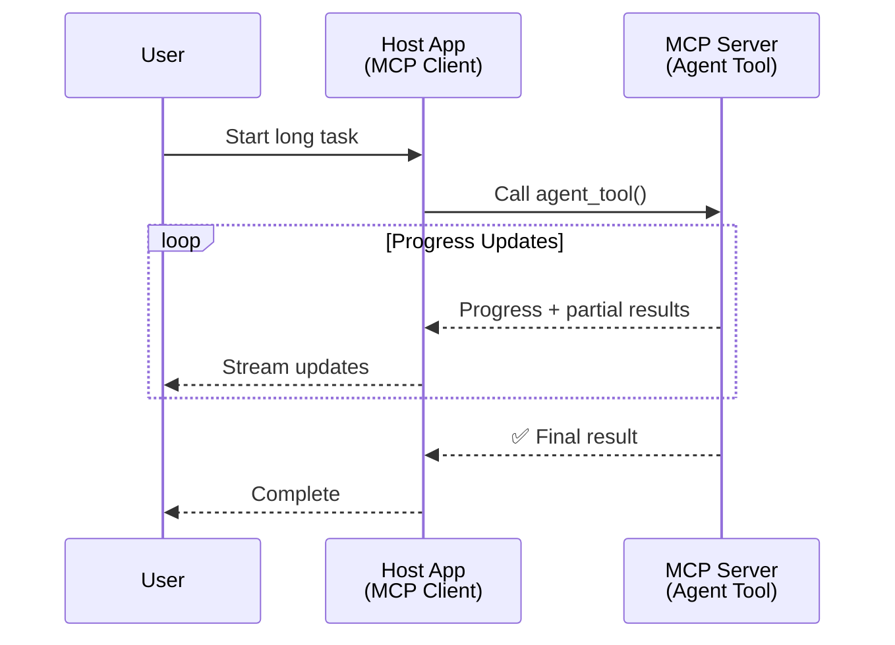
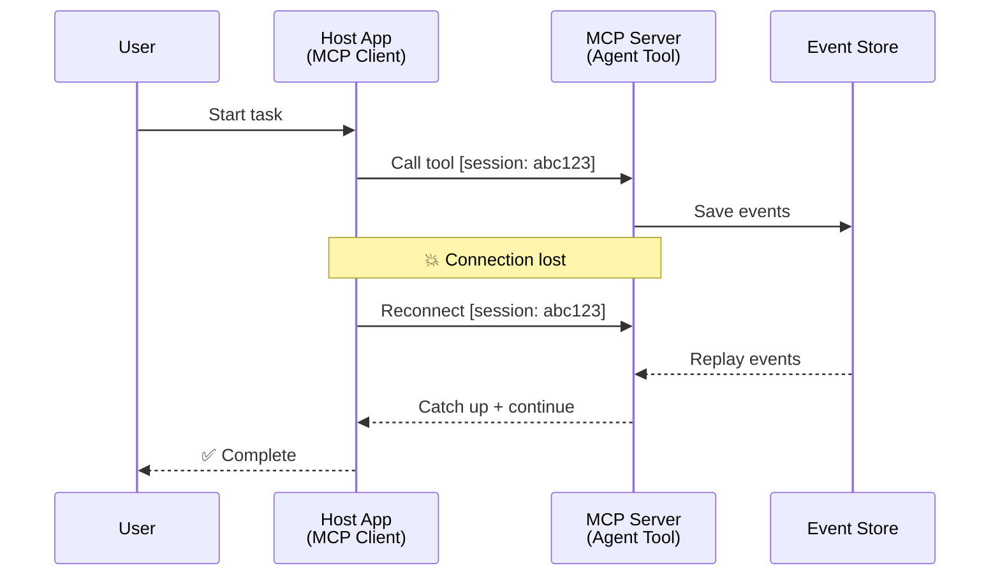
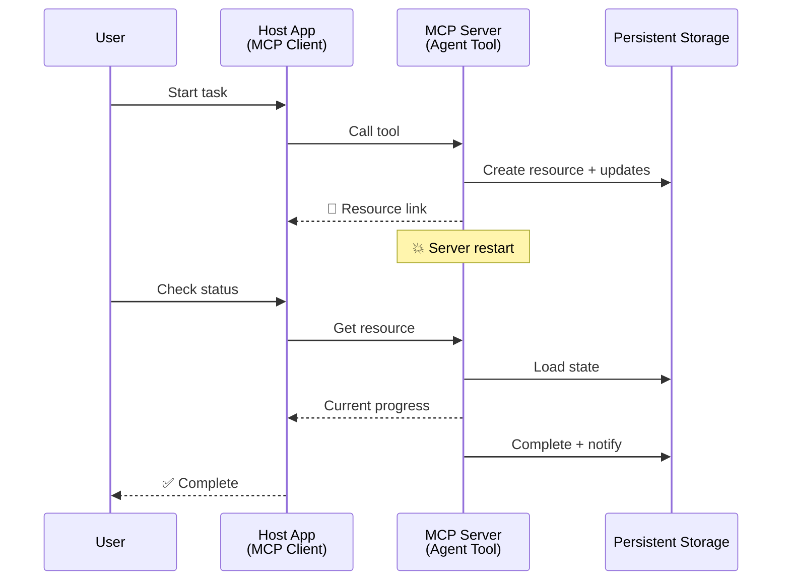
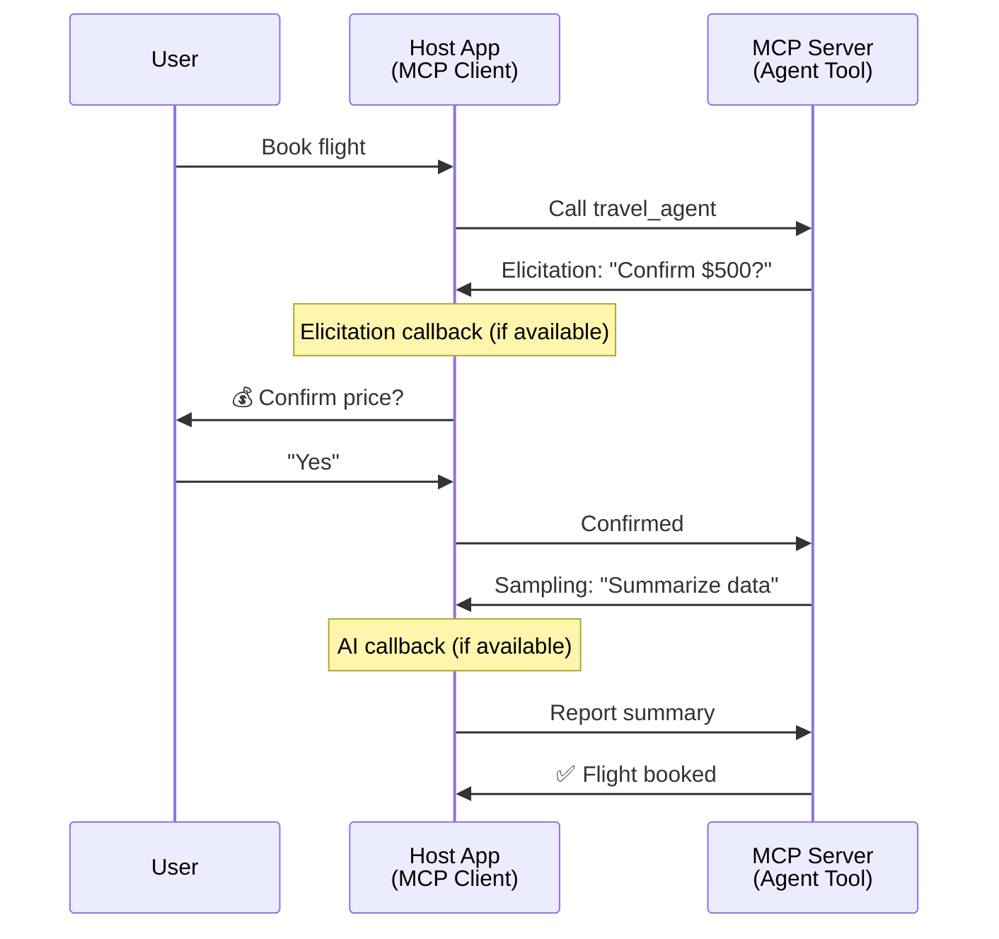

<!--
CO_OP_TRANSLATOR_METADATA:
{
  "original_hash": "5cc6836626047aa055e8960c8484a7d0",
  "translation_date": "2025-08-21T14:39:10+00:00",
  "source_file": "11-mcp/code_samples/mcp-agents/README.md",
  "language_code": "el"
}
-->
# Δημιουργία Συστημάτων Επικοινωνίας Μεταξύ Πρακτόρων με MCP

> TL;DR - Μπορείτε να δημιουργήσετε Επικοινωνία Πράκτορα-Πράκτορα με MCP; Ναι!

Το MCP έχει εξελιχθεί σημαντικά πέρα από τον αρχικό του στόχο, που ήταν η "παροχή πλαισίου στα LLMs". Με πρόσφατες βελτιώσεις όπως [streams με δυνατότητα επανεκκίνησης](https://modelcontextprotocol.io/docs/concepts/transports#resumability-and-redelivery), [elicitation](https://modelcontextprotocol.io/specification/2025-06-18/client/elicitation), [sampling](https://modelcontextprotocol.io/specification/2025-06-18/client/sampling), και ειδοποιήσεις ([πρόοδος](https://modelcontextprotocol.io/specification/2025-06-18/basic/utilities/progress) και [πόροι](https://modelcontextprotocol.io/specification/2025-06-18/schema#resourceupdatednotification)), το MCP παρέχει πλέον μια ισχυρή βάση για τη δημιουργία σύνθετων συστημάτων επικοινωνίας μεταξύ πρακτόρων.

## Η Παρανόηση για Πράκτορες/Εργαλεία

Καθώς όλο και περισσότεροι προγραμματιστές εξερευνούν εργαλεία με συμπεριφορές πρακτόρων (εκτέλεση για μεγάλα χρονικά διαστήματα, ανάγκη για επιπλέον εισαγωγή δεδομένων κατά τη διάρκεια της εκτέλεσης, κ.λπ.), μια κοινή παρανόηση είναι ότι το MCP δεν είναι κατάλληλο, κυρίως επειδή τα πρώιμα παραδείγματα του εργαλείου του επικεντρώνονταν σε απλά μοτίβα αιτήματος-απάντησης.

Αυτή η αντίληψη είναι πλέον ξεπερασμένη. Η προδιαγραφή του MCP έχει βελτιωθεί σημαντικά τους τελευταίους μήνες, προσφέροντας δυνατότητες που γεφυρώνουν το χάσμα για τη δημιουργία πρακτόρων με μακροχρόνια συμπεριφορά:

- **Streaming & Μερικά Αποτελέσματα**: Ενημερώσεις προόδου σε πραγματικό χρόνο κατά την εκτέλεση
- **Επανεκκίνηση**: Οι πελάτες μπορούν να επανασυνδεθούν και να συνεχίσουν μετά από αποσύνδεση
- **Ανθεκτικότητα**: Τα αποτελέσματα επιβιώνουν από επανεκκινήσεις του διακομιστή (π.χ., μέσω συνδέσμων πόρων)
- **Πολλαπλές Εναλλαγές**: Διαδραστική εισαγωγή δεδομένων κατά τη διάρκεια της εκτέλεσης μέσω elicitation και sampling

Αυτές οι δυνατότητες μπορούν να συνδυαστούν για τη δημιουργία σύνθετων εφαρμογών πρακτόρων και πολλαπλών πρακτόρων, όλες βασισμένες στο πρωτόκολλο MCP.

Για αναφορά, θα αναφερόμαστε σε έναν πράκτορα ως "εργαλείο" που είναι διαθέσιμο σε έναν διακομιστή MCP. Αυτό υπονοεί την ύπαρξη μιας εφαρμογής-ξενιστή που υλοποιεί έναν πελάτη MCP, ο οποίος δημιουργεί μια συνεδρία με τον διακομιστή MCP και μπορεί να καλεί τον πράκτορα.

## Τι Κάνει Ένα Εργαλείο MCP "Πρακτορικό";

Πριν προχωρήσουμε στην υλοποίηση, ας καθορίσουμε ποιες υποδομές είναι απαραίτητες για την υποστήριξη πρακτόρων με μακροχρόνια λειτουργία.

> Θα ορίσουμε έναν πράκτορα ως μια οντότητα που μπορεί να λειτουργεί αυτόνομα για μεγάλα χρονικά διαστήματα, ικανή να διαχειρίζεται σύνθετες εργασίες που μπορεί να απαιτούν πολλαπλές αλληλεπιδράσεις ή προσαρμογές βάσει ανατροφοδότησης σε πραγματικό χρόνο.

### 1. Streaming & Μερικά Αποτελέσματα

Τα παραδοσιακά μοτίβα αιτήματος-απάντησης δεν λειτουργούν για μακροχρόνιες εργασίες. Οι πράκτορες χρειάζονται:

- Ενημερώσεις προόδου σε πραγματικό χρόνο
- Ενδιάμεσα αποτελέσματα

**Υποστήριξη MCP**: Οι ειδοποιήσεις ενημέρωσης πόρων επιτρέπουν τη ροή μερικών αποτελεσμάτων, αν και αυτό απαιτεί προσεκτικό σχεδιασμό για την αποφυγή συγκρούσεων με το μοντέλο 1:1 αιτήματος/απάντησης του JSON-RPC.

| Δυνατότητα                | Περίπτωση Χρήσης                                                                                                                                                                       | Υποστήριξη MCP                                                                            |
| -------------------------- | ------------------------------------------------------------------------------------------------------------------------------------------------------------------------------------- | ------------------------------------------------------------------------------------------ |
| Ενημερώσεις Προόδου σε Πραγματικό Χρόνο | Ο χρήστης ζητά μια εργασία μετεγκατάστασης κώδικα. Ο πράκτορας μεταδίδει πρόοδο: "10% - Ανάλυση εξαρτήσεων... 25% - Μετατροπή αρχείων TypeScript... 50% - Ενημέρωση εισαγωγών..." | ✅ Ειδοποιήσεις προόδου                                                                    |
| Μερικά Αποτελέσματα        | Εργασία "Δημιουργία βιβλίου" μεταδίδει μερικά αποτελέσματα, π.χ., 1) Περίγραμμα ιστορίας, 2) Λίστα κεφαλαίων, 3) Κάθε κεφάλαιο καθώς ολοκληρώνεται. Ο ξενιστής μπορεί να επιθεωρήσει, να ακυρώσει ή να ανακατευθύνει σε οποιοδήποτε στάδιο. | ✅ Οι ειδοποιήσεις μπορούν να "επεκταθούν" για να περιλαμβάνουν μερικά αποτελέσματα, δείτε τις προτάσεις στα PR 383, 776 |

<strong>Εικόνα 1:</strong> Αυτό το διάγραμμα απεικονίζει πώς ένας πράκτορας MCP μεταδίδει ενημερώσεις προόδου σε πραγματικό χρόνο και μερικά αποτελέσματα στην εφαρμογή-ξενιστή κατά τη διάρκεια μιας μακροχρόνιας εργασίας, επιτρέποντας στον χρήστη να παρακολουθεί την εκτέλεση σε πραγματικό χρόνο.

### 2. Επανεκκίνηση

Οι πράκτορες πρέπει να διαχειρίζονται διακοπές δικτύου με χάρη:

- Επανασύνδεση μετά από αποσύνδεση του πελάτη
- Συνέχιση από το σημείο που σταμάτησαν (επανεκπομπή μηνυμάτων)

**Υποστήριξη MCP**: Το StreamableHTTP transport του MCP υποστηρίζει σήμερα επανεκκίνηση συνεδριών και επανεκπομπή μηνυμάτων με αναγνωριστικά συνεδριών και αναγνωριστικά τελευταίων γεγονότων. Σημαντικό σημείο εδώ είναι ότι ο διακομιστής πρέπει να υλοποιεί ένα EventStore που επιτρέπει την επανεκπομπή γεγονότων κατά την επανασύνδεση του πελάτη.  
Σημειώστε ότι υπάρχει μια πρόταση κοινότητας (PR #975) που εξετάζει streams με δυνατότητα επανεκκίνησης ανεξάρτητα από το transport.

| Δυνατότητα      | Περίπτωση Χρήσης                                                                                                                                                   | Υποστήριξη MCP                                                                |
| ---------------- | ------------------------------------------------------------------------------------------------------------------------------------------------------------------ | ------------------------------------------------------------------------------ |
| Επανεκκίνηση     | Ο πελάτης αποσυνδέεται κατά τη διάρκεια μιας μακροχρόνιας εργασίας. Μετά την επανασύνδεση, η συνεδρία συνεχίζεται με επανεκπομπή των χαμένων γεγονότων, συνεχίζοντας απρόσκοπτα από το σημείο που σταμάτησε. | ✅ StreamableHTTP transport με αναγνωριστικά συνεδριών, επανεκπομπή γεγονότων και EventStore |

<strong>Εικόνα 2:</strong> Αυτό το διάγραμμα δείχνει πώς το StreamableHTTP transport και το EventStore του MCP επιτρέπουν την απρόσκοπτη επανεκκίνηση συνεδριών: αν ο πελάτης αποσυνδεθεί, μπορεί να επανασυνδεθεί και να επανεκπέμψει τα χαμένα γεγονότα, συνεχίζοντας την εργασία χωρίς απώλεια προόδου.

### 3. Ανθεκτικότητα

Οι πράκτορες με μακροχρόνια λειτουργία χρειάζονται επίμονη κατάσταση:

- Τα αποτελέσματα επιβιώνουν από επανεκκινήσεις του διακομιστή
- Η κατάσταση μπορεί να ανακτηθεί εκτός σύνδεσης
- Παρακολούθηση προόδου μεταξύ συνεδριών

**Υποστήριξη MCP**: Το MCP υποστηρίζει πλέον έναν τύπο επιστροφής Resource link για κλήσεις εργαλείων. Σήμερα, ένα πιθανό μοτίβο είναι ο σχεδιασμός ενός εργαλείου που δημιουργεί έναν πόρο και επιστρέφει αμέσως έναν σύνδεσμο πόρου. Το εργαλείο μπορεί να συνεχίσει να διαχειρίζεται την εργασία στο παρασκήνιο και να ενημερώνει τον πόρο. Αντίστοιχα, ο πελάτης μπορεί να επιλέξει να ελέγξει την κατάσταση αυτού του πόρου για να λάβει μερικά ή πλήρη αποτελέσματα (βάσει των ενημερώσεων πόρων που παρέχει ο διακομιστής) ή να εγγραφεί στον πόρο για ειδοποιήσεις ενημέρωσης.

Ένας περιορισμός εδώ είναι ότι η περιοδική ανάκτηση πόρων ή η εγγραφή για ενημερώσεις μπορεί να καταναλώσει πόρους με επιπτώσεις σε μεγάλη κλίμακα. Υπάρχει μια ανοιχτή πρόταση κοινότητας (συμπεριλαμβανομένου του #992) που εξετάζει τη δυνατότητα συμπερίληψης webhooks ή triggers που μπορεί να καλέσει ο διακομιστής για να ειδοποιήσει την εφαρμογή-ξενιστή για ενημερώσεις.

| Δυνατότητα    | Περίπτωση Χρήσης                                                                                                                                        | Υποστήριξη MCP                                                        |
| -------------- | ------------------------------------------------------------------------------------------------------------------------------------------------------- | ---------------------------------------------------------------------- |
| Ανθεκτικότητα  | Ο διακομιστής καταρρέει κατά τη διάρκεια μιας εργασίας μετεγκατάστασης δεδομένων. Τα αποτελέσματα και η πρόοδος επιβιώνουν από την επανεκκίνηση, ο πελάτης μπορεί να ελέγξει την κατάσταση και να συνεχίσει από τον επίμονο πόρο. | ✅ Σύνδεσμοι πόρων με επίμονη αποθήκευση και ειδοποιήσεις κατάστασης |

Σήμερα, ένα κοινό μοτίβο είναι ο σχεδιασμός ενός εργαλείου που δημιουργεί έναν πόρο και επιστρέφει αμέσως έναν σύνδεσμο πόρου. Το εργαλείο μπορεί στο παρασκήνιο να διαχειρίζεται την εργασία, να εκδίδει ειδοποιήσεις πόρων που λειτουργούν ως ενημερώσεις προόδου ή να περιλαμβάνουν μερικά αποτελέσματα, και να ενημερώνει το περιεχόμενο στον πόρο όπως απαιτείται.

<strong>Εικόνα 3:</strong> Αυτό το διάγραμμα δείχνει πώς οι πράκτορες MCP χρησιμοποιούν επίμονους πόρους και ειδοποιήσεις κατάστασης για να διασφαλίσουν ότι οι μακροχρόνιες εργασίες επιβιώνουν από επανεκκινήσεις διακομιστή, επιτρέποντας στους πελάτες να ελέγχουν την πρόοδο και να ανακτούν αποτελέσματα ακόμη και μετά από αποτυχίες.

### 4. Πολλαπλές Εναλλαγές

Οι πράκτορες συχνά χρειάζονται επιπλέον εισαγωγή δεδομένων κατά τη διάρκεια της εκτέλεσης:

- Ανθρώπινη διευκρίνιση ή έγκριση
- Βοήθεια από AI για σύνθετες αποφάσεις
- Δυναμική προσαρμογή παραμέτρων

**Υποστήριξη MCP**: Πλήρως υποστηριζόμενο μέσω sampling (για εισαγωγή από AI) και elicitation (για εισαγωγή από άνθρωπο).

| Δυνατότητα                 | Περίπτωση Χρήσης                                                                                                                                     | Υποστήριξη MCP                                           |
| -------------------------- | ---------------------------------------------------------------------------------------------------------------------------------------------------- | ------------------------------------------------------- |
| Πολλαπλές Εναλλαγές        | Ένας πράκτορας κρατήσεων ταξιδιών ζητά επιβεβαίωση τιμής από τον χρήστη, στη συνέχεια ζητά από το AI να συνοψίσει δεδομένα ταξιδιού πριν ολοκληρώσει τη συναλλαγή. | ✅ Elicitation για εισαγωγή από άνθρωπο, sampling για εισαγωγή από AI |

<strong>Εικόνα 4:</strong> Αυτό το διάγραμμα απεικονίζει πώς οι πράκτορες MCP μπορούν να ζητήσουν διαδραστικά εισαγωγή από άνθρωπο ή βοήθεια από AI κατά τη διάρκεια της εκτέλεσης, υποστηρίζοντας σύνθετες, πολλαπλές εναλλαγές όπως επιβεβαιώσεις και δυναμική λήψη αποφάσεων.

...

**Αποποίηση ευθύνης**:  
Αυτό το έγγραφο έχει μεταφραστεί χρησιμοποιώντας την υπηρεσία αυτόματης μετάφρασης AI [Co-op Translator](https://github.com/Azure/co-op-translator). Παρόλο που καταβάλλουμε προσπάθειες για ακρίβεια, παρακαλούμε να έχετε υπόψη ότι οι αυτοματοποιημένες μεταφράσεις ενδέχεται να περιέχουν λάθη ή ανακρίβειες. Το πρωτότυπο έγγραφο στη μητρική του γλώσσα θα πρέπει να θεωρείται η αυθεντική πηγή. Για κρίσιμες πληροφορίες, συνιστάται επαγγελματική ανθρώπινη μετάφραση. Δεν φέρουμε ευθύνη για τυχόν παρεξηγήσεις ή εσφαλμένες ερμηνείες που προκύπτουν από τη χρήση αυτής της μετάφρασης.