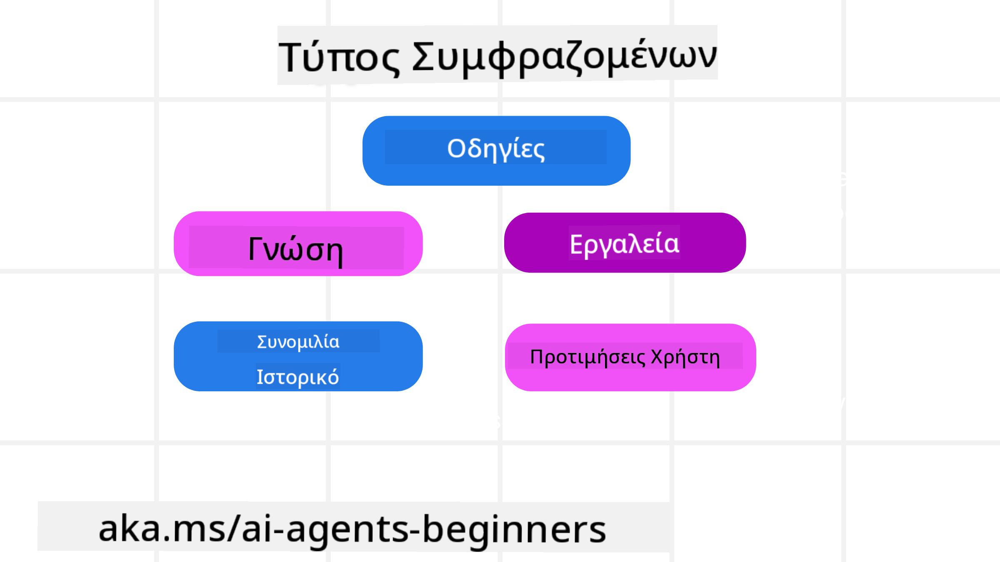
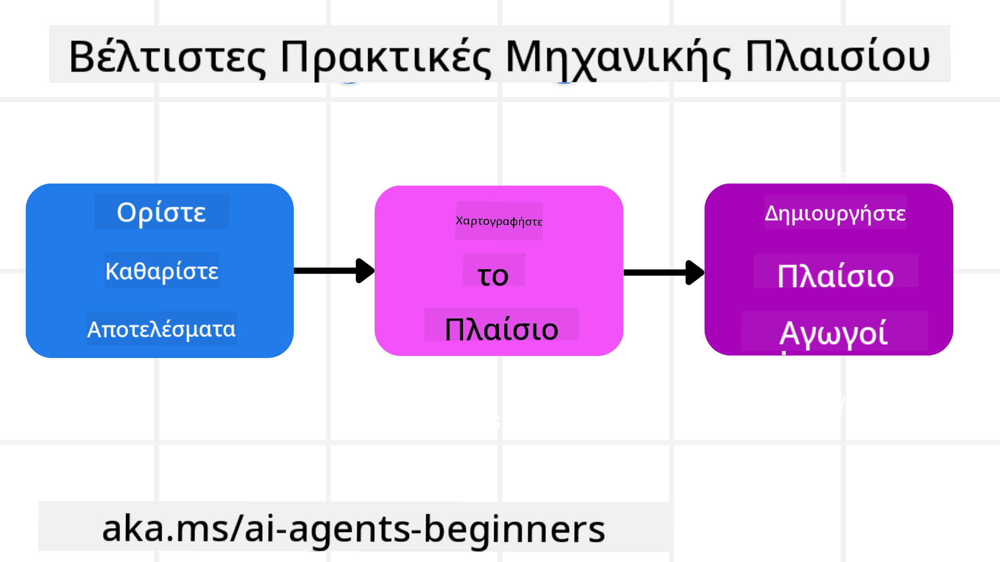

<!--
CO_OP_TRANSLATOR_METADATA:
{
  "original_hash": "cb7e50f471905ce6fdb92a30269a7a98",
  "translation_date": "2025-09-04T10:05:42+00:00",
  "source_file": "12-context-engineering/README.md",
  "language_code": "el"
}
-->
# Μηχανική Πλαισίου για Πράκτορες Τεχνητής Νοημοσύνης

> _(Κάντε κλικ στην παραπάνω εικόνα για να παρακολουθήσετε το βίντεο αυτού του μαθήματος)_

Η κατανόηση της πολυπλοκότητας της εφαρμογής για την οποία δημιουργείτε έναν πράκτορα Τεχνητής Νοημοσύνης είναι σημαντική για τη δημιουργία ενός αξιόπιστου συστήματος. Χρειαζόμαστε πράκτορες Τεχνητής Νοημοσύνης που να διαχειρίζονται αποτελεσματικά τις πληροφορίες για να ανταποκρίνονται σε σύνθετες ανάγκες, πέρα από τη μηχανική προτροπών.

Σε αυτό το μάθημα, θα εξετάσουμε τι είναι η μηχανική πλαισίου και τον ρόλο της στη δημιουργία πρακτόρων Τεχνητής Νοημοσύνης.

## Εισαγωγή

Αυτό το μάθημα θα καλύψει:

• **Τι είναι η Μηχανική Πλαισίου** και γιατί διαφέρει από τη μηχανική προτροπών.

• **Στρατηγικές για αποτελεσματική Μηχανική Πλαισίου**, συμπεριλαμβανομένου του πώς να γράφετε, να επιλέγετε, να συμπιέζετε και να απομονώνετε πληροφορίες.

• **Συνηθισμένες Αποτυχίες Πλαισίου** που μπορούν να εκτροχιάσουν τον πράκτορά σας και πώς να τις διορθώσετε.

## Στόχοι Μάθησης

Μετά την ολοκλήρωση αυτού του μαθήματος, θα μπορείτε να:

• **Ορίσετε τη μηχανική πλαισίου** και να τη διακρίνετε από τη μηχανική προτροπών.

• **Εντοπίσετε τα βασικά στοιχεία του πλαισίου** σε εφαρμογές Μεγάλων Γλωσσικών Μοντέλων (LLM).

• **Εφαρμόσετε στρατηγικές για τη συγγραφή, επιλογή, συμπίεση και απομόνωση πλαισίου** για τη βελτίωση της απόδοσης του πράκτορα.

• **Αναγνωρίσετε συνηθισμένες αποτυχίες πλαισίου** όπως δηλητηρίαση, απόσπαση προσοχής, σύγχυση και σύγκρουση, και να εφαρμόσετε τεχνικές μετριασμού.

## Τι είναι η Μηχανική Πλαισίου;

Για τους πράκτορες Τεχνητής Νοημοσύνης, το πλαίσιο είναι αυτό που καθοδηγεί τον σχεδιασμό του πράκτορα ώστε να αναλάβει συγκεκριμένες ενέργειες. Η Μηχανική Πλαισίου είναι η πρακτική της διασφάλισης ότι ο πράκτορας έχει τις σωστές πληροφορίες για να ολοκληρώσει το επόμενο βήμα της εργασίας. Το παράθυρο πλαισίου είναι περιορισμένο σε μέγεθος, οπότε ως δημιουργοί πρακτόρων πρέπει να αναπτύξουμε συστήματα και διαδικασίες για τη διαχείριση της προσθήκης, αφαίρεσης και συμπύκνωσης των πληροφοριών στο παράθυρο πλαισίου.

### Μηχανική Προτροπών έναντι Μηχανικής Πλαισίου

Η μηχανική προτροπών επικεντρώνεται σε ένα σύνολο στατικών οδηγιών για την αποτελεσματική καθοδήγηση των πρακτόρων με ένα σύνολο κανόνων. Η μηχανική πλαισίου αφορά τη διαχείριση ενός δυναμικού συνόλου πληροφοριών, συμπεριλαμβανομένης της αρχικής προτροπής, για να διασφαλιστεί ότι ο πράκτορας έχει ό,τι χρειάζεται με την πάροδο του χρόνου. Η βασική ιδέα της μηχανικής πλαισίου είναι να γίνει αυτή η διαδικασία επαναλαμβανόμενη και αξιόπιστη.

### Τύποι Πλαισίου

Είναι σημαντικό να θυμόμαστε ότι το πλαίσιο δεν είναι ένα μόνο πράγμα. Οι πληροφορίες που χρειάζεται ο πράκτορας μπορούν να προέρχονται από διάφορες πηγές και είναι δική μας ευθύνη να διασφαλίσουμε ότι ο πράκτορας έχει πρόσβαση σε αυτές τις πηγές:

Οι τύποι πλαισίου που μπορεί να χρειαστεί να διαχειριστεί ένας πράκτορας περιλαμβάνουν:

• **Οδηγίες:** Αυτές είναι οι "κανόνες" του πράκτορα – προτροπές, μηνύματα συστήματος, παραδείγματα λίγων βημάτων (δείχνοντας στον πράκτορα πώς να κάνει κάτι) και περιγραφές εργαλείων που μπορεί να χρησιμοποιήσει. Εδώ συνδυάζεται η μηχανική προτροπών με τη μηχανική πλαισίου.

• **Γνώση:** Αυτή περιλαμβάνει γεγονότα, πληροφορίες που ανακτώνται από βάσεις δεδομένων ή μακροπρόθεσμες μνήμες που έχει συσσωρεύσει ο πράκτορας. Αυτό περιλαμβάνει την ενσωμάτωση ενός συστήματος RAG (Retrieval Augmented Generation) εάν ο πράκτορας χρειάζεται πρόσβαση σε διαφορετικές αποθήκες γνώσης και βάσεις δεδομένων.

• **Εργαλεία:** Αυτές είναι οι ορισμοί εξωτερικών λειτουργιών, APIs και MCP Servers που μπορεί να καλέσει ο πράκτορας, μαζί με τα αποτελέσματα που λαμβάνει από τη χρήση τους.

• **Ιστορικό Συνομιλίας:** Ο διάλογος που εξελίσσεται με τον χρήστη. Με την πάροδο του χρόνου, αυτές οι συνομιλίες γίνονται μεγαλύτερες και πιο περίπλοκες, καταλαμβάνοντας χώρο στο παράθυρο πλαισίου.

• **Προτιμήσεις Χρήστη:** Πληροφορίες που μαθαίνονται για τις προτιμήσεις ή τις αντιπάθειες του χρήστη με την πάροδο του χρόνου. Αυτές μπορούν να αποθηκευτούν και να χρησιμοποιηθούν για τη λήψη βασικών αποφάσεων που βοηθούν τον χρήστη.

## Στρατηγικές για Αποτελεσματική Μηχανική Πλαισίου

### Στρατηγικές Σχεδιασμού

Η καλή μηχανική πλαισίου ξεκινά με καλό σχεδιασμό. Ακολουθεί μια προσέγγιση που θα σας βοηθήσει να αρχίσετε να σκέφτεστε πώς να εφαρμόσετε την έννοια της μηχανικής πλαισίου:

1. **Ορίστε Σαφή Αποτελέσματα** - Τα αποτελέσματα των εργασιών που θα ανατεθούν στους πράκτορες Τεχνητής Νοημοσύνης πρέπει να είναι σαφώς καθορισμένα. Απαντήστε στην ερώτηση - "Πώς θα μοιάζει ο κόσμος όταν ο πράκτορας ολοκληρώσει την εργασία του;" Με άλλα λόγια, ποια αλλαγή, πληροφορία ή απάντηση πρέπει να έχει ο χρήστης μετά την αλληλεπίδραση με τον πράκτορα.

2. **Χαρτογραφήστε το Πλαίσιο** - Αφού καθορίσετε τα αποτελέσματα του πράκτορα, πρέπει να απαντήσετε στην ερώτηση "Ποιες πληροφορίες χρειάζεται ο πράκτορας για να ολοκληρώσει αυτή την εργασία;". Με αυτόν τον τρόπο μπορείτε να αρχίσετε να χαρτογραφείτε το πλαίσιο από το οποίο μπορούν να αντληθούν αυτές οι πληροφορίες.

3. **Δημιουργήστε Αγωγούς Πλαισίου** - Τώρα που γνωρίζετε πού βρίσκονται οι πληροφορίες, πρέπει να απαντήσετε στην ερώτηση "Πώς θα αποκτήσει ο πράκτορας αυτές τις πληροφορίες;". Αυτό μπορεί να γίνει με διάφορους τρόπους, όπως RAG, χρήση MCP servers και άλλων εργαλείων.

### Πρακτικές Στρατηγικές

Ο σχεδιασμός είναι σημαντικός, αλλά μόλις οι πληροφορίες αρχίσουν να εισρέουν στο παράθυρο πλαισίου του πράκτορα, πρέπει να έχουμε πρακτικές στρατηγικές για τη διαχείρισή τους:

#### Διαχείριση Πλαισίου

Ενώ ορισμένες πληροφορίες θα προστίθενται αυτόματα στο παράθυρο πλαισίου, η μηχανική πλαισίου αφορά τη λήψη πιο ενεργού ρόλου σε αυτές τις πληροφορίες, κάτι που μπορεί να γίνει με μερικές στρατηγικές:

1. **Σημειωματάριο Πράκτορα**  
Επιτρέπει στον πράκτορα να κρατά σημειώσεις για σχετικές πληροφορίες σχετικά με τις τρέχουσες εργασίες και τις αλληλεπιδράσεις με τον χρήστη κατά τη διάρκεια μιας συνεδρίας. Αυτό πρέπει να υπάρχει εκτός του παραθύρου πλαισίου, σε ένα αρχείο ή αντικείμενο εκτέλεσης που ο πράκτορας μπορεί να ανακτήσει αργότερα κατά τη διάρκεια αυτής της συνεδρίας, εάν χρειαστεί.

2. **Μνήμες**  
Τα σημειωματάρια είναι καλά για τη διαχείριση πληροφοριών εκτός του παραθύρου πλαισίου μιας μόνο συνεδρίας. Οι μνήμες επιτρέπουν στους πράκτορες να αποθηκεύουν και να ανακτούν σχετικές πληροφορίες σε πολλές συνεδρίες. Αυτό θα μπορούσε να περιλαμβάνει περιλήψεις, προτιμήσεις χρηστών και σχόλια για βελτιώσεις στο μέλλον.

3. **Συμπίεση Πλαισίου**  
Όταν το παράθυρο πλαισίου μεγαλώνει και πλησιάζει το όριό του, μπορούν να χρησιμοποιηθούν τεχνικές όπως η περίληψη και η περικοπή. Αυτό περιλαμβάνει είτε τη διατήρηση μόνο των πιο σχετικών πληροφοριών είτε την αφαίρεση παλαιότερων μηνυμάτων.

4. **Συστήματα Πολλαπλών Πρακτόρων**  
Η ανάπτυξη συστημάτων πολλαπλών πρακτόρων αποτελεί μορφή μηχανικής πλαισίου, καθώς κάθε πράκτορας έχει το δικό του παράθυρο πλαισίου. Το πώς αυτό το πλαίσιο μοιράζεται και μεταβιβάζεται σε διαφορετικούς πράκτορες είναι κάτι που πρέπει να σχεδιαστεί κατά την κατασκευή αυτών των συστημάτων.

5. **Περιβάλλοντα Sandbox**  
Εάν ένας πράκτορας χρειάζεται να εκτελέσει κάποιον κώδικα ή να επεξεργαστεί μεγάλες ποσότητες πληροφοριών σε ένα έγγραφο, αυτό μπορεί να καταναλώσει μεγάλο αριθμό tokens για την επεξεργασία των αποτελεσμάτων. Αντί να αποθηκεύονται όλα αυτά στο παράθυρο πλαισίου, ο πράκτορας μπορεί να χρησιμοποιήσει ένα περιβάλλον sandbox που μπορεί να εκτελέσει αυτόν τον κώδικα και να διαβάσει μόνο τα αποτελέσματα και άλλες σχετικές πληροφορίες.

6. **Αντικείμενα Κατάστασης Εκτέλεσης**  
Αυτό γίνεται με τη δημιουργία κοντέινερ πληροφοριών για τη διαχείριση καταστάσεων όπου ο πράκτορας χρειάζεται πρόσβαση σε συγκεκριμένες πληροφορίες. Για μια σύνθετη εργασία, αυτό θα επέτρεπε στον πράκτορα να αποθηκεύει τα αποτελέσματα κάθε υπο-εργασίας βήμα προς βήμα, διατηρώντας το πλαίσιο συνδεδεμένο μόνο με αυτήν τη συγκεκριμένη υπο-εργασία.

### Παράδειγμα Μηχανικής Πλαισίου

Ας πούμε ότι θέλουμε έναν πράκτορα Τεχνητής Νοημοσύνης να **"Κλείσει ένα ταξίδι στο Παρίσι."**

• Ένας απλός πράκτορας που χρησιμοποιεί μόνο μηχανική προτροπών μπορεί απλώς να απαντήσει: **"Εντάξει, πότε θέλετε να πάτε στο Παρίσι;"**. Επεξεργάστηκε μόνο την άμεση ερώτησή σας τη στιγμή που την κάνατε.

• Ένας πράκτορας που χρησιμοποιεί τις στρατηγικές μηχανικής πλαισίου που καλύψαμε θα έκανε πολύ περισσότερα. Πριν καν απαντήσει, το σύστημά του μπορεί:

  ◦ **Να ελέγξει το ημερολόγιό σας** για διαθέσιμες ημερομηνίες (ανακτώντας δεδομένα σε πραγματικό χρόνο).

 ◦ **Να ανακαλέσει προηγούμενες ταξιδιωτικές προτιμήσεις** (από μακροπρόθεσμη μνήμη), όπως την προτιμώμενη αεροπορική εταιρεία, τον προϋπολογισμό σας ή αν προτιμάτε απευθείας πτήσεις.

 ◦ **Να εντοπίσει διαθέσιμα εργαλεία** για την κράτηση πτήσεων και ξενοδοχείων.

- Στη συνέχεια, μια παράδειγμα απάντηση θα μπορούσε να είναι: "Γεια σου [Το Όνομά Σας]! Βλέπω ότι είστε ελεύθεροι την πρώτη εβδομάδα του Οκτωβρίου. Να ψάξω για απευθείας πτήσεις προς Παρίσι με την [Προτιμώμενη Αεροπορική Εταιρεία] εντός του συνηθισμένου προϋπολογισμού σας [Προϋπολογισμός];". Αυτή η πλουσιότερη, προσαρμοσμένη στο πλαίσιο απάντηση δείχνει τη δύναμη της μηχανικής πλαισίου.

## Συνηθισμένες Αποτυχίες Πλαισίου

### Δηλητηρίαση Πλαισίου

**Τι είναι:** Όταν μια ψευδαίσθηση (ψευδείς πληροφορίες που δημιουργούνται από το LLM) ή ένα σφάλμα εισέρχεται στο πλαίσιο και αναφέρεται επανειλημμένα, προκαλώντας στον πράκτορα να επιδιώκει αδύνατους στόχους ή να αναπτύσσει παράλογες στρατηγικές.

**Τι να κάνετε:** Εφαρμόστε **επικύρωση πλαισίου** και **καραντίνα**. Επικυρώστε τις πληροφορίες πριν προστεθούν στη μακροπρόθεσμη μνήμη. Αν εντοπιστεί πιθανή δηλητηρίαση, ξεκινήστε νέες ροές πλαισίου για να αποτρέψετε τη διάδοση των λανθασμένων πληροφοριών.

**Παράδειγμα Κράτησης Ταξιδιού:** Ο πράκτοράς σας δημιουργεί ψευδώς μια **απευθείας πτήση από ένα μικρό τοπικό αεροδρόμιο σε μια απομακρυσμένη διεθνή πόλη** που δεν προσφέρει στην πραγματικότητα διεθνείς πτήσεις. Αυτή η ανύπαρκτη λεπτομέρεια πτήσης αποθηκεύεται στο πλαίσιο. Αργότερα, όταν ζητάτε από τον πράκτορα να κάνει κράτηση, συνεχίζει να προσπαθεί να βρει εισιτήρια για αυτήν την αδύνατη διαδρομή, οδηγώντας σε επαναλαμβανόμενα σφάλματα.

**Λύση:** Εφαρμόστε ένα βήμα που **επικυρώνει την ύπαρξη πτήσεων και διαδρομών με μια API σε πραγματικό χρόνο** _πριν_ προστεθεί η λεπτομέρεια της πτήσης στο ενεργό πλαίσιο του πράκτορα. Αν η επικύρωση αποτύχει, οι λανθασμένες πληροφορίες "μπαίνουν σε καραντίνα" και δεν χρησιμοποιούνται περαιτέρω.

### Απόσπαση Προσοχής Πλαισίου

**Τι είναι:** Όταν το πλαίσιο γίνεται τόσο μεγάλο που το μοντέλο επικεντρώνεται υπερβολικά στο συσσωρευμένο ιστορικό αντί να χρησιμοποιεί όσα έμαθε κατά την εκπαίδευση, οδηγώντας σε επαναλαμβανόμενες ή μη χρήσιμες ενέργειες. Τα μοντέλα μπορεί να αρχίσουν να κάνουν λάθη ακόμη και πριν γεμίσει το παράθυρο πλαισίου.

**Τι να κάνετε:** Χρησιμοποιήστε **περίληψη πλαισίου**. Περιοδικά συμπυκνώστε τις συσσωρευμένες πληροφορίες σε συντομότερες περιλήψεις, διατηρώντας σημαντικές λεπτομέρειες ενώ αφαιρείτε περιττό ιστορικό. Αυτό βοηθά στην "επαναφορά" της εστίασης.

**Παράδειγμα Κράτησης Ταξιδιού:** Συζητάτε διάφορους προορισμούς ονείρων για μεγάλο χρονικό διάστημα, συμπεριλαμβανομένης μιας λεπτομερούς αφήγησης για το ταξίδι σας με σακίδιο πριν από δύο χρόνια. Όταν τελικά ζητάτε **"βρες μου μια φθηνή πτήση για τον επόμενο μήνα"**, ο πράκτορας χάνεται στις παλιές, άσχετες λεπτομέρειες και συνεχίζει να ρωτά για

---

**Αποποίηση ευθύνης**:  
Αυτό το έγγραφο έχει μεταφραστεί χρησιμοποιώντας την υπηρεσία αυτόματης μετάφρασης AI [Co-op Translator](https://github.com/Azure/co-op-translator). Παρόλο που καταβάλλουμε προσπάθειες για ακρίβεια, παρακαλούμε να έχετε υπόψη ότι οι αυτόματες μεταφράσεις ενδέχεται να περιέχουν σφάλματα ή ανακρίβειες. Το πρωτότυπο έγγραφο στη μητρική του γλώσσα θα πρέπει να θεωρείται η αυθεντική πηγή. Για κρίσιμες πληροφορίες, συνιστάται επαγγελματική ανθρώπινη μετάφραση. Δεν φέρουμε ευθύνη για τυχόν παρεξηγήσεις ή εσφαλμένες ερμηνείες που προκύπτουν από τη χρήση αυτής της μετάφρασης.