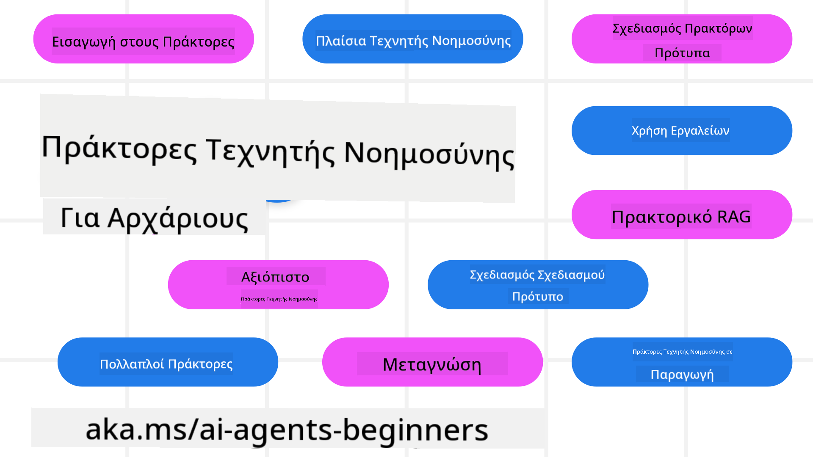

<!--
CO_OP_TRANSLATOR_METADATA:
{
  "original_hash": "6b07046397366e6f6f4524c9ddeba1e1",
  "translation_date": "2025-07-12T14:51:30+00:00",
  "source_file": "README.md",
  "language_code": "el"
}
-->
# AI Agents για Αρχάριους - Ένα Μάθημα

## 11 Μαθήματα που διδάσκουν ό,τι χρειάζεστε για να ξεκινήσετε να φτιάχνετε AI Agents

  
  
  
  

### 🌐 Υποστήριξη Πολλών Γλωσσών

#### Υποστηρίζεται μέσω GitHub Action (Αυτοματοποιημένο & Πάντα Ενημερωμένο)

[French](../fr/README.md) | [Spanish](../es/README.md) | [German](../de/README.md) | [Russian](../ru/README.md) | [Arabic](../ar/README.md) | [Persian (Farsi)](../fa/README.md) | [Urdu](../ur/README.md) | [Chinese (Simplified)](../zh/README.md) | [Chinese (Traditional, Macau)](../mo/README.md) | [Chinese (Traditional, Hong Kong)](../hk/README.md) | [Chinese (Traditional, Taiwan)](../tw/README.md) | [Japanese](../ja/README.md) | [Korean](../ko/README.md) | [Hindi](../hi/README.md) | [Bengali](../bn/README.md) | [Marathi](../mr/README.md) | [Nepali](../ne/README.md) | [Punjabi (Gurmukhi)](../pa/README.md) | [Portuguese (Portugal)](../pt/README.md) | [Portuguese (Brazil)](../br/README.md) | [Italian](../it/README.md) | [Polish](../pl/README.md) | [Turkish](../tr/README.md) | [Greek](./README.md) | [Thai](../th/README.md) | [Swedish](../sv/README.md) | [Danish](../da/README.md) | [Norwegian](../no/README.md) | [Finnish](../fi/README.md) | [Dutch](../nl/README.md) | [Hebrew](../he/README.md) | [Vietnamese](../vi/README.md) | [Indonesian](../id/README.md) | [Malay](../ms/README.md) | [Tagalog (Filipino)](../tl/README.md) | [Swahili](../sw/README.md) | [Hungarian](../hu/README.md) | [Czech](../cs/README.md) | [Slovak](../sk/README.md) | [Romanian](../ro/README.md) | [Bulgarian](../bg/README.md) | [Serbian (Cyrillic)](../sr/README.md) | [Croatian](../hr/README.md) | [Slovenian](../sl/README.md) | [Ukrainian](../uk/README.md) | [Burmese (Myanmar)](../my/README.md)

**Αν θέλετε να υποστηριχθούν επιπλέον γλώσσες, δείτε τις διαθέσιμες [εδώ](https://github.com/Azure/co-op-translator/blob/main/getting_started/supported-languages.md)**

  
  

## 🌱 Ξεκινώντας

Αυτό το μάθημα περιλαμβάνει 11 μαθήματα που καλύπτουν τα βασικά για τη δημιουργία AI Agents. Κάθε μάθημα έχει το δικό του θέμα, οπότε ξεκινήστε από όπου θέλετε!

Υπάρχει υποστήριξη πολλών γλωσσών για αυτό το μάθημα. Δείτε τις [διαθέσιμες γλώσσες εδώ](../..).

Αν είναι η πρώτη φορά που φτιάχνετε με Generative AI μοντέλα, ρίξτε μια ματιά στο μάθημα [Generative AI For Beginners](https://aka.ms/genai-beginners), που περιλαμβάνει 21 μαθήματα για τη δημιουργία με GenAI.

Μην ξεχάσετε να [βάλετε αστέρι (🌟) σε αυτό το repo](https://docs.github.com/en/get-started/exploring-projects-on-github/saving-repositories-with-stars?WT.mc_id=academic-105485-koreyst) και να [κάνετε fork το repo](https://github.com/microsoft/ai-agents-for-beginners/fork) για να τρέξετε τον κώδικα.

### Τι χρειάζεστε

Κάθε μάθημα σε αυτό το μάθημα περιλαμβάνει παραδείγματα κώδικα, τα οποία βρίσκονται στον φάκελο code_samples. Μπορείτε να [κάνετε fork το repo](https://github.com/microsoft/ai-agents-for-beginners/fork) για να δημιουργήσετε το δικό σας αντίγραφο.

Τα παραδείγματα κώδικα σε αυτές τις ασκήσεις χρησιμοποιούν Azure AI Foundry και GitHub Model Catalogs για την αλληλεπίδραση με Language Models:

- [Github Models](https://aka.ms/ai-agents-beginners/github-models) - Δωρεάν / Περιορισμένα  
- [Azure AI Foundry](https://aka.ms/ai-agents-beginners/ai-foundry) - Απαιτείται Λογαριασμός Azure

Αυτό το μάθημα χρησιμοποιεί επίσης τα παρακάτω πλαίσια και υπηρεσίες AI Agent από τη Microsoft:

- [Azure AI Agent Service](https://aka.ms/ai-agents-beginners/ai-agent-service)  
- [Semantic Kernel](https://aka.ms/ai-agents-beginners/semantic-kernel)  
- [AutoGen](https://aka.ms/ai-agents/autogen)

Για περισσότερες πληροφορίες σχετικά με το πώς να τρέξετε τον κώδικα για αυτό το μάθημα, δείτε το [Course Setup](./00-course-setup/README.md).

## 🙏 Θέλετε να βοηθήσετε;

Έχετε προτάσεις ή βρήκατε ορθογραφικά ή σφάλματα στον κώδικα; [Ανοίξτε ένα issue](https://github.com/microsoft/ai-agents-for-beginners/issues?WT.mc_id=academic-105485-koreyst) ή [Δημιουργήστε ένα pull request](https://github.com/microsoft/ai-agents-for-beginners/pulls?WT.mc_id=academic-105485-koreyst)

Αν κολλήσετε ή έχετε ερωτήσεις σχετικά με τη δημιουργία AI Agents, μπείτε στο [Azure AI Foundry Community Discord](https://discord.gg/kzRShWzttr)

Αν έχετε σχόλια για το προϊόν ή βρείτε σφάλματα κατά τη δημιουργία, επισκεφτείτε το [Azure AI Foundry Developer Forum](https://aka.ms/azureaifoundry/forum)

## 📂 Κάθε μάθημα περιλαμβάνει

- Ένα γραπτό μάθημα στο README και ένα σύντομο βίντεο  
- Παραδείγματα κώδικα Python που υποστηρίζουν Azure AI Foundry και Github Models (Δωρεάν)  
- Συνδέσμους με επιπλέον πόρους για να συνεχίσετε τη μάθησή σας

## 🗃️ Μαθήματα

| **Μάθημα**                               | **Κείμενο & Κώδικας**                              | **Βίντεο**                                                | **Επιπλέον Μάθηση**                                                                    |
|------------------------------------------|----------------------------------------------------|------------------------------------------------------------|----------------------------------------------------------------------------------------|
| Εισαγωγή στους AI Agents και Χρήσεις     | [Link](./01-intro-to-ai-agents/README.md)          | [Video](https://youtu.be/3zgm60bXmQk?si=z8QygFvYQv-9WtO1)  | [Link](https://aka.ms/ai-agents-beginners/collection?WT.mc_id=academic-105485-koreyst) |
| Εξερεύνηση AI Agentic Frameworks          | [Link](./02-explore-agentic-frameworks/README.md)  | [Video](https://youtu.be/ODwF-EZo_O8?si=Vawth4hzVaHv-u0H)  | [Link](https://aka.ms/ai-agents-beginners/collection?WT.mc_id=academic-105485-koreyst) |
| Κατανόηση AI Agentic Design Patterns      | [Link](./03-agentic-design-patterns/README.md)     | [Video](https://youtu.be/m9lM8qqoOEA?si=BIzHwzstTPL8o9GF)  | [Link](https://aka.ms/ai-agents-beginners/collection?WT.mc_id=academic-105485-koreyst) |
| Σχεδιαστικό Πρότυπο Χρήσης Εργαλείων     | [Link](./04-tool-use/README.md)                    | [Video](https://youtu.be/vieRiPRx-gI?si=2z6O2Xu2cu_Jz46N)  | [Link](https://aka.ms/ai-agents-beginners/collection?WT.mc_id=academic-105485-koreyst) |
| Agentic RAG                              | [Link](./05-agentic-rag/README.md)                 | [Video](https://youtu.be/WcjAARvdL7I?si=gKPWsQpKiIlDH9A3)  | [Link](https://aka.ms/ai-agents-beginners/collection?WT.mc_id=academic-105485-koreyst) |
| Δημιουργία Αξιόπιστων AI Agents           | [Link](./06-building-trustworthy-agents/README.md) | [Video](https://youtu.be/iZKkMEGBCUQ?si=jZjpiMnGFOE9L8OK ) | [Link](https://aka.ms/ai-agents-beginners/collection?WT.mc_id=academic-105485-koreyst) |
| Σχεδιαστικό Πρότυπο Σχεδιασμού            | [Link](./07-planning-design/README.md)             | [Video](https://youtu.be/kPfJ2BrBCMY?si=6SC_iv_E5-mzucnC)  | [Link](https://aka.ms/ai-agents-beginners/collection?WT.mc_id=academic-105485-koreyst) |
| Σχεδιαστικό Πρότυπο Πολυ-Πράκτορα         | [Link](./08-multi-agent/README.md)                 | [Video](https://youtu.be/V6HpE9hZEx0?si=rMgDhEu7wXo2uo6g)  | [Link](https://aka.ms/ai-agents-beginners/collection?WT.mc_id=academic-105485-koreyst) |
| Σχεδιαστικό Πρότυπο Μεταγνωστικής         | [Link](./09-metacognition/README.md)               | [Video](https://youtu.be/His9R6gw6Ec?si=8gck6vvdSNCt6OcF)  | [Link](https://aka.ms/ai-agents-beginners/collection?WT.mc_id=academic-105485-koreyst) |
| AI Agents σε Παραγωγή                     | [Link](./10-ai-agents-production/README.md)        | [Video](https://youtu.be/l4TP6IyJxmQ?si=31dnhexRo6yLRJDl)  | [Link](https://aka.ms/ai-agents-beginners/collection?WT.mc_id=academic-105485-koreyst) |
| AI Agents με MCP                         | [Link](./11-mcp/README.md)                         |                                                            | [Link](https://aka.ms/mcp-for-beginners)                                               |

## 🎒 Άλλα Μαθήματα

Η ομάδα μας δημιουργεί και άλλα μαθήματα! Ρίξτε μια ματιά:
- [**ΝΕΟ** Πρωτόκολλο Model Context (MCP) για Αρχάριους](https://github.com/microsoft/mcp-for-beginners?WT.mc_id=academic-105485-koreyst)
- [Γενετική Τεχνητή Νοημοσύνη για Αρχάριους με .NET](https://github.com/microsoft/Generative-AI-for-beginners-dotnet?WT.mc_id=academic-105485-koreyst)
- [Γενετική Τεχνητή Νοημοσύνη για Αρχάριους](https://github.com/microsoft/generative-ai-for-beginners?WT.mc_id=academic-105485-koreyst)
- [Μηχανική Μάθηση για Αρχάριους](https://aka.ms/ml-beginners?WT.mc_id=academic-105485-koreyst)
- [Επιστήμη Δεδομένων για Αρχάριους](https://aka.ms/datascience-beginners?WT.mc_id=academic-105485-koreyst)
- [Τεχνητή Νοημοσύνη για Αρχάριους](https://aka.ms/ai-beginners?WT.mc_id=academic-105485-koreyst)
- [Κυβερνοασφάλεια για Αρχάριους](https://github.com/microsoft/Security-101??WT.mc_id=academic-96948-sayoung)
- [Ανάπτυξη Ιστού για Αρχάριους](https://aka.ms/webdev-beginners?WT.mc_id=academic-105485-koreyst)
- [Internet των Πραγμάτων για Αρχάριους](https://aka.ms/iot-beginners?WT.mc_id=academic-105485-koreyst)
- [Ανάπτυξη XR για Αρχάριους](https://github.com/microsoft/xr-development-for-beginners?WT.mc_id=academic-105485-koreyst)
- [Κατακτώντας το GitHub Copilot για Προγραμματισμό με AI σε Ζευγάρι](https://aka.ms/GitHubCopilotAI?WT.mc_id=academic-105485-koreyst)
- [Κατακτώντας το GitHub Copilot για Προγραμματιστές C#/.NET](https://github.com/microsoft/mastering-github-copilot-for-dotnet-csharp-developers?WT.mc_id=academic-105485-koreyst)
- [Επέλεξε τη Δική σου Περιπέτεια με το Copilot](https://github.com/microsoft/CopilotAdventures?WT.mc_id=academic-105485-koreyst)

## 🌟 Ευχαριστίες στην Κοινότητα

Ευχαριστούμε τον [Shivam Goyal](https://www.linkedin.com/in/shivam2003/) για τη συνεισφορά σημαντικών παραδειγμάτων κώδικα που δείχνουν το Agentic RAG.

## Συνεισφορά

Αυτό το έργο καλωσορίζει συνεισφορές και προτάσεις. Οι περισσότερες συνεισφορές απαιτούν να συμφωνήσετε με μια
Συμφωνία Άδειας Συνεισφοράς (CLA) που δηλώνει ότι έχετε το δικαίωμα και πράγματι παραχωρείτε σε εμάς
τα δικαιώματα χρήσης της συνεισφοράς σας. Για λεπτομέρειες, επισκεφθείτε
<https://cla.opensource.microsoft.com>.

Όταν υποβάλλετε ένα pull request, ένα bot CLA θα καθορίσει αυτόματα αν χρειάζεται να παρέχετε
CLA και θα διακοσμήσει το PR ανάλογα (π.χ., έλεγχος κατάστασης, σχόλιο). Απλώς ακολουθήστε τις οδηγίες
που παρέχει το bot. Θα χρειαστεί να το κάνετε μόνο μία φορά για όλα τα αποθετήρια που χρησιμοποιούν την CLA μας.

Αυτό το έργο έχει υιοθετήσει τον [Κώδικα Δεοντολογίας Ανοιχτού Κώδικα της Microsoft](https://opensource.microsoft.com/codeofconduct/).
Για περισσότερες πληροφορίες δείτε τις [Συχνές Ερωτήσεις για τον Κώδικα Δεοντολογίας](https://opensource.microsoft.com/codeofconduct/faq/) ή
επικοινωνήστε με [opencode@microsoft.com](mailto:opencode@microsoft.com) για επιπλέον ερωτήσεις ή σχόλια.

## Εμπορικά Σήματα

Αυτό το έργο μπορεί να περιέχει εμπορικά σήματα ή λογότυπα για έργα, προϊόντα ή υπηρεσίες. Η εξουσιοδοτημένη χρήση των εμπορικών σημάτων ή λογότυπων της Microsoft υπόκειται και πρέπει να ακολουθεί
τις [Οδηγίες Χρήσης Εμπορικών Σημάτων & Επωνυμιών της Microsoft](https://www.microsoft.com/legal/intellectualproperty/trademarks/usage/general).
Η χρήση των εμπορικών σημάτων ή λογότυπων της Microsoft σε τροποποιημένες εκδόσεις αυτού του έργου δεν πρέπει να προκαλεί σύγχυση ή να υπονοεί χορηγία από τη Microsoft.
Οποιαδήποτε χρήση εμπορικών σημάτων ή λογότυπων τρίτων υπόκειται στις πολιτικές αυτών των τρίτων.

**Αποποίηση ευθυνών**:  
Αυτό το έγγραφο έχει μεταφραστεί χρησιμοποιώντας την υπηρεσία αυτόματης μετάφρασης AI [Co-op Translator](https://github.com/Azure/co-op-translator). Παρόλο που επιδιώκουμε την ακρίβεια, παρακαλούμε να γνωρίζετε ότι οι αυτόματες μεταφράσεις ενδέχεται να περιέχουν λάθη ή ανακρίβειες. Το πρωτότυπο έγγραφο στη γλώσσα του θεωρείται η αυθεντική πηγή. Για κρίσιμες πληροφορίες, συνιστάται επαγγελματική ανθρώπινη μετάφραση. Δεν φέρουμε ευθύνη για τυχόν παρεξηγήσεις ή λανθασμένες ερμηνείες που προκύπτουν από τη χρήση αυτής της μετάφρασης.