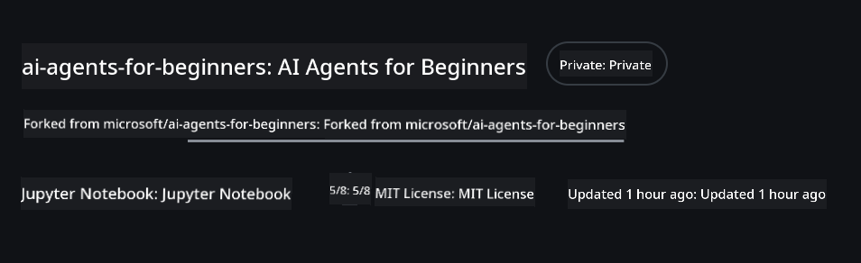
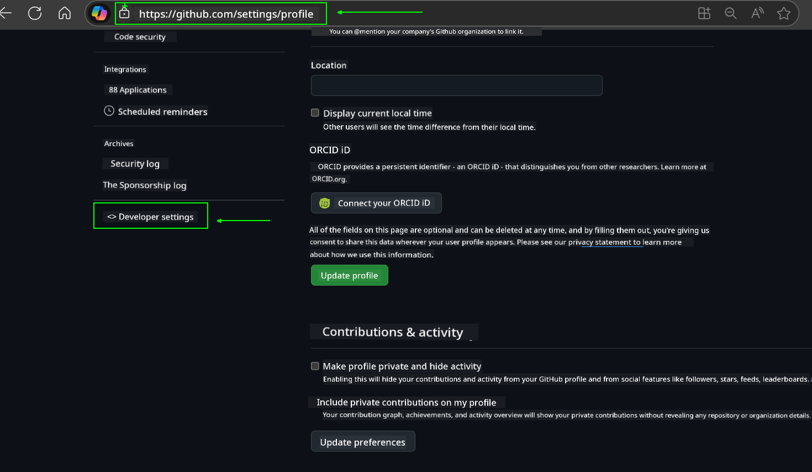
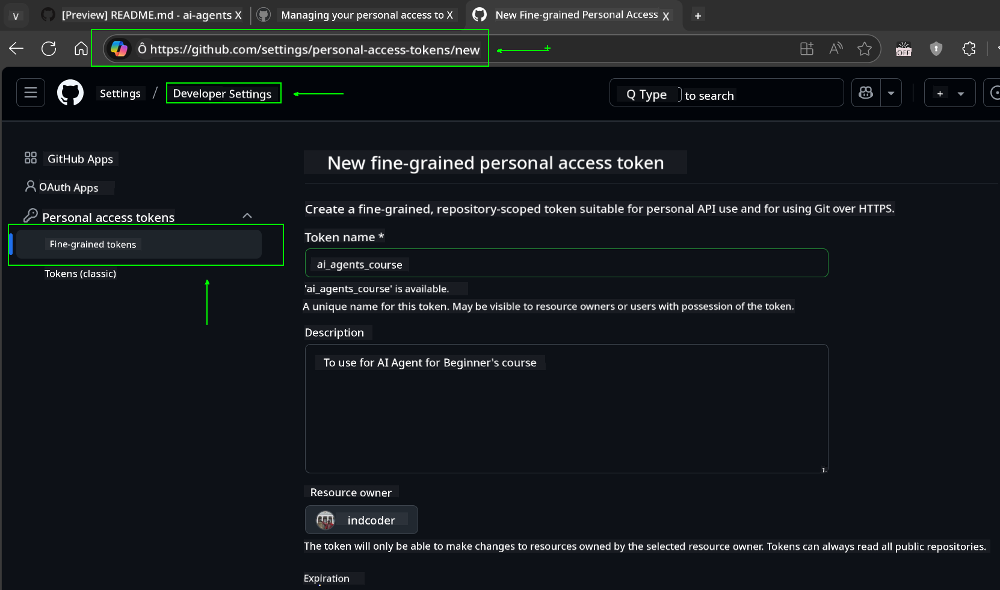
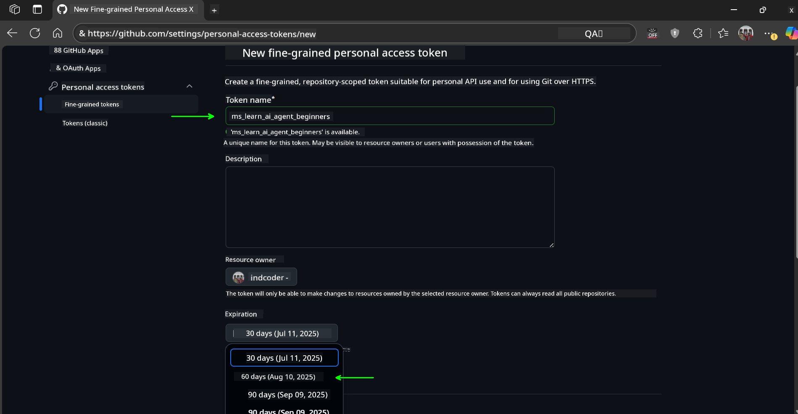
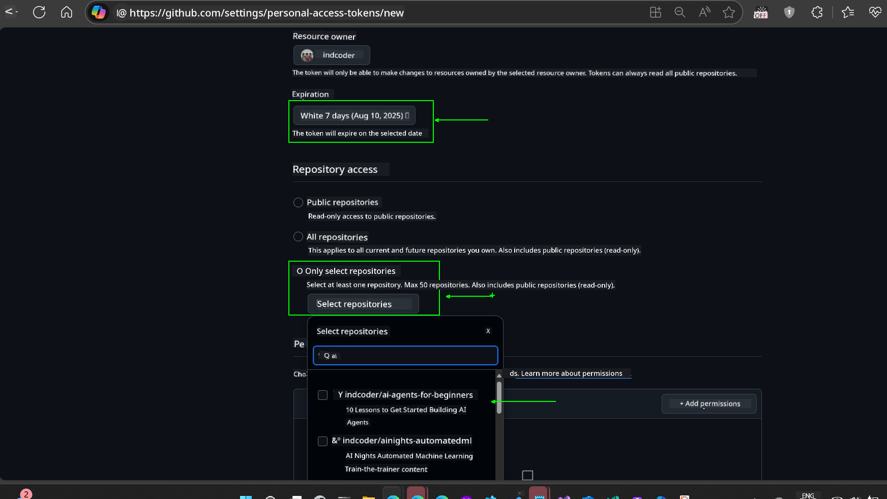
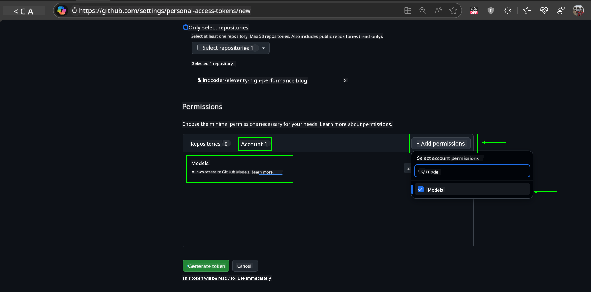
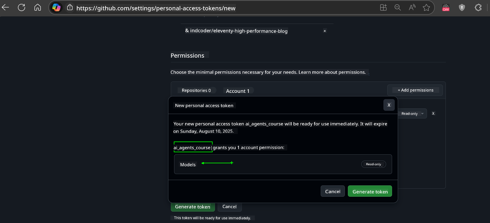
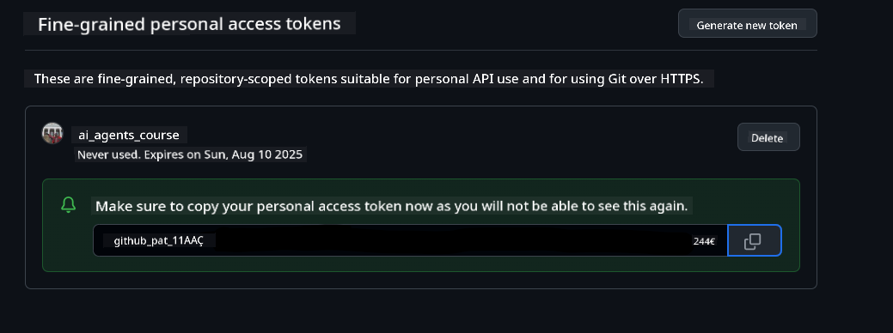
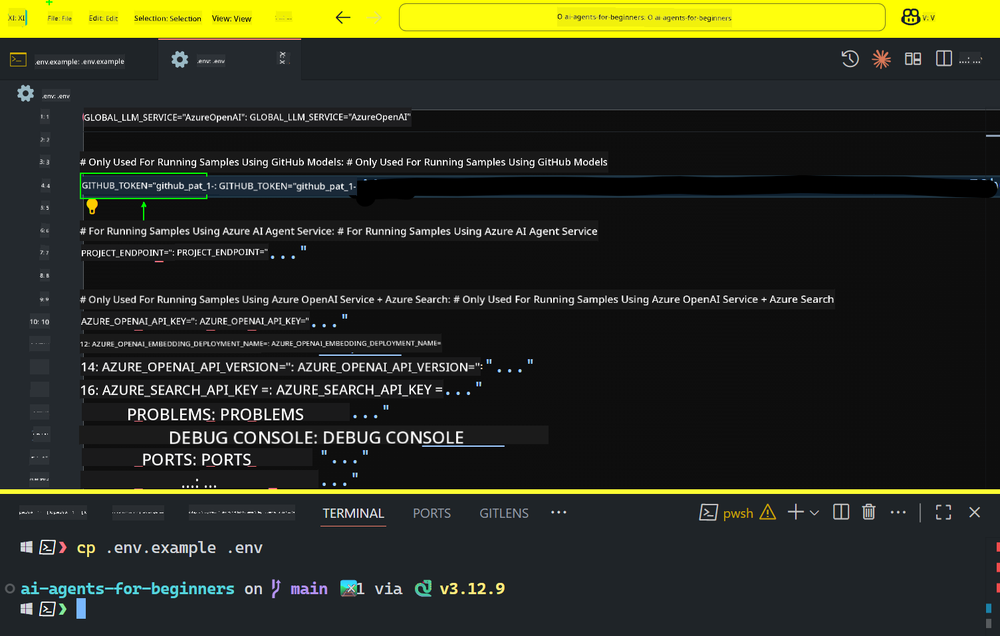
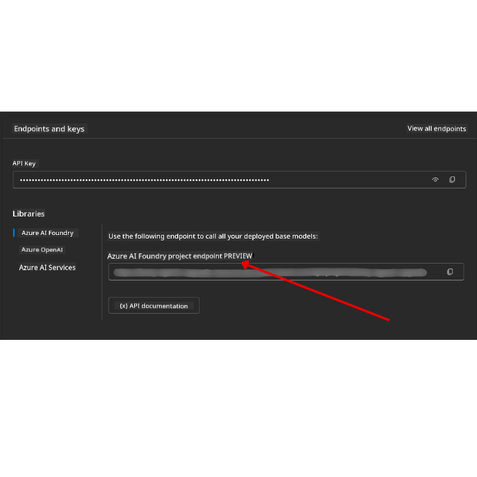

<!--
CO_OP_TRANSLATOR_METADATA:
{
  "original_hash": "c55b973b1562abf5aadf6a4028265ac5",
  "translation_date": "2025-08-30T13:03:58+00:00",
  "source_file": "00-course-setup/README.md",
  "language_code": "en"
}
-->
# Course Setup

## Introduction

This lesson will guide you on how to run the code samples provided in this course.

## Join Other Learners and Get Help

Before cloning the repository, join the [AI Agents For Beginners Discord channel](https://aka.ms/ai-agents/discord) to get assistance with setup, ask questions about the course, or connect with other learners.

## Clone or Fork this Repo

Start by cloning or forking the GitHub repository. This will create your own version of the course materials, allowing you to run, test, and modify the code.

You should now have your own forked version of this course at the following link:



## Running the Code

This course provides a series of Jupyter Notebooks for hands-on experience in building AI Agents.

The code samples use one of the following:

**Requires GitHub Account - Free**:
1. Semantic Kernel Agent Framework + GitHub Models Marketplace (semantic-kernel.ipynb)
2. AutoGen Framework + GitHub Models Marketplace (autogen.ipynb)

**Requires Azure Subscription**:
3. Azure AI Foundry + Azure AI Agent Service (azureaiagent.ipynb)

We recommend trying all three examples to determine which works best for you.

Your choice will determine the setup steps you need to follow below.

## Requirements

- Python 3.12+
  - **NOTE**: If Python 3.12 is not installed, make sure to install it. Then create your virtual environment using Python 3.12 to ensure the correct versions are installed from the requirements.txt file.
- A GitHub Account - For access to the GitHub Models Marketplace
- Azure Subscription - For access to Azure AI Foundry
- Azure AI Foundry Account - For access to the Azure AI Agent Service

A `requirements.txt` file is included in the root of this repository, listing all the required Python packages for running the code samples.

Install them by running the following command in your terminal at the root of the repository:

```bash
pip install -r requirements.txt
```

We recommend creating a Python virtual environment to avoid conflicts and issues.

## Setup VSCode

Ensure you are using the correct version of Python in VSCode.


## Set Up for Samples using GitHub Models 

### Step 1: Retrieve Your GitHub Personal Access Token (PAT)

This course uses the GitHub Models Marketplace, which provides free access to Large Language Models (LLMs) for building AI Agents.

To use the GitHub Models, create a [GitHub Personal Access Token](https://docs.github.com/en/authentication/keeping-your-account-and-data-secure/managing-your-personal-access-tokens).

This can be done in your GitHub Account.

Follow the [Principle of Least Privilege](https://docs.github.com/en/get-started/learning-to-code/storing-your-secrets-safely) when creating your token. Only grant the permissions necessary to run the code samples in this course.

1. Navigate to **Developer settings** and select the `Fine-grained tokens` option on the left side of your screen.
   

   Then select `Generate new token`.

   

2. Enter a descriptive name for your token to make it easy to identify later.

   🔐 **Token Duration Recommendation**  
   Recommended duration: 30 days  
   For better security, you can choose a shorter period, such as 7 days 🛡️.  
   This is a great way to stay motivated and complete the course while your learning momentum is high 🚀.

   

3. Limit the token's scope to your fork of this repository.

   

4. Restrict the token's permissions: Under **Permissions**, click the **Account** tab, then click the "+ Add permissions" button. A dropdown will appear. Search for **Models** and check the box for it.  
   

5. Verify the required permissions before generating the token.  
   

6. Before generating the token, ensure you are ready to store it securely (e.g., in a password manager), as it will not be shown again after creation.  
   

Copy the newly created token. You will now add it to the `.env` file included in this course.

### Step 2: Create Your `.env` File

Run the following command in your terminal to create your `.env` file:

```bash
cp .env.example .env
```

This will copy the example file and create a `.env` file in your directory, where you can fill in the values for the environment variables.

Open the `.env` file in your favorite text editor and paste your token into the `GITHUB_TOKEN` field.  


You should now be able to run the code samples in this course.

## Set Up for Samples using Azure AI Foundry and Azure AI Agent Service

### Step 1: Retrieve Your Azure Project Endpoint

Follow the steps to create a hub and project in Azure AI Foundry as described here: [Hub resources overview](https://learn.microsoft.com/en-us/azure/ai-foundry/concepts/ai-resources).

Once your project is created, retrieve the connection string for your project.

This can be found on the **Overview** page of your project in the Azure AI Foundry portal.  


### Step 2: Create Your `.env` File

Run the following command in your terminal to create your `.env` file:

```bash
cp .env.example .env
```

This will copy the example file and create a `.env` file in your directory, where you can fill in the values for the environment variables.

Open the `.env` file in your favorite text editor and paste your token into the `PROJECT_ENDPOINT` field.

### Step 3: Sign in to Azure

As a security best practice, use [keyless authentication](https://learn.microsoft.com/azure/developer/ai/keyless-connections?tabs=csharp%2Cazure-cli?WT.mc_id=academic-105485-koreyst) to authenticate to Azure OpenAI with Microsoft Entra ID.

Open a terminal and run `az login --use-device-code` to sign in to your Azure account.

After logging in, select your subscription in the terminal.

## Additional Environment Variables - Azure Search and Azure OpenAI 

For the Agentic RAG Lesson (Lesson 5), some samples use Azure Search and Azure OpenAI.

To run these samples, add the following environment variables to your `.env` file:

### Overview Page (Project)

- `AZURE_SUBSCRIPTION_ID` - Found under **Project details** on the **Overview** page of your project.
- `AZURE_AI_PROJECT_NAME` - Located at the top of the **Overview** page for your project.
- `AZURE_OPENAI_SERVICE` - Found in the **Included capabilities** tab for **Azure OpenAI Service** on the **Overview** page.

### Management Center

- `AZURE_OPENAI_RESOURCE_GROUP` - Found under **Project properties** on the **Overview** page of the **Management Center**.
- `GLOBAL_LLM_SERVICE` - Found under **Connected resources**. If not listed, check the **Azure portal** under your resource group for the AI Services resource name.

### Models + Endpoints Page

- `AZURE_OPENAI_EMBEDDING_DEPLOYMENT_NAME` - Select your embedding model (e.g., `text-embedding-ada-002`) and note the **Deployment name** from the model details.
- `AZURE_OPENAI_CHAT_DEPLOYMENT_NAME` - Select your chat model (e.g., `gpt-4o-mini`) and note the **Deployment name** from the model details.

### Azure Portal

- `AZURE_OPENAI_ENDPOINT` - Found under **Azure AI services** > **Resource Management** > **Keys and Endpoint**. Scroll to "Azure OpenAI endpoints" and copy the "Language APIs" endpoint.
- `AZURE_OPENAI_API_KEY` - From the same screen, copy KEY 1 or KEY 2.
- `AZURE_SEARCH_SERVICE_ENDPOINT` - Found under **Azure AI Search** > **Overview**.
- `AZURE_SEARCH_API_KEY` - Found under **Settings** > **Keys**. Copy the primary or secondary admin key.

### External Webpage

- `AZURE_OPENAI_API_VERSION` - Found on the [API version lifecycle](https://learn.microsoft.com/en-us/azure/ai-services/openai/api-version-deprecation#latest-ga-api-release) page under **Latest GA API release**.

### Setup Keyless Authentication

Instead of hardcoding credentials, use a keyless connection with Azure OpenAI. Import `DefaultAzureCredential` and call the `DefaultAzureCredential` function to get the credential.

```python
from azure.identity import DefaultAzureCredential, InteractiveBrowserCredential
```

## Stuck Somewhere?

If you encounter any issues during setup, join our [AI Agents For Beginners Discord channel](https://aka.ms/ai-agents/discord) for help.

## Next Lesson

You are now ready to run the code for this course. Enjoy learning about the world of AI Agents!  

[Introduction to AI Agents and Agent Use Cases](../01-intro-to-ai-agents/README.md)

---

**Disclaimer**:  
This document has been translated using the AI translation service [Co-op Translator](https://github.com/Azure/co-op-translator). While we aim for accuracy, please note that automated translations may include errors or inaccuracies. The original document in its native language should be regarded as the authoritative source. For critical information, professional human translation is advised. We are not responsible for any misunderstandings or misinterpretations resulting from the use of this translation.