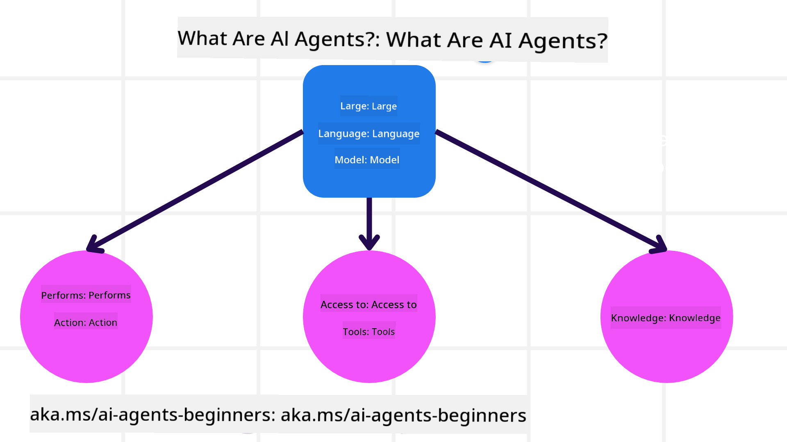
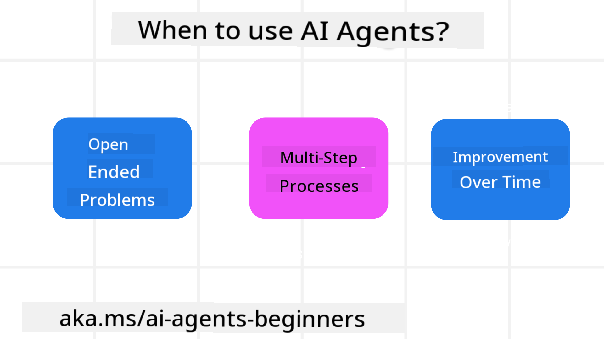

<!--
CO_OP_TRANSLATOR_METADATA:
{
  "original_hash": "d84943abc8f001ad4670418d32c2d899",
  "translation_date": "2025-07-12T07:59:53+00:00",
  "source_file": "01-intro-to-ai-agents/README.md",
  "language_code": "en"
}
-->
to meet other learners and AI Agent Builders and ask any questions you have about this course.

To start this course, we begin by gaining a clearer understanding of what AI Agents are and how we can use them in the applications and workflows we create.

## Introduction

This lesson covers:

- What AI Agents are and the different types of agents.
- Which use cases are best suited for AI Agents and how they can assist us.
- The basic building blocks involved in designing Agentic Solutions.

## Learning Goals
After completing this lesson, you should be able to:

- Understand AI Agent concepts and how they differ from other AI solutions.
- Use AI Agents effectively.
- Design Agentic solutions efficiently for both users and customers.

## Defining AI Agents and Types of AI Agents

### What are AI Agents?

AI Agents are **systems** that enable **Large Language Models (LLMs)** to **take actions** by extending their capabilities through giving LLMs **access to tools** and **knowledge**.

Let's break this definition down:

- **System** - It’s important to think of agents not as a single component but as a system made up of many components. At a basic level, the components of an AI Agent are:
  - **Environment** - The defined space where the AI Agent operates. For example, if we had a travel booking AI Agent, the environment could be the travel booking system the AI Agent uses to complete tasks.
  - **Sensors** - Environments contain information and provide feedback. AI Agents use sensors to gather and interpret this information about the current state of the environment. In the travel booking agent example, the system can provide data such as hotel availability or flight prices.
  - **Actuators** - Once the AI Agent receives the current state of the environment, it decides what action to take to change the environment for the current task. For the travel booking agent, this might be booking an available room for the user.

**Large Language Models** - The concept of agents existed before LLMs. The advantage of building AI Agents with LLMs is their ability to understand human language and data. This allows LLMs to interpret environmental information and create a plan to change the environment.

**Perform Actions** - Outside of AI Agent systems, LLMs are limited to generating content or information based on a user’s prompt. Within AI Agent systems, LLMs can complete tasks by interpreting the user’s request and using tools available in their environment.

**Access To Tools** - The tools the LLM can access are defined by 1) the environment it operates in and 2) the AI Agent developer. In our travel agent example, the agent’s tools are limited by the operations available in the booking system, and/or the developer can restrict the agent’s access to certain tools like flights.

**Memory + Knowledge** - Memory can be short-term, such as the conversation between the user and the agent. Long-term, beyond the environment’s information, AI Agents can also retrieve knowledge from other systems, services, tools, or even other agents. In the travel agent example, this knowledge could be the user’s travel preferences stored in a customer database.

### The different types of agents

Now that we have a general definition of AI Agents, let’s look at some specific agent types and how they might apply to a travel booking AI agent.

| **Agent Type**                | **Description**                                                                                                                       | **Example**                                                                                                                                                                                                                   |
| ----------------------------- | ------------------------------------------------------------------------------------------------------------------------------------- | ----------------------------------------------------------------------------------------------------------------------------------------------------------------------------------------------------------------------------- |
| **Simple Reflex Agents**      | Take immediate actions based on predefined rules.                                                                                     | Travel agent interprets the context of an email and forwards travel complaints to customer service.                                                                                                                          |
| **Model-Based Reflex Agents** | Take actions based on a model of the world and updates to that model.                                                                 | Travel agent prioritizes routes with significant price changes based on access to historical pricing data.                                                                                                                   |
| **Goal-Based Agents**         | Create plans to achieve specific goals by interpreting the goal and deciding on actions to reach it.                                  | Travel agent books a trip by determining necessary travel arrangements (car, public transit, flights) from the current location to the destination.                                                                          |
| **Utility-Based Agents**      | Consider preferences and weigh trade-offs numerically to decide how to achieve goals.                                                 | Travel agent maximizes utility by balancing convenience versus cost when booking travel.                                                                                                                                     |
| **Learning Agents**           | Improve over time by responding to feedback and adjusting actions accordingly.                                                        | Travel agent improves by using customer feedback from post-trip surveys to adjust future bookings.                                                                                                                           |
| **Hierarchical Agents**       | Consist of multiple agents in a tiered system, with higher-level agents breaking tasks into subtasks for lower-level agents to complete. | Travel agent cancels a trip by dividing the task into subtasks (e.g., canceling specific bookings) and having lower-level agents complete them, reporting back to the higher-level agent.                                      |
| **Multi-Agent Systems (MAS)** | Agents complete tasks independently, either cooperatively or competitively.                                                           | Cooperative: Multiple agents book specific travel services such as hotels, flights, and entertainment. Competitive: Multiple agents manage and compete over a shared hotel booking calendar to book customers into the hotel. |

## When to Use AI Agents

Earlier, we used the travel agent example to explain how different types of agents can be applied in various travel booking scenarios. We will continue to use this example throughout the course.

Let’s look at the types of use cases where AI Agents are most effective:

- **Open-Ended Problems** - allowing the LLM to determine the necessary steps to complete a task because it can’t always be hardcoded into a workflow.
- **Multi-Step Processes** - tasks that require complexity where the AI Agent needs to use tools or information over multiple interactions rather than a single retrieval.
- **Improvement Over Time** - tasks where the agent can improve by receiving feedback from its environment or users to provide better results.

We cover more considerations for using AI Agents in the Building Trustworthy AI Agents lesson.

## Basics of Agentic Solutions

### Agent Development

The first step in designing an AI Agent system is defining the tools, actions, and behaviors. In this course, we focus on using the **Azure AI Agent Service** to define our Agents. It offers features like:

- Selection of Open Models such as OpenAI, Mistral, and Llama
- Use of Licensed Data through providers like Tripadvisor
- Use of standardized OpenAPI 3.0 tools

### Agentic Patterns

Communication with LLMs happens through prompts. Given the semi-autonomous nature of AI Agents, it’s not always possible or necessary to manually re-prompt the LLM after an environmental change. We use **Agentic Patterns** that allow us to prompt the LLM over multiple steps in a scalable way.

This course is divided into some of the currently popular Agentic patterns.

### Agentic Frameworks

Agentic Frameworks allow developers to implement agentic patterns through code. These frameworks provide templates, plugins, and tools for better AI Agent collaboration. These benefits enable improved observability and troubleshooting of AI Agent systems.

In this course, we will explore the research-driven AutoGen framework and the production-ready Agent framework from Semantic Kernel.

## Previous Lesson

[Course Setup](../00-course-setup/README.md)

## Next Lesson

[Exploring Agentic Frameworks](../02-explore-agentic-frameworks/README.md)

**Disclaimer**:  
This document has been translated using the AI translation service [Co-op Translator](https://github.com/Azure/co-op-translator). While we strive for accuracy, please be aware that automated translations may contain errors or inaccuracies. The original document in its native language should be considered the authoritative source. For critical information, professional human translation is recommended. We are not liable for any misunderstandings or misinterpretations arising from the use of this translation.