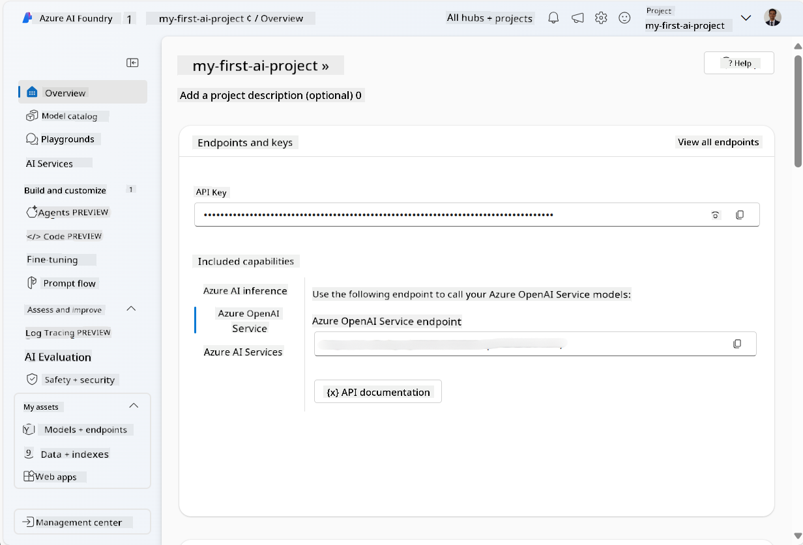
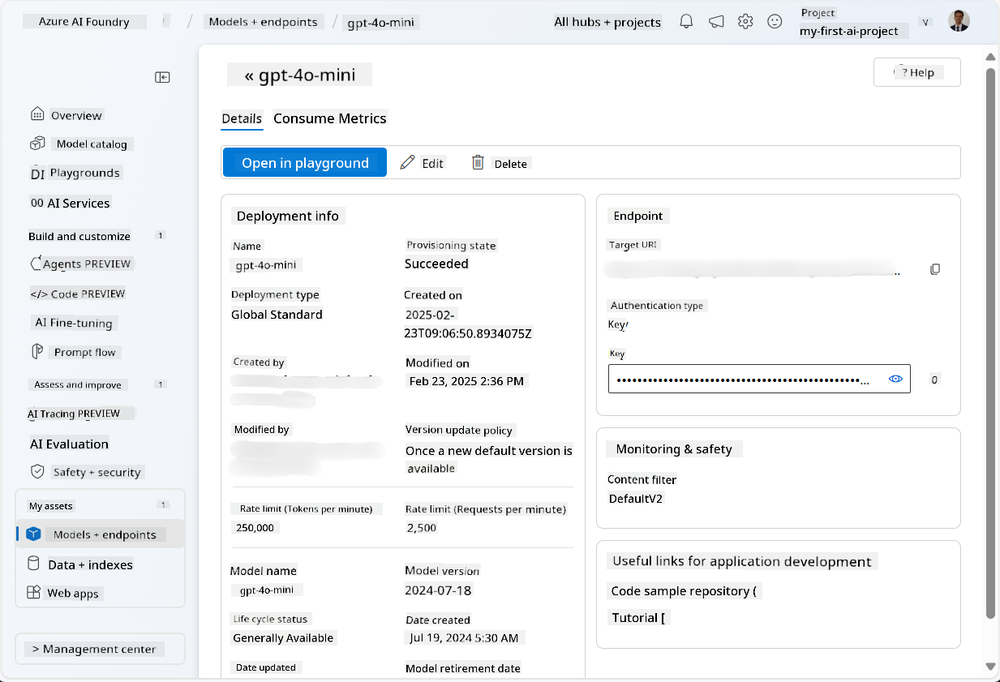
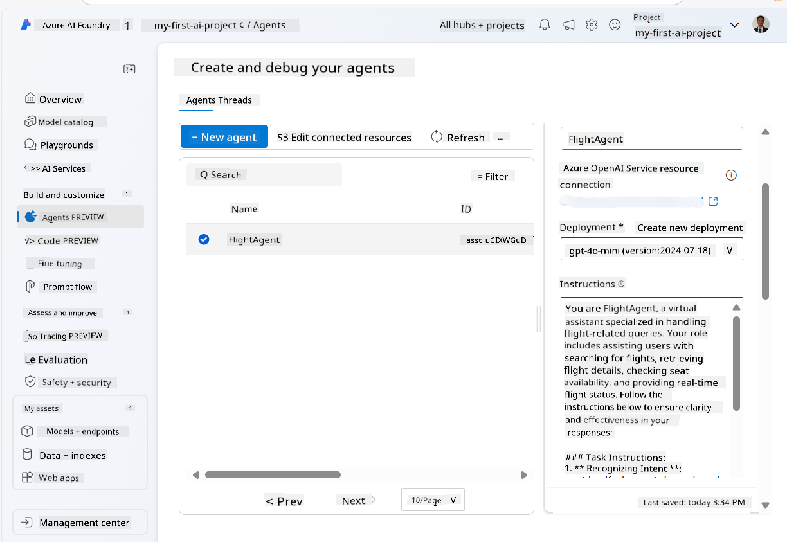
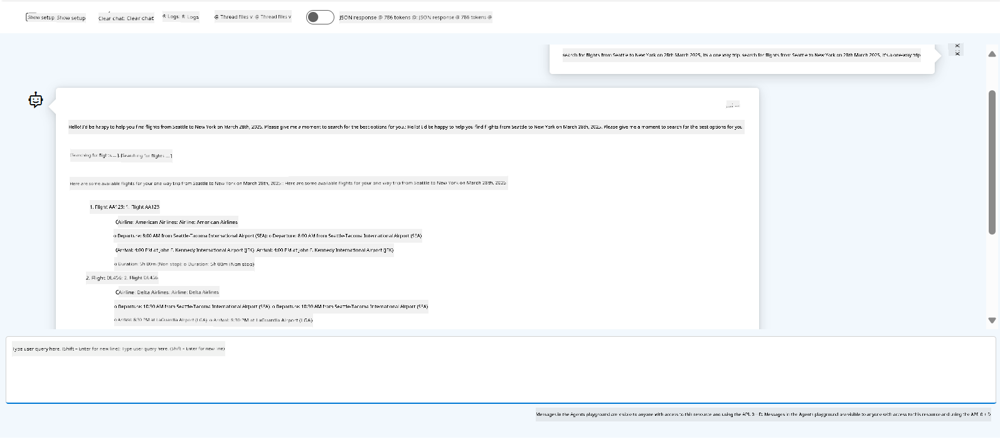

<!--
CO_OP_TRANSLATOR_METADATA:
{
  "original_hash": "7e92870dc0843e13d4dabc620c09d2d9",
  "translation_date": "2025-07-12T08:14:24+00:00",
  "source_file": "02-explore-agentic-frameworks/azure-ai-foundry-agent-creation.md",
  "language_code": "en"
}
-->
# Azure AI Agent Service Development

In this exercise, you will use the Azure AI Agent service tools in the [Azure AI Foundry portal](https://ai.azure.com/?WT.mc_id=academic-105485-koreyst) to create an agent for Flight Booking. The agent will be able to interact with users and provide information about flights.

## Prerequisites

To complete this exercise, you need the following:
1. An Azure account with an active subscription. [Create an account for free](https://azure.microsoft.com/free/?WT.mc_id=academic-105485-koreyst).
2. Permissions to create an Azure AI Foundry hub or have one created for you.
    - If your role is Contributor or Owner, you can follow the steps in this tutorial.

## Create an Azure AI Foundry hub

> **Note:** Azure AI Foundry was formerly known as Azure AI Studio.

1. Follow the guidelines in the [Azure AI Foundry](https://learn.microsoft.com/en-us/azure/ai-studio/?WT.mc_id=academic-105485-koreyst) blog post to create an Azure AI Foundry hub.
2. Once your project is created, close any tips that appear and review the project page in the Azure AI Foundry portal, which should look similar to the image below:

    

## Deploy a model

1. In the left pane of your project, under the **My assets** section, select the **Models + endpoints** page.
2. On the **Models + endpoints** page, go to the **Model deployments** tab, and from the **+ Deploy model** menu, select **Deploy base model**.
3. Search for the `gpt-4o-mini` model in the list, then select and confirm it.

    > **Note**: Lowering the TPM helps prevent overusing the quota available in your subscription.

    

## Create an agent

Now that you have deployed a model, you can create an agent. An agent is a conversational AI model that can interact with users.

1. In the left pane of your project, under the **Build & Customize** section, select the **Agents** page.
2. Click **+ Create agent** to create a new agent. In the **Agent Setup** dialog box:
    - Enter a name for the agent, such as `FlightAgent`.
    - Make sure the `gpt-4o-mini` model deployment you created earlier is selected.
    - Set the **Instructions** according to the prompt you want the agent to follow. Here is an example:
    ```
    You are FlightAgent, a virtual assistant specialized in handling flight-related queries. Your role includes assisting users with searching for flights, retrieving flight details, checking seat availability, and providing real-time flight status. Follow the instructions below to ensure clarity and effectiveness in your responses:

    ### Task Instructions:
    1. **Recognizing Intent**:
       - Identify the user's intent based on their request, focusing on one of the following categories:
         - Searching for flights
         - Retrieving flight details using a flight ID
         - Checking seat availability for a specified flight
         - Providing real-time flight status using a flight number
       - If the intent is unclear, politely ask users to clarify or provide more details.
        
    2. **Processing Requests**:
        - Depending on the identified intent, perform the required task:
        - For flight searches: Request details such as origin, destination, departure date, and optionally return date.
        - For flight details: Request a valid flight ID.
        - For seat availability: Request the flight ID and date and validate inputs.
        - For flight status: Request a valid flight number.
        - Perform validations on provided data (e.g., formats of dates, flight numbers, or IDs). If the information is incomplete or invalid, return a friendly request for clarification.

    3. **Generating Responses**:
    - Use a tone that is friendly, concise, and supportive.
    - Provide clear and actionable suggestions based on the output of each task.
    - If no data is found or an error occurs, explain it to the user gently and offer alternative actions (e.g., refine search, try another query).
    
    ```
> [!NOTE]
> For a detailed prompt, you can check out [this repository](https://github.com/ShivamGoyal03/RoamMind) for more information.
    
> Additionally, you can add a **Knowledge Base** and **Actions** to enhance the agent's capabilities to provide more information and perform automated tasks based on user requests. For this exercise, you can skip these steps.
    


3. To create a new multi-AI agent, simply click **New Agent**. The newly created agent will then appear on the Agents page.

## Test the agent

After creating the agent, you can test how it responds to user queries in the Azure AI Foundry portal playground.

1. At the top of the **Setup** pane for your agent, select **Try in playground**.
2. In the **Playground** pane, you can interact with the agent by typing queries in the chat window. For example, you can ask the agent to search for flights from Seattle to New York on the 28th.

    > **Note**: The agent might not provide accurate responses since no real-time data is used in this exercise. The goal is to test the agent's ability to understand and respond to user queries based on the instructions given.

    

3. After testing, you can further customize the agent by adding more intents, training data, and actions to improve its capabilities.

## Clean up resources

When you have finished testing the agent, delete it to avoid extra costs.
1. Open the [Azure portal](https://portal.azure.com) and navigate to the resource group where you deployed the hub resources used in this exercise.
2. On the toolbar, select **Delete resource group**.
3. Enter the resource group name and confirm the deletion.

## Resources

- [Azure AI Foundry documentation](https://learn.microsoft.com/en-us/azure/ai-studio/?WT.mc_id=academic-105485-koreyst)
- [Azure AI Foundry portal](https://ai.azure.com/?WT.mc_id=academic-105485-koreyst)
- [Getting Started with Azure AI Studio](https://techcommunity.microsoft.com/blog/educatordeveloperblog/getting-started-with-azure-ai-studio/4095602?WT.mc_id=academic-105485-koreyst)
- [Fundamentals of AI agents on Azure](https://learn.microsoft.com/en-us/training/modules/ai-agent-fundamentals/?WT.mc_id=academic-105485-koreyst)
- [Azure AI Discord](https://aka.ms/AzureAI/Discord)

**Disclaimer**:  
This document has been translated using the AI translation service [Co-op Translator](https://github.com/Azure/co-op-translator). While we strive for accuracy, please be aware that automated translations may contain errors or inaccuracies. The original document in its native language should be considered the authoritative source. For critical information, professional human translation is recommended. We are not liable for any misunderstandings or misinterpretations arising from the use of this translation.