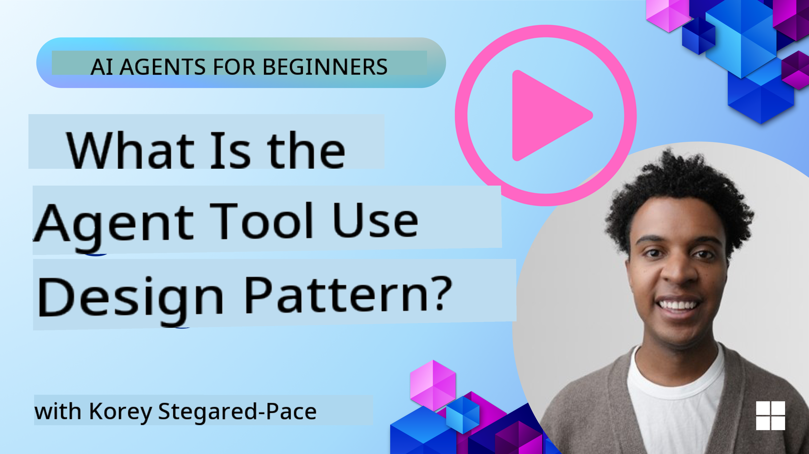
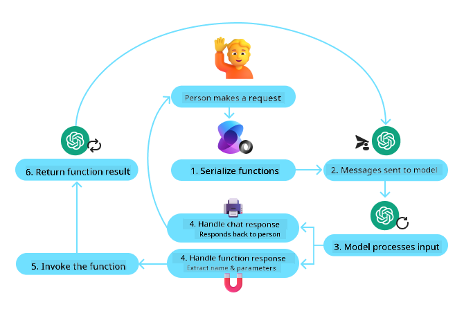
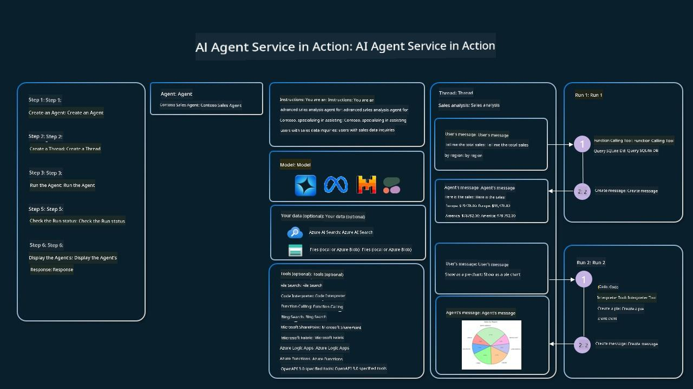

<!--
CO_OP_TRANSLATOR_METADATA:
{
  "original_hash": "88258b03f2893aa2e69eb8fb24baabbc",
  "translation_date": "2025-07-12T09:21:39+00:00",
  "source_file": "04-tool-use/README.md",
  "language_code": "en"
}
-->
[](https://youtu.be/vieRiPRx-gI?si=cEZ8ApnT6Sus9rhn)

> _(Click the image above to watch the video for this lesson)_

# Tool Use Design Pattern

Tools are interesting because they allow AI agents to have a wider range of capabilities. Instead of the agent being limited to a fixed set of actions, adding a tool enables the agent to perform many different tasks. In this chapter, we’ll explore the Tool Use Design Pattern, which explains how AI agents can use specific tools to reach their goals.

## Introduction

In this lesson, we aim to answer the following questions:

- What is the tool use design pattern?
- What are the scenarios where it can be applied?
- What are the key components needed to implement this design pattern?
- What special considerations should be taken into account when using the Tool Use Design Pattern to build trustworthy AI agents?

## Learning Goals

By the end of this lesson, you will be able to:

- Define the Tool Use Design Pattern and understand its purpose.
- Identify use cases where the Tool Use Design Pattern is applicable.
- Understand the essential elements required to implement the design pattern.
- Recognize important considerations for ensuring trustworthiness in AI agents using this design pattern.

## What is the Tool Use Design Pattern?

The **Tool Use Design Pattern** focuses on enabling LLMs to interact with external tools to accomplish specific objectives. Tools are pieces of code that an agent can execute to perform actions. A tool might be a simple function like a calculator or an API call to a third-party service such as stock price lookup or weather forecasting. In AI agents, tools are designed to be executed in response to **model-generated function calls**.

## What are the use cases it can be applied to?

AI agents can use tools to complete complex tasks, gather information, or make decisions. The tool use design pattern is commonly applied in situations that require dynamic interaction with external systems like databases, web services, or code interpreters. This capability is useful for various scenarios, including:

- **Dynamic Information Retrieval:** Agents can query external APIs or databases to get up-to-date data (e.g., querying a SQLite database for data analysis, fetching stock prices or weather updates).
- **Code Execution and Interpretation:** Agents can run code or scripts to solve math problems, generate reports, or run simulations.
- **Workflow Automation:** Automating repetitive or multi-step workflows by integrating tools such as task schedulers, email services, or data pipelines.
- **Customer Support:** Agents can interact with CRM systems, ticketing platforms, or knowledge bases to resolve user inquiries.
- **Content Generation and Editing:** Agents can use tools like grammar checkers, text summarizers, or content safety evaluators to assist with content creation.

## What are the elements/building blocks needed to implement the tool use design pattern?

These building blocks enable the AI agent to perform a wide variety of tasks. Let’s review the key components needed to implement the Tool Use Design Pattern:

- **Function/Tool Schemas**: Detailed definitions of available tools, including function names, purposes, required parameters, and expected outputs. These schemas help the LLM understand what tools are available and how to form valid requests.

- **Function Execution Logic**: Controls how and when tools are called based on the user’s intent and the conversation context. This may include planner modules, routing mechanisms, or conditional flows that dynamically determine tool usage.

- **Message Handling System**: Components that manage the conversational flow between user inputs, LLM responses, tool calls, and tool outputs.

- **Tool Integration Framework**: Infrastructure that connects the agent to various tools, whether simple functions or complex external services.

- **Error Handling & Validation**: Mechanisms to manage failures in tool execution, validate parameters, and handle unexpected responses.

- **State Management**: Tracks conversation context, previous tool interactions, and persistent data to maintain consistency across multi-turn interactions.

Next, let’s dive deeper into Function/Tool Calling.

### Function/Tool Calling

Function calling is the main way we enable Large Language Models (LLMs) to interact with tools. You’ll often see ‘Function’ and ‘Tool’ used interchangeably because ‘functions’ (reusable blocks of code) are the ‘tools’ agents use to perform tasks. For a function’s code to be invoked, an LLM must match the user’s request to the function’s description. To do this, a schema containing descriptions of all available functions is sent to the LLM. The LLM then selects the most appropriate function for the task and returns its name and arguments. The chosen function is called, its response is sent back to the LLM, which uses that information to reply to the user.

For developers to implement function calling for agents, you will need:

1. An LLM model that supports function calling  
2. A schema describing the functions  
3. The code for each described function  

Let’s use the example of getting the current time in a city to illustrate:

1. **Initialize an LLM that supports function calling:**

    Not all models support function calling, so it’s important to verify that your LLM does.  
    <a href="https://learn.microsoft.com/azure/ai-services/openai/how-to/function-calling" target="_blank">Azure OpenAI</a> supports function calling. We can start by initializing the Azure OpenAI client.

    ```python
    # Initialize the Azure OpenAI client
    client = AzureOpenAI(
        azure_endpoint = os.getenv("AZURE_OPENAI_ENDPOINT"), 
        api_key=os.getenv("AZURE_OPENAI_API_KEY"),  
        api_version="2024-05-01-preview"
    )
    ```

1. **Create a Function Schema:**

    Next, we define a JSON schema that includes the function name, a description of what the function does, and the names and descriptions of its parameters.  
    We then pass this schema to the client created earlier, along with the user’s request to find the time in San Francisco. It’s important to note that a **tool call** is returned, **not** the final answer. As mentioned, the LLM returns the name of the function it selected and the arguments to pass to it.

    ```python
    # Function description for the model to read
    tools = [
        {
            "type": "function",
            "function": {
                "name": "get_current_time",
                "description": "Get the current time in a given location",
                "parameters": {
                    "type": "object",
                    "properties": {
                        "location": {
                            "type": "string",
                            "description": "The city name, e.g. San Francisco",
                        },
                    },
                    "required": ["location"],
                },
            }
        }
    ]
    ```
   
    ```python
  
    # Initial user message
    messages = [{"role": "user", "content": "What's the current time in San Francisco"}] 
  
    # First API call: Ask the model to use the function
      response = client.chat.completions.create(
          model=deployment_name,
          messages=messages,
          tools=tools,
          tool_choice="auto",
      )
  
      # Process the model's response
      response_message = response.choices[0].message
      messages.append(response_message)
  
      print("Model's response:")  

      print(response_message)
  
    ```

    ```bash
    Model's response:
    ChatCompletionMessage(content=None, role='assistant', function_call=None, tool_calls=[ChatCompletionMessageToolCall(id='call_pOsKdUlqvdyttYB67MOj434b', function=Function(arguments='{"location":"San Francisco"}', name='get_current_time'), type='function')])
    ```
  
1. **The function code to perform the task:**

    Now that the LLM has chosen which function to run, the code to carry out the task needs to be implemented and executed.  
    We can write the code to get the current time in Python. We also need to extract the function name and arguments from the response_message to get the final result.

    ```python
      def get_current_time(location):
        """Get the current time for a given location"""
        print(f"get_current_time called with location: {location}")  
        location_lower = location.lower()
        
        for key, timezone in TIMEZONE_DATA.items():
            if key in location_lower:
                print(f"Timezone found for {key}")  
                current_time = datetime.now(ZoneInfo(timezone)).strftime("%I:%M %p")
                return json.dumps({
                    "location": location,
                    "current_time": current_time
                })
      
        print(f"No timezone data found for {location_lower}")  
        return json.dumps({"location": location, "current_time": "unknown"})
    ```

    ```python
     # Handle function calls
      if response_message.tool_calls:
          for tool_call in response_message.tool_calls:
              if tool_call.function.name == "get_current_time":
     
                  function_args = json.loads(tool_call.function.arguments)
     
                  time_response = get_current_time(
                      location=function_args.get("location")
                  )
     
                  messages.append({
                      "tool_call_id": tool_call.id,
                      "role": "tool",
                      "name": "get_current_time",
                      "content": time_response,
                  })
      else:
          print("No tool calls were made by the model.")  
  
      # Second API call: Get the final response from the model
      final_response = client.chat.completions.create(
          model=deployment_name,
          messages=messages,
      )
  
      return final_response.choices[0].message.content
     ```

    ```bash
      get_current_time called with location: San Francisco
      Timezone found for san francisco
      The current time in San Francisco is 09:24 AM.
     ```

Function Calling is central to most, if not all, agent tool use designs, but implementing it from scratch can sometimes be challenging.  
As we saw in [Lesson 2](../../../02-explore-agentic-frameworks), agentic frameworks provide pre-built building blocks to implement tool use.

## Tool Use Examples with Agentic Frameworks

Here are some examples of how you can implement the Tool Use Design Pattern using different agentic frameworks:

### Semantic Kernel

<a href="https://learn.microsoft.com/azure/ai-services/agents/overview" target="_blank">Semantic Kernel</a> is an open-source AI framework for .NET, Python, and Java developers working with Large Language Models (LLMs). It simplifies function calling by automatically describing your functions and their parameters to the model through a process called <a href="https://learn.microsoft.com/semantic-kernel/concepts/ai-services/chat-completion/function-calling/?pivots=programming-language-python#1-serializing-the-functions" target="_blank">serializing</a>. It also manages the back-and-forth communication between the model and your code. Another benefit of using an agentic framework like Semantic Kernel is that it gives you access to pre-built tools like <a href="https://github.com/microsoft/semantic-kernel/blob/main/python/samples/getting_started_with_agents/openai_assistant/step4_assistant_tool_file_search.py" target="_blank">File Search</a> and <a href="https://github.com/microsoft/semantic-kernel/blob/main/python/samples/getting_started_with_agents/openai_assistant/step3_assistant_tool_code_interpreter.py" target="_blank">Code Interpreter</a>.

The following diagram shows the function calling process with Semantic Kernel:



In Semantic Kernel, functions/tools are called <a href="https://learn.microsoft.com/semantic-kernel/concepts/plugins/?pivots=programming-language-python" target="_blank">Plugins</a>. We can convert the `get_current_time` function from earlier into a plugin by turning it into a class containing the function. We can also import the `kernel_function` decorator, which includes the function’s description. When you create a kernel with the GetCurrentTimePlugin, the kernel automatically serializes the function and its parameters, creating the schema to send to the LLM.

```python
from semantic_kernel.functions import kernel_function

class GetCurrentTimePlugin:
    async def __init__(self, location):
        self.location = location

    @kernel_function(
        description="Get the current time for a given location"
    )
    def get_current_time(location: str = ""):
        ...

```

```python 
from semantic_kernel import Kernel

# Create the kernel
kernel = Kernel()

# Create the plugin
get_current_time_plugin = GetCurrentTimePlugin(location)

# Add the plugin to the kernel
kernel.add_plugin(get_current_time_plugin)
```
  
### Azure AI Agent Service

<a href="https://learn.microsoft.com/azure/ai-services/agents/overview" target="_blank">Azure AI Agent Service</a> is a newer agentic framework designed to help developers securely build, deploy, and scale high-quality, extensible AI agents without managing the underlying compute and storage resources. It’s especially useful for enterprise applications because it’s a fully managed service with enterprise-grade security.

Compared to developing directly with the LLM API, Azure AI Agent Service offers several advantages, including:

- Automatic tool calling – no need to parse tool calls, invoke tools, and handle responses; all of this happens server-side  
- Securely managed data – instead of managing your own conversation state, you can rely on threads to store all necessary information  
- Ready-to-use tools – Tools to interact with your data sources, such as Bing, Azure AI Search, and Azure Functions  

The tools available in Azure AI Agent Service fall into two categories:

1. Knowledge Tools:  
    - <a href="https://learn.microsoft.com/azure/ai-services/agents/how-to/tools/bing-grounding?tabs=python&pivots=overview" target="_blank">Grounding with Bing Search</a>  
    - <a href="https://learn.microsoft.com/azure/ai-services/agents/how-to/tools/file-search?tabs=python&pivots=overview" target="_blank">File Search</a>  
    - <a href="https://learn.microsoft.com/azure/ai-services/agents/how-to/tools/azure-ai-search?tabs=azurecli%2Cpython&pivots=overview-azure-ai-search" target="_blank">Azure AI Search</a>  

2. Action Tools:  
    - <a href="https://learn.microsoft.com/azure/ai-services/agents/how-to/tools/function-calling?tabs=python&pivots=overview" target="_blank">Function Calling</a>  
    - <a href="https://learn.microsoft.com/azure/ai-services/agents/how-to/tools/code-interpreter?tabs=python&pivots=overview" target="_blank">Code Interpreter</a>  
    - <a href="https://learn.microsoft.com/azure/ai-services/agents/how-to/tools/openapi-spec?tabs=python&pivots=overview" target="_blank">OpenAI defined tools</a>  
    - <a href="https://learn.microsoft.com/azure/ai-services/agents/how-to/tools/azure-functions?pivots=overview" target="_blank">Azure Functions</a>  

The Agent Service lets us use these tools together as a `toolset`. It also uses `threads` to keep track of message history from a specific conversation.

Imagine you are a sales agent at a company called Contoso. You want to build a conversational agent that can answer questions about your sales data.

The following image shows how you could use Azure AI Agent Service to analyze your sales data:



To use any of these tools with the service, we create a client and define a tool or toolset. Practically, we can use the following Python code. The LLM will look at the toolset and decide whether to use the user-created function, `fetch_sales_data_using_sqlite_query`, or the pre-built Code Interpreter depending on the user’s request.

```python 
import os
from azure.ai.projects import AIProjectClient
from azure.identity import DefaultAzureCredential
from fecth_sales_data_functions import fetch_sales_data_using_sqlite_query # fetch_sales_data_using_sqlite_query function which can be found in a fetch_sales_data_functions.py file.
from azure.ai.projects.models import ToolSet, FunctionTool, CodeInterpreterTool

project_client = AIProjectClient.from_connection_string(
    credential=DefaultAzureCredential(),
    conn_str=os.environ["PROJECT_CONNECTION_STRING"],
)

# Initialize function calling agent with the fetch_sales_data_using_sqlite_query function and adding it to the toolset
fetch_data_function = FunctionTool(fetch_sales_data_using_sqlite_query)
toolset = ToolSet()
toolset.add(fetch_data_function)

# Initialize Code Interpreter tool and adding it to the toolset. 
code_interpreter = code_interpreter = CodeInterpreterTool()
toolset = ToolSet()
toolset.add(code_interpreter)

agent = project_client.agents.create_agent(
    model="gpt-4o-mini", name="my-agent", instructions="You are helpful agent", 
    toolset=toolset
)
```

## What are the special considerations for using the Tool Use Design Pattern to build trustworthy AI agents?

A common concern with SQL dynamically generated by LLMs is security, especially the risk of SQL injection or malicious actions like dropping or tampering with the database. While these concerns are valid, they can be effectively addressed by properly configuring database access permissions. For most databases, this means setting the database to read-only. For database services like PostgreSQL or Azure SQL, the app should be assigned a read-only (SELECT) role.

Running the app in a secure environment further enhances protection. In enterprise scenarios, data is typically extracted and transformed from operational systems into a read-only database or data warehouse with a user-friendly schema. This approach ensures the data is secure, optimized for performance and accessibility, and that the app has restricted, read-only access.

## Additional Resources

-
<a href="https://microsoft.github.io/build-your-first-agent-with-azure-ai-agent-service-workshop/" target="_blank">
Azure AI Agents Service Workshop</a>
- <a href="https://github.com/Azure-Samples/contoso-creative-writer/tree/main/docs/workshop" target="_blank">Contoso Creative Writer Multi-Agent Workshop</a>
- <a href="https://learn.microsoft.com/semantic-kernel/concepts/ai-services/chat-completion/function-calling/?pivots=programming-language-python#1-serializing-the-functions" target="_blank">Semantic Kernel Function Calling Tutorial</a>
- <a href="https://github.com/microsoft/semantic-kernel/blob/main/python/samples/getting_started_with_agents/openai_assistant/step3_assistant_tool_code_interpreter.py" target="_blank">Semantic Kernel Code Interpreter</a>
- <a href="https://microsoft.github.io/autogen/dev/user-guide/core-user-guide/components/tools.html" target="_blank">Autogen Tools</a>

## Previous Lesson

[Understanding Agentic Design Patterns](../03-agentic-design-patterns/README.md)

## Next Lesson

[Agentic RAG](../05-agentic-rag/README.md)

**Disclaimer**:  
This document has been translated using the AI translation service [Co-op Translator](https://github.com/Azure/co-op-translator). While we strive for accuracy, please be aware that automated translations may contain errors or inaccuracies. The original document in its native language should be considered the authoritative source. For critical information, professional human translation is recommended. We are not liable for any misunderstandings or misinterpretations arising from the use of this translation.