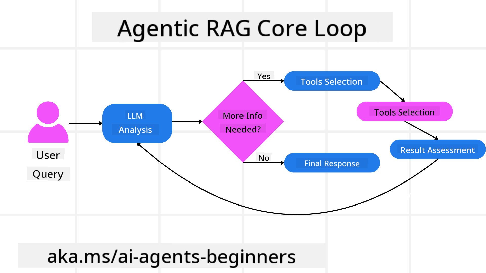
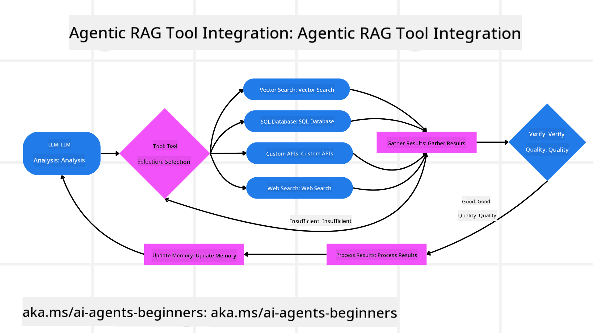
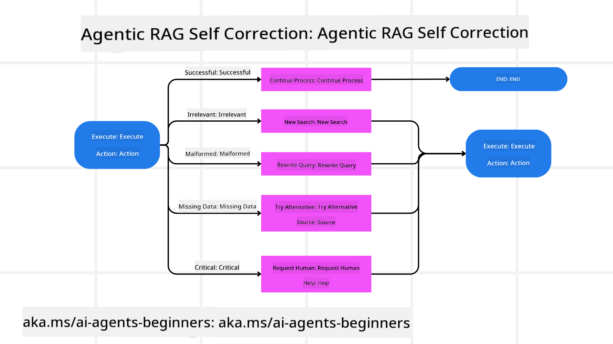
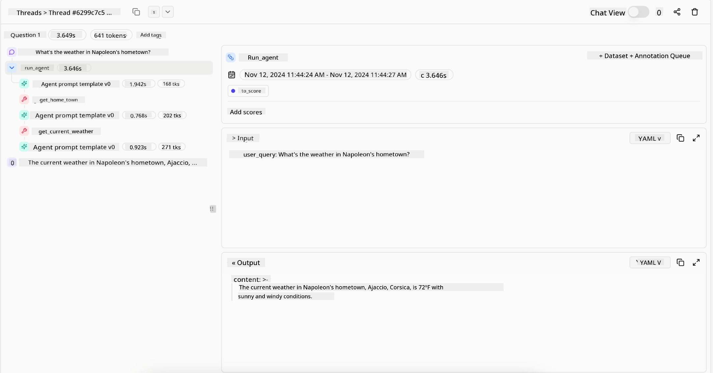
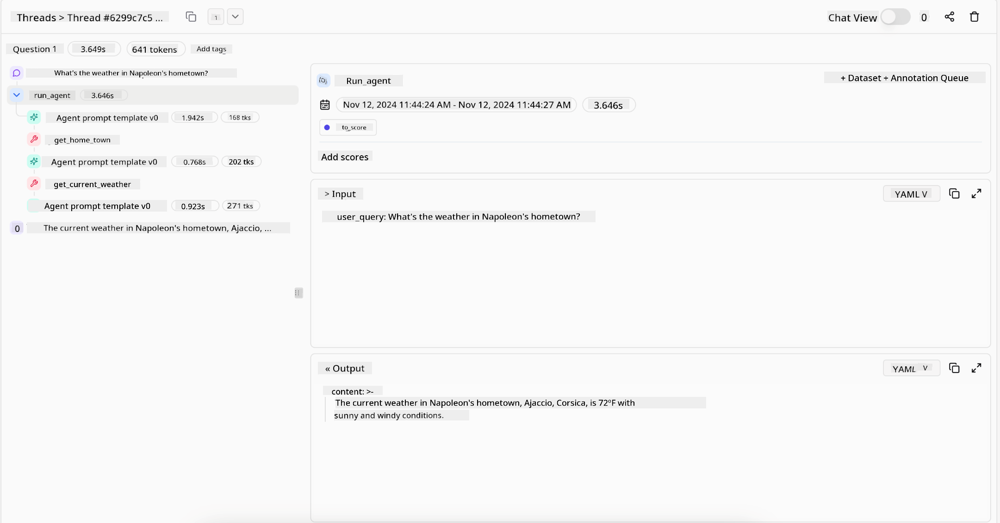

<!--
CO_OP_TRANSLATOR_METADATA:
{
  "original_hash": "7622aa72f9e676e593339f5f694ecd7d",
  "translation_date": "2025-07-12T09:48:29+00:00",
  "source_file": "05-agentic-rag/README.md",
  "language_code": "en"
}
-->

> _(Click the image above to watch the video for this lesson)_

# Agentic RAG

This lesson offers a detailed overview of Agentic Retrieval-Augmented Generation (Agentic RAG), a new AI approach where large language models (LLMs) independently plan their next steps while retrieving information from external sources. Unlike fixed retrieval-then-read methods, Agentic RAG uses iterative calls to the LLM, combined with tool or function calls and structured outputs. The system assesses results, refines queries, calls additional tools if necessary, and repeats this process until it reaches a satisfactory solution.

## Introduction

In this lesson, you will learn to:

- **Understand Agentic RAG:** Discover the emerging AI paradigm where LLMs autonomously plan their next actions while accessing external data sources.
- **Grasp Iterative Maker-Checker Style:** Understand the loop of iterative LLM calls, interspersed with tool or function calls and structured outputs, designed to enhance accuracy and handle malformed queries.
- **Explore Practical Applications:** Recognize scenarios where Agentic RAG excels, such as environments prioritizing correctness, complex database interactions, and extended workflows.

## Learning Goals

By the end of this lesson, you will be able to:

- **Understand Agentic RAG:** Learn about the new AI paradigm where LLMs autonomously plan their next steps while retrieving information from external data sources.
- **Iterative Maker-Checker Style:** Understand the concept of iterative LLM calls combined with tool or function calls and structured outputs to improve accuracy and manage malformed queries.
- **Own the Reasoning Process:** Comprehend how the system takes full control of its reasoning, deciding how to tackle problems without relying on predefined paths.
- **Workflow:** Understand how an agentic model independently decides to retrieve market trend reports, identify competitor data, correlate internal sales metrics, synthesize findings, and evaluate the strategy.
- **Iterative Loops, Tool Integration, and Memory:** Learn how the system uses a looped interaction pattern, maintaining state and memory across steps to avoid repetitive cycles and make informed decisions.
- **Handle Failure Modes and Self-Correction:** Explore the system’s robust self-correction features, including iterating and re-querying, using diagnostic tools, and falling back on human oversight.
- **Boundaries of Agency:** Understand the limits of Agentic RAG, focusing on domain-specific autonomy, infrastructure dependence, and adherence to guardrails.
- **Practical Use Cases and Value:** Identify scenarios where Agentic RAG excels, such as correctness-first environments, complex database interactions, and extended workflows.
- **Governance, Transparency, and Trust:** Learn about the importance of governance and transparency, including explainable reasoning, bias control, and human oversight.

## What is Agentic RAG?

Agentic Retrieval-Augmented Generation (Agentic RAG) is a new AI approach where LLMs autonomously plan their next steps while retrieving information from external sources. Unlike static retrieval-then-read methods, Agentic RAG involves iterative LLM calls combined with tool or function calls and structured outputs. The system evaluates results, refines queries, uses additional tools if needed, and repeats this cycle until it finds a satisfactory solution. This iterative “maker-checker” approach improves accuracy, handles malformed queries, and ensures high-quality results.

The system actively controls its reasoning process, rewriting failed queries, selecting different retrieval methods, and integrating multiple tools—such as vector search in Azure AI Search, SQL databases, or custom APIs—before finalizing its answer. What sets an agentic system apart is its ability to own its reasoning. Traditional RAG implementations follow predefined paths, but an agentic system independently determines the sequence of steps based on the quality of the information it finds.

## Defining Agentic Retrieval-Augmented Generation (Agentic RAG)

Agentic Retrieval-Augmented Generation (Agentic RAG) is an emerging AI development paradigm where LLMs not only retrieve information from external data sources but also autonomously plan their next steps. Unlike static retrieval-then-read methods or carefully scripted prompt sequences, Agentic RAG uses a loop of iterative LLM calls combined with tool or function calls and structured outputs. At each step, the system evaluates the results, decides whether to refine queries, invokes additional tools if needed, and continues this cycle until it reaches a satisfactory solution.

This iterative “maker-checker” approach is designed to improve accuracy, handle malformed queries to structured databases (e.g., NL2SQL), and ensure balanced, high-quality results. Instead of relying solely on carefully engineered prompt chains, the system actively controls its reasoning. It can rewrite failed queries, choose different retrieval methods, and integrate multiple tools—such as vector search in Azure AI Search, SQL databases, or custom APIs—before finalizing its answer. This eliminates the need for complex orchestration frameworks. Instead, a simple loop of “LLM call → tool use → LLM call → …” can produce sophisticated and well-grounded outputs.

## Owning the Reasoning Process

What makes a system “agentic” is its ability to take full control of its reasoning. Traditional RAG systems often depend on humans predefining a path for the model: a chain-of-thought that specifies what to retrieve and when. But a truly agentic system decides internally how to approach the problem. It doesn’t just follow a script; it autonomously determines the sequence of steps based on the quality of the information it finds.

For example, if asked to create a product launch strategy, it doesn’t rely solely on a prompt that outlines the entire research and decision-making workflow. Instead, the agentic model independently decides to:

1. Retrieve current market trend reports using Bing Web Grounding  
2. Identify relevant competitor data using Azure AI Search  
3. Correlate historical internal sales metrics using Azure SQL Database  
4. Synthesize the findings into a cohesive strategy orchestrated via Azure OpenAI Service  
5. Evaluate the strategy for gaps or inconsistencies, prompting another round of retrieval if needed  

All these steps—refining queries, choosing sources, iterating until satisfied with the answer—are decided by the model, not pre-scripted by a human.

## Iterative Loops, Tool Integration, and Memory

An agentic system relies on a looped interaction pattern:

- **Initial Call:** The user’s goal (i.e., user prompt) is sent to the LLM.  
- **Tool Invocation:** If the model detects missing information or unclear instructions, it selects a tool or retrieval method—such as a vector database query (e.g., Azure AI Search Hybrid search over private data) or a structured SQL call—to gather more context.  
- **Assessment & Refinement:** After reviewing the returned data, the model decides if the information is sufficient. If not, it refines the query, tries a different tool, or adjusts its approach.  
- **Repeat Until Satisfied:** This cycle continues until the model determines it has enough clarity and evidence to provide a final, well-reasoned response.  
- **Memory & State:** Because the system maintains state and memory across steps, it can recall previous attempts and their outcomes, avoiding repetitive loops and making more informed decisions as it progresses.  

Over time, this creates a sense of evolving understanding, enabling the model to handle complex, multi-step tasks without constant human intervention or prompt reshaping.

## Handling Failure Modes and Self-Correction

Agentic RAG’s autonomy includes strong self-correction mechanisms. When the system encounters dead ends—such as retrieving irrelevant documents or malformed queries—it can:

- **Iterate and Re-Query:** Instead of returning low-value responses, the model tries new search strategies, rewrites database queries, or explores alternative data sets.  
- **Use Diagnostic Tools:** The system may call additional functions designed to help debug its reasoning steps or verify the accuracy of retrieved data. Tools like Azure AI Tracing are important for robust observability and monitoring.  
- **Fallback on Human Oversight:** For high-stakes or repeatedly failing cases, the model might flag uncertainty and request human guidance. Once the human provides corrective feedback, the model can incorporate that learning going forward.  

This iterative and dynamic approach allows the model to continuously improve, ensuring it’s not just a one-shot system but one that learns from its mistakes during a session.

## Boundaries of Agency

Despite its autonomy within a task, Agentic RAG is not equivalent to Artificial General Intelligence. Its “agentic” abilities are limited to the tools, data sources, and policies provided by human developers. It cannot create its own tools or operate outside the domain boundaries set for it. Instead, it excels at dynamically orchestrating the resources available.

Key differences from more advanced AI forms include:

1. **Domain-Specific Autonomy:** Agentic RAG systems focus on achieving user-defined goals within a known domain, using strategies like query rewriting or tool selection to improve results.  
2. **Infrastructure-Dependent:** The system’s capabilities depend on the tools and data integrated by developers. It cannot exceed these limits without human intervention.  
3. **Respect for Guardrails:** Ethical guidelines, compliance rules, and business policies remain critical. The agent’s freedom is always constrained by safety measures and oversight mechanisms (hopefully).  

## Practical Use Cases and Value

Agentic RAG excels in scenarios that require iterative refinement and precision:

1. **Correctness-First Environments:** In compliance checks, regulatory analysis, or legal research, the agentic model can repeatedly verify facts, consult multiple sources, and rewrite queries until it produces a thoroughly vetted answer.  
2. **Complex Database Interactions:** When working with structured data where queries often fail or need adjustment, the system can autonomously refine its queries using Azure SQL or Microsoft Fabric OneLake, ensuring the final retrieval matches the user’s intent.  
3. **Extended Workflows:** Longer sessions may evolve as new information emerges. Agentic RAG can continuously incorporate new data, adapting strategies as it learns more about the problem.  

## Governance, Transparency, and Trust

As these systems become more autonomous in their reasoning, governance and transparency are essential:

- **Explainable Reasoning:** The model can provide an audit trail of the queries it made, the sources it consulted, and the reasoning steps it took to reach its conclusion. Tools like Azure AI Content Safety and Azure AI Tracing / GenAIOps help maintain transparency and reduce risks.  
- **Bias Control and Balanced Retrieval:** Developers can tune retrieval strategies to ensure balanced, representative data sources are considered, and regularly audit outputs to detect bias or skewed patterns using custom models for advanced data science teams with Azure Machine Learning.  
- **Human Oversight and Compliance:** For sensitive tasks, human review remains crucial. Agentic RAG doesn’t replace human judgment in high-stakes decisions—it enhances it by providing more thoroughly vetted options.  

Having tools that provide a clear record of actions is vital. Without them, debugging a multi-step process can be very challenging. Below is an example from Literal AI (the company behind Chainlit) showing an Agent run:

## Conclusion

Agentic RAG represents a natural evolution in how AI systems manage complex, data-heavy tasks. By adopting a looped interaction pattern, autonomously selecting tools, and refining queries until achieving a high-quality result, the system moves beyond static prompt-following into a more adaptive, context-aware decision-maker. While still limited by human-defined infrastructure and ethical guidelines, these agentic capabilities enable richer, more dynamic, and ultimately more useful AI interactions for both enterprises and end users.

## Additional Resources

- <a href="https://learn.microsoft.com/training/modules/use-own-data-azure-openai" target="_blank">Implement Retrieval Augmented Generation (RAG) with Azure OpenAI Service: Learn how to use your own data with the Azure OpenAI Service. This Microsoft Learn module provides a comprehensive guide on implementing RAG
</a>
- <a href="https://learn.microsoft.com/azure/ai-studio/concepts/evaluation-approach-gen-ai" target="_blank">Evaluation of generative AI applications with Azure AI Foundry: This article discusses the evaluation and comparison of models using publicly available datasets, including Agentic AI applications and RAG architectures</a>
- <a href="https://weaviate.io/blog/what-is-agentic-rag" target="_blank">What is Agentic RAG | Weaviate</a>
- <a href="https://ragaboutit.com/agentic-rag-a-complete-guide-to-agent-based-retrieval-augmented-generation/" target="_blank">Agentic RAG: A Complete Guide to Agent-Based Retrieval Augmented Generation – News from generation RAG</a>
- <a href="https://huggingface.co/learn/cookbook/agent_rag" target="_blank">Agentic RAG: turbocharge your RAG with query reformulation and self-query! Hugging Face Open-Source AI Cookbook</a>
- <a href="https://youtu.be/aQ4yQXeB1Ss?si=2HUqBzHoeB5tR04U" target="_blank">Adding Agentic Layers to RAG</a>
- <a href="https://www.youtube.com/watch?v=zeAyuLc_f3Q&t=244s" target="_blank">The Future of Knowledge Assistants: Jerry Liu</a>
- <a href="https://www.youtube.com/watch?v=AOSjiXP1jmQ" target="_blank">How to Build Agentic RAG Systems</a>
- <a href="https://ignite.microsoft.com/sessions/BRK102?source=sessions" target="_blank">Using Azure AI Foundry Agent Service to scale your AI agents</a>

### Academic Papers

- <a href="https://arxiv.org/abs/2303.17651" target="_blank">2303.17651 Self-Refine: Iterative Refinement with Self-Feedback</a>
- <a href="https://arxiv.org/abs/2303.11366" target="_blank">2303.11366 Reflexion: Language Agents with Verbal Reinforcement Learning</a>
- <a href="https://arxiv.org/abs/2305.11738" target="_blank">2305.11738 CRITIC: Large Language Models Can Self-Correct with Tool-Interactive Critiquing</a>
- <a href="https://arxiv.org/abs/2501.09136" target="_blank">2501.09136 Agentic Retrieval-Augmented Generation: A Survey on Agentic RAG</a>

## Previous Lesson

[Tool Use Design Pattern](../04-tool-use/README.md)

## Next Lesson

[Building Trustworthy AI Agents](../06-building-trustworthy-agents/README.md)

**Disclaimer**:  
This document has been translated using the AI translation service [Co-op Translator](https://github.com/Azure/co-op-translator). While we strive for accuracy, please be aware that automated translations may contain errors or inaccuracies. The original document in its native language should be considered the authoritative source. For critical information, professional human translation is recommended. We are not liable for any misunderstandings or misinterpretations arising from the use of this translation.