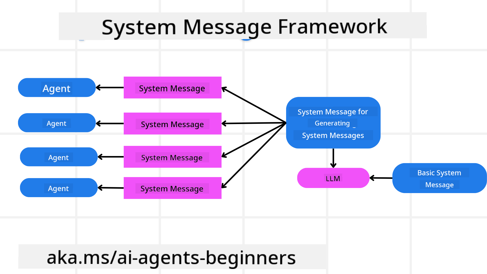
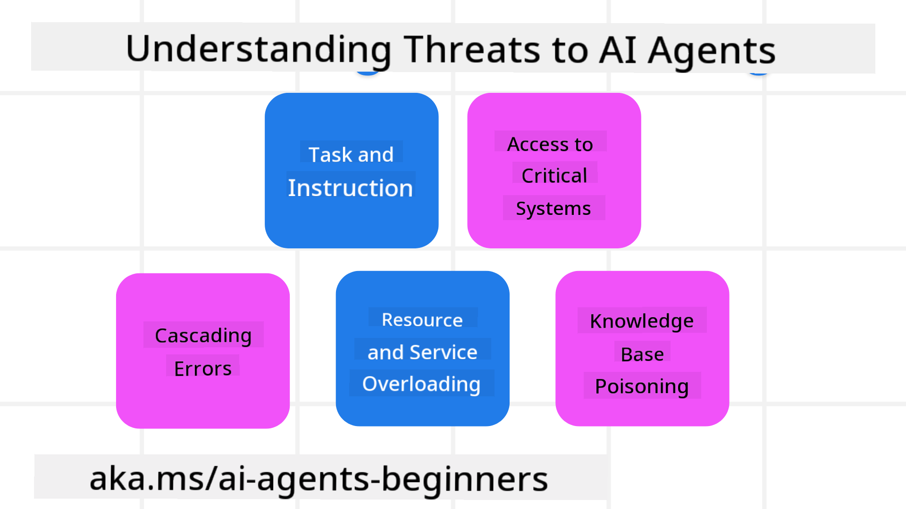
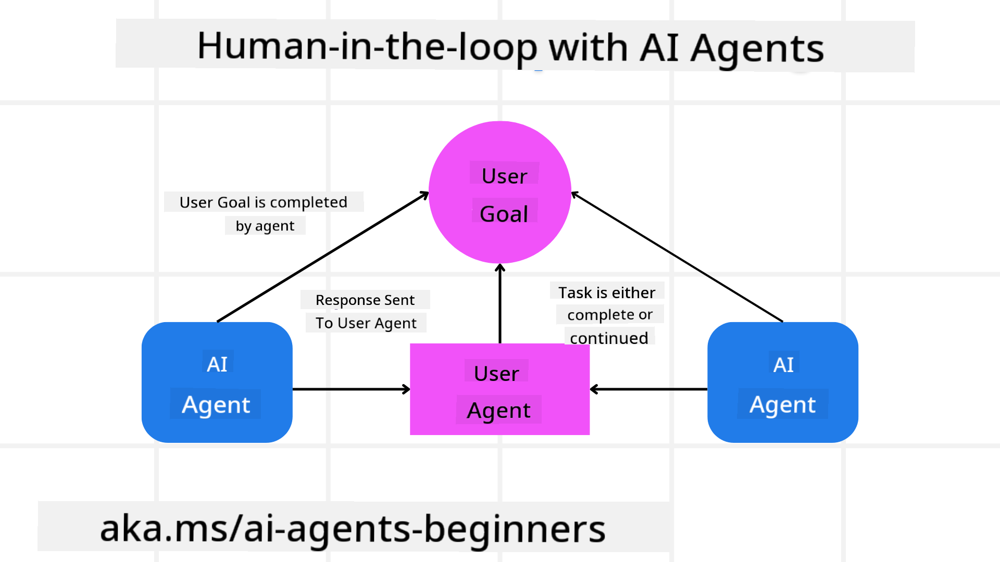

<!--
CO_OP_TRANSLATOR_METADATA:
{
  "original_hash": "f57852cac3a86c4a5ef47f793cc12178",
  "translation_date": "2025-07-12T10:20:41+00:00",
  "source_file": "06-building-trustworthy-agents/README.md",
  "language_code": "en"
}
-->
[](https://youtu.be/iZKkMEGBCUQ?si=Q-kEbcyHUMPoHp8L)

> _(Click the image above to watch the video for this lesson)_

# Building Trustworthy AI Agents

## Introduction

This lesson will cover:

- How to build and deploy safe and effective AI Agents  
- Key security considerations when developing AI Agents  
- How to protect data and user privacy when developing AI Agents  

## Learning Goals

By the end of this lesson, you will be able to:

- Identify and reduce risks when creating AI Agents  
- Implement security measures to properly manage data and access  
- Develop AI Agents that safeguard data privacy while delivering a quality user experience  

## Safety

Let’s start by focusing on building safe agentic applications. Safety means the AI agent behaves as intended. As developers of agentic applications, we have tools and methods to maximize safety:

### Building a System Message Framework

If you’ve ever built an AI application using Large Language Models (LLMs), you know how important it is to design a strong system prompt or system message. These prompts set the meta rules, instructions, and guidelines for how the LLM interacts with users and data.

For AI Agents, the system prompt is even more critical because the agents need very specific instructions to complete the tasks we assign them.

To create scalable system prompts, we can use a system message framework to build one or more agents in our application:



#### Step 1: Create a Meta System Message

The meta prompt is used by an LLM to generate system prompts for the agents we create. We design it as a template so we can efficiently create multiple agents if needed.

Here’s an example of a meta system message we would provide to the LLM:

```plaintext
You are an expert at creating AI agent assistants. 
You will be provided a company name, role, responsibilities and other
information that you will use to provide a system prompt for.
To create the system prompt, be descriptive as possible and provide a structure that a system using an LLM can better understand the role and responsibilities of the AI assistant. 
```

#### Step 2: Create a Basic Prompt

Next, create a basic prompt that describes the AI Agent. Include the agent’s role, the tasks it will perform, and any other responsibilities.

Here’s an example:

```plaintext
You are a travel agent for Contoso Travel that is great at booking flights for customers. To help customers you can perform the following tasks: lookup available flights, book flights, ask for preferences in seating and times for flights, cancel any previously booked flights and alert customers on any delays or cancellations of flights.  
```

#### Step 3: Provide Basic System Message to LLM

Now we can optimize this system message by supplying the meta system message as the system message along with our basic system message.

This will generate a system message better suited to guide our AI agents:

```markdown
**Company Name:** Contoso Travel  
**Role:** Travel Agent Assistant

**Objective:**  
You are an AI-powered travel agent assistant for Contoso Travel, specializing in booking flights and providing exceptional customer service. Your main goal is to assist customers in finding, booking, and managing their flights, all while ensuring that their preferences and needs are met efficiently.

**Key Responsibilities:**

1. **Flight Lookup:**
    
    - Assist customers in searching for available flights based on their specified destination, dates, and any other relevant preferences.
    - Provide a list of options, including flight times, airlines, layovers, and pricing.
2. **Flight Booking:**
    
    - Facilitate the booking of flights for customers, ensuring that all details are correctly entered into the system.
    - Confirm bookings and provide customers with their itinerary, including confirmation numbers and any other pertinent information.
3. **Customer Preference Inquiry:**
    
    - Actively ask customers for their preferences regarding seating (e.g., aisle, window, extra legroom) and preferred times for flights (e.g., morning, afternoon, evening).
    - Record these preferences for future reference and tailor suggestions accordingly.
4. **Flight Cancellation:**
    
    - Assist customers in canceling previously booked flights if needed, following company policies and procedures.
    - Notify customers of any necessary refunds or additional steps that may be required for cancellations.
5. **Flight Monitoring:**
    
    - Monitor the status of booked flights and alert customers in real-time about any delays, cancellations, or changes to their flight schedule.
    - Provide updates through preferred communication channels (e.g., email, SMS) as needed.

**Tone and Style:**

- Maintain a friendly, professional, and approachable demeanor in all interactions with customers.
- Ensure that all communication is clear, informative, and tailored to the customer's specific needs and inquiries.

**User Interaction Instructions:**

- Respond to customer queries promptly and accurately.
- Use a conversational style while ensuring professionalism.
- Prioritize customer satisfaction by being attentive, empathetic, and proactive in all assistance provided.

**Additional Notes:**

- Stay updated on any changes to airline policies, travel restrictions, and other relevant information that could impact flight bookings and customer experience.
- Use clear and concise language to explain options and processes, avoiding jargon where possible for better customer understanding.

This AI assistant is designed to streamline the flight booking process for customers of Contoso Travel, ensuring that all their travel needs are met efficiently and effectively.

```

#### Step 4: Iterate and Improve

The strength of this system message framework is that it makes scaling system message creation for multiple agents easier and allows you to improve your system messages over time. It’s rare to get a perfect system message on the first try for your full use case. Being able to make small adjustments to the basic system message and running it through the system lets you compare and evaluate results.

## Understanding Threats

To build trustworthy AI agents, it’s important to understand and mitigate the risks and threats they face. Let’s review some common threats to AI agents and how you can better prepare for them.



### Task and Instruction

**Description:** Attackers try to alter the AI agent’s instructions or goals by manipulating prompts or inputs.

**Mitigation:** Use validation checks and input filters to detect potentially harmful prompts before the AI Agent processes them. Since these attacks often require repeated interaction, limiting the number of conversation turns is another way to prevent them.

### Access to Critical Systems

**Description:** If an AI agent can access systems or services that hold sensitive data, attackers might compromise communication between the agent and those services. This can be a direct attack or an attempt to gather information about these systems through the agent.

**Mitigation:** Restrict AI agent access to systems strictly on a need-to-know basis. Ensure communication between the agent and systems is secure. Implement authentication and access controls to protect this information.

### Resource and Service Overloading

**Description:** AI agents can use various tools and services to complete tasks. Attackers might exploit this by flooding these services with requests via the AI Agent, potentially causing system failures or high costs.

**Mitigation:** Set policies to limit how many requests an AI agent can send to a service. Limiting conversation turns and requests to your AI agent also helps prevent these attacks.

### Knowledge Base Poisoning

**Description:** This attack targets the knowledge base or other services the AI agent relies on, rather than the agent itself. It involves corrupting the data the AI agent uses, which can lead to biased or unintended responses.

**Mitigation:** Regularly verify the data used by the AI agent in its workflows. Ensure access to this data is secure and only authorized individuals can modify it to prevent this type of attack.

### Cascading Errors

**Description:** AI agents interact with multiple tools and services. Errors caused by attackers can trigger failures in connected systems, making the attack more widespread and harder to diagnose.

**Mitigation:** One way to prevent this is to run the AI Agent in a restricted environment, like a Docker container, to limit direct system attacks. Implement fallback mechanisms and retry logic when systems return errors to avoid larger failures.

## Human-in-the-Loop

Another effective approach to building trustworthy AI Agent systems is incorporating a Human-in-the-loop. This setup allows users to provide feedback to the agents during operation. Users act as agents within a multi-agent system by approving or stopping the running process.



Here’s a code snippet using AutoGen to demonstrate how this concept is implemented:

```python

# Create the agents.
model_client = OpenAIChatCompletionClient(model="gpt-4o-mini")
assistant = AssistantAgent("assistant", model_client=model_client)
user_proxy = UserProxyAgent("user_proxy", input_func=input)  # Use input() to get user input from console.

# Create the termination condition which will end the conversation when the user says "APPROVE".
termination = TextMentionTermination("APPROVE")

# Create the team.
team = RoundRobinGroupChat([assistant, user_proxy], termination_condition=termination)

# Run the conversation and stream to the console.
stream = team.run_stream(task="Write a 4-line poem about the ocean.")
# Use asyncio.run(...) when running in a script.
await Console(stream)

```

## Conclusion

Building trustworthy AI agents requires thoughtful design, strong security measures, and ongoing refinement. By using structured meta prompting systems, understanding potential threats, and applying mitigation strategies, developers can create AI agents that are both safe and effective. Adding a human-in-the-loop approach helps ensure AI agents stay aligned with user needs while minimizing risks. As AI evolves, maintaining a proactive focus on security, privacy, and ethics will be essential to building trust and reliability in AI-driven systems.

## Additional Resources

- <a href="https://learn.microsoft.com/azure/ai-studio/responsible-use-of-ai-overview" target="_blank">Responsible AI overview</a>  
- <a href="https://learn.microsoft.com/azure/ai-studio/concepts/evaluation-approach-gen-ai" target="_blank">Evaluation of generative AI models and AI applications</a>  
- <a href="https://learn.microsoft.com/azure/ai-services/openai/concepts/system-message?context=%2Fazure%2Fai-studio%2Fcontext%2Fcontext&tabs=top-techniques" target="_blank">Safety system messages</a>  
- <a href="https://blogs.microsoft.com/wp-content/uploads/prod/sites/5/2022/06/Microsoft-RAI-Impact-Assessment-Template.pdf?culture=en-us&country=us" target="_blank">Risk Assessment Template</a>  

## Previous Lesson

[Agentic RAG](../05-agentic-rag/README.md)

## Next Lesson

[Planning Design Pattern](../07-planning-design/README.md)

**Disclaimer**:  
This document has been translated using the AI translation service [Co-op Translator](https://github.com/Azure/co-op-translator). While we strive for accuracy, please be aware that automated translations may contain errors or inaccuracies. The original document in its native language should be considered the authoritative source. For critical information, professional human translation is recommended. We are not liable for any misunderstandings or misinterpretations arising from the use of this translation.