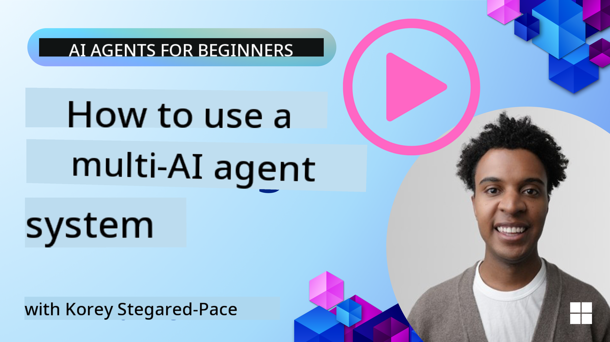
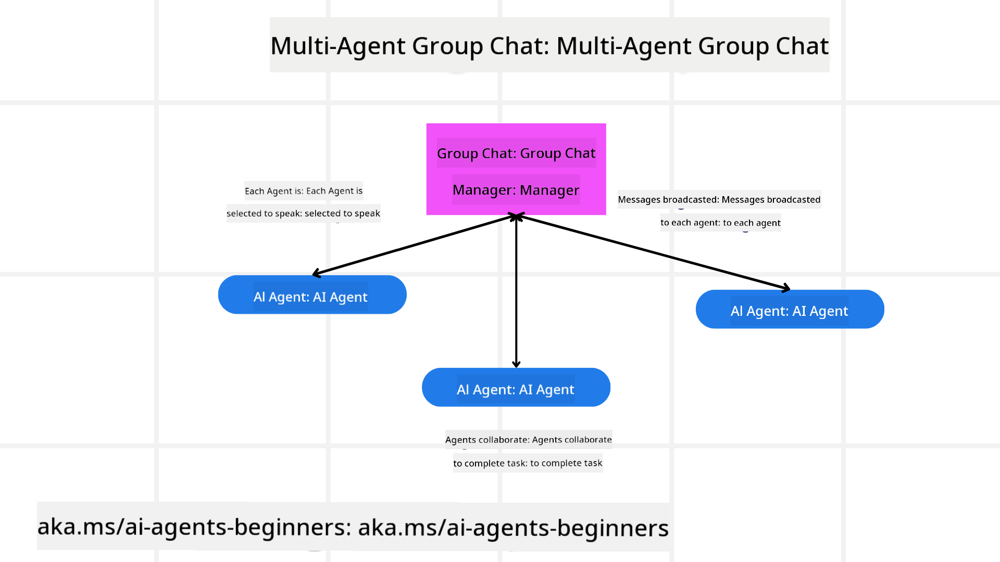
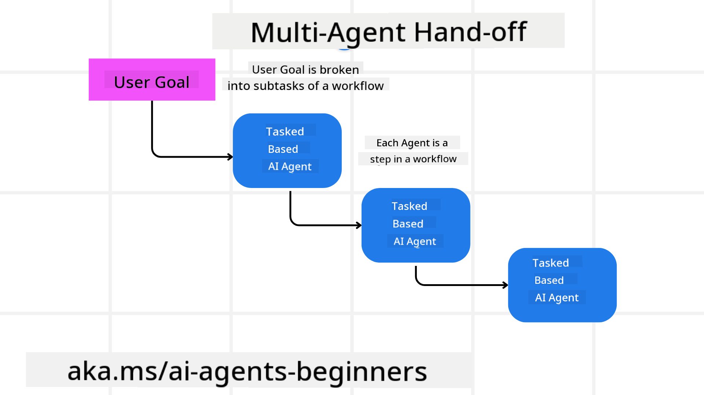
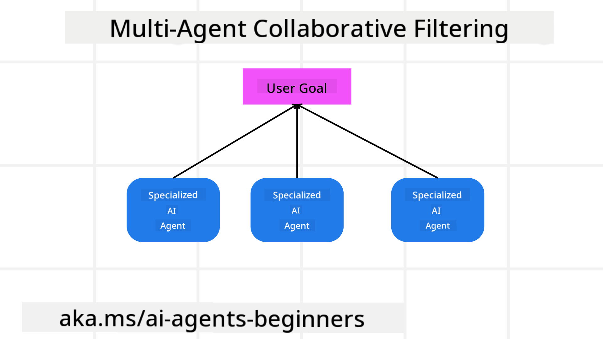

<!--
CO_OP_TRANSLATOR_METADATA:
{
  "original_hash": "c692a8975d7d5b99575a553de1c5e8a7",
  "translation_date": "2025-07-12T10:48:57+00:00",
  "source_file": "08-multi-agent/README.md",
  "language_code": "en"
}
-->

> _(Click the image above to watch the video for this lesson)_

# Multi-agent design patterns

Once you start working on a project involving multiple agents, you’ll need to consider the multi-agent design pattern. However, it might not be immediately obvious when to switch to multiple agents or what benefits this brings.

## Introduction

In this lesson, we aim to answer the following questions:

- In which scenarios are multi-agents applicable?
- What are the advantages of using multiple agents instead of a single agent handling multiple tasks?
- What are the key components for implementing the multi-agent design pattern?
- How can we monitor how multiple agents interact with each other?

## Learning Goals

By the end of this lesson, you should be able to:

- Identify scenarios where multi-agents are suitable
- Understand the benefits of using multiple agents over a single agent
- Grasp the fundamental components of implementing the multi-agent design pattern

What’s the bigger picture?

*Multi-agents are a design pattern that enables multiple agents to collaborate to achieve a shared goal.*

This pattern is widely applied across fields such as robotics, autonomous systems, and distributed computing.

## Scenarios Where Multi-Agents Are Applicable

So, when is it a good idea to use multiple agents? There are many cases where multiple agents are beneficial, especially in the following situations:

- **Large workloads**: Large tasks can be split into smaller parts and assigned to different agents, enabling parallel processing and faster completion. For example, processing large datasets.
- **Complex tasks**: Like large workloads, complex tasks can be broken down into subtasks handled by agents specializing in different aspects. For instance, autonomous vehicles where separate agents manage navigation, obstacle detection, and communication with other vehicles.
- **Diverse expertise**: Different agents can bring varied expertise, allowing them to handle different parts of a task more effectively than a single agent. A good example is healthcare, where agents manage diagnostics, treatment plans, and patient monitoring.

## Advantages of Using Multi-Agents Over a Singular Agent

A single agent system might work well for simple tasks, but for more complex ones, multiple agents offer several advantages:

- **Specialization**: Each agent can focus on a specific task. Without specialization, a single agent might get overwhelmed or confused when facing complex tasks, possibly performing tasks it’s not best suited for.
- **Scalability**: It’s easier to scale by adding more agents rather than overloading one.
- **Fault Tolerance**: If one agent fails, others can keep working, ensuring system reliability.

For example, consider booking a trip for a user. A single agent would have to handle everything from finding flights to booking hotels and rental cars. This would require the agent to have tools for all these tasks, resulting in a complex, monolithic system that’s hard to maintain and scale. A multi-agent system, however, could have separate agents specialized in finding flights, booking hotels, and rental cars, making the system more modular, maintainable, and scalable.

Think of it like a travel agency run as a small family business versus a franchise. The family business has one agent handling all aspects, while the franchise has different agents handling different parts of the booking process.

## Building Blocks of Implementing the Multi-Agent Design Pattern

Before implementing the multi-agent design pattern, you need to understand its key components.

Let’s revisit the trip booking example. The building blocks include:

- **Agent Communication**: Agents for flights, hotels, and rental cars need to communicate and share information about the user’s preferences and constraints. For example, the flight agent must communicate with the hotel agent to ensure the hotel booking matches the flight dates. This means deciding *which agents share information and how*.
- **Coordination Mechanisms**: Agents must coordinate their actions to meet user preferences and constraints. For example, if the user prefers a hotel near the airport but rental cars are only available at the airport, the hotel and rental car agents need to coordinate. This means deciding *how agents coordinate their actions*.
- **Agent Architecture**: Agents need internal structures to make decisions and learn from interactions with the user. For example, the flight agent needs to decide which flights to recommend, possibly using machine learning models based on past user preferences. This means deciding *how agents make decisions and learn*.
- **Visibility into Multi-Agent Interactions**: You need tools and techniques to monitor how agents interact, such as logging, visualization, and performance metrics.
- **Multi-Agent Patterns**: There are different architectural patterns for multi-agent systems—centralized, decentralized, and hybrid. You need to choose the one that fits your use case best.
- **Human in the loop**: Often, a human will be involved, and agents need to know when to request human intervention. For example, a user might ask for a specific hotel or flight not recommended by the agents or request confirmation before booking.

## Visibility into Multi-Agent Interactions

Having insight into how agents interact is crucial for debugging, optimizing, and ensuring the system works well. To achieve this, you need tools for tracking agent activities and interactions, such as logging, monitoring, visualization, and performance metrics.

For example, in the trip booking scenario, you could have a dashboard showing each agent’s status, the user’s preferences and constraints, and how agents interact. The dashboard might display travel dates, flights recommended by the flight agent, hotels recommended by the hotel agent, and rental cars recommended by the rental car agent. This provides a clear view of agent interactions and whether user preferences are being met.

Let’s look at these aspects in more detail:

- **Logging and Monitoring Tools**: Log every action an agent takes, including which agent acted, what action was taken, when, and the outcome. This data helps with debugging and optimization.
- **Visualization Tools**: Visual tools can show agent interactions intuitively, such as graphs illustrating information flow between agents. This helps identify bottlenecks and inefficiencies.
- **Performance Metrics**: Track metrics like task completion time, number of tasks completed per time unit, and accuracy of agent recommendations. This helps identify areas for improvement.

## Multi-Agent Patterns

Let’s explore some concrete patterns for building multi-agent applications. Here are some useful ones:

### Group chat

This pattern is useful for creating group chat applications where multiple agents communicate. Common use cases include team collaboration, customer support, and social networking.

Each agent represents a user in the chat, exchanging messages using a messaging protocol. Agents can send, receive, and respond to messages.

This can be implemented with a centralized architecture (all messages routed through a central server) or decentralized (messages exchanged directly).

### Hand-off

This pattern is useful when multiple agents need to hand off tasks to each other.

Typical use cases include customer support, task management, and workflow automation.

Each agent represents a task or workflow step, handing off tasks to others based on predefined rules.

### Collaborative filtering

This pattern is useful when multiple agents collaborate to make recommendations.

Multiple agents collaborate because each has different expertise, contributing uniquely to recommendations.

For example, a user wants a stock market recommendation:

- **Industry expert**: One agent specializes in a specific industry.
- **Technical analysis**: Another agent specializes in technical analysis.
- **Fundamental analysis**: Another agent specializes in fundamental analysis.

Together, they provide a more comprehensive recommendation.

## Scenario: Refund process

Consider a customer trying to get a refund. Many agents could be involved, divided into those specific to the refund process and general agents used elsewhere.

**Agents specific to the refund process**:

- **Customer agent**: Represents the customer and initiates the refund.
- **Seller agent**: Represents the seller and processes the refund.
- **Payment agent**: Handles refunding the customer’s payment.
- **Resolution agent**: Resolves issues during the refund process.
- **Compliance agent**: Ensures the refund complies with regulations and policies.

**General agents**:

These agents can be used in other parts of your business.

- **Shipping agent**: Manages shipping the product back to the seller; used in refunds and general shipping.
- **Feedback agent**: Collects customer feedback at any time, not just during refunds.
- **Escalation agent**: Escalates issues to higher support levels; useful in any process needing escalation.
- **Notification agent**: Sends notifications to the customer during the refund process.
- **Analytics agent**: Analyzes data related to refunds.
- **Audit agent**: Audits the refund process to ensure correctness.
- **Reporting agent**: Generates reports on the refund process.
- **Knowledge agent**: Maintains a knowledge base related to refunds and other business areas.
- **Security agent**: Ensures the security of the refund process.
- **Quality agent**: Ensures the quality of the refund process.

There are quite a few agents listed, both specific to refunds and general ones usable elsewhere. This should give you an idea of how to decide which agents to include in your multi-agent system.

## Assignment
## Previous Lesson

[Planning Design](../07-planning-design/README.md)

## Next Lesson

[Metacognition in AI Agents](../09-metacognition/README.md)

**Disclaimer**:  
This document has been translated using the AI translation service [Co-op Translator](https://github.com/Azure/co-op-translator). While we strive for accuracy, please be aware that automated translations may contain errors or inaccuracies. The original document in its native language should be considered the authoritative source. For critical information, professional human translation is recommended. We are not liable for any misunderstandings or misinterpretations arising from the use of this translation.