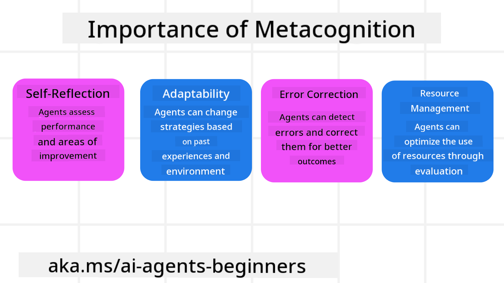
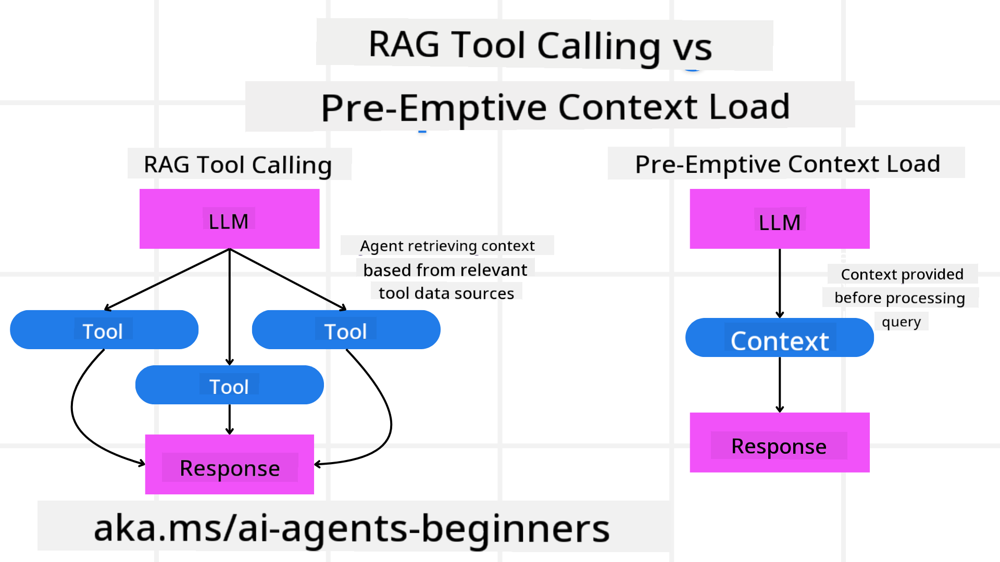

<!--
CO_OP_TRANSLATOR_METADATA:
{
  "original_hash": "8cbf460468c802c7994aa62e0e0779c9",
  "translation_date": "2025-07-12T11:42:15+00:00",
  "source_file": "09-metacognition/README.md",
  "language_code": "en"
}
-->
[](https://youtu.be/His9R6gw6Ec?si=3_RMb8VprNvdLRhX)

> _(Click the image above to watch the video for this lesson)_
# Metacognition in AI Agents

## Introduction

Welcome to the lesson on metacognition in AI agents! This chapter is aimed at beginners interested in how AI agents can reflect on their own thinking processes. By the end of this lesson, you'll grasp key concepts and have practical examples to apply metacognition in designing AI agents.

## Learning Goals

After completing this lesson, you will be able to:

1. Understand the impact of reasoning loops in agent definitions.
2. Use planning and evaluation techniques to support self-correcting agents.
3. Build your own agents capable of manipulating code to complete tasks.

## Introduction to Metacognition

Metacognition refers to higher-level cognitive processes that involve thinking about one’s own thinking. For AI agents, this means being able to assess and adjust their actions based on self-awareness and past experiences. Metacognition, or "thinking about thinking," is a key concept in developing agentic AI systems. It involves AI systems being aware of their internal processes and able to monitor, regulate, and adapt their behavior accordingly—much like how we read a room or analyze a problem. This self-awareness helps AI systems make better decisions, spot errors, and improve performance over time—linking back to the Turing test and debates about AI’s future role.

In agentic AI systems, metacognition can help tackle challenges such as:
- Transparency: Making sure AI systems can explain their reasoning and decisions.
- Reasoning: Enhancing AI’s ability to synthesize information and make sound judgments.
- Adaptation: Enabling AI to adjust to new environments and changing conditions.
- Perception: Improving AI’s accuracy in recognizing and interpreting environmental data.

### What is Metacognition?

Metacognition, or "thinking about thinking," is a higher-level cognitive process involving self-awareness and self-regulation of one’s cognitive functions. In AI, metacognition enables agents to evaluate and adapt their strategies and actions, leading to better problem-solving and decision-making. Understanding metacognition allows you to design AI agents that are not only smarter but also more flexible and efficient. True metacognition means the AI explicitly reasons about its own reasoning.

Example: “I prioritized cheaper flights because… but I might be missing direct flights, so let me double-check.”
Tracking how or why it chose a particular route.
- Noticing it made mistakes by relying too much on user preferences from last time, so it changes its decision-making strategy, not just the final recommendation.
- Recognizing patterns like, “Whenever the user mentions ‘too crowded,’ I should not only remove certain attractions but also reconsider that my method of selecting ‘top attractions’ is flawed if I always rank by popularity.”

### Importance of Metacognition in AI Agents

Metacognition is vital in AI agent design for several reasons:



- Self-Reflection: Agents can evaluate their own performance and spot areas to improve.
- Adaptability: Agents can adjust their strategies based on past experiences and changing conditions.
- Error Correction: Agents can detect and fix errors on their own, leading to more accurate results.
- Resource Management: Agents can optimize resources like time and computing power by planning and evaluating their actions.

## Components of an AI Agent

Before exploring metacognitive processes, it’s important to understand the basic parts of an AI agent. Typically, an AI agent includes:

- Persona: The agent’s personality and traits that shape how it interacts with users.
- Tools: The functions and capabilities the agent can perform.
- Skills: The knowledge and expertise the agent holds.

These components combine to form an "expertise unit" capable of performing specific tasks.

**Example**:
Think of a travel agent service that not only plans your trip but also adjusts its recommendations based on real-time data and past customer experiences.

### Example: Metacognition in a Travel Agent Service

Imagine designing an AI-powered travel agent service. This agent, "Travel Agent," helps users plan vacations. To include metacognition, Travel Agent needs to evaluate and adjust its actions based on self-awareness and past experiences. Here’s how metacognition could work:

#### Current Task

Help a user plan a trip to Paris.

#### Steps to Complete the Task

1. **Gather User Preferences**: Ask about travel dates, budget, interests (e.g., museums, food, shopping), and any special needs.
2. **Retrieve Information**: Find flights, accommodations, attractions, and restaurants matching the user’s preferences.
3. **Generate Recommendations**: Create a personalized itinerary with flight details, hotel bookings, and suggested activities.
4. **Adjust Based on Feedback**: Get user feedback on recommendations and make necessary changes.

#### Required Resources

- Access to flight and hotel booking databases.
- Information on Paris attractions and restaurants.
- User feedback from previous interactions.

#### Experience and Self-Reflection

Travel Agent uses metacognition to assess its performance and learn from past experiences. For example:

1. **Analyzing User Feedback**: Reviews feedback to see which recommendations worked well and which didn’t, adjusting future suggestions accordingly.
2. **Adaptability**: If a user previously disliked crowded places, Travel Agent avoids suggesting popular spots during peak times.
3. **Error Correction**: If it once recommended a fully booked hotel, it learns to check availability more carefully before suggesting.

#### Practical Developer Example

Here’s a simplified example of how Travel Agent’s code might incorporate metacognition:

```python
class Travel_Agent:
    def __init__(self):
        self.user_preferences = {}
        self.experience_data = []

    def gather_preferences(self, preferences):
        self.user_preferences = preferences

    def retrieve_information(self):
        # Search for flights, hotels, and attractions based on preferences
        flights = search_flights(self.user_preferences)
        hotels = search_hotels(self.user_preferences)
        attractions = search_attractions(self.user_preferences)
        return flights, hotels, attractions

    def generate_recommendations(self):
        flights, hotels, attractions = self.retrieve_information()
        itinerary = create_itinerary(flights, hotels, attractions)
        return itinerary

    def adjust_based_on_feedback(self, feedback):
        self.experience_data.append(feedback)
        # Analyze feedback and adjust future recommendations
        self.user_preferences = adjust_preferences(self.user_preferences, feedback)

# Example usage
travel_agent = Travel_Agent()
preferences = {
    "destination": "Paris",
    "dates": "2025-04-01 to 2025-04-10",
    "budget": "moderate",
    "interests": ["museums", "cuisine"]
}
travel_agent.gather_preferences(preferences)
itinerary = travel_agent.generate_recommendations()
print("Suggested Itinerary:", itinerary)
feedback = {"liked": ["Louvre Museum"], "disliked": ["Eiffel Tower (too crowded)"]}
travel_agent.adjust_based_on_feedback(feedback)
```

#### Why Metacognition Matters

- **Self-Reflection**: Agents analyze their performance and identify improvements.
- **Adaptability**: Agents adjust strategies based on feedback and changing conditions.
- **Error Correction**: Agents detect and fix mistakes autonomously.
- **Resource Management**: Agents optimize use of time and computing power.

By adding metacognition, Travel Agent can offer more personalized and accurate travel advice, improving the user experience.

---

## 2. Planning in Agents

Planning is a key part of AI agent behavior. It involves outlining the steps needed to reach a goal, considering the current situation, resources, and potential obstacles.

### Elements of Planning

- **Current Task**: Clearly define the task.
- **Steps to Complete the Task**: Break the task into manageable steps.
- **Required Resources**: Identify what resources are needed.
- **Experience**: Use past experiences to guide planning.

**Example**:
Here are the steps Travel Agent takes to help a user plan their trip effectively:

### Steps for Travel Agent

1. **Gather User Preferences**
   - Ask for travel dates, budget, interests, and any special requirements.
   - Examples: "When are you planning to travel?" "What is your budget?" "What activities do you enjoy on vacation?"

2. **Retrieve Information**
   - Search for travel options based on user preferences.
   - **Flights**: Find flights within budget and preferred dates.
   - **Accommodations**: Locate hotels or rentals matching location, price, and amenities.
   - **Attractions and Restaurants**: Identify popular spots and dining options aligned with interests.

3. **Generate Recommendations**
   - Compile the information into a personalized itinerary.
   - Include flight options, hotel bookings, and suggested activities tailored to the user.

4. **Present Itinerary to User**
   - Share the proposed itinerary for review.
   - Example: "Here’s a suggested itinerary for your Paris trip, including flights, hotels, and recommended activities and restaurants. What do you think?"

5. **Collect Feedback**
   - Ask for feedback on the itinerary.
   - Examples: "Do you like the flight options?" "Is the hotel suitable?" "Any activities you want to add or remove?"

6. **Adjust Based on Feedback**
   - Modify the itinerary according to user input.
   - Update flight, accommodation, and activity suggestions to better fit preferences.

7. **Final Confirmation**
   - Present the updated itinerary for final approval.
   - Example: "I’ve made the changes you requested. Does this look good?"

8. **Book and Confirm Reservations**
   - After approval, book flights, hotels, and activities.
   - Send confirmation details to the user.

9. **Provide Ongoing Support**
   - Stay available to assist with changes or additional requests before and during the trip.
   - Example: "If you need any help during your trip, just reach out anytime!"

### Example Interaction

```python
class Travel_Agent:
    def __init__(self):
        self.user_preferences = {}
        self.experience_data = []

    def gather_preferences(self, preferences):
        self.user_preferences = preferences

    def retrieve_information(self):
        flights = search_flights(self.user_preferences)
        hotels = search_hotels(self.user_preferences)
        attractions = search_attractions(self.user_preferences)
        return flights, hotels, attractions

    def generate_recommendations(self):
        flights, hotels, attractions = self.retrieve_information()
        itinerary = create_itinerary(flights, hotels, attractions)
        return itinerary

    def adjust_based_on_feedback(self, feedback):
        self.experience_data.append(feedback)
        self.user_preferences = adjust_preferences(self.user_preferences, feedback)

# Example usage within a booing request
travel_agent = Travel_Agent()
preferences = {
    "destination": "Paris",
    "dates": "2025-04-01 to 2025-04-10",
    "budget": "moderate",
    "interests": ["museums", "cuisine"]
}
travel_agent.gather_preferences(preferences)
itinerary = travel_agent.generate_recommendations()
print("Suggested Itinerary:", itinerary)
feedback = {"liked": ["Louvre Museum"], "disliked": ["Eiffel Tower (too crowded)"]}
travel_agent.adjust_based_on_feedback(feedback)
```

## 3. Corrective RAG System

First, let’s understand the difference between RAG Tool and Pre-emptive Context Load.



### Retrieval-Augmented Generation (RAG)

RAG combines a retrieval system with a generative model. When a query is made, the retrieval system fetches relevant documents or data from an external source, which is then used to enhance the input to the generative model. This helps the model produce more accurate and context-aware responses.

In a RAG system, the agent retrieves relevant information from a knowledge base and uses it to generate appropriate responses or actions.

### Corrective RAG Approach

The Corrective RAG approach uses RAG techniques to fix errors and improve AI agent accuracy. This involves:

1. **Prompting Technique**: Using specific prompts to guide the agent in retrieving relevant information.
2. **Tool**: Implementing algorithms that let the agent evaluate the relevance of retrieved data and generate accurate responses.
3. **Evaluation**: Continuously assessing the agent’s performance and making improvements.

#### Example: Corrective RAG in a Search Agent

Imagine a search agent that pulls information from the web to answer queries. The Corrective RAG approach might include:

1. **Prompting Technique**: Creating search queries based on user input.
2. **Tool**: Using NLP and machine learning to rank and filter results.
3. **Evaluation**: Using user feedback to spot and fix inaccuracies.

### Corrective RAG in Travel Agent

Corrective RAG (Retrieval-Augmented Generation) improves an AI’s ability to retrieve and generate information while correcting mistakes. Here’s how Travel Agent can use Corrective RAG to offer more accurate and relevant travel advice.

This includes:

- **Prompting Technique:** Using targeted prompts to guide information retrieval.
- **Tool:** Algorithms that assess the relevance of retrieved data and generate precise responses.
- **Evaluation:** Ongoing performance assessment and adjustments to boost accuracy and efficiency.

#### Steps for Implementing Corrective RAG in Travel Agent

1. **Initial User Interaction**
   - Travel Agent collects initial preferences like destination, dates, budget, and interests.
   - Example:

     ```python
     preferences = {
         "destination": "Paris",
         "dates": "2025-04-01 to 2025-04-10",
         "budget": "moderate",
         "interests": ["museums", "cuisine"]
     }
     ```

2. **Retrieval of Information**
   - Travel Agent fetches data on flights, hotels, attractions, and restaurants based on preferences.
   - Example:

     ```python
     flights = search_flights(preferences)
     hotels = search_hotels(preferences)
     attractions = search_attractions(preferences)
     ```

3. **Generating Initial Recommendations**
   - Travel Agent creates a personalized itinerary from the retrieved data.
   - Example:

     ```python
     itinerary = create_itinerary(flights, hotels, attractions)
     print("Suggested Itinerary:", itinerary)
     ```

4. **Collecting User Feedback**
   - Travel Agent asks for feedback on the initial recommendations.
   - Example:

     ```python
     feedback = {
         "liked": ["Louvre Museum"],
         "disliked": ["Eiffel Tower (too crowded)"]
     }
     ```

5. **Corrective RAG Process**
   - **Prompting Technique**: Travel Agent formulates new search queries based on feedback.
     - Example:

       ```python
       if "disliked" in feedback:
           preferences["avoid"] = feedback["disliked"]
       ```

   - **Tool**: Travel Agent uses algorithms to rank and filter new results, focusing on relevance from feedback.
     - Example:

       ```python
       new_attractions = search_attractions(preferences)
       new_itinerary = create_itinerary(flights, hotels, new_attractions)
       print("Updated Itinerary:", new_itinerary)
       ```

   - **Evaluation**: Travel Agent continuously evaluates the relevance and accuracy of recommendations by analyzing feedback and making adjustments.
     - Example:

       ```python
       def adjust_preferences(preferences, feedback):
           if "liked" in feedback:
               preferences["favorites"] = feedback["liked"]
           if "disliked" in feedback:
               preferences["avoid"] = feedback["disliked"]
           return preferences

       preferences = adjust_preferences(preferences, feedback)
       ```

#### Practical Example

Here’s a simplified Python example showing how to incorporate the Corrective RAG approach in Travel Agent:
### Pre-emptive Context Load

Pre-emptive Context Load means loading relevant background information into the model before it processes a query. This way, the model has access to this information from the start, helping it generate more informed responses without needing to fetch additional data during the process.

Here's a simple example of how pre-emptive context loading might look in a travel agent application using Python:

#### Explanation

1. **Initialization (`__init__` method)**: The `TravelAgent` class pre-loads a dictionary with information about popular destinations like Paris, Tokyo, New York, and Sydney. This dictionary contains details such as country, currency, language, and main attractions for each location.

2. **Retrieving Information (`get_destination_info` method)**: When a user asks about a specific destination, the `get_destination_info` method retrieves the relevant details from the pre-loaded dictionary.

By pre-loading this context, the travel agent app can quickly answer user queries without needing to fetch data from external sources in real-time, making the app more efficient and responsive.

### Bootstrapping the Plan with a Goal Before Iterating

Bootstrapping a plan with a goal means starting with a clear objective or target outcome. Defining this goal upfront allows the model to use it as a guiding principle throughout the iterative process. This ensures each iteration moves closer to the desired result, making the process more focused and efficient.

Here's an example of how to bootstrap a travel plan with a goal before iterating in a travel agent app using Python:

### Scenario

A travel agent wants to create a personalized vacation plan for a client. The goal is to design an itinerary that maximizes the client’s satisfaction based on their preferences and budget.

### Steps

1. Define the client’s preferences and budget.
2. Bootstrap the initial plan based on these preferences.
3. Iterate to refine the plan, optimizing for the client’s satisfaction.

#### Python Code

#### Code Explanation

1. **Initialization (`__init__` method)**: The `TravelAgent` class is initialized with a list of possible destinations, each with attributes like name, cost, and activity type.

2. **Bootstrapping the Plan (`bootstrap_plan` method)**: This method creates an initial travel plan based on the client’s preferences and budget. It goes through the list of destinations and adds those that match the preferences and fit within the budget.

3. **Matching Preferences (`match_preferences` method)**: This method checks if a destination aligns with the client’s preferences.

4. **Iterating the Plan (`iterate_plan` method)**: This method improves the initial plan by trying to replace destinations with better matches, considering preferences and budget limits.

5. **Calculating Cost (`calculate_cost` method)**: This method calculates the total cost of the current plan, including any new destination.

#### Example Usage

- **Initial Plan**: The travel agent creates a plan based on the client’s sightseeing preferences and a $2000 budget.
- **Refined Plan**: The agent iterates the plan to optimize it according to the client’s preferences and budget.

By bootstrapping the plan with a clear goal (like maximizing client satisfaction) and iterating to improve it, the travel agent can create a customized and optimized itinerary. This approach ensures the plan aligns with the client’s preferences and budget from the start and improves with each iteration.

### Taking Advantage of LLM for Re-ranking and Scoring

Large Language Models (LLMs) can be used for re-ranking and scoring by assessing the relevance and quality of retrieved documents or generated responses. Here’s how it works:

**Retrieval:** The system first fetches a set of candidate documents or responses based on the query.

**Re-ranking:** The LLM evaluates these candidates and re-orders them based on relevance and quality, ensuring the best information appears first.

**Scoring:** The LLM assigns scores to each candidate, reflecting their relevance and quality, helping select the best response or document.

Using LLMs for re-ranking and scoring allows the system to deliver more accurate and contextually relevant information, improving the user experience.

Here’s an example of how a travel agent might use an LLM to re-rank and score travel destinations based on user preferences in Python:

#### Scenario - Travel based on Preferences

A travel agent wants to recommend the best travel destinations to a client based on their preferences. The LLM helps re-rank and score the destinations to present the most relevant options.

#### Steps:

1. Collect user preferences.
2. Retrieve a list of potential travel destinations.
3. Use the LLM to re-rank and score the destinations based on those preferences.

Here’s how you can update the previous example to use Azure OpenAI Services:

#### Requirements

1. You need an Azure subscription.
2. Create an Azure OpenAI resource and get your API key.

#### Example Python Code

#### Code Explanation - Preference Booker

1. **Initialization**: The `TravelAgent` class is initialized with a list of potential travel destinations, each with attributes like name and description.

2. **Getting Recommendations (`get_recommendations` method)**: This method builds a prompt for the Azure OpenAI service based on user preferences and sends an HTTP POST request to the Azure OpenAI API to get re-ranked and scored destinations.

3. **Generating Prompt (`generate_prompt` method)**: This method creates a prompt for Azure OpenAI, including user preferences and the list of destinations. The prompt instructs the model to re-rank and score the destinations accordingly.

4. **API Call**: The `requests` library is used to send the POST request to the Azure OpenAI API endpoint. The response contains the re-ranked and scored destinations.

5. **Example Usage**: The travel agent collects user preferences (e.g., interest in sightseeing and diverse culture) and uses Azure OpenAI to get re-ranked and scored travel recommendations.

Remember to replace `your_azure_openai_api_key` with your actual API key and `https://your-endpoint.com/...` with your Azure OpenAI deployment’s endpoint URL.

By leveraging the LLM for re-ranking and scoring, the travel agent can offer more personalized and relevant travel recommendations, enhancing the client’s experience.

### RAG: Prompting Technique vs Tool

Retrieval-Augmented Generation (RAG) can be used both as a prompting technique and as a tool in AI agent development. Understanding the difference helps you use RAG more effectively.

#### RAG as a Prompting Technique

**What is it?**

- As a prompting technique, RAG involves crafting specific queries or prompts to guide the retrieval of relevant information from a large dataset. This information is then used to generate responses or actions.

**How it works:**

1. **Formulate Prompts**: Create well-structured prompts or queries based on the task or user input.
2. **Retrieve Information**: Use these prompts to search for relevant data in a knowledge base or dataset.
3. **Generate Response**: Combine the retrieved information with generative AI models to produce a coherent response.

**Example in Travel Agent**:

- User Input: "I want to visit museums in Paris."
- Prompt: "Find top museums in Paris."
- Retrieved Information: Details about Louvre Museum, Musée d'Orsay, etc.
- Generated Response: "Here are some top museums in Paris: Louvre Museum, Musée d'Orsay, and Centre Pompidou."

#### RAG as a Tool

**What is it?**

- As a tool, RAG is an integrated system that automates retrieval and generation, making it easier for developers to implement complex AI features without manually crafting prompts for each query.

**How it works:**

1. **Integration**: Embed RAG within the AI agent’s architecture to automatically handle retrieval and generation.
2. **Automation**: The tool manages the entire process from user input to final response without needing explicit prompts for each step.
3. **Efficiency**: Improves agent performance by streamlining retrieval and generation, enabling faster and more accurate responses.

**Example in Travel Agent**:

- User Input: "I want to visit museums in Paris."
- RAG Tool: Automatically retrieves museum information and generates a response.
- Generated Response: "Here are some top museums in Paris: Louvre Museum, Musée d'Orsay, and Centre Pompidou."

### Comparison

| Aspect                 | Prompting Technique                                        | Tool                                                  |
|------------------------|-----------------------------------------------------------|-------------------------------------------------------|
| **Manual vs Automatic**| Manually crafting prompts for each query.                 | Automated retrieval and generation process.           |
| **Control**            | More control over retrieval.                              | Streamlines and automates retrieval and generation.   |
| **Flexibility**        | Allows customized prompts for specific needs.             | More efficient for large-scale implementations.       |
| **Complexity**         | Requires prompt design and tuning.                         | Easier to integrate into AI agent architecture.       |

### Practical Examples

**Prompting Technique Example:**

**Tool Example:**

### Evaluating Relevancy

Evaluating relevancy is key to AI agent performance. It ensures the information retrieved and generated is appropriate, accurate, and useful to the user. Let’s look at how to evaluate relevancy in AI agents, with practical examples and techniques.

#### Key Concepts in Evaluating Relevancy

1. **Context Awareness**:
   - The agent must understand the context of the user’s query to retrieve and generate relevant information.
   - Example: If a user asks for "best restaurants in Paris," the agent should consider preferences like cuisine type and budget.

2. **Accuracy**:
   - The information should be factually correct and up-to-date.
   - Example: Recommending currently open restaurants with good reviews rather than outdated or closed ones.

3. **User Intent**:
   - The agent should infer the user’s intent behind the query to provide the most relevant info.
   - Example: For "budget-friendly hotels," prioritize affordable options.

4. **Feedback Loop**:
   - Continuously collecting and analyzing user feedback helps improve relevancy evaluation.
   - Example: Using user ratings on past recommendations to enhance future responses.

#### Practical Techniques for Evaluating Relevancy

1. **Relevance Scoring**:
   - Assign a score to each retrieved item based on how well it matches the user’s query and preferences.
   - Example:

2. **Filtering and Ranking**:
   - Filter out irrelevant items and rank the rest by relevance score.
   - Example:

3. **Natural Language Processing (NLP)**:
   - Use NLP to understand the user’s query and retrieve relevant info.
   - Example:

4. **User Feedback Integration**:
   - Collect user feedback on recommendations and use it to adjust future relevancy assessments.
   - Example:

#### Example: Evaluating Relevancy in Travel Agent

Here’s a practical example of how a Travel Agent can evaluate the relevancy of travel recommendations:

### Search with Intent

Searching with intent means understanding the underlying purpose or goal behind a user’s query to retrieve and generate the most relevant and useful information. This approach goes beyond keyword matching and focuses on grasping the user’s actual needs and context.

#### Key Concepts in Searching with Intent

1. **Understanding User Intent**:
   - User intent can be divided into three main types: informational, navigational, and transactional.
     - **Informational Intent**: The user wants information about a topic (e.g., "What are the best museums in Paris?").
     - **Navigational Intent**: The user wants to go to a specific website or page (e.g., "Louvre Museum official website").
     - **Transactional Intent**: The user wants to perform a transaction, like booking a flight or making a purchase (e.g., "Book a flight to Paris").

2. **Context Awareness**:
   - Analyzing the context of the user’s query helps accurately identify their intent. This includes previous interactions, preferences, and details of the current query.

3. **Natural Language Processing (NLP)**:
   - NLP techniques help understand and interpret natural language queries, including entity recognition, sentiment analysis, and query parsing.

4. **Personalization**:
   - Personalizing search results based on user history, preferences, and feedback improves the relevancy of retrieved information.
#### Practical Example: Searching with Intent in Travel Agent

Let's take Travel Agent as an example to see how searching with intent can be implemented.

1. **Gathering User Preferences**

   ```python
   class Travel_Agent:
       def __init__(self):
           self.user_preferences = {}

       def gather_preferences(self, preferences):
           self.user_preferences = preferences
   ```

2. **Understanding User Intent**

   ```python
   def identify_intent(query):
       if "book" in query or "purchase" in query:
           return "transactional"
       elif "website" in query or "official" in query:
           return "navigational"
       else:
           return "informational"
   ```

3. **Context Awareness**

   ```python
   def analyze_context(query, user_history):
       # Combine current query with user history to understand context
       context = {
           "current_query": query,
           "user_history": user_history
       }
       return context
   ```

4. **Search and Personalize Results**

   ```python
   def search_with_intent(query, preferences, user_history):
       intent = identify_intent(query)
       context = analyze_context(query, user_history)
       if intent == "informational":
           search_results = search_information(query, preferences)
       elif intent == "navigational":
           search_results = search_navigation(query)
       elif intent == "transactional":
           search_results = search_transaction(query, preferences)
       personalized_results = personalize_results(search_results, user_history)
       return personalized_results

   def search_information(query, preferences):
       # Example search logic for informational intent
       results = search_web(f"best {preferences['interests']} in {preferences['destination']}")
       return results

   def search_navigation(query):
       # Example search logic for navigational intent
       results = search_web(query)
       return results

   def search_transaction(query, preferences):
       # Example search logic for transactional intent
       results = search_web(f"book {query} to {preferences['destination']}")
       return results

   def personalize_results(results, user_history):
       # Example personalization logic
       personalized = [result for result in results if result not in user_history]
       return personalized[:10]  # Return top 10 personalized results
   ```

5. **Example Usage**

   ```python
   travel_agent = Travel_Agent()
   preferences = {
       "destination": "Paris",
       "interests": ["museums", "cuisine"]
   }
   travel_agent.gather_preferences(preferences)
   user_history = ["Louvre Museum website", "Book flight to Paris"]
   query = "best museums in Paris"
   results = search_with_intent(query, preferences, user_history)
   print("Search Results:", results)
   ```

---

## 4. Generating Code as a Tool

Code generating agents use AI models to write and run code, solving complex problems and automating tasks.

### Code Generating Agents

Code generating agents leverage generative AI models to write and execute code. These agents can tackle complex problems, automate workflows, and provide valuable insights by generating and running code in various programming languages.

#### Practical Applications

1. **Automated Code Generation**: Create code snippets for specific tasks like data analysis, web scraping, or machine learning.
2. **SQL as a RAG**: Use SQL queries to retrieve and manipulate data from databases.
3. **Problem Solving**: Write and run code to solve particular problems, such as optimizing algorithms or analyzing data.

#### Example: Code Generating Agent for Data Analysis

Imagine designing a code generating agent. Here’s how it might work:

1. **Task**: Analyze a dataset to identify trends and patterns.
2. **Steps**:
   - Load the dataset into a data analysis tool.
   - Generate SQL queries to filter and aggregate the data.
   - Execute the queries and retrieve the results.
   - Use the results to create visualizations and insights.
3. **Required Resources**: Access to the dataset, data analysis tools, and SQL capabilities.
4. **Experience**: Use previous analysis results to improve the accuracy and relevance of future analyses.

### Example: Code Generating Agent for Travel Agent

In this example, we’ll design a code generating agent, Travel Agent, to help users plan their trips by generating and running code. This agent can handle tasks like fetching travel options, filtering results, and compiling an itinerary using generative AI.

#### Overview of the Code Generating Agent

1. **Gathering User Preferences**: Collects user input such as destination, travel dates, budget, and interests.
2. **Generating Code to Fetch Data**: Creates code snippets to retrieve information about flights, hotels, and attractions.
3. **Executing Generated Code**: Runs the generated code to get real-time data.
4. **Generating Itinerary**: Compiles the retrieved data into a personalized travel plan.
5. **Adjusting Based on Feedback**: Takes user feedback and regenerates code if needed to refine the results.

#### Step-by-Step Implementation

1. **Gathering User Preferences**

   ```python
   class Travel_Agent:
       def __init__(self):
           self.user_preferences = {}

       def gather_preferences(self, preferences):
           self.user_preferences = preferences
   ```

2. **Generating Code to Fetch Data**

   ```python
   def generate_code_to_fetch_data(preferences):
       # Example: Generate code to search for flights based on user preferences
       code = f"""
       def search_flights():
           import requests
           response = requests.get('https://api.example.com/flights', params={preferences})
           return response.json()
       """
       return code

   def generate_code_to_fetch_hotels(preferences):
       # Example: Generate code to search for hotels
       code = f"""
       def search_hotels():
           import requests
           response = requests.get('https://api.example.com/hotels', params={preferences})
           return response.json()
       """
       return code
   ```

3. **Executing Generated Code**

   ```python
   def execute_code(code):
       # Execute the generated code using exec
       exec(code)
       result = locals()
       return result

   travel_agent = Travel_Agent()
   preferences = {
       "destination": "Paris",
       "dates": "2025-04-01 to 2025-04-10",
       "budget": "moderate",
       "interests": ["museums", "cuisine"]
   }
   travel_agent.gather_preferences(preferences)
   
   flight_code = generate_code_to_fetch_data(preferences)
   hotel_code = generate_code_to_fetch_hotels(preferences)
   
   flights = execute_code(flight_code)
   hotels = execute_code(hotel_code)

   print("Flight Options:", flights)
   print("Hotel Options:", hotels)
   ```

4. **Generating Itinerary**

   ```python
   def generate_itinerary(flights, hotels, attractions):
       itinerary = {
           "flights": flights,
           "hotels": hotels,
           "attractions": attractions
       }
       return itinerary

   attractions = search_attractions(preferences)
   itinerary = generate_itinerary(flights, hotels, attractions)
   print("Suggested Itinerary:", itinerary)
   ```

5. **Adjusting Based on Feedback**

   ```python
   def adjust_based_on_feedback(feedback, preferences):
       # Adjust preferences based on user feedback
       if "liked" in feedback:
           preferences["favorites"] = feedback["liked"]
       if "disliked" in feedback:
           preferences["avoid"] = feedback["disliked"]
       return preferences

   feedback = {"liked": ["Louvre Museum"], "disliked": ["Eiffel Tower (too crowded)"]}
   updated_preferences = adjust_based_on_feedback(feedback, preferences)
   
   # Regenerate and execute code with updated preferences
   updated_flight_code = generate_code_to_fetch_data(updated_preferences)
   updated_hotel_code = generate_code_to_fetch_hotels(updated_preferences)
   
   updated_flights = execute_code(updated_flight_code)
   updated_hotels = execute_code(updated_hotel_code)
   
   updated_itinerary = generate_itinerary(updated_flights, updated_hotels, attractions)
   print("Updated Itinerary:", updated_itinerary)
   ```

### Leveraging Environmental Awareness and Reasoning

Using the table schema can improve query generation by incorporating environmental awareness and reasoning.

Here’s how this can be done:

1. **Understanding the Schema**: The system understands the table schema and uses this to ground query generation.
2. **Adjusting Based on Feedback**: The system updates user preferences based on feedback and reasons about which schema fields need changes.
3. **Generating and Executing Queries**: The system creates and runs queries to fetch updated flight and hotel data based on the new preferences.

Here is an updated Python code example that includes these concepts:

```python
def adjust_based_on_feedback(feedback, preferences, schema):
    # Adjust preferences based on user feedback
    if "liked" in feedback:
        preferences["favorites"] = feedback["liked"]
    if "disliked" in feedback:
        preferences["avoid"] = feedback["disliked"]
    # Reasoning based on schema to adjust other related preferences
    for field in schema:
        if field in preferences:
            preferences[field] = adjust_based_on_environment(feedback, field, schema)
    return preferences

def adjust_based_on_environment(feedback, field, schema):
    # Custom logic to adjust preferences based on schema and feedback
    if field in feedback["liked"]:
        return schema[field]["positive_adjustment"]
    elif field in feedback["disliked"]:
        return schema[field]["negative_adjustment"]
    return schema[field]["default"]

def generate_code_to_fetch_data(preferences):
    # Generate code to fetch flight data based on updated preferences
    return f"fetch_flights(preferences={preferences})"

def generate_code_to_fetch_hotels(preferences):
    # Generate code to fetch hotel data based on updated preferences
    return f"fetch_hotels(preferences={preferences})"

def execute_code(code):
    # Simulate execution of code and return mock data
    return {"data": f"Executed: {code}"}

def generate_itinerary(flights, hotels, attractions):
    # Generate itinerary based on flights, hotels, and attractions
    return {"flights": flights, "hotels": hotels, "attractions": attractions}

# Example schema
schema = {
    "favorites": {"positive_adjustment": "increase", "negative_adjustment": "decrease", "default": "neutral"},
    "avoid": {"positive_adjustment": "decrease", "negative_adjustment": "increase", "default": "neutral"}
}

# Example usage
preferences = {"favorites": "sightseeing", "avoid": "crowded places"}
feedback = {"liked": ["Louvre Museum"], "disliked": ["Eiffel Tower (too crowded)"]}
updated_preferences = adjust_based_on_feedback(feedback, preferences, schema)

# Regenerate and execute code with updated preferences
updated_flight_code = generate_code_to_fetch_data(updated_preferences)
updated_hotel_code = generate_code_to_fetch_hotels(updated_preferences)

updated_flights = execute_code(updated_flight_code)
updated_hotels = execute_code(updated_hotel_code)

updated_itinerary = generate_itinerary(updated_flights, updated_hotels, feedback["liked"])
print("Updated Itinerary:", updated_itinerary)
```

#### Explanation - Booking Based on Feedback

1. **Schema Awareness**: The `schema` dictionary defines how preferences should be adjusted based on feedback. It includes fields like `favorites` and `avoid` with corresponding adjustments.
2. **Adjusting Preferences (`adjust_based_on_feedback` method)**: This method updates preferences based on user feedback and the schema.
3. **Environment-Based Adjustments (`adjust_based_on_environment` method)**: This method customizes adjustments based on the schema and feedback.
4. **Generating and Executing Queries**: The system generates code to fetch updated flight and hotel data based on the adjusted preferences and simulates running these queries.
5. **Generating Itinerary**: The system creates an updated itinerary based on the new flight, hotel, and attraction data.

By making the system environment-aware and reasoning based on the schema, it can generate more accurate and relevant queries, leading to better travel recommendations and a more personalized user experience.

### Using SQL as a Retrieval-Augmented Generation (RAG) Technique

SQL (Structured Query Language) is a powerful tool for interacting with databases. When used as part of a Retrieval-Augmented Generation (RAG) approach, SQL can retrieve relevant data from databases to inform and generate responses or actions in AI agents. Let’s explore how SQL can be used as a RAG technique in the context of Travel Agent.

#### Key Concepts

1. **Database Interaction**:
   - SQL is used to query databases, retrieve relevant information, and manipulate data.
   - Example: Fetching flight details, hotel information, and attractions from a travel database.

2. **Integration with RAG**:
   - SQL queries are generated based on user input and preferences.
   - The retrieved data is then used to generate personalized recommendations or actions.

3. **Dynamic Query Generation**:
   - The AI agent generates dynamic SQL queries based on context and user needs.
   - Example: Customizing SQL queries to filter results based on budget, dates, and interests.

#### Applications

- **Automated Code Generation**: Generate code snippets for specific tasks.
- **SQL as a RAG**: Use SQL queries to manipulate data.
- **Problem Solving**: Create and execute code to solve problems.

**Example**:  
A data analysis agent:

1. **Task**: Analyze a dataset to find trends.  
2. **Steps**:  
   - Load the dataset.  
   - Generate SQL queries to filter data.  
   - Execute queries and retrieve results.  
   - Generate visualizations and insights.  
3. **Resources**: Dataset access, SQL capabilities.  
4. **Experience**: Use past results to improve future analyses.

#### Practical Example: Using SQL in Travel Agent

1. **Gathering User Preferences**

   ```python
   class Travel_Agent:
       def __init__(self):
           self.user_preferences = {}

       def gather_preferences(self, preferences):
           self.user_preferences = preferences
   ```

2. **Generating SQL Queries**

   ```python
   def generate_sql_query(table, preferences):
       query = f"SELECT * FROM {table} WHERE "
       conditions = []
       for key, value in preferences.items():
           conditions.append(f"{key}='{value}'")
       query += " AND ".join(conditions)
       return query
   ```

3. **Executing SQL Queries**

   ```python
   import sqlite3

   def execute_sql_query(query, database="travel.db"):
       connection = sqlite3.connect(database)
       cursor = connection.cursor()
       cursor.execute(query)
       results = cursor.fetchall()
       connection.close()
       return results
   ```

4. **Generating Recommendations**

   ```python
   def generate_recommendations(preferences):
       flight_query = generate_sql_query("flights", preferences)
       hotel_query = generate_sql_query("hotels", preferences)
       attraction_query = generate_sql_query("attractions", preferences)
       
       flights = execute_sql_query(flight_query)
       hotels = execute_sql_query(hotel_query)
       attractions = execute_sql_query(attraction_query)
       
       itinerary = {
           "flights": flights,
           "hotels": hotels,
           "attractions": attractions
       }
       return itinerary

   travel_agent = Travel_Agent()
   preferences = {
       "destination": "Paris",
       "dates": "2025-04-01 to 2025-04-10",
       "budget": "moderate",
       "interests": ["museums", "cuisine"]
   }
   travel_agent.gather_preferences(preferences)
   itinerary = generate_recommendations(preferences)
   print("Suggested Itinerary:", itinerary)
   ```

#### Example SQL Queries

1. **Flight Query**

   ```sql
   SELECT * FROM flights WHERE destination='Paris' AND dates='2025-04-01 to 2025-04-10' AND budget='moderate';
   ```

2. **Hotel Query**

   ```sql
   SELECT * FROM hotels WHERE destination='Paris' AND budget='moderate';
   ```

3. **Attraction Query**

   ```sql
   SELECT * FROM attractions WHERE destination='Paris' AND interests='museums, cuisine';
   ```

By using SQL as part of the Retrieval-Augmented Generation (RAG) technique, AI agents like Travel Agent can dynamically retrieve and use relevant data to provide accurate and personalized recommendations.

### Example of Metacognition

To demonstrate metacognition, let’s create a simple agent that *reflects on its decision-making process* while solving a problem. In this example, the agent tries to optimize hotel selection but then evaluates its own reasoning and adjusts its strategy when it makes mistakes or suboptimal choices.

We’ll simulate this with a basic example where the agent selects hotels based on a mix of price and quality, but it will "reflect" on its decisions and adjust accordingly.

#### How this illustrates metacognition:

1. **Initial Decision**: The agent picks the cheapest hotel without considering quality.
2. **Reflection and Evaluation**: After the initial choice, the agent checks if the hotel was a "bad" choice using user feedback. If the quality was too low, it reflects on its reasoning.
3. **Adjusting Strategy**: The agent changes its strategy based on reflection, switching from "cheapest" to "highest_quality," improving its decision-making in future rounds.

Here’s an example:

```python
class HotelRecommendationAgent:
    def __init__(self):
        self.previous_choices = []  # Stores the hotels chosen previously
        self.corrected_choices = []  # Stores the corrected choices
        self.recommendation_strategies = ['cheapest', 'highest_quality']  # Available strategies

    def recommend_hotel(self, hotels, strategy):
        """
        Recommend a hotel based on the chosen strategy.
        The strategy can either be 'cheapest' or 'highest_quality'.
        """
        if strategy == 'cheapest':
            recommended = min(hotels, key=lambda x: x['price'])
        elif strategy == 'highest_quality':
            recommended = max(hotels, key=lambda x: x['quality'])
        else:
            recommended = None
        self.previous_choices.append((strategy, recommended))
        return recommended

    def reflect_on_choice(self):
        """
        Reflect on the last choice made and decide if the agent should adjust its strategy.
        The agent considers if the previous choice led to a poor outcome.
        """
        if not self.previous_choices:
            return "No choices made yet."

        last_choice_strategy, last_choice = self.previous_choices[-1]
        # Let's assume we have some user feedback that tells us whether the last choice was good or not
        user_feedback = self.get_user_feedback(last_choice)

        if user_feedback == "bad":
            # Adjust strategy if the previous choice was unsatisfactory
            new_strategy = 'highest_quality' if last_choice_strategy == 'cheapest' else 'cheapest'
            self.corrected_choices.append((new_strategy, last_choice))
            return f"Reflecting on choice. Adjusting strategy to {new_strategy}."
        else:
            return "The choice was good. No need to adjust."

    def get_user_feedback(self, hotel):
        """
        Simulate user feedback based on hotel attributes.
        For simplicity, assume if the hotel is too cheap, the feedback is "bad".
        If the hotel has quality less than 7, feedback is "bad".
        """
        if hotel['price'] < 100 or hotel['quality'] < 7:
            return "bad"
        return "good"

# Simulate a list of hotels (price and quality)
hotels = [
    {'name': 'Budget Inn', 'price': 80, 'quality': 6},
    {'name': 'Comfort Suites', 'price': 120, 'quality': 8},
    {'name': 'Luxury Stay', 'price': 200, 'quality': 9}
]

# Create an agent
agent = HotelRecommendationAgent()

# Step 1: The agent recommends a hotel using the "cheapest" strategy
recommended_hotel = agent.recommend_hotel(hotels, 'cheapest')
print(f"Recommended hotel (cheapest): {recommended_hotel['name']}")

# Step 2: The agent reflects on the choice and adjusts strategy if necessary
reflection_result = agent.reflect_on_choice()
print(reflection_result)

# Step 3: The agent recommends again, this time using the adjusted strategy
adjusted_recommendation = agent.recommend_hotel(hotels, 'highest_quality')
print(f"Adjusted hotel recommendation (highest_quality): {adjusted_recommendation['name']}")
```

#### Agents’ Metacognition Abilities

The key here is the agent’s ability to:  
- Evaluate its previous choices and decision-making process.  
- Adjust its strategy based on that reflection — metacognition in action.

This is a simple form of metacognition where the system can adjust its reasoning based on internal feedback.

### Conclusion

Metacognition is a powerful tool that can greatly enhance AI agents’ capabilities. By incorporating metacognitive processes, you can design agents that are smarter, more adaptable, and more efficient. Use the additional resources to explore the fascinating world of metacognition in AI agents.

## Previous Lesson

[Multi-Agent Design Pattern](../08-multi-agent/README.md)

## Next Lesson

[AI Agents in Production](../10-ai-agents-production/README.md)

**Disclaimer**:  
This document has been translated using the AI translation service [Co-op Translator](https://github.com/Azure/co-op-translator). While we strive for accuracy, please be aware that automated translations may contain errors or inaccuracies. The original document in its native language should be considered the authoritative source. For critical information, professional human translation is recommended. We are not liable for any misunderstandings or misinterpretations arising from the use of this translation.