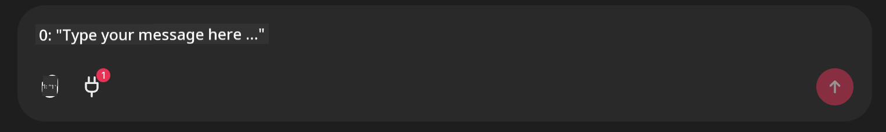

<!--
CO_OP_TRANSLATOR_METADATA:
{
  "original_hash": "9bf0395cbc541ce8db2a9699c8678dfc",
  "translation_date": "2025-07-12T14:19:25+00:00",
  "source_file": "11-mcp/code_samples/github-mcp/README.md",
  "language_code": "en"
}
-->
# Github MCP Server Example

## Description

This was a demo created for the AI Agents Hackathon hosted through the Microsoft Reactor.

The tool is used to recommend hackathon projects based on a user's Github repos.  
This is done by:

1. **Github Agent** - Using the Github MCP Server to retrieve repos and information about those repos.  
2. **Hackathon Agent** - Takes the data from the Github Agent and comes up with creative hackathon project ideas based on the projects, languages used by the user, and the project tracks for the AI Agents hackathon.  
3. **Events Agent** - Based on the hackathon agent’s suggestion, the events agent will recommend relevant events from the AI Agent Hackathon series.

## Running the code 

### Environment Variables

This demo uses Azure Open AI Service, Semantic Kernel, the Github MCP Server, and Azure AI Search.

Make sure that you have the proper environment variables set to use these tools:

```python
AZURE_OPENAI_CHAT_DEPLOYMENT_NAME=""
AZURE_OPENAI_EMBEDDING_DEPLOYMENT_NAME=""
AZURE_OPENAI_ENDPOINT=""
AZURE_OPENAI_API_KEY=""
AZURE_OPENAI_API_VERSION=""
AZURE_SEARCH_SERVICE_ENDPOINT=""
AZURE_SEARCH_API_KEY=""
``` 

## Running the Chainlit Server

To connect to the MCP server, this demo uses Chainlit as a chat interface. 

To run the server, use the following command in your terminal:

```bash
chainlit run app.py -w
```

This should start your Chainlit server on `localhost:8000` as well as populate your Azure AI Search Index with the `event-descriptions.md` content. 

## Connecting to the MCP Server

To connect to the Github MCP Server, select the "plug" icon underneath the "Type your message here.." chat box:



From there you can click on the "Connect an MCP" to add the command to connect to the Github MCP Server:

```bash
npx -y @modelcontextprotocol/server-github --env GITHUB_PERSONAL_ACCESS_TOKEN=[YOUR PERSONAL ACCESS TOKEN]
```

Replace "[YOUR PERSONAL ACCESS TOKEN]" with your actual Personal Access Token. 

After connecting, you should see a (1) next to the plug icon to confirm that it’s connected. If not, try restarting the chainlit server with `chainlit run app.py -w`.

## Using the Demo 

To start the agent workflow of recommending hackathon projects, you can type a message like: 

"Recommend hackathon projects for the Github user koreyspace"

The Router Agent will analyze your request and determine which combination of agents (GitHub, Hackathon, and Events) is best suited to handle your query. The agents work together to provide comprehensive recommendations based on GitHub repository analysis, project ideation, and relevant tech events.

**Disclaimer**:  
This document has been translated using the AI translation service [Co-op Translator](https://github.com/Azure/co-op-translator). While we strive for accuracy, please be aware that automated translations may contain errors or inaccuracies. The original document in its native language should be considered the authoritative source. For critical information, professional human translation is recommended. We are not liable for any misunderstandings or misinterpretations arising from the use of this translation.