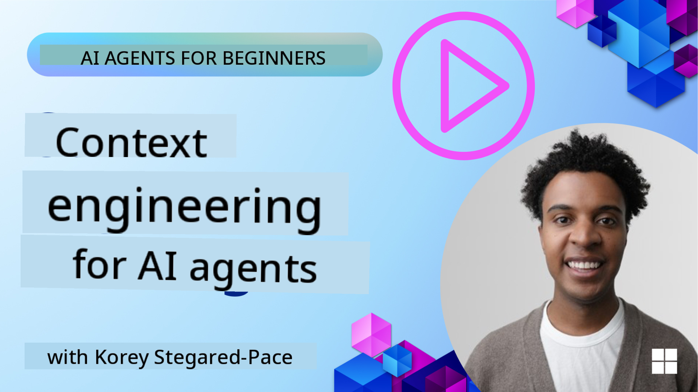
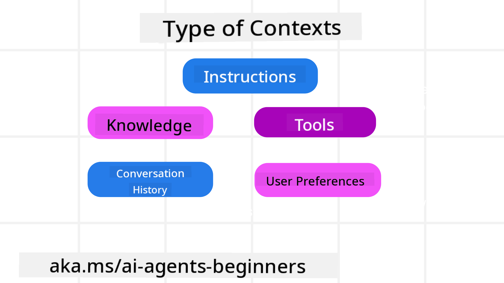
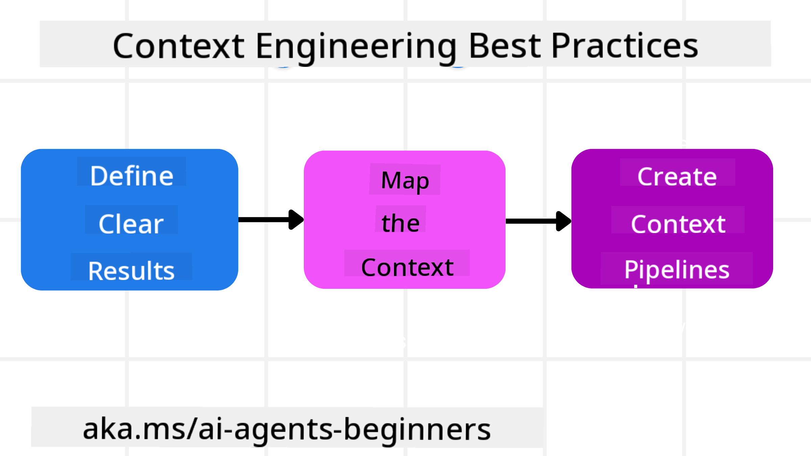

<!--
CO_OP_TRANSLATOR_METADATA:
{
  "original_hash": "cb7e50f471905ce6fdb92a30269a7a98",
  "translation_date": "2025-09-04T09:33:35+00:00",
  "source_file": "12-context-engineering/README.md",
  "language_code": "en"
}
-->
# Context Engineering for AI Agents

> _(Click the image above to view the video of this lesson)_

Understanding the complexity of the application you are building an AI agent for is crucial to creating a reliable one. We need to design AI Agents that can effectively manage information to address complex needs, going beyond just prompt engineering.

In this lesson, we will explore what context engineering is and its role in building AI agents.

## Introduction

This lesson will cover:

• **What Context Engineering is** and how it differs from prompt engineering.

• **Strategies for effective Context Engineering**, including writing, selecting, compressing, and isolating information.

• **Common Context Failures** that can disrupt your AI agent and how to address them.

## Learning Goals

After completing this lesson, you will understand how to:

• **Define context engineering** and distinguish it from prompt engineering.

• **Identify the key components of context** in Large Language Model (LLM) applications.

• **Apply strategies for writing, selecting, compressing, and isolating context** to enhance agent performance.

• **Recognize common context failures** such as poisoning, distraction, confusion, and clash, and implement solutions to mitigate them.

## What is Context Engineering?

For AI Agents, context is what guides the planning and actions of the agent. Context Engineering is the practice of ensuring the AI Agent has the right information to complete the next step of its task. Since the context window is limited in size, agent builders must create systems and processes to manage the addition, removal, and condensation of information within the context window.

### Prompt Engineering vs Context Engineering

Prompt engineering focuses on crafting a single set of static instructions to guide AI Agents effectively with a set of rules. Context engineering, on the other hand, involves managing a dynamic set of information, including the initial prompt, to ensure the AI Agent has what it needs over time. The key idea behind context engineering is to make this process repeatable and reliable.

### Types of Context

It’s important to remember that context isn’t just one thing. The information an AI Agent needs can come from various sources, and it’s our responsibility to ensure the agent has access to these sources:

The types of context an AI agent might need to manage include:

• **Instructions:** These are like the agent’s "rules" – prompts, system messages, few-shot examples (demonstrating how to perform a task), and descriptions of tools it can use. This is where prompt engineering overlaps with context engineering.

• **Knowledge:** This includes facts, information retrieved from databases, or long-term memories the agent has accumulated. It may involve integrating a Retrieval Augmented Generation (RAG) system if the agent needs access to different knowledge stores and databases.

• **Tools:** These are definitions of external functions, APIs, and MCP Servers that the agent can call, along with the feedback (results) it receives from using them.

• **Conversation History:** The ongoing dialogue with a user. Over time, these conversations grow longer and more complex, taking up space in the context window.

• **User Preferences:** Information learned about a user’s likes or dislikes over time. This can be stored and referenced when making decisions to better assist the user.

## Strategies for Effective Context Engineering

### Planning Strategies

Good context engineering begins with good planning. Here’s an approach to help you think about applying context engineering:

1. **Define Clear Results** - Clearly define the outcomes of the tasks assigned to AI Agents. Ask yourself, "What will the world look like when the AI Agent has completed its task?" In other words, what change, information, or response should the user have after interacting with the AI Agent?

2. **Map the Context** - Once you’ve defined the desired results, ask, "What information does the AI Agent need to complete this task?" This helps you map out where the necessary information can be found.

3. **Create Context Pipelines** - After identifying where the information is, ask, "How will the Agent access this information?" This can involve methods like RAG, MCP servers, or other tools.

### Practical Strategies

Planning is essential, but once information starts flowing into the agent’s context window, practical strategies are needed to manage it:

#### Managing Context

While some information will automatically enter the context window, context engineering involves actively managing this information through strategies like:

1. **Agent Scratchpad**  
   This allows the AI Agent to take notes on relevant information about the current tasks and user interactions during a single session. These notes exist outside the context window in a file or runtime object that the agent can retrieve later during the session if needed.

2. **Memories**  
   Scratchpads are useful for single-session management, but memories enable agents to store and retrieve relevant information across multiple sessions. This can include summaries, user preferences, and feedback for future improvements.

3. **Compressing Context**  
   When the context window grows and approaches its limit, techniques like summarization and trimming can be used. This involves keeping only the most relevant information or removing older messages.

4. **Multi-Agent Systems**  
   Developing multi-agent systems is a form of context engineering because each agent has its own context window. Planning how context is shared and passed between agents is crucial when building these systems.

5. **Sandbox Environments**  
   If an agent needs to run code or process large amounts of information from a document, this can consume many tokens. Instead of storing everything in the context window, the agent can use a sandbox environment to process the code and only retain the results and other relevant information.

6. **Runtime State Objects**  
   These are containers of information that allow the Agent to access specific data when needed. For complex tasks, this enables the Agent to store the results of each subtask step by step, keeping the context focused on the current subtask.

### Example of Context Engineering

Let’s say we want an AI agent to **"Book me a trip to Paris."**

• A simple agent using only prompt engineering might respond: **"Okay, when would you like to go to Paris?"** It only processes your direct question at the moment you ask.

• An agent using the context engineering strategies discussed would do much more. Before responding, its system might:

  ◦ **Check your calendar** for available dates (retrieving real-time data).  
  ◦ **Recall past travel preferences** (from long-term memory), such as your preferred airline, budget, or preference for direct flights.  
  ◦ **Identify available tools** for flight and hotel booking.  

- Then, an example response could be: "Hey [Your Name]! I see you’re free the first week of October. Shall I look for direct flights to Paris on [Preferred Airline] within your usual budget of [Budget]?" This richer, context-aware response highlights the power of context engineering.

## Common Context Failures

### Context Poisoning

**What it is:** When a hallucination (false information generated by the LLM) or an error enters the context and is repeatedly referenced, leading the agent to pursue impossible goals or develop nonsensical strategies.

**What to do:** Implement **context validation** and **quarantine**. Validate information before adding it to long-term memory. If poisoning is detected, start fresh context threads to prevent the spread of bad information.

**Travel Booking Example:** Your agent hallucinates a **direct flight from a small local airport to a distant international city** that doesn’t exist. This false detail gets saved in the context. Later, when you ask the agent to book, it keeps trying to find tickets for this impossible route, causing repeated errors.

**Solution:** Validate flight existence and routes with a real-time API before adding the flight detail to the agent’s working context. If validation fails, quarantine the erroneous information to prevent further use.

### Context Distraction

**What it is:** When the context becomes so large that the model focuses too much on accumulated history instead of its training, leading to repetitive or unhelpful actions. Mistakes can occur even before the context window is full.

**What to do:** Use **context summarization**. Periodically compress accumulated information into shorter summaries, retaining important details while removing redundant history.

**Travel Booking Example:** You’ve been discussing various dream travel destinations for a long time, including a detailed recounting of your backpacking trip from two years ago. When you finally ask to **"find me a cheap flight for next month,"** the agent gets bogged down in irrelevant details and focuses on your past trips instead of your current request.

**Solution:** After a certain number of turns or when the context grows too large, the agent should summarize the most recent and relevant parts of the conversation, focusing on your current travel dates and destination, and discard less relevant historical chat.

### Context Confusion

**What it is:** When too much unnecessary context, such as an overload of available tools, causes the model to generate poor responses or call irrelevant tools. Smaller models are especially prone to this.

**What to do:** Implement **tool loadout management** using RAG techniques. Store tool descriptions in a vector database and select only the most relevant tools for each task. Research shows limiting tool selections to fewer than 30.

**Travel Booking Example:** Your agent has access to dozens of tools: `book_flight`, `book_hotel`, `rent_car`, `find_tours`, `currency_converter`, `weather_forecast`, `restaurant_reservations`, etc. You ask, **"What’s the best way to get around Paris?"** The agent gets confused and tries to call `book_flight` within Paris or `rent_car` even though you prefer public transport.

**Solution:** Use RAG over tool descriptions. When you ask about getting around Paris, the system dynamically retrieves only the most relevant tools, like `rent_car` or `public_transport_info`, and presents a focused "loadout" of tools to the LLM.

### Context Clash

**What it is:** When conflicting information exists within the context, leading to inconsistent reasoning or poor responses. This often happens when information arrives in stages, and early, incorrect assumptions remain in the context.

**What to do:** Use **context pruning** and **offloading**. Pruning removes outdated or conflicting information as new details arrive. Offloading provides the model with a separate "scratchpad" workspace to process information without cluttering the main context.

**Travel Booking Example:** You initially tell your agent, **"I want to fly economy class."** Later, you change your mind and say, **"Actually, for this trip, let’s go business class."** If both instructions remain in the context, the agent might get confused and provide conflicting search results.

**Solution:** Implement context pruning. When a new instruction contradicts an old one, the older instruction is removed or explicitly overridden in the context. Alternatively, the agent can use a scratchpad to reconcile conflicting preferences before proceeding, ensuring only the final, consistent instruction guides its actions.

## Got More Questions About Context Engineering?

Join the [Azure AI Foundry Discord](https://aka.ms/ai-agents/discord) to connect with other learners, attend office hours, and get your AI Agent questions answered.

---

**Disclaimer**:  
This document has been translated using the AI translation service [Co-op Translator](https://github.com/Azure/co-op-translator). While we strive for accuracy, please note that automated translations may contain errors or inaccuracies. The original document in its native language should be regarded as the authoritative source. For critical information, professional human translation is recommended. We are not responsible for any misunderstandings or misinterpretations resulting from the use of this translation.