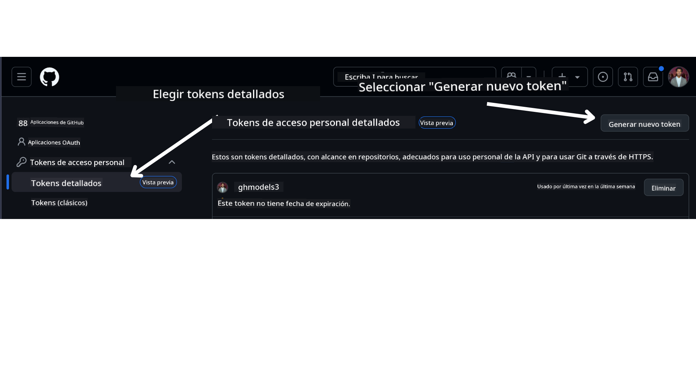

<!--
CO_OP_TRANSLATOR_METADATA:
{
  "original_hash": "76945069b52a49cd0432ae3e0b0ba22e",
  "translation_date": "2025-07-12T07:42:16+00:00",
  "source_file": "00-course-setup/README.md",
  "language_code": "es"
}
-->
en tu cuenta de GitHub.

Selecciona la opción `Fine-grained tokens` en el lado izquierdo de tu pantalla.

Luego selecciona `Generate new token`.



Se te pedirá que ingreses un nombre para tu token, selecciones la fecha de expiración (Recomendado: 30 días) y selecciones los alcances para tu token (Repositorios Públicos).

También es necesario editar los permisos de este token: Permissions -> Models -> Permite acceso a GitHub Models

Copia tu nuevo token que acabas de crear. Ahora lo agregarás a tu archivo `.env` incluido en este curso.

### Paso 2: Crea tu archivo `.env`

Para crear tu archivo `.env` ejecuta el siguiente comando en tu terminal.

```bash
cp .env.example .env
```

Esto copiará el archivo de ejemplo y creará un `.env` en tu directorio donde deberás completar los valores para las variables de entorno.

Con tu token copiado, abre el archivo `.env` en tu editor de texto favorito y pega tu token en el campo `GITHUB_TOKEN`.

Ahora deberías poder ejecutar los ejemplos de código de este curso.

## Configuración para ejemplos que usan Azure AI Foundry y Azure AI Agent Service

### Paso 1: Obtén el Endpoint de tu Proyecto en Azure

Sigue los pasos para crear un hub y un proyecto en Azure AI Foundry que se encuentran aquí: [Hub resources overview](https://learn.microsoft.com/en-us/azure/ai-foundry/concepts/ai-resources)

Una vez que hayas creado tu proyecto, necesitarás obtener la cadena de conexión para tu proyecto.

Esto se puede hacer yendo a la página **Overview** de tu proyecto en el portal de Azure AI Foundry.


### Paso 2: Crea tu archivo `.env`

Para crear tu archivo `.env` ejecuta el siguiente comando en tu terminal.

```bash
cp .env.example .env
```

Esto copiará el archivo de ejemplo y creará un `.env` en tu directorio donde deberás completar los valores para las variables de entorno.

Con tu token copiado, abre el archivo `.env` en tu editor de texto favorito y pega tu token en el campo `PROJECT_ENDPOINT`.

### Paso 3: Inicia sesión en Azure

Como buena práctica de seguridad, usaremos [autenticación sin clave](https://learn.microsoft.com/azure/developer/ai/keyless-connections?tabs=csharp%2Cazure-cli?WT.mc_id=academic-105485-koreyst) para autenticarte en Azure OpenAI con Microsoft Entra ID. Antes de poder hacerlo, primero necesitas instalar la **Azure CLI** siguiendo las [instrucciones de instalación](https://learn.microsoft.com/cli/azure/install-azure-cli?WT.mc_id=academic-105485-koreyst) para tu sistema operativo.

Luego, abre una terminal y ejecuta `az login --use-device-code` para iniciar sesión en tu cuenta de Azure.

Una vez que hayas iniciado sesión, selecciona tu suscripción en la terminal.

## Variables de entorno adicionales - Azure Search y Azure OpenAI

Para la Lección Agentic RAG - Lección 5 - hay ejemplos que usan Azure Search y Azure OpenAI.

Si quieres ejecutar estos ejemplos, necesitarás agregar las siguientes variables de entorno a tu archivo `.env`:

### Página de Resumen (Proyecto)

- `AZURE_SUBSCRIPTION_ID` - Revisa los **Detalles del proyecto** en la página **Overview** de tu proyecto.

- `AZURE_AI_PROJECT_NAME` - Mira en la parte superior de la página **Overview** de tu proyecto.

- `AZURE_OPENAI_SERVICE` - Encuentra esto en la pestaña **Included capabilities** para **Azure OpenAI Service** en la página **Overview**.

### Centro de Administración

- `AZURE_OPENAI_RESOURCE_GROUP` - Ve a **Propiedades del proyecto** en la página **Overview** del **Centro de Administración**.

- `GLOBAL_LLM_SERVICE` - Bajo **Recursos conectados**, encuentra el nombre de la conexión de **Azure AI Services**. Si no aparece, revisa en el **portal de Azure** bajo tu grupo de recursos el nombre del recurso de AI Services.

### Página de Modelos + Endpoints

- `AZURE_OPENAI_EMBEDDING_DEPLOYMENT_NAME` - Selecciona tu modelo de embedding (por ejemplo, `text-embedding-ada-002`) y anota el **Nombre del despliegue** en los detalles del modelo.

- `AZURE_OPENAI_CHAT_DEPLOYMENT_NAME` - Selecciona tu modelo de chat (por ejemplo, `gpt-4o-mini`) y anota el **Nombre del despliegue** en los detalles del modelo.

### Portal de Azure

- `AZURE_OPENAI_ENDPOINT` - Busca **Azure AI services**, haz clic, luego ve a **Resource Management**, **Keys and Endpoint**, desplázate hasta los "Azure OpenAI endpoints" y copia el que dice "Language APIs".

- `AZURE_OPENAI_API_KEY` - En la misma pantalla, copia la CLAVE 1 o CLAVE 2.

- `AZURE_SEARCH_SERVICE_ENDPOINT` - Encuentra tu recurso **Azure AI Search**, haz clic y ve a **Overview**.

- `AZURE_SEARCH_API_KEY` - Luego ve a **Settings** y después a **Keys** para copiar la clave administrativa primaria o secundaria.

### Página web externa

- `AZURE_OPENAI_API_VERSION` - Visita la página [API version lifecycle](https://learn.microsoft.com/en-us/azure/ai-services/openai/api-version-deprecation#latest-ga-api-release) bajo **Latest GA API release**.

### Configurar autenticación sin clave

En lugar de codificar tus credenciales, usaremos una conexión sin clave con Azure OpenAI. Para ello, importaremos `DefaultAzureCredential` y luego llamaremos a la función `DefaultAzureCredential` para obtener la credencial.

```python
from azure.identity import DefaultAzureCredential, InteractiveBrowserCredential
```

## ¿Atascado en algún paso?

Si tienes algún problema ejecutando esta configuración, únete a nuestro

o

.

## Próxima lección

Ya estás listo para ejecutar el código de este curso. ¡Disfruta aprendiendo más sobre el mundo de los Agentes de IA!

[Introducción a los Agentes de IA y casos de uso de agentes](../01-intro-to-ai-agents/README.md)

**Aviso legal**:  
Este documento ha sido traducido utilizando el servicio de traducción automática [Co-op Translator](https://github.com/Azure/co-op-translator). Aunque nos esforzamos por la precisión, tenga en cuenta que las traducciones automáticas pueden contener errores o inexactitudes. El documento original en su idioma nativo debe considerarse la fuente autorizada. Para información crítica, se recomienda la traducción profesional realizada por humanos. No nos hacemos responsables de malentendidos o interpretaciones erróneas derivadas del uso de esta traducción.