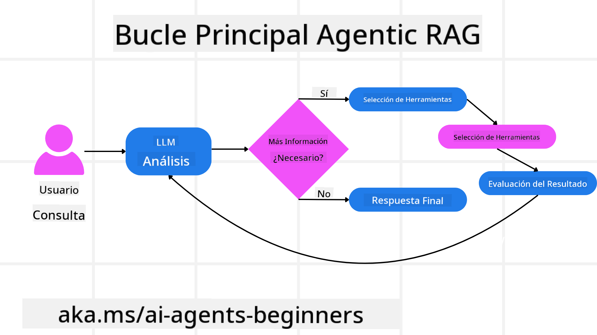
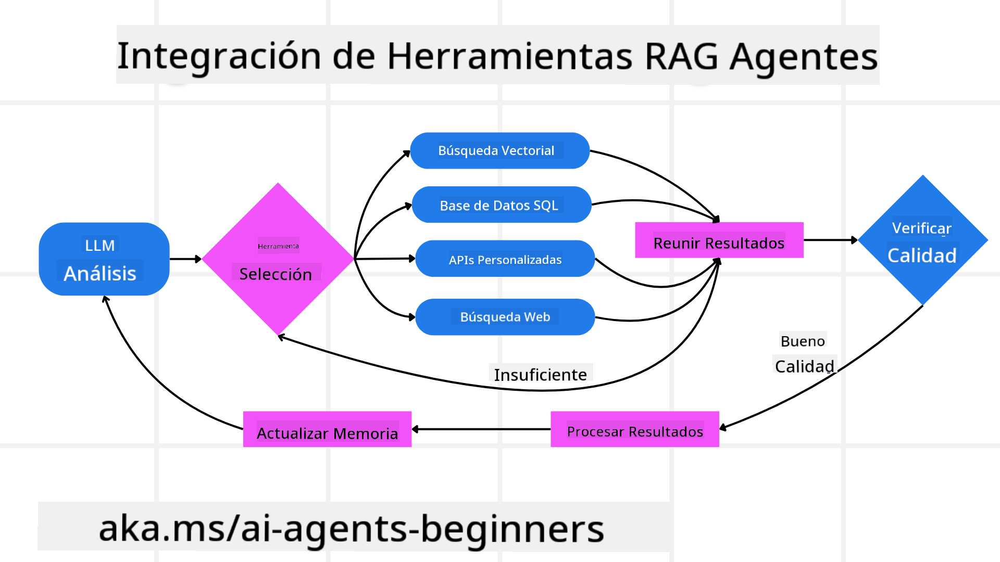
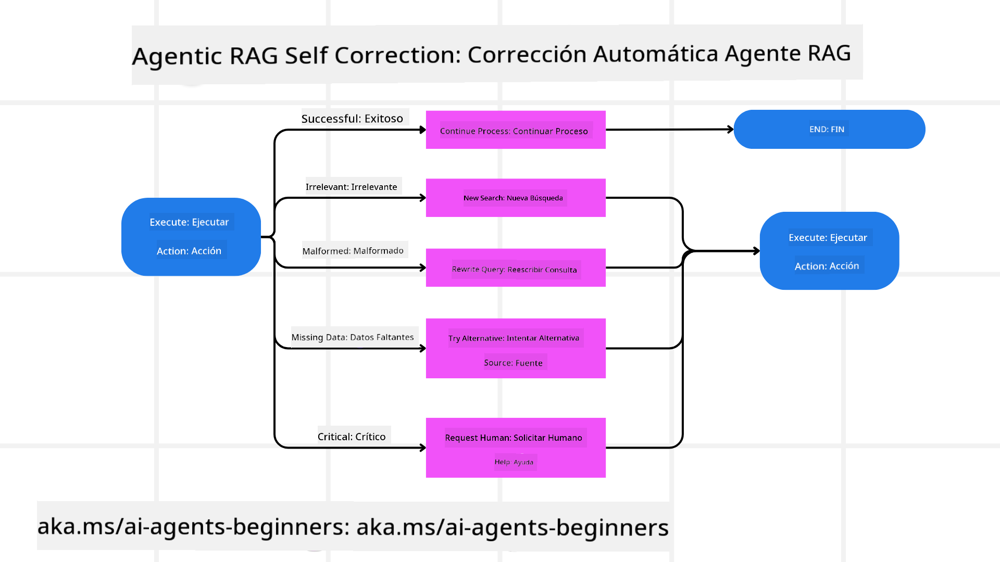
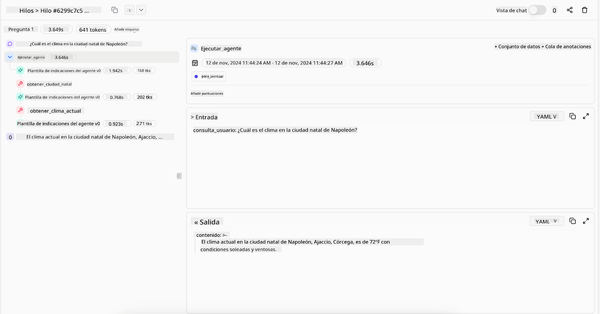

<!--
CO_OP_TRANSLATOR_METADATA:
{
  "original_hash": "7622aa72f9e676e593339f5f694ecd7d",
  "translation_date": "2025-07-12T09:49:29+00:00",
  "source_file": "05-agentic-rag/README.md",
  "language_code": "es"
}
-->

> _(Haz clic en la imagen de arriba para ver el video de esta lección)_

# Agentic RAG

Esta lección ofrece una visión completa sobre Agentic Retrieval-Augmented Generation (Agentic RAG), un paradigma emergente en IA donde los grandes modelos de lenguaje (LLMs) planifican de forma autónoma sus próximos pasos mientras extraen información de fuentes externas. A diferencia de los patrones estáticos de recuperación y lectura, Agentic RAG implica llamadas iterativas al LLM, intercaladas con llamadas a herramientas o funciones y salidas estructuradas. El sistema evalúa los resultados, refina las consultas, invoca herramientas adicionales si es necesario y continúa este ciclo hasta lograr una solución satisfactoria.

## Introducción

En esta lección aprenderás a:

- **Entender Agentic RAG:** Conocer el paradigma emergente en IA donde los grandes modelos de lenguaje (LLMs) planifican de forma autónoma sus próximos pasos mientras extraen información de fuentes externas.
- **Comprender el estilo iterativo Maker-Checker:** Entender el ciclo de llamadas iterativas al LLM, intercaladas con llamadas a herramientas o funciones y salidas estructuradas, diseñado para mejorar la precisión y manejar consultas malformadas.
- **Explorar aplicaciones prácticas:** Identificar escenarios donde Agentic RAG destaca, como entornos que priorizan la corrección, interacciones complejas con bases de datos y flujos de trabajo extendidos.

## Objetivos de aprendizaje

Al completar esta lección, sabrás cómo y entenderás:

- **Comprender Agentic RAG:** Conocer el paradigma emergente en IA donde los grandes modelos de lenguaje (LLMs) planifican de forma autónoma sus próximos pasos mientras extraen información de fuentes externas.
- **Estilo iterativo Maker-Checker:** Captar el concepto de un ciclo de llamadas iterativas al LLM, intercaladas con llamadas a herramientas o funciones y salidas estructuradas, diseñado para mejorar la precisión y manejar consultas malformadas.
- **Controlar el proceso de razonamiento:** Entender la capacidad del sistema para controlar su propio proceso de razonamiento, tomando decisiones sobre cómo abordar problemas sin depender de rutas predefinidas.
- **Flujo de trabajo:** Comprender cómo un modelo agentic decide de forma independiente recuperar informes de tendencias de mercado, identificar datos de competidores, correlacionar métricas internas de ventas, sintetizar hallazgos y evaluar la estrategia.
- **Bucles iterativos, integración de herramientas y memoria:** Aprender sobre el patrón de interacción en bucle del sistema, manteniendo estado y memoria a lo largo de los pasos para evitar repeticiones y tomar decisiones informadas.
- **Manejo de fallos y autocorrección:** Explorar los mecanismos robustos de autocorrección del sistema, incluyendo iteración y reconsulta, uso de herramientas diagnósticas y recurrencia a supervisión humana.
- **Límites de la agencia:** Entender las limitaciones de Agentic RAG, enfocándose en la autonomía específica del dominio, dependencia de la infraestructura y respeto a las reglas de seguridad.
- **Casos prácticos y valor:** Identificar escenarios donde Agentic RAG destaca, como entornos que priorizan la corrección, interacciones complejas con bases de datos y flujos de trabajo extendidos.
- **Gobernanza, transparencia y confianza:** Conocer la importancia de la gobernanza y transparencia, incluyendo razonamiento explicable, control de sesgos y supervisión humana.

## ¿Qué es Agentic RAG?

Agentic Retrieval-Augmented Generation (Agentic RAG) es un paradigma emergente en IA donde los grandes modelos de lenguaje (LLMs) planifican de forma autónoma sus próximos pasos mientras extraen información de fuentes externas. A diferencia de los patrones estáticos de recuperación y lectura, Agentic RAG implica llamadas iterativas al LLM, intercaladas con llamadas a herramientas o funciones y salidas estructuradas. El sistema evalúa los resultados, refina las consultas, invoca herramientas adicionales si es necesario y continúa este ciclo hasta lograr una solución satisfactoria. Este estilo iterativo “maker-checker” mejora la precisión, maneja consultas malformadas y asegura resultados de alta calidad.

El sistema controla activamente su proceso de razonamiento, reescribiendo consultas fallidas, eligiendo diferentes métodos de recuperación e integrando múltiples herramientas —como búsqueda vectorial en Azure AI Search, bases de datos SQL o APIs personalizadas— antes de finalizar su respuesta. La cualidad distintiva de un sistema agentic es su capacidad para controlar su propio proceso de razonamiento. Las implementaciones tradicionales de RAG dependen de rutas predefinidas, pero un sistema agentic determina de forma autónoma la secuencia de pasos basándose en la calidad de la información que encuentra.

## Definición de Agentic Retrieval-Augmented Generation (Agentic RAG)

Agentic Retrieval-Augmented Generation (Agentic RAG) es un paradigma emergente en el desarrollo de IA donde los LLMs no solo extraen información de fuentes externas, sino que también planifican de forma autónoma sus próximos pasos. A diferencia de los patrones estáticos de recuperación y lectura o secuencias cuidadosamente guionizadas de prompts, Agentic RAG implica un ciclo de llamadas iterativas al LLM, intercaladas con llamadas a herramientas o funciones y salidas estructuradas. En cada paso, el sistema evalúa los resultados obtenidos, decide si refina sus consultas, invoca herramientas adicionales si es necesario y continúa este ciclo hasta lograr una solución satisfactoria.

Este estilo iterativo “maker-checker” está diseñado para mejorar la precisión, manejar consultas malformadas a bases de datos estructuradas (por ejemplo, NL2SQL) y asegurar resultados equilibrados y de alta calidad. En lugar de depender únicamente de cadenas de prompts cuidadosamente diseñadas, el sistema controla activamente su proceso de razonamiento. Puede reescribir consultas que fallan, elegir diferentes métodos de recuperación e integrar múltiples herramientas —como búsqueda vectorial en Azure AI Search, bases de datos SQL o APIs personalizadas— antes de finalizar su respuesta. Esto elimina la necesidad de marcos de orquestación excesivamente complejos. En cambio, un ciclo relativamente simple de “llamada al LLM → uso de herramienta → llamada al LLM → …” puede generar salidas sofisticadas y bien fundamentadas.

## Controlar el proceso de razonamiento

La cualidad que distingue a un sistema como “agentic” es su capacidad para controlar su propio proceso de razonamiento. Las implementaciones tradicionales de RAG a menudo dependen de que humanos definan previamente un camino para el modelo: una cadena de pensamiento que indica qué recuperar y cuándo.  
Pero cuando un sistema es verdaderamente agentic, decide internamente cómo abordar el problema. No solo ejecuta un guion; determina de forma autónoma la secuencia de pasos basándose en la calidad de la información que encuentra.  
Por ejemplo, si se le pide crear una estrategia de lanzamiento de producto, no se basa únicamente en un prompt que detalla todo el flujo de investigación y toma de decisiones. En cambio, el modelo agentic decide de forma independiente:

1. Recuperar informes actuales de tendencias de mercado usando Bing Web Grounding  
2. Identificar datos relevantes de competidores usando Azure AI Search  
3. Correlacionar métricas históricas internas de ventas usando Azure SQL Database  
4. Sintetizar los hallazgos en una estrategia coherente orquestada vía Azure OpenAI Service  
5. Evaluar la estrategia en busca de brechas o inconsistencias, iniciando otra ronda de recuperación si es necesario  

Todos estos pasos —refinar consultas, elegir fuentes, iterar hasta estar “satisfecho” con la respuesta— son decididos por el modelo, no guionizados por un humano.

## Bucles iterativos, integración de herramientas y memoria

Un sistema agentic se basa en un patrón de interacción en bucle:

- **Llamada inicial:** Se presenta al LLM el objetivo del usuario (es decir, el prompt del usuario).  
- **Invocación de herramienta:** Si el modelo identifica información faltante o instrucciones ambiguas, selecciona una herramienta o método de recuperación —como una consulta a base de datos vectorial (por ejemplo, búsqueda híbrida en Azure AI Search sobre datos privados) o una llamada SQL estructurada— para obtener más contexto.  
- **Evaluación y refinamiento:** Tras revisar los datos devueltos, el modelo decide si la información es suficiente. Si no, refina la consulta, prueba otra herramienta o ajusta su enfoque.  
- **Repetir hasta satisfacción:** Este ciclo continúa hasta que el modelo determina que tiene suficiente claridad y evidencia para entregar una respuesta final bien razonada.  
- **Memoria y estado:** Debido a que el sistema mantiene estado y memoria a lo largo de los pasos, puede recordar intentos previos y sus resultados, evitando bucles repetitivos y tomando decisiones más informadas conforme avanza.

Con el tiempo, esto crea una sensación de entendimiento evolutivo, permitiendo al modelo navegar tareas complejas y de múltiples pasos sin requerir intervención humana constante o reformulación del prompt.

## Manejo de fallos y autocorrección

La autonomía de Agentic RAG también incluye mecanismos robustos de autocorrección. Cuando el sistema se encuentra con callejones sin salida —como recuperar documentos irrelevantes o enfrentar consultas malformadas— puede:

- **Iterar y reconsultar:** En lugar de devolver respuestas de bajo valor, el modelo intenta nuevas estrategias de búsqueda, reescribe consultas a bases de datos o examina conjuntos de datos alternativos.  
- **Usar herramientas diagnósticas:** El sistema puede invocar funciones adicionales diseñadas para ayudar a depurar sus pasos de razonamiento o confirmar la corrección de los datos recuperados. Herramientas como Azure AI Tracing serán importantes para habilitar una observabilidad y monitoreo robustos.  
- **Recurre a supervisión humana:** Para escenarios de alto riesgo o fallos repetidos, el modelo puede señalar incertidumbre y solicitar guía humana. Una vez que el humano proporciona retroalimentación correctiva, el modelo puede incorporar esa lección en adelante.

Este enfoque iterativo y dinámico permite que el modelo mejore continuamente, asegurando que no sea solo un sistema de una sola ejecución, sino uno que aprende de sus errores durante una sesión dada.

## Límites de la agencia

A pesar de su autonomía dentro de una tarea, Agentic RAG no es análogo a la Inteligencia Artificial General. Sus capacidades “agentic” están confinadas a las herramientas, fuentes de datos y políticas proporcionadas por desarrolladores humanos. No puede inventar sus propias herramientas ni salirse de los límites del dominio establecidos. Más bien, sobresale en orquestar dinámicamente los recursos disponibles.  
Las diferencias clave con formas de IA más avanzadas incluyen:

1. **Autonomía específica del dominio:** Los sistemas Agentic RAG se enfocan en alcanzar objetivos definidos por el usuario dentro de un dominio conocido, empleando estrategias como reescritura de consultas o selección de herramientas para mejorar resultados.  
2. **Dependencia de infraestructura:** Las capacidades del sistema dependen de las herramientas y datos integrados por los desarrolladores. No puede superar estos límites sin intervención humana.  
3. **Respeto a las reglas de seguridad:** Las directrices éticas, normas de cumplimiento y políticas empresariales siguen siendo muy importantes. La libertad del agente siempre está limitada por medidas de seguridad y mecanismos de supervisión (¿esperemos?).

## Casos prácticos y valor

Agentic RAG destaca en escenarios que requieren refinamiento iterativo y precisión:

1. **Entornos que priorizan la corrección:** En revisiones de cumplimiento, análisis regulatorios o investigación legal, el modelo agentic puede verificar hechos repetidamente, consultar múltiples fuentes y reescribir consultas hasta producir una respuesta exhaustivamente validada.  
2. **Interacciones complejas con bases de datos:** Al tratar con datos estructurados donde las consultas pueden fallar o necesitar ajustes, el sistema puede refinar sus consultas de forma autónoma usando Azure SQL o Microsoft Fabric OneLake, asegurando que la recuperación final se alinee con la intención del usuario.  
3. **Flujos de trabajo extendidos:** Las sesiones de larga duración pueden evolucionar a medida que surge nueva información. Agentic RAG puede incorporar continuamente nuevos datos, ajustando estrategias conforme aprende más sobre el problema.

## Gobernanza, transparencia y confianza

A medida que estos sistemas se vuelven más autónomos en su razonamiento, la gobernanza y transparencia son cruciales:

- **Razonamiento explicable:** El modelo puede proporcionar un registro de auditoría de las consultas realizadas, las fuentes consultadas y los pasos de razonamiento seguidos para llegar a su conclusión. Herramientas como Azure AI Content Safety y Azure AI Tracing / GenAIOps pueden ayudar a mantener la transparencia y mitigar riesgos.  
- **Control de sesgos y recuperación equilibrada:** Los desarrolladores pueden ajustar las estrategias de recuperación para asegurar que se consideren fuentes de datos equilibradas y representativas, y auditar regularmente las salidas para detectar sesgos o patrones distorsionados usando modelos personalizados para organizaciones avanzadas de ciencia de datos con Azure Machine Learning.  
- **Supervisión humana y cumplimiento:** Para tareas sensibles, la revisión humana sigue siendo esencial. Agentic RAG no reemplaza el juicio humano en decisiones críticas, sino que lo complementa entregando opciones más exhaustivamente validadas.

Contar con herramientas que proporcionen un registro claro de acciones es fundamental. Sin ellas, depurar un proceso de múltiples pasos puede ser muy difícil. Ve el siguiente ejemplo de Literal AI (empresa detrás de Chainlit) para una ejecución de agente:

## Conclusión

Agentic RAG representa una evolución natural en la forma en que los sistemas de IA manejan tareas complejas e intensivas en datos. Al adoptar un patrón de interacción en bucle, seleccionar herramientas de forma autónoma y refinar consultas hasta lograr un resultado de alta calidad, el sistema va más allá del seguimiento estático de prompts hacia un tomador de decisiones más adaptativo y consciente del contexto. Aunque sigue limitado por infraestructuras definidas por humanos y directrices éticas, estas capacidades agentic permiten interacciones de IA más ricas, dinámicas y, en última instancia, más útiles tanto para empresas como para usuarios finales.

## Recursos adicionales

- <a href="https://learn.microsoft.com/training/modules/use-own-data-azure-openai" target="_blank">Implementar Retrieval Augmented Generation (RAG) con Azure OpenAI Service: Aprende a usar tus propios datos con Azure OpenAI Service. Este módulo de Microsoft Learn ofrece una guía completa para implementar RAG</a>

- <a href="https://learn.microsoft.com/azure/ai-studio/concepts/evaluation-approach-gen-ai" target="_blank">Evaluación de aplicaciones de IA generativa con Azure AI Foundry: Este artículo aborda la evaluación y comparación de modelos en conjuntos de datos públicos, incluyendo aplicaciones de IA agentiva y arquitecturas RAG</a>
- <a href="https://weaviate.io/blog/what-is-agentic-rag" target="_blank">Qué es Agentic RAG | Weaviate</a>
- <a href="https://ragaboutit.com/agentic-rag-a-complete-guide-to-agent-based-retrieval-augmented-generation/" target="_blank">Agentic RAG: Guía completa sobre generación aumentada por recuperación basada en agentes – Noticias de generación RAG</a>
- <a href="https://huggingface.co/learn/cookbook/agent_rag" target="_blank">Agentic RAG: potencia tu RAG con reformulación de consultas y auto-consulta! Hugging Face Open-Source AI Cookbook</a>
- <a href="https://youtu.be/aQ4yQXeB1Ss?si=2HUqBzHoeB5tR04U" target="_blank">Añadiendo capas agentivas a RAG</a>
- <a href="https://www.youtube.com/watch?v=zeAyuLc_f3Q&t=244s" target="_blank">El futuro de los asistentes de conocimiento: Jerry Liu</a>
- <a href="https://www.youtube.com/watch?v=AOSjiXP1jmQ" target="_blank">Cómo construir sistemas Agentic RAG</a>
- <a href="https://ignite.microsoft.com/sessions/BRK102?source=sessions" target="_blank">Uso del servicio Azure AI Foundry Agent para escalar tus agentes de IA</a>

### Artículos académicos

- <a href="https://arxiv.org/abs/2303.17651" target="_blank">2303.17651 Self-Refine: Refinamiento iterativo con auto-feedback</a>
- <a href="https://arxiv.org/abs/2303.11366" target="_blank">2303.11366 Reflexion: Agentes de lenguaje con aprendizaje por refuerzo verbal</a>
- <a href="https://arxiv.org/abs/2305.11738" target="_blank">2305.11738 CRITIC: Los grandes modelos de lenguaje pueden autocorregirse con crítica interactiva mediante herramientas</a>
- <a href="https://arxiv.org/abs/2501.09136" target="_blank">2501.09136 Agentic Retrieval-Augmented Generation: Una revisión sobre Agentic RAG</a>

## Lección anterior

[Patrón de diseño para uso de herramientas](../04-tool-use/README.md)

## Próxima lección

[Construyendo agentes de IA confiables](../06-building-trustworthy-agents/README.md)

**Aviso legal**:  
Este documento ha sido traducido utilizando el servicio de traducción automática [Co-op Translator](https://github.com/Azure/co-op-translator). Aunque nos esforzamos por la precisión, tenga en cuenta que las traducciones automáticas pueden contener errores o inexactitudes. El documento original en su idioma nativo debe considerarse la fuente autorizada. Para información crítica, se recomienda la traducción profesional realizada por humanos. No nos hacemos responsables de malentendidos o interpretaciones erróneas derivadas del uso de esta traducción.