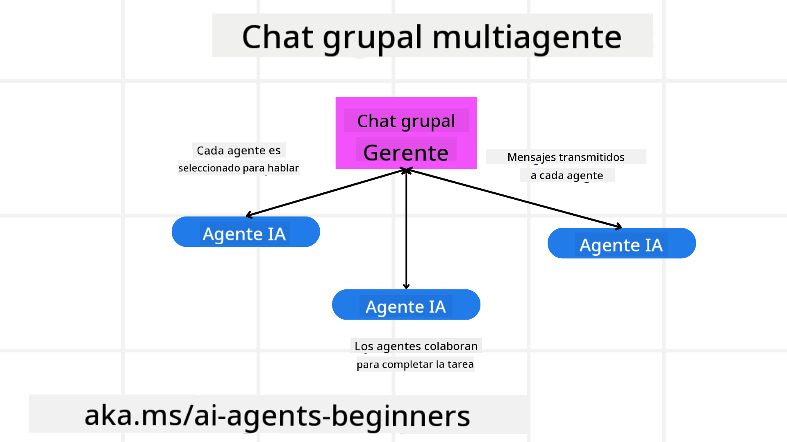
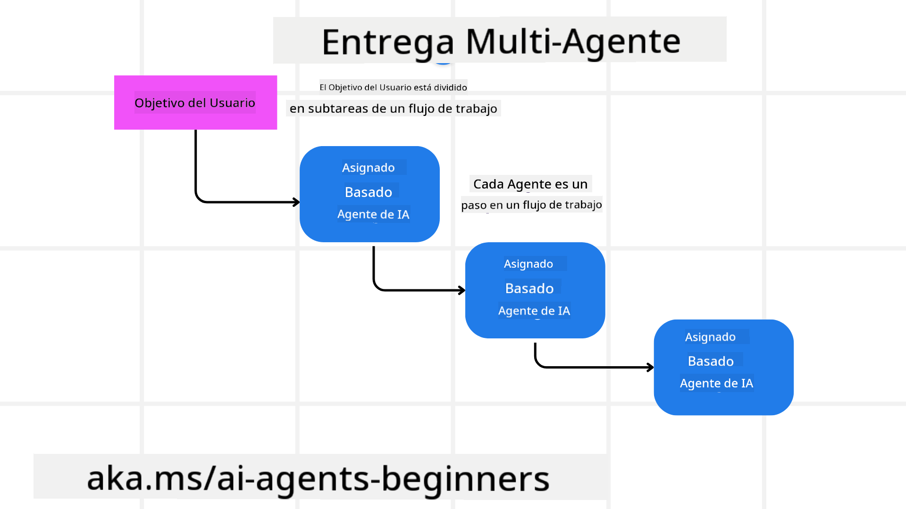
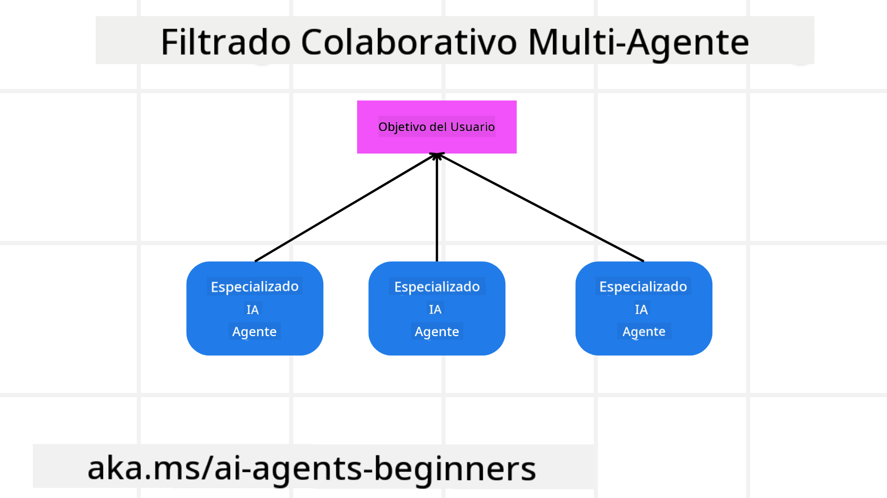

<!--
CO_OP_TRANSLATOR_METADATA:
{
  "original_hash": "1a008c204051cba8d0e253b75f261c41",
  "translation_date": "2025-08-30T13:11:51+00:00",
  "source_file": "08-multi-agent/README.md",
  "language_code": "es"
}
-->

> _(Haz clic en la imagen de arriba para ver el video de esta lección)_

# Patrones de diseño multi-agente

Tan pronto como comiences a trabajar en un proyecto que involucre múltiples agentes, necesitarás considerar el patrón de diseño multi-agente. Sin embargo, puede que no sea inmediatamente claro cuándo cambiar a múltiples agentes y cuáles son las ventajas.

## Introducción

En esta lección, buscamos responder las siguientes preguntas:

- ¿Cuáles son los escenarios donde los multi-agentes son aplicables?
- ¿Cuáles son las ventajas de usar multi-agentes en lugar de un solo agente realizando múltiples tareas?
- ¿Cuáles son los componentes básicos para implementar el patrón de diseño multi-agente?
- ¿Cómo podemos tener visibilidad de cómo interactúan los múltiples agentes entre sí?

## Objetivos de aprendizaje

Después de esta lección, deberías ser capaz de:

- Identificar escenarios donde los multi-agentes son aplicables.
- Reconocer las ventajas de usar multi-agentes en lugar de un solo agente.
- Comprender los componentes básicos para implementar el patrón de diseño multi-agente.

¿Cuál es la visión general?

*Los multi-agentes son un patrón de diseño que permite que múltiples agentes trabajen juntos para lograr un objetivo común*.

Este patrón se utiliza ampliamente en diversos campos, incluidos la robótica, los sistemas autónomos y la computación distribuida.

## Escenarios donde los multi-agentes son aplicables

Entonces, ¿qué escenarios son buenos casos de uso para emplear multi-agentes? La respuesta es que hay muchos escenarios donde emplear múltiples agentes es beneficioso, especialmente en los siguientes casos:

- **Cargas de trabajo grandes**: Las cargas de trabajo grandes pueden dividirse en tareas más pequeñas y asignarse a diferentes agentes, permitiendo el procesamiento en paralelo y una finalización más rápida. Un ejemplo de esto es en el caso de una tarea de procesamiento de datos a gran escala.
- **Tareas complejas**: Las tareas complejas, al igual que las cargas de trabajo grandes, pueden descomponerse en subtareas más pequeñas y asignarse a diferentes agentes, cada uno especializado en un aspecto específico de la tarea. Un buen ejemplo de esto es en el caso de vehículos autónomos, donde diferentes agentes gestionan la navegación, la detección de obstáculos y la comunicación con otros vehículos.
- **Experiencia diversa**: Diferentes agentes pueden tener experiencia diversa, permitiéndoles manejar diferentes aspectos de una tarea de manera más efectiva que un solo agente. Para este caso, un buen ejemplo es en el ámbito de la salud, donde los agentes pueden gestionar diagnósticos, planes de tratamiento y monitoreo de pacientes.

## Ventajas de usar multi-agentes en lugar de un solo agente

Un sistema de agente único podría funcionar bien para tareas simples, pero para tareas más complejas, usar múltiples agentes puede proporcionar varias ventajas:

- **Especialización**: Cada agente puede estar especializado en una tarea específica. La falta de especialización en un solo agente significa que tienes un agente que puede hacer de todo, pero podría confundirse sobre qué hacer cuando enfrenta una tarea compleja. Por ejemplo, podría terminar realizando una tarea para la que no está mejor preparado.
- **Escalabilidad**: Es más fácil escalar sistemas añadiendo más agentes en lugar de sobrecargar a un solo agente.
- **Tolerancia a fallos**: Si un agente falla, otros pueden seguir funcionando, asegurando la fiabilidad del sistema.

Tomemos un ejemplo: reservar un viaje para un usuario. Un sistema de agente único tendría que manejar todos los aspectos del proceso de reserva de viaje, desde encontrar vuelos hasta reservar hoteles y autos de alquiler. Para lograr esto con un solo agente, el agente necesitaría herramientas para manejar todas estas tareas. Esto podría llevar a un sistema complejo y monolítico que sea difícil de mantener y escalar. Un sistema multi-agente, por otro lado, podría tener diferentes agentes especializados en encontrar vuelos, reservar hoteles y autos de alquiler. Esto haría que el sistema sea más modular, más fácil de mantener y escalable.

Compáralo con una agencia de viajes operada como un negocio familiar frente a una agencia de viajes operada como una franquicia. El negocio familiar tendría un solo agente manejando todos los aspectos del proceso de reserva de viaje, mientras que la franquicia tendría diferentes agentes manejando diferentes aspectos del proceso.

## Componentes básicos para implementar el patrón de diseño multi-agente

Antes de que puedas implementar el patrón de diseño multi-agente, necesitas entender los componentes básicos que conforman el patrón.

Hagamos esto más concreto volviendo al ejemplo de reservar un viaje para un usuario. En este caso, los componentes básicos incluirían:

- **Comunicación entre agentes**: Los agentes para encontrar vuelos, reservar hoteles y autos de alquiler necesitan comunicarse y compartir información sobre las preferencias y restricciones del usuario. Necesitas decidir los protocolos y métodos para esta comunicación. Concretamente, esto significa que el agente para encontrar vuelos necesita comunicarse con el agente para reservar hoteles para asegurarse de que el hotel esté reservado para las mismas fechas que el vuelo. Esto implica decidir *qué agentes comparten información y cómo la comparten*.
- **Mecanismos de coordinación**: Los agentes necesitan coordinar sus acciones para asegurarse de que se cumplan las preferencias y restricciones del usuario. Una preferencia del usuario podría ser que quiera un hotel cerca del aeropuerto, mientras que una restricción podría ser que los autos de alquiler solo están disponibles en el aeropuerto. Esto significa que el agente para reservar hoteles necesita coordinarse con el agente para reservar autos de alquiler para cumplir con las preferencias y restricciones del usuario. Esto implica decidir *cómo los agentes coordinan sus acciones*.
- **Arquitectura de agentes**: Los agentes necesitan tener una estructura interna para tomar decisiones y aprender de sus interacciones con el usuario. Esto significa que el agente para encontrar vuelos necesita tener la estructura interna para tomar decisiones sobre qué vuelos recomendar al usuario. Esto implica decidir *cómo los agentes toman decisiones y aprenden de sus interacciones con el usuario*. Ejemplos de cómo un agente aprende y mejora podrían ser que el agente para encontrar vuelos use un modelo de aprendizaje automático para recomendar vuelos al usuario basándose en sus preferencias pasadas.
- **Visibilidad en las interacciones multi-agente**: Necesitas tener visibilidad de cómo los múltiples agentes están interactuando entre sí. Esto significa que necesitas herramientas y técnicas para rastrear las actividades e interacciones de los agentes. Esto podría ser en forma de herramientas de registro y monitoreo, herramientas de visualización y métricas de rendimiento.
- **Patrones multi-agente**: Existen diferentes patrones para implementar sistemas multi-agente, como arquitecturas centralizadas, descentralizadas e híbridas. Necesitas decidir el patrón que mejor se ajuste a tu caso de uso.
- **Humano en el bucle**: En la mayoría de los casos, tendrás un humano en el bucle y necesitas instruir a los agentes cuándo pedir intervención humana. Esto podría ser en forma de un usuario solicitando un hotel o vuelo específico que los agentes no han recomendado o pidiendo confirmación antes de reservar un vuelo o hotel.

## Visibilidad en las interacciones multi-agente

Es importante que tengas visibilidad de cómo los múltiples agentes están interactuando entre sí. Esta visibilidad es esencial para depurar, optimizar y garantizar la efectividad general del sistema. Para lograr esto, necesitas herramientas y técnicas para rastrear las actividades e interacciones de los agentes. Esto podría ser en forma de herramientas de registro y monitoreo, herramientas de visualización y métricas de rendimiento.

Por ejemplo, en el caso de reservar un viaje para un usuario, podrías tener un panel que muestre el estado de cada agente, las preferencias y restricciones del usuario, y las interacciones entre agentes. Este panel podría mostrar las fechas de viaje del usuario, los vuelos recomendados por el agente de vuelos, los hoteles recomendados por el agente de hoteles y los autos de alquiler recomendados por el agente de autos de alquiler. Esto te daría una visión clara de cómo los agentes están interactuando entre sí y si se están cumpliendo las preferencias y restricciones del usuario.

Veamos cada uno de estos aspectos con más detalle.

- **Herramientas de registro y monitoreo**: Quieres tener un registro de cada acción realizada por un agente. Una entrada de registro podría almacenar información sobre el agente que realizó la acción, la acción realizada, el momento en que se realizó la acción y el resultado de la acción. Esta información puede usarse para depurar, optimizar y más.

- **Herramientas de visualización**: Las herramientas de visualización pueden ayudarte a ver las interacciones entre agentes de una manera más intuitiva. Por ejemplo, podrías tener un gráfico que muestre el flujo de información entre agentes. Esto podría ayudarte a identificar cuellos de botella, ineficiencias y otros problemas en el sistema.

- **Métricas de rendimiento**: Las métricas de rendimiento pueden ayudarte a rastrear la efectividad del sistema multi-agente. Por ejemplo, podrías rastrear el tiempo que toma completar una tarea, el número de tareas completadas por unidad de tiempo y la precisión de las recomendaciones hechas por los agentes. Esta información puede ayudarte a identificar áreas de mejora y optimizar el sistema.

## Patrones multi-agente

Exploremos algunos patrones concretos que podemos usar para crear aplicaciones multi-agente. Aquí hay algunos patrones interesantes que vale la pena considerar:

### Chat grupal

Este patrón es útil cuando quieres crear una aplicación de chat grupal donde múltiples agentes puedan comunicarse entre sí. Los casos de uso típicos para este patrón incluyen colaboración en equipo, soporte al cliente y redes sociales.

En este patrón, cada agente representa a un usuario en el chat grupal, y los mensajes se intercambian entre agentes utilizando un protocolo de mensajería. Los agentes pueden enviar mensajes al chat grupal, recibir mensajes del chat grupal y responder a mensajes de otros agentes.

Este patrón puede implementarse utilizando una arquitectura centralizada donde todos los mensajes se enrutan a través de un servidor central, o una arquitectura descentralizada donde los mensajes se intercambian directamente.

### Transferencia de tareas

Este patrón es útil cuando quieres crear una aplicación donde múltiples agentes puedan transferirse tareas entre sí.

Los casos de uso típicos para este patrón incluyen soporte al cliente, gestión de tareas y automatización de flujos de trabajo.

En este patrón, cada agente representa una tarea o un paso en un flujo de trabajo, y los agentes pueden transferir tareas a otros agentes basándose en reglas predefinidas.

### Filtrado colaborativo

Este patrón es útil cuando quieres crear una aplicación donde múltiples agentes puedan colaborar para hacer recomendaciones a los usuarios.

¿Por qué querrías que múltiples agentes colaboren? Porque cada agente puede tener diferentes especialidades y contribuir al proceso de recomendación de diferentes maneras.

Tomemos un ejemplo donde un usuario quiere una recomendación sobre la mejor acción para comprar en el mercado de valores.

- **Experto en la industria**: Un agente podría ser experto en una industria específica.
- **Análisis técnico**: Otro agente podría ser experto en análisis técnico.
- **Análisis fundamental**: Y otro agente podría ser experto en análisis fundamental. Al colaborar, estos agentes pueden proporcionar una recomendación más completa al usuario.

## Escenario: Proceso de reembolso

Consideremos un escenario donde un cliente está intentando obtener un reembolso por un producto. Puede haber bastantes agentes involucrados en este proceso, pero dividámoslos entre agentes específicos para este proceso y agentes generales que pueden usarse en otros procesos.

**Agentes específicos para el proceso de reembolso**:

A continuación, algunos agentes que podrían estar involucrados en el proceso de reembolso:

- **Agente del cliente**: Este agente representa al cliente y es responsable de iniciar el proceso de reembolso.
- **Agente del vendedor**: Este agente representa al vendedor y es responsable de procesar el reembolso.
- **Agente de pagos**: Este agente representa el proceso de pago y es responsable de reembolsar el pago del cliente.
- **Agente de resolución**: Este agente representa el proceso de resolución y es responsable de resolver cualquier problema que surja durante el proceso de reembolso.
- **Agente de cumplimiento**: Este agente representa el proceso de cumplimiento y es responsable de garantizar que el proceso de reembolso cumpla con las regulaciones y políticas.

**Agentes generales**:

Estos agentes pueden ser utilizados por otras partes de tu negocio.

- **Agente de envíos**: Este agente representa el proceso de envío y es responsable de enviar el producto de vuelta al vendedor. Este agente puede usarse tanto para el proceso de reembolso como para el envío general de un producto, por ejemplo, en una compra.
- **Agente de retroalimentación**: Este agente representa el proceso de retroalimentación y es responsable de recopilar comentarios del cliente. La retroalimentación podría obtenerse en cualquier momento y no solo durante el proceso de reembolso.
- **Agente de escalación**: Este agente representa el proceso de escalación y es responsable de escalar problemas a un nivel superior de soporte. Puedes usar este tipo de agente para cualquier proceso donde necesites escalar un problema.
- **Agente de notificaciones**: Este agente representa el proceso de notificaciones y es responsable de enviar notificaciones al cliente en varias etapas del proceso de reembolso.
- **Agente de análisis**: Este agente representa el proceso de análisis y es responsable de analizar datos relacionados con el proceso de reembolso.
- **Agente de auditoría**: Este agente representa el proceso de auditoría y es responsable de auditar el proceso de reembolso para garantizar que se lleve a cabo correctamente.
- **Agente de reportes**: Este agente representa el proceso de reportes y es responsable de generar informes sobre el proceso de reembolso.
- **Agente de conocimiento**: Este agente representa el proceso de conocimiento y es responsable de mantener una base de conocimiento de información relacionada con el proceso de reembolso. Este agente podría ser experto tanto en reembolsos como en otras partes de tu negocio.
- **Agente de seguridad**: Este agente representa el proceso de seguridad y es responsable de garantizar la seguridad del proceso de reembolso.
- **Agente de calidad**: Este agente representa el proceso de calidad y es responsable de garantizar la calidad del proceso de reembolso.

Hay bastantes agentes enumerados anteriormente, tanto para el proceso específico de reembolso como para los agentes generales que pueden usarse en otras partes de tu negocio. Esperamos que esto te dé una idea de cómo puedes decidir qué agentes usar en tu sistema multi-agente.

## Tarea
Diseña un sistema multiagente para un proceso de soporte al cliente. Identifica los agentes involucrados en el proceso, sus roles y responsabilidades, y cómo interactúan entre sí. Considera tanto agentes específicos para el proceso de soporte al cliente como agentes generales que puedan ser utilizados en otras partes de tu negocio.

> Reflexiona antes de leer la siguiente solución, puede que necesites más agentes de los que piensas.

> TIP: Piensa en las diferentes etapas del proceso de soporte al cliente y también considera los agentes necesarios para cualquier sistema.

## Solución

[Solución](./solution/solution.md)

## Verificación de conocimientos

Pregunta: ¿Cuándo deberías considerar usar multiagentes?

- [ ] A1: Cuando tienes una carga de trabajo pequeña y una tarea simple.
- [ ] A2: Cuando tienes una gran carga de trabajo.
- [ ] A3: Cuando tienes una tarea simple.

[Solución del cuestionario](./solution/solution-quiz.md)

## Resumen

En esta lección, hemos analizado el patrón de diseño multiagente, incluyendo los escenarios donde los multiagentes son aplicables, las ventajas de usar multiagentes en lugar de un agente singular, los componentes básicos para implementar el patrón de diseño multiagente, y cómo tener visibilidad sobre cómo interactúan los múltiples agentes entre sí.

### ¿Tienes más preguntas sobre el patrón de diseño multiagente?

Únete al [Discord de Azure AI Foundry](https://aka.ms/ai-agents/discord) para conectarte con otros estudiantes, asistir a horas de oficina y resolver tus dudas sobre agentes de IA.

## Recursos adicionales

- ## Lección anterior

[Diseño de planificación](../07-planning-design/README.md)

## Próxima lección

[Metacognición en agentes de IA](../09-metacognition/README.md)

---

**Descargo de responsabilidad**:  
Este documento ha sido traducido utilizando el servicio de traducción automática [Co-op Translator](https://github.com/Azure/co-op-translator). Aunque nos esforzamos por garantizar la precisión, tenga en cuenta que las traducciones automatizadas pueden contener errores o imprecisiones. El documento original en su idioma nativo debe considerarse como la fuente autorizada. Para información crítica, se recomienda una traducción profesional realizada por humanos. No nos hacemos responsables de malentendidos o interpretaciones erróneas que puedan surgir del uso de esta traducción.