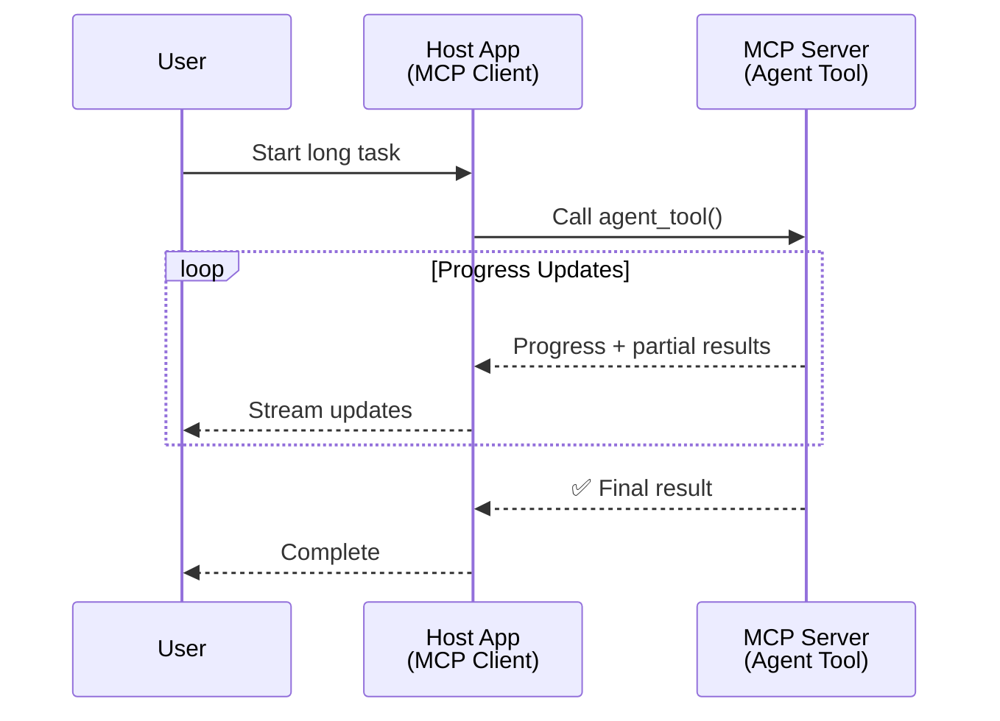
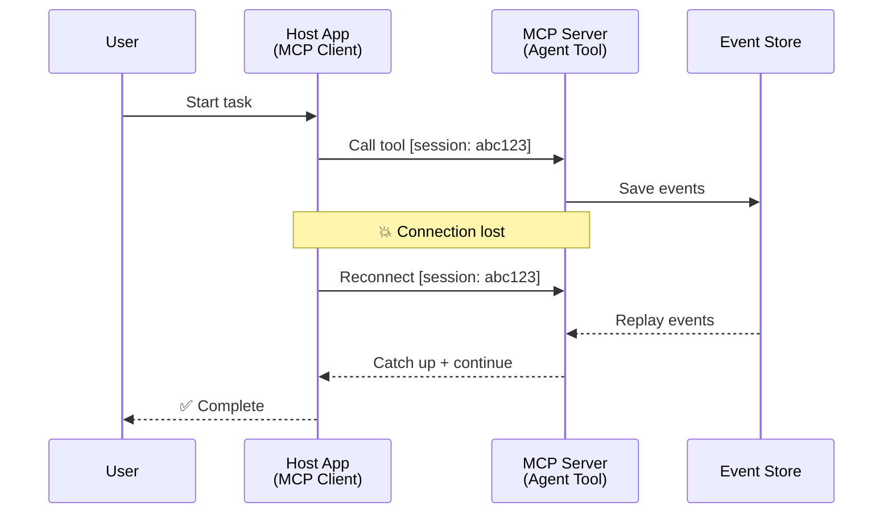
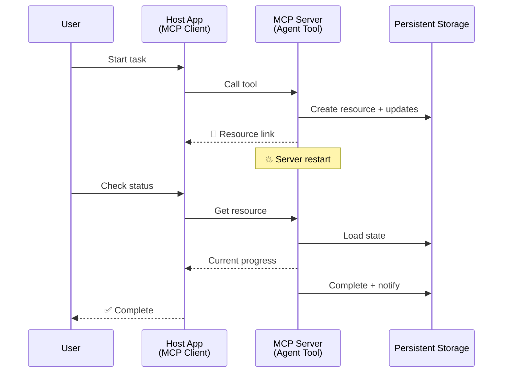
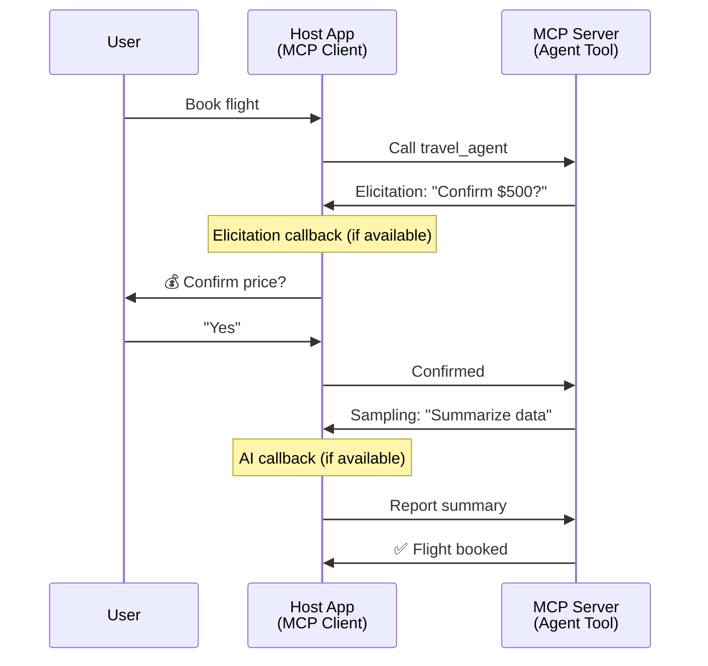
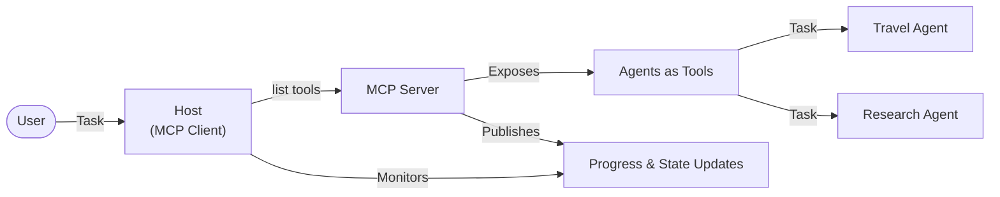

<!--
CO_OP_TRANSLATOR_METADATA:
{
  "original_hash": "5cc6836626047aa055e8960c8484a7d0",
  "translation_date": "2025-08-30T14:44:11+00:00",
  "source_file": "11-agentic-protocols/code_samples/mcp-agents/README.md",
  "language_code": "es"
}
-->
# Construyendo Sistemas de Comunicación entre Agentes con MCP

> Resumen rápido - ¿Puedes construir comunicación entre agentes con MCP? ¡Sí!

MCP ha evolucionado significativamente más allá de su objetivo original de "proporcionar contexto a LLMs". Con mejoras recientes como [streams reanudables](https://modelcontextprotocol.io/docs/concepts/transports#resumability-and-redelivery), [elicitación](https://modelcontextprotocol.io/specification/2025-06-18/client/elicitation), [muestreo](https://modelcontextprotocol.io/specification/2025-06-18/client/sampling) y notificaciones ([progreso](https://modelcontextprotocol.io/specification/2025-06-18/basic/utilities/progress) y [recursos](https://modelcontextprotocol.io/specification/2025-06-18/schema#resourceupdatednotification)), MCP ahora proporciona una base sólida para construir sistemas complejos de comunicación entre agentes.

## La Falacia del Agente/Herramienta

A medida que más desarrolladores exploran herramientas con comportamientos agentivos (ejecutarse por largos períodos, requerir entrada adicional durante la ejecución, etc.), una falacia común es que MCP es inadecuado, principalmente porque los primeros ejemplos de su primitiva de herramientas se centraban en patrones simples de solicitud-respuesta.

Esta percepción está desactualizada. La especificación de MCP se ha mejorado significativamente en los últimos meses con capacidades que cierran la brecha para construir comportamientos agentivos de larga duración:

- **Streaming y Resultados Parciales**: Actualizaciones de progreso en tiempo real durante la ejecución
- **Reanudabilidad**: Los clientes pueden reconectarse y continuar después de una desconexión
- **Durabilidad**: Los resultados sobreviven a reinicios del servidor (por ejemplo, mediante enlaces de recursos)
- **Multi-turn**: Entrada interactiva durante la ejecución mediante elicitación y muestreo

Estas características pueden componerse para habilitar aplicaciones agentivas y multi-agente complejas, todas desplegadas en el protocolo MCP.

Como referencia, nos referiremos a un agente como una "herramienta" disponible en un servidor MCP. Esto implica la existencia de una aplicación anfitriona que implementa un cliente MCP que establece una sesión con el servidor MCP y puede llamar al agente.

## ¿Qué hace que una herramienta MCP sea "agentiva"?

Antes de profundizar en la implementación, establezcamos qué capacidades de infraestructura se necesitan para soportar agentes de larga duración.

> Definiremos un agente como una entidad que puede operar de manera autónoma durante períodos prolongados, capaz de manejar tareas complejas que pueden requerir múltiples interacciones o ajustes basados en retroalimentación en tiempo real.

### 1. Streaming y Resultados Parciales

Los patrones tradicionales de solicitud-respuesta no funcionan para tareas de larga duración. Los agentes necesitan proporcionar:

- Actualizaciones de progreso en tiempo real
- Resultados intermedios

**Soporte MCP**: Las notificaciones de actualización de recursos permiten transmitir resultados parciales, aunque esto requiere un diseño cuidadoso para evitar conflictos con el modelo de solicitud/respuesta 1:1 de JSON-RPC.

| Característica             | Caso de Uso                                                                                                                                                                       | Soporte MCP                                                                                |
| -------------------------- | ------------------------------------------------------------------------------------------------------------------------------------------------------------------------------ | ------------------------------------------------------------------------------------------ |
| Actualizaciones de Progreso en Tiempo Real | El usuario solicita una tarea de migración de código. El agente transmite el progreso: "10% - Analizando dependencias... 25% - Convirtiendo archivos TypeScript... 50% - Actualizando importaciones..."          | ✅ Notificaciones de progreso                                                                  |
| Resultados Parciales            | La tarea "Generar un libro" transmite resultados parciales, por ejemplo, 1) Esquema del arco de la historia, 2) Lista de capítulos, 3) Cada capítulo a medida que se completa. El anfitrión puede inspeccionar, cancelar o redirigir en cualquier etapa. | ✅ Las notificaciones pueden "extenderse" para incluir resultados parciales, ver propuestas en PR 383, 776 |

<div align="center" style="font-style: italic; font-size: 0.95em; margin-bottom: 0.5em;">
<strong>Figura 1:</strong> Este diagrama ilustra cómo un agente MCP transmite actualizaciones de progreso en tiempo real y resultados parciales a la aplicación anfitriona durante una tarea de larga duración, permitiendo al usuario monitorear la ejecución en tiempo real.
</div>



### 2. Reanudabilidad

Los agentes deben manejar interrupciones de red de manera eficiente:

- Reconectarse después de una desconexión (del cliente)
- Continuar desde donde se quedaron (reenvío de mensajes)

**Soporte MCP**: El transporte StreamableHTTP de MCP actualmente soporta la reanudación de sesiones y el reenvío de mensajes con IDs de sesión y últimos IDs de eventos. Es importante señalar que el servidor debe implementar un EventStore que permita la reproducción de eventos en la reconexión del cliente.  
Cabe destacar que hay una propuesta comunitaria (PR #975) que explora streams reanudables independientes del transporte.

| Característica      | Caso de Uso                                                                                                                                                   | Soporte MCP                                                                |
| ------------ | ---------------------------------------------------------------------------------------------------------------------------------------------------------- | -------------------------------------------------------------------------- |
| Reanudabilidad | El cliente se desconecta durante una tarea de larga duración. Al reconectarse, la sesión se reanuda con eventos perdidos reproducidos, continuando sin problemas desde donde se quedó. | ✅ Transporte StreamableHTTP con IDs de sesión, reproducción de eventos y EventStore |

<div align="center" style="font-style: italic; font-size: 0.95em; margin-bottom: 0.5em;">
<strong>Figura 2:</strong> Este diagrama muestra cómo el transporte StreamableHTTP de MCP y el EventStore permiten una reanudación de sesión sin problemas: si el cliente se desconecta, puede reconectarse y reproducir eventos perdidos, continuando la tarea sin pérdida de progreso.
</div>



### 3. Durabilidad

Los agentes de larga duración necesitan estado persistente:

- Los resultados sobreviven a reinicios del servidor
- El estado puede recuperarse fuera de banda
- Seguimiento del progreso entre sesiones

**Soporte MCP**: MCP ahora soporta un tipo de retorno de enlace de recurso para llamadas de herramientas. Hoy en día, un patrón posible es diseñar una herramienta que cree un recurso y devuelva inmediatamente un enlace de recurso. La herramienta puede continuar abordando la tarea en segundo plano y actualizar el recurso. A su vez, el cliente puede optar por consultar el estado de este recurso para obtener resultados parciales o completos (basados en las actualizaciones de recursos que proporciona el servidor) o suscribirse al recurso para recibir notificaciones de actualización.

Una limitación aquí es que consultar recursos o suscribirse a actualizaciones puede consumir recursos con implicaciones a escala. Existe una propuesta comunitaria abierta (incluyendo #992) que explora la posibilidad de incluir webhooks o disparadores que el servidor pueda llamar para notificar al cliente/aplicación anfitriona sobre actualizaciones.

| Característica    | Caso de Uso                                                                                                                                        | Soporte MCP                                                        |
| ---------- | ----------------------------------------------------------------------------------------------------------------------------------------------- | ------------------------------------------------------------------ |
| Durabilidad | El servidor se bloquea durante una tarea de migración de datos. Los resultados y el progreso sobreviven al reinicio, el cliente puede verificar el estado y continuar desde el recurso persistente. | ✅ Enlaces de recursos con almacenamiento persistente y notificaciones de estado |

Hoy en día, un patrón común es diseñar una herramienta que cree un recurso y devuelva inmediatamente un enlace de recurso. La herramienta puede abordar la tarea en segundo plano, emitir notificaciones de recursos que sirvan como actualizaciones de progreso o incluir resultados parciales, y actualizar el contenido en el recurso según sea necesario.

<div align="center" style="font-style: italic; font-size: 0.95em; margin-bottom: 0.5em;">
<strong>Figura 3:</strong> Este diagrama demuestra cómo los agentes MCP utilizan recursos persistentes y notificaciones de estado para garantizar que las tareas de larga duración sobrevivan a reinicios del servidor, permitiendo a los clientes verificar el progreso y recuperar resultados incluso después de fallos.
</div>



### 4. Interacciones Multi-Turn

Los agentes a menudo necesitan entrada adicional durante la ejecución:

- Aclaración o aprobación humana
- Asistencia de IA para decisiones complejas
- Ajuste dinámico de parámetros

**Soporte MCP**: Totalmente soportado mediante muestreo (para entrada de IA) y elicitación (para entrada humana).

| Característica                 | Caso de Uso                                                                                                                                     | Soporte MCP                                           |
| ----------------------- | -------------------------------------------------------------------------------------------------------------------------------------------- | ----------------------------------------------------- |
| Interacciones Multi-Turn | El agente de reserva de viajes solicita confirmación de precios al usuario, luego pide a la IA que resuma los datos de viaje antes de completar la transacción de reserva. | ✅ Elicitación para entrada humana, muestreo para entrada de IA |

<div align="center" style="font-style: italic; font-size: 0.95em; margin-bottom: 0.5em;">
<strong>Figura 4:</strong> Este diagrama muestra cómo los agentes MCP pueden solicitar interactivamente entrada humana o asistencia de IA durante la ejecución, apoyando flujos de trabajo complejos y multi-turn como confirmaciones y toma de decisiones dinámicas.
</div>



## Implementación de Agentes de Larga Duración en MCP - Resumen de Código

Como parte de este artículo, proporcionamos un [repositorio de código](https://github.com/victordibia/ai-tutorials/tree/main/MCP%20Agents) que contiene una implementación completa de agentes de larga duración utilizando el SDK de MCP en Python con transporte StreamableHTTP para reanudación de sesiones y reenvío de mensajes. La implementación demuestra cómo las capacidades de MCP pueden componerse para habilitar comportamientos sofisticados similares a los de un agente.

Específicamente, implementamos un servidor con dos herramientas principales de agentes:

- **Agente de Viajes** - Simula un servicio de reserva de viajes con confirmación de precios mediante elicitación
- **Agente de Investigación** - Realiza tareas de investigación con resúmenes asistidos por IA mediante muestreo

Ambos agentes demuestran actualizaciones de progreso en tiempo real, confirmaciones interactivas y capacidades completas de reanudación de sesiones.

### Conceptos Clave de Implementación

Las siguientes secciones muestran la implementación del agente en el lado del servidor y el manejo del anfitrión en el lado del cliente para cada capacidad:

#### Streaming y Actualizaciones de Progreso - Estado de Tarea en Tiempo Real

El streaming permite a los agentes proporcionar actualizaciones de progreso en tiempo real durante tareas de larga duración, manteniendo a los usuarios informados sobre el estado de la tarea y los resultados intermedios.

**Implementación del Servidor (el agente envía notificaciones de progreso):**

```python
# From server/server.py - Travel agent sending progress updates
for i, step in enumerate(steps):
    await ctx.session.send_progress_notification(
        progress_token=ctx.request_id,
        progress=i * 25,
        total=100,
        message=step,
        related_request_id=str(ctx.request_id)
    )
    await anyio.sleep(2)  # Simulate work

# Alternative: Log messages for detailed step-by-step updates
await ctx.session.send_log_message(
    level="info",
    data=f"Processing step {current_step}/{steps} ({progress_percent}%)",
    logger="long_running_agent",
    related_request_id=ctx.request_id,
)
```

**Implementación del Cliente (el anfitrión recibe actualizaciones de progreso):**

```python
# From client/client.py - Client handling real-time notifications
async def message_handler(message) -> None:
    if isinstance(message, types.ServerNotification):
        if isinstance(message.root, types.LoggingMessageNotification):
            console.print(f"📡 [dim]{message.root.params.data}[/dim]")
        elif isinstance(message.root, types.ProgressNotification):
            progress = message.root.params
            console.print(f"🔄 [yellow]{progress.message} ({progress.progress}/{progress.total})[/yellow]")

# Register message handler when creating session
async with ClientSession(
    read_stream, write_stream,
    message_handler=message_handler
) as session:
```

#### Elicitación - Solicitar Entrada del Usuario

La elicitación permite a los agentes solicitar entrada del usuario durante la ejecución. Esto es esencial para confirmaciones, aclaraciones o aprobaciones durante tareas de larga duración.

**Implementación del Servidor (el agente solicita confirmación):**

```python
# From server/server.py - Travel agent requesting price confirmation
elicit_result = await ctx.session.elicit(
    message=f"Please confirm the estimated price of $1200 for your trip to {destination}",
    requestedSchema=PriceConfirmationSchema.model_json_schema(),
    related_request_id=ctx.request_id,
)

if elicit_result and elicit_result.action == "accept":
    # Continue with booking
    logger.info(f"User confirmed price: {elicit_result.content}")
elif elicit_result and elicit_result.action == "decline":
    # Cancel the booking
    booking_cancelled = True
```

**Implementación del Cliente (el anfitrión proporciona un callback de elicitación):**

```python
# From client/client.py - Client handling elicitation requests
async def elicitation_callback(context, params):
    console.print(f"💬 Server is asking for confirmation:")
    console.print(f"   {params.message}")

    response = console.input("Do you accept? (y/n): ").strip().lower()

    if response in ['y', 'yes']:
        return types.ElicitResult(
            action="accept",
            content={"confirm": True, "notes": "Confirmed by user"}
        )
    else:
        return types.ElicitResult(
            action="decline",
            content={"confirm": False, "notes": "Declined by user"}
        )

# Register the callback when creating the session
async with ClientSession(
    read_stream, write_stream,
    elicitation_callback=elicitation_callback
) as session:
```

#### Muestreo - Solicitar Asistencia de IA

El muestreo permite a los agentes solicitar asistencia de LLM para decisiones complejas o generación de contenido durante la ejecución. Esto habilita flujos de trabajo híbridos humano-IA.

**Implementación del Servidor (el agente solicita asistencia de IA):**

```python
# From server/server.py - Research agent requesting AI summary
sampling_result = await ctx.session.create_message(
    messages=[
        SamplingMessage(
            role="user",
            content=TextContent(type="text", text=f"Please summarize the key findings for research on: {topic}")
        )
    ],
    max_tokens=100,
    related_request_id=ctx.request_id,
)

if sampling_result and sampling_result.content:
    if sampling_result.content.type == "text":
        sampling_summary = sampling_result.content.text
        logger.info(f"Received sampling summary: {sampling_summary}")
```

**Implementación del Cliente (el anfitrión proporciona un callback de muestreo):**

```python
# From client/client.py - Client handling sampling requests
async def sampling_callback(context, params):
    message_text = params.messages[0].content.text if params.messages else 'No message'
    console.print(f"🧠 Server requested sampling: {message_text}")

    # In a real application, this could call an LLM API
    # For demo purposes, we provide a mock response
    mock_response = "Based on current research, MCP has evolved significantly..."

    return types.CreateMessageResult(
        role="assistant",
        content=types.TextContent(type="text", text=mock_response),
        model="interactive-client",
        stopReason="endTurn"
    )

# Register the callback when creating the session
async with ClientSession(
    read_stream, write_stream,
    sampling_callback=sampling_callback,
    elicitation_callback=elicitation_callback
) as session:
```

#### Reanudabilidad - Continuidad de Sesión tras Desconexiones

La reanudabilidad asegura que las tareas de agentes de larga duración puedan sobrevivir a desconexiones del cliente y continuar sin problemas tras la reconexión. Esto se implementa mediante almacenes de eventos y tokens de reanudación.

**Implementación del Almacén de Eventos (el servidor mantiene el estado de la sesión):**

```python
# From server/event_store.py - Simple in-memory event store
class SimpleEventStore(EventStore):
    def __init__(self):
        self._events: list[tuple[StreamId, EventId, JSONRPCMessage]] = []
        self._event_id_counter = 0

    async def store_event(self, stream_id: StreamId, message: JSONRPCMessage) -> EventId:
        """Store an event and return its ID."""
        self._event_id_counter += 1
        event_id = str(self._event_id_counter)
        self._events.append((stream_id, event_id, message))
        return event_id

    async def replay_events_after(self, last_event_id: EventId, send_callback: EventCallback) -> StreamId | None:
        """Replay events after the specified ID for resumption."""
        # Find events after the last known event and replay them
        for _, event_id, message in self._events[start_index:]:
            await send_callback(EventMessage(message, event_id))

# From server/server.py - Passing event store to session manager
def create_server_app(event_store: Optional[EventStore] = None) -> Starlette:
    server = ResumableServer()

    # Create session manager with event store for resumption
    session_manager = StreamableHTTPSessionManager(
        app=server,
        event_store=event_store,  # Event store enables session resumption
        json_response=False,
        security_settings=security_settings,
    )

    return Starlette(routes=[Mount("/mcp", app=session_manager.handle_request)])

# Usage: Initialize with event store
event_store = SimpleEventStore()
app = create_server_app(event_store)
```

**Metadatos del Cliente con Token de Reanudación (el cliente se reconecta usando el estado almacenado):**

```python
# From client/client.py - Client resumption with metadata
if existing_tokens and existing_tokens.get("resumption_token"):
    # Use existing resumption token to continue where we left off
    metadata = ClientMessageMetadata(
        resumption_token=existing_tokens["resumption_token"],
    )
else:
    # Create callback to save resumption token when received
    def enhanced_callback(token: str):
        protocol_version = getattr(session, 'protocol_version', None)
        token_manager.save_tokens(session_id, token, protocol_version, command, args)

    metadata = ClientMessageMetadata(
        on_resumption_token_update=enhanced_callback,
    )

# Send request with resumption metadata
result = await session.send_request(
    types.ClientRequest(
        types.CallToolRequest(
            method="tools/call",
            params=types.CallToolRequestParams(name=command, arguments=args)
        )
    ),
    types.CallToolResult,
    metadata=metadata,
)
```

La aplicación anfitriona mantiene IDs de sesión y tokens de reanudación localmente, permitiéndole reconectarse a sesiones existentes sin perder progreso o estado.

### Organización del Código

<div align="center" style="font-style: italic; font-size: 0.95em; margin-bottom: 0.5em;">
<strong>Figura 5:</strong> Arquitectura del sistema de agentes basado en MCP
</div>



**Archivos Clave:**

- **`server/server.py`** - Servidor MCP reanudable con agentes de viajes e investigación que demuestran elicitación, muestreo y actualizaciones de progreso
- **`client/client.py`** - Aplicación anfitriona interactiva con soporte de reanudación, manejadores de callbacks y gestión de tokens
- **`server/event_store.py`** - Implementación del almacén de eventos que habilita la reanudación de sesiones y el reenvío de mensajes

## Extensión a Comunicación Multi-Agente en MCP

La implementación anterior puede extenderse a sistemas multi-agente mejorando la inteligencia y el alcance de la aplicación anfitriona:

- **Descomposición Inteligente de Tareas**: El anfitrión analiza solicitudes complejas de usuarios y las divide en subtareas para diferentes agentes especializados
- **Coordinación Multi-Servidor**: El anfitrión mantiene conexiones con múltiples servidores MCP, cada uno exponiendo diferentes capacidades de agentes
- **Gestión del Estado de Tareas**: El anfitrión rastrea el progreso entre múltiples tareas concurrentes de agentes, manejando dependencias y secuencias
- **Resiliencia y Reintentos**: El anfitrión gestiona fallos, implementa lógica de reintento y redirige tareas cuando los agentes no están disponibles
- **Síntesis de Resultados**: El anfitrión combina salidas de múltiples agentes en resultados finales coherentes

El anfitrión evoluciona de un cliente simple a un orquestador inteligente, coordinando capacidades distribuidas de agentes mientras mantiene la misma base del protocolo MCP.

## Conclusión

Las capacidades mejoradas de MCP - notificaciones de recursos, elicitación/muestreo, streams reanudables y recursos persistentes - habilitan interacciones complejas entre agentes mientras mantienen la simplicidad del protocolo.

## Comenzando

¿Listo para construir tu propio sistema de comunicación entre agentes? Sigue estos pasos:

### 1. Ejecuta la Demo

```bash
# Start the server with event store for resumption
python -m server.server --port 8006

# In another terminal, run the interactive client
python -m client.client --url http://127.0.0.1:8006/mcp
```

**Comandos disponibles en modo interactivo:**

- `travel_agent` - Reserva viajes con confirmación de precios mediante elicitación
- `research_agent` - Investiga temas con resúmenes asistidos por IA mediante muestreo
- `list` - Muestra todas las herramientas disponibles
- `clean-tokens` - Limpia tokens de reanudación
- `help` - Muestra ayuda detallada de comandos
- `quit` - Salir del cliente

### 2. Prueba las Capacidades de Reanudación

- Inicia un agente de larga duración (por ejemplo, `travel_agent`)
- Interrumpe el cliente durante la ejecución (Ctrl+C)
- Reinicia el cliente - se reanudará automáticamente desde donde se quedó

### 3. Explora y Extiende

- **Explora los ejemplos**: Revisa este [mcp-agents](https://github.com/victordibia/ai-tutorials/tree/main/MCP%20Agents)
- **Únete a la comunidad**: Participa en discusiones sobre MCP en GitHub
- **Experimenta**: Comienza con una tarea simple de larga duración y gradualmente agrega streaming, reanudabilidad y coordinación multi-agente

Esto demuestra cómo MCP habilita comportamientos inteligentes de agentes mientras mantiene la simplicidad basada en herramientas.

En general, la especificación del protocolo MCP está evolucionando rápidamente; se anima al lector a revisar el sitio web oficial de documentación para las actualizaciones más recientes - https://modelcontextprotocol.io/introduction

---

**Descargo de responsabilidad**:  
Este documento ha sido traducido utilizando el servicio de traducción automática [Co-op Translator](https://github.com/Azure/co-op-translator). Si bien nos esforzamos por lograr precisión, tenga en cuenta que las traducciones automáticas pueden contener errores o imprecisiones. El documento original en su idioma nativo debe considerarse como la fuente autorizada. Para información crítica, se recomienda una traducción profesional realizada por humanos. No nos hacemos responsables de malentendidos o interpretaciones erróneas que puedan surgir del uso de esta traducción.