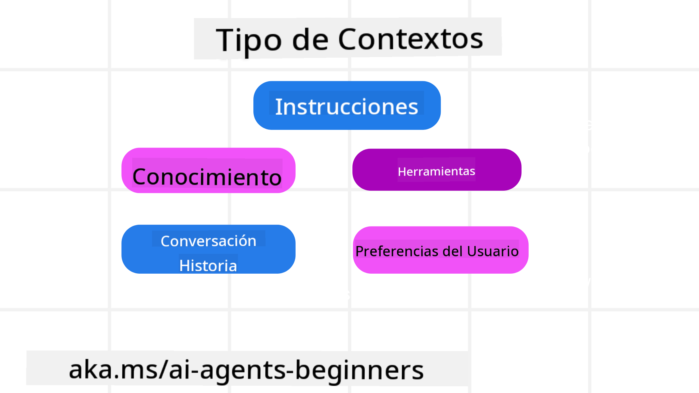
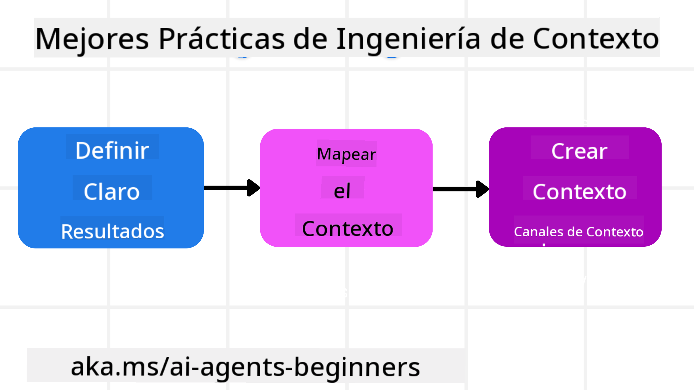

<!--
CO_OP_TRANSLATOR_METADATA:
{
  "original_hash": "cb7e50f471905ce6fdb92a30269a7a98",
  "translation_date": "2025-09-04T09:36:04+00:00",
  "source_file": "12-context-engineering/README.md",
  "language_code": "es"
}
-->
# Ingeniería de Contexto para Agentes de IA

> _(Haz clic en la imagen de arriba para ver el video de esta lección)_

Entender la complejidad de la aplicación para la que estás construyendo un agente de IA es importante para crear uno confiable. Necesitamos construir agentes de IA que gestionen eficazmente la información para abordar necesidades complejas más allá de la ingeniería de prompts.

En esta lección, exploraremos qué es la ingeniería de contexto y su papel en la construcción de agentes de IA.

## Introducción

Esta lección cubrirá:

• **Qué es la Ingeniería de Contexto** y por qué es diferente de la ingeniería de prompts.

• **Estrategias para una Ingeniería de Contexto efectiva**, incluyendo cómo escribir, seleccionar, comprimir y aislar información.

• **Fallos comunes de contexto** que pueden descarrilar tu agente de IA y cómo solucionarlos.

## Objetivos de Aprendizaje

Después de completar esta lección, comprenderás cómo:

• **Definir la ingeniería de contexto** y diferenciarla de la ingeniería de prompts.

• **Identificar los componentes clave del contexto** en aplicaciones de Modelos de Lenguaje Extenso (LLM).

• **Aplicar estrategias para escribir, seleccionar, comprimir y aislar el contexto** para mejorar el rendimiento del agente.

• **Reconocer fallos comunes de contexto** como envenenamiento, distracción, confusión y conflicto, e implementar técnicas de mitigación.

## ¿Qué es la Ingeniería de Contexto?

Para los agentes de IA, el contexto es lo que impulsa la planificación del agente para tomar ciertas acciones. La Ingeniería de Contexto es la práctica de asegurarse de que el agente de IA tenga la información adecuada para completar el siguiente paso de la tarea. La ventana de contexto tiene un tamaño limitado, por lo que, como constructores de agentes, necesitamos desarrollar sistemas y procesos para gestionar la adición, eliminación y condensación de la información en la ventana de contexto.

### Ingeniería de Prompts vs Ingeniería de Contexto

La ingeniería de prompts se centra en un conjunto único de instrucciones estáticas para guiar eficazmente a los agentes de IA con un conjunto de reglas. La ingeniería de contexto trata sobre cómo gestionar un conjunto dinámico de información, incluyendo el prompt inicial, para garantizar que el agente de IA tenga lo que necesita con el tiempo. La idea principal de la ingeniería de contexto es hacer que este proceso sea repetible y confiable.

### Tipos de Contexto

Es importante recordar que el contexto no es solo una cosa. La información que el agente de IA necesita puede provenir de una variedad de fuentes diferentes, y depende de nosotros asegurarnos de que el agente tenga acceso a estas fuentes:

Los tipos de contexto que un agente de IA podría necesitar gestionar incluyen:

• **Instrucciones:** Son como las "reglas" del agente: prompts, mensajes del sistema, ejemplos few-shot (mostrando al agente cómo hacer algo) y descripciones de herramientas que puede usar. Aquí es donde la ingeniería de prompts se combina con la ingeniería de contexto.

• **Conocimiento:** Esto incluye hechos, información recuperada de bases de datos o recuerdos a largo plazo que el agente ha acumulado. Esto incluye integrar un sistema de Generación Aumentada por Recuperación (RAG) si un agente necesita acceso a diferentes almacenes de conocimiento y bases de datos.

• **Herramientas:** Son las definiciones de funciones externas, APIs y servidores MCP que el agente puede llamar, junto con los resultados que obtiene al usarlas.

• **Historial de Conversación:** El diálogo continuo con un usuario. Con el tiempo, estas conversaciones se vuelven más largas y complejas, lo que significa que ocupan espacio en la ventana de contexto.

• **Preferencias del Usuario:** Información aprendida sobre los gustos o disgustos de un usuario a lo largo del tiempo. Estas podrían almacenarse y utilizarse al tomar decisiones clave para ayudar al usuario.

## Estrategias para una Ingeniería de Contexto Efectiva

### Estrategias de Planificación

Una buena ingeniería de contexto comienza con una buena planificación. Aquí hay un enfoque que te ayudará a pensar cómo aplicar el concepto de ingeniería de contexto:

1. **Definir Resultados Claros** - Los resultados de las tareas que se asignarán a los agentes de IA deben estar claramente definidos. Responde a la pregunta: "¿Cómo será el mundo cuando el agente de IA haya terminado su tarea?". En otras palabras, ¿qué cambio, información o respuesta debería tener el usuario después de interactuar con el agente de IA?

2. **Mapear el Contexto** - Una vez que hayas definido los resultados del agente de IA, necesitas responder a la pregunta: "¿Qué información necesita el agente de IA para completar esta tarea?". De esta manera, puedes comenzar a mapear el contexto de dónde se puede ubicar esa información.

3. **Crear Tuberías de Contexto** - Ahora que sabes dónde está la información, necesitas responder a la pregunta: "¿Cómo obtendrá el agente esta información?". Esto se puede hacer de varias maneras, incluyendo RAG, uso de servidores MCP y otras herramientas.

### Estrategias Prácticas

La planificación es importante, pero una vez que la información comienza a fluir hacia la ventana de contexto de nuestro agente, necesitamos tener estrategias prácticas para gestionarla:

#### Gestión del Contexto

Aunque parte de la información se añadirá automáticamente a la ventana de contexto, la ingeniería de contexto trata de tomar un papel más activo en esta información, lo cual se puede hacer mediante algunas estrategias:

1. **Bloc de Notas del Agente**  
   Esto permite que un agente de IA tome notas de información relevante sobre las tareas actuales y las interacciones con el usuario durante una sola sesión. Esto debería existir fuera de la ventana de contexto en un archivo u objeto de tiempo de ejecución que el agente pueda recuperar más tarde durante esta sesión si es necesario.

2. **Memorias**  
   Los blocs de notas son buenos para gestionar información fuera de la ventana de contexto de una sola sesión. Las memorias permiten a los agentes almacenar y recuperar información relevante a lo largo de múltiples sesiones. Esto podría incluir resúmenes, preferencias del usuario y comentarios para mejoras futuras.

3. **Compresión de Contexto**  
   Una vez que la ventana de contexto crece y se acerca a su límite, se pueden usar técnicas como la resumización y el recorte. Esto incluye mantener solo la información más relevante o eliminar mensajes más antiguos.

4. **Sistemas Multi-Agente**  
   Desarrollar sistemas multi-agente es una forma de ingeniería de contexto porque cada agente tiene su propia ventana de contexto. Cómo se comparte y pasa ese contexto entre diferentes agentes es otro aspecto a planificar al construir estos sistemas.

5. **Entornos de Prueba**  
   Si un agente necesita ejecutar algún código o procesar grandes cantidades de información en un documento, esto puede consumir una gran cantidad de tokens para procesar los resultados. En lugar de almacenar todo esto en la ventana de contexto, el agente puede usar un entorno de prueba que pueda ejecutar este código y solo leer los resultados y otra información relevante.

6. **Objetos de Estado en Tiempo de Ejecución**  
   Esto se hace creando contenedores de información para gestionar situaciones en las que el agente necesita tener acceso a cierta información. Para una tarea compleja, esto permitiría al agente almacenar los resultados de cada subtarea paso a paso, manteniendo el contexto conectado solo a esa subtarea específica.

### Ejemplo de Ingeniería de Contexto

Supongamos que queremos que un agente de IA **"Reserve un viaje a París."**

• Un agente simple que solo utiliza ingeniería de prompts podría responder: **"De acuerdo, ¿cuándo te gustaría ir a París?"**. Solo procesó tu pregunta directa en el momento en que el usuario la hizo.

• Un agente que utiliza las estrategias de ingeniería de contexto cubiertas haría mucho más. Antes de responder, su sistema podría:

  ◦ **Revisar tu calendario** para fechas disponibles (recuperando datos en tiempo real).

  ◦ **Recordar preferencias de viajes anteriores** (de memoria a largo plazo), como tu aerolínea preferida, presupuesto o si prefieres vuelos directos.

  ◦ **Identificar herramientas disponibles** para reservar vuelos y hoteles.

- Luego, una respuesta de ejemplo podría ser: "Hola [Tu Nombre]! Veo que estás libre la primera semana de octubre. ¿Debería buscar vuelos directos a París en [Aerolínea Preferida] dentro de tu presupuesto habitual de [Presupuesto]?". Esta respuesta más rica y consciente del contexto demuestra el poder de la ingeniería de contexto.

## Fallos Comunes de Contexto

### Envenenamiento de Contexto

**Qué es:** Cuando una alucinación (información falsa generada por el LLM) o un error entra en el contexto y se referencia repetidamente, causando que el agente persiga metas imposibles o desarrolle estrategias sin sentido.

**Qué hacer:** Implementar **validación de contexto** y **cuarentena**. Validar la información antes de agregarla a la memoria a largo plazo. Si se detecta un posible envenenamiento, iniciar hilos de contexto nuevos para evitar que la información incorrecta se propague.

**Ejemplo de Reserva de Viaje:** Tu agente alucina un **vuelo directo desde un pequeño aeropuerto local a una ciudad internacional distante** que en realidad no ofrece vuelos internacionales. Este detalle inexistente se guarda en el contexto. Más tarde, cuando pides al agente que reserve, sigue intentando encontrar boletos para esta ruta imposible, lo que lleva a errores repetidos.

**Solución:** Implementar un paso que **valide la existencia de vuelos y rutas con una API en tiempo real** _antes_ de agregar el detalle del vuelo al contexto de trabajo del agente. Si la validación falla, la información errónea se "pone en cuarentena" y no se utiliza más.

### Distracción de Contexto

**Qué es:** Cuando el contexto se vuelve tan grande que el modelo se enfoca demasiado en el historial acumulado en lugar de usar lo que aprendió durante el entrenamiento, lo que lleva a acciones repetitivas o poco útiles. Los modelos pueden comenzar a cometer errores incluso antes de que la ventana de contexto esté llena.

**Qué hacer:** Usar **resumización de contexto**. Comprimir periódicamente la información acumulada en resúmenes más cortos, manteniendo detalles importantes mientras se elimina el historial redundante. Esto ayuda a "reiniciar" el enfoque.

**Ejemplo de Reserva de Viaje:** Has estado discutiendo varios destinos de viaje soñados durante mucho tiempo, incluyendo un relato detallado de tu viaje de mochilero de hace dos años. Cuando finalmente pides **"encuéntrame un vuelo barato para el próximo mes"**, el agente se atasca en los detalles antiguos e irrelevantes y sigue preguntando sobre tu equipo de mochilero o itinerarios pasados, descuidando tu solicitud actual.

**Solución:** Después de cierto número de turnos o cuando el contexto crece demasiado, el agente debería **resumir las partes más recientes y relevantes de la conversación** – enfocándose en tus fechas y destino actuales – y usar ese resumen condensado para la próxima llamada al LLM, descartando el chat histórico menos relevante.

### Confusión de Contexto

**Qué es:** Cuando el contexto innecesario, a menudo en forma de demasiadas herramientas disponibles, causa que el modelo genere respuestas incorrectas o llame herramientas irrelevantes. Los modelos más pequeños son especialmente propensos a esto.

**Qué hacer:** Implementar **gestión de herramientas** usando técnicas RAG. Almacenar descripciones de herramientas en una base de datos vectorial y seleccionar _solo_ las herramientas más relevantes para cada tarea específica. Las investigaciones muestran que limitar las selecciones de herramientas a menos de 30 es efectivo.

**Ejemplo de Reserva de Viaje:** Tu agente tiene acceso a docenas de herramientas: `reservar_vuelo`, `reservar_hotel`, `alquilar_auto`, `buscar_tours`, `convertidor_moneda`, `pronóstico_clima`, `reservas_restaurantes`, etc. Preguntas, **"¿Cuál es la mejor manera de moverse por París?"** Debido a la gran cantidad de herramientas, el agente se confunde e intenta llamar `reservar_vuelo` _dentro_ de París, o `alquilar_auto` aunque prefieres transporte público, porque las descripciones de herramientas podrían superponerse o simplemente no puede discernir la mejor.

**Solución:** Usar **RAG sobre descripciones de herramientas**. Cuando preguntas sobre moverse por París, el sistema recupera dinámicamente _solo_ las herramientas más relevantes como `alquilar_auto` o `info_transporte_publico` según tu consulta, presentando un "equipo" de herramientas enfocado al LLM.

### Conflicto de Contexto

**Qué es:** Cuando existe información conflictiva dentro del contexto, lo que lleva a razonamientos inconsistentes o respuestas finales incorrectas. Esto ocurre a menudo cuando la información llega en etapas y las suposiciones iniciales incorrectas permanecen en el contexto.

**Qué hacer:** Usar **poda de contexto** y **descarga**. La poda significa eliminar información obsoleta o conflictiva a medida que llegan nuevos detalles. La descarga da al modelo un espacio de trabajo separado para procesar información sin saturar el contexto principal.

**Ejemplo de Reserva de Viaje:** Inicialmente le dices a tu agente, **"Quiero volar en clase económica."** Más tarde en la conversación, cambias de opinión y dices, **"En realidad, para este viaje, vamos en clase ejecutiva."** Si ambas instrucciones permanecen en el contexto, el agente podría recibir resultados de búsqueda conflictivos o confundirse sobre qué preferencia priorizar.

**Solución:** Implementar **poda de contexto**. Cuando una nueva instrucción contradice una anterior, la instrucción más antigua se elimina o se anula explícitamente en el contexto. Alternativamente, el agente puede usar un **bloc de notas** para reconciliar preferencias conflictivas antes de decidir, asegurando que solo la instrucción final y consistente guíe sus acciones.

## ¿Tienes Más Preguntas Sobre Ingeniería de Contexto?

Únete al [Discord de Azure AI Foundry](https://aka.ms/ai-agents/discord) para conectarte con otros estudiantes, asistir a horas de oficina y resolver tus dudas sobre agentes de IA.

---

**Descargo de responsabilidad**:  
Este documento ha sido traducido utilizando el servicio de traducción automática [Co-op Translator](https://github.com/Azure/co-op-translator). Si bien nos esforzamos por lograr precisión, tenga en cuenta que las traducciones automáticas pueden contener errores o imprecisiones. El documento original en su idioma nativo debe considerarse como la fuente autorizada. Para información crítica, se recomienda una traducción profesional realizada por humanos. No nos hacemos responsables de malentendidos o interpretaciones erróneas que puedan surgir del uso de esta traducción.