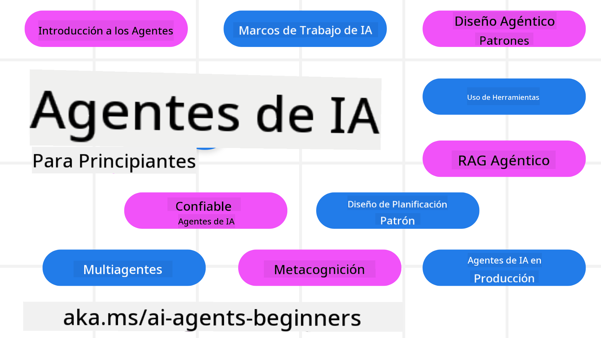

<!--
CO_OP_TRANSLATOR_METADATA:
{
  "original_hash": "6b07046397366e6f6f4524c9ddeba1e1",
  "translation_date": "2025-07-12T14:40:05+00:00",
  "source_file": "README.md",
  "language_code": "es"
}
-->
# Agentes de IA para Principiantes - Un Curso

## 11 Lecciones que enseñan todo lo que necesitas saber para empezar a construir Agentes de IA

### 🌐 Soporte Multilingüe

#### Soportado mediante GitHub Action (Automatizado y Siempre Actualizado)

[Francés](../fr/README.md) | [Español](./README.md) | [Alemán](../de/README.md) | [Ruso](../ru/README.md) | [Árabe](../ar/README.md) | [Persa (Farsi)](../fa/README.md) | [Urdu](../ur/README.md) | [Chino (Simplificado)](../zh/README.md) | [Chino (Tradicional, Macao)](../mo/README.md) | [Chino (Tradicional, Hong Kong)](../hk/README.md) | [Chino (Tradicional, Taiwán)](../tw/README.md) | [Japonés](../ja/README.md) | [Coreano](../ko/README.md) | [Hindi](../hi/README.md) | [Bengalí](../bn/README.md) | [Maratí](../mr/README.md) | [Nepalí](../ne/README.md) | [Punjabi (Gurmukhi)](../pa/README.md) | [Portugués (Portugal)](../pt/README.md) | [Portugués (Brasil)](../br/README.md) | [Italiano](../it/README.md) | [Polaco](../pl/README.md) | [Turco](../tr/README.md) | [Griego](../el/README.md) | [Tailandés](../th/README.md) | [Sueco](../sv/README.md) | [Danés](../da/README.md) | [Noruego](../no/README.md) | [Finlandés](../fi/README.md) | [Neerlandés](../nl/README.md) | [Hebreo](../he/README.md) | [Vietnamita](../vi/README.md) | [Indonesio](../id/README.md) | [Malayo](../ms/README.md) | [Tagalo (Filipino)](../tl/README.md) | [Swahili](../sw/README.md) | [Húngaro](../hu/README.md) | [Checo](../cs/README.md) | [Eslovaco](../sk/README.md) | [Rumano](../ro/README.md) | [Búlgaro](../bg/README.md) | [Serbio (Cirílico)](../sr/README.md) | [Croata](../hr/README.md) | [Esloveno](../sl/README.md) | [Ucraniano](../uk/README.md) | [Birmano (Myanmar)](../my/README.md)

**Si deseas que se añadan más idiomas de traducción, están listados [aquí](https://github.com/Azure/co-op-translator/blob/main/getting_started/supported-languages.md)**

## 🌱 Comenzando

Este curso tiene 11 lecciones que cubren los fundamentos para construir Agentes de IA. Cada lección trata un tema diferente, ¡así que empieza por donde quieras!

Este curso cuenta con soporte multilingüe. Consulta los [idiomas disponibles aquí](../..).

Si es la primera vez que trabajas con modelos de IA Generativa, revisa nuestro curso [Generative AI For Beginners](https://aka.ms/genai-beginners), que incluye 21 lecciones sobre cómo construir con GenAI.

No olvides [darle una estrella (🌟) a este repositorio](https://docs.github.com/en/get-started/exploring-projects-on-github/saving-repositories-with-stars?WT.mc_id=academic-105485-koreyst) y [hacer un fork de este repositorio](https://github.com/microsoft/ai-agents-for-beginners/fork) para ejecutar el código.

### Lo que necesitas

Cada lección de este curso incluye ejemplos de código, que puedes encontrar en la carpeta code_samples. Puedes [hacer un fork de este repositorio](https://github.com/microsoft/ai-agents-for-beginners/fork) para crear tu propia copia.

Los ejemplos de código en estos ejercicios utilizan Azure AI Foundry y GitHub Model Catalogs para interactuar con modelos de lenguaje:

- [Github Models](https://aka.ms/ai-agents-beginners/github-models) - Gratis / Limitado
- [Azure AI Foundry](https://aka.ms/ai-agents-beginners/ai-foundry) - Se requiere cuenta de Azure

Este curso también utiliza los siguientes frameworks y servicios de Agentes de IA de Microsoft:

- [Azure AI Agent Service](https://aka.ms/ai-agents-beginners/ai-agent-service)
- [Semantic Kernel](https://aka.ms/ai-agents-beginners/semantic-kernel)
- [AutoGen](https://aka.ms/ai-agents/autogen)

Para más información sobre cómo ejecutar el código de este curso, visita la sección de [Configuración del Curso](./00-course-setup/README.md).

## 🙏 ¿Quieres ayudar?

¿Tienes sugerencias o encontraste errores ortográficos o en el código? [Abre un issue](https://github.com/microsoft/ai-agents-for-beginners/issues?WT.mc_id=academic-105485-koreyst) o [crea un pull request](https://github.com/microsoft/ai-agents-for-beginners/pulls?WT.mc_id=academic-105485-koreyst).

Si te quedas atascado o tienes preguntas sobre cómo construir Agentes de IA, únete a nuestro [Discord de la Comunidad Azure AI Foundry](https://discord.gg/kzRShWzttr).

Si tienes comentarios sobre el producto o errores mientras construyes, visita nuestro [Foro de Desarrolladores de Azure AI Foundry](https://aka.ms/azureaifoundry/forum).

## 📂 Cada lección incluye

- Una lección escrita ubicada en el README y un video corto
- Ejemplos de código en Python que soportan Azure AI Foundry y Github Models (Gratis)
- Enlaces a recursos adicionales para continuar aprendiendo

## 🗃️ Lecciones

| **Lección**                              | **Texto y Código**                                 | **Video**                                                  | **Aprendizaje Extra**                                                                 |
|------------------------------------------|----------------------------------------------------|------------------------------------------------------------|----------------------------------------------------------------------------------------|
| Introducción a Agentes de IA y Casos de Uso | [Enlace](./01-intro-to-ai-agents/README.md)        | [Video](https://youtu.be/3zgm60bXmQk?si=z8QygFvYQv-9WtO1)  | [Enlace](https://aka.ms/ai-agents-beginners/collection?WT.mc_id=academic-105485-koreyst) |
| Explorando Frameworks Agénticos           | [Enlace](./02-explore-agentic-frameworks/README.md) | [Video](https://youtu.be/ODwF-EZo_O8?si=Vawth4hzVaHv-u0H)  | [Enlace](https://aka.ms/ai-agents-beginners/collection?WT.mc_id=academic-105485-koreyst) |
| Entendiendo Patrones de Diseño Agéntico  | [Enlace](./03-agentic-design-patterns/README.md)   | [Video](https://youtu.be/m9lM8qqoOEA?si=BIzHwzstTPL8o9GF)  | [Enlace](https://aka.ms/ai-agents-beginners/collection?WT.mc_id=academic-105485-koreyst) |
| Patrón de Diseño para Uso de Herramientas | [Enlace](./04-tool-use/README.md)                  | [Video](https://youtu.be/vieRiPRx-gI?si=2z6O2Xu2cu_Jz46N)  | [Enlace](https://aka.ms/ai-agents-beginners/collection?WT.mc_id=academic-105485-koreyst) |
| Agentic RAG                              | [Enlace](./05-agentic-rag/README.md)               | [Video](https://youtu.be/WcjAARvdL7I?si=gKPWsQpKiIlDH9A3)  | [Enlace](https://aka.ms/ai-agents-beginners/collection?WT.mc_id=academic-105485-koreyst) |
| Construyendo Agentes de IA Confiables    | [Enlace](./06-building-trustworthy-agents/README.md) | [Video](https://youtu.be/iZKkMEGBCUQ?si=jZjpiMnGFOE9L8OK ) | [Enlace](https://aka.ms/ai-agents-beginners/collection?WT.mc_id=academic-105485-koreyst) |
| Patrón de Diseño de Planificación        | [Enlace](./07-planning-design/README.md)           | [Video](https://youtu.be/kPfJ2BrBCMY?si=6SC_iv_E5-mzucnC)  | [Enlace](https://aka.ms/ai-agents-beginners/collection?WT.mc_id=academic-105485-koreyst) |
| Patrón de Diseño Multi-Agente             | [Enlace](./08-multi-agent/README.md)               | [Video](https://youtu.be/V6HpE9hZEx0?si=rMgDhEu7wXo2uo6g)  | [Enlace](https://aka.ms/ai-agents-beginners/collection?WT.mc_id=academic-105485-koreyst) |
| Patrón de Diseño de Metacognición         | [Enlace](./09-metacognition/README.md)             | [Video](https://youtu.be/His9R6gw6Ec?si=8gck6vvdSNCt6OcF)  | [Enlace](https://aka.ms/ai-agents-beginners/collection?WT.mc_id=academic-105485-koreyst) |
| Agentes de IA en Producción               | [Enlace](./10-ai-agents-production/README.md)      | [Video](https://youtu.be/l4TP6IyJxmQ?si=31dnhexRo6yLRJDl)  | [Enlace](https://aka.ms/ai-agents-beginners/collection?WT.mc_id=academic-105485-koreyst) |
| Agentes de IA con MCP                      | [Enlace](./11-mcp/README.md)                       |                                                            | [Enlace](https://aka.ms/mcp-for-beginners)                                             |

## 🎒 Otros Cursos

¡Nuestro equipo produce otros cursos! Échales un vistazo:
- [**NUEVO** Protocolo de Contexto de Modelo (MCP) para Principiantes](https://github.com/microsoft/mcp-for-beginners?WT.mc_id=academic-105485-koreyst)
- [IA Generativa para Principiantes usando .NET](https://github.com/microsoft/Generative-AI-for-beginners-dotnet?WT.mc_id=academic-105485-koreyst)
- [IA Generativa para Principiantes](https://github.com/microsoft/generative-ai-for-beginners?WT.mc_id=academic-105485-koreyst)
- [ML para Principiantes](https://aka.ms/ml-beginners?WT.mc_id=academic-105485-koreyst)
- [Ciencia de Datos para Principiantes](https://aka.ms/datascience-beginners?WT.mc_id=academic-105485-koreyst)
- [IA para Principiantes](https://aka.ms/ai-beginners?WT.mc_id=academic-105485-koreyst)
- [Ciberseguridad para Principiantes](https://github.com/microsoft/Security-101??WT.mc_id=academic-96948-sayoung)
- [Desarrollo Web para Principiantes](https://aka.ms/webdev-beginners?WT.mc_id=academic-105485-koreyst)
- [IoT para Principiantes](https://aka.ms/iot-beginners?WT.mc_id=academic-105485-koreyst)
- [Desarrollo XR para Principiantes](https://github.com/microsoft/xr-development-for-beginners?WT.mc_id=academic-105485-koreyst)
- [Domina GitHub Copilot para Programación en Pareja con IA](https://aka.ms/GitHubCopilotAI?WT.mc_id=academic-105485-koreyst)
- [Domina GitHub Copilot para Desarrolladores C#/.NET](https://github.com/microsoft/mastering-github-copilot-for-dotnet-csharp-developers?WT.mc_id=academic-105485-koreyst)
- [Elige Tu Propia Aventura con Copilot](https://github.com/microsoft/CopilotAdventures?WT.mc_id=academic-105485-koreyst)

## 🌟 Agradecimientos de la Comunidad

Gracias a [Shivam Goyal](https://www.linkedin.com/in/shivam2003/) por contribuir con importantes ejemplos de código que demuestran Agentic RAG.

## Contribuciones

Este proyecto acepta contribuciones y sugerencias. La mayoría de las contribuciones requieren que aceptes un
Acuerdo de Licencia de Contribuidor (CLA) declarando que tienes el derecho y realmente otorgas
los derechos para que usemos tu contribución. Para más detalles, visita
<https://cla.opensource.microsoft.com>.

Cuando envíes un pull request, un bot de CLA determinará automáticamente si necesitas proporcionar
un CLA y marcará el PR adecuadamente (por ejemplo, verificación de estado, comentario). Simplemente sigue las instrucciones
que te dé el bot. Solo tendrás que hacer esto una vez para todos los repositorios que usan nuestro CLA.

Este proyecto ha adoptado el [Código de Conducta de Código Abierto de Microsoft](https://opensource.microsoft.com/codeofconduct/).
Para más información, consulta las [Preguntas Frecuentes sobre el Código de Conducta](https://opensource.microsoft.com/codeofconduct/faq/) o
contacta a [opencode@microsoft.com](mailto:opencode@microsoft.com) para cualquier pregunta o comentario adicional.

## Marcas Registradas

Este proyecto puede contener marcas registradas o logotipos de proyectos, productos o servicios. El uso autorizado de marcas o logotipos de Microsoft está sujeto y debe seguir
las [Directrices de Marcas y Marca Registrada de Microsoft](https://www.microsoft.com/legal/intellectualproperty/trademarks/usage/general).
El uso de marcas o logotipos de Microsoft en versiones modificadas de este proyecto no debe causar confusión ni implicar patrocinio de Microsoft.
Cualquier uso de marcas o logotipos de terceros está sujeto a las políticas de esos terceros.

**Aviso legal**:  
Este documento ha sido traducido utilizando el servicio de traducción automática [Co-op Translator](https://github.com/Azure/co-op-translator). Aunque nos esforzamos por la precisión, tenga en cuenta que las traducciones automáticas pueden contener errores o inexactitudes. El documento original en su idioma nativo debe considerarse la fuente autorizada. Para información crítica, se recomienda la traducción profesional realizada por humanos. No nos hacemos responsables de malentendidos o interpretaciones erróneas derivadas del uso de esta traducción.