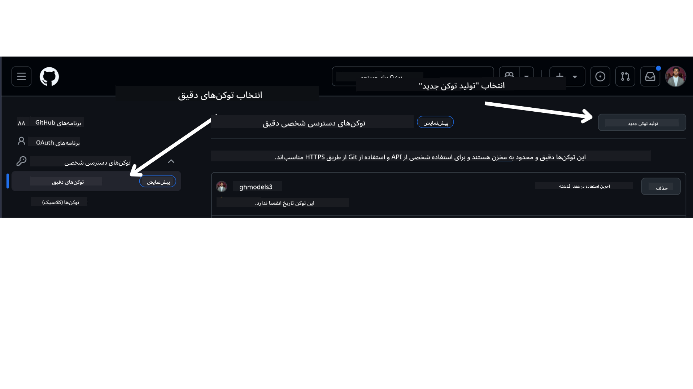

<!--
CO_OP_TRANSLATOR_METADATA:
{
  "original_hash": "76945069b52a49cd0432ae3e0b0ba22e",
  "translation_date": "2025-07-12T07:43:53+00:00",
  "source_file": "00-course-setup/README.md",
  "language_code": "fa"
}
-->
در حساب کاربری GitHub خود.

گزینه `Fine-grained tokens` را در سمت چپ صفحه انتخاب کنید.

سپس گزینه `Generate new token` را انتخاب کنید.



از شما خواسته می‌شود نامی برای توکن خود وارد کنید، تاریخ انقضا را انتخاب کنید (توصیه شده: ۳۰ روز) و دامنه‌های دسترسی توکن را انتخاب کنید (مخازن عمومی).

همچنین لازم است مجوزهای این توکن را ویرایش کنید: Permissions -> Models -> اجازه دسترسی به مدل‌های GitHub

توکن جدیدی که ساخته‌اید را کپی کنید. اکنون باید این توکن را در فایل `.env` که در این دوره وجود دارد، اضافه کنید.

### مرحله ۲: ایجاد فایل `.env`

برای ایجاد فایل `.env` دستور زیر را در ترمینال خود اجرا کنید.

```bash
cp .env.example .env
```

این دستور فایل نمونه را کپی کرده و یک فایل `.env` در دایرکتوری شما ایجاد می‌کند که در آن می‌توانید مقادیر متغیرهای محیطی را وارد کنید.

پس از کپی کردن توکن، فایل `.env` را در ویرایشگر متن مورد علاقه خود باز کرده و توکن را در فیلد `GITHUB_TOKEN` جای‌گذاری کنید.

اکنون باید بتوانید نمونه‌های کد این دوره را اجرا کنید.

## تنظیم نمونه‌ها با استفاده از Azure AI Foundry و Azure AI Agent Service

### مرحله ۱: دریافت Endpoint پروژه Azure خود

مراحل ایجاد هاب و پروژه در Azure AI Foundry را در اینجا دنبال کنید: [مرور منابع هاب](https://learn.microsoft.com/en-us/azure/ai-foundry/concepts/ai-resources)

پس از ایجاد پروژه، باید رشته اتصال پروژه خود را دریافت کنید.

این کار با رفتن به صفحه **Overview** پروژه در پورتال Azure AI Foundry انجام می‌شود.


### مرحله ۲: ایجاد فایل `.env`

برای ایجاد فایل `.env` دستور زیر را در ترمینال خود اجرا کنید.

```bash
cp .env.example .env
```

این دستور فایل نمونه را کپی کرده و یک فایل `.env` در دایرکتوری شما ایجاد می‌کند که در آن می‌توانید مقادیر متغیرهای محیطی را وارد کنید.

پس از کپی کردن توکن، فایل `.env` را در ویرایشگر متن مورد علاقه خود باز کرده و توکن را در فیلد `PROJECT_ENDPOINT` جای‌گذاری کنید.

### مرحله ۳: ورود به Azure

به عنوان یک بهترین روش امنیتی، از [احراز هویت بدون کلید](https://learn.microsoft.com/azure/developer/ai/keyless-connections?tabs=csharp%2Cazure-cli?WT.mc_id=academic-105485-koreyst) برای احراز هویت به Azure OpenAI با Microsoft Entra ID استفاده خواهیم کرد. قبل از انجام این کار، ابتدا باید **Azure CLI** را طبق [دستورالعمل نصب](https://learn.microsoft.com/cli/azure/install-azure-cli?WT.mc_id=academic-105485-koreyst) برای سیستم عامل خود نصب کنید.

سپس ترمینال را باز کرده و دستور `az login --use-device-code` را برای ورود به حساب Azure خود اجرا کنید.

پس از ورود، اشتراک خود را در ترمینال انتخاب کنید.

## متغیرهای محیطی اضافی - Azure Search و Azure OpenAI

برای درس Agentic RAG - درس ۵ - نمونه‌هایی وجود دارد که از Azure Search و Azure OpenAI استفاده می‌کنند.

اگر می‌خواهید این نمونه‌ها را اجرا کنید، باید متغیرهای محیطی زیر را به فایل `.env` خود اضافه کنید:

### صفحه Overview (پروژه)

- `AZURE_SUBSCRIPTION_ID` - در بخش **Project details** صفحه **Overview** پروژه خود بررسی کنید.

- `AZURE_AI_PROJECT_NAME` - در بالای صفحه **Overview** پروژه خود مشاهده کنید.

- `AZURE_OPENAI_SERVICE` - در تب **Included capabilities** برای **Azure OpenAI Service** در صفحه **Overview** پیدا کنید.

### مرکز مدیریت

- `AZURE_OPENAI_RESOURCE_GROUP` - در بخش **Project properties** صفحه **Overview** مرکز مدیریت.

- `GLOBAL_LLM_SERVICE` - در بخش **Connected resources** نام اتصال **Azure AI Services** را پیدا کنید. اگر موجود نبود، در **Azure portal** در گروه منابع خود نام منبع AI Services را بررسی کنید.

### صفحه Models + Endpoints

- `AZURE_OPENAI_EMBEDDING_DEPLOYMENT_NAME` - مدل embedding خود (مثلاً `text-embedding-ada-002`) را انتخاب کرده و نام **Deployment** را از جزئیات مدل یادداشت کنید.

- `AZURE_OPENAI_CHAT_DEPLOYMENT_NAME` - مدل چت خود (مثلاً `gpt-4o-mini`) را انتخاب کرده و نام **Deployment** را از جزئیات مدل یادداشت کنید.

### پورتال Azure

- `AZURE_OPENAI_ENDPOINT` - به بخش **Azure AI services** بروید، روی آن کلیک کنید، سپس به **Resource Management**، **Keys and Endpoint** بروید، به پایین صفحه "Azure OpenAI endpoints" اسکرول کنید و آن موردی که "Language APIs" نوشته شده را کپی کنید.

- `AZURE_OPENAI_API_KEY` - از همان صفحه، کلید KEY 1 یا KEY 2 را کپی کنید.

- `AZURE_SEARCH_SERVICE_ENDPOINT` - منبع **Azure AI Search** خود را پیدا کرده، روی آن کلیک کنید و بخش **Overview** را ببینید.

- `AZURE_SEARCH_API_KEY` - سپس به بخش **Settings** و بعد **Keys** بروید و کلید اصلی یا ثانویه مدیر را کپی کنید.

### صفحه وب خارجی

- `AZURE_OPENAI_API_VERSION` - صفحه [چرخه عمر نسخه API](https://learn.microsoft.com/en-us/azure/ai-services/openai/api-version-deprecation#latest-ga-api-release) را در بخش **Latest GA API release** مشاهده کنید.

### راه‌اندازی احراز هویت بدون کلید

به جای وارد کردن مستقیم اطلاعات ورود، از اتصال بدون کلید با Azure OpenAI استفاده خواهیم کرد. برای این کار، `DefaultAzureCredential` را وارد کرده و بعداً تابع `DefaultAzureCredential` را برای دریافت اعتبارنامه فراخوانی می‌کنیم.

```python
from azure.identity import DefaultAzureCredential, InteractiveBrowserCredential
```

## گیر کرده‌اید؟

اگر در اجرای این تنظیمات به مشکلی برخوردید، به کانال ما در

یا

مراجعه کنید.

.

## درس بعدی

اکنون آماده‌اید کدهای این دوره را اجرا کنید. یادگیری خوبی درباره دنیای عامل‌های هوش مصنوعی برای شما آرزو می‌کنیم!

[مقدمه‌ای بر عامل‌های هوش مصنوعی و موارد استفاده از عامل‌ها](../01-intro-to-ai-agents/README.md)

**سلب مسئولیت**:  
این سند با استفاده از سرویس ترجمه هوش مصنوعی [Co-op Translator](https://github.com/Azure/co-op-translator) ترجمه شده است. در حالی که ما در تلاش برای دقت هستیم، لطفاً توجه داشته باشید که ترجمه‌های خودکار ممکن است حاوی خطاها یا نواقصی باشند. سند اصلی به زبان بومی خود باید به عنوان منبع معتبر در نظر گرفته شود. برای اطلاعات حیاتی، ترجمه حرفه‌ای انسانی توصیه می‌شود. ما مسئول هیچ گونه سوءتفاهم یا تفسیر نادرستی که از استفاده از این ترجمه ناشی شود، نیستیم.