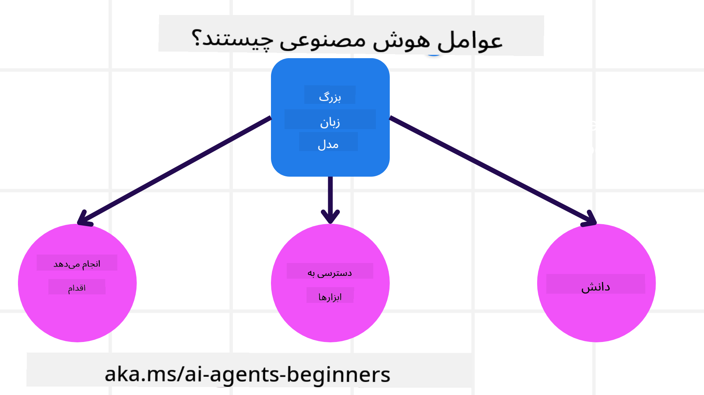
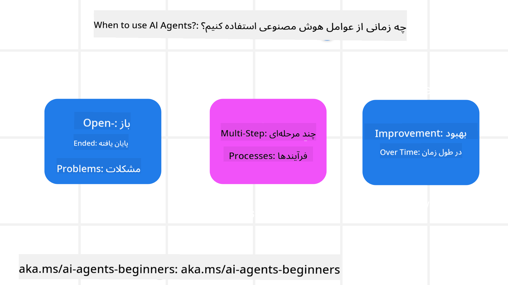

<!--
CO_OP_TRANSLATOR_METADATA:
{
  "original_hash": "d84943abc8f001ad4670418d32c2d899",
  "translation_date": "2025-07-12T08:01:34+00:00",
  "source_file": "01-intro-to-ai-agents/README.md",
  "language_code": "fa"
}
-->
برای ملاقات با سایر یادگیرندگان و سازندگان AI Agent و پرسیدن هر سوالی که درباره این دوره دارید.

برای شروع این دوره، ابتدا به درک بهتری از AI Agentها و نحوه استفاده از آن‌ها در برنامه‌ها و جریان‌های کاری که می‌سازیم، می‌پردازیم.

## مقدمه

این درس شامل موارد زیر است:

- AI Agentها چیستند و انواع مختلف آن‌ها کدامند؟
- بهترین موارد استفاده برای AI Agentها چیست و چگونه می‌توانند به ما کمک کنند؟
- برخی از بلوک‌های پایه‌ای در طراحی راه‌حل‌های عاملی چیستند؟

## اهداف یادگیری
پس از اتمام این درس، باید بتوانید:

- مفاهیم AI Agent را درک کنید و تفاوت آن‌ها را با سایر راه‌حل‌های هوش مصنوعی بفهمید.
- AI Agentها را به شکل بهینه به کار ببرید.
- راه‌حل‌های عاملی را به صورت مؤثر برای کاربران و مشتریان طراحی کنید.

## تعریف AI Agentها و انواع آن‌ها

### AI Agentها چیستند؟

AI Agentها **سیستم‌هایی** هستند که به **مدل‌های زبانی بزرگ (LLMها)** امکان می‌دهند تا با گسترش قابلیت‌هایشان، **اقداماتی انجام دهند**؛ این کار با دادن **دسترسی به ابزارها** و **دانش** به LLMها انجام می‌شود.

بیایید این تعریف را به بخش‌های کوچکتر تقسیم کنیم:

- **سیستم** - مهم است که به عامل‌ها فقط به عنوان یک جزء منفرد نگاه نکنیم، بلکه به عنوان سیستمی متشکل از چندین جزء. در سطح پایه، اجزای یک AI Agent عبارتند از:
  - **محیط** - فضای تعریف شده‌ای که AI Agent در آن فعالیت می‌کند. برای مثال، اگر یک AI Agent رزرو سفر داشته باشیم، محیط می‌تواند سیستم رزرو سفر باشد که AI Agent برای انجام وظایف از آن استفاده می‌کند.
  - **حسگرها** - محیط‌ها اطلاعات دارند و بازخورد ارائه می‌دهند. AI Agentها از حسگرها برای جمع‌آوری و تفسیر این اطلاعات درباره وضعیت فعلی محیط استفاده می‌کنند. در مثال AI Agent رزرو سفر، سیستم رزرو می‌تواند اطلاعاتی مانند در دسترس بودن هتل یا قیمت پروازها را ارائه دهد.
  - **عملگرها** - وقتی AI Agent وضعیت فعلی محیط را دریافت می‌کند، برای انجام وظیفه فعلی، تصمیم می‌گیرد چه عملی انجام دهد تا محیط را تغییر دهد. برای AI Agent رزرو سفر، ممکن است رزرو یک اتاق موجود برای کاربر باشد.

**مدل‌های زبانی بزرگ** - مفهوم عامل‌ها قبل از ایجاد LLMها وجود داشت. مزیت ساخت AI Agent با LLMها توانایی آن‌ها در تفسیر زبان انسان و داده‌ها است. این توانایی به LLMها امکان می‌دهد اطلاعات محیطی را تفسیر کرده و برنامه‌ای برای تغییر محیط تعریف کنند.

**انجام اقدامات** - خارج از سیستم‌های AI Agent، LLMها محدود به موقعیت‌هایی هستند که اقدام فقط تولید محتوا یا اطلاعات بر اساس درخواست کاربر است. در سیستم‌های AI Agent، LLMها می‌توانند با تفسیر درخواست کاربر و استفاده از ابزارهای موجود در محیط خود، وظایف را انجام دهند.

**دسترسی به ابزارها** - اینکه LLM به چه ابزارهایی دسترسی دارد، توسط 1) محیطی که در آن فعالیت می‌کند و 2) توسعه‌دهنده AI Agent تعیین می‌شود. در مثال AI Agent سفر، ابزارهای عامل محدود به عملیات موجود در سیستم رزرو و/یا توسعه‌دهنده می‌تواند دسترسی عامل به ابزارهای پرواز را محدود کند.

**حافظه + دانش** - حافظه می‌تواند کوتاه‌مدت در زمینه گفتگو بین کاربر و عامل باشد. در بلندمدت، خارج از اطلاعات ارائه شده توسط محیط، AI Agentها می‌توانند دانش را از سیستم‌ها، خدمات، ابزارها و حتی سایر عامل‌ها بازیابی کنند. در مثال AI Agent سفر، این دانش می‌تواند اطلاعات ترجیحات سفر کاربر باشد که در پایگاه داده مشتریان ذخیره شده است.

### انواع مختلف AI Agentها

حالا که تعریف کلی AI Agentها را داریم، بیایید به برخی انواع خاص عامل‌ها و نحوه کاربرد آن‌ها در AI Agent رزرو سفر نگاه کنیم.

| **نوع عامل**                 | **توضیح**                                                                                                                           | **مثال**                                                                                                                                                                                                                     |
| ---------------------------- | ----------------------------------------------------------------------------------------------------------------------------------- | ----------------------------------------------------------------------------------------------------------------------------------------------------------------------------------------------------------------------------- |
| **عامل‌های واکنشی ساده**      | اقدامات فوری بر اساس قوانین از پیش تعریف شده انجام می‌دهند.                                                                        | AI Agent سفر متن ایمیل را تفسیر کرده و شکایات سفر را به خدمات مشتری ارجاع می‌دهد.                                                                                                                                             |
| **عامل‌های واکنشی مبتنی بر مدل** | اقدامات را بر اساس مدل جهان و تغییرات آن مدل انجام می‌دهند.                                                                        | AI Agent سفر مسیرهایی با تغییرات قیمت قابل توجه را بر اساس دسترسی به داده‌های تاریخی قیمت اولویت‌بندی می‌کند.                                                                                                            |
| **عامل‌های مبتنی بر هدف**     | برنامه‌هایی برای رسیدن به اهداف خاص ایجاد می‌کنند و با تفسیر هدف، اقدامات لازم برای رسیدن به آن را تعیین می‌کنند.                 | AI Agent سفر با تعیین ترتیبات لازم سفر (ماشین، حمل و نقل عمومی، پروازها) از مکان فعلی تا مقصد، سفر را رزرو می‌کند.                                                                                                         |
| **عامل‌های مبتنی بر سودمندی** | ترجیحات را در نظر می‌گیرند و با وزن‌دهی عددی به ملاحظات، نحوه رسیدن به اهداف را تعیین می‌کنند.                                   | AI Agent سفر با وزن‌دهی راحتی در مقابل هزینه، بیشترین سودمندی را هنگام رزرو سفر به دست می‌آورد.                                                                                                                            |
| **عامل‌های یادگیرنده**       | با دریافت بازخورد و تنظیم اقدامات، در طول زمان بهبود می‌یابند.                                                                     | AI Agent سفر با استفاده از بازخورد مشتریان از نظرسنجی‌های پس از سفر، رزروهای آینده را بهبود می‌بخشد.                                                                                                                        |
| **عامل‌های سلسله‌مراتبی**    | شامل چندین عامل در یک سیستم چندسطحی هستند که عامل‌های سطح بالاتر وظایف را به زیر وظایف برای عامل‌های سطح پایین‌تر تقسیم می‌کنند. | AI Agent سفر با تقسیم وظیفه لغو سفر به زیر وظایف (مثلاً لغو رزروهای خاص) و واگذاری آن‌ها به عامل‌های سطح پایین‌تر، که سپس به عامل سطح بالاتر گزارش می‌دهند، سفر را لغو می‌کند.                                            |
| **سیستم‌های چندعاملی (MAS)** | عامل‌ها به صورت مستقل، به صورت همکاری یا رقابتی، وظایف را انجام می‌دهند.                                                           | همکاری: چندین عامل خدمات خاص سفر مانند هتل، پرواز و سرگرمی را رزرو می‌کنند. رقابتی: چندین عامل بر سر تقویم رزرو هتل مشترک رقابت می‌کنند تا مشتریان را در هتل رزرو کنند.                                                  |

## چه زمانی از AI Agentها استفاده کنیم

در بخش قبلی، از مثال AI Agent سفر برای توضیح نحوه استفاده از انواع مختلف عامل‌ها در سناریوهای مختلف رزرو سفر استفاده کردیم. در طول دوره نیز از این برنامه استفاده خواهیم کرد.

بیایید به انواع موارد استفاده‌ای که AI Agentها بهترین کاربرد را دارند نگاه کنیم:

- **مسائل باز و بدون پاسخ مشخص** - اجازه دادن به LLM برای تعیین مراحل لازم برای انجام یک کار، زیرا همیشه نمی‌توان آن را به صورت سخت‌کد در جریان کاری تعریف کرد.
- **فرآیندهای چندمرحله‌ای** - وظایفی که نیاز به پیچیدگی دارند و AI Agent باید در چند مرحله از ابزارها یا اطلاعات استفاده کند، نه فقط بازیابی یکباره.
- **بهبود در طول زمان** - وظایفی که عامل می‌تواند با دریافت بازخورد از محیط یا کاربران، در طول زمان بهبود یابد تا سودمندی بهتری ارائه دهد.

در درس «ساخت AI Agentهای قابل اعتماد» به ملاحظات بیشتری درباره استفاده از AI Agentها می‌پردازیم.

## اصول راه‌حل‌های عاملی

### توسعه عامل

اولین گام در طراحی سیستم AI Agent، تعریف ابزارها، اقدامات و رفتارها است. در این دوره، تمرکز ما بر استفاده از **خدمات Azure AI Agent** برای تعریف عامل‌ها است. این سرویس ویژگی‌هایی مانند:

- انتخاب مدل‌های باز مانند OpenAI، Mistral و Llama
- استفاده از داده‌های دارای مجوز از طریق ارائه‌دهندگانی مانند Tripadvisor
- استفاده از ابزارهای استاندارد OpenAPI 3.0

### الگوهای عاملی

ارتباط با LLMها از طریق پرامپت‌ها انجام می‌شود. با توجه به ماهیت نیمه‌خودکار AI Agentها، همیشه امکان یا نیاز به پرامپت دستی مجدد LLM پس از تغییر در محیط وجود ندارد. ما از **الگوهای عاملی** استفاده می‌کنیم که به ما اجازه می‌دهد LLM را در چند مرحله به روشی مقیاس‌پذیرتر پرامپت کنیم.

این دوره به برخی از الگوهای عاملی محبوب فعلی تقسیم شده است.

### چارچوب‌های عاملی

چارچوب‌های عاملی به توسعه‌دهندگان امکان می‌دهند الگوهای عاملی را از طریق کد پیاده‌سازی کنند. این چارچوب‌ها قالب‌ها، افزونه‌ها و ابزارهایی برای همکاری بهتر AI Agentها ارائه می‌دهند. این مزایا توانایی‌های بهتری برای مشاهده‌پذیری و عیب‌یابی سیستم‌های AI Agent فراهم می‌کنند.

در این دوره، چارچوب تحقیقاتی AutoGen و چارچوب آماده تولید Agent از Semantic Kernel را بررسی خواهیم کرد.

## درس قبلی

[راه‌اندازی دوره](../00-course-setup/README.md)

## درس بعدی

[بررسی چارچوب‌های عاملی](../02-explore-agentic-frameworks/README.md)

**سلب مسئولیت**:  
این سند با استفاده از سرویس ترجمه هوش مصنوعی [Co-op Translator](https://github.com/Azure/co-op-translator) ترجمه شده است. در حالی که ما در تلاش برای دقت هستیم، لطفاً توجه داشته باشید که ترجمه‌های خودکار ممکن است حاوی خطاها یا نواقصی باشند. سند اصلی به زبان بومی خود باید به عنوان منبع معتبر در نظر گرفته شود. برای اطلاعات حیاتی، ترجمه حرفه‌ای انسانی توصیه می‌شود. ما مسئول هیچ گونه سوءتفاهم یا تفسیر نادرستی که از استفاده این ترجمه ناشی شود، نیستیم.