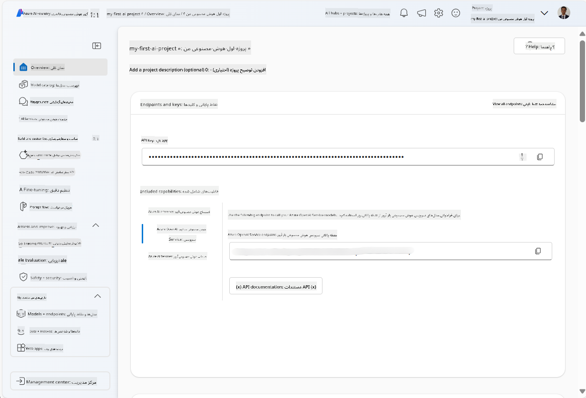
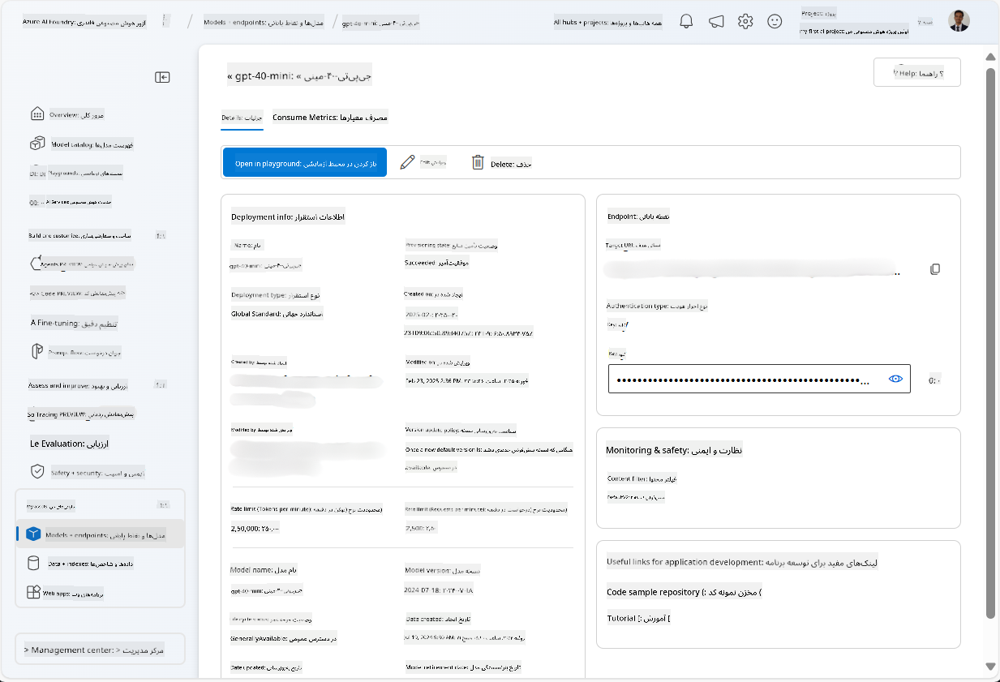
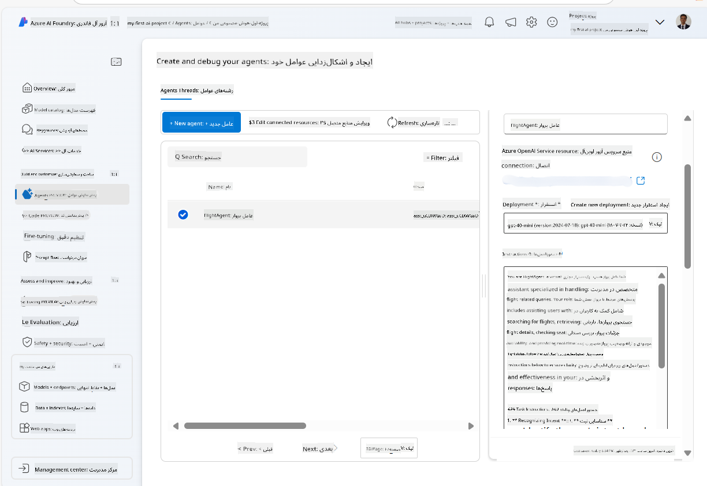
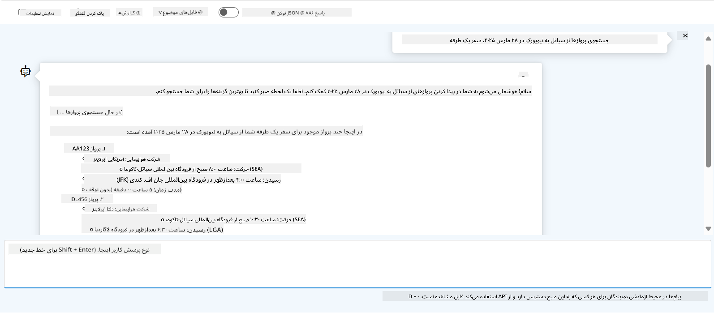

<!--
CO_OP_TRANSLATOR_METADATA:
{
  "original_hash": "7e92870dc0843e13d4dabc620c09d2d9",
  "translation_date": "2025-07-12T08:15:31+00:00",
  "source_file": "02-explore-agentic-frameworks/azure-ai-foundry-agent-creation.md",
  "language_code": "fa"
}
-->
# توسعه سرویس Azure AI Agent

در این تمرین، از ابزارهای سرویس Azure AI Agent در [پرتال Azure AI Foundry](https://ai.azure.com/?WT.mc_id=academic-105485-koreyst) برای ایجاد یک عامل برای رزرو پرواز استفاده می‌کنید. این عامل قادر خواهد بود با کاربران تعامل داشته و اطلاعات مربوط به پروازها را ارائه دهد.

## پیش‌نیازها

برای تکمیل این تمرین، به موارد زیر نیاز دارید:
1. یک حساب Azure با اشتراک فعال. [ساخت حساب به صورت رایگان](https://azure.microsoft.com/free/?WT.mc_id=academic-105485-koreyst).
2. دسترسی برای ایجاد یک هاب Azure AI Foundry یا داشتن هابی که برای شما ایجاد شده باشد.
    - اگر نقش شما Contributor یا Owner است، می‌توانید مراحل این آموزش را دنبال کنید.

## ایجاد یک هاب Azure AI Foundry

> **Note:** Azure AI Foundry قبلاً با نام Azure AI Studio شناخته می‌شد.

1. دستورالعمل‌های موجود در پست وبلاگ [Azure AI Foundry](https://learn.microsoft.com/en-us/azure/ai-studio/?WT.mc_id=academic-105485-koreyst) را برای ایجاد یک هاب Azure AI Foundry دنبال کنید.
2. پس از ایجاد پروژه، هر نکته‌ای که نمایش داده می‌شود را ببندید و صفحه پروژه را در پرتال Azure AI Foundry بررسی کنید که باید مشابه تصویر زیر باشد:

    

## استقرار یک مدل

1. در پنل سمت چپ پروژه خود، در بخش **My assets**، صفحه **Models + endpoints** را انتخاب کنید.
2. در صفحه **Models + endpoints**، در تب **Model deployments**، از منوی **+ Deploy model** گزینه **Deploy base model** را انتخاب کنید.
3. مدل `gpt-4o-mini` را در لیست جستجو کرده، انتخاب و تأیید کنید.

    > **Note**: کاهش TPM به جلوگیری از استفاده بیش از حد از سهمیه اشتراک شما کمک می‌کند.

    

## ایجاد یک عامل

حالا که مدل را مستقر کرده‌اید، می‌توانید یک عامل ایجاد کنید. عامل یک مدل هوش مصنوعی مکالمه‌ای است که می‌تواند برای تعامل با کاربران استفاده شود.

1. در پنل سمت چپ پروژه، در بخش **Build & Customize**، صفحه **Agents** را انتخاب کنید.
2. روی **+ Create agent** کلیک کنید تا یک عامل جدید بسازید. در کادر گفتگوی **Agent Setup**:
    - نامی برای عامل وارد کنید، مثلاً `FlightAgent`.
    - اطمینان حاصل کنید که استقرار مدل `gpt-4o-mini` که قبلاً ایجاد کرده‌اید انتخاب شده باشد.
    - دستورالعمل‌ها را مطابق با پرامپتی که می‌خواهید عامل دنبال کند تنظیم کنید. در اینجا یک نمونه آورده شده است:
    ```
    You are FlightAgent, a virtual assistant specialized in handling flight-related queries. Your role includes assisting users with searching for flights, retrieving flight details, checking seat availability, and providing real-time flight status. Follow the instructions below to ensure clarity and effectiveness in your responses:

    ### Task Instructions:
    1. **Recognizing Intent**:
       - Identify the user's intent based on their request, focusing on one of the following categories:
         - Searching for flights
         - Retrieving flight details using a flight ID
         - Checking seat availability for a specified flight
         - Providing real-time flight status using a flight number
       - If the intent is unclear, politely ask users to clarify or provide more details.
        
    2. **Processing Requests**:
        - Depending on the identified intent, perform the required task:
        - For flight searches: Request details such as origin, destination, departure date, and optionally return date.
        - For flight details: Request a valid flight ID.
        - For seat availability: Request the flight ID and date and validate inputs.
        - For flight status: Request a valid flight number.
        - Perform validations on provided data (e.g., formats of dates, flight numbers, or IDs). If the information is incomplete or invalid, return a friendly request for clarification.

    3. **Generating Responses**:
    - Use a tone that is friendly, concise, and supportive.
    - Provide clear and actionable suggestions based on the output of each task.
    - If no data is found or an error occurs, explain it to the user gently and offer alternative actions (e.g., refine search, try another query).
    
    ```
> [!NOTE]
> برای پرامپت دقیق‌تر، می‌توانید به [این مخزن](https://github.com/ShivamGoyal03/RoamMind) مراجعه کنید.
    
> علاوه بر این، می‌توانید **Knowledge Base** و **Actions** را اضافه کنید تا قابلیت‌های عامل برای ارائه اطلاعات بیشتر و انجام وظایف خودکار بر اساس درخواست‌های کاربر افزایش یابد. برای این تمرین، می‌توانید این مراحل را نادیده بگیرید.
    


3. برای ایجاد یک عامل چندهوش مصنوعی جدید، کافی است روی **New Agent** کلیک کنید. عامل تازه ایجاد شده سپس در صفحه Agents نمایش داده خواهد شد.

## آزمایش عامل

پس از ایجاد عامل، می‌توانید آن را آزمایش کنید تا ببینید چگونه به پرسش‌های کاربران در محیط آزمایشی پرتال Azure AI Foundry پاسخ می‌دهد.

1. در بالای پنل **Setup** برای عامل خود، گزینه **Try in playground** را انتخاب کنید.
2. در پنل **Playground**، می‌توانید با تایپ پرسش‌ها در پنجره چت با عامل تعامل داشته باشید. به عنوان مثال، می‌توانید از عامل بخواهید پروازهای بین سیاتل و نیویورک در تاریخ ۲۸ام را جستجو کند.

    > **Note**: ممکن است عامل پاسخ‌های دقیقی ارائه ندهد، زیرا در این تمرین از داده‌های زنده استفاده نمی‌شود. هدف، آزمایش توانایی عامل در درک و پاسخ به پرسش‌های کاربران بر اساس دستورالعمل‌های داده شده است.

    

3. پس از آزمایش عامل، می‌توانید با افزودن نیت‌های بیشتر، داده‌های آموزشی و اقدامات، قابلیت‌های آن را بیشتر سفارشی کنید.

## پاک‌سازی منابع

وقتی آزمایش عامل به پایان رسید، می‌توانید آن را حذف کنید تا از هزینه‌های اضافی جلوگیری شود.
1. وارد [پرتال Azure](https://portal.azure.com) شوید و محتوای گروه منابعی که هاب و منابع مربوط به این تمرین را در آن مستقر کرده‌اید مشاهده کنید.
2. در نوار ابزار، گزینه **Delete resource group** را انتخاب کنید.
3. نام گروه منابع را وارد کرده و تأیید کنید که می‌خواهید آن را حذف کنید.

## منابع

- [مستندات Azure AI Foundry](https://learn.microsoft.com/en-us/azure/ai-studio/?WT.mc_id=academic-105485-koreyst)
- [پرتال Azure AI Foundry](https://ai.azure.com/?WT.mc_id=academic-105485-koreyst)
- [شروع کار با Azure AI Studio](https://techcommunity.microsoft.com/blog/educatordeveloperblog/getting-started-with-azure-ai-studio/4095602?WT.mc_id=academic-105485-koreyst)
- [مبانی عوامل هوش مصنوعی در Azure](https://learn.microsoft.com/en-us/training/modules/ai-agent-fundamentals/?WT.mc_id=academic-105485-koreyst)
- [Azure AI Discord](https://aka.ms/AzureAI/Discord)

**سلب مسئولیت**:  
این سند با استفاده از سرویس ترجمه هوش مصنوعی [Co-op Translator](https://github.com/Azure/co-op-translator) ترجمه شده است. در حالی که ما در تلاش برای دقت هستیم، لطفاً توجه داشته باشید که ترجمه‌های خودکار ممکن است حاوی خطاها یا نادرستی‌هایی باشند. سند اصلی به زبان بومی خود باید به عنوان منبع معتبر در نظر گرفته شود. برای اطلاعات حیاتی، ترجمه حرفه‌ای انسانی توصیه می‌شود. ما مسئول هیچ گونه سوءتفاهم یا تفسیر نادرستی که از استفاده این ترجمه ناشی شود، نیستیم.