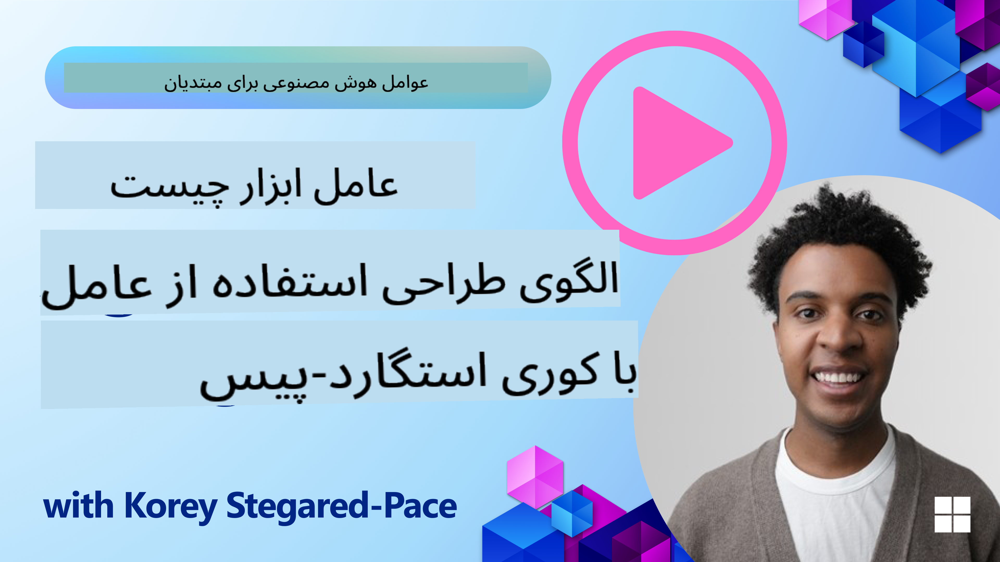
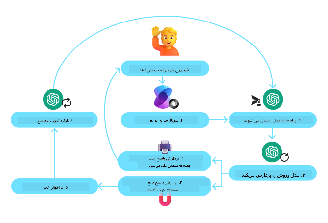
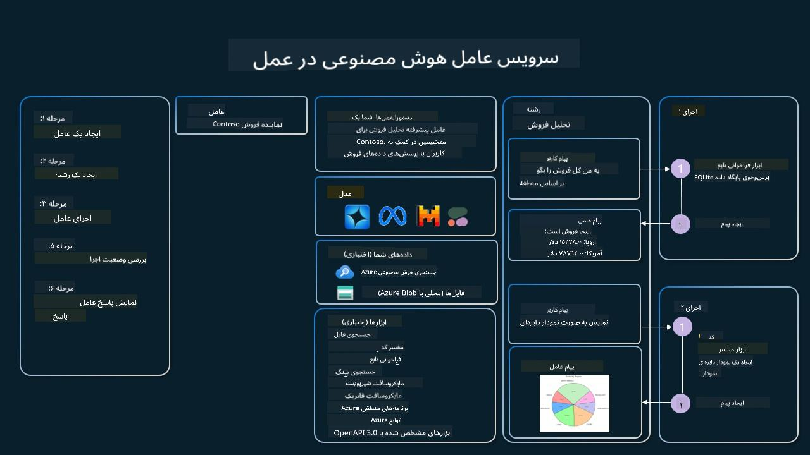

<!--
CO_OP_TRANSLATOR_METADATA:
{
  "original_hash": "88258b03f2893aa2e69eb8fb24baabbc",
  "translation_date": "2025-07-12T09:24:25+00:00",
  "source_file": "04-tool-use/README.md",
  "language_code": "fa"
}
-->
[](https://youtu.be/vieRiPRx-gI?si=cEZ8ApnT6Sus9rhn)

> _(برای مشاهده ویدیو این درس روی تصویر بالا کلیک کنید)_

# الگوی طراحی استفاده از ابزار

ابزارها جالب هستند چون به عامل‌های هوش مصنوعی اجازه می‌دهند دامنه‌ی گسترده‌تری از قابلیت‌ها را داشته باشند. به جای اینکه عامل فقط مجموعه محدودی از اقدامات را انجام دهد، با اضافه کردن یک ابزار، عامل می‌تواند طیف وسیعی از کارها را انجام دهد. در این فصل، به الگوی طراحی استفاده از ابزار می‌پردازیم که توضیح می‌دهد چگونه عامل‌های هوش مصنوعی می‌توانند از ابزارهای خاص برای رسیدن به اهداف خود استفاده کنند.

## مقدمه

در این درس، قصد داریم به سوالات زیر پاسخ دهیم:

- الگوی طراحی استفاده از ابزار چیست؟
- در چه مواردی می‌توان از آن استفاده کرد؟
- عناصر/بلوک‌های سازنده لازم برای پیاده‌سازی این الگو کدامند؟
- ملاحظات ویژه برای استفاده از الگوی طراحی استفاده از ابزار جهت ساخت عامل‌های هوش مصنوعی قابل اعتماد چیست؟

## اهداف یادگیری

پس از اتمام این درس، قادر خواهید بود:

- الگوی طراحی استفاده از ابزار و هدف آن را تعریف کنید.
- موارد کاربردی که این الگو در آن‌ها قابل استفاده است را شناسایی کنید.
- عناصر کلیدی لازم برای پیاده‌سازی این الگو را درک کنید.
- ملاحظات مربوط به اطمینان از قابل اعتماد بودن عامل‌های هوش مصنوعی که از این الگو استفاده می‌کنند را بشناسید.

## الگوی طراحی استفاده از ابزار چیست؟

**الگوی طراحی استفاده از ابزار** بر این تمرکز دارد که به مدل‌های زبانی بزرگ (LLM) توانایی تعامل با ابزارهای خارجی برای رسیدن به اهداف خاص داده شود. ابزارها کدهایی هستند که توسط عامل اجرا می‌شوند تا عملی را انجام دهند. یک ابزار می‌تواند یک تابع ساده مانند ماشین حساب باشد یا یک فراخوانی API به سرویس شخص ثالث مانند جستجوی قیمت سهام یا پیش‌بینی آب و هوا. در زمینه عامل‌های هوش مصنوعی، ابزارها به گونه‌ای طراحی شده‌اند که توسط عامل‌ها در پاسخ به **فراخوانی‌های تابع تولید شده توسط مدل** اجرا شوند.

## موارد کاربردی که می‌توان از آن استفاده کرد کدامند؟

عامل‌های هوش مصنوعی می‌توانند از ابزارها برای انجام کارهای پیچیده، بازیابی اطلاعات یا اتخاذ تصمیم استفاده کنند. الگوی طراحی استفاده از ابزار اغلب در سناریوهایی به کار می‌رود که نیاز به تعامل پویا با سیستم‌های خارجی مانند پایگاه داده‌ها، سرویس‌های وب یا مفسرهای کد دارند. این قابلیت برای موارد مختلفی مفید است از جمله:

- **بازیابی پویا اطلاعات:** عامل‌ها می‌توانند از APIها یا پایگاه داده‌های خارجی برای دریافت داده‌های به‌روز استفاده کنند (مثلاً پرس‌وجو از پایگاه داده SQLite برای تحلیل داده، دریافت قیمت سهام یا اطلاعات آب و هوا).
- **اجرای کد و تفسیر:** عامل‌ها می‌توانند کد یا اسکریپت‌ها را اجرا کنند تا مسائل ریاضی را حل کنند، گزارش تولید کنند یا شبیه‌سازی انجام دهند.
- **اتوماسیون جریان کار:** خودکارسازی کارهای تکراری یا چندمرحله‌ای با ادغام ابزارهایی مانند زمان‌بندهای وظیفه، سرویس‌های ایمیل یا خطوط داده.
- **پشتیبانی مشتری:** عامل‌ها می‌توانند با سیستم‌های CRM، پلتفرم‌های تیکتینگ یا پایگاه‌های دانش تعامل داشته باشند تا سوالات کاربران را پاسخ دهند.
- **تولید و ویرایش محتوا:** عامل‌ها می‌توانند از ابزارهایی مانند بررسی دستور زبان، خلاصه‌ساز متن یا ارزیاب‌های ایمنی محتوا برای کمک به تولید محتوا استفاده کنند.

## عناصر/بلوک‌های سازنده لازم برای پیاده‌سازی الگوی طراحی استفاده از ابزار کدامند؟

این بلوک‌های سازنده به عامل هوش مصنوعی اجازه می‌دهند طیف وسیعی از کارها را انجام دهد. بیایید به عناصر کلیدی لازم برای پیاده‌سازی الگوی طراحی استفاده از ابزار نگاهی بیندازیم:

- **اسکیمای توابع/ابزارها:** تعاریف دقیق ابزارهای موجود، شامل نام تابع، هدف، پارامترهای مورد نیاز و خروجی‌های مورد انتظار. این اسکیم‌ها به LLM کمک می‌کنند بفهمد چه ابزارهایی در دسترس است و چگونه درخواست‌های معتبر بسازد.

- **منطق اجرای تابع:** تعیین می‌کند که چه زمانی و چگونه ابزارها بر اساس نیت کاربر و زمینه گفتگو فراخوانی شوند. این ممکن است شامل ماژول‌های برنامه‌ریز، مکانیزم‌های مسیریابی یا جریان‌های شرطی باشد که استفاده از ابزار را به صورت پویا تعیین می‌کنند.

- **سیستم مدیریت پیام:** اجزایی که جریان مکالمه بین ورودی‌های کاربر، پاسخ‌های LLM، فراخوانی‌های ابزار و خروجی‌های ابزار را مدیریت می‌کنند.

- **چارچوب یکپارچه‌سازی ابزار:** زیرساختی که عامل را به ابزارهای مختلف متصل می‌کند، چه توابع ساده باشند و چه سرویس‌های خارجی پیچیده.

- **مدیریت خطا و اعتبارسنجی:** مکانیزم‌هایی برای مدیریت خطاهای اجرای ابزار، اعتبارسنجی پارامترها و کنترل پاسخ‌های غیرمنتظره.

- **مدیریت وضعیت:** پیگیری زمینه گفتگو، تعاملات قبلی با ابزارها و داده‌های پایدار برای اطمینان از سازگاری در تعاملات چندمرحله‌ای.

حالا بیایید به جزئیات بیشتر در مورد فراخوانی توابع/ابزار بپردازیم.

### فراخوانی توابع/ابزار

فراخوانی تابع، روش اصلی است که به مدل‌های زبانی بزرگ (LLM) امکان تعامل با ابزارها را می‌دهد. اغلب می‌بینید که «تابع» و «ابزار» به جای هم استفاده می‌شوند چون «توابع» (بلاک‌های کد قابل استفاده مجدد) همان «ابزارهایی» هستند که عامل‌ها برای انجام کارها استفاده می‌کنند. برای اینکه کد یک تابع اجرا شود، LLM باید درخواست کاربر را با توضیحات توابع مقایسه کند. برای این کار، اسکیمایی شامل توضیحات تمام توابع موجود به LLM ارسال می‌شود. سپس LLM مناسب‌ترین تابع را برای کار انتخاب کرده و نام و آرگومان‌های آن را بازمی‌گرداند. تابع انتخاب شده اجرا می‌شود، پاسخ آن به LLM ارسال می‌شود و LLM از این اطلاعات برای پاسخ به درخواست کاربر استفاده می‌کند.

برای توسعه‌دهندگان جهت پیاده‌سازی فراخوانی تابع برای عامل‌ها، به موارد زیر نیاز دارید:

1. یک مدل LLM که از فراخوانی تابع پشتیبانی کند
2. اسکیمایی شامل توضیحات توابع
3. کد هر تابع توصیف شده

بیایید با مثال گرفتن زمان فعلی در یک شهر این موضوع را روشن کنیم:

1. **راه‌اندازی یک LLM که از فراخوانی تابع پشتیبانی می‌کند:**

    همه مدل‌ها از فراخوانی تابع پشتیبانی نمی‌کنند، پس مهم است که مطمئن شوید مدلی که استفاده می‌کنید این قابلیت را دارد. <a href="https://learn.microsoft.com/azure/ai-services/openai/how-to/function-calling" target="_blank">Azure OpenAI</a> از فراخوانی تابع پشتیبانی می‌کند. می‌توانیم با ایجاد کلاینت Azure OpenAI شروع کنیم.

    ```python
    # Initialize the Azure OpenAI client
    client = AzureOpenAI(
        azure_endpoint = os.getenv("AZURE_OPENAI_ENDPOINT"), 
        api_key=os.getenv("AZURE_OPENAI_API_KEY"),  
        api_version="2024-05-01-preview"
    )
    ```

1. **ایجاد اسکیمای تابع:**

    سپس یک اسکیمای JSON تعریف می‌کنیم که شامل نام تابع، توضیح عملکرد آن و نام‌ها و توضیحات پارامترهای تابع است. سپس این اسکیم را همراه با درخواست کاربر برای یافتن زمان در سان‌فرانسیسکو به کلاینت ارسال می‌کنیم. نکته مهم این است که **فراخوانی ابزار** بازگردانده می‌شود، **نه** پاسخ نهایی سوال. همانطور که قبلاً گفته شد، LLM نام تابع انتخاب شده برای کار و آرگومان‌هایی که به آن داده می‌شود را بازمی‌گرداند.

    ```python
    # Function description for the model to read
    tools = [
        {
            "type": "function",
            "function": {
                "name": "get_current_time",
                "description": "Get the current time in a given location",
                "parameters": {
                    "type": "object",
                    "properties": {
                        "location": {
                            "type": "string",
                            "description": "The city name, e.g. San Francisco",
                        },
                    },
                    "required": ["location"],
                },
            }
        }
    ]
    ```
   
    ```python
  
    # Initial user message
    messages = [{"role": "user", "content": "What's the current time in San Francisco"}] 
  
    # First API call: Ask the model to use the function
      response = client.chat.completions.create(
          model=deployment_name,
          messages=messages,
          tools=tools,
          tool_choice="auto",
      )
  
      # Process the model's response
      response_message = response.choices[0].message
      messages.append(response_message)
  
      print("Model's response:")  

      print(response_message)
  
    ```

    ```bash
    Model's response:
    ChatCompletionMessage(content=None, role='assistant', function_call=None, tool_calls=[ChatCompletionMessageToolCall(id='call_pOsKdUlqvdyttYB67MOj434b', function=Function(arguments='{"location":"San Francisco"}', name='get_current_time'), type='function')])
    ```
  
1. **کد تابع لازم برای انجام کار:**

    حالا که LLM تابع مورد نیاز را انتخاب کرده، باید کدی که کار را انجام می‌دهد پیاده‌سازی و اجرا شود. می‌توانیم کد گرفتن زمان فعلی را در پایتون بنویسیم. همچنین باید کدی بنویسیم که نام و آرگومان‌ها را از response_message استخراج کند تا نتیجه نهایی به دست آید.

    ```python
      def get_current_time(location):
        """Get the current time for a given location"""
        print(f"get_current_time called with location: {location}")  
        location_lower = location.lower()
        
        for key, timezone in TIMEZONE_DATA.items():
            if key in location_lower:
                print(f"Timezone found for {key}")  
                current_time = datetime.now(ZoneInfo(timezone)).strftime("%I:%M %p")
                return json.dumps({
                    "location": location,
                    "current_time": current_time
                })
      
        print(f"No timezone data found for {location_lower}")  
        return json.dumps({"location": location, "current_time": "unknown"})
    ```

    ```python
     # Handle function calls
      if response_message.tool_calls:
          for tool_call in response_message.tool_calls:
              if tool_call.function.name == "get_current_time":
     
                  function_args = json.loads(tool_call.function.arguments)
     
                  time_response = get_current_time(
                      location=function_args.get("location")
                  )
     
                  messages.append({
                      "tool_call_id": tool_call.id,
                      "role": "tool",
                      "name": "get_current_time",
                      "content": time_response,
                  })
      else:
          print("No tool calls were made by the model.")  
  
      # Second API call: Get the final response from the model
      final_response = client.chat.completions.create(
          model=deployment_name,
          messages=messages,
      )
  
      return final_response.choices[0].message.content
     ```

    ```bash
      get_current_time called with location: San Francisco
      Timezone found for san francisco
      The current time in San Francisco is 09:24 AM.
     ```

فراخوانی تابع در قلب اکثر، اگر نگوییم تمام، طراحی‌های استفاده از ابزار عامل‌ها قرار دارد، اما پیاده‌سازی آن از ابتدا گاهی چالش‌برانگیز است. همانطور که در [درس ۲](../../../02-explore-agentic-frameworks) آموختیم، چارچوب‌های عاملی بلوک‌های سازنده آماده‌ای برای پیاده‌سازی استفاده از ابزار در اختیار ما قرار می‌دهند.

## مثال‌هایی از استفاده از ابزار با چارچوب‌های عاملی

در اینجا چند مثال از نحوه پیاده‌سازی الگوی طراحی استفاده از ابزار با استفاده از چارچوب‌های عاملی مختلف آورده شده است:

### Semantic Kernel

<a href="https://learn.microsoft.com/azure/ai-services/agents/overview" target="_blank">Semantic Kernel</a> یک چارچوب هوش مصنوعی متن‌باز برای توسعه‌دهندگان .NET، پایتون و جاوا است که با مدل‌های زبانی بزرگ (LLM) کار می‌کنند. این چارچوب فرآیند استفاده از فراخوانی تابع را با توصیف خودکار توابع و پارامترهای آن‌ها به مدل از طریق فرآیندی به نام <a href="https://learn.microsoft.com/semantic-kernel/concepts/ai-services/chat-completion/function-calling/?pivots=programming-language-python#1-serializing-the-functions" target="_blank">سریال‌سازی</a> ساده می‌کند. همچنین ارتباط دوطرفه بین مدل و کد شما را مدیریت می‌کند. یکی دیگر از مزایای استفاده از چارچوب عاملی مانند Semantic Kernel این است که به شما امکان دسترسی به ابزارهای آماده‌ای مانند <a href="https://github.com/microsoft/semantic-kernel/blob/main/python/samples/getting_started_with_agents/openai_assistant/step4_assistant_tool_file_search.py" target="_blank">جستجوی فایل</a> و <a href="https://github.com/microsoft/semantic-kernel/blob/main/python/samples/getting_started_with_agents/openai_assistant/step3_assistant_tool_code_interpreter.py" target="_blank">مفسر کد</a> را می‌دهد.

نمودار زیر فرآیند فراخوانی تابع با Semantic Kernel را نشان می‌دهد:



در Semantic Kernel توابع/ابزارها به عنوان <a href="https://learn.microsoft.com/semantic-kernel/concepts/plugins/?pivots=programming-language-python" target="_blank">پلاگین‌ها</a> شناخته می‌شوند. می‌توانیم تابع `get_current_time` که قبلاً دیدیم را به یک پلاگین تبدیل کنیم، به این صورت که آن را در قالب یک کلاس با تابع داخل آن قرار دهیم. همچنین می‌توانیم دکوراتور `kernel_function` را وارد کنیم که توضیح تابع را می‌گیرد. وقتی کرنل را با GetCurrentTimePlugin ایجاد می‌کنید، کرنل به طور خودکار تابع و پارامترهای آن را سریال‌سازی می‌کند و اسکیمایی برای ارسال به LLM می‌سازد.

```python
from semantic_kernel.functions import kernel_function

class GetCurrentTimePlugin:
    async def __init__(self, location):
        self.location = location

    @kernel_function(
        description="Get the current time for a given location"
    )
    def get_current_time(location: str = ""):
        ...

```

```python 
from semantic_kernel import Kernel

# Create the kernel
kernel = Kernel()

# Create the plugin
get_current_time_plugin = GetCurrentTimePlugin(location)

# Add the plugin to the kernel
kernel.add_plugin(get_current_time_plugin)
```
  
### Azure AI Agent Service

<a href="https://learn.microsoft.com/azure/ai-services/agents/overview" target="_blank">Azure AI Agent Service</a> یک چارچوب عاملی جدیدتر است که برای توانمندسازی توسعه‌دهندگان جهت ساخت، استقرار و مقیاس‌دهی امن عامل‌های هوش مصنوعی با کیفیت و قابل توسعه طراحی شده است، بدون نیاز به مدیریت منابع محاسباتی و ذخیره‌سازی زیرساختی. این سرویس به‌ویژه برای برنامه‌های سازمانی مفید است چون یک سرویس کاملاً مدیریت شده با امنیت سطح سازمانی است.

در مقایسه با توسعه مستقیم با API مدل‌های زبانی بزرگ، Azure AI Agent Service مزایایی دارد از جمله:

- فراخوانی خودکار ابزار – نیازی به تجزیه فراخوانی ابزار، اجرای آن و مدیریت پاسخ نیست؛ همه این‌ها اکنون در سمت سرور انجام می‌شود
- مدیریت امن داده‌ها – به جای مدیریت وضعیت مکالمه خودتان، می‌توانید روی threads برای ذخیره تمام اطلاعات مورد نیاز حساب کنید
- ابزارهای آماده – ابزارهایی که می‌توانید برای تعامل با منابع داده خود استفاده کنید، مانند Bing، Azure AI Search و Azure Functions.

ابزارهای موجود در Azure AI Agent Service به دو دسته تقسیم می‌شوند:

1. ابزارهای دانش:
    - <a href="https://learn.microsoft.com/azure/ai-services/agents/how-to/tools/bing-grounding?tabs=python&pivots=overview" target="_blank">پایه‌گذاری با جستجوی Bing</a>
    - <a href="https://learn.microsoft.com/azure/ai-services/agents/how-to/tools/file-search?tabs=python&pivots=overview" target="_blank">جستجوی فایل</a>
    - <a href="https://learn.microsoft.com/azure/ai-services/agents/how-to/tools/azure-ai-search?tabs=azurecli%2Cpython&pivots=overview-azure-ai-search" target="_blank">جستجوی Azure AI</a>

2. ابزارهای عملیاتی:
    - <a href="https://learn.microsoft.com/azure/ai-services/agents/how-to/tools/function-calling?tabs=python&pivots=overview" target="_blank">فراخوانی تابع</a>
    - <a href="https://learn.microsoft.com/azure/ai-services/agents/how-to/tools/code-interpreter?tabs=python&pivots=overview" target="_blank">مفسر کد</a>
    - <a href="https://learn.microsoft.com/azure/ai-services/agents/how-to/tools/openapi-spec?tabs=python&pivots=overview" target="_blank">ابزارهای تعریف شده توسط OpenAI</a>
    - <a href="https://learn.microsoft.com/azure/ai-services/agents/how-to/tools/azure-functions?pivots=overview" target="_blank">Azure Functions</a>

این سرویس به ما امکان می‌دهد این ابزارها را به صورت یک `toolset` با هم استفاده کنیم. همچنین از `threads` استفاده می‌کند که تاریخچه پیام‌های یک مکالمه خاص را پیگیری می‌کنند.

تصور کنید شما یک نماینده فروش در شرکتی به نام Contoso هستید. می‌خواهید یک عامل مکالمه‌ای توسعه دهید که بتواند به سوالات مربوط به داده‌های فروش شما پاسخ دهد.

تصویر زیر نشان می‌دهد چگونه می‌توانید از Azure AI Agent Service برای تحلیل داده‌های فروش خود استفاده کنید:



برای استفاده از هر یک از این ابزارها با این سرویس، می‌توانیم یک کلاینت ایجاد کرده و یک ابزار یا مجموعه ابزار تعریف کنیم. برای پیاده‌سازی عملی، می‌توانیم از کد پایتون زیر استفاده کنیم. LLM قادر خواهد بود به مجموعه ابزار نگاه کند و تصمیم بگیرد که آیا از تابع ساخته شده توسط کاربر `fetch_sales_data_using_sqlite_query` استفاده کند یا مفسر کد آماده را بسته به درخواست کاربر به کار گیرد.

```python 
import os
from azure.ai.projects import AIProjectClient
from azure.identity import DefaultAzureCredential
from fecth_sales_data_functions import fetch_sales_data_using_sqlite_query # fetch_sales_data_using_sqlite_query function which can be found in a fetch_sales_data_functions.py file.
from azure.ai.projects.models import ToolSet, FunctionTool, CodeInterpreterTool

project_client = AIProjectClient.from_connection_string(
    credential=DefaultAzureCredential(),
    conn_str=os.environ["PROJECT_CONNECTION_STRING"],
)

# Initialize function calling agent with the fetch_sales_data_using_sqlite_query function and adding it to the toolset
fetch_data_function = FunctionTool(fetch_sales_data_using_sqlite_query)
toolset = ToolSet()
toolset.add(fetch_data_function)

# Initialize Code Interpreter tool and adding it to the toolset. 
code_interpreter = code_interpreter = CodeInterpreterTool()
toolset = ToolSet()
toolset.add(code_interpreter)

agent = project_client.agents.create_agent(
    model="gpt-4o-mini", name="my-agent", instructions="You are helpful agent", 
    toolset=toolset
)
```

## ملاحظات ویژه برای استفاده از الگوی طراحی استفاده از ابزار جهت ساخت عامل‌های هوش مصنوعی قابل اعتماد چیست؟

یکی از نگرانی‌های رایج درباره SQL تولید شده به صورت پویا توسط LLMها، امنیت است، به ویژه خطر تزریق SQL یا اقدامات مخرب مانند حذف یا دستکاری پایگاه داده. در حالی که این نگرانی‌ها معتبر هستند، می‌توان با پیکربندی صحیح مجوزهای دسترسی به پایگاه داده به طور مؤثری آن‌ها را کاهش داد. برای اکثر پایگاه داده‌ها این شامل تنظیم پایگاه داده به صورت فقط خواندنی است. برای سرویس‌های پایگاه داده مانند PostgreSQL یا Azure SQL، باید به اپلیکیشن نقش فقط خواندنی (SELECT) اختصاص داده شود.

اجرای اپلیکیشن در محیطی امن نیز حفاظت را افزایش می‌دهد. در سناریوهای سازمانی، داده‌ها معمولاً از سیستم‌های عملیاتی استخراج و تبدیل شده و به یک پایگاه داده یا انبار داده فقط خواندنی با اسکیمای کاربرپسند منتقل می‌شوند. این رویکرد اطمینان می‌دهد که داده‌ها امن، بهینه شده برای عملکرد و دسترسی، و دسترسی اپلیکیشن محدود و فقط خواندنی است.

## منابع بیشتر

-
<a href="https://microsoft.github.io/build-your-first-agent-with-azure-ai-agent-service-workshop/" target="_blank">
کارگاه سرویس Azure AI Agents</a>
- <a href="https://github.com/Azure-Samples/contoso-creative-writer/tree/main/docs/workshop" target="_blank">کارگاه چندعاملی نویسنده خلاق Contoso</a>
- <a href="https://learn.microsoft.com/semantic-kernel/concepts/ai-services/chat-completion/function-calling/?pivots=programming-language-python#1-serializing-the-functions" target="_blank">آموزش فراخوانی توابع Semantic Kernel</a>
- <a href="https://github.com/microsoft/semantic-kernel/blob/main/python/samples/getting_started_with_agents/openai_assistant/step3_assistant_tool_code_interpreter.py" target="_blank">مفسر کد Semantic Kernel</a>
- <a href="https://microsoft.github.io/autogen/dev/user-guide/core-user-guide/components/tools.html" target="_blank">ابزارهای Autogen</a>

## درس قبلی

[درک الگوهای طراحی عاملی](../03-agentic-design-patterns/README.md)

## درس بعدی

[Agentic RAG](../05-agentic-rag/README.md)

**سلب مسئولیت**:  
این سند با استفاده از سرویس ترجمه هوش مصنوعی [Co-op Translator](https://github.com/Azure/co-op-translator) ترجمه شده است. در حالی که ما در تلاش برای دقت هستیم، لطفاً توجه داشته باشید که ترجمه‌های خودکار ممکن است حاوی خطاها یا نادرستی‌هایی باشند. سند اصلی به زبان بومی خود باید به عنوان منبع معتبر در نظر گرفته شود. برای اطلاعات حیاتی، ترجمه حرفه‌ای انسانی توصیه می‌شود. ما مسئول هیچ گونه سوءتفاهم یا تفسیر نادرستی که از استفاده این ترجمه ناشی شود، نیستیم.