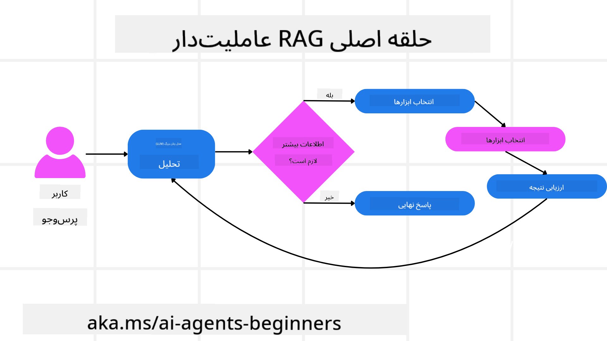
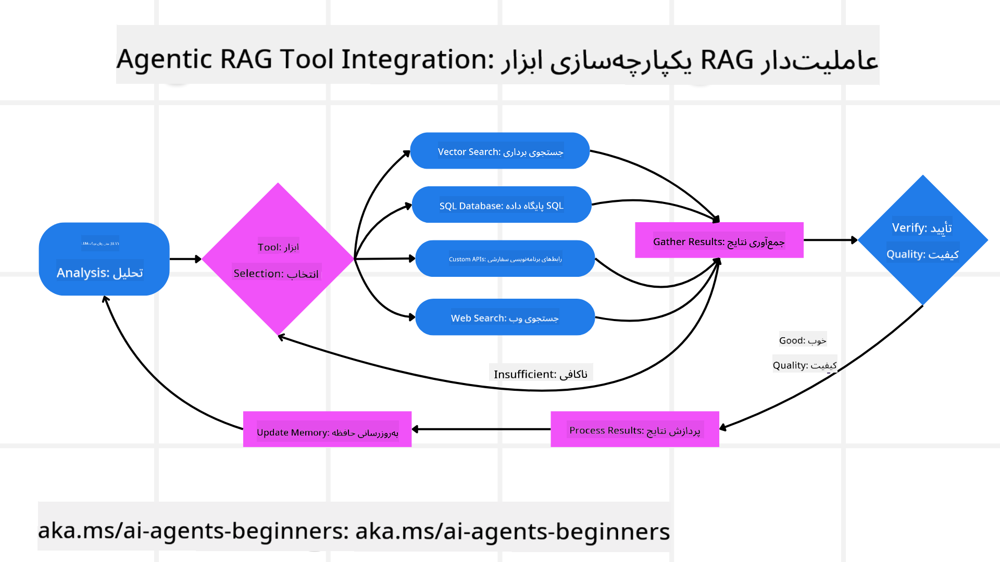
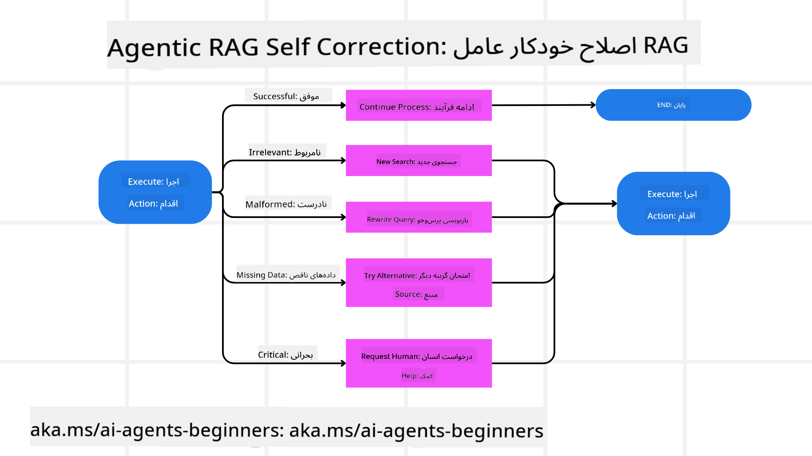
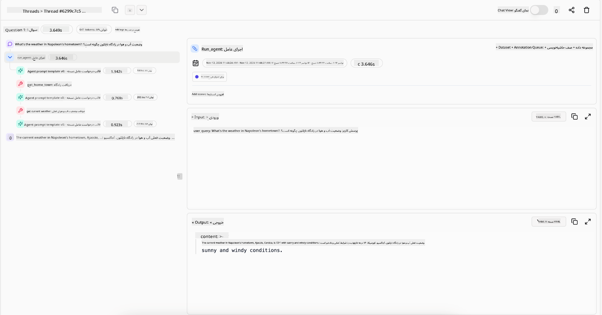
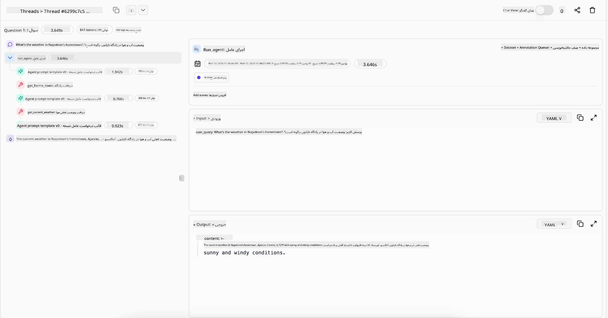

<!--
CO_OP_TRANSLATOR_METADATA:
{
  "original_hash": "7622aa72f9e676e593339f5f694ecd7d",
  "translation_date": "2025-07-12T09:51:38+00:00",
  "source_file": "05-agentic-rag/README.md",
  "language_code": "fa"
}
-->

> _(برای مشاهده ویدئوی این درس روی تصویر بالا کلیک کنید)_

# Agentic RAG

این درس یک مرور جامع بر Agentic Retrieval-Augmented Generation (Agentic RAG) ارائه می‌دهد، یک الگوی نوظهور در هوش مصنوعی که در آن مدل‌های زبان بزرگ (LLMها) به‌صورت خودکار گام‌های بعدی خود را برنامه‌ریزی می‌کنند و در عین حال اطلاعات را از منابع خارجی استخراج می‌کنند. برخلاف الگوهای ایستا که ابتدا بازیابی و سپس خواندن انجام می‌دهند، Agentic RAG شامل فراخوانی‌های تکراری به LLM است که در میان آن‌ها فراخوانی ابزارها یا توابع و خروجی‌های ساختاریافته قرار دارد. سیستم نتایج را ارزیابی می‌کند، پرسش‌ها را اصلاح می‌کند، در صورت نیاز ابزارهای بیشتری را فراخوانی می‌کند و این چرخه را تا رسیدن به راه‌حل رضایت‌بخش ادامه می‌دهد.

## مقدمه

در این درس موارد زیر پوشش داده می‌شود:

- **درک Agentic RAG:** آشنایی با الگوی نوظهور در هوش مصنوعی که در آن مدل‌های زبان بزرگ (LLMها) به‌صورت خودکار گام‌های بعدی خود را برنامه‌ریزی می‌کنند و اطلاعات را از منابع داده خارجی استخراج می‌کنند.
- **درک سبک تکراری Maker-Checker:** فهم چرخه فراخوانی‌های تکراری به LLM که در میان آن‌ها فراخوانی ابزار یا توابع و خروجی‌های ساختاریافته قرار دارد، که برای بهبود صحت و مدیریت پرسش‌های نادرست طراحی شده است.
- **بررسی کاربردهای عملی:** شناسایی موقعیت‌هایی که Agentic RAG در آن‌ها برجسته است، مانند محیط‌های مبتنی بر صحت، تعاملات پیچیده با پایگاه داده و جریان‌های کاری طولانی.

## اهداف یادگیری

پس از اتمام این درس، شما خواهید توانست:

- **درک Agentic RAG:** با الگوی نوظهور در هوش مصنوعی آشنا شوید که در آن مدل‌های زبان بزرگ (LLMها) به‌صورت خودکار گام‌های بعدی خود را برنامه‌ریزی می‌کنند و اطلاعات را از منابع داده خارجی استخراج می‌کنند.
- **سبک تکراری Maker-Checker:** مفهوم چرخه فراخوانی‌های تکراری به LLM که در میان آن‌ها فراخوانی ابزار یا توابع و خروجی‌های ساختاریافته قرار دارد را درک کنید، که برای بهبود صحت و مدیریت پرسش‌های نادرست طراحی شده است.
- **مالکیت فرایند استدلال:** توانایی سیستم در مالکیت فرایند استدلال خود و تصمیم‌گیری درباره نحوه مواجهه با مسائل بدون تکیه بر مسیرهای از پیش تعریف‌شده را درک کنید.
- **جریان کاری:** درک کنید که چگونه یک مدل عامل به‌صورت مستقل تصمیم می‌گیرد گزارش‌های روند بازار را بازیابی کند، داده‌های رقبا را شناسایی کند، معیارهای فروش داخلی را همبسته کند، یافته‌ها را ترکیب کند و استراتژی را ارزیابی نماید.
- **چرخه‌های تکراری، ادغام ابزار و حافظه:** با الگوی تعامل حلقه‌ای سیستم آشنا شوید که وضعیت و حافظه را در طول مراحل حفظ می‌کند تا از تکرار بی‌مورد جلوگیری کرده و تصمیمات آگاهانه بگیرد.
- **مدیریت حالت‌های شکست و خوداصلاحی:** مکانیزم‌های قوی خوداصلاحی سیستم را بررسی کنید، از جمله تکرار و بازپرسش، استفاده از ابزارهای تشخیصی و تکیه بر نظارت انسانی.
- **مرزهای عامل بودن:** محدودیت‌های Agentic RAG را درک کنید، با تمرکز بر خودمختاری حوزه‌ای، وابستگی به زیرساخت و احترام به محدودیت‌ها.
- **موارد کاربرد عملی و ارزش:** موقعیت‌هایی که Agentic RAG در آن‌ها برجسته است را شناسایی کنید، مانند محیط‌های مبتنی بر صحت، تعاملات پیچیده با پایگاه داده و جریان‌های کاری طولانی.
- **حاکمیت، شفافیت و اعتماد:** اهمیت حاکمیت و شفافیت را بیاموزید، از جمله استدلال قابل توضیح، کنترل تعصب و نظارت انسانی.

## Agentic RAG چیست؟

Agentic Retrieval-Augmented Generation (Agentic RAG) یک الگوی نوظهور در هوش مصنوعی است که در آن مدل‌های زبان بزرگ (LLMها) به‌صورت خودکار گام‌های بعدی خود را برنامه‌ریزی می‌کنند و در عین حال اطلاعات را از منابع خارجی استخراج می‌کنند. برخلاف الگوهای ایستا که ابتدا بازیابی و سپس خواندن انجام می‌دهند، Agentic RAG شامل فراخوانی‌های تکراری به LLM است که در میان آن‌ها فراخوانی ابزار یا توابع و خروجی‌های ساختاریافته قرار دارد. سیستم نتایج را ارزیابی می‌کند، پرسش‌ها را اصلاح می‌کند، در صورت نیاز ابزارهای بیشتری را فراخوانی می‌کند و این چرخه را تا رسیدن به راه‌حل رضایت‌بخش ادامه می‌دهد. این سبک تکراری «سازنده-بازرس» صحت را بهبود می‌بخشد، پرسش‌های نادرست را مدیریت می‌کند و نتایج با کیفیت بالا را تضمین می‌کند.

سیستم به‌صورت فعال مالک فرایند استدلال خود است، پرسش‌های ناموفق را بازنویسی می‌کند، روش‌های بازیابی متفاوتی را انتخاب می‌کند و چندین ابزار را ادغام می‌کند — مانند جستجوی برداری در Azure AI Search، پایگاه‌های داده SQL یا APIهای سفارشی — پیش از نهایی کردن پاسخ خود. ویژگی متمایز یک سیستم عامل‌دار توانایی آن در مالکیت فرایند استدلال خود است. پیاده‌سازی‌های سنتی RAG به مسیرهای از پیش تعریف‌شده وابسته‌اند، اما یک سیستم عامل‌دار به‌صورت خودکار توالی گام‌ها را بر اساس کیفیت اطلاعاتی که پیدا می‌کند تعیین می‌کند.

## تعریف Agentic Retrieval-Augmented Generation (Agentic RAG)

Agentic Retrieval-Augmented Generation (Agentic RAG) یک الگوی نوظهور در توسعه هوش مصنوعی است که در آن LLMها نه تنها اطلاعات را از منابع داده خارجی استخراج می‌کنند، بلکه به‌صورت خودکار گام‌های بعدی خود را برنامه‌ریزی می‌کنند. برخلاف الگوهای ایستا که ابتدا بازیابی و سپس خواندن انجام می‌دهند یا توالی‌های پرامپت از پیش نوشته شده، Agentic RAG شامل چرخه‌ای از فراخوانی‌های تکراری به LLM است که در میان آن‌ها فراخوانی ابزار یا توابع و خروجی‌های ساختاریافته قرار دارد. در هر مرحله، سیستم نتایج به‌دست آمده را ارزیابی می‌کند، تصمیم می‌گیرد که آیا باید پرسش‌ها را اصلاح کند، در صورت نیاز ابزارهای بیشتری را فراخوانی می‌کند و این چرخه را تا رسیدن به راه‌حل رضایت‌بخش ادامه می‌دهد.

این سبک تکراری «سازنده-بازرس» برای بهبود صحت، مدیریت پرسش‌های نادرست به پایگاه‌های داده ساختاریافته (مثلاً NL2SQL) و تضمین نتایج متعادل و با کیفیت بالا طراحی شده است. به جای تکیه صرف بر زنجیره‌های پرامپت مهندسی شده، سیستم به‌صورت فعال مالک فرایند استدلال خود است. می‌تواند پرسش‌هایی که شکست می‌خورند را بازنویسی کند، روش‌های بازیابی متفاوتی را انتخاب کند و چندین ابزار را ادغام کند — مانند جستجوی برداری در Azure AI Search، پایگاه‌های داده SQL یا APIهای سفارشی — پیش از نهایی کردن پاسخ خود. این امر نیاز به چارچوب‌های هماهنگی پیچیده را از بین می‌برد. در عوض، یک چرخه نسبتاً ساده «فراخوانی LLM → استفاده از ابزار → فراخوانی LLM → …» می‌تواند خروجی‌های پیچیده و مستدل تولید کند.

## مالکیت فرایند استدلال

ویژگی متمایزی که یک سیستم را «عامل‌دار» می‌کند، توانایی آن در مالکیت فرایند استدلال خود است. پیاده‌سازی‌های سنتی RAG اغلب به انسان‌ها وابسته‌اند که مسیر مدل را از پیش تعریف کنند: زنجیره‌ای از تفکر که مشخص می‌کند چه چیزی و چه زمانی بازیابی شود.  
اما وقتی یک سیستم واقعاً عامل‌دار است، به‌صورت داخلی تصمیم می‌گیرد چگونه به مسئله نزدیک شود. این فقط اجرای یک اسکریپت نیست؛ بلکه به‌صورت خودکار توالی گام‌ها را بر اساس کیفیت اطلاعاتی که پیدا می‌کند تعیین می‌کند.  
برای مثال، اگر از آن خواسته شود استراتژی راه‌اندازی محصولی را ایجاد کند، فقط به پرامپتی که کل فرایند تحقیق و تصمیم‌گیری را مشخص می‌کند تکیه نمی‌کند. در عوض، مدل عامل‌دار به‌صورت مستقل تصمیم می‌گیرد که:

1. گزارش‌های روند بازار فعلی را با استفاده از Bing Web Grounding بازیابی کند  
2. داده‌های مرتبط با رقبا را با استفاده از Azure AI Search شناسایی کند  
3. معیارهای فروش داخلی تاریخی را با استفاده از Azure SQL Database همبسته کند  
4. یافته‌ها را به یک استراتژی منسجم ترکیب کند که از طریق Azure OpenAI Service هماهنگ شده است  
5. استراتژی را برای شکاف‌ها یا ناسازگاری‌ها ارزیابی کند و در صورت نیاز دور دیگری از بازیابی را آغاز نماید  

تمام این مراحل — اصلاح پرسش‌ها، انتخاب منابع، تکرار تا رسیدن به پاسخ «راضی‌کننده» — توسط مدل تصمیم‌گیری می‌شود، نه توسط انسان به‌صورت از پیش نوشته شده.

## چرخه‌های تکراری، ادغام ابزار و حافظه

یک سیستم عامل‌دار بر الگوی تعامل حلقه‌ای تکیه دارد:

- **فراخوانی اولیه:** هدف کاربر (یا همان پرامپت کاربر) به LLM ارائه می‌شود.  
- **فراخوانی ابزار:** اگر مدل اطلاعات ناقص یا دستورالعمل‌های مبهم را شناسایی کند، ابزاری یا روش بازیابی را انتخاب می‌کند — مانند پرس‌وجوی پایگاه داده برداری (مثلاً جستجوی ترکیبی Azure AI Search روی داده‌های خصوصی) یا فراخوانی ساختاریافته SQL — برای جمع‌آوری زمینه بیشتر.  
- **ارزیابی و اصلاح:** پس از بررسی داده‌های بازگشتی، مدل تصمیم می‌گیرد که آیا اطلاعات کافی است یا خیر. اگر کافی نباشد، پرسش را اصلاح می‌کند، ابزار دیگری را امتحان می‌کند یا رویکرد خود را تنظیم می‌کند.  
- **تکرار تا رضایت:** این چرخه ادامه می‌یابد تا مدل تشخیص دهد که وضوح و شواهد کافی برای ارائه پاسخ نهایی و مستدل دارد.  
- **حافظه و وضعیت:** چون سیستم وضعیت و حافظه را در طول مراحل حفظ می‌کند، می‌تواند تلاش‌ها و نتایج قبلی را به یاد آورد، از حلقه‌های تکراری جلوگیری کند و تصمیمات آگاهانه‌تری بگیرد.  

با گذشت زمان، این باعث ایجاد حس درک در حال تکامل می‌شود که به مدل امکان می‌دهد وظایف پیچیده چند مرحله‌ای را بدون نیاز به دخالت مداوم انسان یا تغییر پرامپت انجام دهد.

## مدیریت حالت‌های شکست و خوداصلاحی

خودمختاری Agentic RAG همچنین شامل مکانیزم‌های قوی خوداصلاحی است. وقتی سیستم به بن‌بست می‌رسد — مانند بازیابی اسناد نامربوط یا مواجهه با پرسش‌های نادرست — می‌تواند:

- **تکرار و بازپرسش:** به جای ارائه پاسخ‌های کم‌ارزش، مدل استراتژی‌های جستجوی جدید را امتحان می‌کند، پرسش‌های پایگاه داده را بازنویسی می‌کند یا به مجموعه داده‌های جایگزین نگاه می‌کند.  
- **استفاده از ابزارهای تشخیصی:** سیستم ممکن است توابع اضافی را فراخوانی کند که به آن کمک می‌کند مراحل استدلال خود را اشکال‌زدایی کند یا صحت داده‌های بازیابی شده را تأیید نماید. ابزارهایی مانند Azure AI Tracing برای فراهم کردن قابلیت مشاهده و نظارت قوی اهمیت دارند.  
- **بازگشت به نظارت انسانی:** برای سناریوهای حساس یا مواردی که بارها شکست می‌خورند، مدل ممکن است عدم قطعیت را علامت‌گذاری کرده و درخواست راهنمایی انسانی کند. پس از دریافت بازخورد اصلاحی از انسان، مدل می‌تواند آن درس را در ادامه به کار گیرد.  

این رویکرد تکراری و پویا به مدل اجازه می‌دهد به‌طور مداوم بهبود یابد و اطمینان حاصل کند که فقط یک سیستم یک‌باره نیست بلکه سیستمی است که از اشتباهات خود در طول یک جلسه یاد می‌گیرد.

## مرزهای عامل بودن

با وجود خودمختاری در یک وظیفه، Agentic RAG معادل هوش مصنوعی عمومی نیست. قابلیت‌های «عامل‌دار» آن محدود به ابزارها، منابع داده و سیاست‌هایی است که توسط توسعه‌دهندگان انسانی فراهم شده‌اند. نمی‌تواند ابزارهای خود را اختراع کند یا از مرزهای حوزه‌ای که تعیین شده‌اند فراتر رود. بلکه در هماهنگی پویا با منابع موجود مهارت دارد.  
تفاوت‌های کلیدی با اشکال پیشرفته‌تر هوش مصنوعی عبارتند از:

1. **خودمختاری حوزه‌ای:** سیستم‌های Agentic RAG بر دستیابی به اهداف تعریف‌شده توسط کاربر در حوزه‌ای شناخته شده متمرکز هستند و از استراتژی‌هایی مانند بازنویسی پرسش یا انتخاب ابزار برای بهبود نتایج استفاده می‌کنند.  
2. **وابستگی به زیرساخت:** قابلیت‌های سیستم به ابزارها و داده‌هایی که توسط توسعه‌دهندگان ادغام شده‌اند وابسته است. بدون دخالت انسان نمی‌تواند از این مرزها فراتر رود.  
3. **احترام به محدودیت‌ها:** دستورالعمل‌های اخلاقی، قوانین انطباق و سیاست‌های کسب‌وکار بسیار مهم باقی می‌مانند. آزادی عامل همیشه توسط تدابیر ایمنی و مکانیزم‌های نظارتی محدود می‌شود (امیدواریم).

## موارد کاربرد عملی و ارزش

Agentic RAG در موقعیت‌هایی که نیاز به اصلاح تکراری و دقت دارند، برجسته است:

1. **محیط‌های مبتنی بر صحت:** در بررسی‌های انطباق، تحلیل‌های مقرراتی یا تحقیقات حقوقی، مدل عامل‌دار می‌تواند بارها حقایق را تأیید کند، منابع متعدد را مشورت نماید و پرسش‌ها را بازنویسی کند تا پاسخ کاملاً بررسی شده‌ای ارائه دهد.  
2. **تعاملات پیچیده با پایگاه داده:** هنگام کار با داده‌های ساختاریافته که پرسش‌ها ممکن است اغلب شکست بخورند یا نیاز به تنظیم داشته باشند، سیستم می‌تواند پرسش‌های خود را به‌صورت خودکار با استفاده از Azure SQL یا Microsoft Fabric OneLake اصلاح کند تا بازیابی نهایی با هدف کاربر همسو باشد.  
3. **جریان‌های کاری طولانی:** جلسات طولانی‌تر ممکن است با ظهور اطلاعات جدید تکامل یابند. Agentic RAG می‌تواند به‌طور مداوم داده‌های جدید را وارد کند و استراتژی‌ها را با یادگیری بیشتر درباره فضای مسئله تغییر دهد.

## حاکمیت، شفافیت و اعتماد

با افزایش خودمختاری این سیستم‌ها در استدلال، حاکمیت و شفافیت اهمیت زیادی پیدا می‌کند:

- **استدلال قابل توضیح:** مدل می‌تواند ردپایی از پرسش‌هایی که انجام داده، منابعی که مشورت کرده و مراحل استدلالی که برای رسیدن به نتیجه طی کرده ارائه دهد. ابزارهایی مانند Azure AI Content Safety و Azure AI Tracing / GenAIOps می‌توانند به حفظ شفافیت و کاهش ریسک‌ها کمک کنند.  
- **کنترل تعصب و بازیابی متعادل:** توسعه‌دهندگان می‌توانند استراتژی‌های بازیابی را تنظیم کنند تا منابع داده متعادل و نماینده در نظر گرفته شوند و به‌طور منظم خروجی‌ها را برای شناسایی تعصب یا الگوهای نامتعادل با استفاده از مدل‌های سفارشی برای سازمان‌های پیشرفته داده‌کاوی با Azure Machine Learning بررسی کنند.  
- **نظارت انسانی و انطباق:** برای وظایف حساس، بازبینی انسانی ضروری است. Agentic RAG جایگزین قضاوت انسانی در تصمیمات حساس نمی‌شود — بلکه با ارائه گزینه‌های کاملاً بررسی شده آن را تقویت می‌کند.

داشتن ابزارهایی که رکورد واضحی از اقدامات ارائه می‌دهند ضروری است. بدون آن‌ها، اشکال‌زدایی یک فرایند چند مرحله‌ای می‌تواند بسیار دشوار باشد. نمونه زیر از Literal AI (شرکت پشت Chainlit) برای یک اجرای Agent را ببینید:

## نتیجه‌گیری

Agentic RAG نمایانگر تکامل طبیعی در نحوه مدیریت وظایف پیچیده و داده‌محور توسط سیستم‌های هوش مصنوعی است. با اتخاذ الگوی تعامل حلقه‌ای، انتخاب خودکار ابزارها و اصلاح پرسش‌ها تا رسیدن به نتیجه‌ای با کیفیت بالا، سیستم فراتر از پیروی ایستا از پرامپت‌ها حرکت می‌کند و به یک تصمیم‌گیرنده سازگار و آگاه به زمینه تبدیل می‌شود. در حالی که هنوز توسط زیرساخت‌ها و دستورالعمل‌های اخلاقی تعریف شده توسط انسان محدود است، این قابلیت‌های عامل‌دار تعاملات هوش مصنوعی غنی‌تر، پویا‌تر و در نهایت مفیدتری را برای سازمان‌ها و کاربران نهایی فراهم می‌کند.

## منابع اضافی

- <a href="https://learn.microsoft.com/training/modules/use-own-data-azure-openai" target="_blank">پیاده‌سازی Retrieval Augmented Generation (RAG) با Azure OpenAI Service: یاد بگیرید چگونه از داده‌های خود با Azure OpenAI Service استفاده کنید. این ماژول Microsoft Learn راهنمای جامعی برای پیاده‌سازی RAG ارائه می‌دهد</a>
</a>
- <a href="https://learn.microsoft.com/azure/ai-studio/concepts/evaluation-approach-gen-ai" target="_blank">ارزیابی برنامه‌های هوش مصنوعی مولد با Azure AI Foundry: این مقاله به ارزیابی و مقایسه مدل‌ها بر روی مجموعه داده‌های عمومی، از جمله برنامه‌های Agentic AI و معماری‌های RAG می‌پردازد</a>
- <a href="https://weaviate.io/blog/what-is-agentic-rag" target="_blank">Agentic RAG چیست | Weaviate</a>
- <a href="https://ragaboutit.com/agentic-rag-a-complete-guide-to-agent-based-retrieval-augmented-generation/" target="_blank">Agentic RAG: راهنمای کامل تولید تقویت‌شده بازیابی مبتنی بر عامل – اخبار نسل RAG</a>
- <a href="https://huggingface.co/learn/cookbook/agent_rag" target="_blank">Agentic RAG: با بازفرموله‌سازی پرسش و خودپرسش، RAG خود را تقویت کنید! کتاب آشپزی هوش مصنوعی متن‌باز Hugging Face</a>
- <a href="https://youtu.be/aQ4yQXeB1Ss?si=2HUqBzHoeB5tR04U" target="_blank">افزودن لایه‌های Agentic به RAG</a>
- <a href="https://www.youtube.com/watch?v=zeAyuLc_f3Q&t=244s" target="_blank">آینده دستیارهای دانش: جری لیو</a>
- <a href="https://www.youtube.com/watch?v=AOSjiXP1jmQ" target="_blank">چگونه سیستم‌های Agentic RAG بسازیم</a>
- <a href="https://ignite.microsoft.com/sessions/BRK102?source=sessions" target="_blank">استفاده از سرویس Agent در Azure AI Foundry برای مقیاس‌بندی عوامل هوش مصنوعی شما</a>

### مقالات علمی

- <a href="https://arxiv.org/abs/2303.17651" target="_blank">2303.17651 Self-Refine: بهبود تدریجی با بازخورد خودکار</a>
- <a href="https://arxiv.org/abs/2303.11366" target="_blank">2303.11366 Reflexion: عوامل زبانی با یادگیری تقویتی کلامی</a>
- <a href="https://arxiv.org/abs/2305.11738" target="_blank">2305.11738 CRITIC: مدل‌های زبان بزرگ می‌توانند با نقد تعاملی ابزار خود را اصلاح کنند</a>
- <a href="https://arxiv.org/abs/2501.09136" target="_blank">2501.09136 تولید تقویت‌شده بازیابی مبتنی بر عامل: مروری بر Agentic RAG</a>

## درس قبلی

[الگوی طراحی استفاده از ابزار](../04-tool-use/README.md)

## درس بعدی

[ساخت عوامل هوش مصنوعی قابل اعتماد](../06-building-trustworthy-agents/README.md)

**سلب مسئولیت**:  
این سند با استفاده از سرویس ترجمه هوش مصنوعی [Co-op Translator](https://github.com/Azure/co-op-translator) ترجمه شده است. در حالی که ما در تلاش برای دقت هستیم، لطفاً توجه داشته باشید که ترجمه‌های خودکار ممکن است حاوی خطاها یا نواقصی باشند. سند اصلی به زبان بومی خود باید به عنوان منبع معتبر در نظر گرفته شود. برای اطلاعات حیاتی، ترجمه حرفه‌ای انسانی توصیه می‌شود. ما مسئول هیچ گونه سوءتفاهم یا تفسیر نادرستی که از استفاده این ترجمه ناشی شود، نیستیم.