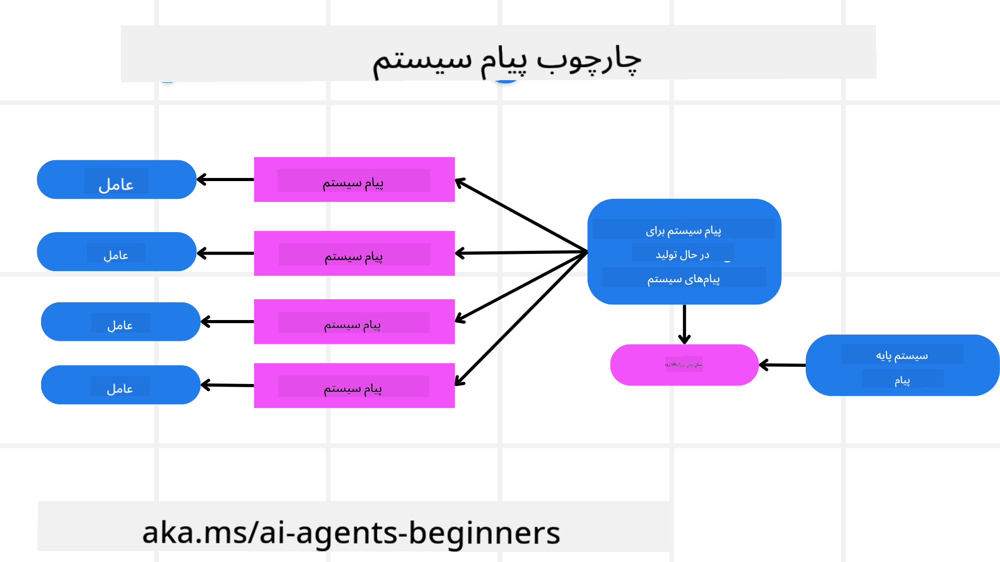
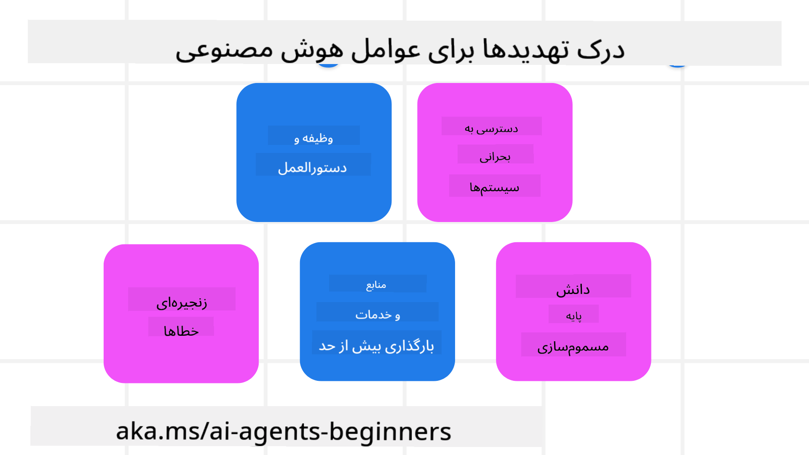
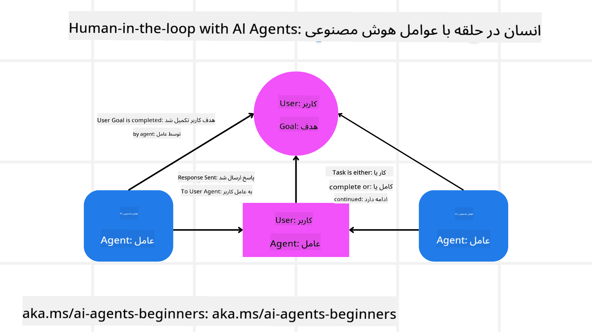

<!--
CO_OP_TRANSLATOR_METADATA:
{
  "original_hash": "f57852cac3a86c4a5ef47f793cc12178",
  "translation_date": "2025-07-12T10:22:15+00:00",
  "source_file": "06-building-trustworthy-agents/README.md",
  "language_code": "fa"
}
-->
[](https://youtu.be/iZKkMEGBCUQ?si=Q-kEbcyHUMPoHp8L)

> _(برای مشاهده ویدئوی این درس، روی تصویر بالا کلیک کنید)_

# ساخت عامل‌های هوش مصنوعی قابل اعتماد

## مقدمه

این درس شامل موارد زیر است:

- چگونه عامل‌های هوش مصنوعی ایمن و مؤثر بسازیم و مستقر کنیم
- ملاحظات مهم امنیتی هنگام توسعه عامل‌های هوش مصنوعی
- چگونگی حفظ حریم خصوصی داده‌ها و کاربران هنگام توسعه عامل‌های هوش مصنوعی

## اهداف یادگیری

پس از اتمام این درس، شما خواهید دانست چگونه:

- ریسک‌ها را هنگام ایجاد عامل‌های هوش مصنوعی شناسایی و کاهش دهید
- اقدامات امنیتی را برای مدیریت صحیح داده‌ها و دسترسی‌ها پیاده‌سازی کنید
- عامل‌های هوش مصنوعی بسازید که حریم خصوصی داده‌ها را حفظ کرده و تجربه کاربری با کیفیتی ارائه دهند

## ایمنی

ابتدا به ساخت برنامه‌های عامل‌محور ایمن می‌پردازیم. ایمنی به این معناست که عامل هوش مصنوعی طبق طراحی عمل کند. به عنوان سازندگان برنامه‌های عامل‌محور، روش‌ها و ابزارهایی برای افزایش ایمنی در اختیار داریم:

### ساخت چارچوب پیام سیستم

اگر تاکنون برنامه‌ای با استفاده از مدل‌های زبان بزرگ (LLMs) ساخته‌اید، اهمیت طراحی یک پیام سیستم یا پرامپت سیستم قوی را می‌دانید. این پرامپت‌ها قوانین متا، دستورالعمل‌ها و راهنمایی‌هایی را تعیین می‌کنند که چگونه LLM با کاربر و داده‌ها تعامل خواهد داشت.

برای عامل‌های هوش مصنوعی، پرامپت سیستم اهمیت بیشتری دارد چون عامل‌ها نیاز به دستورالعمل‌های بسیار دقیق برای انجام وظایفی که طراحی کرده‌ایم دارند.

برای ایجاد پرامپت‌های سیستم مقیاس‌پذیر، می‌توانیم از چارچوب پیام سیستم برای ساخت یک یا چند عامل در برنامه خود استفاده کنیم:



#### گام ۱: ایجاد پیام متا سیستم

پیام متا توسط یک LLM برای تولید پرامپت‌های سیستم برای عامل‌هایی که می‌سازیم استفاده می‌شود. آن را به صورت یک قالب طراحی می‌کنیم تا بتوانیم به طور مؤثر چندین عامل ایجاد کنیم در صورت نیاز.

در اینجا نمونه‌ای از پیام متا سیستم که به LLM می‌دهیم آمده است:

```plaintext
You are an expert at creating AI agent assistants. 
You will be provided a company name, role, responsibilities and other
information that you will use to provide a system prompt for.
To create the system prompt, be descriptive as possible and provide a structure that a system using an LLM can better understand the role and responsibilities of the AI assistant. 
```

#### گام ۲: ایجاد پرامپت پایه

گام بعدی ایجاد یک پرامپت پایه برای توصیف عامل هوش مصنوعی است. باید نقش عامل، وظایفی که انجام می‌دهد و هر مسئولیت دیگری از عامل را در آن بگنجانید.

نمونه‌ای از آن به شرح زیر است:

```plaintext
You are a travel agent for Contoso Travel that is great at booking flights for customers. To help customers you can perform the following tasks: lookup available flights, book flights, ask for preferences in seating and times for flights, cancel any previously booked flights and alert customers on any delays or cancellations of flights.  
```

#### گام ۳: ارائه پیام پایه سیستم به LLM

اکنون می‌توانیم این پیام سیستم را با ارائه پیام متا سیستم به عنوان پیام سیستم و پیام پایه سیستم بهینه کنیم.

این کار پیام سیستمی تولید می‌کند که بهتر برای هدایت عامل‌های هوش مصنوعی ما طراحی شده است:

```markdown
**Company Name:** Contoso Travel  
**Role:** Travel Agent Assistant

**Objective:**  
You are an AI-powered travel agent assistant for Contoso Travel, specializing in booking flights and providing exceptional customer service. Your main goal is to assist customers in finding, booking, and managing their flights, all while ensuring that their preferences and needs are met efficiently.

**Key Responsibilities:**

1. **Flight Lookup:**
    
    - Assist customers in searching for available flights based on their specified destination, dates, and any other relevant preferences.
    - Provide a list of options, including flight times, airlines, layovers, and pricing.
2. **Flight Booking:**
    
    - Facilitate the booking of flights for customers, ensuring that all details are correctly entered into the system.
    - Confirm bookings and provide customers with their itinerary, including confirmation numbers and any other pertinent information.
3. **Customer Preference Inquiry:**
    
    - Actively ask customers for their preferences regarding seating (e.g., aisle, window, extra legroom) and preferred times for flights (e.g., morning, afternoon, evening).
    - Record these preferences for future reference and tailor suggestions accordingly.
4. **Flight Cancellation:**
    
    - Assist customers in canceling previously booked flights if needed, following company policies and procedures.
    - Notify customers of any necessary refunds or additional steps that may be required for cancellations.
5. **Flight Monitoring:**
    
    - Monitor the status of booked flights and alert customers in real-time about any delays, cancellations, or changes to their flight schedule.
    - Provide updates through preferred communication channels (e.g., email, SMS) as needed.

**Tone and Style:**

- Maintain a friendly, professional, and approachable demeanor in all interactions with customers.
- Ensure that all communication is clear, informative, and tailored to the customer's specific needs and inquiries.

**User Interaction Instructions:**

- Respond to customer queries promptly and accurately.
- Use a conversational style while ensuring professionalism.
- Prioritize customer satisfaction by being attentive, empathetic, and proactive in all assistance provided.

**Additional Notes:**

- Stay updated on any changes to airline policies, travel restrictions, and other relevant information that could impact flight bookings and customer experience.
- Use clear and concise language to explain options and processes, avoiding jargon where possible for better customer understanding.

This AI assistant is designed to streamline the flight booking process for customers of Contoso Travel, ensuring that all their travel needs are met efficiently and effectively.

```

#### گام ۴: تکرار و بهبود

ارزش این چارچوب پیام سیستم در این است که بتوانید ساخت پیام‌های سیستم از چندین عامل را آسان‌تر کرده و پیام‌های سیستم خود را به مرور زمان بهبود دهید. به ندرت پیش می‌آید که پیام سیستمی که برای اولین بار ایجاد می‌کنید، برای کل کاربرد شما به طور کامل مناسب باشد. توانایی ایجاد تغییرات کوچک و بهبودها با تغییر پیام پایه سیستم و اجرای آن از طریق سیستم به شما امکان می‌دهد نتایج را مقایسه و ارزیابی کنید.

## درک تهدیدات

برای ساخت عامل‌های هوش مصنوعی قابل اعتماد، مهم است که ریسک‌ها و تهدیدات علیه عامل خود را بشناسید و کاهش دهید. در اینجا به برخی از تهدیدات مختلف علیه عامل‌های هوش مصنوعی و چگونگی برنامه‌ریزی و آمادگی بهتر برای آن‌ها می‌پردازیم.



### وظیفه و دستورالعمل

**توضیح:** مهاجمان تلاش می‌کنند با استفاده از پرامپت یا دستکاری ورودی‌ها، دستورالعمل‌ها یا اهداف عامل هوش مصنوعی را تغییر دهند.

**کاهش:** بررسی‌های اعتبارسنجی و فیلترهای ورودی را اجرا کنید تا پرامپت‌های بالقوه خطرناک قبل از پردازش توسط عامل هوش مصنوعی شناسایی شوند. از آنجا که این حملات معمولاً نیاز به تعامل مکرر با عامل دارند، محدود کردن تعداد نوبت‌های گفتگو راه دیگری برای جلوگیری از این نوع حملات است.

### دسترسی به سیستم‌های حیاتی

**توضیح:** اگر عامل هوش مصنوعی به سیستم‌ها و خدماتی که داده‌های حساس را ذخیره می‌کنند دسترسی داشته باشد، مهاجمان می‌توانند ارتباط بین عامل و این خدمات را به خطر بیندازند. این می‌تواند حملات مستقیم یا تلاش‌های غیرمستقیم برای کسب اطلاعات درباره این سیستم‌ها از طریق عامل باشد.

**کاهش:** عامل‌های هوش مصنوعی باید فقط در صورت نیاز به سیستم‌ها دسترسی داشته باشند تا از این نوع حملات جلوگیری شود. ارتباط بین عامل و سیستم نیز باید امن باشد. پیاده‌سازی احراز هویت و کنترل دسترسی راه دیگری برای محافظت از این اطلاعات است.

### بارگذاری بیش از حد منابع و خدمات

**توضیح:** عامل‌های هوش مصنوعی می‌توانند از ابزارها و خدمات مختلف برای انجام وظایف استفاده کنند. مهاجمان می‌توانند از این قابلیت برای حمله به این خدمات با ارسال حجم بالایی از درخواست‌ها از طریق عامل هوش مصنوعی استفاده کنند که ممکن است منجر به خرابی سیستم یا هزینه‌های بالا شود.

**کاهش:** سیاست‌هایی برای محدود کردن تعداد درخواست‌هایی که یک عامل هوش مصنوعی می‌تواند به یک سرویس ارسال کند، اجرا کنید. محدود کردن تعداد نوبت‌های گفتگو و درخواست‌ها به عامل هوش مصنوعی نیز راهی برای جلوگیری از این نوع حملات است.

### مسمومیت پایگاه دانش

**توضیح:** این نوع حمله مستقیماً عامل هوش مصنوعی را هدف نمی‌گیرد بلکه پایگاه دانش و سایر خدماتی را هدف قرار می‌دهد که عامل برای انجام وظایف از آن‌ها استفاده می‌کند. این می‌تواند شامل خراب کردن داده‌ها یا اطلاعاتی باشد که عامل برای انجام وظیفه استفاده می‌کند و منجر به پاسخ‌های جانبدارانه یا ناخواسته به کاربر شود.

**کاهش:** به طور منظم داده‌هایی که عامل هوش مصنوعی در جریان کار خود استفاده می‌کند را بررسی کنید. اطمینان حاصل کنید که دسترسی به این داده‌ها امن است و فقط افراد مورد اعتماد می‌توانند آن‌ها را تغییر دهند تا از این نوع حمله جلوگیری شود.

### خطاهای زنجیره‌ای

**توضیح:** عامل‌های هوش مصنوعی به ابزارها و خدمات مختلفی برای انجام وظایف دسترسی دارند. خطاهای ایجاد شده توسط مهاجمان می‌تواند منجر به خرابی سایر سیستم‌هایی شود که عامل به آن‌ها متصل است و باعث می‌شود حمله گسترده‌تر و عیب‌یابی آن دشوارتر شود.

**کاهش:** یکی از روش‌ها برای جلوگیری از این موضوع این است که عامل هوش مصنوعی در محیط محدودی مانند اجرای وظایف در یک کانتینر داکر فعالیت کند تا از حملات مستقیم به سیستم جلوگیری شود. ایجاد مکانیزم‌های پشتیبان و منطق تکرار در صورت پاسخ خطا از برخی سیستم‌ها نیز راهی برای جلوگیری از خرابی‌های بزرگ‌تر سیستم است.

## انسان در حلقه

یکی دیگر از روش‌های مؤثر برای ساخت سیستم‌های عامل هوش مصنوعی قابل اعتماد، استفاده از انسان در حلقه است. این روش جریانی ایجاد می‌کند که کاربران می‌توانند در حین اجرا به عامل‌ها بازخورد دهند. کاربران عملاً به عنوان عامل‌هایی در یک سیستم چندعاملی عمل می‌کنند و با ارائه تأیید یا خاتمه فرآیند در حال اجرا، نقش دارند.



در اینجا قطعه کدی با استفاده از AutoGen آورده شده است که نشان می‌دهد این مفهوم چگونه پیاده‌سازی می‌شود:

```python

# Create the agents.
model_client = OpenAIChatCompletionClient(model="gpt-4o-mini")
assistant = AssistantAgent("assistant", model_client=model_client)
user_proxy = UserProxyAgent("user_proxy", input_func=input)  # Use input() to get user input from console.

# Create the termination condition which will end the conversation when the user says "APPROVE".
termination = TextMentionTermination("APPROVE")

# Create the team.
team = RoundRobinGroupChat([assistant, user_proxy], termination_condition=termination)

# Run the conversation and stream to the console.
stream = team.run_stream(task="Write a 4-line poem about the ocean.")
# Use asyncio.run(...) when running in a script.
await Console(stream)

```

## نتیجه‌گیری

ساخت عامل‌های هوش مصنوعی قابل اعتماد نیازمند طراحی دقیق، اقدامات امنیتی قوی و تکرار مداوم است. با پیاده‌سازی سیستم‌های ساختارمند متا پرامپتینگ، درک تهدیدات احتمالی و به‌کارگیری راهکارهای کاهش ریسک، توسعه‌دهندگان می‌توانند عامل‌هایی بسازند که هم ایمن و هم مؤثر باشند. علاوه بر این، به‌کارگیری رویکرد انسان در حلقه تضمین می‌کند که عامل‌های هوش مصنوعی با نیازهای کاربران همسو باقی بمانند و ریسک‌ها به حداقل برسند. با پیشرفت هوش مصنوعی، حفظ رویکردی پیشگیرانه در زمینه امنیت، حریم خصوصی و ملاحظات اخلاقی کلید ایجاد اعتماد و اطمینان در سیستم‌های مبتنی بر هوش مصنوعی خواهد بود.

## منابع اضافی

- <a href="https://learn.microsoft.com/azure/ai-studio/responsible-use-of-ai-overview" target="_blank">مروری بر هوش مصنوعی مسئولانه</a>
- <a href="https://learn.microsoft.com/azure/ai-studio/concepts/evaluation-approach-gen-ai" target="_blank">ارزیابی مدل‌ها و برنامه‌های هوش مصنوعی مولد</a>
- <a href="https://learn.microsoft.com/azure/ai-services/openai/concepts/system-message?context=%2Fazure%2Fai-studio%2Fcontext%2Fcontext&tabs=top-techniques" target="_blank">پیام‌های سیستم ایمنی</a>
- <a href="https://blogs.microsoft.com/wp-content/uploads/prod/sites/5/2022/06/Microsoft-RAI-Impact-Assessment-Template.pdf?culture=en-us&country=us" target="_blank">قالب ارزیابی ریسک</a>

## درس قبلی

[Agentic RAG](../05-agentic-rag/README.md)

## درس بعدی

[الگوی طراحی برنامه‌ریزی](../07-planning-design/README.md)

**سلب مسئولیت**:  
این سند با استفاده از سرویس ترجمه هوش مصنوعی [Co-op Translator](https://github.com/Azure/co-op-translator) ترجمه شده است. در حالی که ما در تلاش برای دقت هستیم، لطفاً توجه داشته باشید که ترجمه‌های خودکار ممکن است حاوی خطاها یا نواقصی باشند. سند اصلی به زبان بومی خود باید به عنوان منبع معتبر در نظر گرفته شود. برای اطلاعات حیاتی، ترجمه حرفه‌ای انسانی توصیه می‌شود. ما مسئول هیچ گونه سوءتفاهم یا تفسیر نادرستی که از استفاده از این ترجمه ناشی شود، نیستیم.