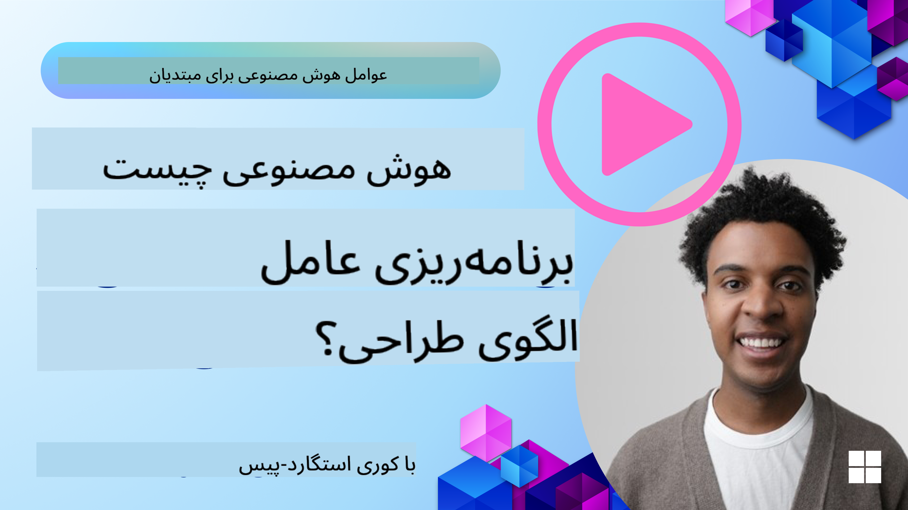
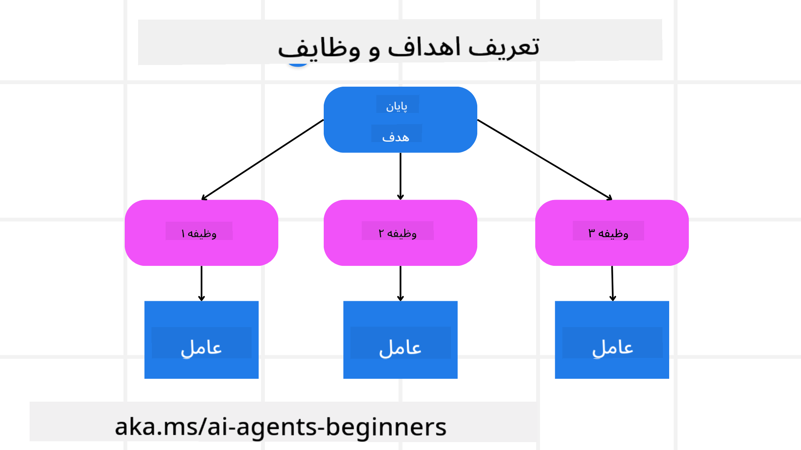

<!--
CO_OP_TRANSLATOR_METADATA:
{
  "original_hash": "a28d30590704ea13b6a08d4793cf9c2b",
  "translation_date": "2025-08-30T13:40:47+00:00",
  "source_file": "07-planning-design/README.md",
  "language_code": "fa"
}
-->
[](https://youtu.be/kPfJ2BrBCMY?si=9pYpPXp0sSbK91Dr)

> _(برای مشاهده ویدئوی این درس روی تصویر بالا کلیک کنید)_

# برنامه‌ریزی طراحی

## مقدمه

این درس شامل موارد زیر خواهد بود:

* تعریف یک هدف کلی واضح و تقسیم یک وظیفه پیچیده به وظایف قابل مدیریت.
* استفاده از خروجی ساختاریافته برای پاسخ‌های قابل اعتمادتر و قابل خواندن توسط ماشین.
* اعمال رویکرد مبتنی بر رویداد برای مدیریت وظایف پویا و ورودی‌های غیرمنتظره.

## اهداف یادگیری

پس از تکمیل این درس، شما درک خواهید کرد که:

* یک هدف کلی برای یک عامل هوش مصنوعی تعیین کنید تا مطمئن شوید که دقیقاً می‌داند چه چیزی باید به دست آید.
* یک وظیفه پیچیده را به وظایف قابل مدیریت تقسیم کنید و آن‌ها را به ترتیب منطقی سازماندهی کنید.
* عوامل را با ابزارهای مناسب (مانند ابزارهای جستجو یا تحلیل داده‌ها) تجهیز کنید، تصمیم بگیرید که چه زمانی و چگونه از آن‌ها استفاده شود، و موقعیت‌های غیرمنتظره را مدیریت کنید.
* نتایج وظایف فرعی را ارزیابی کنید، عملکرد را اندازه‌گیری کنید و اقدامات را برای بهبود خروجی نهایی تکرار کنید.

## تعریف هدف کلی و تقسیم وظیفه



بیشتر وظایف دنیای واقعی برای انجام در یک مرحله بسیار پیچیده هستند. یک عامل هوش مصنوعی به یک هدف مختصر نیاز دارد تا برنامه‌ریزی و اقدامات خود را هدایت کند. به عنوان مثال، هدف زیر را در نظر بگیرید:

    "ایجاد یک برنامه سفر سه روزه."

در حالی که بیان آن ساده است، هنوز نیاز به اصلاح دارد. هرچه هدف واضح‌تر باشد، عامل (و هر همکار انسانی) بهتر می‌تواند بر دستیابی به نتیجه مناسب تمرکز کند، مانند ایجاد یک برنامه جامع با گزینه‌های پرواز، توصیه‌های هتل، و پیشنهادات فعالیت.

### تقسیم وظیفه

وظایف بزرگ یا پیچیده زمانی که به وظایف فرعی کوچک‌تر و هدف‌محور تقسیم شوند، قابل مدیریت‌تر می‌شوند.
برای مثال برنامه سفر، می‌توانید هدف را به موارد زیر تقسیم کنید:

* رزرو پرواز
* رزرو هتل
* اجاره خودرو
* شخصی‌سازی

هر وظیفه فرعی سپس می‌تواند توسط عوامل یا فرآیندهای اختصاصی انجام شود. یک عامل ممکن است در جستجوی بهترین پیشنهادات پرواز تخصص داشته باشد، دیگری بر رزرو هتل تمرکز کند و غیره. یک عامل هماهنگ‌کننده یا "پایین‌دستی" سپس می‌تواند این نتایج را به یک برنامه سفر منسجم برای کاربر نهایی ترکیب کند.

این رویکرد ماژولار همچنین امکان بهبود تدریجی را فراهم می‌کند. به عنوان مثال، می‌توانید عوامل تخصصی برای توصیه‌های غذایی یا پیشنهادات فعالیت‌های محلی اضافه کنید و برنامه سفر را در طول زمان اصلاح کنید.

### خروجی ساختاریافته

مدل‌های زبان بزرگ (LLMs) می‌توانند خروجی ساختاریافته (مانند JSON) تولید کنند که برای عوامل یا خدمات پایین‌دستی آسان‌تر قابل تجزیه و پردازش است. این امر به ویژه در یک زمینه چندعاملی مفید است، جایی که می‌توان این وظایف را پس از دریافت خروجی برنامه‌ریزی انجام داد. برای یک مرور سریع، به نمونه زیر توجه کنید.

کد پایتون زیر یک عامل برنامه‌ریزی ساده را نشان می‌دهد که هدف را به وظایف فرعی تقسیم کرده و یک برنامه ساختاریافته تولید می‌کند:

```python
from pydantic import BaseModel
from enum import Enum
from typing import List, Optional, Union
import json
import os
from typing import Optional
from pprint import pprint
from autogen_core.models import UserMessage, SystemMessage, AssistantMessage
from autogen_ext.models.azure import AzureAIChatCompletionClient
from azure.core.credentials import AzureKeyCredential

class AgentEnum(str, Enum):
    FlightBooking = "flight_booking"
    HotelBooking = "hotel_booking"
    CarRental = "car_rental"
    ActivitiesBooking = "activities_booking"
    DestinationInfo = "destination_info"
    DefaultAgent = "default_agent"
    GroupChatManager = "group_chat_manager"

# Travel SubTask Model
class TravelSubTask(BaseModel):
    task_details: str
    assigned_agent: AgentEnum  # we want to assign the task to the agent

class TravelPlan(BaseModel):
    main_task: str
    subtasks: List[TravelSubTask]
    is_greeting: bool

client = AzureAIChatCompletionClient(
    model="gpt-4o-mini",
    endpoint="https://models.inference.ai.azure.com",
    # To authenticate with the model you will need to generate a personal access token (PAT) in your GitHub settings.
    # Create your PAT token by following instructions here: https://docs.github.com/en/authentication/keeping-your-account-and-data-secure/managing-your-personal-access-tokens
    credential=AzureKeyCredential(os.environ["GITHUB_TOKEN"]),
    model_info={
        "json_output": False,
        "function_calling": True,
        "vision": True,
        "family": "unknown",
    },
)

# Define the user message
messages = [
    SystemMessage(content="""You are an planner agent.
    Your job is to decide which agents to run based on the user's request.
                      Provide your response in JSON format with the following structure:
{'main_task': 'Plan a family trip from Singapore to Melbourne.',
 'subtasks': [{'assigned_agent': 'flight_booking',
               'task_details': 'Book round-trip flights from Singapore to '
                               'Melbourne.'}
    Below are the available agents specialised in different tasks:
    - FlightBooking: For booking flights and providing flight information
    - HotelBooking: For booking hotels and providing hotel information
    - CarRental: For booking cars and providing car rental information
    - ActivitiesBooking: For booking activities and providing activity information
    - DestinationInfo: For providing information about destinations
    - DefaultAgent: For handling general requests""", source="system"),
    UserMessage(
        content="Create a travel plan for a family of 2 kids from Singapore to Melboune", source="user"),
]

response = await client.create(messages=messages, extra_create_args={"response_format": 'json_object'})

response_content: Optional[str] = response.content if isinstance(
    response.content, str) else None
if response_content is None:
    raise ValueError("Response content is not a valid JSON string" )

pprint(json.loads(response_content))

# # Ensure the response content is a valid JSON string before loading it
# response_content: Optional[str] = response.content if isinstance(
#     response.content, str) else None
# if response_content is None:
#     raise ValueError("Response content is not a valid JSON string")

# # Print the response content after loading it as JSON
# pprint(json.loads(response_content))

# Validate the response content with the MathReasoning model
# TravelPlan.model_validate(json.loads(response_content))
```

### عامل برنامه‌ریزی با هماهنگی چندعاملی

در این مثال، یک عامل مسیریاب معنایی درخواست کاربر (مانند "من به یک برنامه هتل برای سفرم نیاز دارم.") را دریافت می‌کند.

سپس برنامه‌ریز:

* دریافت برنامه هتل: برنامه‌ریز پیام کاربر را دریافت کرده و بر اساس یک پیام سیستمی (شامل جزئیات عوامل موجود)، یک برنامه سفر ساختاریافته تولید می‌کند.
* لیست عوامل و ابزارهای آن‌ها: رجیستری عامل شامل لیستی از عوامل (مانند پرواز، هتل، اجاره خودرو و فعالیت‌ها) همراه با توابع یا ابزارهایی است که ارائه می‌دهند.
* مسیریابی برنامه به عوامل مربوطه: بسته به تعداد وظایف فرعی، برنامه‌ریز یا پیام را مستقیماً به یک عامل اختصاصی (برای سناریوهای تک‌وظیفه‌ای) ارسال می‌کند یا از طریق یک مدیر چت گروهی برای همکاری چندعاملی هماهنگ می‌کند.
* خلاصه‌سازی نتیجه: در نهایت، برنامه‌ریز برنامه تولید شده را برای وضوح خلاصه می‌کند.
کد نمونه پایتون زیر این مراحل را نشان می‌دهد:

```python

from pydantic import BaseModel

from enum import Enum
from typing import List, Optional, Union

class AgentEnum(str, Enum):
    FlightBooking = "flight_booking"
    HotelBooking = "hotel_booking"
    CarRental = "car_rental"
    ActivitiesBooking = "activities_booking"
    DestinationInfo = "destination_info"
    DefaultAgent = "default_agent"
    GroupChatManager = "group_chat_manager"

# Travel SubTask Model

class TravelSubTask(BaseModel):
    task_details: str
    assigned_agent: AgentEnum # we want to assign the task to the agent

class TravelPlan(BaseModel):
    main_task: str
    subtasks: List[TravelSubTask]
    is_greeting: bool
import json
import os
from typing import Optional

from autogen_core.models import UserMessage, SystemMessage, AssistantMessage
from autogen_ext.models.openai import AzureOpenAIChatCompletionClient

# Create the client with type-checked environment variables

client = AzureOpenAIChatCompletionClient(
    azure_deployment=os.getenv("AZURE_OPENAI_DEPLOYMENT_NAME"),
    model=os.getenv("AZURE_OPENAI_DEPLOYMENT_NAME"),
    api_version=os.getenv("AZURE_OPENAI_API_VERSION"),
    azure_endpoint=os.getenv("AZURE_OPENAI_ENDPOINT"),
    api_key=os.getenv("AZURE_OPENAI_API_KEY"),
)

from pprint import pprint

# Define the user message

messages = [
    SystemMessage(content="""You are an planner agent.
    Your job is to decide which agents to run based on the user's request.
    Below are the available agents specialized in different tasks:
    - FlightBooking: For booking flights and providing flight information
    - HotelBooking: For booking hotels and providing hotel information
    - CarRental: For booking cars and providing car rental information
    - ActivitiesBooking: For booking activities and providing activity information
    - DestinationInfo: For providing information about destinations
    - DefaultAgent: For handling general requests""", source="system"),
    UserMessage(content="Create a travel plan for a family of 2 kids from Singapore to Melbourne", source="user"),
]

response = await client.create(messages=messages, extra_create_args={"response_format": TravelPlan})

# Ensure the response content is a valid JSON string before loading it

response_content: Optional[str] = response.content if isinstance(response.content, str) else None
if response_content is None:
    raise ValueError("Response content is not a valid JSON string")

# Print the response content after loading it as JSON

pprint(json.loads(response_content))
```

آنچه در ادامه می‌آید خروجی کد قبلی است و سپس می‌توانید از این خروجی ساختاریافته برای مسیریابی به `assigned_agent` و خلاصه‌سازی برنامه سفر برای کاربر نهایی استفاده کنید.

```json
{
    "is_greeting": "False",
    "main_task": "Plan a family trip from Singapore to Melbourne.",
    "subtasks": [
        {
            "assigned_agent": "flight_booking",
            "task_details": "Book round-trip flights from Singapore to Melbourne."
        },
        {
            "assigned_agent": "hotel_booking",
            "task_details": "Find family-friendly hotels in Melbourne."
        },
        {
            "assigned_agent": "car_rental",
            "task_details": "Arrange a car rental suitable for a family of four in Melbourne."
        },
        {
            "assigned_agent": "activities_booking",
            "task_details": "List family-friendly activities in Melbourne."
        },
        {
            "assigned_agent": "destination_info",
            "task_details": "Provide information about Melbourne as a travel destination."
        }
    ]
}
```

یک دفترچه نمونه با کد قبلی [اینجا](07-autogen.ipynb) موجود است.

### برنامه‌ریزی تکراری

برخی وظایف نیاز به رفت و برگشت یا برنامه‌ریزی مجدد دارند، جایی که نتیجه یک وظیفه فرعی بر وظیفه بعدی تأثیر می‌گذارد. به عنوان مثال، اگر عامل یک فرمت داده غیرمنتظره را هنگام رزرو پرواز کشف کند، ممکن است نیاز به تطبیق استراتژی خود قبل از ادامه رزرو هتل داشته باشد.

علاوه بر این، بازخورد کاربر (مانند تصمیم‌گیری انسانی که ترجیح می‌دهد پرواز زودتری داشته باشد) می‌تواند یک برنامه‌ریزی جزئی را تحریک کند. این رویکرد پویا و تکراری تضمین می‌کند که راه‌حل نهایی با محدودیت‌های دنیای واقعی و ترجیحات در حال تغییر کاربر هماهنگ باشد.

نمونه کد:

```python
from autogen_core.models import UserMessage, SystemMessage, AssistantMessage
#.. same as previous code and pass on the user history, current plan
messages = [
    SystemMessage(content="""You are a planner agent to optimize the
    Your job is to decide which agents to run based on the user's request.
    Below are the available agents specialized in different tasks:
    - FlightBooking: For booking flights and providing flight information
    - HotelBooking: For booking hotels and providing hotel information
    - CarRental: For booking cars and providing car rental information
    - ActivitiesBooking: For booking activities and providing activity information
    - DestinationInfo: For providing information about destinations
    - DefaultAgent: For handling general requests""", source="system"),
    UserMessage(content="Create a travel plan for a family of 2 kids from Singapore to Melbourne", source="user"),
    AssistantMessage(content=f"Previous travel plan - {TravelPlan}", source="assistant")
]
# .. re-plan and send the tasks to respective agents
```

برای برنامه‌ریزی جامع‌تر، حتماً Magnetic One را بررسی کنید برای حل وظایف پیچیده.

## خلاصه

در این مقاله، ما به یک مثال نگاه کردیم که چگونه می‌توان یک برنامه‌ریز ایجاد کرد که بتواند عوامل موجود تعریف‌شده را به صورت پویا انتخاب کند. خروجی برنامه‌ریز وظایف را تجزیه کرده و عوامل را اختصاص می‌دهد تا بتوانند اجرا شوند. فرض بر این است که عوامل به توابع/ابزارهایی که برای انجام وظیفه لازم است دسترسی دارند. علاوه بر عوامل، می‌توانید الگوهای دیگری مانند بازتاب، خلاصه‌ساز، و چت چرخشی را برای سفارشی‌سازی بیشتر اضافه کنید.

## منابع اضافی

* AutoGen Magnetic One - یک سیستم چندعاملی عمومی برای حل وظایف پیچیده که نتایج چشمگیری در چندین معیار چالش‌برانگیز عامل به دست آورده است. مرجع:

. در این پیاده‌سازی، هماهنگ‌کننده یک برنامه خاص وظیفه ایجاد کرده و این وظایف را به عوامل موجود واگذار می‌کند. علاوه بر برنامه‌ریزی، هماهنگ‌کننده همچنین از یک مکانیزم ردیابی برای نظارت بر پیشرفت وظیفه و برنامه‌ریزی مجدد در صورت نیاز استفاده می‌کند.

### سوالات بیشتری درباره الگوی طراحی برنامه‌ریزی دارید؟

به [دیسکورد Azure AI Foundry](https://aka.ms/ai-agents/discord) بپیوندید تا با دیگر یادگیرندگان ملاقات کنید، در ساعات اداری شرکت کنید و سوالات خود درباره عوامل هوش مصنوعی را پاسخ دهید.

## درس قبلی

[ساخت عوامل هوش مصنوعی قابل اعتماد](../06-building-trustworthy-agents/README.md)

## درس بعدی

[الگوی طراحی چندعاملی](../08-multi-agent/README.md)

---

**سلب مسئولیت**:  
این سند با استفاده از سرویس ترجمه هوش مصنوعی [Co-op Translator](https://github.com/Azure/co-op-translator) ترجمه شده است. در حالی که ما برای دقت تلاش می‌کنیم، لطفاً توجه داشته باشید که ترجمه‌های خودکار ممکن است شامل خطاها یا نادقتی‌ها باشند. سند اصلی به زبان اصلی آن باید به عنوان منبع معتبر در نظر گرفته شود. برای اطلاعات حساس، ترجمه حرفه‌ای انسانی توصیه می‌شود. ما هیچ مسئولیتی در قبال سوءتفاهم‌ها یا تفسیرهای نادرست ناشی از استفاده از این ترجمه نداریم.