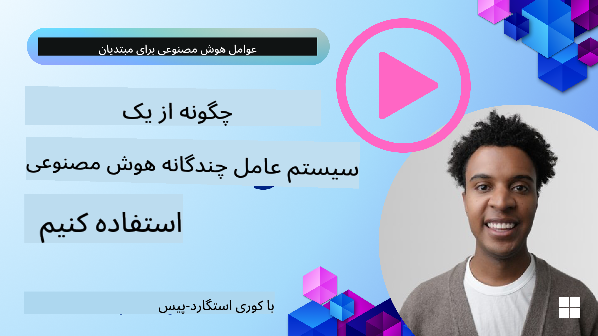
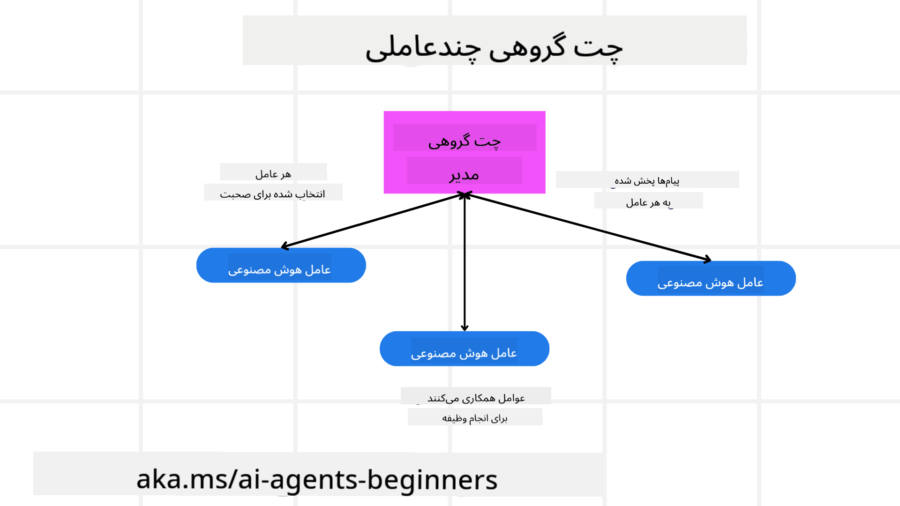
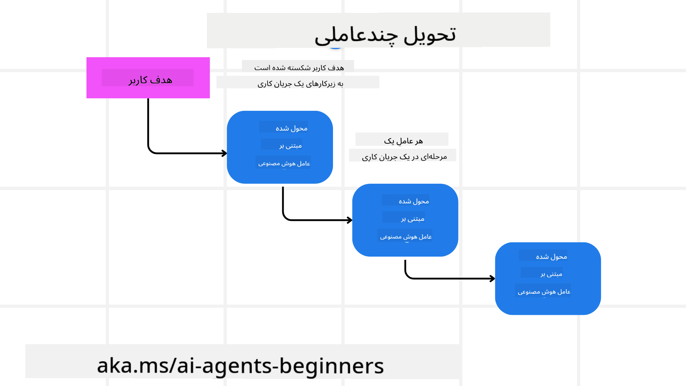
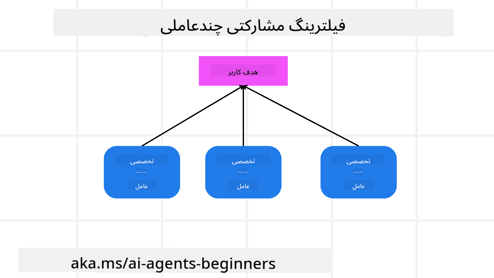

<!--
CO_OP_TRANSLATOR_METADATA:
{
  "original_hash": "c692a8975d7d5b99575a553de1c5e8a7",
  "translation_date": "2025-07-12T10:53:49+00:00",
  "source_file": "08-multi-agent/README.md",
  "language_code": "fa"
}
-->

> _(برای مشاهده ویدئوی این درس روی تصویر بالا کلیک کنید)_

# الگوهای طراحی چندعامله

به محض اینکه شروع به کار روی پروژه‌ای کنید که شامل چند عامل است، باید الگوی طراحی چندعامله را در نظر بگیرید. اما ممکن است بلافاصله مشخص نباشد که چه زمانی باید به سمت چندعامل رفت و مزایای آن چیست.

## مقدمه

در این درس، قصد داریم به سوالات زیر پاسخ دهیم:

- در چه سناریوهایی استفاده از چندعامل کاربرد دارد؟
- مزایای استفاده از چندعامل نسبت به یک عامل واحد که چند کار انجام می‌دهد چیست؟
- اجزای اصلی پیاده‌سازی الگوی طراحی چندعامله کدامند؟
- چگونه می‌توانیم تعاملات بین چند عامل را مشاهده کنیم؟

## اهداف یادگیری

پس از این درس، باید بتوانید:

- سناریوهایی که چندعامل کاربرد دارد را شناسایی کنید
- مزایای استفاده از چندعامل نسبت به یک عامل واحد را تشخیص دهید
- اجزای اصلی پیاده‌سازی الگوی طراحی چندعامله را درک کنید

تصویر بزرگ‌تر چیست؟

*چندعامل یک الگوی طراحی است که اجازه می‌دهد چند عامل با هم همکاری کنند تا به هدف مشترکی برسند.*

این الگو در حوزه‌های مختلفی از جمله رباتیک، سیستم‌های خودران و محاسبات توزیع‌شده به طور گسترده استفاده می‌شود.

## سناریوهایی که چندعامل کاربرد دارد

پس چه سناریوهایی برای استفاده از چندعامل مناسب است؟ پاسخ این است که سناریوهای زیادی وجود دارد که استفاده از چندعامل مفید است، به‌ویژه در موارد زیر:

- **بار کاری زیاد**: بارهای کاری بزرگ می‌توانند به وظایف کوچکتر تقسیم شده و به عوامل مختلف اختصاص یابند که این امکان پردازش موازی و تکمیل سریع‌تر را فراهم می‌کند. مثالی از این مورد، پردازش داده‌های حجیم است.
- **وظایف پیچیده**: وظایف پیچیده مانند بارهای کاری بزرگ می‌توانند به زیروظایف کوچکتر تقسیم شده و به عوامل مختلفی که در جنبه خاصی تخصص دارند، واگذار شوند. مثالی خوب در خودروهای خودران است که عوامل مختلفی مسئول ناوبری، تشخیص موانع و ارتباط با سایر خودروها هستند.
- **تخصص‌های متنوع**: عوامل مختلف می‌توانند تخصص‌های متفاوتی داشته باشند که به آن‌ها اجازه می‌دهد جنبه‌های مختلف یک وظیفه را بهتر از یک عامل واحد مدیریت کنند. مثالی در حوزه بهداشت و درمان است که عوامل می‌توانند تشخیص، برنامه‌های درمانی و پایش بیمار را مدیریت کنند.

## مزایای استفاده از چندعامل نسبت به یک عامل واحد

سیستم با یک عامل واحد ممکن است برای وظایف ساده خوب عمل کند، اما برای وظایف پیچیده‌تر، استفاده از چند عامل مزایای متعددی دارد:

- **تخصصی شدن**: هر عامل می‌تواند برای یک وظیفه خاص تخصصی شود. نبود تخصص در یک عامل واحد یعنی عاملی که همه کارها را انجام می‌دهد اما ممکن است در مواجهه با وظایف پیچیده دچار سردرگمی شود و مثلاً کاری را انجام دهد که برای آن مناسب نیست.
- **قابلیت مقیاس‌پذیری**: آسان‌تر است که سیستم را با افزودن عوامل بیشتر مقیاس‌پذیر کنید تا اینکه یک عامل را بیش از حد بارگذاری کنید.
- **تحمل خطا**: اگر یک عامل خراب شود، سایر عوامل می‌توانند به کار خود ادامه دهند و اطمینان از پایداری سیستم را فراهم کنند.

بیایید یک مثال بزنیم، فرض کنید می‌خواهیم برای یک کاربر سفر رزرو کنیم. یک سیستم با یک عامل باید تمام جنبه‌های رزرو سفر، از پیدا کردن پرواز تا رزرو هتل و خودرو را مدیریت کند. برای انجام این کار با یک عامل، آن عامل باید ابزارهایی برای مدیریت همه این وظایف داشته باشد که این می‌تواند منجر به سیستمی پیچیده و یکپارچه شود که نگهداری و مقیاس‌پذیری آن دشوار است. اما سیستم چندعامله می‌تواند عوامل مختلفی داشته باشد که هر کدام در پیدا کردن پرواز، رزرو هتل و خودرو تخصص دارند. این باعث می‌شود سیستم ماژولارتر، آسان‌تر برای نگهداری و مقیاس‌پذیر باشد.

این را با یک آژانس مسافرتی کوچک خانوادگی در مقابل یک آژانس مسافرتی زنجیره‌ای مقایسه کنید. فروشگاه خانوادگی یک عامل دارد که همه جنبه‌های رزرو سفر را مدیریت می‌کند، در حالی که زنجیره‌ای عوامل مختلفی دارد که هر کدام بخشی از فرآیند را بر عهده دارند.

## اجزای اصلی پیاده‌سازی الگوی طراحی چندعامله

قبل از اینکه بتوانید الگوی طراحی چندعامله را پیاده‌سازی کنید، باید اجزای اصلی تشکیل‌دهنده این الگو را بشناسید.

بیایید این موضوع را با مثال رزرو سفر برای یک کاربر ملموس‌تر کنیم. در این حالت، اجزای اصلی شامل موارد زیر است:

- **ارتباط بین عوامل**: عوامل پیدا کردن پرواز، رزرو هتل و خودرو باید با هم ارتباط برقرار کرده و اطلاعات مربوط به ترجیحات و محدودیت‌های کاربر را به اشتراک بگذارند. باید پروتکل‌ها و روش‌های این ارتباط را مشخص کنید. به طور مشخص، عامل پیدا کردن پرواز باید با عامل رزرو هتل ارتباط برقرار کند تا اطمینان حاصل شود هتل برای همان تاریخ‌های پرواز رزرو شده است. یعنی عوامل باید اطلاعات مربوط به تاریخ‌های سفر کاربر را به اشتراک بگذارند و شما باید تصمیم بگیرید *کدام عوامل اطلاعات را به اشتراک می‌گذارند و چگونه این کار انجام می‌شود*.
- **مکانیزم‌های هماهنگی**: عوامل باید اقدامات خود را هماهنگ کنند تا ترجیحات و محدودیت‌های کاربر رعایت شود. مثلاً ترجیح کاربر ممکن است هتلی نزدیک فرودگاه باشد و محدودیت این باشد که خودروهای اجاره‌ای فقط در فرودگاه موجود هستند. این یعنی عامل رزرو هتل باید با عامل رزرو خودرو هماهنگ شود تا ترجیحات و محدودیت‌ها رعایت شود. بنابراین باید تصمیم بگیرید *چگونه عوامل اقدامات خود را هماهنگ می‌کنند*.
- **معماری عامل**: عوامل باید ساختار داخلی داشته باشند تا بتوانند تصمیم بگیرند و از تعاملات خود با کاربر یاد بگیرند. یعنی عامل پیدا کردن پرواز باید ساختار داخلی داشته باشد تا درباره پروازهای پیشنهادی به کاربر تصمیم بگیرد. شما باید تصمیم بگیرید *چگونه عوامل تصمیم می‌گیرند و از تعاملات با کاربر یاد می‌گیرند*. مثالی از یادگیری عامل می‌تواند استفاده از مدل یادگیری ماشین توسط عامل پیدا کردن پرواز برای پیشنهاد پرواز بر اساس ترجیحات گذشته کاربر باشد.
- **دید به تعاملات چندعامله**: باید بتوانید ببینید که چند عامل چگونه با هم تعامل دارند. این یعنی نیاز به ابزارها و تکنیک‌هایی برای ردیابی فعالیت‌ها و تعاملات عوامل دارید. این می‌تواند شامل ابزارهای ثبت و نظارت، ابزارهای بصری‌سازی و معیارهای عملکرد باشد.
- **الگوهای چندعامله**: الگوهای مختلفی برای پیاده‌سازی سیستم‌های چندعامله وجود دارد، مانند معماری متمرکز، غیرمتمرکز و ترکیبی. باید الگوی مناسب برای کاربرد خود را انتخاب کنید.
- **انسان در حلقه**: در اکثر موارد، یک انسان در حلقه وجود دارد و باید به عوامل آموزش دهید که چه زمانی برای دخالت انسان درخواست کنند. این می‌تواند به شکل درخواست کاربر برای هتل یا پرواز خاصی باشد که عوامل پیشنهاد نداده‌اند یا درخواست تایید قبل از رزرو پرواز یا هتل.

## دید به تعاملات چندعامله

مهم است که بتوانید ببینید چند عامل چگونه با هم تعامل دارند. این دید برای اشکال‌زدایی، بهینه‌سازی و تضمین کارایی کلی سیستم ضروری است. برای این منظور، باید ابزارها و تکنیک‌هایی برای ردیابی فعالیت‌ها و تعاملات عوامل داشته باشید. این می‌تواند شامل ابزارهای ثبت و نظارت، ابزارهای بصری‌سازی و معیارهای عملکرد باشد.

برای مثال، در مورد رزرو سفر برای یک کاربر، می‌توانید داشبوردی داشته باشید که وضعیت هر عامل، ترجیحات و محدودیت‌های کاربر و تعاملات بین عوامل را نشان دهد. این داشبورد می‌تواند تاریخ‌های سفر کاربر، پروازهای پیشنهادی توسط عامل پرواز، هتل‌های پیشنهادی توسط عامل هتل و خودروهای پیشنهادی توسط عامل خودرو را نمایش دهد. این به شما دید واضحی می‌دهد که عوامل چگونه با هم تعامل دارند و آیا ترجیحات و محدودیت‌های کاربر رعایت می‌شود یا خیر.

بیایید هر یک از این جنبه‌ها را دقیق‌تر بررسی کنیم.

- **ابزارهای ثبت و نظارت**: می‌خواهید برای هر عملی که یک عامل انجام می‌دهد، ثبت رخداد داشته باشید. یک ورودی ثبت می‌تواند اطلاعاتی درباره عاملی که عمل را انجام داده، عمل انجام شده، زمان انجام عمل و نتیجه آن را ذخیره کند. این اطلاعات سپس برای اشکال‌زدایی، بهینه‌سازی و موارد دیگر استفاده می‌شود.

- **ابزارهای بصری‌سازی**: ابزارهای بصری‌سازی می‌توانند به شما کمک کنند تعاملات بین عوامل را به شکل شهودی‌تری ببینید. مثلاً می‌توانید نموداری داشته باشید که جریان اطلاعات بین عوامل را نشان دهد. این می‌تواند به شناسایی گلوگاه‌ها، ناکارآمدی‌ها و مشکلات دیگر در سیستم کمک کند.

- **معیارهای عملکرد**: معیارهای عملکرد می‌توانند به شما کمک کنند اثربخشی سیستم چندعامله را دنبال کنید. مثلاً می‌توانید زمان انجام یک وظیفه، تعداد وظایف انجام شده در واحد زمان و دقت توصیه‌های ارائه شده توسط عوامل را رصد کنید. این اطلاعات به شما کمک می‌کند نقاط قابل بهبود را شناسایی و سیستم را بهینه کنید.

## الگوهای چندعامله

بیایید به برخی الگوهای مشخص که می‌توانیم برای ساخت برنامه‌های چندعامله استفاده کنیم، بپردازیم. در اینجا چند الگوی جالب که ارزش بررسی دارند آورده شده است:

### چت گروهی

این الگو زمانی مفید است که بخواهید برنامه‌ای برای چت گروهی بسازید که در آن چند عامل بتوانند با هم ارتباط برقرار کنند. موارد استفاده معمول این الگو شامل همکاری تیمی، پشتیبانی مشتری و شبکه‌های اجتماعی است.

در این الگو، هر عامل نماینده یک کاربر در چت گروهی است و پیام‌ها بین عوامل با استفاده از پروتکل پیام‌رسانی رد و بدل می‌شود. عوامل می‌توانند پیام به چت گروهی ارسال کنند، پیام دریافت کنند و به پیام‌های سایر عوامل پاسخ دهند.

این الگو می‌تواند با معماری متمرکز که همه پیام‌ها از طریق سرور مرکزی عبور می‌کنند یا معماری غیرمتمرکز که پیام‌ها مستقیماً رد و بدل می‌شوند، پیاده‌سازی شود.

### انتقال وظیفه

این الگو زمانی مفید است که بخواهید برنامه‌ای بسازید که در آن چند عامل بتوانند وظایف را به یکدیگر واگذار کنند.

موارد استفاده معمول این الگو شامل پشتیبانی مشتری، مدیریت وظایف و اتوماسیون جریان کار است.

در این الگو، هر عامل نماینده یک وظیفه یا مرحله‌ای در جریان کار است و عوامل می‌توانند وظایف را بر اساس قوانین از پیش تعریف شده به عوامل دیگر واگذار کنند.

### فیلترینگ مشارکتی

این الگو زمانی مفید است که بخواهید برنامه‌ای بسازید که در آن چند عامل بتوانند با هم همکاری کنند تا به کاربران توصیه‌هایی ارائه دهند.

دلیل اینکه می‌خواهید چند عامل همکاری کنند این است که هر عامل می‌تواند تخصص متفاوتی داشته باشد و به روش‌های مختلفی در فرآیند توصیه مشارکت کند.

بیایید مثالی بزنیم که کاربری می‌خواهد توصیه‌ای درباره بهترین سهام برای خرید در بازار بورس دریافت کند.

- **کارشناس صنعت**: یک عامل می‌تواند متخصص در یک صنعت خاص باشد.
- **تحلیل تکنیکال**: عامل دیگر می‌تواند متخصص در تحلیل تکنیکال باشد.
- **تحلیل بنیادی**: و عامل دیگری می‌تواند متخصص در تحلیل بنیادی باشد. با همکاری، این عوامل می‌توانند توصیه‌ای جامع‌تر به کاربر ارائه دهند.

## سناریو: فرآیند بازپرداخت

فرض کنید مشتری‌ای می‌خواهد برای محصولی بازپرداخت دریافت کند، در این فرآیند عوامل زیادی می‌توانند دخیل باشند اما بیایید آن‌ها را به عوامل خاص این فرآیند و عوامل عمومی که در فرآیندهای دیگر هم استفاده می‌شوند تقسیم کنیم.

**عوامل خاص فرآیند بازپرداخت**:

برخی از عواملی که ممکن است در فرآیند بازپرداخت دخیل باشند عبارتند از:

- **عامل مشتری**: این عامل نماینده مشتری است و مسئول شروع فرآیند بازپرداخت می‌باشد.
- **عامل فروشنده**: این عامل نماینده فروشنده است و مسئول پردازش بازپرداخت است.
- **عامل پرداخت**: این عامل نماینده فرآیند پرداخت است و مسئول بازپرداخت وجه به مشتری است.
- **عامل حل اختلاف**: این عامل نماینده فرآیند حل اختلاف است و مسئول رفع هرگونه مشکل در طول فرآیند بازپرداخت است.
- **عامل تطبیق**: این عامل نماینده فرآیند تطبیق است و مسئول اطمینان از رعایت قوانین و سیاست‌ها در فرآیند بازپرداخت است.

**عوامل عمومی**:

این عوامل می‌توانند در بخش‌های دیگر کسب‌وکار شما نیز استفاده شوند.

- **عامل حمل و نقل**: این عامل نماینده فرآیند حمل و نقل است و مسئول ارسال محصول به فروشنده می‌باشد. این عامل می‌تواند هم در فرآیند بازپرداخت و هم در حمل و نقل عمومی محصول در خریدها استفاده شود.
- **عامل بازخورد**: این عامل نماینده فرآیند جمع‌آوری بازخورد است و مسئول دریافت بازخورد از مشتری است. بازخورد می‌تواند در هر زمانی و نه فقط در فرآیند بازپرداخت جمع‌آوری شود.
- **عامل ارجاع**: این عامل نماینده فرآیند ارجاع است و مسئول ارجاع مسائل به سطح بالاتر پشتیبانی است. می‌توانید از این نوع عامل در هر فرآیندی که نیاز به ارجاع مسئله دارد استفاده کنید.
- **عامل اطلاع‌رسانی**: این عامل نماینده فرآیند اطلاع‌رسانی است و مسئول ارسال اعلان‌ها به مشتری در مراحل مختلف فرآیند بازپرداخت است.
- **عامل تحلیل**: این عامل نماینده فرآیند تحلیل است و مسئول تحلیل داده‌های مرتبط با فرآیند بازپرداخت است.
- **عامل حسابرسی**: این عامل نماینده فرآیند حسابرسی است و مسئول بررسی صحت اجرای فرآیند بازپرداخت است.
- **عامل گزارش‌دهی**: این عامل نماینده فرآیند گزارش‌دهی است و مسئول تولید گزارش‌های مرتبط با فرآیند بازپرداخت است.
- **عامل دانش**: این عامل نماینده فرآیند دانش است و مسئول نگهداری پایگاه دانش مرتبط با فرآیند بازپرداخت است. این عامل می‌تواند در زمینه بازپرداخت و سایر بخش‌های کسب‌وکار شما دانش داشته باشد.
- **عامل امنیت**: این عامل نماینده فرآیند امنیت است و مسئول تضمین امنیت فرآیند بازپرداخت است.
- **عامل کیفیت**: این عامل نماینده فرآیند کیفیت است و مسئول تضمین کیفیت فرآیند بازپرداخت است.

تعداد زیادی عامل در بالا ذکر شد، هم برای فرآیند خاص بازپرداخت و هم برای عوامل عمومی که در بخش‌های دیگر کسب‌وکار شما قابل استفاده هستند. امیدوارم این به شما ایده‌ای بدهد که چگونه می‌توانید تصمیم بگیرید کدام عوامل را در سیستم چندعامله خود استفاده کنید.

## تمرین
## درس قبلی

[طراحی برنامه‌ریزی](../07-planning-design/README.md)

## درس بعدی

[فراروان‌شناسی در عامل‌های هوش مصنوعی](../09-metacognition/README.md)

**سلب مسئولیت**:  
این سند با استفاده از سرویس ترجمه هوش مصنوعی [Co-op Translator](https://github.com/Azure/co-op-translator) ترجمه شده است. در حالی که ما در تلاش برای دقت هستیم، لطفاً توجه داشته باشید که ترجمه‌های خودکار ممکن است حاوی خطاها یا نادرستی‌هایی باشند. سند اصلی به زبان بومی خود باید به عنوان منبع معتبر در نظر گرفته شود. برای اطلاعات حیاتی، ترجمه حرفه‌ای انسانی توصیه می‌شود. ما مسئول هیچ گونه سوءتفاهم یا تفسیر نادرستی که از استفاده از این ترجمه ناشی شود، نیستیم.