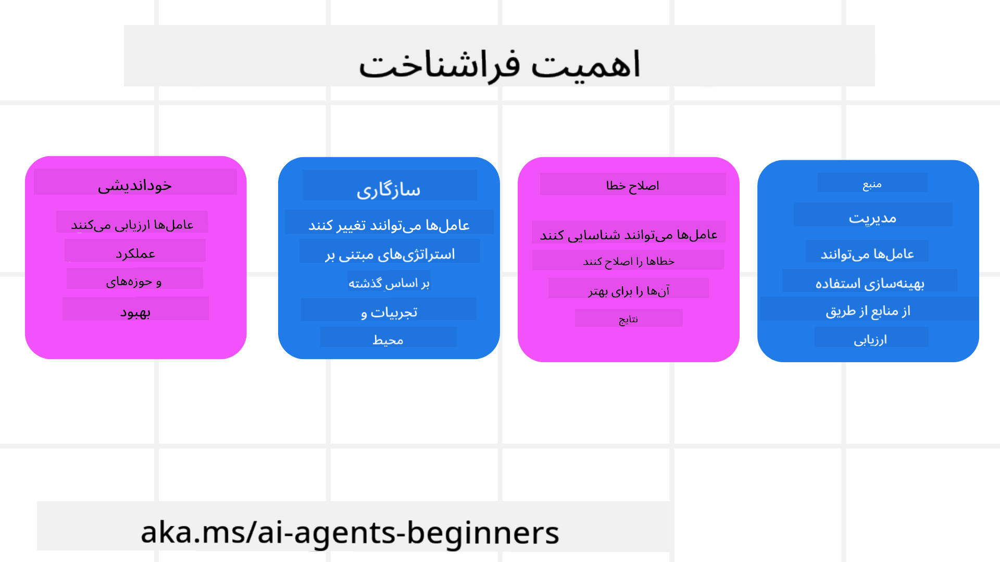
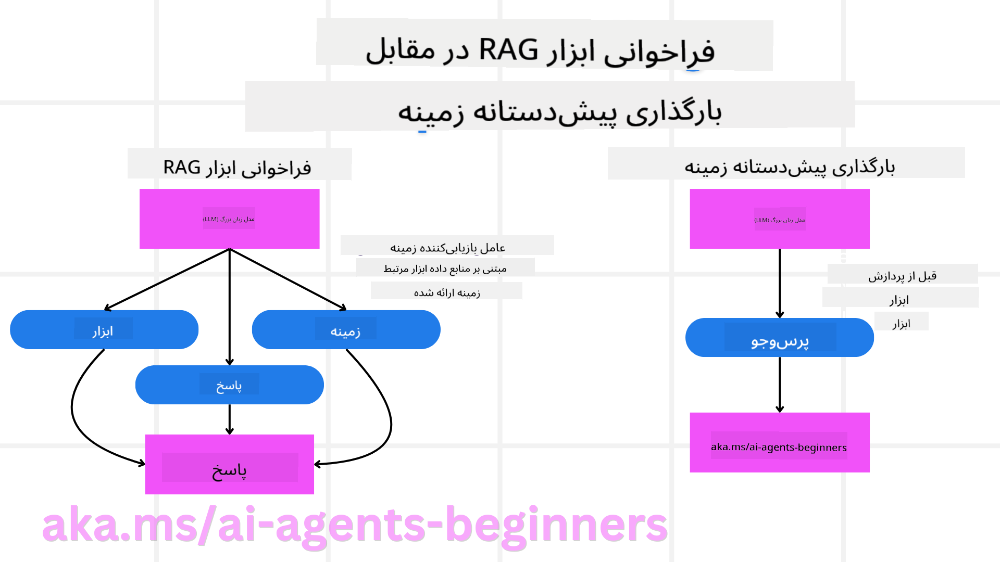

<!--
CO_OP_TRANSLATOR_METADATA:
{
  "original_hash": "8cbf460468c802c7994aa62e0e0779c9",
  "translation_date": "2025-07-12T11:55:07+00:00",
  "source_file": "09-metacognition/README.md",
  "language_code": "fa"
}
-->
[](https://youtu.be/His9R6gw6Ec?si=3_RMb8VprNvdLRhX)

> _(برای مشاهده ویدئوی این درس روی تصویر بالا کلیک کنید)_
# فراشناخت در عامل‌های هوش مصنوعی

## مقدمه

به درس فراشناخت در عامل‌های هوش مصنوعی خوش آمدید! این فصل برای مبتدیانی طراحی شده که کنجکاوند بدانند عامل‌های هوش مصنوعی چگونه می‌توانند درباره فرآیندهای فکری خودشان فکر کنند. در پایان این درس، مفاهیم کلیدی را درک خواهید کرد و با مثال‌های عملی برای به‌کارگیری فراشناخت در طراحی عامل‌های هوش مصنوعی مجهز خواهید شد.

## اهداف یادگیری

پس از اتمام این درس، قادر خواهید بود:

1. پیامدهای حلقه‌های استدلال در تعریف عامل‌ها را درک کنید.
2. از تکنیک‌های برنامه‌ریزی و ارزیابی برای کمک به عامل‌های خوداصلاح‌گر استفاده کنید.
3. عامل‌های خود را بسازید که قادر به دستکاری کد برای انجام وظایف باشند.

## معرفی فراشناخت

فراشناخت به فرآیندهای شناختی مرتبه بالاتر اشاره دارد که شامل فکر کردن درباره فکر خود فرد است. برای عامل‌های هوش مصنوعی، این یعنی توانایی ارزیابی و تنظیم اقدامات خود بر اساس خودآگاهی و تجربیات گذشته. فراشناخت، یا «فکر کردن درباره فکر»، مفهومی مهم در توسعه سیستم‌های هوش مصنوعی عاملی است. این مفهوم شامل آگاهی سیستم‌های هوش مصنوعی از فرآیندهای داخلی خود و توانایی نظارت، تنظیم و تطبیق رفتارشان است. درست مانند زمانی که ما موقعیت را می‌خوانیم یا به یک مسئله نگاه می‌کنیم. این خودآگاهی می‌تواند به سیستم‌های هوش مصنوعی کمک کند تصمیمات بهتری بگیرند، خطاها را شناسایی کنند و عملکردشان را در طول زمان بهبود بخشند — که دوباره به آزمون تورینگ و بحث درباره اینکه آیا هوش مصنوعی قرار است کنترل را به دست بگیرد، مرتبط می‌شود.

در زمینه سیستم‌های هوش مصنوعی عاملی، فراشناخت می‌تواند به حل چندین چالش کمک کند، مانند:
- شفافیت: اطمینان از اینکه سیستم‌های هوش مصنوعی می‌توانند استدلال و تصمیمات خود را توضیح دهند.
- استدلال: تقویت توانایی سیستم‌های هوش مصنوعی در ترکیب اطلاعات و اتخاذ تصمیمات منطقی.
- تطبیق‌پذیری: اجازه دادن به سیستم‌های هوش مصنوعی برای سازگاری با محیط‌های جدید و شرایط متغیر.
- ادراک: بهبود دقت سیستم‌های هوش مصنوعی در شناسایی و تفسیر داده‌ها از محیط خود.

### فراشناخت چیست؟

فراشناخت، یا «فکر کردن درباره فکر»، فرآیند شناختی مرتبه بالاتری است که شامل خودآگاهی و خودتنظیمی فرآیندهای شناختی فرد می‌شود. در حوزه هوش مصنوعی، فراشناخت به عامل‌ها قدرت می‌دهد تا استراتژی‌ها و اقدامات خود را ارزیابی و تطبیق دهند که منجر به بهبود توانایی حل مسئله و تصمیم‌گیری می‌شود. با درک فراشناخت، می‌توانید عامل‌های هوش مصنوعی طراحی کنید که نه تنها هوشمندتر بلکه سازگارتر و کارآمدتر باشند. در فراشناخت واقعی، هوش مصنوعی به طور صریح درباره استدلال خودش استدلال می‌کند.

مثال: «من پروازهای ارزان‌تر را اولویت دادم چون... ممکن است پروازهای مستقیم را از دست بدهم، پس اجازه بده دوباره بررسی کنم.»
پیگیری اینکه چگونه یا چرا مسیر خاصی را انتخاب کرده است.
- توجه به اینکه اشتباه کرده چون بیش از حد به ترجیحات کاربر در دفعه قبل تکیه کرده، پس استراتژی تصمیم‌گیری خود را نه فقط توصیه نهایی، تغییر می‌دهد.
- تشخیص الگوهایی مانند: «هر وقت کاربر «خیلی شلوغ» را ذکر می‌کند، نباید فقط برخی جاذبه‌ها را حذف کنم بلکه باید بازتاب دهم که روش انتخاب «جاذبه‌های برتر» من اشتباه است اگر همیشه بر اساس محبوبیت رتبه‌بندی کنم.»

### اهمیت فراشناخت در عامل‌های هوش مصنوعی

فراشناخت نقش حیاتی در طراحی عامل‌های هوش مصنوعی ایفا می‌کند به دلایل زیر:



- خودبازتابی: عامل‌ها می‌توانند عملکرد خود را ارزیابی کرده و نقاط قابل بهبود را شناسایی کنند.
- سازگاری: عامل‌ها می‌توانند استراتژی‌های خود را بر اساس تجربیات گذشته و تغییرات محیطی تغییر دهند.
- اصلاح خطا: عامل‌ها می‌توانند به طور خودکار خطاها را شناسایی و اصلاح کنند که منجر به نتایج دقیق‌تر می‌شود.
- مدیریت منابع: عامل‌ها می‌توانند استفاده از منابع مانند زمان و قدرت محاسباتی را با برنامه‌ریزی و ارزیابی اقدامات خود بهینه کنند.

## اجزای یک عامل هوش مصنوعی

قبل از ورود به فرآیندهای فراشناختی، ضروری است اجزای پایه یک عامل هوش مصنوعی را بشناسیم. یک عامل هوش مصنوعی معمولاً شامل موارد زیر است:

- شخصیت: شخصیت و ویژگی‌های عامل که نحوه تعامل آن با کاربران را تعریف می‌کند.
- ابزارها: قابلیت‌ها و عملکردهایی که عامل می‌تواند انجام دهد.
- مهارت‌ها: دانش و تخصصی که عامل دارد.

این اجزا با هم کار می‌کنند تا یک «واحد تخصصی» ایجاد کنند که قادر به انجام وظایف خاص باشد.

**مثال**:
یک عامل مسافرتی را در نظر بگیرید، خدمات عاملی که نه تنها تعطیلات شما را برنامه‌ریزی می‌کند بلکه مسیر خود را بر اساس داده‌های زمان واقعی و تجربیات سفر مشتریان گذشته تنظیم می‌کند.

### مثال: فراشناخت در یک سرویس عامل مسافرتی

تصور کنید در حال طراحی یک سرویس عامل مسافرتی مبتنی بر هوش مصنوعی هستید. این عامل، «عامل مسافرتی»، به کاربران در برنامه‌ریزی تعطیلاتشان کمک می‌کند. برای وارد کردن فراشناخت، عامل مسافرتی باید اقدامات خود را بر اساس خودآگاهی و تجربیات گذشته ارزیابی و تنظیم کند. در اینجا نقش فراشناخت می‌تواند به این صورت باشد:

#### وظیفه فعلی

وظیفه فعلی کمک به کاربر برای برنامه‌ریزی یک سفر به پاریس است.

#### مراحل انجام وظیفه

1. **جمع‌آوری ترجیحات کاربر**: از کاربر درباره تاریخ سفر، بودجه، علایق (مثلاً موزه‌ها، غذا، خرید) و هر نیاز خاصی بپرسید.
2. **بازیابی اطلاعات**: جستجوی گزینه‌های پرواز، اقامت، جاذبه‌ها و رستوران‌هایی که با ترجیحات کاربر مطابقت دارند.
3. **تولید توصیه‌ها**: ارائه یک برنامه سفر شخصی‌سازی شده با جزئیات پرواز، رزرو هتل و فعالیت‌های پیشنهادی.
4. **تنظیم بر اساس بازخورد**: از کاربر بازخورد بگیرید و تنظیمات لازم را انجام دهید.

#### منابع مورد نیاز

- دسترسی به پایگاه‌های داده رزرو پرواز و هتل.
- اطلاعات درباره جاذبه‌ها و رستوران‌های پاریس.
- داده‌های بازخورد کاربران از تعاملات قبلی.

#### تجربه و خودبازتابی

عامل مسافرتی از فراشناخت برای ارزیابی عملکرد خود و یادگیری از تجربیات گذشته استفاده می‌کند. برای مثال:

1. **تحلیل بازخورد کاربر**: عامل مسافرتی بازخورد کاربران را مرور می‌کند تا بفهمد کدام توصیه‌ها مورد استقبال قرار گرفته و کدام‌ها نه. سپس پیشنهادات آینده خود را بر اساس آن تنظیم می‌کند.
2. **سازگاری**: اگر کاربر قبلاً از مکان‌های شلوغ ناراضی بوده، عامل مسافرتی در آینده از پیشنهاد مکان‌های توریستی محبوب در ساعات اوج خودداری می‌کند.
3. **اصلاح خطا**: اگر عامل مسافرتی در رزرو قبلی اشتباهی کرده باشد، مثلاً هتلی را پیشنهاد داده که ظرفیتش پر بوده، یاد می‌گیرد قبل از ارائه پیشنهاد، موجودی را دقیق‌تر بررسی کند.

#### مثال عملی برای توسعه‌دهنده

در اینجا یک نمونه ساده‌شده از کد عامل مسافرتی هنگام وارد کردن فراشناخت آورده شده است:

```python
class Travel_Agent:
    def __init__(self):
        self.user_preferences = {}
        self.experience_data = []

    def gather_preferences(self, preferences):
        self.user_preferences = preferences

    def retrieve_information(self):
        # Search for flights, hotels, and attractions based on preferences
        flights = search_flights(self.user_preferences)
        hotels = search_hotels(self.user_preferences)
        attractions = search_attractions(self.user_preferences)
        return flights, hotels, attractions

    def generate_recommendations(self):
        flights, hotels, attractions = self.retrieve_information()
        itinerary = create_itinerary(flights, hotels, attractions)
        return itinerary

    def adjust_based_on_feedback(self, feedback):
        self.experience_data.append(feedback)
        # Analyze feedback and adjust future recommendations
        self.user_preferences = adjust_preferences(self.user_preferences, feedback)

# Example usage
travel_agent = Travel_Agent()
preferences = {
    "destination": "Paris",
    "dates": "2025-04-01 to 2025-04-10",
    "budget": "moderate",
    "interests": ["museums", "cuisine"]
}
travel_agent.gather_preferences(preferences)
itinerary = travel_agent.generate_recommendations()
print("Suggested Itinerary:", itinerary)
feedback = {"liked": ["Louvre Museum"], "disliked": ["Eiffel Tower (too crowded)"]}
travel_agent.adjust_based_on_feedback(feedback)
```

#### چرا فراشناخت اهمیت دارد

- **خودبازتابی**: عامل‌ها می‌توانند عملکرد خود را تحلیل کرده و نقاط قابل بهبود را شناسایی کنند.
- **سازگاری**: عامل‌ها می‌توانند استراتژی‌ها را بر اساس بازخورد و شرایط متغیر تغییر دهند.
- **اصلاح خطا**: عامل‌ها می‌توانند به طور خودکار اشتباهات را شناسایی و اصلاح کنند.
- **مدیریت منابع**: عامل‌ها می‌توانند استفاده از منابع مانند زمان و قدرت محاسباتی را بهینه کنند.

با وارد کردن فراشناخت، عامل مسافرتی می‌تواند توصیه‌های سفر شخصی‌تر و دقیق‌تری ارائه دهد و تجربه کلی کاربر را بهبود بخشد.

---

## ۲. برنامه‌ریزی در عامل‌ها

برنامه‌ریزی یکی از اجزای حیاتی رفتار عامل‌های هوش مصنوعی است. این فرآیند شامل ترسیم گام‌های لازم برای رسیدن به هدف، با در نظر گرفتن وضعیت فعلی، منابع و موانع احتمالی است.

### عناصر برنامه‌ریزی

- **وظیفه فعلی**: تعریف واضح وظیفه.
- **مراحل انجام وظیفه**: تقسیم وظیفه به گام‌های قابل مدیریت.
- **منابع مورد نیاز**: شناسایی منابع لازم.
- **تجربه**: استفاده از تجربیات گذشته برای اطلاع‌رسانی به برنامه‌ریزی.

**مثال**:
در اینجا مراحلی که عامل مسافرتی باید برای کمک به کاربر در برنامه‌ریزی سفر خود انجام دهد آورده شده است:

### مراحل برای عامل مسافرتی

1. **جمع‌آوری ترجیحات کاربر**
   - از کاربر درباره تاریخ سفر، بودجه، علایق و هر نیاز خاصی بپرسید.
   - مثال‌ها: «چه زمانی قصد سفر دارید؟» «بودجه شما چقدر است؟» «در تعطیلات چه فعالیت‌هایی را دوست دارید؟»

2. **بازیابی اطلاعات**
   - جستجوی گزینه‌های مرتبط با ترجیحات کاربر.
   - **پروازها**: جستجوی پروازهای موجود در محدوده بودجه و تاریخ‌های مورد نظر کاربر.
   - **اقامتگاه‌ها**: یافتن هتل‌ها یا اقامتگاه‌هایی که با ترجیحات کاربر در مکان، قیمت و امکانات مطابقت دارند.
   - **جاذبه‌ها و رستوران‌ها**: شناسایی جاذبه‌ها، فعالیت‌ها و گزینه‌های غذایی محبوب که با علایق کاربر همخوانی دارند.

3. **تولید توصیه‌ها**
   - جمع‌آوری اطلاعات بازیابی شده در یک برنامه سفر شخصی‌سازی شده.
   - ارائه جزئیاتی مانند گزینه‌های پرواز، رزرو هتل و فعالیت‌های پیشنهادی، با توجه به ترجیحات کاربر.

4. **ارائه برنامه سفر به کاربر**
   - برنامه پیشنهادی را برای بازبینی به کاربر ارائه دهید.
   - مثال: «این برنامه پیشنهادی سفر شما به پاریس است. شامل جزئیات پرواز، رزرو هتل و فهرستی از فعالیت‌ها و رستوران‌های پیشنهادی است. نظرتان چیست؟»

5. **جمع‌آوری بازخورد**
   - از کاربر درباره برنامه پیشنهادی بازخورد بگیرید.
   - مثال‌ها: «آیا گزینه‌های پرواز را دوست دارید؟» «هتل مناسب نیازهای شماست؟» «آیا فعالیتی هست که بخواهید اضافه یا حذف شود؟»

6. **تنظیم بر اساس بازخورد**
   - برنامه را بر اساس بازخورد کاربر تغییر دهید.
   - تغییرات لازم در پرواز، اقامت و فعالیت‌ها را برای تطبیق بهتر با ترجیحات کاربر اعمال کنید.

7. **تأیید نهایی**
   - برنامه به‌روزشده را برای تأیید نهایی به کاربر ارائه دهید.
   - مثال: «تغییرات را بر اساس بازخورد شما اعمال کردم. این برنامه به‌روزشده است. همه چیز خوب به نظر می‌رسد؟»

8. **رزرو و تأیید نهایی**
   - پس از تأیید کاربر، پروازها، اقامتگاه‌ها و فعالیت‌های پیش‌برنامه‌ریزی شده را رزرو کنید.
   - جزئیات تأیید را به کاربر ارسال کنید.

9. **ارائه پشتیبانی مداوم**
   - در طول سفر و قبل از آن برای کمک به کاربر در تغییرات یا درخواست‌های اضافی در دسترس باشید.
   - مثال: «اگر در طول سفر به کمک بیشتری نیاز داشتید، هر زمان می‌توانید با من تماس بگیرید!»

### مثال تعامل

```python
class Travel_Agent:
    def __init__(self):
        self.user_preferences = {}
        self.experience_data = []

    def gather_preferences(self, preferences):
        self.user_preferences = preferences

    def retrieve_information(self):
        flights = search_flights(self.user_preferences)
        hotels = search_hotels(self.user_preferences)
        attractions = search_attractions(self.user_preferences)
        return flights, hotels, attractions

    def generate_recommendations(self):
        flights, hotels, attractions = self.retrieve_information()
        itinerary = create_itinerary(flights, hotels, attractions)
        return itinerary

    def adjust_based_on_feedback(self, feedback):
        self.experience_data.append(feedback)
        self.user_preferences = adjust_preferences(self.user_preferences, feedback)

# Example usage within a booing request
travel_agent = Travel_Agent()
preferences = {
    "destination": "Paris",
    "dates": "2025-04-01 to 2025-04-10",
    "budget": "moderate",
    "interests": ["museums", "cuisine"]
}
travel_agent.gather_preferences(preferences)
itinerary = travel_agent.generate_recommendations()
print("Suggested Itinerary:", itinerary)
feedback = {"liked": ["Louvre Museum"], "disliked": ["Eiffel Tower (too crowded)"]}
travel_agent.adjust_based_on_feedback(feedback)
```

## ۳. سیستم اصلاحی RAG

ابتدا بیایید تفاوت بین ابزار RAG و بارگذاری پیش‌گیرانه زمینه را درک کنیم



### تولید تقویت‌شده با بازیابی (RAG)

RAG ترکیبی از یک سیستم بازیابی و یک مدل تولیدی است. وقتی پرسشی مطرح می‌شود، سیستم بازیابی اسناد یا داده‌های مرتبط را از منبع خارجی می‌گیرد و این اطلاعات بازیابی شده برای تقویت ورودی مدل تولیدی استفاده می‌شود. این به مدل کمک می‌کند پاسخ‌های دقیق‌تر و مرتبط‌تری تولید کند.

در سیستم RAG، عامل اطلاعات مرتبط را از یک پایگاه دانش بازیابی می‌کند و از آن برای تولید پاسخ‌ها یا اقدامات مناسب استفاده می‌کند.

### رویکرد اصلاحی RAG

رویکرد اصلاحی RAG بر استفاده از تکنیک‌های RAG برای اصلاح خطاها و بهبود دقت عامل‌های هوش مصنوعی تمرکز دارد. این شامل موارد زیر است:

1. **تکنیک درخواست**: استفاده از درخواست‌های خاص برای هدایت عامل در بازیابی اطلاعات مرتبط.
2. **ابزار**: پیاده‌سازی الگوریتم‌ها و مکانیزم‌هایی که به عامل امکان می‌دهد مرتبط بودن اطلاعات بازیابی شده را ارزیابی کرده و پاسخ‌های دقیق تولید کند.
3. **ارزیابی**: ارزیابی مداوم عملکرد عامل و انجام تنظیمات برای بهبود دقت و کارایی آن.

#### مثال: RAG اصلاحی در یک عامل جستجو

یک عامل جستجو را در نظر بگیرید که اطلاعات را از وب برای پاسخ به پرسش‌های کاربر بازیابی می‌کند. رویکرد اصلاحی RAG ممکن است شامل موارد زیر باشد:

1. **تکنیک درخواست**: فرموله کردن پرسش‌های جستجو بر اساس ورودی کاربر.
2. **ابزار**: استفاده از پردازش زبان طبیعی و الگوریتم‌های یادگیری ماشین برای رتبه‌بندی و فیلتر کردن نتایج جستجو.
3. **ارزیابی**: تحلیل بازخورد کاربر برای شناسایی و اصلاح نادرستی‌ها در اطلاعات بازیابی شده.

### RAG اصلاحی در عامل مسافرتی

RAG اصلاحی (تولید تقویت‌شده با بازیابی) توانایی هوش مصنوعی را در بازیابی و تولید اطلاعات بهبود می‌بخشد و در عین حال هر گونه نادرستی را اصلاح می‌کند. بیایید ببینیم چگونه عامل مسافرتی می‌تواند از رویکرد اصلاحی RAG برای ارائه توصیه‌های سفر دقیق‌تر و مرتبط‌تر استفاده کند.

این شامل موارد زیر است:

- **تکنیک درخواست:** استفاده از درخواست‌های خاص برای هدایت عامل در بازیابی اطلاعات مرتبط.
- **ابزار:** پیاده‌سازی الگوریتم‌ها و مکانیزم‌هایی که به عامل امکان می‌دهد مرتبط بودن اطلاعات بازیابی شده را ارزیابی کرده و پاسخ‌های دقیق تولید کند.
- **ارزیابی:** ارزیابی مداوم عملکرد عامل و انجام تنظیمات برای بهبود دقت و کارایی آن.

#### مراحل پیاده‌سازی RAG اصلاحی در عامل مسافرتی

1. **تعامل اولیه با کاربر**
   - عامل مسافرتی ترجیحات اولیه کاربر مانند مقصد، تاریخ سفر، بودجه و علایق را جمع‌آوری می‌کند.
   - مثال:

     ```python
     preferences = {
         "destination": "Paris",
         "dates": "2025-04-01 to 2025-04-10",
         "budget": "moderate",
         "interests": ["museums", "cuisine"]
     }
     ```

2. **بازیابی اطلاعات**
   - عامل مسافرتی اطلاعات مربوط به پروازها، اقامتگاه‌ها، جاذبه‌ها و رستوران‌ها را بر اساس ترجیحات کاربر بازیابی می‌کند.
   - مثال:

     ```python
     flights = search_flights(preferences)
     hotels = search_hotels(preferences)
     attractions = search_attractions(preferences)
     ```

3. **تولید توصیه‌های اولیه**
   - عامل مسافرتی از اطلاعات بازیابی شده برای تولید یک برنامه سفر شخصی‌سازی شده استفاده می‌کند.
   - مثال:

     ```python
     itinerary = create_itinerary(flights, hotels, attractions)
     print("Suggested Itinerary:", itinerary)
     ```

4. **جمع‌آوری بازخورد کاربر**
   - عامل مسافرتی از کاربر بازخورد درباره توصیه‌های اولیه می‌گیرد.
   - مثال:

     ```python
     feedback = {
         "liked": ["Louvre Museum"],
         "disliked": ["Eiffel Tower (too crowded)"]
     }
     ```

5. **فرآیند RAG اصلاحی**
   - **تکنیک درخواست**: عامل مسافرتی پرسش‌های جستجوی جدیدی بر اساس بازخورد کاربر فرموله می‌کند.
     - مثال:

       ```python
       if "disliked" in feedback:
           preferences["avoid"] = feedback["disliked"]
       ```

   - **ابزار**: عامل مسافرتی از الگوریتم‌ها برای رتبه‌بندی و فیلتر کردن نتایج جستجوی جدید استفاده می‌کند و بر اساس بازخورد کاربر مرتبط بودن را برجسته می‌کند.
     - مثال:

       ```python
       new_attractions = search_attractions(preferences)
       new_itinerary = create_itinerary(flights, hotels, new_attractions)
       print("Updated Itinerary:", new_itinerary)
       ```

   - **ارزیابی**: عامل مسافرتی به طور مداوم مرتبط بودن و دقت توصیه‌های خود را با تحلیل بازخورد کاربر ارزیابی کرده و تنظیمات لازم را انجام می‌دهد.
     - مثال:

       ```python
       def adjust_preferences(preferences, feedback):
           if "liked" in feedback:
               preferences["favorites"] = feedback["liked"]
           if "disliked" in feedback:
               preferences["avoid"] = feedback["disliked"]
           return preferences

       preferences = adjust_preferences(preferences, feedback)
       ```

#### مثال عملی

در اینجا یک نمونه کد ساده‌شده پایتون آورده شده که رویکرد اصلاحی RAG را در عامل مسافرتی پیاده‌سازی می‌کند:
### بارگذاری پیش‌دستانه‌ی زمینه

بارگذاری پیش‌دستانه‌ی زمینه به معنای بارگذاری اطلاعات مرتبط یا پیش‌زمینه‌ای در مدل قبل از پردازش یک پرسش است. این یعنی مدل از ابتدا به این اطلاعات دسترسی دارد که می‌تواند به تولید پاسخ‌های آگاهانه‌تر کمک کند بدون اینکه نیاز باشد در حین پردازش داده‌های اضافی بازیابی شود.

در اینجا یک مثال ساده‌شده از نحوه‌ی بارگذاری پیش‌دستانه‌ی زمینه برای یک برنامه‌ی آژانس مسافرتی به زبان پایتون آمده است:

#### توضیح

1. **مقدارسازی اولیه (متد `__init__`)**: کلاس `TravelAgent` یک دیکشنری شامل اطلاعات درباره‌ی مقاصد محبوب مانند پاریس، توکیو، نیویورک و سیدنی را پیش‌بارگذاری می‌کند. این دیکشنری شامل جزئیاتی مثل کشور، ارز، زبان و جاذبه‌های اصلی هر مقصد است.

2. **دریافت اطلاعات (متد `get_destination_info`)**: وقتی کاربر درباره‌ی یک مقصد خاص سوال می‌کند، این متد اطلاعات مرتبط را از دیکشنری پیش‌بارگذاری شده بازیابی می‌کند.

با پیش‌بارگذاری زمینه، برنامه‌ی آژانس مسافرتی می‌تواند سریع‌تر به پرسش‌های کاربر پاسخ دهد بدون اینکه نیاز باشد اطلاعات را به صورت زنده از منبع خارجی دریافت کند. این باعث می‌شود برنامه کارآمدتر و پاسخگوتر باشد.

### شروع برنامه با هدف مشخص قبل از تکرار

شروع برنامه با هدف مشخص یعنی داشتن یک هدف یا نتیجه‌ی واضح از ابتدا. با تعریف این هدف، مدل می‌تواند آن را به عنوان راهنمایی در طول فرایند تکراری استفاده کند. این کمک می‌کند که هر تکرار به سمت رسیدن به نتیجه‌ی مطلوب حرکت کند و فرایند کارآمدتر و متمرکزتر شود.

در اینجا مثالی از نحوه‌ی شروع برنامه‌ی سفر با هدف مشخص قبل از تکرار برای یک آژانس مسافرتی به زبان پایتون آمده است:

### سناریو

یک آژانس مسافرتی می‌خواهد برای یک مشتری تعطیلات سفارشی برنامه‌ریزی کند. هدف ایجاد یک برنامه سفر است که رضایت مشتری را بر اساس ترجیحات و بودجه‌ی او به حداکثر برساند.

### مراحل

1. تعریف ترجیحات و بودجه‌ی مشتری.
2. شروع برنامه اولیه بر اساس این ترجیحات.
3. تکرار برای بهبود برنامه و بهینه‌سازی رضایت مشتری.

#### کد پایتون

#### توضیح کد

1. **مقدارسازی اولیه (متد `__init__`)**: کلاس `TravelAgent` با لیستی از مقاصد احتمالی مقداردهی اولیه می‌شود که هر کدام ویژگی‌هایی مانند نام، هزینه و نوع فعالیت دارند.

2. **شروع برنامه (متد `bootstrap_plan`)**: این متد برنامه‌ی سفر اولیه را بر اساس ترجیحات و بودجه‌ی مشتری ایجاد می‌کند. در این فرایند، مقاصد مطابق با ترجیحات مشتری و بودجه به برنامه اضافه می‌شوند.

3. **مطابقت ترجیحات (متد `match_preferences`)**: این متد بررسی می‌کند که آیا یک مقصد با ترجیحات مشتری همخوانی دارد یا خیر.

4. **تکرار برنامه (متد `iterate_plan`)**: این متد برنامه‌ی اولیه را با تلاش برای جایگزینی هر مقصد با گزینه‌ای بهتر، با در نظر گرفتن ترجیحات و محدودیت‌های بودجه بهبود می‌بخشد.

5. **محاسبه هزینه (متد `calculate_cost`)**: این متد هزینه‌ی کل برنامه‌ی فعلی را، شامل مقصد جدید احتمالی، محاسبه می‌کند.

#### مثال استفاده

- **برنامه اولیه**: آژانس مسافرتی برنامه‌ای اولیه بر اساس ترجیحات مشتری برای بازدید از جاذبه‌ها و بودجه ۲۰۰۰ دلار ایجاد می‌کند.
- **برنامه بهبود یافته**: آژانس برنامه را تکرار می‌کند و آن را برای ترجیحات و بودجه‌ی مشتری بهینه می‌سازد.

با شروع برنامه با هدف مشخص (مثلاً حداکثر کردن رضایت مشتری) و تکرار برای بهبود آن، آژانس مسافرتی می‌تواند یک برنامه سفر سفارشی و بهینه برای مشتری ایجاد کند. این روش تضمین می‌کند که برنامه از ابتدا با ترجیحات و بودجه‌ی مشتری هماهنگ است و با هر تکرار بهتر می‌شود.

### استفاده از مدل‌های زبانی بزرگ برای رتبه‌بندی مجدد و امتیازدهی

مدل‌های زبانی بزرگ (LLM) می‌توانند برای رتبه‌بندی مجدد و امتیازدهی با ارزیابی میزان ارتباط و کیفیت اسناد بازیابی شده یا پاسخ‌های تولید شده استفاده شوند. نحوه‌ی کار به این صورت است:

**بازیابی:** مرحله‌ی اولیه بازیابی مجموعه‌ای از اسناد یا پاسخ‌های کاندید بر اساس پرسش را انجام می‌دهد.

**رتبه‌بندی مجدد:** مدل LLM این کاندیدها را ارزیابی کرده و بر اساس ارتباط و کیفیت، آنها را رتبه‌بندی مجدد می‌کند. این مرحله تضمین می‌کند که مرتبط‌ترین و باکیفیت‌ترین اطلاعات ابتدا ارائه شوند.

**امتیازدهی:** مدل به هر کاندید امتیازی می‌دهد که نشان‌دهنده‌ی میزان ارتباط و کیفیت آن است. این کمک می‌کند بهترین پاسخ یا سند برای کاربر انتخاب شود.

با استفاده از LLM برای رتبه‌بندی مجدد و امتیازدهی، سیستم می‌تواند اطلاعات دقیق‌تر و مرتبط‌تری ارائه دهد و تجربه‌ی کاربری را بهبود بخشد.

در اینجا مثالی از نحوه‌ی استفاده‌ی یک آژانس مسافرتی از مدل زبانی بزرگ برای رتبه‌بندی مجدد و امتیازدهی مقاصد سفر بر اساس ترجیحات کاربر در پایتون آمده است:

#### سناریو - سفر بر اساس ترجیحات

یک آژانس مسافرتی می‌خواهد بهترین مقاصد سفر را بر اساس ترجیحات مشتری پیشنهاد دهد. مدل LLM به رتبه‌بندی مجدد و امتیازدهی مقاصد کمک می‌کند تا مرتبط‌ترین گزینه‌ها ارائه شوند.

#### مراحل:

1. جمع‌آوری ترجیحات کاربر.
2. بازیابی لیستی از مقاصد سفر احتمالی.
3. استفاده از LLM برای رتبه‌بندی مجدد و امتیازدهی مقاصد بر اساس ترجیحات کاربر.

در اینجا نحوه‌ی به‌روزرسانی مثال قبلی برای استفاده از خدمات Azure OpenAI آمده است:

#### پیش‌نیازها

1. داشتن اشتراک Azure.
2. ایجاد منبع Azure OpenAI و دریافت کلید API.

#### کد نمونه پایتون

#### توضیح کد - رزروکننده ترجیحات

1. **مقدارسازی اولیه**: کلاس `TravelAgent` با لیستی از مقاصد سفر احتمالی مقداردهی اولیه می‌شود که هر کدام ویژگی‌هایی مانند نام و توضیحات دارند.

2. **دریافت پیشنهادات (متد `get_recommendations`)**: این متد یک پرامپت برای سرویس Azure OpenAI بر اساس ترجیحات کاربر ایجاد می‌کند و درخواست HTTP POST به API Azure OpenAI ارسال می‌کند تا مقاصد رتبه‌بندی مجدد شده و امتیازدهی شوند.

3. **ساخت پرامپت (متد `generate_prompt`)**: این متد پرامپتی برای Azure OpenAI می‌سازد که شامل ترجیحات کاربر و لیست مقاصد است. پرامپت مدل را راهنمایی می‌کند تا مقاصد را بر اساس ترجیحات ارائه شده رتبه‌بندی و امتیازدهی کند.

4. **درخواست API**: از کتابخانه `requests` برای ارسال درخواست HTTP POST به نقطه‌ی پایانی API Azure OpenAI استفاده می‌شود. پاسخ شامل مقاصد رتبه‌بندی مجدد شده و امتیازدهی شده است.

5. **مثال استفاده**: آژانس مسافرتی ترجیحات کاربر (مثلاً علاقه به بازدید از جاذبه‌ها و فرهنگ متنوع) را جمع‌آوری کرده و از سرویس Azure OpenAI برای دریافت پیشنهادات رتبه‌بندی شده و امتیازدهی شده استفاده می‌کند.

حتما `your_azure_openai_api_key` را با کلید API واقعی Azure OpenAI خود و `https://your-endpoint.com/...` را با آدرس واقعی نقطه‌ی پایانی سرویس جایگزین کنید.

با استفاده از LLM برای رتبه‌بندی مجدد و امتیازدهی، آژانس مسافرتی می‌تواند پیشنهادات سفر شخصی‌سازی شده و مرتبط‌تری به مشتریان ارائه دهد و تجربه‌ی کلی آنها را بهبود بخشد.

### RAG: تکنیک پرامپتینگ در مقابل ابزار

تولید تقویت‌شده با بازیابی (RAG) می‌تواند هم به عنوان یک تکنیک پرامپتینگ و هم به عنوان یک ابزار در توسعه‌ی عامل‌های هوش مصنوعی استفاده شود. درک تفاوت این دو به شما کمک می‌کند تا RAG را به شکل موثرتری در پروژه‌هایتان به کار ببرید.

#### RAG به عنوان تکنیک پرامپتینگ

**چیست؟**

- به عنوان تکنیک پرامپتینگ، RAG شامل فرموله کردن پرسش‌ها یا پرامپت‌های خاص برای هدایت بازیابی اطلاعات مرتبط از یک مجموعه‌ی بزرگ یا پایگاه داده است. این اطلاعات سپس برای تولید پاسخ یا اقدام استفاده می‌شود.

**نحوه‌ی کار:**

1. **فرمول‌بندی پرامپت‌ها**: ایجاد پرامپت‌ها یا پرسش‌های ساختارمند بر اساس وظیفه یا ورودی کاربر.
2. **بازیابی اطلاعات**: استفاده از پرامپت‌ها برای جستجوی داده‌های مرتبط از پایگاه دانش یا مجموعه داده موجود.
3. **تولید پاسخ**: ترکیب اطلاعات بازیابی شده با مدل‌های تولیدی هوش مصنوعی برای تولید پاسخ جامع و منسجم.

**مثال در آژانس مسافرتی**:

- ورودی کاربر: «می‌خواهم از موزه‌های پاریس بازدید کنم.»
- پرامپت: «بهترین موزه‌های پاریس را پیدا کن.»
- اطلاعات بازیابی شده: جزئیات موزه لوور، موزه اورسی و غیره.
- پاسخ تولید شده: «در اینجا چند موزه برتر در پاریس هستند: موزه لوور، موزه اورسی و مرکز پمپیدو.»

#### RAG به عنوان ابزار

**چیست؟**

- به عنوان ابزار، RAG یک سیستم یکپارچه است که فرایند بازیابی و تولید را خودکار می‌کند و به توسعه‌دهندگان اجازه می‌دهد بدون نیاز به ساخت دستی پرامپت برای هر پرسش، قابلیت‌های پیچیده‌ی هوش مصنوعی را پیاده‌سازی کنند.

**نحوه‌ی کار:**

1. **یکپارچه‌سازی**: تعبیه RAG در معماری عامل هوش مصنوعی که به طور خودکار وظایف بازیابی و تولید را مدیریت می‌کند.
2. **خودکارسازی**: ابزار کل فرایند را از دریافت ورودی کاربر تا تولید پاسخ نهایی بدون نیاز به پرامپت‌های صریح برای هر مرحله مدیریت می‌کند.
3. **کارایی**: با ساده‌سازی فرایند بازیابی و تولید، عملکرد عامل را بهبود می‌بخشد و پاسخ‌ها را سریع‌تر و دقیق‌تر می‌کند.

**مثال در آژانس مسافرتی**:

- ورودی کاربر: «می‌خواهم از موزه‌های پاریس بازدید کنم.»
- ابزار RAG: به طور خودکار اطلاعات مربوط به موزه‌ها را بازیابی و پاسخ تولید می‌کند.
- پاسخ تولید شده: «در اینجا چند موزه برتر در پاریس هستند: موزه لوور، موزه اورسی و مرکز پمپیدو.»

### مقایسه

| جنبه                  | تکنیک پرامپتینگ                                         | ابزار                                                  |
|-----------------------|----------------------------------------------------------|-------------------------------------------------------|
| **دستی در مقابل خودکار** | فرموله‌سازی دستی پرامپت‌ها برای هر پرسش.                 | فرایند خودکار بازیابی و تولید.                        |
| **کنترل**             | کنترل بیشتر بر فرایند بازیابی.                            | ساده‌سازی و خودکارسازی فرایند بازیابی و تولید.       |
| **انعطاف‌پذیری**      | امکان ایجاد پرامپت‌های سفارشی بر اساس نیازهای خاص.       | کارآمدتر برای پیاده‌سازی‌های بزرگ‌مقیاس.              |
| **پیچیدگی**           | نیاز به ساخت و تنظیم پرامپت‌ها.                          | آسان‌تر برای ادغام در معماری عامل هوش مصنوعی.         |

### مثال‌های عملی

**مثال تکنیک پرامپتینگ:**

**مثال ابزار:**

### ارزیابی ارتباط

ارزیابی ارتباط یکی از جنبه‌های حیاتی عملکرد عامل‌های هوش مصنوعی است. این کار تضمین می‌کند که اطلاعات بازیابی شده و تولید شده توسط عامل مناسب، دقیق و مفید برای کاربر باشد. بیایید بررسی کنیم چگونه می‌توان ارتباط را در عامل‌های هوش مصنوعی ارزیابی کرد، همراه با مثال‌ها و تکنیک‌های عملی.

#### مفاهیم کلیدی در ارزیابی ارتباط

1. **آگاهی از زمینه**:
   - عامل باید زمینه‌ی پرسش کاربر را درک کند تا اطلاعات مرتبط بازیابی و تولید کند.
   - مثال: اگر کاربر بپرسد «بهترین رستوران‌های پاریس کدامند؟»، عامل باید ترجیحات کاربر مانند نوع غذا و بودجه را در نظر بگیرد.

2. **دقت**:
   - اطلاعات ارائه شده باید از نظر واقعی بودن و به‌روز بودن صحیح باشند.
   - مثال: پیشنهاد رستوران‌هایی که در حال حاضر باز هستند و نظرات خوبی دارند، نه گزینه‌های قدیمی یا بسته شده.

3. **نیت کاربر**:
   - عامل باید نیت پشت پرسش کاربر را استنباط کند تا مرتبط‌ترین اطلاعات را ارائه دهد.
   - مثال: اگر کاربر بپرسد «هتل‌های مقرون به صرفه»، عامل باید گزینه‌های اقتصادی را اولویت دهد.

4. **حلقه بازخورد**:
   - جمع‌آوری و تحلیل مداوم بازخورد کاربر به عامل کمک می‌کند فرایند ارزیابی ارتباط را بهبود بخشد.
   - مثال: استفاده از امتیازدهی و بازخورد کاربران درباره‌ی پیشنهادات قبلی برای بهبود پاسخ‌های آینده.

#### تکنیک‌های عملی برای ارزیابی ارتباط

1. **امتیازدهی ارتباط**:
   - به هر مورد بازیابی شده بر اساس میزان تطابق با پرسش و ترجیحات کاربر امتیاز تعلق می‌گیرد.
   - مثال:

2. **فیلتر و رتبه‌بندی**:
   - موارد نامرتبط حذف شده و موارد باقی‌مانده بر اساس امتیاز ارتباط رتبه‌بندی می‌شوند.
   - مثال:

3. **پردازش زبان طبیعی (NLP)**:
   - استفاده از تکنیک‌های NLP برای درک پرسش کاربر و بازیابی اطلاعات مرتبط.
   - مثال:

4. **ادغام بازخورد کاربر**:
   - جمع‌آوری بازخورد کاربران درباره‌ی پیشنهادات ارائه شده و استفاده از آن برای تنظیم ارزیابی‌های آینده.
   - مثال:

#### مثال: ارزیابی ارتباط در آژانس مسافرتی

در اینجا یک مثال عملی از نحوه‌ی ارزیابی ارتباط پیشنهادات سفر توسط آژانس مسافرتی آمده است:

### جستجو با نیت

جستجو با نیت به معنای درک و تفسیر هدف یا منظور پشت پرسش کاربر برای بازیابی و تولید مرتبط‌ترین و مفیدترین اطلاعات است. این رویکرد فراتر از تطابق صرف کلمات کلیدی می‌رود و بر درک نیازها و زمینه‌ی واقعی کاربر تمرکز دارد.

#### مفاهیم کلیدی در جستجو با نیت

1. **درک نیت کاربر**:
   - نیت کاربر را می‌توان به سه دسته‌ی اصلی تقسیم کرد: اطلاعاتی، ناوبری و تراکنشی.
     - **نیت اطلاعاتی**: کاربر به دنبال اطلاعات درباره‌ی موضوعی است (مثلاً «بهترین موزه‌های پاریس کدامند؟»).
     - **نیت ناوبری**: کاربر می‌خواهد به وب‌سایت یا صفحه‌ای خاص برود (مثلاً «وب‌سایت رسمی موزه لوور»).
     - **نیت تراکنشی**: کاربر قصد انجام تراکنش دارد، مانند رزرو پرواز یا خرید (مثلاً «رزرو پرواز به پاریس»).

2. **آگاهی از زمینه**:
   - تحلیل زمینه‌ی پرسش کاربر به شناسایی دقیق‌تر نیت کمک می‌کند. این شامل در نظر گرفتن تعاملات قبلی، ترجیحات کاربر و جزئیات پرسش فعلی است.

3. **پردازش زبان طبیعی (NLP)**:
   - از تکنیک‌های NLP برای درک و تفسیر پرسش‌های زبان طبیعی کاربران استفاده می‌شود. این شامل شناسایی موجودیت‌ها، تحلیل احساسات و تجزیه پرسش است.

4. **شخصی‌سازی**:
   - شخصی‌سازی نتایج جستجو بر اساس تاریخچه، ترجیحات و بازخورد کاربر، مرتبط بودن اطلاعات بازیابی شده را افزایش می‌دهد.
#### مثال عملی: جستجو با هدف در Travel Agent

بیایید Travel Agent را به عنوان مثال بررسی کنیم تا ببینیم چگونه می‌توان جستجو با هدف را پیاده‌سازی کرد.

1. **جمع‌آوری ترجیحات کاربر**

   ```python
   class Travel_Agent:
       def __init__(self):
           self.user_preferences = {}

       def gather_preferences(self, preferences):
           self.user_preferences = preferences
   ```

2. **درک هدف کاربر**

   ```python
   def identify_intent(query):
       if "book" in query or "purchase" in query:
           return "transactional"
       elif "website" in query or "official" in query:
           return "navigational"
       else:
           return "informational"
   ```

3. **آگاهی از زمینه**

   ```python
   def analyze_context(query, user_history):
       # Combine current query with user history to understand context
       context = {
           "current_query": query,
           "user_history": user_history
       }
       return context
   ```

4. **جستجو و شخصی‌سازی نتایج**

   ```python
   def search_with_intent(query, preferences, user_history):
       intent = identify_intent(query)
       context = analyze_context(query, user_history)
       if intent == "informational":
           search_results = search_information(query, preferences)
       elif intent == "navigational":
           search_results = search_navigation(query)
       elif intent == "transactional":
           search_results = search_transaction(query, preferences)
       personalized_results = personalize_results(search_results, user_history)
       return personalized_results

   def search_information(query, preferences):
       # Example search logic for informational intent
       results = search_web(f"best {preferences['interests']} in {preferences['destination']}")
       return results

   def search_navigation(query):
       # Example search logic for navigational intent
       results = search_web(query)
       return results

   def search_transaction(query, preferences):
       # Example search logic for transactional intent
       results = search_web(f"book {query} to {preferences['destination']}")
       return results

   def personalize_results(results, user_history):
       # Example personalization logic
       personalized = [result for result in results if result not in user_history]
       return personalized[:10]  # Return top 10 personalized results
   ```

5. **نمونه استفاده**

   ```python
   travel_agent = Travel_Agent()
   preferences = {
       "destination": "Paris",
       "interests": ["museums", "cuisine"]
   }
   travel_agent.gather_preferences(preferences)
   user_history = ["Louvre Museum website", "Book flight to Paris"]
   query = "best museums in Paris"
   results = search_with_intent(query, preferences, user_history)
   print("Search Results:", results)
   ```

---

## ۴. تولید کد به عنوان ابزار

عامل‌های تولید کد از مدل‌های هوش مصنوعی برای نوشتن و اجرای کد استفاده می‌کنند تا مسائل پیچیده را حل کرده و کارها را خودکار کنند.

### عامل‌های تولید کد

عامل‌های تولید کد با استفاده از مدل‌های مولد هوش مصنوعی کد می‌نویسند و اجرا می‌کنند. این عامل‌ها می‌توانند مسائل پیچیده را حل کنند، کارها را خودکار کنند و با تولید و اجرای کد در زبان‌های برنامه‌نویسی مختلف، بینش‌های ارزشمندی ارائه دهند.

#### کاربردهای عملی

1. **تولید خودکار کد**: تولید قطعات کد برای وظایف خاص مانند تحلیل داده، وب‌اسکرپینگ یا یادگیری ماشین.
2. **SQL به عنوان RAG**: استفاده از کوئری‌های SQL برای بازیابی و دستکاری داده‌ها از پایگاه‌های داده.
3. **حل مسئله**: ایجاد و اجرای کد برای حل مسائل خاص، مانند بهینه‌سازی الگوریتم‌ها یا تحلیل داده‌ها.

#### مثال: عامل تولید کد برای تحلیل داده

فرض کنید در حال طراحی یک عامل تولید کد هستید. این‌گونه کار می‌کند:

1. **وظیفه**: تحلیل یک مجموعه داده برای شناسایی روندها و الگوها.
2. **مراحل**:
   - بارگذاری مجموعه داده در ابزار تحلیل داده.
   - تولید کوئری‌های SQL برای فیلتر و تجمیع داده‌ها.
   - اجرای کوئری‌ها و دریافت نتایج.
   - استفاده از نتایج برای تولید نمودارها و بینش‌ها.
3. **منابع مورد نیاز**: دسترسی به مجموعه داده، ابزارهای تحلیل داده و قابلیت‌های SQL.
4. **تجربه**: استفاده از نتایج تحلیل‌های گذشته برای بهبود دقت و مرتبط بودن تحلیل‌های آینده.

### مثال: عامل تولید کد برای Travel Agent

در این مثال، یک عامل تولید کد به نام Travel Agent طراحی می‌کنیم که به کاربران در برنامه‌ریزی سفر کمک می‌کند با تولید و اجرای کد. این عامل می‌تواند وظایفی مانند دریافت گزینه‌های سفر، فیلتر کردن نتایج و تهیه برنامه سفر را با استفاده از هوش مصنوعی مولد انجام دهد.

#### مرور کلی عامل تولید کد

1. **جمع‌آوری ترجیحات کاربر**: دریافت ورودی‌هایی مانند مقصد، تاریخ سفر، بودجه و علایق.
2. **تولید کد برای دریافت داده‌ها**: تولید قطعات کد برای بازیابی اطلاعات پروازها، هتل‌ها و جاذبه‌ها.
3. **اجرای کد تولید شده**: اجرای کد برای دریافت اطلاعات به‌روز.
4. **تولید برنامه سفر**: ترکیب داده‌های دریافت شده در یک برنامه سفر شخصی‌سازی شده.
5. **تنظیم بر اساس بازخورد**: دریافت بازخورد کاربر و در صورت نیاز تولید مجدد کد برای بهبود نتایج.

#### پیاده‌سازی گام به گام

1. **جمع‌آوری ترجیحات کاربر**

   ```python
   class Travel_Agent:
       def __init__(self):
           self.user_preferences = {}

       def gather_preferences(self, preferences):
           self.user_preferences = preferences
   ```

2. **تولید کد برای دریافت داده‌ها**

   ```python
   def generate_code_to_fetch_data(preferences):
       # Example: Generate code to search for flights based on user preferences
       code = f"""
       def search_flights():
           import requests
           response = requests.get('https://api.example.com/flights', params={preferences})
           return response.json()
       """
       return code

   def generate_code_to_fetch_hotels(preferences):
       # Example: Generate code to search for hotels
       code = f"""
       def search_hotels():
           import requests
           response = requests.get('https://api.example.com/hotels', params={preferences})
           return response.json()
       """
       return code
   ```

3. **اجرای کد تولید شده**

   ```python
   def execute_code(code):
       # Execute the generated code using exec
       exec(code)
       result = locals()
       return result

   travel_agent = Travel_Agent()
   preferences = {
       "destination": "Paris",
       "dates": "2025-04-01 to 2025-04-10",
       "budget": "moderate",
       "interests": ["museums", "cuisine"]
   }
   travel_agent.gather_preferences(preferences)
   
   flight_code = generate_code_to_fetch_data(preferences)
   hotel_code = generate_code_to_fetch_hotels(preferences)
   
   flights = execute_code(flight_code)
   hotels = execute_code(hotel_code)

   print("Flight Options:", flights)
   print("Hotel Options:", hotels)
   ```

4. **تولید برنامه سفر**

   ```python
   def generate_itinerary(flights, hotels, attractions):
       itinerary = {
           "flights": flights,
           "hotels": hotels,
           "attractions": attractions
       }
       return itinerary

   attractions = search_attractions(preferences)
   itinerary = generate_itinerary(flights, hotels, attractions)
   print("Suggested Itinerary:", itinerary)
   ```

5. **تنظیم بر اساس بازخورد**

   ```python
   def adjust_based_on_feedback(feedback, preferences):
       # Adjust preferences based on user feedback
       if "liked" in feedback:
           preferences["favorites"] = feedback["liked"]
       if "disliked" in feedback:
           preferences["avoid"] = feedback["disliked"]
       return preferences

   feedback = {"liked": ["Louvre Museum"], "disliked": ["Eiffel Tower (too crowded)"]}
   updated_preferences = adjust_based_on_feedback(feedback, preferences)
   
   # Regenerate and execute code with updated preferences
   updated_flight_code = generate_code_to_fetch_data(updated_preferences)
   updated_hotel_code = generate_code_to_fetch_hotels(updated_preferences)
   
   updated_flights = execute_code(updated_flight_code)
   updated_hotels = execute_code(updated_hotel_code)
   
   updated_itinerary = generate_itinerary(updated_flights, updated_hotels, attractions)
   print("Updated Itinerary:", updated_itinerary)
   ```

### بهره‌گیری از آگاهی محیطی و استدلال

استفاده از ساختار جدول می‌تواند فرآیند تولید کوئری را با بهره‌گیری از آگاهی محیطی و استدلال بهبود بخشد.

مثالی از نحوه انجام این کار:

1. **درک ساختار جدول**: سیستم ساختار جدول را درک می‌کند و از این اطلاعات برای پایه‌گذاری تولید کوئری استفاده می‌کند.
2. **تنظیم بر اساس بازخورد**: سیستم ترجیحات کاربر را بر اساس بازخورد تنظیم کرده و درباره اینکه کدام فیلدهای ساختار باید به‌روزرسانی شوند، استدلال می‌کند.
3. **تولید و اجرای کوئری‌ها**: سیستم کوئری‌هایی تولید و اجرا می‌کند تا داده‌های به‌روزشده پرواز و هتل را بر اساس ترجیحات جدید دریافت کند.

در اینجا نمونه کد پایتون به‌روزشده‌ای است که این مفاهیم را در بر می‌گیرد:

```python
def adjust_based_on_feedback(feedback, preferences, schema):
    # Adjust preferences based on user feedback
    if "liked" in feedback:
        preferences["favorites"] = feedback["liked"]
    if "disliked" in feedback:
        preferences["avoid"] = feedback["disliked"]
    # Reasoning based on schema to adjust other related preferences
    for field in schema:
        if field in preferences:
            preferences[field] = adjust_based_on_environment(feedback, field, schema)
    return preferences

def adjust_based_on_environment(feedback, field, schema):
    # Custom logic to adjust preferences based on schema and feedback
    if field in feedback["liked"]:
        return schema[field]["positive_adjustment"]
    elif field in feedback["disliked"]:
        return schema[field]["negative_adjustment"]
    return schema[field]["default"]

def generate_code_to_fetch_data(preferences):
    # Generate code to fetch flight data based on updated preferences
    return f"fetch_flights(preferences={preferences})"

def generate_code_to_fetch_hotels(preferences):
    # Generate code to fetch hotel data based on updated preferences
    return f"fetch_hotels(preferences={preferences})"

def execute_code(code):
    # Simulate execution of code and return mock data
    return {"data": f"Executed: {code}"}

def generate_itinerary(flights, hotels, attractions):
    # Generate itinerary based on flights, hotels, and attractions
    return {"flights": flights, "hotels": hotels, "attractions": attractions}

# Example schema
schema = {
    "favorites": {"positive_adjustment": "increase", "negative_adjustment": "decrease", "default": "neutral"},
    "avoid": {"positive_adjustment": "decrease", "negative_adjustment": "increase", "default": "neutral"}
}

# Example usage
preferences = {"favorites": "sightseeing", "avoid": "crowded places"}
feedback = {"liked": ["Louvre Museum"], "disliked": ["Eiffel Tower (too crowded)"]}
updated_preferences = adjust_based_on_feedback(feedback, preferences, schema)

# Regenerate and execute code with updated preferences
updated_flight_code = generate_code_to_fetch_data(updated_preferences)
updated_hotel_code = generate_code_to_fetch_hotels(updated_preferences)

updated_flights = execute_code(updated_flight_code)
updated_hotels = execute_code(updated_hotel_code)

updated_itinerary = generate_itinerary(updated_flights, updated_hotels, feedback["liked"])
print("Updated Itinerary:", updated_itinerary)
```

#### توضیح - رزرو بر اساس بازخورد

1. **آگاهی از ساختار**: دیکشنری `schema` تعریف می‌کند که چگونه ترجیحات باید بر اساس بازخورد تنظیم شوند. شامل فیلدهایی مانند `favorites` و `avoid` با تنظیمات مربوطه است.
2. **تنظیم ترجیحات (متد `adjust_based_on_feedback`)**: این متد ترجیحات را بر اساس بازخورد کاربر و ساختار تنظیم می‌کند.
3. **تنظیمات مبتنی بر محیط (متد `adjust_based_on_environment`)**: این متد تنظیمات را بر اساس ساختار و بازخورد شخصی‌سازی می‌کند.
4. **تولید و اجرای کوئری‌ها**: سیستم کدی تولید می‌کند تا داده‌های به‌روزشده پرواز و هتل را بر اساس ترجیحات تنظیم شده دریافت کند و اجرای این کوئری‌ها را شبیه‌سازی می‌کند.
5. **تولید برنامه سفر**: سیستم برنامه سفر به‌روزشده‌ای بر اساس داده‌های جدید پرواز، هتل و جاذبه‌ها ایجاد می‌کند.

با آگاه کردن سیستم از محیط و استدلال بر اساس ساختار، می‌توان کوئری‌های دقیق‌تر و مرتبط‌تری تولید کرد که منجر به توصیه‌های بهتر سفر و تجربه کاربری شخصی‌تر می‌شود.

### استفاده از SQL به عنوان تکنیک Retrieval-Augmented Generation (RAG)

SQL (زبان ساخت‌یافته پرس‌وجو) ابزاری قدرتمند برای تعامل با پایگاه‌های داده است. وقتی به عنوان بخشی از رویکرد Retrieval-Augmented Generation (RAG) استفاده شود، SQL می‌تواند داده‌های مرتبط را از پایگاه‌های داده بازیابی کند تا پاسخ‌ها یا اقدامات در عامل‌های هوش مصنوعی را اطلاع‌رسانی و تولید کند. بیایید ببینیم چگونه SQL می‌تواند به عنوان تکنیک RAG در زمینه Travel Agent به کار رود.

#### مفاهیم کلیدی

1. **تعامل با پایگاه داده**:
   - SQL برای پرس‌وجو از پایگاه‌های داده، بازیابی اطلاعات مرتبط و دستکاری داده‌ها استفاده می‌شود.
   - مثال: دریافت جزئیات پرواز، اطلاعات هتل و جاذبه‌ها از پایگاه داده سفر.

2. **ادغام با RAG**:
   - کوئری‌های SQL بر اساس ورودی و ترجیحات کاربر تولید می‌شوند.
   - داده‌های بازیابی شده برای تولید توصیه‌ها یا اقدامات شخصی‌سازی شده استفاده می‌شوند.

3. **تولید کوئری پویا**:
   - عامل هوش مصنوعی کوئری‌های SQL پویا بر اساس زمینه و نیازهای کاربر تولید می‌کند.
   - مثال: سفارشی‌سازی کوئری‌های SQL برای فیلتر نتایج بر اساس بودجه، تاریخ‌ها و علایق.

#### کاربردها

- **تولید خودکار کد**: تولید قطعات کد برای وظایف خاص.
- **SQL به عنوان RAG**: استفاده از کوئری‌های SQL برای دستکاری داده‌ها.
- **حل مسئله**: ایجاد و اجرای کد برای حل مسائل.

**مثال**:  
یک عامل تحلیل داده:

1. **وظیفه**: تحلیل یک مجموعه داده برای یافتن روندها.  
2. **مراحل**:  
   - بارگذاری مجموعه داده.  
   - تولید کوئری‌های SQL برای فیلتر داده‌ها.  
   - اجرای کوئری‌ها و دریافت نتایج.  
   - تولید نمودارها و بینش‌ها.  
3. **منابع**: دسترسی به مجموعه داده، قابلیت‌های SQL.  
4. **تجربه**: استفاده از نتایج گذشته برای بهبود تحلیل‌های آینده.

#### مثال عملی: استفاده از SQL در Travel Agent

1. **جمع‌آوری ترجیحات کاربر**

   ```python
   class Travel_Agent:
       def __init__(self):
           self.user_preferences = {}

       def gather_preferences(self, preferences):
           self.user_preferences = preferences
   ```

2. **تولید کوئری‌های SQL**

   ```python
   def generate_sql_query(table, preferences):
       query = f"SELECT * FROM {table} WHERE "
       conditions = []
       for key, value in preferences.items():
           conditions.append(f"{key}='{value}'")
       query += " AND ".join(conditions)
       return query
   ```

3. **اجرای کوئری‌های SQL**

   ```python
   import sqlite3

   def execute_sql_query(query, database="travel.db"):
       connection = sqlite3.connect(database)
       cursor = connection.cursor()
       cursor.execute(query)
       results = cursor.fetchall()
       connection.close()
       return results
   ```

4. **تولید توصیه‌ها**

   ```python
   def generate_recommendations(preferences):
       flight_query = generate_sql_query("flights", preferences)
       hotel_query = generate_sql_query("hotels", preferences)
       attraction_query = generate_sql_query("attractions", preferences)
       
       flights = execute_sql_query(flight_query)
       hotels = execute_sql_query(hotel_query)
       attractions = execute_sql_query(attraction_query)
       
       itinerary = {
           "flights": flights,
           "hotels": hotels,
           "attractions": attractions
       }
       return itinerary

   travel_agent = Travel_Agent()
   preferences = {
       "destination": "Paris",
       "dates": "2025-04-01 to 2025-04-10",
       "budget": "moderate",
       "interests": ["museums", "cuisine"]
   }
   travel_agent.gather_preferences(preferences)
   itinerary = generate_recommendations(preferences)
   print("Suggested Itinerary:", itinerary)
   ```

#### نمونه کوئری‌های SQL

1. **کوئری پرواز**

   ```sql
   SELECT * FROM flights WHERE destination='Paris' AND dates='2025-04-01 to 2025-04-10' AND budget='moderate';
   ```

2. **کوئری هتل**

   ```sql
   SELECT * FROM hotels WHERE destination='Paris' AND budget='moderate';
   ```

3. **کوئری جاذبه**

   ```sql
   SELECT * FROM attractions WHERE destination='Paris' AND interests='museums, cuisine';
   ```

با بهره‌گیری از SQL به عنوان بخشی از تکنیک Retrieval-Augmented Generation (RAG)، عامل‌های هوش مصنوعی مانند Travel Agent می‌توانند به صورت پویا داده‌های مرتبط را بازیابی و استفاده کنند تا توصیه‌های دقیق و شخصی‌سازی شده ارائه دهند.

### مثال متاکاگنیشن (خودآگاهی شناختی)

برای نشان دادن پیاده‌سازی متاکاگنیشن، بیایید یک عامل ساده بسازیم که *بر فرآیند تصمیم‌گیری خود تأمل می‌کند* در حالی که مسئله‌ای را حل می‌کند. در این مثال، سیستمی می‌سازیم که عامل تلاش می‌کند انتخاب هتل را بهینه کند، اما سپس استدلال خود را ارزیابی کرده و در صورت بروز خطا یا انتخاب‌های نامطلوب، استراتژی خود را تنظیم می‌کند.

این را با یک مثال ساده شبیه‌سازی می‌کنیم که عامل هتل‌ها را بر اساس ترکیبی از قیمت و کیفیت انتخاب می‌کند، اما سپس بر تصمیمات خود «تأمل» می‌کند و مطابق آن تنظیم می‌شود.

#### چگونه این مثال متاکاگنیشن را نشان می‌دهد:

1. **تصمیم اولیه**: عامل ارزان‌ترین هتل را انتخاب می‌کند بدون اینکه تأثیر کیفیت را درک کند.
2. **تأمل و ارزیابی**: پس از انتخاب اولیه، عامل بررسی می‌کند که آیا هتل انتخاب شده «انتخاب بدی» بوده است یا خیر با استفاده از بازخورد کاربر. اگر کیفیت هتل خیلی پایین باشد، عامل بر استدلال خود تأمل می‌کند.
3. **تنظیم استراتژی**: عامل استراتژی خود را بر اساس تأمل تغییر می‌دهد و از «ارزان‌ترین» به «بالاترین کیفیت» تغییر می‌دهد و بدین ترتیب فرآیند تصمیم‌گیری خود را در دفعات بعدی بهبود می‌بخشد.

در اینجا یک مثال است:

```python
class HotelRecommendationAgent:
    def __init__(self):
        self.previous_choices = []  # Stores the hotels chosen previously
        self.corrected_choices = []  # Stores the corrected choices
        self.recommendation_strategies = ['cheapest', 'highest_quality']  # Available strategies

    def recommend_hotel(self, hotels, strategy):
        """
        Recommend a hotel based on the chosen strategy.
        The strategy can either be 'cheapest' or 'highest_quality'.
        """
        if strategy == 'cheapest':
            recommended = min(hotels, key=lambda x: x['price'])
        elif strategy == 'highest_quality':
            recommended = max(hotels, key=lambda x: x['quality'])
        else:
            recommended = None
        self.previous_choices.append((strategy, recommended))
        return recommended

    def reflect_on_choice(self):
        """
        Reflect on the last choice made and decide if the agent should adjust its strategy.
        The agent considers if the previous choice led to a poor outcome.
        """
        if not self.previous_choices:
            return "No choices made yet."

        last_choice_strategy, last_choice = self.previous_choices[-1]
        # Let's assume we have some user feedback that tells us whether the last choice was good or not
        user_feedback = self.get_user_feedback(last_choice)

        if user_feedback == "bad":
            # Adjust strategy if the previous choice was unsatisfactory
            new_strategy = 'highest_quality' if last_choice_strategy == 'cheapest' else 'cheapest'
            self.corrected_choices.append((new_strategy, last_choice))
            return f"Reflecting on choice. Adjusting strategy to {new_strategy}."
        else:
            return "The choice was good. No need to adjust."

    def get_user_feedback(self, hotel):
        """
        Simulate user feedback based on hotel attributes.
        For simplicity, assume if the hotel is too cheap, the feedback is "bad".
        If the hotel has quality less than 7, feedback is "bad".
        """
        if hotel['price'] < 100 or hotel['quality'] < 7:
            return "bad"
        return "good"

# Simulate a list of hotels (price and quality)
hotels = [
    {'name': 'Budget Inn', 'price': 80, 'quality': 6},
    {'name': 'Comfort Suites', 'price': 120, 'quality': 8},
    {'name': 'Luxury Stay', 'price': 200, 'quality': 9}
]

# Create an agent
agent = HotelRecommendationAgent()

# Step 1: The agent recommends a hotel using the "cheapest" strategy
recommended_hotel = agent.recommend_hotel(hotels, 'cheapest')
print(f"Recommended hotel (cheapest): {recommended_hotel['name']}")

# Step 2: The agent reflects on the choice and adjusts strategy if necessary
reflection_result = agent.reflect_on_choice()
print(reflection_result)

# Step 3: The agent recommends again, this time using the adjusted strategy
adjusted_recommendation = agent.recommend_hotel(hotels, 'highest_quality')
print(f"Adjusted hotel recommendation (highest_quality): {adjusted_recommendation['name']}")
```

#### توانایی‌های متاکاگنیشن عامل‌ها

نکته کلیدی این است که عامل قادر است:  
- انتخاب‌ها و فرآیند تصمیم‌گیری قبلی خود را ارزیابی کند.  
- استراتژی خود را بر اساس آن تأمل تنظیم کند، یعنی متاکاگنیشن در عمل.

این یک شکل ساده از متاکاگنیشن است که سیستم قادر است فرآیند استدلال خود را بر اساس بازخورد داخلی تنظیم کند.

### نتیجه‌گیری

متاکاگنیشن ابزاری قدرتمند است که می‌تواند توانایی‌های عامل‌های هوش مصنوعی را به طور قابل توجهی افزایش دهد. با وارد کردن فرآیندهای متاکاگنیتیو، می‌توانید عامل‌هایی طراحی کنید که هوشمندتر، سازگارتر و کارآمدتر باشند. از منابع اضافی برای کاوش بیشتر در دنیای جذاب متاکاگنیشن در عامل‌های هوش مصنوعی استفاده کنید.

## درس قبلی

[Multi-Agent Design Pattern](../08-multi-agent/README.md)

## درس بعدی

[AI Agents in Production](../10-ai-agents-production/README.md)

**سلب مسئولیت**:  
این سند با استفاده از سرویس ترجمه هوش مصنوعی [Co-op Translator](https://github.com/Azure/co-op-translator) ترجمه شده است. در حالی که ما در تلاش برای دقت هستیم، لطفاً توجه داشته باشید که ترجمه‌های خودکار ممکن است حاوی خطاها یا نواقصی باشند. سند اصلی به زبان بومی خود باید به عنوان منبع معتبر در نظر گرفته شود. برای اطلاعات حیاتی، ترجمه حرفه‌ای انسانی توصیه می‌شود. ما مسئول هیچ گونه سوءتفاهم یا تفسیر نادرستی که از استفاده این ترجمه ناشی شود، نیستیم.