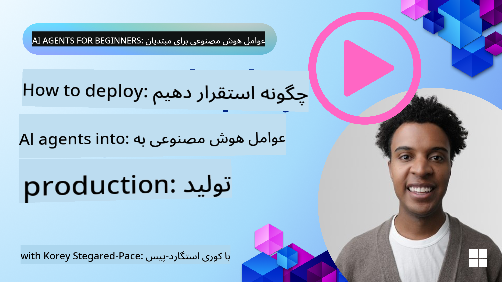

<!--
CO_OP_TRANSLATOR_METADATA:
{
  "original_hash": "1ad5de6a6388d02c145a92dd04358bab",
  "translation_date": "2025-07-12T13:35:15+00:00",
  "source_file": "10-ai-agents-production/README.md",
  "language_code": "fa"
}
-->

> _(برای مشاهده ویدیو این درس روی تصویر بالا کلیک کنید)_
# عامل‌های هوش مصنوعی در محیط تولید

## مقدمه

در این درس موارد زیر پوشش داده می‌شود:

- چگونه به‌طور مؤثر برنامه‌ریزی کنیم تا عامل هوش مصنوعی خود را به محیط تولید منتقل کنیم.
- اشتباهات و مشکلات رایجی که ممکن است هنگام استقرار عامل هوش مصنوعی در محیط تولید با آن‌ها مواجه شوید.
- چگونه هزینه‌ها را مدیریت کنیم و در عین حال عملکرد عامل هوش مصنوعی را حفظ کنیم.

## اهداف یادگیری

پس از اتمام این درس، شما خواهید دانست/درک خواهید کرد:

- تکنیک‌هایی برای بهبود عملکرد، هزینه‌ها و اثربخشی سیستم عامل هوش مصنوعی در محیط تولید.
- چه چیزهایی و چگونه عامل‌های هوش مصنوعی خود را ارزیابی کنید.
- چگونه هنگام استقرار عامل‌های هوش مصنوعی در محیط تولید هزینه‌ها را کنترل کنید.

مهم است که عامل‌های هوش مصنوعی قابل اعتماد را مستقر کنید. درس «ساخت عامل‌های هوش مصنوعی قابل اعتماد» را نیز بررسی کنید.

## ارزیابی عامل‌های هوش مصنوعی

قبل، حین و بعد از استقرار عامل‌های هوش مصنوعی، داشتن یک سیستم مناسب برای ارزیابی آن‌ها حیاتی است. این کار تضمین می‌کند که سیستم شما با اهداف شما و کاربران‌تان هم‌راستا باشد.

برای ارزیابی یک عامل هوش مصنوعی، مهم است که بتوانید نه تنها خروجی عامل بلکه کل سیستمی که عامل در آن فعالیت می‌کند را ارزیابی کنید. این شامل موارد زیر است اما محدود به آن‌ها نیست:

- درخواست اولیه مدل.
- توانایی عامل در شناسایی نیت کاربر.
- توانایی عامل در شناسایی ابزار مناسب برای انجام کار.
- پاسخ ابزار به درخواست عامل.
- توانایی عامل در تفسیر پاسخ ابزار.
- بازخورد کاربر به پاسخ عامل.

این امکان را به شما می‌دهد که نقاط قابل بهبود را به صورت ماژولار شناسایی کنید. سپس می‌توانید تأثیر تغییرات در مدل‌ها، پرامپت‌ها، ابزارها و سایر اجزا را با کارایی بهتر رصد کنید.

## مشکلات رایج و راه‌حل‌های احتمالی برای عامل‌های هوش مصنوعی

| **مشکل**                                      | **راه‌حل احتمالی**                                                                                                                                                                                                     |
| ---------------------------------------------- | -------------------------------------------------------------------------------------------------------------------------------------------------------------------------------------------------------------------------- |
| عامل هوش مصنوعی به طور مداوم وظایف را انجام نمی‌دهد     | - پرامپت داده شده به عامل را اصلاح کنید؛ اهداف را واضح بیان کنید. - مشخص کنید که تقسیم وظایف به زیروظایف و سپردن آن‌ها به چند عامل می‌تواند کمک کند.                                                      |
| عامل هوش مصنوعی در حلقه‌های بی‌پایان گرفتار می‌شود         | - اطمینان حاصل کنید که شرایط و قوانین خاتمه واضحی دارید تا عامل بداند چه زمانی باید فرآیند را متوقف کند. - برای وظایف پیچیده که نیاز به استدلال و برنامه‌ریزی دارند، از مدل بزرگ‌تری که تخصصی در این زمینه است استفاده کنید. |
| تماس‌های ابزار عامل هوش مصنوعی به خوبی عمل نمی‌کنند    | - خروجی ابزار را خارج از سیستم عامل تست و اعتبارسنجی کنید. - پارامترها، پرامپت‌ها و نام‌گذاری ابزارها را اصلاح کنید.                                                                                        |
| سیستم چندعاملی به طور مداوم عملکرد خوبی ندارد | - پرامپت‌های داده شده به هر عامل را اصلاح کنید تا مشخص و متمایز از یکدیگر باشند. - یک سیستم سلسله‌مراتبی با استفاده از عامل «مسیر‌یاب» یا کنترل‌کننده بسازید تا تعیین کند کدام عامل مناسب‌تر است.         |

## مدیریت هزینه‌ها

در اینجا چند استراتژی برای مدیریت هزینه‌های استقرار عامل‌های هوش مصنوعی در محیط تولید آورده شده است:

- **ذخیره پاسخ‌ها (Caching Responses)** - شناسایی درخواست‌ها و وظایف رایج و ارائه پاسخ‌ها قبل از عبور از سیستم عامل شما، راه خوبی برای کاهش حجم درخواست‌های مشابه است. حتی می‌توانید جریانی پیاده‌سازی کنید که میزان شباهت یک درخواست به درخواست‌های ذخیره شده را با استفاده از مدل‌های ساده‌تر هوش مصنوعی تشخیص دهد.

- **استفاده از مدل‌های کوچک‌تر** - مدل‌های زبان کوچک (SLM) می‌توانند در برخی موارد استفاده عامل‌محور عملکرد خوبی داشته باشند و هزینه‌ها را به طور قابل توجهی کاهش دهند. همان‌طور که قبلاً گفته شد، ساخت یک سیستم ارزیابی برای تعیین و مقایسه عملکرد در مقابل مدل‌های بزرگ‌تر بهترین راه برای فهمیدن عملکرد SLM در مورد استفاده شما است.

- **استفاده از مدل مسیر‌یاب (Router Model)** - استراتژی مشابهی استفاده از تنوع مدل‌ها و اندازه‌ها است. می‌توانید از LLM/SLM یا تابع بدون سرور برای مسیریابی درخواست‌ها بر اساس پیچیدگی به مدل‌های مناسب‌تر استفاده کنید. این همچنین به کاهش هزینه‌ها کمک می‌کند و در عین حال عملکرد در وظایف درست را تضمین می‌کند.

## تبریک می‌گوییم

این در حال حاضر آخرین درس از مجموعه «عامل‌های هوش مصنوعی برای مبتدیان» است.

ما قصد داریم بر اساس بازخوردها و تغییرات در این صنعت همیشه در حال رشد، درس‌های جدیدی اضافه کنیم، پس در آینده نزدیک دوباره سر بزنید.

اگر می‌خواهید یادگیری و ساخت با عامل‌های هوش مصنوعی را ادامه دهید، به <a href="https://discord.gg/kzRShWzttr" target="_blank">دیسکورد جامعه Azure AI</a> بپیوندید.

ما در آنجا کارگاه‌ها، میزگردهای جامعه و جلسات «هر چیزی را بپرسید» برگزار می‌کنیم.

همچنین مجموعه‌ای از مطالب آموزشی داریم که می‌تواند به شما در شروع ساخت عامل‌های هوش مصنوعی در محیط تولید کمک کند.

## درس قبلی

[الگوی طراحی متاکاگنیشن](../09-metacognition/README.md)

**سلب مسئولیت**:  
این سند با استفاده از سرویس ترجمه هوش مصنوعی [Co-op Translator](https://github.com/Azure/co-op-translator) ترجمه شده است. در حالی که ما در تلاش برای دقت هستیم، لطفاً توجه داشته باشید که ترجمه‌های خودکار ممکن است حاوی خطاها یا نواقصی باشند. سند اصلی به زبان بومی خود باید به عنوان منبع معتبر در نظر گرفته شود. برای اطلاعات حیاتی، ترجمه حرفه‌ای انسانی توصیه می‌شود. ما مسئول هیچ گونه سوءتفاهم یا تفسیر نادرستی که از استفاده این ترجمه ناشی شود، نیستیم.