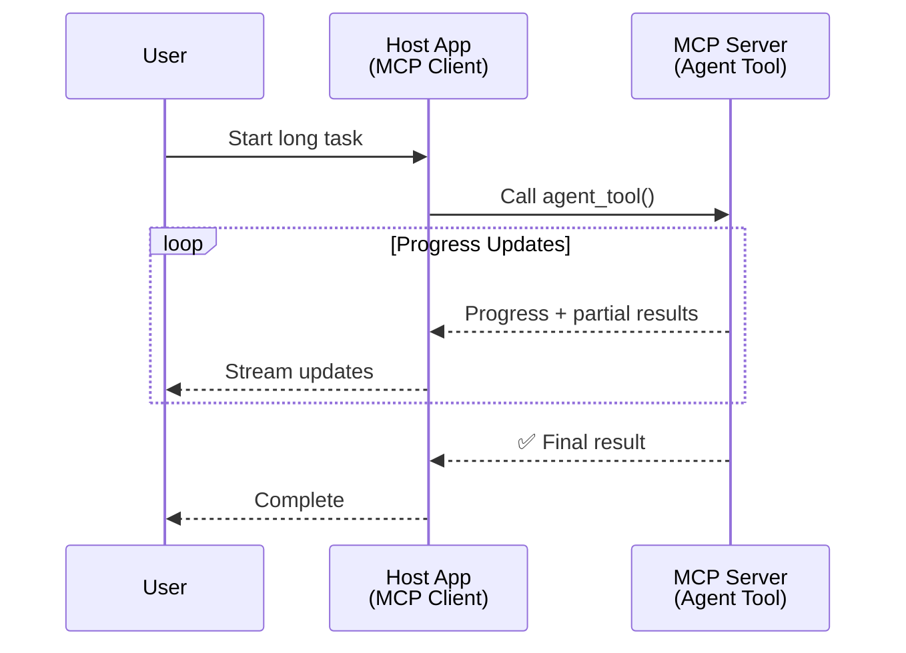
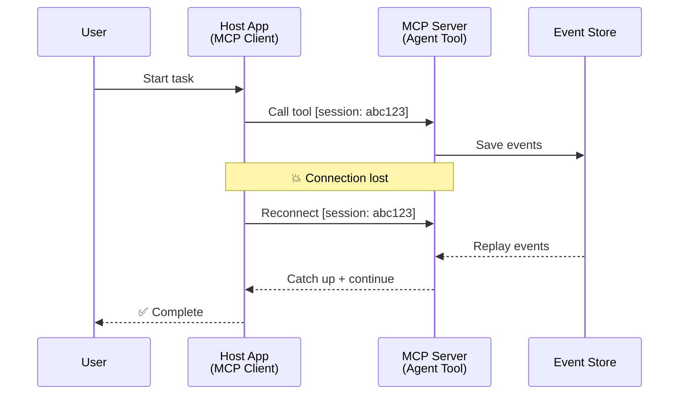
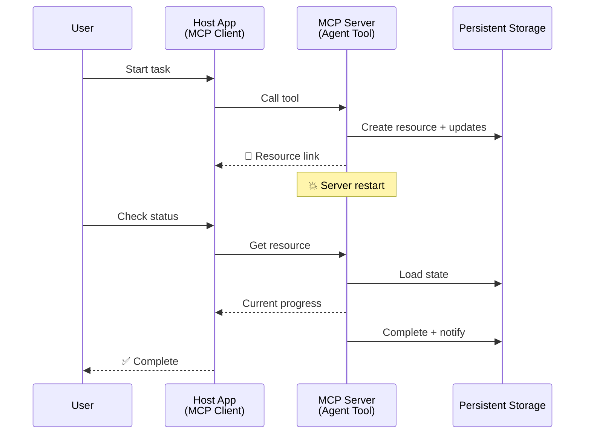
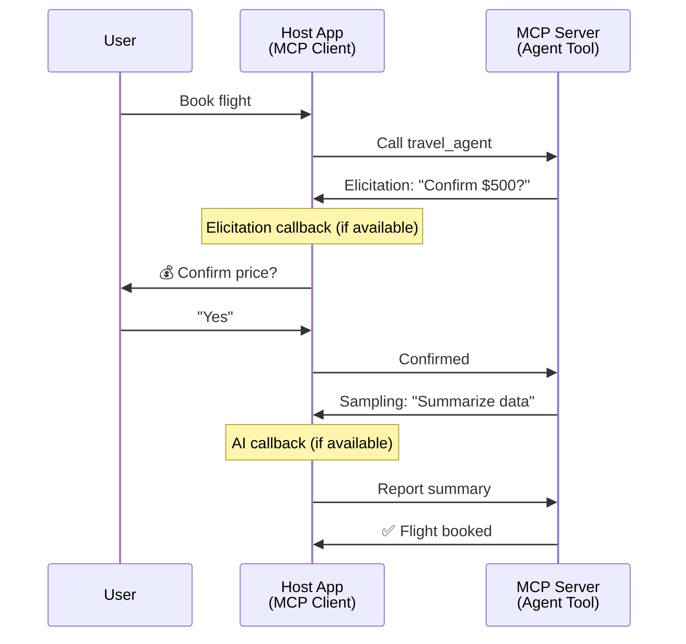
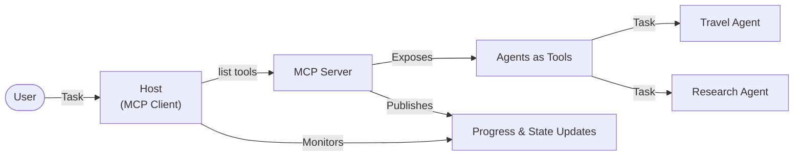

<!--
CO_OP_TRANSLATOR_METADATA:
{
  "original_hash": "5cc6836626047aa055e8960c8484a7d0",
  "translation_date": "2025-08-30T14:45:28+00:00",
  "source_file": "11-agentic-protocols/code_samples/mcp-agents/README.md",
  "language_code": "fa"
}
-->
# ساخت سیستم‌های ارتباطی عامل-به-عامل با MCP

> خلاصه: آیا می‌توانید ارتباط عامل-به-عامل را روی MCP بسازید؟ بله!

MCP به‌طور قابل‌توجهی فراتر از هدف اولیه خود یعنی "فراهم کردن زمینه برای LLMها" تکامل یافته است. با بهبودهای اخیر شامل [جریان‌های قابل ازسرگیری](https://modelcontextprotocol.io/docs/concepts/transports#resumability-and-redelivery)، [استخراج](https://modelcontextprotocol.io/specification/2025-06-18/client/elicitation)، [نمونه‌گیری](https://modelcontextprotocol.io/specification/2025-06-18/client/sampling)، و اعلان‌ها ([پیشرفت](https://modelcontextprotocol.io/specification/2025-06-18/basic/utilities/progress) و [منابع](https://modelcontextprotocol.io/specification/2025-06-18/schema#resourceupdatednotification))، MCP اکنون یک پایه قوی برای ساخت سیستم‌های پیچیده ارتباط عامل-به-عامل فراهم می‌کند.

## سوءتفاهم درباره عامل/ابزار

با افزایش تعداد توسعه‌دهندگانی که ابزارهایی با رفتارهای عامل‌گونه (اجرای طولانی‌مدت، نیاز به ورودی اضافی در میانه اجرا و غیره) را بررسی می‌کنند، یک سوءتفاهم رایج این است که MCP نامناسب است، عمدتاً به این دلیل که نمونه‌های اولیه ابزارهای آن بر الگوهای ساده درخواست-پاسخ متمرکز بودند.

این تصور قدیمی است. مشخصات MCP در ماه‌های اخیر به‌طور قابل‌توجهی با قابلیت‌هایی که شکاف برای ساخت رفتارهای عامل‌گونه طولانی‌مدت را پر می‌کنند، بهبود یافته است:

- **جریان و نتایج جزئی**: به‌روزرسانی‌های پیشرفت در زمان واقعی در طول اجرا
- **قابلیت ازسرگیری**: امکان اتصال مجدد و ادامه پس از قطع ارتباط
- **پایداری**: نتایج حتی پس از راه‌اندازی مجدد سرور باقی می‌مانند (مثلاً از طریق لینک‌های منابع)
- **چندمرحله‌ای**: ورودی تعاملی در میانه اجرا از طریق استخراج و نمونه‌گیری

این ویژگی‌ها می‌توانند برای فعال‌سازی برنامه‌های پیچیده عامل‌گونه و چندعاملی ترکیب شوند، همه بر اساس پروتکل MCP مستقر شده‌اند.

برای مرجع، ما به یک عامل به‌عنوان "ابزاری" که در یک سرور MCP موجود است، اشاره خواهیم کرد. این به معنای وجود یک برنامه میزبان است که یک کلاینت MCP را پیاده‌سازی می‌کند، جلسه‌ای با سرور MCP برقرار می‌کند و می‌تواند عامل را فراخوانی کند.

## چه چیزی یک ابزار MCP را "عامل‌گونه" می‌کند؟

قبل از ورود به پیاده‌سازی، بیایید مشخص کنیم که چه قابلیت‌های زیرساختی برای پشتیبانی از عوامل طولانی‌مدت مورد نیاز است.

> ما یک عامل را به‌عنوان موجودیتی تعریف می‌کنیم که می‌تواند به‌طور خودمختار در بازه‌های زمانی طولانی عمل کند و قادر به انجام وظایف پیچیده‌ای باشد که ممکن است به تعاملات متعدد یا تنظیمات بر اساس بازخورد در زمان واقعی نیاز داشته باشد.

### 1. جریان و نتایج جزئی

الگوهای سنتی درخواست-پاسخ برای وظایف طولانی‌مدت کار نمی‌کنند. عوامل باید ارائه دهند:

- به‌روزرسانی‌های پیشرفت در زمان واقعی
- نتایج میانی

**پشتیبانی MCP**: اعلان‌های به‌روزرسانی منابع امکان جریان نتایج جزئی را فراهم می‌کنند، اگرچه این نیاز به طراحی دقیق دارد تا از تضاد با مدل درخواست/پاسخ 1:1 JSON-RPC جلوگیری شود.

| ویژگی                     | مورد استفاده                                                                                                                                                                       | پشتیبانی MCP                                                                                |
| -------------------------- | ---------------------------------------------------------------------------------------------------------------------------------------------------------------------------------- | ------------------------------------------------------------------------------------------ |
| به‌روزرسانی‌های پیشرفت در زمان واقعی | کاربر یک وظیفه مهاجرت کد را درخواست می‌کند. عامل پیشرفت را جریان می‌دهد: "10% - تحلیل وابستگی‌ها... 25% - تبدیل فایل‌های TypeScript... 50% - به‌روزرسانی واردات..."          | ✅ اعلان‌های پیشرفت                                                                  |
| نتایج جزئی            | وظیفه "تولید یک کتاب" نتایج جزئی را جریان می‌دهد، مثلاً: 1) طرح کلی داستان، 2) لیست فصل‌ها، 3) هر فصل به‌محض تکمیل. میزبان می‌تواند در هر مرحله بررسی، لغو یا هدایت مجدد کند. | ✅ اعلان‌ها می‌توانند "گسترش" یابند تا نتایج جزئی را شامل شوند، به پیشنهادات PR 383، 776 مراجعه کنید |

<div align="center" style="font-style: italic; font-size: 0.95em; margin-bottom: 0.5em;">
<strong>شکل 1:</strong> این نمودار نشان می‌دهد که چگونه یک عامل MCP به‌روزرسانی‌های پیشرفت در زمان واقعی و نتایج جزئی را به برنامه میزبان جریان می‌دهد، به کاربر امکان می‌دهد اجرای وظیفه را در زمان واقعی نظارت کند.
</div>



### 2. قابلیت ازسرگیری

عوامل باید به‌طور مؤثر با وقفه‌های شبکه برخورد کنند:

- اتصال مجدد پس از قطع ارتباط (کلاینت)
- ادامه از جایی که متوقف شده‌اند (تحویل مجدد پیام)

**پشتیبانی MCP**: انتقال StreamableHTTP MCP امروز از ازسرگیری جلسه و تحویل مجدد پیام با شناسه‌های جلسه و شناسه‌های آخرین رویداد پشتیبانی می‌کند. نکته مهم این است که سرور باید یک EventStore پیاده‌سازی کند که امکان بازپخش رویدادها را در اتصال مجدد کلاینت فراهم کند.  
توجه داشته باشید که یک پیشنهاد جامعه (PR #975) وجود دارد که جریان‌های قابل ازسرگیری مستقل از انتقال را بررسی می‌کند.

| ویژگی      | مورد استفاده                                                                                                                                                   | پشتیبانی MCP                                                                |
| ------------ | ---------------------------------------------------------------------------------------------------------------------------------------------------------- | -------------------------------------------------------------------------- |
| قابلیت ازسرگیری | کلاینت در طول یک وظیفه طولانی‌مدت قطع می‌شود. پس از اتصال مجدد، جلسه با بازپخش رویدادهای از دست رفته از جایی که متوقف شده بود، به‌طور یکپارچه ادامه می‌یابد. | ✅ انتقال StreamableHTTP با شناسه‌های جلسه، بازپخش رویداد و EventStore |

<div align="center" style="font-style: italic; font-size: 0.95em; margin-bottom: 0.5em;">
<strong>شکل 2:</strong> این نمودار نشان می‌دهد که چگونه انتقال StreamableHTTP و EventStore MCP امکان ازسرگیری یکپارچه جلسه را فراهم می‌کنند: اگر کلاینت قطع شود، می‌تواند مجدداً متصل شود و رویدادهای از دست رفته را بازپخش کند و وظیفه را بدون از دست دادن پیشرفت ادامه دهد.
</div>



### 3. پایداری

عوامل طولانی‌مدت به حالت پایدار نیاز دارند:

- نتایج حتی پس از راه‌اندازی مجدد سرور باقی می‌مانند
- وضعیت می‌تواند خارج از باند بازیابی شود
- ردیابی پیشرفت در جلسات مختلف

**پشتیبانی MCP**: MCP اکنون از نوع بازگشتی لینک منبع برای فراخوانی ابزارها پشتیبانی می‌کند. امروز، یک الگوی ممکن این است که ابزاری طراحی شود که یک منبع ایجاد کند و بلافاصله یک لینک منبع بازگشتی ارائه دهد. ابزار می‌تواند به‌طور پس‌زمینه‌ای به وظیفه رسیدگی کند و منبع را به‌روزرسانی کند. به نوبه خود، کلاینت می‌تواند وضعیت این منبع را برای دریافت نتایج جزئی یا کامل (بر اساس به‌روزرسانی‌های منبعی که سرور ارائه می‌دهد) بررسی کند یا برای به‌روزرسانی‌ها به منبع مشترک شود.

یکی از محدودیت‌ها این است که بررسی منابع یا مشترک شدن برای به‌روزرسانی‌ها می‌تواند منابع را مصرف کند و در مقیاس تأثیراتی داشته باشد. یک پیشنهاد جامعه باز (شامل #992) امکان گنجاندن وب‌هوک‌ها یا تریگرهایی را بررسی می‌کند که سرور می‌تواند برای اطلاع‌رسانی به کلاینت/برنامه میزبان از به‌روزرسانی‌ها فراخوانی کند.

| ویژگی    | مورد استفاده                                                                                                                                        | پشتیبانی MCP                                                        |
| ---------- | ----------------------------------------------------------------------------------------------------------------------------------------------- | ------------------------------------------------------------------ |
| پایداری | سرور در طول وظیفه مهاجرت داده خراب می‌شود. نتایج و پیشرفت پس از راه‌اندازی مجدد باقی می‌مانند، کلاینت می‌تواند وضعیت را بررسی کند و از منبع پایدار ادامه دهد. | ✅ لینک‌های منبع با ذخیره‌سازی پایدار و اعلان‌های وضعیت |

امروز، یک الگوی رایج این است که ابزاری طراحی شود که یک منبع ایجاد کند و بلافاصله یک لینک منبع بازگشتی ارائه دهد. ابزار می‌تواند در پس‌زمینه به وظیفه رسیدگی کند، اعلان‌های منبعی که به‌عنوان به‌روزرسانی‌های پیشرفت عمل می‌کنند یا نتایج جزئی را شامل می‌شوند، صادر کند و محتوا را در منبع به‌روزرسانی کند.

<div align="center" style="font-style: italic; font-size: 0.95em; margin-bottom: 0.5em;">
<strong>شکل 3:</strong> این نمودار نشان می‌دهد که چگونه عوامل MCP از منابع پایدار و اعلان‌های وضعیت برای اطمینان از اینکه وظایف طولانی‌مدت از راه‌اندازی مجدد سرور جان سالم به در می‌برند، استفاده می‌کنند و به کلاینت‌ها امکان می‌دهند پیشرفت را بررسی کنند و نتایج را حتی پس از خرابی‌ها بازیابی کنند.
</div>



### 4. تعاملات چندمرحله‌ای

عوامل اغلب به ورودی اضافی در میانه اجرا نیاز دارند:

- توضیح یا تأیید انسانی
- کمک هوش مصنوعی برای تصمیم‌گیری‌های پیچیده
- تنظیم پویا پارامترها

**پشتیبانی MCP**: کاملاً از طریق نمونه‌گیری (برای ورودی هوش مصنوعی) و استخراج (برای ورودی انسانی) پشتیبانی می‌شود.

| ویژگی                 | مورد استفاده                                                                                                                                     | پشتیبانی MCP                                           |
| ----------------------- | -------------------------------------------------------------------------------------------------------------------------------------------- | ----------------------------------------------------- |
| تعاملات چندمرحله‌ای | عامل رزرو سفر تأیید قیمت را از کاربر درخواست می‌کند، سپس از هوش مصنوعی می‌خواهد داده‌های سفر را قبل از تکمیل تراکنش رزرو خلاصه کند. | ✅ استخراج برای ورودی انسانی، نمونه‌گیری برای ورودی هوش مصنوعی |

<div align="center" style="font-style: italic; font-size: 0.95em; margin-bottom: 0.5em;">
<strong>شکل 4:</strong> این نمودار نشان می‌دهد که چگونه عوامل MCP می‌توانند به‌طور تعاملی ورودی انسانی را استخراج کنند یا در میانه اجرا درخواست کمک هوش مصنوعی کنند، از جریان‌های کاری پیچیده و چندمرحله‌ای مانند تأییدها و تصمیم‌گیری‌های پویا پشتیبانی کنند.
</div>



## پیاده‌سازی عوامل طولانی‌مدت روی MCP - مرور کد

به‌عنوان بخشی از این مقاله، ما یک [مخزن کد](https://github.com/victordibia/ai-tutorials/tree/main/MCP%20Agents) ارائه می‌دهیم که شامل یک پیاده‌سازی کامل از عوامل طولانی‌مدت با استفاده از SDK پایتون MCP با انتقال StreamableHTTP برای ازسرگیری جلسه و تحویل مجدد پیام است. این پیاده‌سازی نشان می‌دهد که چگونه قابلیت‌های MCP می‌توانند برای فعال‌سازی رفتارهای پیچیده عامل‌گونه ترکیب شوند.

به‌طور خاص، ما یک سرور با دو ابزار عامل اصلی پیاده‌سازی می‌کنیم:

- **عامل سفر** - یک سرویس رزرو سفر را با تأیید قیمت از طریق استخراج شبیه‌سازی می‌کند
- **عامل تحقیق** - وظایف تحقیقاتی را با خلاصه‌های کمک‌شده توسط هوش مصنوعی از طریق نمونه‌گیری انجام می‌دهد

هر دو عامل به‌روزرسانی‌های پیشرفت در زمان واقعی، تأییدهای تعاملی و قابلیت‌های کامل ازسرگیری جلسه را نشان می‌دهند.

### مفاهیم کلیدی پیاده‌سازی

بخش‌های زیر پیاده‌سازی سمت سرور عامل و مدیریت میزبان سمت کلاینت برای هر قابلیت را نشان می‌دهند:

#### جریان و به‌روزرسانی‌های پیشرفت - وضعیت وظیفه در زمان واقعی

جریان به عوامل امکان می‌دهد به‌روزرسانی‌های پیشرفت در زمان واقعی را در طول وظایف طولانی‌مدت ارائه دهند و کاربران را از وضعیت وظیفه و نتایج میانی مطلع کنند.

**پیاده‌سازی سرور (عامل اعلان‌های پیشرفت ارسال می‌کند):**

```python
# From server/server.py - Travel agent sending progress updates
for i, step in enumerate(steps):
    await ctx.session.send_progress_notification(
        progress_token=ctx.request_id,
        progress=i * 25,
        total=100,
        message=step,
        related_request_id=str(ctx.request_id)
    )
    await anyio.sleep(2)  # Simulate work

# Alternative: Log messages for detailed step-by-step updates
await ctx.session.send_log_message(
    level="info",
    data=f"Processing step {current_step}/{steps} ({progress_percent}%)",
    logger="long_running_agent",
    related_request_id=ctx.request_id,
)
```

**پیاده‌سازی کلاینت (میزبان به‌روزرسانی‌های پیشرفت دریافت می‌کند):**

```python
# From client/client.py - Client handling real-time notifications
async def message_handler(message) -> None:
    if isinstance(message, types.ServerNotification):
        if isinstance(message.root, types.LoggingMessageNotification):
            console.print(f"📡 [dim]{message.root.params.data}[/dim]")
        elif isinstance(message.root, types.ProgressNotification):
            progress = message.root.params
            console.print(f"🔄 [yellow]{progress.message} ({progress.progress}/{progress.total})[/yellow]")

# Register message handler when creating session
async with ClientSession(
    read_stream, write_stream,
    message_handler=message_handler
) as session:
```

#### استخراج - درخواست ورودی کاربر

استخراج به عوامل امکان می‌دهد در میانه اجرا ورودی کاربر را درخواست کنند. این برای تأییدها، توضیحات یا تأییدها در طول وظایف طولانی‌مدت ضروری است.

**پیاده‌سازی سرور (عامل تأیید درخواست می‌کند):**

```python
# From server/server.py - Travel agent requesting price confirmation
elicit_result = await ctx.session.elicit(
    message=f"Please confirm the estimated price of $1200 for your trip to {destination}",
    requestedSchema=PriceConfirmationSchema.model_json_schema(),
    related_request_id=ctx.request_id,
)

if elicit_result and elicit_result.action == "accept":
    # Continue with booking
    logger.info(f"User confirmed price: {elicit_result.content}")
elif elicit_result and elicit_result.action == "decline":
    # Cancel the booking
    booking_cancelled = True
```

**پیاده‌سازی کلاینت (میزبان بازخورد استخراج ارائه می‌دهد):**

```python
# From client/client.py - Client handling elicitation requests
async def elicitation_callback(context, params):
    console.print(f"💬 Server is asking for confirmation:")
    console.print(f"   {params.message}")

    response = console.input("Do you accept? (y/n): ").strip().lower()

    if response in ['y', 'yes']:
        return types.ElicitResult(
            action="accept",
            content={"confirm": True, "notes": "Confirmed by user"}
        )
    else:
        return types.ElicitResult(
            action="decline",
            content={"confirm": False, "notes": "Declined by user"}
        )

# Register the callback when creating the session
async with ClientSession(
    read_stream, write_stream,
    elicitation_callback=elicitation_callback
) as session:
```

#### نمونه‌گیری - درخواست کمک هوش مصنوعی

نمونه‌گیری به عوامل امکان می‌دهد در طول اجرا برای تصمیم‌گیری‌های پیچیده یا تولید محتوا از LLM کمک بخواهند. این امکان جریان‌های کاری ترکیبی انسان-هوش مصنوعی را فراهم می‌کند.

**پیاده‌سازی سرور (عامل درخواست کمک هوش مصنوعی می‌کند):**

```python
# From server/server.py - Research agent requesting AI summary
sampling_result = await ctx.session.create_message(
    messages=[
        SamplingMessage(
            role="user",
            content=TextContent(type="text", text=f"Please summarize the key findings for research on: {topic}")
        )
    ],
    max_tokens=100,
    related_request_id=ctx.request_id,
)

if sampling_result and sampling_result.content:
    if sampling_result.content.type == "text":
        sampling_summary = sampling_result.content.text
        logger.info(f"Received sampling summary: {sampling_summary}")
```

**پیاده‌سازی کلاینت (میزبان بازخورد نمونه‌گیری ارائه می‌دهد):**

```python
# From client/client.py - Client handling sampling requests
async def sampling_callback(context, params):
    message_text = params.messages[0].content.text if params.messages else 'No message'
    console.print(f"🧠 Server requested sampling: {message_text}")

    # In a real application, this could call an LLM API
    # For demo purposes, we provide a mock response
    mock_response = "Based on current research, MCP has evolved significantly..."

    return types.CreateMessageResult(
        role="assistant",
        content=types.TextContent(type="text", text=mock_response),
        model="interactive-client",
        stopReason="endTurn"
    )

# Register the callback when creating the session
async with ClientSession(
    read_stream, write_stream,
    sampling_callback=sampling_callback,
    elicitation_callback=elicitation_callback
) as session:
```

#### قابلیت ازسرگیری - تداوم جلسه در قطع ارتباط‌ها

قابلیت ازسرگیری اطمینان می‌دهد که وظایف طولانی‌مدت عامل می‌توانند قطع ارتباط کلاینت را تحمل کنند و پس از اتصال مجدد به‌طور یکپارچه ادامه یابند. این از طریق ذخیره رویدادها و توکن‌های ازسرگیری پیاده‌سازی می‌شود.

**پیاده‌سازی ذخیره رویداد (سرور وضعیت جلسه را نگه می‌دارد):**

```python
# From server/event_store.py - Simple in-memory event store
class SimpleEventStore(EventStore):
    def __init__(self):
        self._events: list[tuple[StreamId, EventId, JSONRPCMessage]] = []
        self._event_id_counter = 0

    async def store_event(self, stream_id: StreamId, message: JSONRPCMessage) -> EventId:
        """Store an event and return its ID."""
        self._event_id_counter += 1
        event_id = str(self._event_id_counter)
        self._events.append((stream_id, event_id, message))
        return event_id

    async def replay_events_after(self, last_event_id: EventId, send_callback: EventCallback) -> StreamId | None:
        """Replay events after the specified ID for resumption."""
        # Find events after the last known event and replay them
        for _, event_id, message in self._events[start_index:]:
            await send_callback(EventMessage(message, event_id))

# From server/server.py - Passing event store to session manager
def create_server_app(event_store: Optional[EventStore] = None) -> Starlette:
    server = ResumableServer()

    # Create session manager with event store for resumption
    session_manager = StreamableHTTPSessionManager(
        app=server,
        event_store=event_store,  # Event store enables session resumption
        json_response=False,
        security_settings=security_settings,
    )

    return Starlette(routes=[Mount("/mcp", app=session_manager.handle_request)])

# Usage: Initialize with event store
event_store = SimpleEventStore()
app = create_server_app(event_store)
```

**متاداده کلاینت با توکن ازسرگیری (کلاینت با استفاده از وضعیت ذخیره‌شده مجدداً متصل می‌شود):**

```python
# From client/client.py - Client resumption with metadata
if existing_tokens and existing_tokens.get("resumption_token"):
    # Use existing resumption token to continue where we left off
    metadata = ClientMessageMetadata(
        resumption_token=existing_tokens["resumption_token"],
    )
else:
    # Create callback to save resumption token when received
    def enhanced_callback(token: str):
        protocol_version = getattr(session, 'protocol_version', None)
        token_manager.save_tokens(session_id, token, protocol_version, command, args)

    metadata = ClientMessageMetadata(
        on_resumption_token_update=enhanced_callback,
    )

# Send request with resumption metadata
result = await session.send_request(
    types.ClientRequest(
        types.CallToolRequest(
            method="tools/call",
            params=types.CallToolRequestParams(name=command, arguments=args)
        )
    ),
    types.CallToolResult,
    metadata=metadata,
)
```

برنامه میزبان شناسه‌های جلسه و توکن‌های ازسرگیری را به‌صورت محلی نگه می‌دارد و به آن امکان می‌دهد بدون از دست دادن پیشرفت یا وضعیت به جلسات موجود متصل شود.

### سازماندهی کد

<div align="center" style="font-style: italic; font-size: 0.95em; margin-bottom: 0.5em;">
<strong>شکل 5:</strong> معماری سیستم عامل مبتنی بر MCP
</div>



**فایل‌های کلیدی:**

- **`server/server.py`** - سرور MCP قابل ازسرگیری با عوامل سفر و تحقیق که استخراج، نمونه‌گیری و به‌روزرسانی‌های پیشرفت را نشان می‌دهند
- **`client/client.py`** - برنامه میزبان تعاملی با پشتیبانی ازسرگیری، هندلرهای بازخورد و مدیریت توکن
- **`server/event_store.py`** - پیاده‌سازی ذخیره رویداد که امکان ازسرگیری جلسه و تحویل مجدد پیام را فراهم می‌کند

## گسترش به سیستم‌های چندعاملی روی MCP

پیاده‌سازی فوق می‌تواند با افزایش هوش و دامنه برنامه میزبان به سیستم‌های چندعاملی گسترش یابد:

- **تجزیه هوشمند وظایف**: میزبان درخواست‌های پیچیده کاربر را تحلیل کرده و آن‌ها را به وظایف فرعی برای عوامل تخصصی مختلف تقسیم می‌کند
- **هماهنگی چندسروری**: میزبان اتصالات به چندین سرور MCP را که هرکدام قابلیت‌های عامل مختلفی ارائه می‌دهند، حفظ می‌کند
- **مدیریت وضعیت وظایف**: میزبان پیشرفت را در چندین وظیفه عامل همزمان ردیابی کرده و وابستگی‌ها و توالی‌ها را مدیریت می‌کند
- **انعطاف‌پذیری و تلاش مجدد**: میزبان خرابی‌ها را مدیریت کرده، منطق تلاش مجدد را پیاده‌سازی کرده و وظایف را در صورت عدم دسترسی عوامل مجدداً مسیریابی می‌کند
- **ترکیب نتایج**: میزبان خروجی‌های چندین عامل را به نتایج نهایی منسجم ترکیب می‌کند

میزبان از یک کلاینت ساده به یک هماهنگ‌کننده هوشمند تکامل می‌یابد که قابلیت‌های عامل توزیع‌شده را هماهنگ می‌کند و در عین حال همان پایه پروتکل MCP را حفظ می‌کند.

## نتیجه‌گیری

قابلیت‌های پیشرفته MCP - اعلان‌های منابع، استخراج/نمونه‌گیری، جریان‌های قابل ازسرگیری و منابع پایدار - تعاملات پیچیده عامل-به-عامل را در عین حفظ سادگی پروتکل امکان‌پذیر می‌کنند.

## شروع به کار

آماده‌اید سیستم عامل2عامل خود را بسازید؟ این مراحل را دنبال کنید:

### 1. اجرای دمو

```bash
# Start the server with event store for resumption
python -m server.server --port 8006

# In another terminal, run the interactive client
python -m client.client --url http://127.0.0.1:8006/mcp
```

**دستورات موجود در حالت تعاملی:**

- `travel_agent` - رزرو سفر با تأیید قیمت از طریق استخراج
- `research_agent` - تحقیق در مورد موضوعات با خلاصه‌های کمک‌شده توسط هوش مصنوعی از طریق نمونه‌گیری
- `list` - نمایش تمام ابزارهای موجود
- `clean-tokens` - پاک کردن توکن‌های ازسرگیری
- `help` - نمایش راهنمای دستورات دقیق
- `quit` - خروج از کلاینت

### 2. آزمایش قابلیت‌های از

---

**سلب مسئولیت**:  
این سند با استفاده از سرویس ترجمه هوش مصنوعی [Co-op Translator](https://github.com/Azure/co-op-translator) ترجمه شده است. در حالی که ما برای دقت تلاش می‌کنیم، لطفاً توجه داشته باشید که ترجمه‌های خودکار ممکن است شامل خطاها یا نادقتی‌هایی باشند. سند اصلی به زبان اصلی آن باید به عنوان منبع معتبر در نظر گرفته شود. برای اطلاعات حساس، ترجمه حرفه‌ای انسانی توصیه می‌شود. ما هیچ مسئولیتی در قبال سوءتفاهم‌ها یا تفسیرهای نادرست ناشی از استفاده از این ترجمه نداریم.