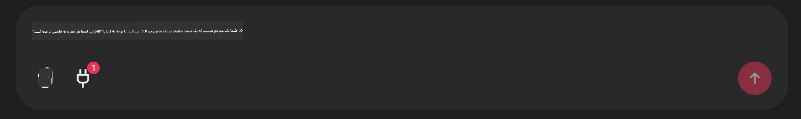

<!--
CO_OP_TRANSLATOR_METADATA:
{
  "original_hash": "9bf0395cbc541ce8db2a9699c8678dfc",
  "translation_date": "2025-07-12T14:20:11+00:00",
  "source_file": "11-mcp/code_samples/github-mcp/README.md",
  "language_code": "fa"
}
-->
# نمونه سرور Github MCP

## توضیحات

این یک دمو بود که برای هکاتون AI Agents که توسط Microsoft Reactor برگزار شد، ساخته شده است.

این ابزار برای پیشنهاد پروژه‌های هکاتون بر اساس مخازن Github یک کاربر استفاده می‌شود.  
این کار به صورت زیر انجام می‌شود:

1. **Github Agent** - استفاده از سرور Github MCP برای دریافت مخازن و اطلاعات مربوط به آن‌ها.  
2. **Hackathon Agent** - داده‌های دریافتی از Github Agent را گرفته و ایده‌های خلاقانه پروژه‌های هکاتون را بر اساس پروژه‌ها، زبان‌های برنامه‌نویسی استفاده شده توسط کاربر و مسیرهای پروژه برای هکاتون AI Agents ارائه می‌دهد.  
3. **Events Agent** - بر اساس پیشنهادات Hackathon Agent، Events Agent رویدادهای مرتبط از سری هکاتون AI Agent را پیشنهاد می‌کند.  

## اجرای کد

### متغیرهای محیطی

این دمو از Azure Open AI Service، Semantic Kernel، سرور Github MCP و Azure AI Search استفاده می‌کند.

مطمئن شوید که متغیرهای محیطی مناسب برای استفاده از این ابزارها تنظیم شده‌اند:

```python
AZURE_OPENAI_CHAT_DEPLOYMENT_NAME=""
AZURE_OPENAI_EMBEDDING_DEPLOYMENT_NAME=""
AZURE_OPENAI_ENDPOINT=""
AZURE_OPENAI_API_KEY=""
AZURE_OPENAI_API_VERSION=""
AZURE_SEARCH_SERVICE_ENDPOINT=""
AZURE_SEARCH_API_KEY=""
```

## اجرای سرور Chainlit

برای اتصال به سرور MCP، این دمو از Chainlit به عنوان رابط چت استفاده می‌کند.

برای اجرای سرور، دستور زیر را در ترمینال خود وارد کنید:

```bash
chainlit run app.py -w
```

این کار باید سرور Chainlit شما را روی `localhost:8000` راه‌اندازی کند و همچنین شاخص Azure AI Search شما را با محتوای `event-descriptions.md` پر کند.

## اتصال به سرور MCP

برای اتصال به سرور Github MCP، روی آیکون "پلاگ" زیر کادر چت "Type your message here.." کلیک کنید:



از آنجا می‌توانید روی "Connect an MCP" کلیک کنید تا دستور اتصال به سرور Github MCP اضافه شود:

```bash
npx -y @modelcontextprotocol/server-github --env GITHUB_PERSONAL_ACCESS_TOKEN=[YOUR PERSONAL ACCESS TOKEN]
```

"[YOUR PERSONAL ACCESS TOKEN]" را با توکن دسترسی شخصی واقعی خود جایگزین کنید.

پس از اتصال، باید عدد (1) کنار آیکون پلاگ ظاهر شود تا تأیید کند که اتصال برقرار شده است. اگر این اتفاق نیفتاد، سرور chainlit را با دستور `chainlit run app.py -w` مجدداً راه‌اندازی کنید.

## استفاده از دمو

برای شروع جریان کاری عامل در پیشنهاد پروژه‌های هکاتون، می‌توانید پیامی مانند زیر تایپ کنید:

"Recommend hackathon projects for the Github user koreyspace"

Router Agent درخواست شما را تحلیل کرده و ترکیب مناسب عوامل (GitHub، Hackathon و Events) را برای پاسخ به پرسش شما تعیین می‌کند. این عوامل با هم همکاری می‌کنند تا بر اساس تحلیل مخازن GitHub، ایده‌پردازی پروژه و رویدادهای مرتبط فناوری، پیشنهادات جامعی ارائه دهند.

**سلب مسئولیت**:  
این سند با استفاده از سرویس ترجمه هوش مصنوعی [Co-op Translator](https://github.com/Azure/co-op-translator) ترجمه شده است. در حالی که ما در تلاش برای دقت هستیم، لطفاً توجه داشته باشید که ترجمه‌های خودکار ممکن است حاوی خطاها یا نادرستی‌هایی باشند. سند اصلی به زبان بومی خود باید به عنوان منبع معتبر در نظر گرفته شود. برای اطلاعات حیاتی، ترجمه حرفه‌ای انسانی توصیه می‌شود. ما مسئول هیچ گونه سوءتفاهم یا تفسیر نادرستی که از استفاده این ترجمه ناشی شود، نیستیم.