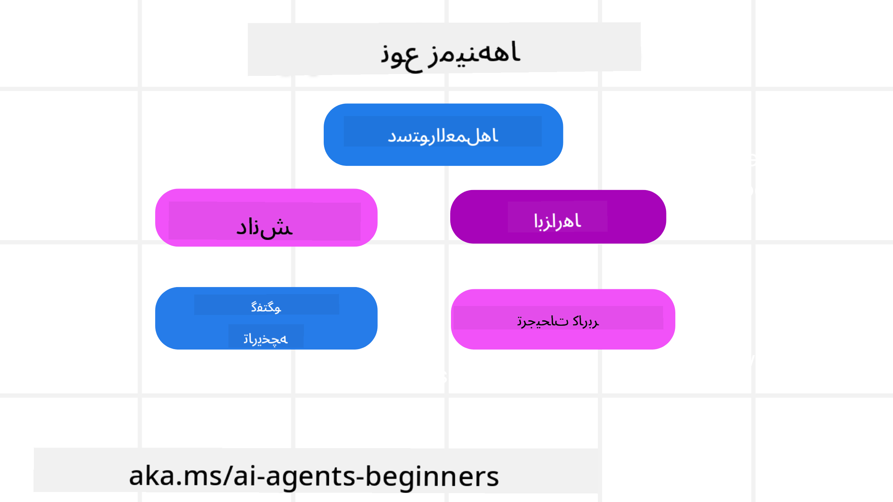
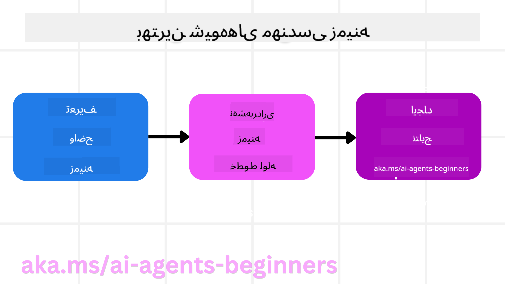

<!--
CO_OP_TRANSLATOR_METADATA:
{
  "original_hash": "cb7e50f471905ce6fdb92a30269a7a98",
  "translation_date": "2025-09-04T09:46:04+00:00",
  "source_file": "12-context-engineering/README.md",
  "language_code": "fa"
}
-->
# مهندسی زمینه برای عوامل هوش مصنوعی

> _(برای مشاهده ویدئوی این درس، روی تصویر بالا کلیک کنید)_

درک پیچیدگی برنامه‌ای که برای آن یک عامل هوش مصنوعی می‌سازید، برای ایجاد یک عامل قابل‌اعتماد بسیار مهم است. ما باید عواملی بسازیم که اطلاعات را به‌طور مؤثر مدیریت کنند تا نیازهای پیچیده‌ای فراتر از مهندسی درخواست را برآورده کنند.

در این درس، به بررسی مفهوم مهندسی زمینه و نقش آن در ساخت عوامل هوش مصنوعی خواهیم پرداخت.

## مقدمه

این درس شامل موارد زیر است:

• **مهندسی زمینه چیست** و چرا با مهندسی درخواست متفاوت است.

• **استراتژی‌هایی برای مهندسی زمینه مؤثر**، از جمله نحوه نوشتن، انتخاب، فشرده‌سازی و جداسازی اطلاعات.

• **اشتباهات رایج در زمینه** که می‌توانند عامل هوش مصنوعی شما را از مسیر خارج کنند و نحوه رفع آن‌ها.

## اهداف یادگیری

پس از اتمام این درس، شما قادر خواهید بود:

• **تعریف مهندسی زمینه** و تمایز آن از مهندسی درخواست را درک کنید.

• **اجزای کلیدی زمینه** در برنامه‌های مدل‌های زبانی بزرگ (LLM) را شناسایی کنید.

• **استراتژی‌هایی برای نوشتن، انتخاب، فشرده‌سازی و جداسازی زمینه** برای بهبود عملکرد عامل به کار ببرید.

• **اشتباهات رایج در زمینه** مانند مسمومیت، حواس‌پرتی، سردرگمی و تضاد را شناسایی کرده و تکنیک‌های کاهش آن‌ها را اجرا کنید.

## مهندسی زمینه چیست؟

برای عوامل هوش مصنوعی، زمینه همان چیزی است که برنامه‌ریزی عامل را برای انجام اقدامات خاص هدایت می‌کند. مهندسی زمینه به معنای اطمینان از این است که عامل هوش مصنوعی اطلاعات مناسبی برای انجام مرحله بعدی وظیفه دارد. از آنجا که پنجره زمینه محدود است، ما به‌عنوان سازندگان عامل باید سیستم‌ها و فرآیندهایی برای مدیریت افزودن، حذف و فشرده‌سازی اطلاعات در این پنجره ایجاد کنیم.

### مهندسی درخواست در مقابل مهندسی زمینه

مهندسی درخواست بر روی یک مجموعه ثابت از دستورالعمل‌ها تمرکز دارد تا عوامل هوش مصنوعی را با مجموعه‌ای از قوانین هدایت کند. مهندسی زمینه به مدیریت یک مجموعه پویا از اطلاعات، از جمله درخواست اولیه، می‌پردازد تا اطمینان حاصل شود که عامل هوش مصنوعی در طول زمان آنچه نیاز دارد را در اختیار دارد. ایده اصلی در مهندسی زمینه این است که این فرآیند قابل تکرار و قابل اعتماد باشد.

### انواع زمینه

مهم است که به یاد داشته باشید زمینه فقط یک چیز نیست. اطلاعاتی که عامل هوش مصنوعی نیاز دارد می‌تواند از منابع مختلفی بیاید و این وظیفه ماست که اطمینان حاصل کنیم عامل به این منابع دسترسی دارد:

انواع زمینه‌ای که یک عامل هوش مصنوعی ممکن است نیاز به مدیریت آن‌ها داشته باشد شامل موارد زیر است:

• **دستورالعمل‌ها:** این‌ها مانند "قوانین" عامل هستند – درخواست‌ها، پیام‌های سیستمی، مثال‌های چندتایی (نشان دادن نحوه انجام کاری به هوش مصنوعی) و توضیحات ابزارهایی که می‌تواند استفاده کند. اینجا جایی است که تمرکز مهندسی درخواست با مهندسی زمینه ترکیب می‌شود.

• **دانش:** این شامل حقایق، اطلاعات بازیابی‌شده از پایگاه‌های داده یا حافظه‌های بلندمدتی است که عامل جمع‌آوری کرده است. این شامل ادغام یک سیستم تولید بازیابی‌شده (RAG) نیز می‌شود اگر عامل نیاز به دسترسی به منابع دانش و پایگاه‌های داده مختلف داشته باشد.

• **ابزارها:** این‌ها شامل تعریف توابع خارجی، APIها و سرورهای MCP است که عامل می‌تواند آن‌ها را فراخوانی کند، همراه با بازخورد (نتایج) حاصل از استفاده از آن‌ها.

• **تاریخچه مکالمه:** گفتگوی جاری با کاربر. با گذشت زمان، این مکالمات طولانی‌تر و پیچیده‌تر می‌شوند که به این معنی است که فضای بیشتری در پنجره زمینه اشغال می‌کنند.

• **ترجیحات کاربر:** اطلاعاتی که در طول زمان درباره علایق یا عدم علایق کاربر یاد گرفته شده است. این اطلاعات می‌تواند هنگام تصمیم‌گیری‌های کلیدی برای کمک به کاربر فراخوانی شود.

## استراتژی‌هایی برای مهندسی زمینه مؤثر

### استراتژی‌های برنامه‌ریزی

مهندسی زمینه خوب با برنامه‌ریزی خوب شروع می‌شود. در اینجا رویکردی آورده شده است که به شما کمک می‌کند درباره نحوه اعمال مفهوم مهندسی زمینه فکر کنید:

1. **تعریف نتایج واضح** - نتایج وظایفی که به عوامل هوش مصنوعی محول می‌شود باید به‌وضوح تعریف شوند. به این سؤال پاسخ دهید: "وقتی عامل هوش مصنوعی وظیفه خود را به پایان رساند، دنیا چگونه خواهد بود؟" به عبارت دیگر، پس از تعامل با عامل هوش مصنوعی، چه تغییری، اطلاعاتی یا پاسخی باید برای کاربر وجود داشته باشد؟

2. **نقشه‌برداری از زمینه** - پس از تعریف نتایج عامل هوش مصنوعی، باید به این سؤال پاسخ دهید: "عامل هوش مصنوعی برای انجام این وظیفه به چه اطلاعاتی نیاز دارد؟" به این ترتیب می‌توانید شروع به نقشه‌برداری از زمینه کنید که این اطلاعات کجا قرار دارد.

3. **ایجاد خطوط لوله زمینه** - حال که می‌دانید اطلاعات کجا قرار دارد، باید به این سؤال پاسخ دهید: "عامل چگونه این اطلاعات را به دست خواهد آورد؟" این کار می‌تواند به روش‌های مختلفی از جمله RAG، استفاده از سرورهای MCP و ابزارهای دیگر انجام شود.

### استراتژی‌های عملی

برنامه‌ریزی مهم است، اما وقتی اطلاعات شروع به ورود به پنجره زمینه عامل می‌کنند، باید استراتژی‌های عملی برای مدیریت آن داشته باشیم:

#### مدیریت زمینه

در حالی که برخی اطلاعات به‌طور خودکار به پنجره زمینه اضافه می‌شوند، مهندسی زمینه به معنای ایفای نقش فعال‌تر در این اطلاعات است که می‌تواند از طریق چند استراتژی انجام شود:

1. **دفترچه یادداشت عامل**  
این امکان را فراهم می‌کند که عامل هوش مصنوعی یادداشت‌هایی از اطلاعات مرتبط درباره وظایف جاری و تعاملات کاربر در طول یک جلسه بردارد. این یادداشت‌ها باید خارج از پنجره زمینه در یک فایل یا شیء زمان اجرا ذخیره شوند تا عامل بتواند در صورت نیاز در همان جلسه آن‌ها را بازیابی کند.

2. **حافظه‌ها**  
دفترچه یادداشت‌ها برای مدیریت اطلاعات خارج از پنجره زمینه یک جلسه مفید هستند. حافظه‌ها به عامل اجازه می‌دهند اطلاعات مرتبط را در چندین جلسه ذخیره و بازیابی کند. این اطلاعات می‌تواند شامل خلاصه‌ها، ترجیحات کاربر و بازخورد برای بهبودهای آینده باشد.

3. **فشرده‌سازی زمینه**  
وقتی پنجره زمینه بزرگ می‌شود و به حد خود نزدیک می‌شود، می‌توان از تکنیک‌هایی مانند خلاصه‌سازی و حذف استفاده کرد. این شامل نگه‌داشتن فقط اطلاعات مرتبط‌تر یا حذف پیام‌های قدیمی‌تر است.

4. **سیستم‌های چندعاملی**  
توسعه سیستم‌های چندعاملی نوعی مهندسی زمینه است زیرا هر عامل پنجره زمینه خود را دارد. نحوه اشتراک‌گذاری و انتقال این زمینه بین عوامل مختلف چیزی است که باید هنگام ساخت این سیستم‌ها برنامه‌ریزی شود.

5. **محیط‌های ایزوله (Sandbox)**  
اگر عاملی نیاز به اجرای کد یا پردازش حجم زیادی از اطلاعات در یک سند داشته باشد، این می‌تواند تعداد زیادی توکن برای پردازش نتایج مصرف کند. به جای ذخیره همه این‌ها در پنجره زمینه، عامل می‌تواند از یک محیط ایزوله استفاده کند که قادر به اجرای این کد باشد و فقط نتایج و اطلاعات مرتبط دیگر را بخواند.

6. **اشیاء حالت زمان اجرا**  
این کار با ایجاد کانتینرهایی از اطلاعات انجام می‌شود تا در مواقعی که عامل نیاز به دسترسی به اطلاعات خاصی دارد، مدیریت شود. برای یک وظیفه پیچیده، این امکان را فراهم می‌کند که عامل نتایج هر زیروظیفه را مرحله به مرحله ذخیره کند و زمینه فقط به همان زیروظیفه خاص متصل بماند.

### مثال مهندسی زمینه

فرض کنید می‌خواهید یک عامل هوش مصنوعی **"برای من یک سفر به پاریس رزرو کن."**

• یک عامل ساده که فقط از مهندسی درخواست استفاده می‌کند ممکن است فقط پاسخ دهد: **"باشه، چه زمانی می‌خواهید به پاریس بروید؟"**. این عامل فقط سؤال مستقیم شما را در همان لحظه پردازش کرده است.

• یک عامل که از استراتژی‌های مهندسی زمینه استفاده می‌کند، کارهای بیشتری انجام می‌دهد. قبل از پاسخ دادن، سیستم آن ممکن است:

  ◦ **تقویم شما را بررسی کند** تا تاریخ‌های موجود را پیدا کند (بازیابی داده‌های بلادرنگ).

  ◦ **ترجیحات سفر گذشته شما را به یاد بیاورد** (از حافظه بلندمدت) مانند خط هوایی موردعلاقه، بودجه یا اینکه آیا پروازهای مستقیم را ترجیح می‌دهید.

  ◦ **ابزارهای موجود** برای رزرو پرواز و هتل را شناسایی کند.

- سپس، یک پاسخ نمونه می‌تواند این باشد: "سلام [نام شما]! می‌بینم که هفته اول اکتبر آزاد هستید. آیا باید پروازهای مستقیم به پاریس را با [خط هوایی موردعلاقه] در محدوده بودجه معمول شما جستجو کنم؟". این پاسخ غنی و آگاه از زمینه قدرت مهندسی زمینه را نشان می‌دهد.

## اشتباهات رایج در زمینه

### مسمومیت زمینه

**چیست:** زمانی که یک توهم (اطلاعات نادرست تولیدشده توسط مدل زبانی) یا یک خطا وارد زمینه می‌شود و به‌طور مکرر به آن ارجاع داده می‌شود، باعث می‌شود عامل اهداف غیرممکن را دنبال کند یا استراتژی‌های بی‌معنی ایجاد کند.

**چه باید کرد:** از **اعتبارسنجی زمینه** و **قرنطینه** استفاده کنید. اطلاعات را قبل از افزودن به حافظه بلندمدت اعتبارسنجی کنید. اگر مسمومیت احتمالی شناسایی شد، رشته‌های زمینه جدیدی را شروع کنید تا از گسترش اطلاعات نادرست جلوگیری شود.

**مثال رزرو سفر:** عامل شما یک **پرواز مستقیم از یک فرودگاه محلی کوچک به یک شهر بین‌المللی دوردست** که در واقع پروازهای بین‌المللی ارائه نمی‌دهد، توهم می‌کند. این جزئیات پرواز غیرواقعی در زمینه ذخیره می‌شود. بعداً، وقتی از عامل می‌خواهید رزرو کند، همچنان سعی می‌کند بلیط‌هایی برای این مسیر غیرممکن پیدا کند و منجر به خطاهای مکرر می‌شود.

**راه‌حل:** مرحله‌ای را اجرا کنید که **وجود پرواز و مسیرها را با یک API بلادرنگ** _قبل از_ افزودن جزئیات پرواز به زمینه عامل اعتبارسنجی کند. اگر اعتبارسنجی شکست خورد، اطلاعات نادرست "قرنطینه" می‌شود و دیگر استفاده نمی‌شود.

### حواس‌پرتی زمینه

**چیست:** زمانی که زمینه آنقدر بزرگ می‌شود که مدل بیش از حد بر تاریخچه انباشته‌شده تمرکز می‌کند و از آنچه در طول آموزش یاد گرفته استفاده نمی‌کند، منجر به اقدامات تکراری یا بی‌فایده می‌شود. مدل‌ها ممکن است حتی قبل از پر شدن پنجره زمینه شروع به اشتباه کنند.

**چه باید کرد:** از **خلاصه‌سازی زمینه** استفاده کنید. به‌طور دوره‌ای اطلاعات انباشته‌شده را به خلاصه‌های کوتاه‌تر فشرده کنید، جزئیات مهم را نگه دارید و تاریخچه اضافی را حذف کنید. این کار به "تنظیم مجدد" تمرکز کمک می‌کند.

**مثال رزرو سفر:** شما مدت زیادی درباره مقاصد رویایی مختلف صحبت کرده‌اید، از جمله شرح مفصلی از سفر کوله‌پشتی دو سال پیش خود. وقتی در نهایت می‌پرسید **"برای ماه آینده یک پرواز ارزان پیدا کن"**، عامل در جزئیات قدیمی و نامربوط گیر می‌کند و مدام درباره تجهیزات کوله‌پشتی یا برنامه‌های سفر گذشته شما سؤال می‌کند و درخواست فعلی شما را نادیده می‌گیرد.

**راه‌حل:** پس از تعداد مشخصی از چرخش‌ها یا زمانی که زمینه بیش از حد بزرگ می‌شود، عامل باید **مهم‌ترین و مرتبط‌ترین بخش‌های مکالمه اخیر را خلاصه کند** – تمرکز بر تاریخ‌ها و مقصد سفر فعلی شما – و از آن خلاصه فشرده برای تماس بعدی با مدل زبانی استفاده کند و چت تاریخی کمتر مرتبط را حذف کند.

### سردرگمی زمینه

**چیست:** زمانی که زمینه غیرضروری، اغلب به شکل ابزارهای بیش از حد زیاد، باعث می‌شود مدل پاسخ‌های بد تولید کند یا ابزارهای نامربوط را فراخوانی کند. مدل‌های کوچک‌تر به‌ویژه مستعد این مشکل هستند.

**چه باید کرد:** از **مدیریت بارگذاری ابزار** با استفاده از تکنیک‌های RAG استفاده کنید. توضیحات ابزار را در یک پایگاه داده برداری ذخیره کنید و فقط مرتبط‌ترین ابزارها را برای هر وظیفه خاص انتخاب کنید. تحقیقات نشان می‌دهد که محدود کردن انتخاب ابزارها به کمتر از 30 مورد مؤثر است.

**مثال رز

---

**سلب مسئولیت**:  
این سند با استفاده از سرویس ترجمه هوش مصنوعی [Co-op Translator](https://github.com/Azure/co-op-translator) ترجمه شده است. در حالی که ما تلاش می‌کنیم دقت را حفظ کنیم، لطفاً توجه داشته باشید که ترجمه‌های خودکار ممکن است شامل خطاها یا نادرستی‌ها باشند. سند اصلی به زبان اصلی آن باید به عنوان منبع معتبر در نظر گرفته شود. برای اطلاعات حساس، توصیه می‌شود از ترجمه حرفه‌ای انسانی استفاده کنید. ما مسئولیتی در قبال سوءتفاهم‌ها یا تفسیرهای نادرست ناشی از استفاده از این ترجمه نداریم.