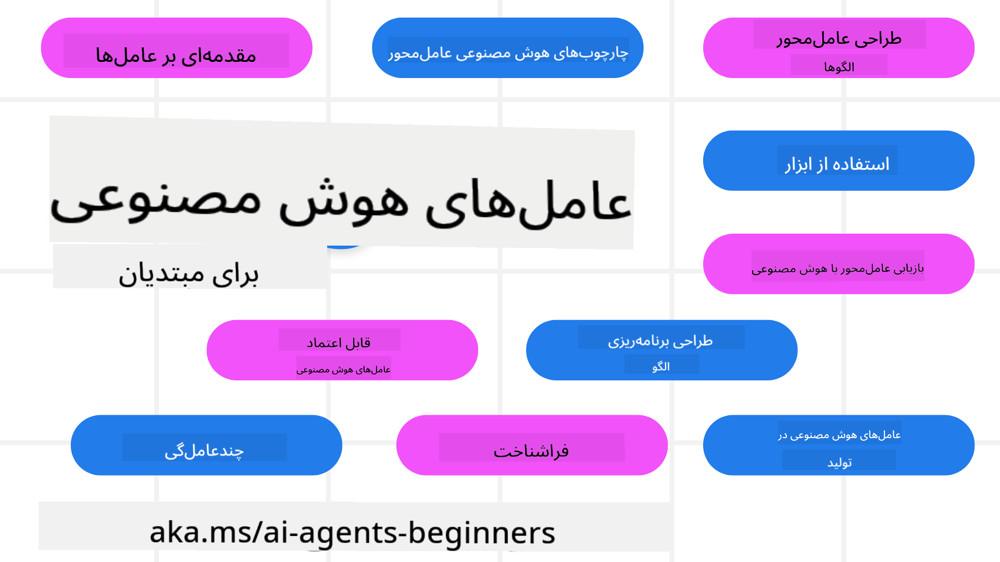

<!--
CO_OP_TRANSLATOR_METADATA:
{
  "original_hash": "6b07046397366e6f6f4524c9ddeba1e1",
  "translation_date": "2025-07-12T14:42:08+00:00",
  "source_file": "README.md",
  "language_code": "fa"
}
-->
# عوامل هوش مصنوعی برای مبتدیان - یک دوره آموزشی

## ۱۱ درس که همه چیز لازم برای شروع ساخت عوامل هوش مصنوعی را آموزش می‌دهد

  
  
  
  

### 🌐 پشتیبانی چندزبانه

#### پشتیبانی شده از طریق GitHub Action (خودکار و همیشه به‌روز)

[فرانسوی](../fr/README.md) | [اسپانیایی](../es/README.md) | [آلمانی](../de/README.md) | [روسی](../ru/README.md) | [عربی](../ar/README.md) | [فارسی](./README.md) | [اردو](../ur/README.md) | [چینی (ساده‌شده)](../zh/README.md) | [چینی (سنتی، ماکائو)](../mo/README.md) | [چینی (سنتی، هنگ‌کنگ)](../hk/README.md) | [چینی (سنتی، تایوان)](../tw/README.md) | [ژاپنی](../ja/README.md) | [کره‌ای](../ko/README.md) | [هندی](../hi/README.md) | [بنگالی](../bn/README.md) | [مراتی](../mr/README.md) | [نپالی](../ne/README.md) | [پنجابی (گورمخی)](../pa/README.md) | [پرتغالی (پرتغال)](../pt/README.md) | [پرتغالی (برزیل)](../br/README.md) | [ایتالیایی](../it/README.md) | [لهستانی](../pl/README.md) | [ترکی](../tr/README.md) | [یونانی](../el/README.md) | [تایلندی](../th/README.md) | [سوئدی](../sv/README.md) | [دانمارکی](../da/README.md) | [نروژی](../no/README.md) | [فنلاندی](../fi/README.md) | [هلندی](../nl/README.md) | [عبری](../he/README.md) | [ویتنامی](../vi/README.md) | [اندونزیایی](../id/README.md) | [مالایی](../ms/README.md) | [تاگالوگ (فیلیپینی)](../tl/README.md) | [سواحیلی](../sw/README.md) | [مجارستانی](../hu/README.md) | [چکی](../cs/README.md) | [اسلواکی](../sk/README.md) | [رومانیایی](../ro/README.md) | [بلغاری](../bg/README.md) | [صربی (سیریلیک)](../sr/README.md) | [کرواتی](../hr/README.md) | [اسلوونیایی](../sl/README.md) | [اوکراینی](../uk/README.md) | [برمه‌ای (میانمار)](../my/README.md)

**اگر مایلید زبان‌های ترجمه بیشتری اضافه شود، فهرست آن‌ها را [اینجا](https://github.com/Azure/co-op-translator/blob/main/getting_started/supported-languages.md) ببینید**

  
  

## 🌱 شروع به کار

این دوره شامل ۱۱ درس است که اصول ساخت عوامل هوش مصنوعی را پوشش می‌دهد. هر درس موضوع خاص خود را دارد، پس هر کجا که دوست دارید شروع کنید!

این دوره از چند زبان پشتیبانی می‌کند. برای دیدن زبان‌های موجود به [بخش پشتیبانی چندزبانه](../..) مراجعه کنید.

اگر برای اولین بار است که با مدل‌های هوش مصنوعی مولد کار می‌کنید، دوره [هوش مصنوعی مولد برای مبتدیان](https://aka.ms/genai-beginners) را ببینید که شامل ۲۱ درس درباره ساخت با GenAI است.

فراموش نکنید که به این مخزن [ستاره (🌟) بدهید](https://docs.github.com/en/get-started/exploring-projects-on-github/saving-repositories-with-stars?WT.mc_id=academic-105485-koreyst) و [این مخزن را فورک کنید](https://github.com/microsoft/ai-agents-for-beginners/fork) تا بتوانید کدها را اجرا کنید.

### آنچه نیاز دارید

هر درس در این دوره شامل نمونه کدهایی است که در پوشه code_samples قرار دارند. می‌توانید [این مخزن را فورک کنید](https://github.com/microsoft/ai-agents-for-beginners/fork) تا نسخه خودتان را بسازید.

نمونه کدهای این تمرین‌ها از Azure AI Foundry و GitHub Model Catalogs برای تعامل با مدل‌های زبانی استفاده می‌کنند:

- [Github Models](https://aka.ms/ai-agents-beginners/github-models) - رایگان / محدود  
- [Azure AI Foundry](https://aka.ms/ai-agents-beginners/ai-foundry) - نیاز به حساب Azure

این دوره همچنین از فریم‌ورک‌ها و سرویس‌های زیر از مایکروسافت برای عوامل هوش مصنوعی استفاده می‌کند:

- [Azure AI Agent Service](https://aka.ms/ai-agents-beginners/ai-agent-service)  
- [Semantic Kernel](https://aka.ms/ai-agents-beginners/semantic-kernel)  
- [AutoGen](https://aka.ms/ai-agents/autogen)

برای اطلاعات بیشتر درباره اجرای کدهای این دوره به [راه‌اندازی دوره](./00-course-setup/README.md) مراجعه کنید.

## 🙏 می‌خواهید کمک کنید؟

اگر پیشنهادی دارید یا اشکال املایی یا کد پیدا کردید، [یک issue ثبت کنید](https://github.com/microsoft/ai-agents-for-beginners/issues?WT.mc_id=academic-105485-koreyst) یا [یک pull request ایجاد کنید](https://github.com/microsoft/ai-agents-for-beginners/pulls?WT.mc_id=academic-105485-koreyst).

اگر گیر کردید یا سوالی درباره ساخت عوامل هوش مصنوعی داشتید، به [دیسکورد جامعه Azure AI Foundry](https://discord.gg/kzRShWzttr) بپیوندید.

اگر بازخورد محصول یا خطایی هنگام ساخت داشتید، به [انجمن توسعه‌دهندگان Azure AI Foundry](https://aka.ms/azureaifoundry/forum) مراجعه کنید.

## 📂 هر درس شامل

- یک درس مکتوب در README و یک ویدئوی کوتاه  
- نمونه کدهای پایتون که از Azure AI Foundry و Github Models (رایگان) پشتیبانی می‌کنند  
- لینک‌هایی به منابع اضافی برای ادامه یادگیری

## 🗃️ دروس

| **درس**                                   | **متن و کد**                                        | **ویدئو**                                                  | **یادگیری بیشتر**                                                                       |
|--------------------------------------------|----------------------------------------------------|------------------------------------------------------------|------------------------------------------------------------------------------------------|
| معرفی عوامل هوش مصنوعی و موارد استفاده آن‌ها | [لینک](./01-intro-to-ai-agents/README.md)          | [ویدئو](https://youtu.be/3zgm60bXmQk?si=z8QygFvYQv-9WtO1)  | [لینک](https://aka.ms/ai-agents-beginners/collection?WT.mc_id=academic-105485-koreyst)   |
| بررسی فریم‌ورک‌های عامل‌محور               | [لینک](./02-explore-agentic-frameworks/README.md)  | [ویدئو](https://youtu.be/ODwF-EZo_O8?si=Vawth4hzVaHv-u0H)  | [لینک](https://aka.ms/ai-agents-beginners/collection?WT.mc_id=academic-105485-koreyst)   |
| درک الگوهای طراحی عامل‌محور                 | [لینک](./03-agentic-design-patterns/README.md)     | [ویدئو](https://youtu.be/m9lM8qqoOEA?si=BIzHwzstTPL8o9GF)  | [لینک](https://aka.ms/ai-agents-beginners/collection?WT.mc_id=academic-105485-koreyst)   |
| الگوی طراحی استفاده از ابزار                 | [لینک](./04-tool-use/README.md)                    | [ویدئو](https://youtu.be/vieRiPRx-gI?si=2z6O2Xu2cu_Jz46N)  | [لینک](https://aka.ms/ai-agents-beginners/collection?WT.mc_id=academic-105485-koreyst)   |
| عامل‌محور RAG                              | [لینک](./05-agentic-rag/README.md)                 | [ویدئو](https://youtu.be/WcjAARvdL7I?si=gKPWsQpKiIlDH9A3)  | [لینک](https://aka.ms/ai-agents-beginners/collection?WT.mc_id=academic-105485-koreyst)   |
| ساخت عوامل هوش مصنوعی قابل اعتماد          | [لینک](./06-building-trustworthy-agents/README.md) | [ویدئو](https://youtu.be/iZKkMEGBCUQ?si=jZjpiMnGFOE9L8OK ) | [لینک](https://aka.ms/ai-agents-beginners/collection?WT.mc_id=academic-105485-koreyst)   |
| الگوی طراحی برنامه‌ریزی                      | [لینک](./07-planning-design/README.md)             | [ویدئو](https://youtu.be/kPfJ2BrBCMY?si=6SC_iv_E5-mzucnC)  | [لینک](https://aka.ms/ai-agents-beginners/collection?WT.mc_id=academic-105485-koreyst)   |
| الگوی طراحی چندعاملی                        | [لینک](./08-multi-agent/README.md)                 | [ویدئو](https://youtu.be/V6HpE9hZEx0?si=rMgDhEu7wXo2uo6g)  | [لینک](https://aka.ms/ai-agents-beginners/collection?WT.mc_id=academic-105485-koreyst)   |
| الگوی طراحی فراشناخت                        | [لینک](./09-metacognition/README.md)               | [ویدئو](https://youtu.be/His9R6gw6Ec?si=8gck6vvdSNCt6OcF)  | [لینک](https://aka.ms/ai-agents-beginners/collection?WT.mc_id=academic-105485-koreyst)   |
| عوامل هوش مصنوعی در تولید                   | [لینک](./10-ai-agents-production/README.md)        | [ویدئو](https://youtu.be/l4TP6IyJxmQ?si=31dnhexRo6yLRJDl)  | [لینک](https://aka.ms/ai-agents-beginners/collection?WT.mc_id=academic-105485-koreyst)   |
| عوامل هوش مصنوعی با MCP                     | [لینک](./11-mcp/README.md)                         |                                                            | [لینک](https://aka.ms/mcp-for-beginners)                                                 |

## 🎒 دوره‌های دیگر

تیم ما دوره‌های دیگری هم تولید می‌کند! حتماً ببینید:
- [**جدید** پروتکل زمینه مدل (MCP) برای مبتدی‌ها](https://github.com/microsoft/mcp-for-beginners?WT.mc_id=academic-105485-koreyst)
- [هوش مصنوعی مولد برای مبتدی‌ها با استفاده از .NET](https://github.com/microsoft/Generative-AI-for-beginners-dotnet?WT.mc_id=academic-105485-koreyst)
- [هوش مصنوعی مولد برای مبتدی‌ها](https://github.com/microsoft/generative-ai-for-beginners?WT.mc_id=academic-105485-koreyst)
- [یادگیری ماشین برای مبتدی‌ها](https://aka.ms/ml-beginners?WT.mc_id=academic-105485-koreyst)
- [علم داده برای مبتدی‌ها](https://aka.ms/datascience-beginners?WT.mc_id=academic-105485-koreyst)
- [هوش مصنوعی برای مبتدی‌ها](https://aka.ms/ai-beginners?WT.mc_id=academic-105485-koreyst)
- [امنیت سایبری برای مبتدی‌ها](https://github.com/microsoft/Security-101??WT.mc_id=academic-96948-sayoung)
- [توسعه وب برای مبتدی‌ها](https://aka.ms/webdev-beginners?WT.mc_id=academic-105485-koreyst)
- [اینترنت اشیاء برای مبتدی‌ها](https://aka.ms/iot-beginners?WT.mc_id=academic-105485-koreyst)
- [توسعه XR برای مبتدی‌ها](https://github.com/microsoft/xr-development-for-beginners?WT.mc_id=academic-105485-koreyst)
- [تسلط بر GitHub Copilot برای برنامه‌نویسی جفتی هوش مصنوعی](https://aka.ms/GitHubCopilotAI?WT.mc_id=academic-105485-koreyst)
- [تسلط بر GitHub Copilot برای توسعه‌دهندگان C#/.NET](https://github.com/microsoft/mastering-github-copilot-for-dotnet-csharp-developers?WT.mc_id=academic-105485-koreyst)
- [ماجراجویی انتخابی با Copilot خودتان](https://github.com/microsoft/CopilotAdventures?WT.mc_id=academic-105485-koreyst)

## 🌟 تشکر از جامعه

از [Shivam Goyal](https://www.linkedin.com/in/shivam2003/) برای ارائه نمونه‌های کد مهم که Agentic RAG را نشان می‌دهند، سپاسگزاریم.

## مشارکت

این پروژه از مشارکت‌ها و پیشنهادات استقبال می‌کند. بیشتر مشارکت‌ها نیازمند موافقت شما با
توافقنامه مجوز مشارکت‌کننده (CLA) است که اعلام می‌کند شما حق دارید و واقعاً این حق را به ما می‌دهید
تا از مشارکت شما استفاده کنیم. برای جزئیات، به
<https://cla.opensource.microsoft.com> مراجعه کنید.

وقتی درخواست pull ارسال می‌کنید، ربات CLA به‌طور خودکار تعیین می‌کند که آیا نیاز به ارائه
CLA دارید و درخواست را به‌طور مناسب علامت‌گذاری می‌کند (مثلاً بررسی وضعیت، نظر). کافی است دستورالعمل‌های
ربات را دنبال کنید. شما فقط یک بار در تمام مخازن استفاده‌کننده از CLA ما این کار را انجام خواهید داد.

این پروژه [کد رفتار منبع باز مایکروسافت](https://opensource.microsoft.com/codeofconduct/) را پذیرفته است.
برای اطلاعات بیشتر به [سؤالات متداول کد رفتار](https://opensource.microsoft.com/codeofconduct/faq/) مراجعه کنید یا
با [opencode@microsoft.com](mailto:opencode@microsoft.com) برای هر سؤال یا نظر اضافی تماس بگیرید.

## علائم تجاری

این پروژه ممکن است شامل علائم تجاری یا لوگوهایی برای پروژه‌ها، محصولات یا خدمات باشد. استفاده مجاز از علائم تجاری یا لوگوهای مایکروسافت مشروط به رعایت
[راهنمای علائم تجاری و برند مایکروسافت](https://www.microsoft.com/legal/intellectualproperty/trademarks/usage/general) است.
استفاده از علائم تجاری یا لوگوهای مایکروسافت در نسخه‌های تغییر یافته این پروژه نباید باعث سردرگمی شود یا حمایت مایکروسافت را القا کند.
هرگونه استفاده از علائم تجاری یا لوگوهای شخص ثالث تابع سیاست‌های آن‌ها است.

**سلب مسئولیت**:  
این سند با استفاده از سرویس ترجمه هوش مصنوعی [Co-op Translator](https://github.com/Azure/co-op-translator) ترجمه شده است. در حالی که ما در تلاش برای دقت هستیم، لطفاً توجه داشته باشید که ترجمه‌های خودکار ممکن است حاوی خطاها یا نادرستی‌هایی باشند. سند اصلی به زبان بومی خود باید به عنوان منبع معتبر در نظر گرفته شود. برای اطلاعات حیاتی، ترجمه حرفه‌ای انسانی توصیه می‌شود. ما مسئول هیچ گونه سوءتفاهم یا تفسیر نادرستی که از استفاده این ترجمه ناشی شود، نیستیم.