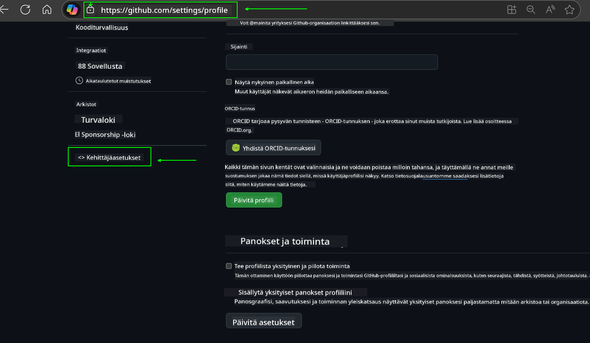
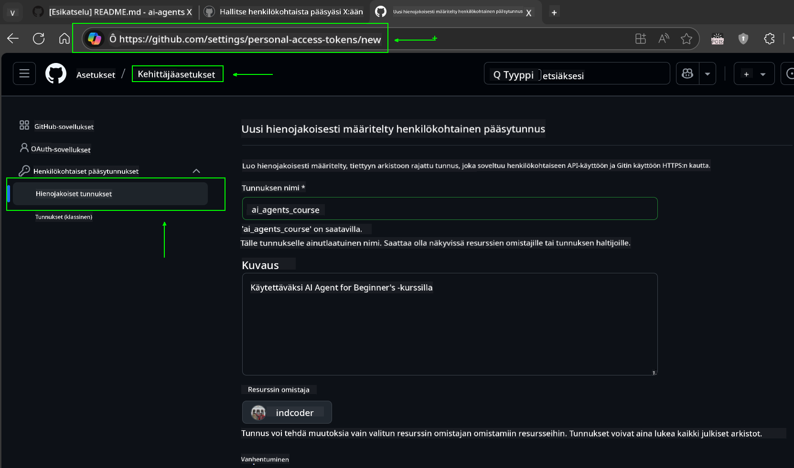
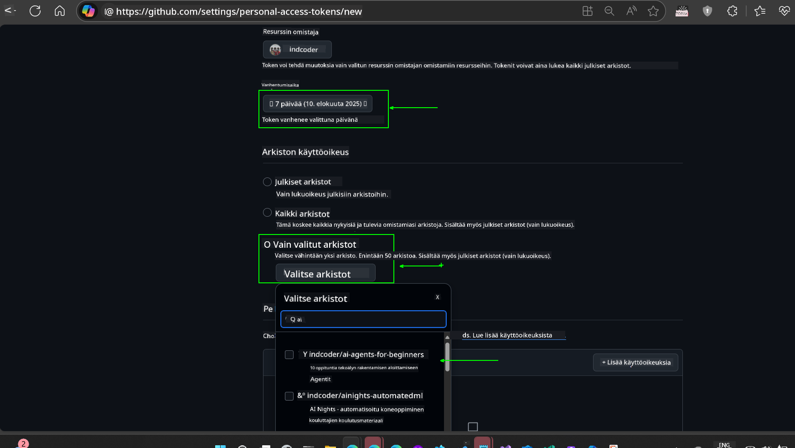
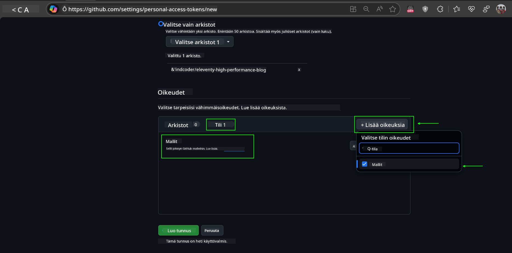
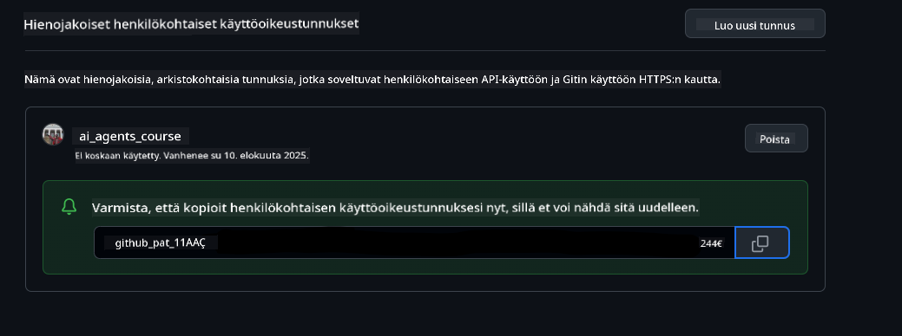
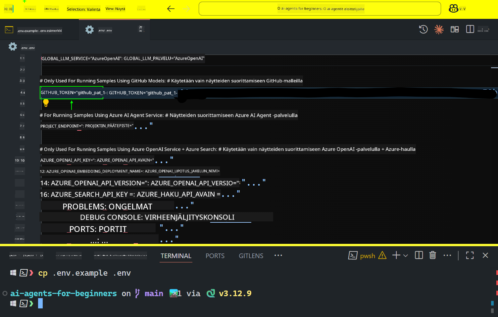

<!--
CO_OP_TRANSLATOR_METADATA:
{
  "original_hash": "c55b973b1562abf5aadf6a4028265ac5",
  "translation_date": "2025-08-29T17:12:35+00:00",
  "source_file": "00-course-setup/README.md",
  "language_code": "fi"
}
-->
# Kurssin Aloitus

## Johdanto

Tässä osiossa käsitellään, miten tämän kurssin koodiesimerkit suoritetaan.

## Liity Muiden Oppijoiden Seuraan ja Hanki Apua

Ennen kuin alat kloonata reposi, liity [AI Agents For Beginners Discord-kanavalle](https://aka.ms/ai-agents/discord) saadaksesi apua asennuksessa, kysymyksiin kurssista tai yhteyden muihin oppijoihin.

## Kloonaa tai Haarauta Tämä Repo

Aloittaaksesi, kloonaa tai haarauta GitHub-repositorio. Tämä luo oman version kurssimateriaalista, jotta voit suorittaa, testata ja muokata koodia!

Tämä voidaan tehdä napsauttamalla linkkiä:


## Koodin Suorittaminen

Tämä kurssi tarjoaa sarjan Jupyter Notebookeja, joita voit suorittaa saadaksesi käytännön kokemusta AI-agenttien rakentamisesta.

Koodiesimerkit käyttävät joko:

**Vaatii GitHub-tilin - Ilmainen**:

1) Semantic Kernel Agent Framework + GitHub Models Marketplace. Merkitty nimellä (semantic-kernel.ipynb)  
2) AutoGen Framework + GitHub Models Marketplace. Merkitty nimellä (autogen.ipynb)  

**Vaatii Azure-tilauksen**:  
3) Azure AI Foundry + Azure AI Agent Service. Merkitty nimellä (azureaiagent.ipynb)  

Suosittelemme kokeilemaan kaikkia kolmea esimerkkiä nähdäksesi, mikä sopii sinulle parhaiten.

Valitsemasi vaihtoehto määrittää, mitkä asennusvaiheet sinun tulee suorittaa alla:

## Vaatimukset

- Python 3.12+  
  - **HUOM**: Jos sinulla ei ole Python 3.12:ta asennettuna, varmista, että asennat sen. Luo sitten virtuaaliympäristösi python3.12:lla varmistaaksesi, että oikeat versiot asennetaan requirements.txt-tiedostosta.  
- GitHub-tili - Pääsy GitHub Models Marketplaceen  
- Azure-tilaus - Pääsy Azure AI Foundryyn  
- Azure AI Foundry -tili - Pääsy Azure AI Agent Serviceen  

Olemme sisällyttäneet `requirements.txt`-tiedoston tämän repositorion juureen, joka sisältää kaikki tarvittavat Python-paketit koodiesimerkkien suorittamiseen.

Voit asentaa ne suorittamalla seuraavan komennon terminaalissasi repositorion juuressa:

```bash
pip install -r requirements.txt
```  
Suosittelemme luomaan Python-virtuaaliympäristön välttääksesi konflikteja ja ongelmia.

## VSCode-asennus
Varmista, että käytät oikeaa Python-versiota VSCode:ssa.


## Asennus GitHub Models -esimerkeille

### Vaihe 1: Hanki GitHubin henkilökohtainen käyttöoikeustoken (PAT)

Tämä kurssi hyödyntää GitHub Models Marketplacea, joka tarjoaa ilmaisen pääsyn suuriin kielimalleihin (LLM), joita käytät AI-agenttien rakentamiseen.

GitHub-mallien käyttämiseksi sinun on luotava [GitHubin henkilökohtainen käyttöoikeustoken](https://docs.github.com/en/authentication/keeping-your-account-and-data-secure/managing-your-personal-access-tokens).

Tämä voidaan tehdä siirtymällä GitHub-tilillesi.

Noudata [vähimmän oikeuden periaatetta](https://docs.github.com/en/get-started/learning-to-code/storing-your-secrets-safely) luodessasi tokenia. Tämä tarkoittaa, että sinun tulisi antaa tokenille vain ne oikeudet, joita se tarvitsee tämän kurssin koodiesimerkkien suorittamiseen.

1. Valitse `Fine-grained tokens` -vaihtoehto näytön vasemmasta reunasta siirtymällä **Kehittäjäasetuksiin**  
   

   Valitse sitten `Generate new token`.

   

2. Anna tokenille kuvaava nimi, joka heijastaa sen tarkoitusta, jotta se on helppo tunnistaa myöhemmin.

   🔐 Tokenin keston suositus

   Suositeltu kesto: 30 päivää  
   Turvallisemman käytännön vuoksi voit valita lyhyemmän ajan, kuten 7 päivää 🛡️  
   Tämä on hyvä tapa asettaa henkilökohtainen tavoite ja suorittaa kurssi, kun oppimismotivaatiota riittää 🚀.

   

3. Rajoita tokenin käyttöoikeus haarautettuun repositorioon.

   

4. Rajoita tokenin oikeudet: Valitse **Permissions**-kohdassa **Account**-välilehti ja napsauta "+ Add permissions" -painiketta. Avautuvasta valikosta etsi **Models** ja valitse se.  
   

5. Varmista tarvittavat oikeudet ennen tokenin luomista. 

6. Ennen tokenin luomista varmista, että olet valmis tallentamaan sen turvalliseen paikkaan, kuten salasananhallintaohjelmaan, sillä sitä ei näytetä uudelleen luomisen jälkeen. 

Kopioi juuri luomasi token. Lisää se nyt tämän kurssin mukana toimitettuun `.env`-tiedostoon.

### Vaihe 2: Luo `.env`-tiedosto

Luo `.env`-tiedosto suorittamalla seuraava komento terminaalissasi.

```bash
cp .env.example .env
```

Tämä kopioi esimerkkitiedoston ja luo `.env`-tiedoston hakemistoosi, jossa täytät ympäristömuuttujien arvot.

Kopioidun tokenin kanssa avaa `.env`-tiedosto suosikkitekstieditorissasi ja liitä token `GITHUB_TOKEN`-kenttään.  


Nyt sinun pitäisi pystyä suorittamaan tämän kurssin koodiesimerkit.

## Asennus Azure AI Foundry- ja Azure AI Agent Service -esimerkeille

### Vaihe 1: Hanki Azure-projektin päätepiste

Noudata ohjeita hubin ja projektin luomiseksi Azure AI Foundryssa täältä: [Hub-resurssien yleiskatsaus](https://learn.microsoft.com/en-us/azure/ai-foundry/concepts/ai-resources)

Kun olet luonut projektisi, sinun on hankittava projektisi yhteysmerkkijono.

Tämä voidaan tehdä siirtymällä projektisi **Yleiskatsaus**-sivulle Azure AI Foundry -portaalissa.


### Vaihe 2: Luo `.env`-tiedosto

Luo `.env`-tiedosto suorittamalla seuraava komento terminaalissasi.

```bash
cp .env.example .env
```

Tämä kopioi esimerkkitiedoston ja luo `.env`-tiedoston hakemistoosi, jossa täytät ympäristömuuttujien arvot.

Kopioidun tokenin kanssa avaa `.env`-tiedosto suosikkitekstieditorissasi ja liitä token `PROJECT_ENDPOINT`-kenttään.

### Vaihe 3: Kirjaudu sisään Azureen

Turvallisuuskäytännön mukaisesti käytämme [avaimetonta todennusta](https://learn.microsoft.com/azure/developer/ai/keyless-connections?tabs=csharp%2Cazure-cli?WT.mc_id=academic-105485-koreyst) todennukseen Azure OpenAI:hin Microsoft Entra ID:n avulla.

Avaa seuraavaksi terminaali ja suorita `az login --use-device-code` kirjautuaksesi Azure-tilillesi.

Kun olet kirjautunut sisään, valitse tilauksesi terminaalissa.

## Lisäympäristömuuttujat - Azure Search ja Azure OpenAI

Agentic RAG -oppitunnilla - Oppitunti 5 - on esimerkkejä, jotka käyttävät Azure Searchia ja Azure OpenAI:ta.

Jos haluat suorittaa nämä esimerkit, sinun on lisättävä seuraavat ympäristömuuttujat `.env`-tiedostoosi:

### Yleiskatsaus-sivu (Projekti)

- `AZURE_SUBSCRIPTION_ID` - Tarkista **Projektin tiedot** projektisi **Yleiskatsaus**-sivulta.  
- `AZURE_AI_PROJECT_NAME` - Katso projektisi **Yleiskatsaus**-sivun yläosasta.  
- `AZURE_OPENAI_SERVICE` - Löydät tämän **Sisältyvät ominaisuudet** -välilehdeltä **Azure OpenAI Service** -kohdasta **Yleiskatsaus**-sivulla.  

### Hallintakeskus

- `AZURE_OPENAI_RESOURCE_GROUP` - Siirry **Projektin ominaisuudet** -kohtaan **Yleiskatsaus**-sivulla **Hallintakeskuksessa**.  
- `GLOBAL_LLM_SERVICE` - **Liitetyt resurssit** -kohdassa löydät **Azure AI Services** -yhteyden nimen. Jos sitä ei ole listattu, tarkista **Azure-portaalista** resurssiryhmästäsi AI Services -resurssin nimi.  

### Mallit + Päätepisteet -sivu

- `AZURE_OPENAI_EMBEDDING_DEPLOYMENT_NAME` - Valitse upotusmallisi (esim. `text-embedding-ada-002`) ja merkitse muistiin **Deployment name** mallin tiedoista.  
- `AZURE_OPENAI_CHAT_DEPLOYMENT_NAME` - Valitse keskustelumallisi (esim. `gpt-4o-mini`) ja merkitse muistiin **Deployment name** mallin tiedoista.  

### Azure-portaali

- `AZURE_OPENAI_ENDPOINT` - Etsi **Azure AI Services**, napsauta sitä, siirry **Resurssien hallinta**, **Avaimet ja päätepiste**, selaa alas kohtaan "Azure OpenAI endpoints" ja kopioi se, jossa lukee "Language APIs".  
- `AZURE_OPENAI_API_KEY` - Samalta näytöltä kopioi AVAIN 1 tai AVAIN 2.  
- `AZURE_SEARCH_SERVICE_ENDPOINT` - Etsi **Azure AI Search** -resurssi, napsauta sitä ja katso **Yleiskatsaus**.  
- `AZURE_SEARCH_API_KEY` - Siirry sitten **Asetukset** ja sitten **Avaimet** kopioidaksesi ensisijaisen tai toissijaisen hallinta-avaimen.  

### Ulkoinen verkkosivu

- `AZURE_OPENAI_API_VERSION` - Vieraile [API-version elinkaari](https://learn.microsoft.com/en-us/azure/ai-services/openai/api-version-deprecation#latest-ga-api-release) -sivulla kohdassa **Latest GA API release**.  

### Avaimeton todennus

Sen sijaan, että kovakoodaisimme tunnistetietosi, käytämme avaimetonta yhteyttä Azure OpenAI:hin. Tätä varten tuomme `DefaultAzureCredential`-luokan ja kutsumme myöhemmin `DefaultAzureCredential`-funktiota saadaksemme tunnistetiedot.

```python
from azure.identity import DefaultAzureCredential, InteractiveBrowserCredential
```

## Jäikö jokin epäselväksi?

Jos kohtaat ongelmia tämän asennuksen kanssa, liity meidän

## Seuraava Oppitunti

Olet nyt valmis suorittamaan tämän kurssin koodin. Mukavia oppimishetkiä AI-agenttien maailmassa!

[Johdanto AI-agentteihin ja agenttien käyttötapauksiin](../01-intro-to-ai-agents/README.md)

---

**Vastuuvapauslauseke**:  
Tämä asiakirja on käännetty käyttämällä tekoälypohjaista käännöspalvelua [Co-op Translator](https://github.com/Azure/co-op-translator). Vaikka pyrimme tarkkuuteen, huomioithan, että automaattiset käännökset voivat sisältää virheitä tai epätarkkuuksia. Alkuperäistä asiakirjaa sen alkuperäisellä kielellä tulisi pitää ensisijaisena lähteenä. Kriittisen tiedon osalta suositellaan ammattimaista ihmiskäännöstä. Emme ole vastuussa väärinkäsityksistä tai virhetulkinnoista, jotka johtuvat tämän käännöksen käytöstä.