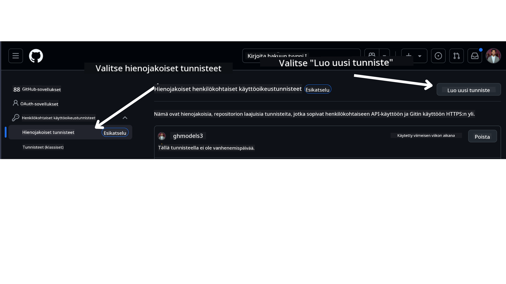

<!--
CO_OP_TRANSLATOR_METADATA:
{
  "original_hash": "76945069b52a49cd0432ae3e0b0ba22e",
  "translation_date": "2025-07-12T07:52:37+00:00",
  "source_file": "00-course-setup/README.md",
  "language_code": "fi"
}
-->
GitHub-tililläsi.

Valitse näytön vasemmasta reunasta `Fine-grained tokens` -vaihtoehto.

Valitse sitten `Generate new token`.



Sinua pyydetään antamaan tokenillesi nimi, valitse vanhenemispäivä (Suositus: 30 päivää) ja valitse tokenin käyttöoikeudet (Public Repositories).

On myös tarpeen muokata tämän tokenin oikeuksia: Permissions -> Models -> Sallii pääsyn GitHub-malleihin

Kopioi juuri luomasi token. Lisää tämä nyt kurssin mukana tulevaan `.env`-tiedostoon.

### Vaihe 2: Luo `.env`-tiedostosi

Luo `.env`-tiedosto suorittamalla seuraava komento terminaalissasi.

```bash
cp .env.example .env
```

Tämä kopioi esimerkkitiedoston ja luo `.env`-tiedoston hakemistoosi, johon täytät ympäristömuuttujien arvot.

Kun token on kopioitu, avaa `.env`-tiedosto suosikkitekstieditorissasi ja liitä token `GITHUB_TOKEN`-kenttään.

Nyt sinun pitäisi pystyä ajamaan tämän kurssin koodiesimerkit.

## Asetukset näytteille, jotka käyttävät Azure AI Foundrya ja Azure AI Agent Serviceä

### Vaihe 1: Hanki Azure-projektisi päätepiste

Seuraa ohjeita hubin ja projektin luomiseksi Azure AI Foundryssa täältä: [Hub resources overview](https://learn.microsoft.com/en-us/azure/ai-foundry/concepts/ai-resources)

Kun olet luonut projektisi, sinun täytyy hakea projektin yhteysmerkkijono.

Tämä onnistuu menemällä projektisi **Overview**-sivulle Azure AI Foundry -portaalissa.


### Vaihe 2: Luo `.env`-tiedostosi

Luo `.env`-tiedosto suorittamalla seuraava komento terminaalissasi.

```bash
cp .env.example .env
```

Tämä kopioi esimerkkitiedoston ja luo `.env`-tiedoston hakemistoosi, johon täytät ympäristömuuttujien arvot.

Kun token on kopioitu, avaa `.env`-tiedosto suosikkitekstieditorissasi ja liitä token `PROJECT_ENDPOINT`-kenttään.

### Vaihe 3: Kirjaudu Azureen

Turvallisuussyistä käytämme [avaimetonta todennusta](https://learn.microsoft.com/azure/developer/ai/keyless-connections?tabs=csharp%2Cazure-cli?WT.mc_id=academic-105485-koreyst) Azure OpenAI:n todennukseen Microsoft Entra ID:n avulla. Ennen kuin voit tehdä tämän, sinun täytyy ensin asentaa **Azure CLI** käyttöjärjestelmällesi ohjeiden mukaisesti: [asennusohjeet](https://learn.microsoft.com/cli/azure/install-azure-cli?WT.mc_id=academic-105485-koreyst).

Avaa sitten terminaali ja suorita `az login --use-device-code` kirjautuaksesi Azure-tilillesi.

Kun olet kirjautunut sisään, valitse tilauksesi terminaalissa.

## Lisäympäristömuuttujat – Azure Search ja Azure OpenAI

Agentic RAG -oppitunnilla – Oppitunti 5 – on esimerkkejä, jotka käyttävät Azure Searchia ja Azure OpenAI:ta.

Jos haluat ajaa nämä esimerkit, sinun täytyy lisätä seuraavat ympäristömuuttujat `.env`-tiedostoosi:

### Overview-sivu (projekti)

- `AZURE_SUBSCRIPTION_ID` – Tarkista **Project details** projektisi **Overview**-sivulta.

- `AZURE_AI_PROJECT_NAME` – Katso projektisi **Overview**-sivun yläosasta.

- `AZURE_OPENAI_SERVICE` – Löytyy **Included capabilities** -välilehdeltä **Azure OpenAI Service** -kohdasta **Overview**-sivulla.

### Management Center

- `AZURE_OPENAI_RESOURCE_GROUP` – Mene **Project properties** -kohtaan **Management Centerin** **Overview**-sivulla.

- `GLOBAL_LLM_SERVICE` – **Connected resources** -kohdasta löydät **Azure AI Services** -yhteyden nimen. Jos sitä ei ole listattu, tarkista **Azure-portaalista** resurssiryhmäsi AI Services -resurssin nimi.

### Models + Endpoints -sivu

- `AZURE_OPENAI_EMBEDDING_DEPLOYMENT_NAME` – Valitse upotusmallisi (esim. `text-embedding-ada-002`) ja huomioi **Deployment name** mallin tiedoista.

- `AZURE_OPENAI_CHAT_DEPLOYMENT_NAME` – Valitse chat-mallisi (esim. `gpt-4o-mini`) ja huomioi **Deployment name** mallin tiedoista.

### Azure-portaali

- `AZURE_OPENAI_ENDPOINT` – Etsi **Azure AI services**, klikkaa sitä, mene **Resource Management** -> **Keys and Endpoint**, selaa alas "Azure OpenAI endpoints" -kohtaan ja kopioi kohta, jossa lukee "Language APIs".

- `AZURE_OPENAI_API_KEY` – Samalta näytöltä kopioi AVAIN 1 tai AVAIN 2.

- `AZURE_SEARCH_SERVICE_ENDPOINT` – Etsi **Azure AI Search** -resurssisi, klikkaa sitä ja katso **Overview**.

- `AZURE_SEARCH_API_KEY` – Mene sitten **Settings** -> **Keys** ja kopioi ensisijainen tai toissijainen hallintavain.

### Ulkoinen verkkosivu

- `AZURE_OPENAI_API_VERSION` – Käy sivulla [API version lifecycle](https://learn.microsoft.com/en-us/azure/ai-services/openai/api-version-deprecation#latest-ga-api-release) kohdassa **Latest GA API release**.

### Aseta avaimeton todennus

Sen sijaan, että kovakoodaisit tunnistetietosi, käytämme avaimetonta yhteyttä Azure OpenAI:hin. Tähän tuomme `DefaultAzureCredential`-luokan ja kutsumme myöhemmin `DefaultAzureCredential`-funktiota saadaksemme tunnistetiedot.

```python
from azure.identity import DefaultAzureCredential, InteractiveBrowserCredential
```

## Jumiuduitko johonkin?

Jos sinulla on ongelmia tämän asennuksen kanssa, liity keskusteluumme osoitteessa

tai

.

## Seuraava oppitunti

Olet nyt valmis ajamaan tämän kurssin koodin. Onnea ja hauskaa oppimista tekoälyagenttien maailmasta!

[Introduction to AI Agents and Agent Use Cases](../01-intro-to-ai-agents/README.md)

**Vastuuvapauslauseke**:  
Tämä asiakirja on käännetty käyttämällä tekoälypohjaista käännöspalvelua [Co-op Translator](https://github.com/Azure/co-op-translator). Vaikka pyrimme tarkkuuteen, huomioithan, että automaattikäännöksissä saattaa esiintyä virheitä tai epätarkkuuksia. Alkuperäistä asiakirjaa sen alkuperäiskielellä tulee pitää virallisena lähteenä. Tärkeissä tiedoissa suositellaan ammattimaista ihmiskäännöstä. Emme ole vastuussa tämän käännöksen käytöstä aiheutuvista väärinymmärryksistä tai tulkinnoista.