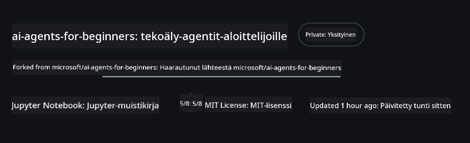
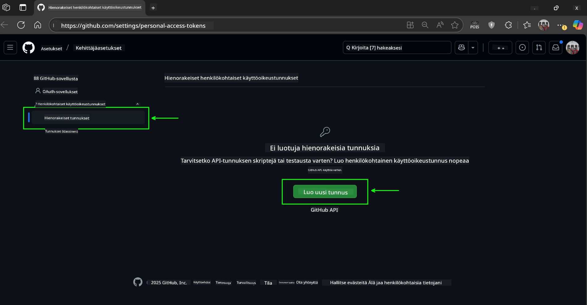
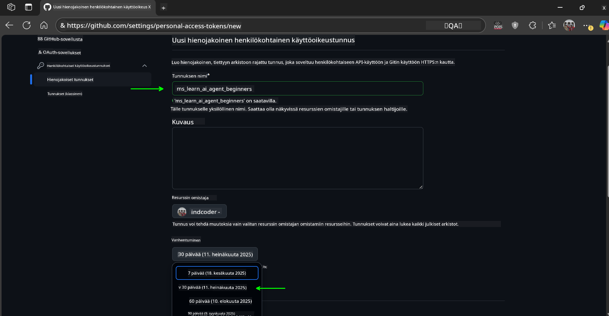
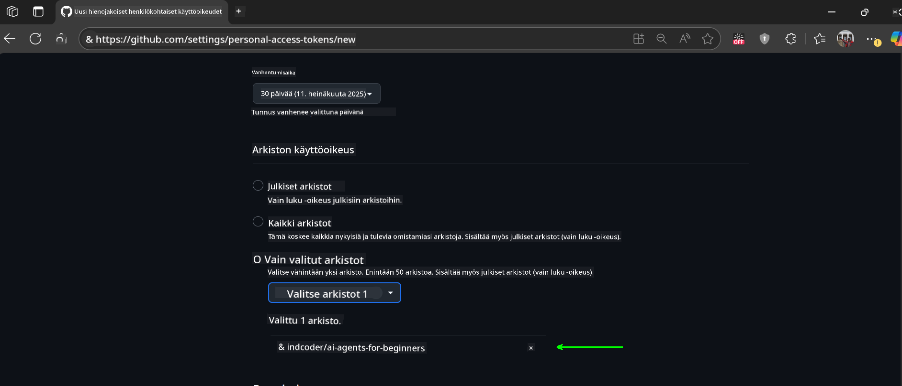
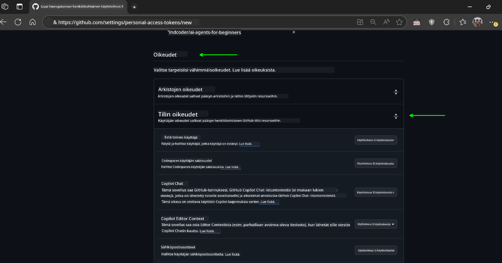
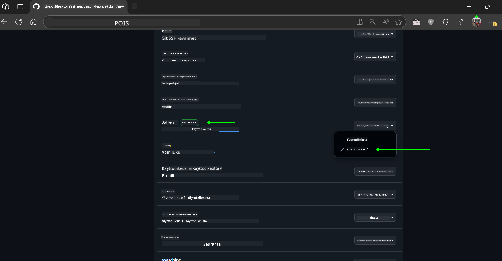
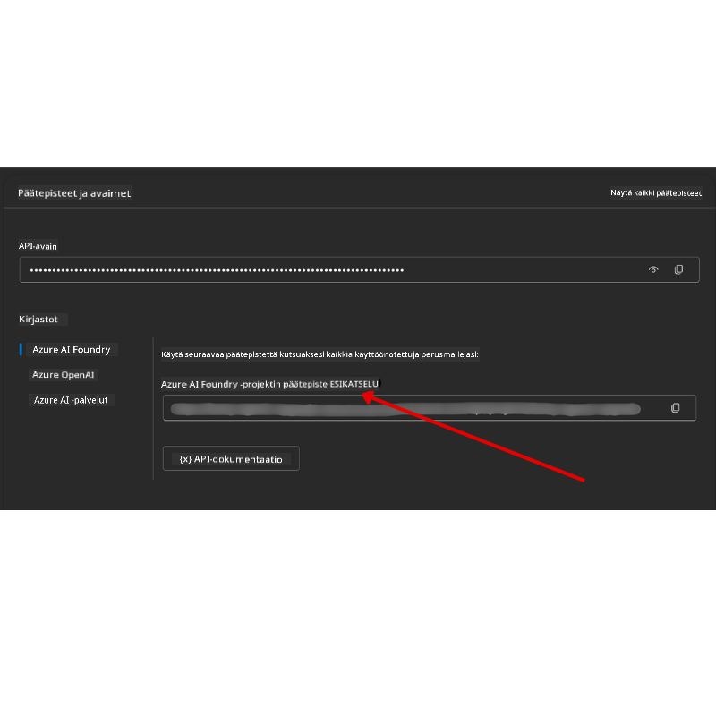

<!--
CO_OP_TRANSLATOR_METADATA:
{
  "original_hash": "c6a79c8f2b56a80370ff7e447765524f",
  "translation_date": "2025-07-23T08:53:18+00:00",
  "source_file": "00-course-setup/README.md",
  "language_code": "fi"
}
-->
# Kurssin Asennus

## Johdanto

Tässä osiossa käydään läpi, miten kurssin esimerkkikoodit suoritetaan.

## Kloonaa tai haarauta tämä repo

Aloittaaksesi, kloonaa tai haarauta GitHub-repositorio. Tämä luo oman version kurssimateriaalista, jotta voit suorittaa, testata ja muokata koodia!

Tämä onnistuu klikkaamalla linkkiä

Sinulla pitäisi nyt olla oma haarautettu versio tästä kurssista seuraavassa linkissä:



## Koodin suorittaminen

Tämä kurssi tarjoaa sarjan Jupyter Notebooks -tiedostoja, joita voit käyttää saadaksesi käytännön kokemusta AI-agenttien rakentamisesta.

Koodiesimerkit käyttävät joko:

**Vaatii GitHub-tilin - Ilmainen**:

1) Semantic Kernel Agent Framework + GitHub Models Marketplace. Merkitty nimellä (semantic-kernel.ipynb)
2) AutoGen Framework + GitHub Models Marketplace. Merkitty nimellä (autogen.ipynb)

**Vaatii Azure-tilauksen**:
3) Azure AI Foundry + Azure AI Agent Service. Merkitty nimellä (azureaiagent.ipynb)

Suosittelemme kokeilemaan kaikkia kolmea esimerkkiä nähdäksesi, mikä toimii parhaiten sinulle.

Valitsemasi vaihtoehto määrittää, mitkä asennusvaiheet sinun tulee suorittaa alla:

## Vaatimukset

- Python 3.12+
  - **NOTE**: Jos sinulla ei ole Python 3.12 asennettuna, varmista, että asennat sen. Luo sitten venv käyttämällä python3.12 varmistaaksesi, että oikeat versiot asennetaan requirements.txt-tiedostosta.
- GitHub-tili - Pääsy GitHub Models Marketplaceen
- Azure-tilaus - Pääsy Azure AI Foundryyn
- Azure AI Foundry -tili - Pääsy Azure AI Agent Serviceen

Olemme sisällyttäneet `requirements.txt`-tiedoston tämän repositorion juureen, joka sisältää kaikki tarvittavat Python-paketit koodiesimerkkien suorittamiseen.

Voit asentaa ne suorittamalla seuraavan komennon terminaalissasi repositorion juuressa:

```bash
pip install -r requirements.txt
```
Suosittelemme luomaan Python-virtuaaliympäristön välttääksesi konflikteja ja ongelmia.

## VSCode-asennus
Varmista, että käytät oikeaa Python-versiota VSCode:ssa.


## Asennus GitHub Models -esimerkeille 

### Vaihe 1: Hanki GitHub-henkilökohtainen käyttöoikeustunnuksesi (PAT)

Tämä kurssi hyödyntää GitHub Models Marketplacea, joka tarjoaa ilmaisen pääsyn suuriin kielimalleihin (LLM), joita käytät AI-agenttien rakentamiseen.

GitHub-mallien käyttämiseksi sinun tulee luoda [GitHub-henkilökohtainen käyttöoikeustunnus](https://docs.github.com/en/authentication/keeping-your-account-and-data-secure/managing-your-personal-access-tokens).

Tämä onnistuu menemällä GitHub-tilillesi.

Noudata [vähimmän oikeuden periaatetta](https://docs.github.com/en/get-started/learning-to-code/storing-your-secrets-safely) luodessasi tunnusta. Tämä tarkoittaa, että sinun tulisi antaa tunnukselle vain ne oikeudet, joita se tarvitsee kurssin koodiesimerkkien suorittamiseen.

1. Valitse `Fine-grained tokens` -vaihtoehto näytön vasemmasta reunasta.

    Valitse sitten `Generate new token`.

    

1. Anna tunnukselle kuvaava nimi, joka heijastaa sen tarkoitusta, jotta se on helppo tunnistaa myöhemmin. Aseta vanhenemispäivä (suositus: 30 päivää; voit valita lyhyemmän ajan, kuten 7 päivää, jos haluat turvallisemman käytännön).

    

1. Rajaa tunnuksen käyttöoikeus tämän repositorion haarautukseen.

    

1. Rajoita tunnuksen käyttöoikeudet: Valitse **Permissions**-kohdasta **Account Permissions**, siirry kohtaan **Models** ja ota käyttöön vain GitHub-mallien vaatima lukuoikeus.

    

    

Kopioi juuri luomasi tunnus. Lisää tämä kurssin mukana toimitettuun `.env`-tiedostoon.

### Vaihe 2: Luo `.env`-tiedostosi

Luo `.env`-tiedosto suorittamalla seuraava komento terminaalissasi.

```bash
cp .env.example .env
```

Tämä kopioi esimerkkitiedoston ja luo `.env`-tiedoston hakemistoosi, jossa täytät ympäristömuuttujien arvot.

Kun olet kopioinut tunnuksesi, avaa `.env`-tiedosto suosikkitekstieditorissasi ja liitä tunnus `GITHUB_TOKEN`-kenttään.

Nyt sinun pitäisi pystyä suorittamaan kurssin koodiesimerkit.

## Asennus Azure AI Foundry- ja Azure AI Agent Service -esimerkeille

### Vaihe 1: Hanki Azure-projektisi päätepiste

Seuraa ohjeita hubin ja projektin luomiseksi Azure AI Foundryssa täältä: [Hub-resurssien yleiskatsaus](https://learn.microsoft.com/en-us/azure/ai-foundry/concepts/ai-resources)

Kun olet luonut projektisi, sinun tulee hankkia projektisi yhteysmerkkijono.

Tämä onnistuu menemällä projektisi **Yleiskatsaus**-sivulle Azure AI Foundry -portaalissa.



### Vaihe 2: Luo `.env`-tiedostosi

Luo `.env`-tiedosto suorittamalla seuraava komento terminaalissasi.

```bash
cp .env.example .env
```

Tämä kopioi esimerkkitiedoston ja luo `.env`-tiedoston hakemistoosi, jossa täytät ympäristömuuttujien arvot.

Kun olet kopioinut tunnuksesi, avaa `.env`-tiedosto suosikkitekstieditorissasi ja liitä tunnus `PROJECT_ENDPOINT`-kenttään.

### Vaihe 3: Kirjaudu Azureen

Turvallisuuskäytännön mukaisesti käytämme [avaimetonta autentikointia](https://learn.microsoft.com/azure/developer/ai/keyless-connections?tabs=csharp%2Cazure-cli?WT.mc_id=academic-105485-koreyst) Azure OpenAI:n autentikointiin Microsoft Entra ID:n avulla.

Avaa seuraavaksi terminaali ja suorita `az login --use-device-code` kirjautuaksesi Azure-tilillesi.

Kun olet kirjautunut sisään, valitse tilauksesi terminaalissa.

## Lisäympäristömuuttujat - Azure Search ja Azure OpenAI 

Agentic RAG -osiossa - Osio 5 - on esimerkkejä, jotka käyttävät Azure Searchia ja Azure OpenAI:ta.

Jos haluat suorittaa nämä esimerkit, sinun tulee lisätä seuraavat ympäristömuuttujat `.env`-tiedostoosi:

### Yleiskatsaus-sivu (Projekti)

- `AZURE_SUBSCRIPTION_ID` - Tarkista **Projektin tiedot** projektisi **Yleiskatsaus**-sivulta.

- `AZURE_AI_PROJECT_NAME` - Katso projektisi **Yleiskatsaus**-sivun yläosaa.

- `AZURE_OPENAI_SERVICE` - Löydät tämän **Sisältyvät ominaisuudet**-välilehdeltä **Azure OpenAI Service** kohdasta **Yleiskatsaus**.

### Hallintakeskus

- `AZURE_OPENAI_RESOURCE_GROUP` - Mene **Projektin ominaisuudet** kohtaan **Yleiskatsaus**-sivulla **Hallintakeskuksessa**.

- `GLOBAL_LLM_SERVICE` - **Liitetyt resurssit**-kohdasta löydät **Azure AI Services**-yhteyden nimen. Jos ei listattu, tarkista **Azure-portaali** resurssiryhmästäsi AI Services -resurssin nimi.

### Mallit + Päätepisteet -sivu

- `AZURE_OPENAI_EMBEDDING_DEPLOYMENT_NAME` - Valitse upotusmallisi (esim. `text-embedding-ada-002`) ja huomioi **Deployment name** mallin tiedoista.

- `AZURE_OPENAI_CHAT_DEPLOYMENT_NAME` - Valitse chat-mallisi (esim. `gpt-4o-mini`) ja huomioi **Deployment name** mallin tiedoista.

### Azure-portaali

- `AZURE_OPENAI_ENDPOINT` - Etsi **Azure AI Services**, klikkaa sitä, mene **Resurssien hallinta**, **Avaimet ja päätepiste**, selaa alas kohtaan "Azure OpenAI endpoints" ja kopioi se, jossa lukee "Language APIs".

- `AZURE_OPENAI_API_KEY` - Samalta näytöltä kopioi AVAIN 1 tai AVAIN 2.

- `AZURE_SEARCH_SERVICE_ENDPOINT` - Etsi **Azure AI Search**-resurssisi, klikkaa sitä ja katso **Yleiskatsaus**.

- `AZURE_SEARCH_API_KEY` - Mene sitten **Asetukset** ja sitten **Avaimet** kopioidaksesi ensisijaisen tai toissijaisen hallinta-avaimen.

### Ulkoinen verkkosivu

- `AZURE_OPENAI_API_VERSION` - Käy [API-version elinkaari](https://learn.microsoft.com/en-us/azure/ai-services/openai/api-version-deprecation#latest-ga-api-release) -sivulla kohdassa **Latest GA API release**.

### Avaimeton autentikointi

Sen sijaan, että kovakoodaisimme tunnistetiedot, käytämme avaimetonta yhteyttä Azure OpenAI:n kanssa. Tätä varten tuomme `DefaultAzureCredential`-luokan ja kutsumme myöhemmin `DefaultAzureCredential`-funktiota saadaksemme tunnisteen.

```python
from azure.identity import DefaultAzureCredential, InteractiveBrowserCredential
```

## Jäikö jokin epäselväksi?

Jos sinulla on ongelmia tämän asennuksen kanssa, liity meidän

## Seuraava osio

Olet nyt valmis suorittamaan kurssin koodin. Mukavia oppimishetkiä AI-agenttien maailmasta! 

[Johdatus AI-agentteihin ja agenttien käyttötapauksiin](../01-intro-to-ai-agents/README.md)

**Vastuuvapauslauseke**:  
Tämä asiakirja on käännetty käyttämällä tekoälypohjaista käännöspalvelua [Co-op Translator](https://github.com/Azure/co-op-translator). Vaikka pyrimme tarkkuuteen, huomioithan, että automaattiset käännökset voivat sisältää virheitä tai epätarkkuuksia. Alkuperäinen asiakirja sen alkuperäisellä kielellä tulisi pitää ensisijaisena lähteenä. Kriittisen tiedon osalta suositellaan ammattimaista ihmiskäännöstä. Emme ole vastuussa väärinkäsityksistä tai virhetulkinnoista, jotka johtuvat tämän käännöksen käytöstä.