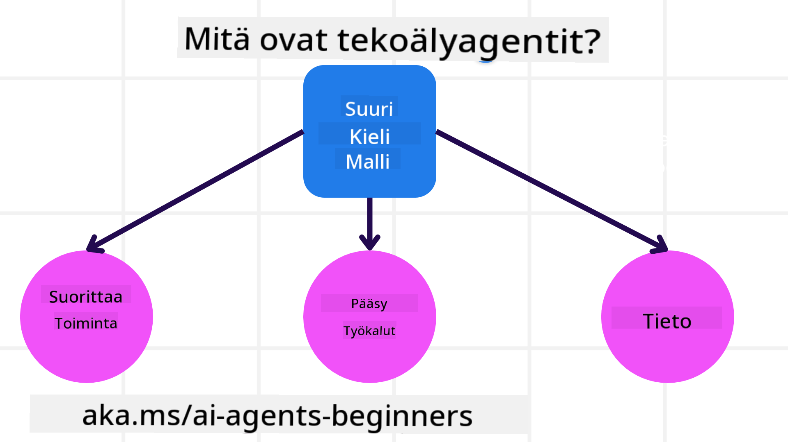
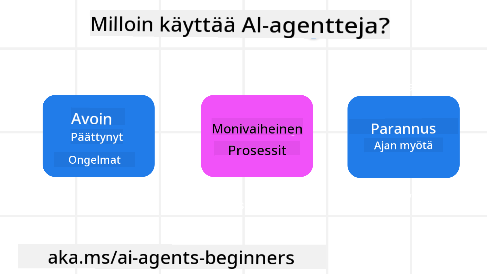

<!--
CO_OP_TRANSLATOR_METADATA:
{
  "original_hash": "d84943abc8f001ad4670418d32c2d899",
  "translation_date": "2025-07-12T08:08:35+00:00",
  "source_file": "01-intro-to-ai-agents/README.md",
  "language_code": "fi"
}
-->
tavata muita oppijoita ja AI-agenttien rakentajia sekä esittää kysymyksiä tästä kurssista.

Aloittaaksemme kurssin, perehdymme ensin siihen, mitä AI-agentit ovat ja miten voimme hyödyntää niitä rakentamissamme sovelluksissa ja työnkuluissa.

## Johdanto

Tässä oppitunnissa käsitellään:

- Mitä AI-agentit ovat ja millaisia agenttityyppejä on olemassa?
- Millaisissa käyttötapauksissa AI-agentit toimivat parhaiten ja miten ne voivat auttaa meitä?
- Mitkä ovat peruspalikoita agenttipohjaisten ratkaisujen suunnittelussa?

## Oppimistavoitteet
Oppitunnin suorittamisen jälkeen sinun tulisi osata:

- Ymmärtää AI-agenttien käsitteet ja miten ne eroavat muista AI-ratkaisuista.
- Käyttää AI-agentteja tehokkaasti.
- Suunnitella agenttipohjaisia ratkaisuja tuottavasti sekä käyttäjille että asiakkaille.

## AI-agenttien määrittely ja agenttityypit

### Mitä AI-agentit ovat?

AI-agentit ovat **järjestelmiä**, jotka mahdollistavat **suuren kielimallin (LLM)** suorittaa **toimintoja** laajentamalla sen kykyjä antamalla LLM:lle **pääsy työkaluisiin** ja **tietoon**.

Puretaan tämä määritelmä osiin:

- **Järjestelmä** – On tärkeää ajatella agentteja kokonaisuutena, ei pelkkänä yksittäisenä komponenttina. Perustasolla AI-agentin osat ovat:
  - **Ympäristö** – Määritelty tila, jossa AI-agentti toimii. Esimerkiksi matkavarauksen AI-agentin ympäristö voisi olla matkavarauksen järjestelmä, jota agentti käyttää tehtävien suorittamiseen.
  - **Sensorit** – Ympäristöt sisältävät tietoa ja tarjoavat palautetta. AI-agentit käyttävät sensoreita kerätäkseen ja tulkitakseen tietoa ympäristön nykytilasta. Matkavarauksen agentin tapauksessa järjestelmä voi antaa tietoa esimerkiksi hotellien saatavuudesta tai lentojen hinnoista.
  - **Toimilaitteet** – Kun AI-agentti saa tiedon ympäristön nykytilasta, se päättää tehtävän perusteella, mitä toimintaa suorittaa ympäristön muuttamiseksi. Matkavarauksen agentti saattaa esimerkiksi varata käyttäjälle vapaan huoneen.

**Suuret kielimallit** – Agenttien käsite oli olemassa jo ennen LLM:ien syntyä. LLM:ien etuna AI-agenttien rakentamisessa on niiden kyky tulkita ihmiskieltä ja dataa. Tämä kyky mahdollistaa ympäristötiedon tulkinnan ja suunnitelman laatimisen ympäristön muuttamiseksi.

**Toimintojen suorittaminen** – AI-agenttijärjestelmien ulkopuolella LLM:t rajoittuvat tilanteisiin, joissa toiminto on sisällön tai tiedon tuottaminen käyttäjän kehotteen perusteella. AI-agenttijärjestelmissä LLM:t voivat suorittaa tehtäviä tulkitsemalla käyttäjän pyyntöä ja käyttämällä ympäristössään olevia työkaluja.

**Pääsy työkaluihin** – Mitä työkaluja LLM:llä on käytössään, määrittelee 1) ympäristö, jossa se toimii, ja 2) AI-agentin kehittäjä. Matkavarauksen esimerkissä agentin työkalut rajoittuvat varausjärjestelmän tarjoamiin toimintoihin, ja/tai kehittäjä voi rajoittaa agentin työkalujen käyttöä esimerkiksi lentojen varaamiseen.

**Muisti ja tieto** – Muisti voi olla lyhytaikaista, esimerkiksi käyttäjän ja agentin välisessä keskustelussa. Pitkäaikaisesti, ympäristön tarjoaman tiedon lisäksi, AI-agentit voivat hakea tietoa muista järjestelmistä, palveluista, työkaluista ja jopa muilta agenteilta. Matkavarauksen esimerkissä tämä tieto voisi olla käyttäjän matkustustottumuksia sisältävä asiakasrekisteri.

### Erilaiset agenttityypit

Nyt kun meillä on yleinen määritelmä AI-agenteista, tarkastellaan joitakin erityisiä agenttityyppejä ja miten ne soveltuisivat matkavarauksen AI-agenttiin.

| **Agenttityyppi**             | **Kuvaus**                                                                                                                          | **Esimerkki**                                                                                                                                                                                                                 |
| ----------------------------- | ---------------------------------------------------------------------------------------------------------------------------------- | ----------------------------------------------------------------------------------------------------------------------------------------------------------------------------------------------------------------------------- |
| **Yksinkertaiset refleksagentit** | Suorittavat välittömiä toimintoja ennalta määriteltyjen sääntöjen perusteella.                                                     | Matka-agentti tulkitsee sähköpostin sisällön ja ohjaa matkavalitukset asiakaspalveluun.                                                                                                                                         |
| **Mallipohjaiset refleksagentit** | Toimivat maailman mallin ja sen muutosten perusteella.                                                                             | Matka-agentti priorisoi reittejä, joilla on merkittäviä hintamuutoksia, hyödyntäen historiallista hintatietoa.                                                                                                                  |
| **Tavoitepohjaiset agentit**   | Laativat suunnitelman tavoitteen saavuttamiseksi tulkitsemalla tavoitteen ja määrittämällä tarvittavat toimet.                     | Matka-agentti varaa matkan määrittämällä tarvittavat järjestelyt (auto, julkinen liikenne, lennot) lähtöpaikasta määränpäähän.                                                                                                  |
| **Hyötypohjaiset agentit**     | Ottavat huomioon mieltymykset ja punnitsevat numeerisesti kompromisseja tavoitteen saavuttamiseksi.                                | Matka-agentti maksimoi hyötyä punnitsemalla mukavuuden ja kustannusten välillä matkavarauksissa.                                                                                                                               |
| **Oppivat agentit**            | Parantavat toimintaansa ajan myötä vastaanottamalla palautetta ja säätämällä toimintojaan sen mukaan.                              | Matka-agentti parantaa toimintaansa hyödyntämällä asiakaspalautetta matkan jälkeisistä kyselyistä tulevia varauksia varten.                                                                                                     |
| **Hierarkkiset agentit**       | Sisältävät useita agentteja kerroksellisessa järjestelmässä, jossa ylemmän tason agentit jakavat tehtäviä alemmille agenttitasoille. | Matka-agentti peruuttaa matkan jakamalla tehtävän osatehtäviin (esim. yksittäisten varausten peruutus) ja alemmat agentit suorittavat ne, raportoiden ylemmälle agentille.                                                      |
| **Moniagenttijärjestelmät (MAS)** | Agentit suorittavat tehtäviä itsenäisesti, joko yhteistyössä tai kilpailullisesti.                                                | Yhteistyö: Useat agentit varaavat eri matkustuspalveluja, kuten hotellit, lennot ja viihteen. Kilpailu: Useat agentit hallinnoivat ja kilpailevat yhteisestä hotellivarauksen kalenterista asiakkaiden majoittamiseksi.           |

## Milloin käyttää AI-agentteja

Aiemmassa osiossa käytimme matkavarauksen esimerkkiä selittämään, miten eri agenttityyppejä voidaan hyödyntää erilaisissa matkavarauksen tilanteissa. Jatkamme tämän sovelluksen käyttöä koko kurssin ajan.

Tarkastellaan käyttötapauksia, joissa AI-agentit toimivat parhaiten:

- **Avoimet ongelmat** – LLM voi määrittää tarvittavat vaiheet tehtävän suorittamiseksi, koska niitä ei aina voi kovakoodata työnkulkuun.
- **Monivaiheiset prosessit** – Tehtävät, jotka vaativat monimutkaisuutta, jossa AI-agentin täytyy käyttää työkaluja tai tietoa useamman vuorovaikutuskierroksen ajan yksittäisen haun sijaan.
- **Parantuminen ajan myötä** – Tehtävät, joissa agentti voi kehittyä ajan myötä vastaanottamalla palautetta joko ympäristöltä tai käyttäjiltä tarjotakseen parempaa hyötyä.

Käsittelemme lisää AI-agenttien käytön huomioita luotettavien AI-agenttien rakentamisen oppitunnissa.

## Agenttipohjaisten ratkaisujen perusteet

### Agentin kehitys

Ensimmäinen askel AI-agenttijärjestelmän suunnittelussa on määritellä työkalut, toiminnot ja käyttäytymiset. Tässä kurssissa keskitymme **Azure AI Agent Service** -palvelun käyttöön agenttien määrittelyssä. Se tarjoaa ominaisuuksia kuten:

- Avoimien mallien valinta, kuten OpenAI, Mistral ja Llama
- Lisensoidun datan käyttö esimerkiksi Tripadvisorin kautta
- Standardoitujen OpenAPI 3.0 -työkalujen käyttö

### Agenttipatternit

Viestintä LLM:ien kanssa tapahtuu kehotteiden avulla. Koska AI-agentit ovat osittain itsenäisiä, ei aina ole mahdollista tai tarpeellista kehottaa LLM:ää uudelleen manuaalisesti ympäristön muutoksen jälkeen. Käytämme **agenttipatterneja**, jotka mahdollistavat LLM:n kehotteiden antamisen useassa vaiheessa skaalautuvammin.

Tämä kurssi on jaettu joihinkin suosittuihin agenttipatterneihin.

### Agenttikehykset

Agenttikehykset antavat kehittäjille mahdollisuuden toteuttaa agenttipatternit koodin avulla. Nämä kehykset tarjoavat malleja, lisäosia ja työkaluja AI-agenttien yhteistyön parantamiseksi. Ne tarjoavat myös parempaa havaittavuutta ja vianetsintää AI-agenttijärjestelmissä.

Kurssilla tutustumme tutkimuspohjaiseen AutoGen-kehykseen ja tuotantovalmiiseen Semantic Kernelin Agent-kehykseen.

## Edellinen oppitunti

[Kurssin aloitus](../00-course-setup/README.md)

## Seuraava oppitunti

[Agenttikehysten tutkiminen](../02-explore-agentic-frameworks/README.md)

**Vastuuvapauslauseke**:  
Tämä asiakirja on käännetty käyttämällä tekoälypohjaista käännöspalvelua [Co-op Translator](https://github.com/Azure/co-op-translator). Vaikka pyrimme tarkkuuteen, huomioithan, että automaattikäännöksissä saattaa esiintyä virheitä tai epätarkkuuksia. Alkuperäistä asiakirjaa sen alkuperäiskielellä tulee pitää virallisena lähteenä. Tärkeissä tiedoissa suositellaan ammattimaista ihmiskäännöstä. Emme ole vastuussa tämän käännöksen käytöstä aiheutuvista väärinymmärryksistä tai tulkinnoista.