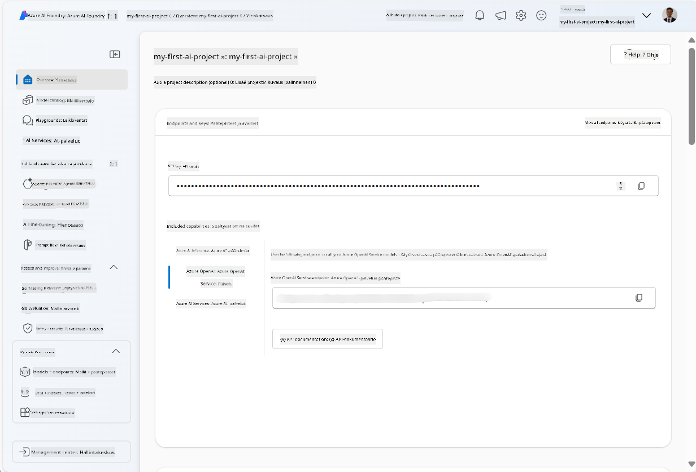
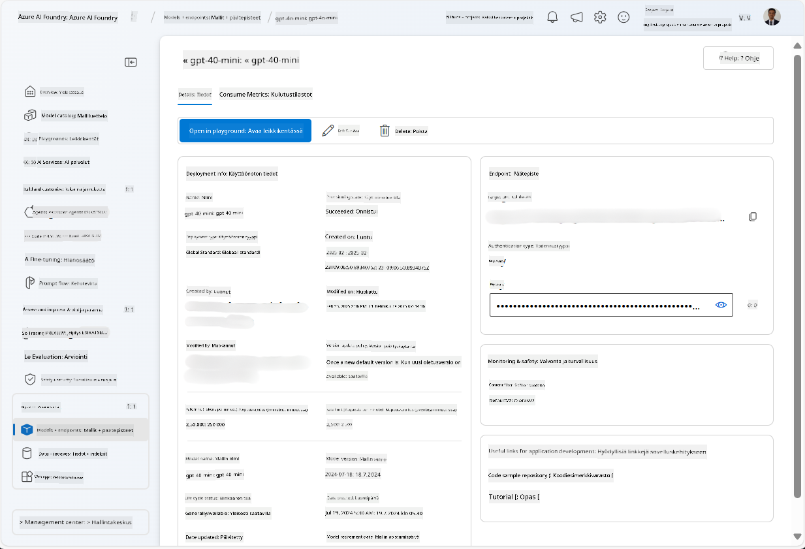
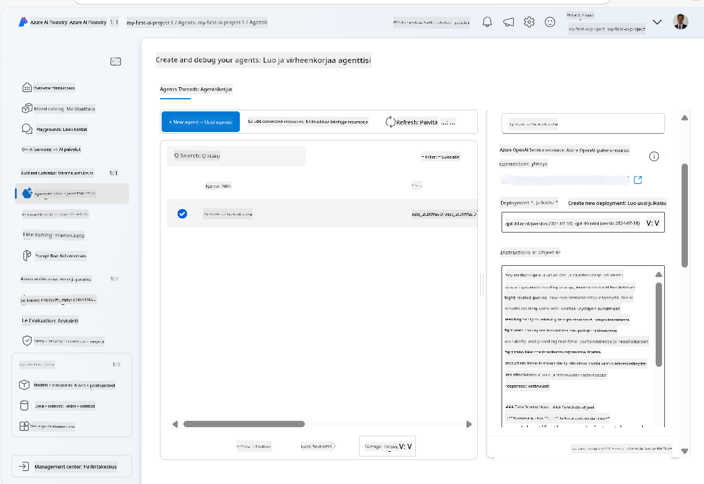

<!--
CO_OP_TRANSLATOR_METADATA:
{
  "original_hash": "7e92870dc0843e13d4dabc620c09d2d9",
  "translation_date": "2025-07-12T08:20:15+00:00",
  "source_file": "02-explore-agentic-frameworks/azure-ai-foundry-agent-creation.md",
  "language_code": "fi"
}
-->
# Azure AI Agent Service Development

Tässä harjoituksessa käytät Azure AI Agent -palvelun työkaluja [Azure AI Foundry -portaalissa](https://ai.azure.com/?WT.mc_id=academic-105485-koreyst) luodaksesi agentin lentovarauksia varten. Agentti pystyy keskustelemaan käyttäjien kanssa ja tarjoamaan tietoa lennoista.

## Vaatimukset

Harjoituksen suorittamiseksi tarvitset seuraavat:
1. Azure-tilin, jolla on aktiivinen tilaus. [Luo tili ilmaiseksi](https://azure.microsoft.com/free/?WT.mc_id=academic-105485-koreyst).
2. Oikeudet luoda Azure AI Foundry -keskus tai sellainen on luotava puolestasi.
    - Jos roolisi on Contributor tai Owner, voit seurata tämän opetusohjelman ohjeita.

## Luo Azure AI Foundry -keskus

> **Note:** Azure AI Foundry tunnettiin aiemmin nimellä Azure AI Studio.

1. Noudata näitä ohjeita [Azure AI Foundry](https://learn.microsoft.com/en-us/azure/ai-studio/?WT.mc_id=academic-105485-koreyst) -blogikirjoituksesta Azure AI Foundry -keskuksen luomiseksi.
2. Kun projektisi on luotu, sulje mahdolliset vinkit ja tarkastele projektisivua Azure AI Foundry -portaalissa, jonka pitäisi näyttää suunnilleen tältä:

    

## Ota malli käyttöön

1. Projektisi vasemman reunan paneelissa, kohdassa **My assets**, valitse **Models + endpoints** -sivu.
2. **Models + endpoints** -sivulla, **Model deployments** -välilehdellä, valitse **+ Deploy model** -valikosta **Deploy base model**.
3. Etsi listalta `gpt-4o-mini` -malli, valitse se ja vahvista.

    > **Note**: TPM:n alentaminen auttaa välttämään tilauksesi käytettävissä olevan kiintiön liiallista kulutusta.

    

## Luo agentti

Nyt kun olet ottanut mallin käyttöön, voit luoda agentin. Agentti on keskusteleva tekoälymalli, jota voidaan käyttää vuorovaikutukseen käyttäjien kanssa.

1. Projektisi vasemman reunan paneelissa, kohdassa **Build & Customize**, valitse **Agents** -sivu.
2. Klikkaa **+ Create agent** luodaksesi uuden agentin. **Agent Setup** -valintaikkunassa:
    - Anna agentille nimi, esimerkiksi `FlightAgent`.
    - Varmista, että aiemmin luomasi `gpt-4o-mini` -mallin käyttöönotto on valittuna.
    - Määritä **Instructions** haluamallasi ohjeistuksella agentille. Tässä esimerkki:
    ```
    You are FlightAgent, a virtual assistant specialized in handling flight-related queries. Your role includes assisting users with searching for flights, retrieving flight details, checking seat availability, and providing real-time flight status. Follow the instructions below to ensure clarity and effectiveness in your responses:

    ### Task Instructions:
    1. **Recognizing Intent**:
       - Identify the user's intent based on their request, focusing on one of the following categories:
         - Searching for flights
         - Retrieving flight details using a flight ID
         - Checking seat availability for a specified flight
         - Providing real-time flight status using a flight number
       - If the intent is unclear, politely ask users to clarify or provide more details.
        
    2. **Processing Requests**:
        - Depending on the identified intent, perform the required task:
        - For flight searches: Request details such as origin, destination, departure date, and optionally return date.
        - For flight details: Request a valid flight ID.
        - For seat availability: Request the flight ID and date and validate inputs.
        - For flight status: Request a valid flight number.
        - Perform validations on provided data (e.g., formats of dates, flight numbers, or IDs). If the information is incomplete or invalid, return a friendly request for clarification.

    3. **Generating Responses**:
    - Use a tone that is friendly, concise, and supportive.
    - Provide clear and actionable suggestions based on the output of each task.
    - If no data is found or an error occurs, explain it to the user gently and offer alternative actions (e.g., refine search, try another query).
    
    ```
> [!NOTE]
> Yksityiskohtaisempia ohjeita varten voit tutustua [tähän repositorioon](https://github.com/ShivamGoyal03/RoamMind).

> Lisäksi voit lisätä **Knowledge Base** ja **Actions** parantaaksesi agentin kykyjä tarjota lisätietoa ja suorittaa automatisoituja tehtäviä käyttäjän pyyntöjen perusteella. Tässä harjoituksessa voit ohittaa nämä vaiheet.



3. Uuden monitekoälyagentin luomiseksi klikkaa vain **New Agent**. Uusi agentti näkyy sitten Agents-sivulla.

## Testaa agenttia

Agentin luomisen jälkeen voit testata sitä nähdäksesi, miten se vastaa käyttäjän kyselyihin Azure AI Foundry -portaalin leikkikentällä.

1. Agentin **Setup**-paneelin yläosassa valitse **Try in playground**.
2. **Playground**-paneelissa voit keskustella agentin kanssa kirjoittamalla kysymyksiä chat-ikkunaan. Voit esimerkiksi pyytää agenttia etsimään lentoja Seattlesta New Yorkiin 28. päivälle.

    > **Note**: Agentti ei välttämättä anna tarkkoja vastauksia, koska tässä harjoituksessa ei käytetä reaaliaikaista dataa. Tarkoituksena on testata agentin kykyä ymmärtää ja vastata käyttäjän kyselyihin annettujen ohjeiden perusteella.

    

3. Testauksen jälkeen voit räätälöidä agenttia lisäämällä siihen lisää intenttejä, koulutusdataa ja toimintoja sen kykyjen parantamiseksi.

## Siivoa resurssit

Kun olet lopettanut agentin testaamisen, voit poistaa sen välttääksesi lisäkustannuksia.
1. Avaa [Azure-portaali](https://portal.azure.com) ja tarkastele resurssiryhmää, johon olet ottanut käyttöön tässä harjoituksessa käytetyt keskuksen resurssit.
2. Työkaluriviltä valitse **Delete resource group**.
3. Kirjoita resurssiryhmän nimi ja vahvista, että haluat poistaa sen.

## Resurssit

- [Azure AI Foundry documentation](https://learn.microsoft.com/en-us/azure/ai-studio/?WT.mc_id=academic-105485-koreyst)
- [Azure AI Foundry portal](https://ai.azure.com/?WT.mc_id=academic-105485-koreyst)
- [Getting Started with Azure AI Studio](https://techcommunity.microsoft.com/blog/educatordeveloperblog/getting-started-with-azure-ai-studio/4095602?WT.mc_id=academic-105485-koreyst)
- [Fundamentals of AI agents on Azure](https://learn.microsoft.com/en-us/training/modules/ai-agent-fundamentals/?WT.mc_id=academic-105485-koreyst)
- [Azure AI Discord](https://aka.ms/AzureAI/Discord)

**Vastuuvapauslauseke**:  
Tämä asiakirja on käännetty käyttämällä tekoälypohjaista käännöspalvelua [Co-op Translator](https://github.com/Azure/co-op-translator). Vaikka pyrimme tarkkuuteen, huomioithan, että automaattikäännöksissä saattaa esiintyä virheitä tai epätarkkuuksia. Alkuperäistä asiakirjaa sen alkuperäiskielellä tulee pitää virallisena lähteenä. Tärkeissä tiedoissa suositellaan ammattimaista ihmiskäännöstä. Emme ole vastuussa tämän käännöksen käytöstä aiheutuvista väärinymmärryksistä tai tulkinnoista.