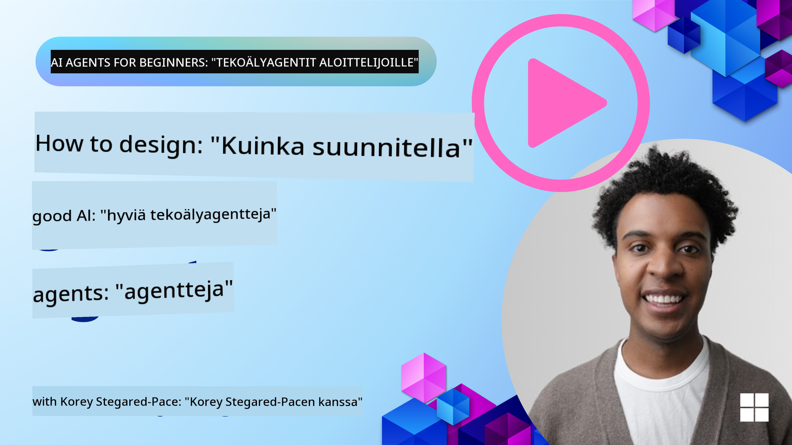
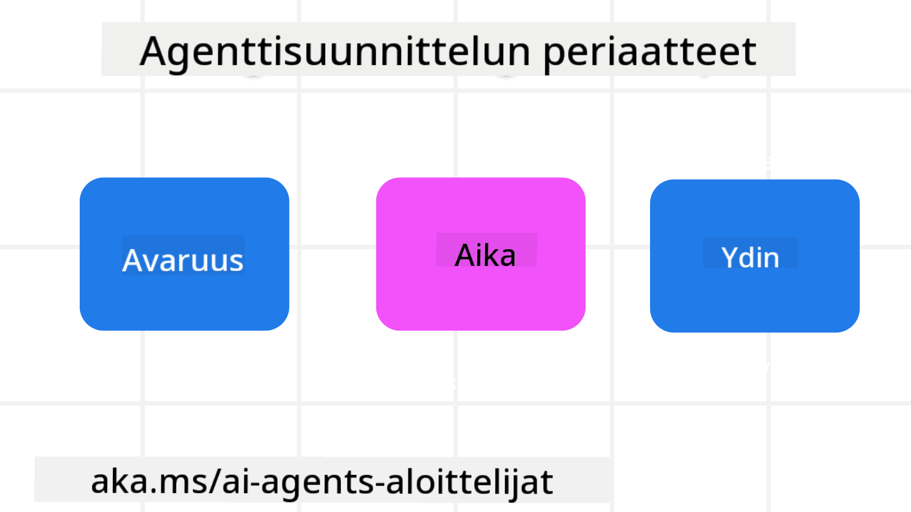

<!--
CO_OP_TRANSLATOR_METADATA:
{
  "original_hash": "4c46e4ff9e349c521e2b0b17f51afa64",
  "translation_date": "2025-08-29T17:18:26+00:00",
  "source_file": "03-agentic-design-patterns/README.md",
  "language_code": "fi"
}
-->

> _(Klikkaa yllä olevaa kuvaa katsoaksesi tämän oppitunnin videon)_
# Tekoälyagenttien suunnitteluperiaatteet

## Johdanto

Tekoälyagenttijärjestelmien rakentamiseen on monia lähestymistapoja. Koska epäselvyys on ominaisuus eikä virhe generatiivisen tekoälyn suunnittelussa, insinöörien voi olla joskus vaikea tietää, mistä aloittaa. Olemme luoneet joukon ihmiskeskeisiä UX-suunnitteluperiaatteita, jotka auttavat kehittäjiä rakentamaan asiakaskeskeisiä agenttijärjestelmiä liiketoimintatarpeidensa ratkaisemiseksi. Nämä suunnitteluperiaatteet eivät ole tarkka arkkitehtuuri, vaan lähtökohta tiimeille, jotka määrittelevät ja rakentavat agenttikokemuksia.

Yleisesti ottaen agenttien tulisi:

- Laajentaa ja tehostaa ihmisten kykyjä (ideointi, ongelmanratkaisu, automaatio jne.)
- Täyttää tiedon aukkoja (esim. perehdytys tiettyihin aihealueisiin, käännökset jne.)
- Helpottaa ja tukea yhteistyötä tavoilla, joilla haluamme työskennellä muiden kanssa
- Auttaa meitä tulemaan paremmiksi versioiksi itsestämme (esim. elämänvalmentaja/tehtävien hallitsija, auttaa oppimaan tunnetaitoja ja tietoisuustaitoja, rakentamaan resilienssiä jne.)

## Tämä oppitunti käsittelee

- Mitä ovat tekoälyagenttien suunnitteluperiaatteet
- Mitä ohjeita kannattaa noudattaa näitä periaatteita toteutettaessa
- Esimerkkejä suunnitteluperiaatteiden käytöstä

## Oppimistavoitteet

Tämän oppitunnin jälkeen osaat:

1. Selittää, mitä tekoälyagenttien suunnitteluperiaatteet ovat
2. Selittää ohjeet näiden suunnitteluperiaatteiden käyttöön
3. Ymmärtää, miten rakentaa agentti näiden suunnitteluperiaatteiden avulla

## Tekoälyagenttien suunnitteluperiaatteet

### Agentti (tila)

Tämä on ympäristö, jossa agentti toimii. Nämä periaatteet ohjaavat, miten suunnittelemme agentteja toimimaan fyysisissä ja digitaalisissa maailmoissa.

- **Yhdistäminen, ei eristäminen** – auta yhdistämään ihmisiä toisiinsa, tapahtumiin ja toiminnalliseen tietoon yhteistyön ja yhteyksien mahdollistamiseksi.
- Agentit auttavat yhdistämään tapahtumia, tietoa ja ihmisiä.
- Agentit tuovat ihmisiä lähemmäs toisiaan. Niitä ei ole suunniteltu korvaamaan tai vähättelemään ihmisiä.
- **Helposti saavutettavissa mutta toisinaan näkymättömiä** – agentti toimii pääosin taustalla ja antaa muistutuksia vain silloin, kun se on merkityksellistä ja sopivaa.
  - Agentti on helposti löydettävissä ja käytettävissä valtuutetuille käyttäjille millä tahansa laitteella tai alustalla.
  - Agentti tukee monimuotoisia syöte- ja tulostusmuotoja (ääni, puhe, teksti jne.).
  - Agentti voi saumattomasti siirtyä etualan ja taustan välillä; proaktiivisen ja reaktiivisen toiminnan välillä käyttäjän tarpeiden mukaan.
  - Agentti voi toimia näkymättömässä muodossa, mutta sen taustaprosessit ja yhteistyö muiden agenttien kanssa ovat käyttäjälle läpinäkyviä ja hallittavissa.

### Agentti (aika)

Tämä kuvaa, miten agentti toimii ajan kuluessa. Nämä periaatteet ohjaavat, miten suunnittelemme agentteja, jotka toimivat menneisyydessä, nykyhetkessä ja tulevaisuudessa.

- **Menneisyys**: Historian huomioiminen, mukaan lukien tila ja konteksti.
  - Agentti tarjoaa merkityksellisempiä tuloksia analysoimalla laajempaa historiallista dataa kuin vain tapahtumat, ihmiset tai tilat.
  - Agentti luo yhteyksiä menneisiin tapahtumiin ja aktiivisesti reflektoi muistiaan käsitelläkseen nykytilanteita.
- **Nykyhetki**: Muistuttaminen, ei pelkkä ilmoittaminen.
  - Agentti omaksuu kokonaisvaltaisen lähestymistavan ihmisten kanssa vuorovaikuttamiseen. Kun tapahtuma tapahtuu, agentti menee staattisen ilmoituksen tai muun muodollisuuden yli. Se voi yksinkertaistaa prosesseja tai dynaamisesti luoda vihjeitä ohjatakseen käyttäjän huomiota oikeaan aikaan.
  - Agentti toimittaa tietoa kontekstin, sosiaalisten ja kulttuuristen muutosten sekä käyttäjän tarkoituksen mukaan räätälöitynä.
  - Agentin vuorovaikutus voi olla asteittaista, kehittyen ja monimutkaistuen ajan myötä käyttäjän voimaannuttamiseksi.
- **Tulevaisuus**: Mukautuminen ja kehittyminen.
  - Agentti mukautuu erilaisiin laitteisiin, alustoihin ja toimintatapoihin.
  - Agentti mukautuu käyttäjän käyttäytymiseen, saavutettavuustarpeisiin ja on vapaasti muokattavissa.
  - Agentti muotoutuu ja kehittyy jatkuvan käyttäjävuorovaikutuksen kautta.

### Agentti (ydin)

Nämä ovat agentin suunnittelun keskeisiä elementtejä.

- **Hyväksy epävarmuus mutta rakenna luottamusta**.
  - Tietty määrä epävarmuutta agentin toiminnassa on odotettavissa. Epävarmuus on olennainen osa agentin suunnittelua.
  - Luottamus ja läpinäkyvyys ovat agentin suunnittelun peruspilareita.
  - Ihmiset hallitsevat, milloin agentti on päällä/pois päältä, ja agentin tila on aina selkeästi näkyvissä.

## Ohjeet näiden periaatteiden toteuttamiseen

Kun käytät edellä mainittuja suunnitteluperiaatteita, noudata seuraavia ohjeita:

1. **Läpinäkyvyys**: Kerro käyttäjälle, että tekoäly on mukana, miten se toimii (mukaan lukien aiemmat toiminnot) ja miten antaa palautetta ja muokata järjestelmää.
2. **Hallinta**: Anna käyttäjän mukauttaa, määrittää mieltymyksiä ja personoida sekä hallita järjestelmää ja sen ominaisuuksia (mukaan lukien mahdollisuus unohtaa).
3. **Johdonmukaisuus**: Pyri johdonmukaisiin, monimuotoisiin kokemuksiin eri laitteilla ja käyttöliittymissä. Käytä tuttuja käyttöliittymäelementtejä aina kun mahdollista (esim. mikrofonikuvake puhevuorovaikutukseen) ja vähennä asiakkaan kognitiivista kuormitusta mahdollisimman paljon (esim. pyri ytimekkäisiin vastauksiin, visuaalisiin apuvälineisiin ja "Lue lisää" -sisältöön).

## Miten suunnitella matkailuagentti näiden periaatteiden ja ohjeiden avulla

Kuvittele, että suunnittelet matkailuagenttia. Näin voisit hyödyntää suunnitteluperiaatteita ja ohjeita:

1. **Läpinäkyvyys** – Kerro käyttäjälle, että matkailuagentti on tekoälypohjainen agentti. Anna perusohjeet, miten aloittaa (esim. "Hei"-viesti, esimerkkikyselyt). Dokumentoi tämä selkeästi tuotteen sivulla. Näytä lista käyttäjän aiemmin esittämistä kyselyistä. Tee selväksi, miten antaa palautetta (peukku ylös tai alas, "Lähetä palautetta" -painike jne.). Ilmoita selkeästi, jos agentilla on käyttö- tai aihealueen rajoituksia.
2. **Hallinta** – Tee selväksi, miten käyttäjä voi muokata agenttia sen luomisen jälkeen, esimerkiksi järjestelmäkehotteen avulla. Anna käyttäjän valita, kuinka laajasti agentti vastaa, sen kirjoitustyyli ja mahdolliset rajoitukset siitä, mistä agentti ei saisi puhua. Salli käyttäjän tarkastella ja poistaa kaikki liitetyt tiedostot tai tiedot, kyselyt ja aiemmat keskustelut.
3. **Johdonmukaisuus** – Varmista, että kuvakkeet, kuten "Jaa kysely", "lisää tiedosto tai kuva" ja "merkitse joku tai jokin", ovat standardoituja ja tunnistettavia. Käytä paperiliitinkuvaketta osoittamaan tiedoston lataamista/jakamista agentin kanssa ja kuvaketta osoittamaan graafisen sisällön lataamista.

### Onko sinulla lisää kysymyksiä tekoälyagenttien suunnittelumalleista?

Liity [Azure AI Foundry Discordiin](https://aka.ms/ai-agents/discord) keskustellaksesi muiden oppijoiden kanssa, osallistuaksesi toimistoaikoihin ja saadaksesi vastauksia tekoälyagentteihin liittyviin kysymyksiisi.

## Lisäresurssit

## Edellinen oppitunti

[Tutustuminen agenttikehyksiin](../02-explore-agentic-frameworks/README.md)

## Seuraava oppitunti

[Työkalujen käyttö -suunnittelumalli](../04-tool-use/README.md)

---

**Vastuuvapauslauseke**:  
Tämä asiakirja on käännetty käyttämällä tekoälypohjaista käännöspalvelua [Co-op Translator](https://github.com/Azure/co-op-translator). Vaikka pyrimme tarkkuuteen, huomioithan, että automaattiset käännökset voivat sisältää virheitä tai epätarkkuuksia. Alkuperäistä asiakirjaa sen alkuperäisellä kielellä tulisi pitää ensisijaisena lähteenä. Kriittisen tiedon osalta suositellaan ammattimaista ihmiskäännöstä. Emme ole vastuussa väärinkäsityksistä tai virhetulkinnoista, jotka johtuvat tämän käännöksen käytöstä.