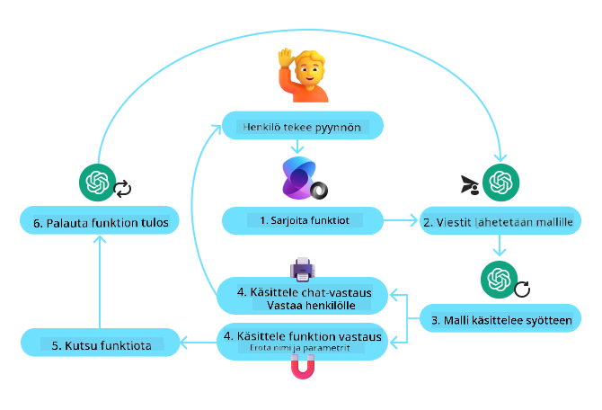
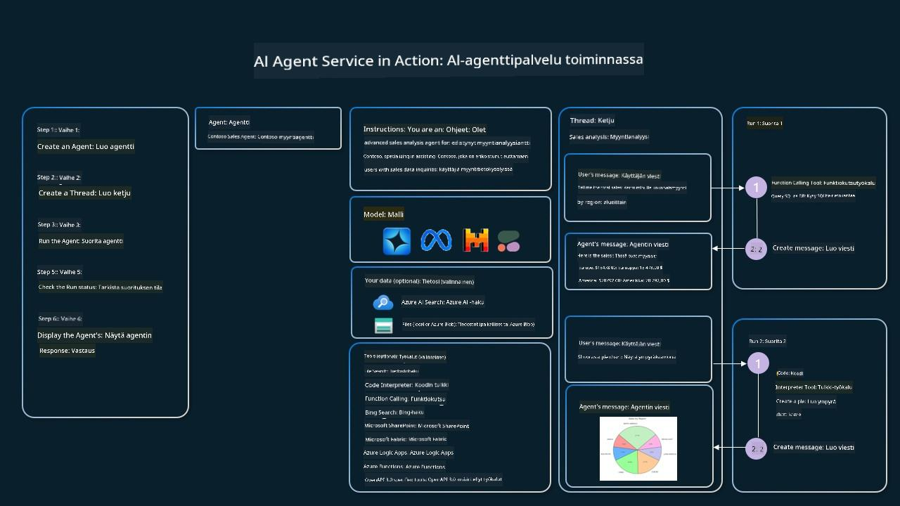

<!--
CO_OP_TRANSLATOR_METADATA:
{
  "original_hash": "88258b03f2893aa2e69eb8fb24baabbc",
  "translation_date": "2025-07-12T09:37:25+00:00",
  "source_file": "04-tool-use/README.md",
  "language_code": "fi"
}
-->
[](https://youtu.be/vieRiPRx-gI?si=cEZ8ApnT6Sus9rhn)

> _(Napsauta yllä olevaa kuvaa nähdäksesi tämän oppitunnin videon)_

# Työkalujen Käyttö -suunnittelumalli

Työkalut ovat mielenkiintoisia, koska ne antavat tekoälyagenteille laajemman valikoiman kykyjä. Sen sijaan, että agentilla olisi rajallinen joukko toimintoja, joita se voi suorittaa, työkalun lisäämällä agentti voi nyt suorittaa monenlaisia toimintoja. Tässä luvussa tarkastelemme Työkalujen Käyttö -suunnittelumallia, joka kuvaa, miten tekoälyagentit voivat käyttää tiettyjä työkaluja tavoitteidensa saavuttamiseksi.

## Johdanto

Tässä oppitunnissa pyrimme vastaamaan seuraaviin kysymyksiin:

- Mikä on työkalujen käyttö -suunnittelumalli?
- Mihin käyttötapauksiin sitä voidaan soveltaa?
- Mitkä ovat suunnittelumallin toteuttamiseen tarvittavat elementit/rakennuspalikat?
- Mitä erityisiä huomioita liittyy työkalujen käyttö -suunnittelumallin hyödyntämiseen luotettavien tekoälyagenttien rakentamisessa?

## Oppimistavoitteet

Oppitunnin suorittamisen jälkeen osaat:

- Määritellä työkalujen käyttö -suunnittelumallin ja sen tarkoituksen.
- Tunnistaa käyttötapaukset, joissa työkalujen käyttö -suunnittelumalli on sovellettavissa.
- Ymmärtää suunnittelumallin toteuttamiseen tarvittavat keskeiset elementit.
- Tunnistaa luotettavuuden varmistamiseen liittyvät näkökohdat tekoälyagenteissa, jotka käyttävät tätä suunnittelumallia.

## Mikä on työkalujen käyttö -suunnittelumalli?

**Työkalujen käyttö -suunnittelumalli** keskittyy antamaan LLM-malleille kyvyn olla vuorovaikutuksessa ulkoisten työkalujen kanssa tiettyjen tavoitteiden saavuttamiseksi. Työkalut ovat koodia, jota agentti voi suorittaa toimiakseen. Työkalu voi olla yksinkertainen funktio, kuten laskin, tai kolmannen osapuolen palveluun tehtävä API-kutsu, kuten osakekurssin haku tai sääennuste. Tekoälyagenttien yhteydessä työkalut on suunniteltu suoritettaviksi agenttien toimesta vastauksena **mallin generoimiin funktiokutsuihin**.

## Mihin käyttötapauksiin sitä voidaan soveltaa?

Tekoälyagentit voivat hyödyntää työkaluja monimutkaisten tehtävien suorittamiseen, tiedon hakemiseen tai päätöksentekoon. Työkalujen käyttö -suunnittelumallia käytetään usein tilanteissa, joissa tarvitaan dynaamista vuorovaikutusta ulkoisten järjestelmien, kuten tietokantojen, verkkopalveluiden tai koodin tulkkien kanssa. Tämä kyky on hyödyllinen monissa eri käyttötapauksissa, kuten:

- **Dynaaminen tiedonhaku:** Agentit voivat kysyä ulkoisilta API:ilta tai tietokannoista ajantasaista tietoa (esim. SQLite-tietokannan kysely analyysiä varten, osakekurssien tai säätilan hakeminen).
- **Koodin suoritus ja tulkinta:** Agentit voivat suorittaa koodia tai skriptejä ratkaistakseen matemaattisia ongelmia, luodakseen raportteja tai suorittaakseen simulaatioita.
- **Työnkulkujen automaatio:** Toistuvien tai monivaiheisten työnkulkujen automatisointi integroimalla työkaluja, kuten tehtävien ajastimia, sähköpostipalveluita tai datan putkia.
- **Asiakastuki:** Agentit voivat olla vuorovaikutuksessa CRM-järjestelmien, tikettijärjestelmien tai tietopankkien kanssa käyttäjäkyselyjen ratkaisemiseksi.
- **Sisällön luonti ja muokkaus:** Agentit voivat hyödyntää työkaluja, kuten kielioppitarkistimia, tekstin tiivistäjiä tai sisällön turvallisuusarvioijia sisällöntuotannon tukena.

## Mitkä ovat työkalujen käyttö -suunnittelumallin toteuttamiseen tarvittavat elementit/rakennuspalikat?

Nämä rakennuspalikat mahdollistavat tekoälyagentin suorittaa monenlaisia tehtäviä. Tarkastellaan keskeisiä elementtejä, joita tarvitaan työkalujen käyttö -suunnittelumallin toteuttamiseen:

- **Funktio-/työkalukaaviot:** Yksityiskohtaiset määritelmät käytettävissä olevista työkaluista, mukaan lukien funktion nimi, tarkoitus, vaaditut parametrit ja odotetut tulokset. Nämä kaaviot auttavat LLM:ää ymmärtämään, mitä työkaluja on saatavilla ja miten muodostaa kelvollisia pyyntöjä.

- **Funktion suorituslogiikka:** Määrittelee, miten ja milloin työkaluja kutsutaan käyttäjän aikomuksen ja keskustelukontekstin perusteella. Tämä voi sisältää suunnittelumoduuleja, reititysmekanismeja tai ehdollisia kulkuja, jotka määrittävät työkalujen käytön dynaamisesti.

- **Viestinkäsittelyjärjestelmä:** Komponentit, jotka hallinnoivat keskustelun kulkua käyttäjän syötteiden, LLM-vastausten, työkalukutsujen ja työkalujen vastausten välillä.

- **Työkalujen integrointikehys:** Infrastruktuuri, joka yhdistää agentin erilaisiin työkaluihin, olivatpa ne yksinkertaisia funktioita tai monimutkaisia ulkoisia palveluita.

- **Virheenkäsittely ja validointi:** Mekanismit työkalujen suorituksen epäonnistumisten käsittelyyn, parametrien validointiin ja odottamattomien vastausten hallintaan.

- **Tilanhallinta:** Seuraa keskustelukontekstia, aiempia työkalukäyttöjä ja pysyviä tietoja varmistaakseen johdonmukaisuuden monivaiheisissa vuorovaikutuksissa.

Seuraavaksi tarkastelemme funktio-/työkalukutsua tarkemmin.

### Funktio-/työkalukutsu

Funktiokutsu on ensisijainen tapa, jolla mahdollistamme suurten kielimallien (LLM) vuorovaikutuksen työkalujen kanssa. Usein 'funktio' ja 'työkalu' käytetään synonyymeinä, koska 'funktiot' (uudelleenkäytettävät koodilohkot) ovat ne 'työkalut', joita agentit käyttävät tehtävien suorittamiseen. Jotta funktion koodi voidaan kutsua, LLM:n täytyy verrata käyttäjän pyyntöä funktion kuvaukseen. Tätä varten LLM:lle lähetetään kaavio, joka sisältää kaikkien käytettävissä olevien funktioiden kuvaukset. LLM valitsee sitten tehtävään sopivimman funktion ja palauttaa sen nimen ja argumentit. Valittu funktio suoritetaan, sen vastaus lähetetään takaisin LLM:lle, joka käyttää tietoa vastatakseen käyttäjän pyyntöön.

Kehittäjien, jotka haluavat toteuttaa funktiokutsun agenteille, tulee varmistaa:

1. LLM-malli, joka tukee funktiokutsuja
2. Kaavio, joka sisältää funktioiden kuvaukset
3. Koodi jokaiselle kuvatulle funktiolle

Käytetään esimerkkinä nykyisen ajan hakemista kaupungissa:

1. **Alusta LLM, joka tukee funktiokutsuja:**

    Kaikki mallit eivät tue funktiokutsuja, joten on tärkeää varmistaa, että käyttämäsi LLM tukee niitä. <a href="https://learn.microsoft.com/azure/ai-services/openai/how-to/function-calling" target="_blank">Azure OpenAI</a> tukee funktiokutsuja. Voimme aloittaa käynnistämällä Azure OpenAI -asiakkaan.

    ```python
    # Initialize the Azure OpenAI client
    client = AzureOpenAI(
        azure_endpoint = os.getenv("AZURE_OPENAI_ENDPOINT"), 
        api_key=os.getenv("AZURE_OPENAI_API_KEY"),  
        api_version="2024-05-01-preview"
    )
    ```

1. **Luo funktiokaavio:**

    Määrittelemme JSON-kaavion, joka sisältää funktion nimen, kuvauksen siitä, mitä funktio tekee, sekä funktion parametrien nimet ja kuvaukset. Tämän kaavion annamme aiemmin luodulle asiakkaalle yhdessä käyttäjän pyynnön kanssa, joka hakee ajan San Franciscosta. On tärkeää huomata, että **työkalukutsu** on se, mikä palautetaan, **ei** lopullinen vastaus kysymykseen. Kuten aiemmin mainittiin, LLM palauttaa valitun funktion nimen ja sille annettavat argumentit.

    ```python
    # Function description for the model to read
    tools = [
        {
            "type": "function",
            "function": {
                "name": "get_current_time",
                "description": "Get the current time in a given location",
                "parameters": {
                    "type": "object",
                    "properties": {
                        "location": {
                            "type": "string",
                            "description": "The city name, e.g. San Francisco",
                        },
                    },
                    "required": ["location"],
                },
            }
        }
    ]
    ```
   
    ```python
  
    # Initial user message
    messages = [{"role": "user", "content": "What's the current time in San Francisco"}] 
  
    # First API call: Ask the model to use the function
      response = client.chat.completions.create(
          model=deployment_name,
          messages=messages,
          tools=tools,
          tool_choice="auto",
      )
  
      # Process the model's response
      response_message = response.choices[0].message
      messages.append(response_message)
  
      print("Model's response:")  

      print(response_message)
  
    ```

    ```bash
    Model's response:
    ChatCompletionMessage(content=None, role='assistant', function_call=None, tool_calls=[ChatCompletionMessageToolCall(id='call_pOsKdUlqvdyttYB67MOj434b', function=Function(arguments='{"location":"San Francisco"}', name='get_current_time'), type='function')])
    ```
  
1. **Tehtävän suorittamiseen tarvittava funktiokoodi:**

    Nyt kun LLM on valinnut suoritettavan funktion, tehtävän suorittava koodi täytyy toteuttaa ja suorittaa. Voimme toteuttaa koodin nykyisen ajan hakemiseksi Pythonilla. Meidän täytyy myös kirjoittaa koodi, joka purkaa nimen ja argumentit response_message-objektista saadaksemme lopullisen tuloksen.

    ```python
      def get_current_time(location):
        """Get the current time for a given location"""
        print(f"get_current_time called with location: {location}")  
        location_lower = location.lower()
        
        for key, timezone in TIMEZONE_DATA.items():
            if key in location_lower:
                print(f"Timezone found for {key}")  
                current_time = datetime.now(ZoneInfo(timezone)).strftime("%I:%M %p")
                return json.dumps({
                    "location": location,
                    "current_time": current_time
                })
      
        print(f"No timezone data found for {location_lower}")  
        return json.dumps({"location": location, "current_time": "unknown"})
    ```

    ```python
     # Handle function calls
      if response_message.tool_calls:
          for tool_call in response_message.tool_calls:
              if tool_call.function.name == "get_current_time":
     
                  function_args = json.loads(tool_call.function.arguments)
     
                  time_response = get_current_time(
                      location=function_args.get("location")
                  )
     
                  messages.append({
                      "tool_call_id": tool_call.id,
                      "role": "tool",
                      "name": "get_current_time",
                      "content": time_response,
                  })
      else:
          print("No tool calls were made by the model.")  
  
      # Second API call: Get the final response from the model
      final_response = client.chat.completions.create(
          model=deployment_name,
          messages=messages,
      )
  
      return final_response.choices[0].message.content
     ```

    ```bash
      get_current_time called with location: San Francisco
      Timezone found for san francisco
      The current time in San Francisco is 09:24 AM.
     ```

Funktiokutsu on useimpien, ellei kaikkien, agenttien työkalukäytön suunnittelun ytimessä, mutta sen toteuttaminen alusta asti voi joskus olla haastavaa. Kuten opimme [Oppitunnissa 2](../../../02-explore-agentic-frameworks), agenttikehykset tarjoavat valmiita rakennuspalikoita työkalujen käyttöön.

## Työkalujen käyttöesimerkkejä agenttikehyksillä

Tässä on joitakin esimerkkejä siitä, miten voit toteuttaa työkalujen käyttö -suunnittelumallin eri agenttikehyksiä käyttäen:

### Semantic Kernel

<a href="https://learn.microsoft.com/azure/ai-services/agents/overview" target="_blank">Semantic Kernel</a> on avoimen lähdekoodin tekoälykehys .NET-, Python- ja Java-kehittäjille, jotka työskentelevät suurten kielimallien (LLM) kanssa. Se yksinkertaistaa funktiokutsujen käyttöä kuvaamalla automaattisesti funktiot ja niiden parametrit mallille prosessin nimeltä <a href="https://learn.microsoft.com/semantic-kernel/concepts/ai-services/chat-completion/function-calling/?pivots=programming-language-python#1-serializing-the-functions" target="_blank">serialisointi</a> avulla. Se myös hoitaa mallin ja koodisi välisen vuorovaikutuksen. Toinen etu agenttikehyksen, kuten Semantic Kernelin, käytössä on, että se antaa pääsyn valmiiksi rakennettuihin työkaluihin, kuten <a href="https://github.com/microsoft/semantic-kernel/blob/main/python/samples/getting_started_with_agents/openai_assistant/step4_assistant_tool_file_search.py" target="_blank">Tiedostohakuun</a> ja <a href="https://github.com/microsoft/semantic-kernel/blob/main/python/samples/getting_started_with_agents/openai_assistant/step3_assistant_tool_code_interpreter.py" target="_blank">Koodin tulkkiin</a>.

Seuraava kaavio havainnollistaa funktiokutsuprosessia Semantic Kernelin kanssa:



Semantic Kernelissa funktioita/työkaluja kutsutaan <a href="https://learn.microsoft.com/semantic-kernel/concepts/plugins/?pivots=programming-language-python" target="_blank">laajennuksiksi (Plugins)</a>. Voimme muuttaa aiemmin nähdyn `get_current_time` -funktion laajennukseksi tekemällä siitä luokan, jossa funktio sijaitsee. Voimme myös tuoda `kernel_function`-koristelijan, joka ottaa funktion kuvauksen. Kun sitten luot kernelin GetCurrentTimePluginin avulla, kernel serialisoi automaattisesti funktion ja sen parametrit, luoden kaavion, joka lähetetään LLM:lle.

```python
from semantic_kernel.functions import kernel_function

class GetCurrentTimePlugin:
    async def __init__(self, location):
        self.location = location

    @kernel_function(
        description="Get the current time for a given location"
    )
    def get_current_time(location: str = ""):
        ...

```

```python 
from semantic_kernel import Kernel

# Create the kernel
kernel = Kernel()

# Create the plugin
get_current_time_plugin = GetCurrentTimePlugin(location)

# Add the plugin to the kernel
kernel.add_plugin(get_current_time_plugin)
```
  
### Azure AI Agent Service

<a href="https://learn.microsoft.com/azure/ai-services/agents/overview" target="_blank">Azure AI Agent Service</a> on uudempi agenttikehys, joka on suunniteltu auttamaan kehittäjiä rakentamaan, ottamaan käyttöön ja skaalaamaan turvallisesti laadukkaita ja laajennettavia tekoälyagentteja ilman, että heidän tarvitsee hallita taustalla olevia laskenta- ja tallennusresursseja. Se on erityisen hyödyllinen yrityssovelluksissa, koska se on täysin hallinnoitu palvelu, jossa on yritystason tietoturva.

Suoraan LLM-rajapinnan kanssa kehittämiseen verrattuna Azure AI Agent Service tarjoaa joitakin etuja, kuten:

- Automaattinen työkalukutsu – ei tarvitse jäsentää työkalukutsua, kutsua työkalua ja käsitellä vastausta; kaikki tämä hoidetaan nyt palvelinpuolella
- Turvallisesti hallinnoitu data – oman keskustelutilan hallinnan sijaan voit luottaa säikeisiin, jotka tallentavat kaiken tarvittavan tiedon
- Valmiit työkalut – Työkaluja, joilla voit olla vuorovaikutuksessa tietolähteidesi kanssa, kuten Bing, Azure AI Search ja Azure Functions.

Azure AI Agent Servicen työkalut voidaan jakaa kahteen kategoriaan:

1. Tietotyökalut:
    - <a href="https://learn.microsoft.com/azure/ai-services/agents/how-to/tools/bing-grounding?tabs=python&pivots=overview" target="_blank">Bing-hakuun perustuva tiedonhaku</a>
    - <a href="https://learn.microsoft.com/azure/ai-services/agents/how-to/tools/file-search?tabs=python&pivots=overview" target="_blank">Tiedostohaku</a>
    - <a href="https://learn.microsoft.com/azure/ai-services/agents/how-to/tools/azure-ai-search?tabs=azurecli%2Cpython&pivots=overview-azure-ai-search" target="_blank">Azure AI Search</a>

2. Toimintotyökalut:
    - <a href="https://learn.microsoft.com/azure/ai-services/agents/how-to/tools/function-calling?tabs=python&pivots=overview" target="_blank">Funktiokutsu</a>
    - <a href="https://learn.microsoft.com/azure/ai-services/agents/how-to/tools/code-interpreter?tabs=python&pivots=overview" target="_blank">Koodin tulkki</a>
    - <a href="https://learn.microsoft.com/azure/ai-services/agents/how-to/tools/openapi-spec?tabs=python&pivots=overview" target="_blank">OpenAI:n määrittelemät työkalut</a>
    - <a href="https://learn.microsoft.com/azure/ai-services/agents/how-to/tools/azure-functions?pivots=overview" target="_blank">Azure Functions</a>

Agent Service mahdollistaa näiden työkalujen käytön yhdessä `toolset`-kokonaisuutena. Se hyödyntää myös `säikeitä`, jotka seuraavat tietyn keskustelun viestihistoriaa.

Kuvittele, että olet myyntiedustaja yrityksessä nimeltä Contoso. Haluat kehittää keskustelevaa agenttia, joka osaa vastata kysymyksiin myyntidatastasi.

Seuraava kuva havainnollistaa, miten voisit käyttää Azure AI Agent Serviceä myyntidatan analysointiin:



Käyttääksesi mitä tahansa näistä työkaluista palvelun kanssa, voimme luoda asiakkaan ja määritellä työkalun tai työkalusarjan. Käytännön toteutukseen voimme käyttää seuraavaa Python-koodia. LLM pystyy tarkastelemaan työkalusarjaa ja päättämään, käyttääkö se käyttäjän luomaa funktiota `fetch_sales_data_using_sqlite_query` vai valmista Koodin tulkkia käyttäjän pyynnön mukaan.

```python 
import os
from azure.ai.projects import AIProjectClient
from azure.identity import DefaultAzureCredential
from fecth_sales_data_functions import fetch_sales_data_using_sqlite_query # fetch_sales_data_using_sqlite_query function which can be found in a fetch_sales_data_functions.py file.
from azure.ai.projects.models import ToolSet, FunctionTool, CodeInterpreterTool

project_client = AIProjectClient.from_connection_string(
    credential=DefaultAzureCredential(),
    conn_str=os.environ["PROJECT_CONNECTION_STRING"],
)

# Initialize function calling agent with the fetch_sales_data_using_sqlite_query function and adding it to the toolset
fetch_data_function = FunctionTool(fetch_sales_data_using_sqlite_query)
toolset = ToolSet()
toolset.add(fetch_data_function)

# Initialize Code Interpreter tool and adding it to the toolset. 
code_interpreter = code_interpreter = CodeInterpreterTool()
toolset = ToolSet()
toolset.add(code_interpreter)

agent = project_client.agents.create_agent(
    model="gpt-4o-mini", name="my-agent", instructions="You are helpful agent", 
    toolset=toolset
)
```

## Mitä erityisiä huomioita liittyy työkalujen käyttö -suunnittelumallin hyödyntämiseen luotettavien tekoälyagenttien rakentamisessa?

Yleinen huoli LLM:ien dynaamisesti generoiman SQL:n suhteen on tietoturva, erityisesti SQL-injektioiden tai haitallisten toimien, kuten tietokannan poistamisen tai muokkaamisen riski. Vaikka nämä huolet ovat perusteltuja, ne voidaan tehokkaasti minimoida konfiguroimalla tietokantaan pääsy asianmukaisesti. Useimmissa tietokannoissa tämä tarkoittaa tietokannan asettamista vain luku -tilaan. Tietokantapalveluissa, kuten PostgreSQL tai Azure SQL, sovellukselle tulisi määrittää vain luku (SELECT) -rooli.

Sovelluksen ajaminen turvallisessa ympäristössä lisää suojaa entisestään. Yritysskenaarioissa data yleensä poimitaan ja muunnetaan operatiivisista järjestelmistä vain luku -tilassa olevaan tietokantaan tai tietovarastoon, jossa on käyttäjäystävällinen kaavio. Tämä varmistaa, että data on turvallista, optimoitua suorituskyvyn ja saavutettavuuden kannalta, ja että sovelluksella on rajoitettu, vain luku -
<a href="https://microsoft.github.io/build-your-first-agent-with-azure-ai-agent-service-workshop/" target="_blank">
Azure AI Agents Service Workshop</a>
- <a href="https://github.com/Azure-Samples/contoso-creative-writer/tree/main/docs/workshop" target="_blank">Contoso Creative Writer Moniagenttityöpaja</a>
- <a href="https://learn.microsoft.com/semantic-kernel/concepts/ai-services/chat-completion/function-calling/?pivots=programming-language-python#1-serializing-the-functions" target="_blank">Semantic Kernel Funktiokutsujen Opas</a>
- <a href="https://github.com/microsoft/semantic-kernel/blob/main/python/samples/getting_started_with_agents/openai_assistant/step3_assistant_tool_code_interpreter.py" target="_blank">Semantic Kernel Koodin Tulkitseja</a>
- <a href="https://microsoft.github.io/autogen/dev/user-guide/core-user-guide/components/tools.html" target="_blank">Autogen Työkalut</a>

## Edellinen Oppitunti

[Agenttisuunnittelumallien Ymmärtäminen](../03-agentic-design-patterns/README.md)

## Seuraava Oppitunti

[Agenttinen RAG](../05-agentic-rag/README.md)

**Vastuuvapauslauseke**:  
Tämä asiakirja on käännetty käyttämällä tekoälypohjaista käännöspalvelua [Co-op Translator](https://github.com/Azure/co-op-translator). Vaikka pyrimme tarkkuuteen, huomioithan, että automaattikäännöksissä saattaa esiintyä virheitä tai epätarkkuuksia. Alkuperäistä asiakirjaa sen alkuperäiskielellä tulee pitää virallisena lähteenä. Tärkeissä asioissa suositellaan ammattimaista ihmiskäännöstä. Emme ole vastuussa tämän käännöksen käytöstä aiheutuvista väärinymmärryksistä tai tulkinnoista.