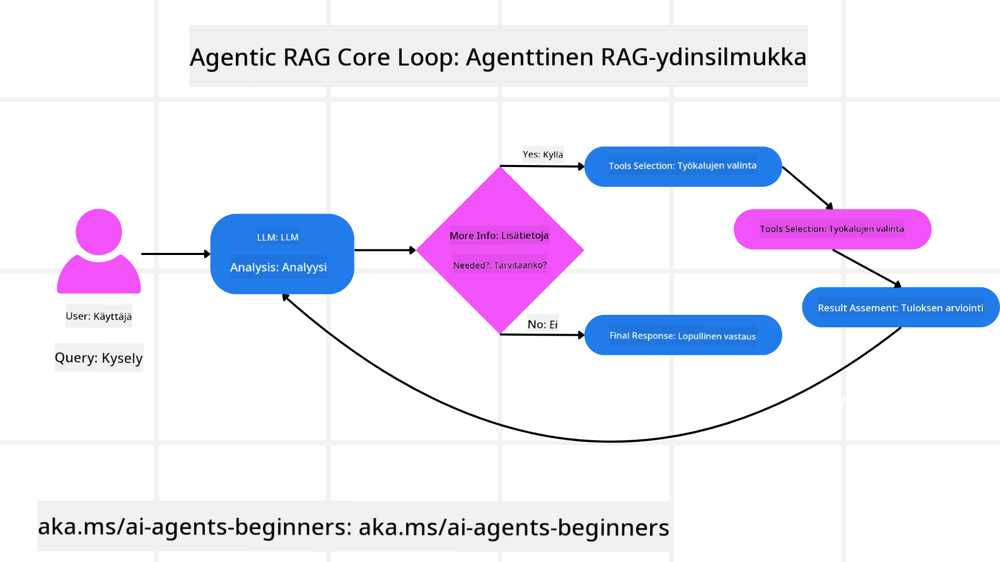
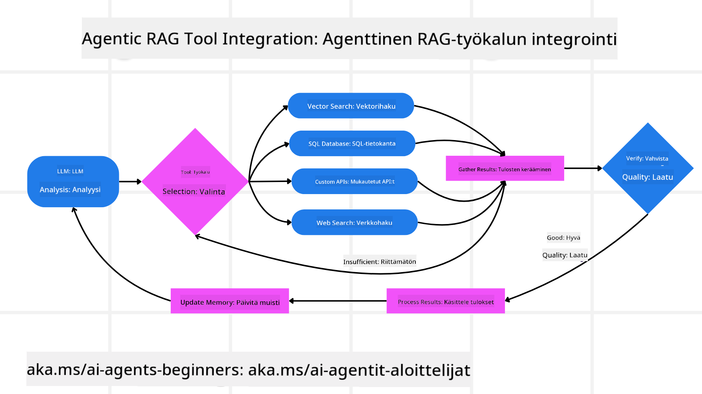
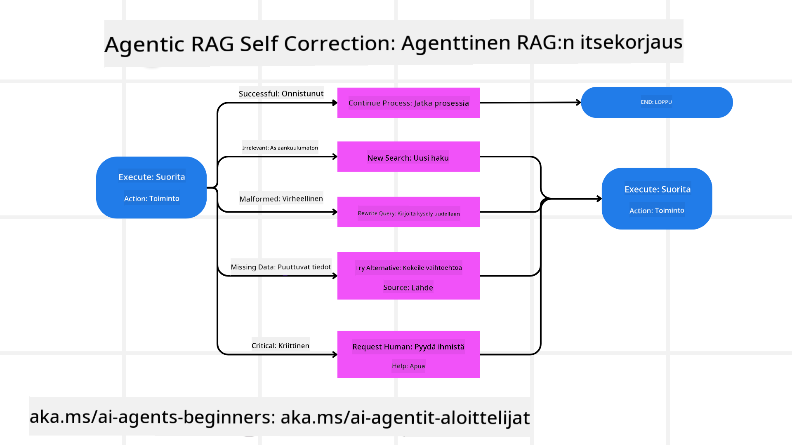

<!--
CO_OP_TRANSLATOR_METADATA:
{
  "original_hash": "7622aa72f9e676e593339f5f694ecd7d",
  "translation_date": "2025-07-12T10:05:57+00:00",
  "source_file": "05-agentic-rag/README.md",
  "language_code": "fi"
}
-->

> _(Napsauta yllä olevaa kuvaa nähdäksesi tämän oppitunnin videon)_

# Agentic RAG

Tämä oppitunti tarjoaa kattavan yleiskatsauksen Agentic Retrieval-Augmented Generationiin (Agentic RAG), nousevaan tekoälyparadigmaan, jossa suuret kielimallit (LLM) suunnittelevat itsenäisesti seuraavia askeleitaan samalla kun ne hakevat tietoa ulkoisista lähteistä. Toisin kuin staattiset hakemisen ja lukemisen mallit, Agentic RAG sisältää toistuvia LLM-kutsuja, joita vuorottelevat työkalujen tai funktioiden kutsut sekä jäsennellyt tulosteet. Järjestelmä arvioi tulokset, tarkentaa kyselyjä, kutsuu tarvittaessa lisätyökaluja ja jatkaa tätä sykliä, kunnes tyydyttävä ratkaisu on saavutettu.

## Johdanto

Tässä oppitunnissa käsitellään

- **Agentic RAG:n ymmärtäminen:** Tutustu tekoälyn uuteen paradigmaan, jossa suuret kielimallit suunnittelevat itsenäisesti seuraavia askeleitaan samalla kun ne hakevat tietoa ulkoisista tietolähteistä.
- **Iteratiivinen Maker-Checker-tyyli:** Ymmärrä toistuvien LLM-kutsujen silmukka, jota vuorottelevat työkalujen tai funktioiden kutsut ja jäsennellyt tulosteet, tarkoituksena parantaa oikeellisuutta ja käsitellä virheellisiä kyselyjä.
- **Käytännön sovellusten tutkiminen:** Tunnista tilanteet, joissa Agentic RAG loistaa, kuten oikeellisuuteen painottuvat ympäristöt, monimutkaiset tietokantaintegraatiot ja laajennetut työnkulut.

## Oppimistavoitteet

Oppitunnin suorittamisen jälkeen osaat/ymmärrät:

- **Agentic RAG:n ymmärtäminen:** Tutustu tekoälyn uuteen paradigmaan, jossa suuret kielimallit suunnittelevat itsenäisesti seuraavia askeleitaan samalla kun ne hakevat tietoa ulkoisista tietolähteistä.
- **Iteratiivinen Maker-Checker-tyyli:** Ymmärrä toistuvien LLM-kutsujen silmukka, jota vuorottelevat työkalujen tai funktioiden kutsut ja jäsennellyt tulosteet, tarkoituksena parantaa oikeellisuutta ja käsitellä virheellisiä kyselyjä.
- **Päätöksenteon hallinta:** Ymmärrä järjestelmän kyky hallita omaa päättelyprosessiaan, tehdä päätöksiä ongelmien lähestymistavasta ilman ennalta määriteltyjä polkuja.
- **Työnkulku:** Ymmärrä, miten agenttipohjainen malli itsenäisesti päättää hakea markkinatrendiraportteja, tunnistaa kilpailijatietoja, yhdistää sisäisiä myyntimittareita, synteettisesti kokoaa löydökset ja arvioi strategian.
- **Iteratiiviset silmukat, työkalujen integrointi ja muisti:** Tutustu järjestelmän silmukkamalliin, joka ylläpitää tilaa ja muistia vaiheiden välillä välttääkseen toistuvia silmukoita ja tehdäkseen perusteltuja päätöksiä.
- **Virhetilanteiden käsittely ja itsekorjaus:** Tutki järjestelmän vahvoja itsekorjausmekanismeja, kuten iterointia ja uudelleenkyselyä, diagnostiikkatyökalujen käyttöä ja ihmisen valvontaan turvautumista.
- **Agentuuriin liittyvät rajat:** Ymmärrä Agentic RAG:n rajoitukset, keskittyen toimialakohtaiseen autonomiaan, infrastruktuuririippuvuuteen ja turvarajojen kunnioittamiseen.
- **Käytännön käyttötapaukset ja arvo:** Tunnista tilanteet, joissa Agentic RAG loistaa, kuten oikeellisuuteen painottuvat ympäristöt, monimutkaiset tietokantaintegraatiot ja laajennetut työnkulut.
- **Hallinto, läpinäkyvyys ja luottamus:** Tutustu hallinnon ja läpinäkyvyyden merkitykseen, mukaan lukien selitettävä päättely, harhan hallinta ja ihmisen valvonta.

## Mikä on Agentic RAG?

Agentic Retrieval-Augmented Generation (Agentic RAG) on nouseva tekoälyparadigma, jossa suuret kielimallit (LLM) suunnittelevat itsenäisesti seuraavia askeleitaan samalla kun ne hakevat tietoa ulkoisista lähteistä. Toisin kuin staattiset hakemisen ja lukemisen mallit, Agentic RAG sisältää toistuvia LLM-kutsuja, joita vuorottelevat työkalujen tai funktioiden kutsut sekä jäsennellyt tulosteet. Järjestelmä arvioi tulokset, tarkentaa kyselyjä, kutsuu tarvittaessa lisätyökaluja ja jatkaa tätä sykliä, kunnes tyydyttävä ratkaisu on saavutettu. Tämä iteratiivinen ”maker-checker” -tyyli parantaa oikeellisuutta, käsittelee virheellisiä kyselyjä ja varmistaa korkealaatuiset tulokset.

Järjestelmä hallitsee aktiivisesti omaa päättelyprosessiaan, kirjoittaa epäonnistuneet kyselyt uudelleen, valitsee erilaisia hakumenetelmiä ja integroi useita työkaluja — kuten vektorihakua Azure AI Searchissa, SQL-tietokantoja tai räätälöityjä API-rajapintoja — ennen vastauksen lopullista muodostamista. Agenttijärjestelmän erottava piirre on sen kyky hallita omaa päättelyprosessiaan. Perinteiset RAG-toteutukset luottavat ennalta määriteltyihin polkuihin, mutta agenttijärjestelmä päättää itsenäisesti askeleiden järjestyksen löydetyn tiedon laadun perusteella.

## Agentic Retrieval-Augmented Generationin (Agentic RAG) määritelmä

Agentic Retrieval-Augmented Generation (Agentic RAG) on tekoälyn kehityksen uusi paradigma, jossa LLM:t eivät ainoastaan hae tietoa ulkoisista tietolähteistä, vaan myös suunnittelevat itsenäisesti seuraavia askeleitaan. Toisin kuin staattiset hakemisen ja lukemisen mallit tai huolellisesti käsikirjoitetut kehotteet, Agentic RAG sisältää toistuvan silmukan LLM-kutsuja, joita vuorottelevat työkalujen tai funktioiden kutsut ja jäsennellyt tulosteet. Järjestelmä arvioi jokaisella kierroksella saamansa tulokset, päättää, tarvitseeko kyselyjä tarkentaa, kutsuu tarvittaessa lisätyökaluja ja jatkaa tätä sykliä, kunnes tyydyttävä ratkaisu on saavutettu.

Tämä iteratiivinen ”maker-checker” -tyyli on suunniteltu parantamaan oikeellisuutta, käsittelemään virheellisiä kyselyjä jäsenneltyihin tietokantoihin (esim. NL2SQL) ja varmistamaan tasapainoiset, korkealaatuiset tulokset. Sen sijaan, että luotettaisiin pelkästään huolellisesti suunniteltuihin kehotteiden ketjuihin, järjestelmä hallitsee aktiivisesti omaa päättelyprosessiaan. Se voi kirjoittaa epäonnistuneet kyselyt uudelleen, valita erilaisia hakumenetelmiä ja integroida useita työkaluja — kuten vektorihakua Azure AI Searchissa, SQL-tietokantoja tai räätälöityjä API-rajapintoja — ennen vastauksen lopullista muodostamista. Tämä poistaa tarpeen monimutkaisille orkestrointikehyksille. Sen sijaan suhteellisen yksinkertainen silmukka ”LLM-kutsu → työkalun käyttö → LLM-kutsu → …” voi tuottaa kehittyneitä ja hyvin perusteltuja tuloksia.

## Päättelyprosessin hallinta

Järjestelmän erottava ominaisuus, joka tekee siitä ”agenttisen”, on sen kyky hallita omaa päättelyprosessiaan. Perinteiset RAG-toteutukset usein riippuvat ihmisistä, jotka määrittelevät mallille polun: ajatusketjun, joka kertoo, mitä haetaan ja milloin.  
Mutta kun järjestelmä on todella agenttinen, se päättää sisäisesti, miten ongelmaan lähestytään. Se ei vain suorita käsikirjoitusta, vaan määrittää itsenäisesti askeleiden järjestyksen löydetyn tiedon laadun perusteella.  
Esimerkiksi, jos sitä pyydetään luomaan tuotteen lanseerausstrategia, se ei luota pelkästään kehotteeseen, joka määrittelee koko tutkimus- ja päätöksentekoprosessin. Sen sijaan agenttipohjainen malli päättää itsenäisesti:

1. Hakea ajantasaiset markkinatrendiraportit Bing Web Groundingin avulla  
2. Tunnistaa olennaiset kilpailijatiedot Azure AI Searchin avulla  
3. Yhdistää historialliset sisäiset myyntimittarit Azure SQL Databasea käyttäen  
4. Synteettisesti koota löydökset yhtenäiseksi strategiaksi, jota koordinoi Azure OpenAI Service  
5. Arvioida strategia aukkojen tai epäjohdonmukaisuuksien varalta ja tarvittaessa käynnistää uusi hakukierros  
Kaikki nämä vaiheet — kyselyjen tarkentaminen, lähteiden valinta, iterointi kunnes vastaus on ”tyydyttävä” — päätetään mallin toimesta, ei ihmisen ennalta käsikirjoittamina.

## Iteratiiviset silmukat, työkalujen integrointi ja muisti

Agenttipohjainen järjestelmä perustuu silmukkamaiseen vuorovaikutusmalliin:

- **Alkukutsu:** Käyttäjän tavoite (eli käyttäjän kehotus) esitetään LLM:lle.  
- **Työkalun kutsu:** Jos malli havaitsee puuttuvaa tietoa tai epäselviä ohjeita, se valitsee työkalun tai hakumenetelmän — kuten vektoritietokantakyselyn (esim. Azure AI Search Hybrid -haku yksityisissä tiedoissa) tai jäsennellyn SQL-kyselyn — saadakseen lisää kontekstia.  
- **Arviointi ja tarkentaminen:** Saatuaan palautetun datan malli päättää, riittääkö tieto. Jos ei, se tarkentaa kyselyä, kokeilee eri työkalua tai muuttaa lähestymistapaansa.  
- **Toistetaan, kunnes tyytyväinen:** Tätä sykliä jatketaan, kunnes malli katsoo, että sillä on riittävästi selkeyttä ja näyttöä antaakseen lopullisen, hyvin perustellun vastauksen.  
- **Muisti ja tila:** Koska järjestelmä ylläpitää tilaa ja muistia vaiheiden välillä, se voi muistaa aiemmat yritykset ja niiden tulokset, välttäen toistuvia silmukoita ja tehden perustellumpia päätöksiä edetessään.

Ajan myötä tämä luo kehittyvän ymmärryksen tunteen, joka mahdollistaa mallin navigoida monimutkaisissa, monivaiheisissa tehtävissä ilman, että ihmisen tarvitsee jatkuvasti puuttua peliin tai muokata kehotetta.

## Virhetilanteiden käsittely ja itsekorjaus

Agentic RAG:n autonomia sisältää myös vahvat itsekorjausmekanismit. Kun järjestelmä kohtaa umpikujiin — kuten epäolennaisten dokumenttien hakemiseen tai virheellisiin kyselyihin — se voi:

- **Iteroida ja uudelleenkysellä:** Sen sijaan, että palauttaisi vähäarvoisia vastauksia, malli kokeilee uusia hakustrategioita, kirjoittaa tietokantakyselyt uudelleen tai tarkastelee vaihtoehtoisia tietoaineistoja.  
- **Käyttää diagnostiikkatyökaluja:** Järjestelmä voi kutsua lisätoimintoja, jotka auttavat virheiden jäljittämisessä tai haetun datan oikeellisuuden varmistamisessa. Työkalut kuten Azure AI Tracing ovat tärkeitä vahvan havaittavuuden ja valvonnan mahdollistamiseksi.  
- **Turvautua ihmisen valvontaan:** Korkean riskin tai toistuvasti epäonnistuvissa tilanteissa malli voi merkitä epävarmuuden ja pyytää ihmisen ohjausta. Kun ihminen antaa korjaavaa palautetta, malli voi sisällyttää opitun jatkossa.

Tämä iteratiivinen ja dynaaminen lähestymistapa mahdollistaa mallin jatkuvan parantamisen, varmistaen, ettei kyse ole vain yksittäisestä suorituksesta, vaan oppivasta järjestelmästä, joka kehittyy virheistään kyseisen istunnon aikana.

## Agentuuriin liittyvät rajat

Vaikka Agentic RAG on autonominen tehtävässään, se ei ole verrattavissa yleisälyyn (Artificial General Intelligence). Sen ”agenttikyvyt” rajoittuvat ihmisten kehittämiin työkaluihin, tietolähteisiin ja sääntöihin. Se ei voi keksiä omia työkalujaan tai astua asetettujen toimialarajojen ulkopuolelle. Sen sijaan se loistaa dynaamisessa resurssien orkestroinnissa.

Keskeiset erot kehittyneempiin tekoälymuotoihin ovat:

1. **Toimialakohtainen autonomia:** Agentic RAG -järjestelmät keskittyvät käyttäjän määrittämien tavoitteiden saavuttamiseen tunnetussa toimialassa, käyttäen strategioina kyselyjen uudelleenkirjoitusta tai työkalujen valintaa tulosten parantamiseksi.  
2. **Infrastruktuuririippuvuus:** Järjestelmän kyvyt perustuvat kehittäjien integroimiin työkaluihin ja datoihin. Se ei voi ylittää näitä rajoja ilman ihmisen puuttumista.  
3. **Turvarajojen kunnioitus:** Eettiset ohjeistukset, sääntelyvaatimukset ja liiketoimintapolitiikat ovat erittäin tärkeitä. Agentin vapaus on aina rajattu turvallisuus- ja valvontamekanismeilla (toivottavasti).

## Käytännön käyttötapaukset ja arvo

Agentic RAG loistaa tilanteissa, jotka vaativat iteratiivista tarkentamista ja tarkkuutta:

1. **Oikeellisuuteen painottuvat ympäristöt:** Sääntelyn tarkastuksissa, lakianalyyseissä tai oikeudellisessa tutkimuksessa agenttipohjainen malli voi toistuvasti varmistaa faktoja, konsultoida useita lähteitä ja kirjoittaa kyselyt uudelleen, kunnes se tuottaa perusteellisesti tarkistetun vastauksen.  
2. **Monimutkaiset tietokantaintegraatiot:** Kun käsitellään jäsenneltyä dataa, jossa kyselyt usein epäonnistuvat tai vaativat säätöä, järjestelmä voi itsenäisesti tarkentaa kyselyjään Azure SQL:n tai Microsoft Fabric OneLaken avulla varmistaen, että lopullinen haku vastaa käyttäjän tarkoitusta.  
3. **Laajennetut työnkulut:** Pidemmät istunnot voivat kehittyä uusien tietojen ilmaantuessa. Agentic RAG voi jatkuvasti sisällyttää uutta dataa ja muuttaa strategioita oppiessaan lisää ongelma-alueesta.

## Hallinto, läpinäkyvyys ja luottamus

Kun nämä järjestelmät muuttuvat yhä autonomisemmiksi päättelyssään, hallinto ja läpinäkyvyys ovat ratkaisevan tärkeitä:

- **Selitettävä päättely:** Malli voi tarjota auditointijäljen tekemistään kyselyistä, konsultoiduista lähteistä ja päättelyvaiheista, jotka johtivat sen johtopäätökseen. Työkalut kuten Azure AI Content Safety ja Azure AI Tracing / GenAIOps auttavat ylläpitämään läpinäkyvyyttä ja vähentämään riskejä.  
- **Harhan hallinta ja tasapainoinen haku:** Kehittäjät voivat säätää hakustrategioita varmistaakseen, että tasapainoiset ja edustavat tietolähteet otetaan huomioon, ja säännöllisesti tarkastaa tuloksia harhan tai vinoutuneiden mallien havaitsemiseksi käyttäen räätälöityjä malleja edistyneille data-analytiikkayrityksille Azure Machine Learningin avulla.  
- **Ihmisen valvonta ja sääntöjen noudattaminen:** Herkillä alueilla ihmisen tarkastus on edelleen välttämätöntä. Agentic RAG ei korvaa ihmisen harkintaa korkean riskin päätöksissä — se täydentää sitä tarjoamalla perusteellisemmin tarkistettuja vaihtoehtoja.

On olennaista, että käytössä on työkalut, jotka tarjoavat selkeän toimintalokin. Ilman niitä monivaiheisen prosessin virheenkorjaus voi olla erittäin vaikeaa. Katso seuraava esimerkki Literal AI:lta (

- <a href="https://learn.microsoft.com/azure/ai-studio/concepts/evaluation-approach-gen-ai" target="_blank">Generatiivisten tekoälysovellusten arviointi Azure AI Foundryn avulla: Tässä artikkelissa käsitellään mallien arviointia ja vertailua julkisesti saatavilla olevien aineistojen pohjalta, mukaan lukien Agentic AI -sovellukset ja RAG-arkkitehtuurit</a>
- <a href="https://weaviate.io/blog/what-is-agentic-rag" target="_blank">Mikä on Agentic RAG | Weaviate</a>
- <a href="https://ragaboutit.com/agentic-rag-a-complete-guide-to-agent-based-retrieval-augmented-generation/" target="_blank">Agentic RAG: Täydellinen opas agenttipohjaiseen hakua täydentävään generointiin – Uutisia generation RAG:sta</a>
- <a href="https://huggingface.co/learn/cookbook/agent_rag" target="_blank">Agentic RAG: tehosta RAG-järjestelmääsi kyselyjen uudelleenmuotoilulla ja itsearvioinnilla! Hugging Face Open-Source AI Cookbook</a>
- <a href="https://youtu.be/aQ4yQXeB1Ss?si=2HUqBzHoeB5tR04U" target="_blank">Agenttikerrosten lisääminen RAG:iin</a>
- <a href="https://www.youtube.com/watch?v=zeAyuLc_f3Q&t=244s" target="_blank">Tulevaisuuden tiedonavustajat: Jerry Liu</a>
- <a href="https://www.youtube.com/watch?v=AOSjiXP1jmQ" target="_blank">Miten rakentaa Agentic RAG -järjestelmiä</a>
- <a href="https://ignite.microsoft.com/sessions/BRK102?source=sessions" target="_blank">Azure AI Foundry Agent Service -palvelun käyttö tekoälyagenttien skaalaamiseen</a>

### Tieteelliset artikkelit

- <a href="https://arxiv.org/abs/2303.17651" target="_blank">2303.17651 Self-Refine: Iteratiivinen parantaminen itsearvioinnin avulla</a>
- <a href="https://arxiv.org/abs/2303.11366" target="_blank">2303.11366 Reflexion: Kielen agentit verbaalisella vahvistusoppimisella</a>
- <a href="https://arxiv.org/abs/2305.11738" target="_blank">2305.11738 CRITIC: Suuret kielimallit voivat korjata itseään työkalupohjaisella kritiikillä</a>
- <a href="https://arxiv.org/abs/2501.09136" target="_blank">2501.09136 Agentic Retrieval-Augmented Generation: Katsaus Agentic RAG:iin</a>

## Edellinen oppitunti

[Tool Use Design Pattern](../04-tool-use/README.md)

## Seuraava oppitunti

[Building Trustworthy AI Agents](../06-building-trustworthy-agents/README.md)

**Vastuuvapauslauseke**:  
Tämä asiakirja on käännetty käyttämällä tekoälypohjaista käännöspalvelua [Co-op Translator](https://github.com/Azure/co-op-translator). Vaikka pyrimme tarkkuuteen, huomioithan, että automaattikäännöksissä saattaa esiintyä virheitä tai epätarkkuuksia. Alkuperäistä asiakirjaa sen alkuperäiskielellä tulee pitää virallisena lähteenä. Tärkeissä asioissa suositellaan ammattimaista ihmiskäännöstä. Emme ole vastuussa tämän käännöksen käytöstä aiheutuvista väärinymmärryksistä tai tulkinnoista.